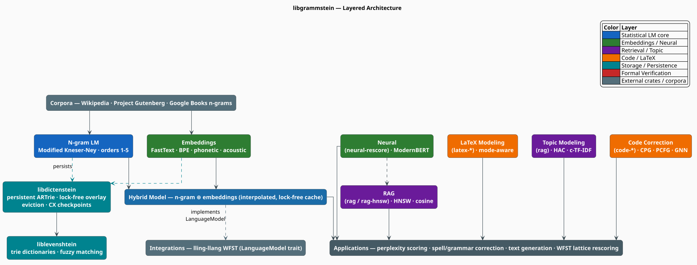
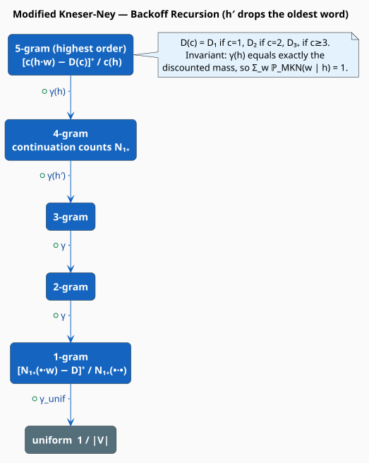
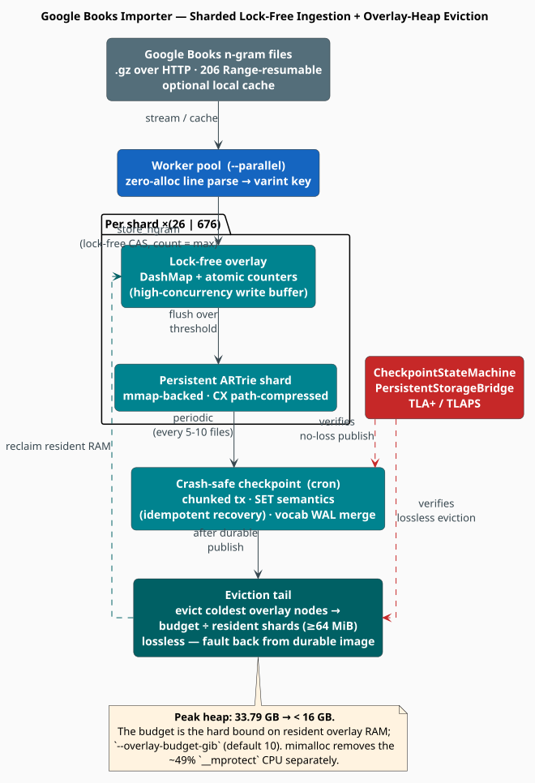
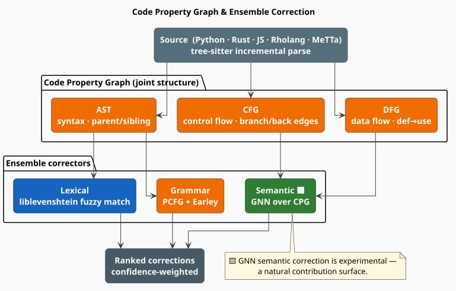
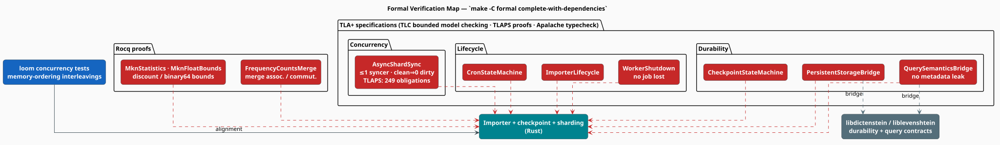

# libgrammstein

**A multi-paradigm, formally-verified language-modeling toolkit in Rust** — a state-of-the-art
Modified Kneser-Ney n-gram core that scales losslessly to the *entire* Google Books n-gram
corpus, layered up through subword/neural embeddings, retrieval, topic discovery, and
structured-domain (code & LaTeX) correction.


---

## Why libgrammstein?

- **A rigorous statistical core.** Orders 1–5 with **Modified Kneser-Ney (MKN)** smoothing —
  the most accurate count-based smoothing known — over compact varint-indexed trie storage. → [jump](#statistical-core-modified-kneser-ney)
- **It eats the Google Books n-gram corpus.** A sharded, lock-free importer ingests
  billions of n-grams under a **hard heap bound** (a naïve build exhausts memory at 33.79 GB; the bounded
  build stays **< 16 GB**, losslessly). → [jump](#systems-flagship-the-google-books-importer)
- **It is *formally verified*.** The importer's concurrency, crash-recovery, and durability
  invariants are machine-checked with **TLA+ / TLAPS / Apalache** and **Rocq** — not just
  tested. → [jump](#formal-verification)
- **One stack, statistics → neural → retrieval → code.** Hybrid n-gram⊕embedding scoring,
  ModernBERT rescoring, HNSW retrieval, BERTopic-style topic modeling, and multi-language code
  correction over Code Property Graphs — composable behind Cargo feature flags. → [jump](#capability-matrix)
- **Built for concurrency.** Lock-free overlays, atomics, persistent (copy-on-write) tries,
  `Send + Sync` throughout, and a `mimalloc` global allocator that erases syscall overhead.

---

## At a Glance

libgrammstein is organized as **layers**: a persistent-storage foundation, a statistical +
embedding core, a hybrid scorer, and a fan of higher-level capabilities (neural, retrieval,
topic, code, LaTeX) that a developer enables à la carte via Cargo features. Everything is
`Send + Sync`; the heavy data structures live in memory-mapped, crash-safe tries.



Four components get a **full pedagogical treatment** below (math, pseudocode, diagram,
citations); the rest are summarized in the [Capability Matrix](#capability-matrix) and covered
in depth under [`docs/`](docs/README.md). The color legend above is used consistently in every
diagram.

---

## Core Concepts & Notation

Every symbol below is reused across sections; component-local terms are defined where they
first appear. (Acronyms are expanded on first prose use even if listed here.)

| Symbol               | Meaning                                        | Symbol   | Meaning                                            |
|----------------------|------------------------------------------------|----------|----------------------------------------------------|
| `w`                  | word (token) being predicted                   | `[x]⁺`   | `max(x, 0)`                                        |
| `h`                  | history / context (preceding words)            | `N₁₊(·)` | continuation count — number of *distinct* contexts |
| `h′`                 | backed-off history (`h` minus its oldest word) | `α`, `λ` | interpolation weight(s), `∈ [0,1]`                 |
| `c(·)`               | raw training count of an n-gram                | `τ`      | temperature (softmax sharpness)                    |
| `∣V∣`                | vocabulary size                                | `ε`      | approximate-search recall tolerance                |
| `D`, `D₁`/`D₂`/`D₃₊` | absolute discount(s)                           | `d`      | embedding dimensionality                           |
| `γ(h)`               | backoff weight for history `h`                 | `ℙ`, `Σ` | probability, summation                             |

| Acronym      | Expansion                                | Acronym         | Expansion                                                   |
|--------------|------------------------------------------|-----------------|-------------------------------------------------------------|
| **MKN**      | Modified Kneser-Ney smoothing            | **CPG**         | Code Property Graph                                         |
| **MLE**      | Maximum-Likelihood Estimate              | **AST/CFG/DFG** | Abstract-Syntax-Tree / Control-Flow-Graph / Data-Flow-Graph |
| **OOV**      | Out-Of-Vocabulary                        | **PCFG**        | Probabilistic Context-Free Grammar                          |
| **PP**       | Perplexity                               | **GNN**         | Graph Neural Network                                        |
| **WFST**     | Weighted Finite-State Transducer         | **MLM**         | Masked Language Model                                       |
| **RAG**      | Retrieval-Augmented Generation           | **MMR**         | Maximal Marginal Relevance                                  |
| **ANN**      | Approximate Nearest Neighbor             | **BPE**         | Byte-Pair Encoding                                          |
| **HNSW**     | Hierarchical Navigable Small-World graph | **MFCC**        | Mel-Frequency Cepstral Coefficients                         |
| **HAC**      | Hierarchical Agglomerative Clustering    | **ARTrie**      | Adaptive Radix Trie (persistent)                            |
| **c-TF-IDF** | class-based TF-IDF                       | **WAL**         | Write-Ahead Log                                             |

**Maturity legend** (used throughout): 🟦 Flagship (battle-tested) · 🟩 Stable · 🟨 Experimental
/ brings-your-own-weights · ⬜ Deprecated.

---

## Installation & Feature Map

libgrammstein is a **workspace crate** that depends on sibling repositories via local paths
(it is not yet published to crates.io). Clone it alongside its siblings and depend on it by
path or git:

```toml
[dependencies]
# Required siblings: ../liblevenshtein-rust, ../libdictenstein, ../PathMap, ../lling-llang
libgrammstein = { path = "../libgrammstein", features = ["cli", "rag", "code-mainstream"] }
```

The default build is the **always-on statistical + embedding + hybrid core**. Everything else
is feature-gated, so you compile only what you use:

| Feature                                                                | Unlocks                                                                      |
|------------------------------------------------------------------------|------------------------------------------------------------------------------|
| *(default)*                                                            | n-gram (MKN), subword embeddings, hybrid model, perplexity, corpus streaming |
| `google-books`                                                         | the sharded, checkpointed Google Books importer (+ `mimalloc`)               |
| `neural-rescore`                                                       | ModernBERT embeddings, MLM rescoring, MMR summarization (Candle)             |
| `rag` / `rag-hnsw`                                                     | retrieval index — exact cosine / HNSW; topic modeling                        |
| `code` · `code-{python,rust,javascript,rholang,metta}` · `code-neural` | code correction                                                              |
| `latex` / `latex-neural` / `latex-rag`                                 | mode-aware LaTeX modeling                                                    |
| `acoustic` / `candle-model` / `gpu`                                    | MFCC features / neural acoustic models / GPU kernels                         |
| `lling-llang-integration`                                              | `LanguageModel` trait + WFST export for lattice rescoring                    |
| `cli`                                                                  | the `grammstein` binary + terminal UI                                        |

The full surface is in the [Capability Matrix](#capability-matrix).

---

## Quick Start

**1 · Train an n-gram model and measure perplexity.** Perplexity `PP(W) = exp(−(1/N)·Σᵢ log
ℙ(wᵢ ∣ hᵢ))` is the standard fit metric — lower is better.

```rust
use libgrammstein::ngram::{NgramEntry, TrainerBuilder};
use libgrammstein::scoring::Perplexity;
use libgrammstein::corpus::PlaintextReader;
use liblevenshtein::dictionary::dynamic_dawg_char::DynamicDawgChar;

let train = PlaintextReader::from_file("corpus.txt")?;
// A 5-gram model with Modified Kneser-Ney smoothing, over a serializable trie backend.
let model = TrainerBuilder::new(DynamicDawgChar::<NgramEntry>::new())
    .order(5)
    .train(train)?;

let log_p = model.log_prob("fox", &["quick", "brown"]);     // log ℙ(fox ∣ quick brown)
let dev   = PlaintextReader::from_file("dev.txt")?;
let ppl   = Perplexity::new(&model).corpus_perplexity(&dev)?;
println!("log ℙ = {log_p:.3} · perplexity = {:.1}", ppl.perplexity);
```

**2 · Combine n-gram precision with embedding coverage (the hybrid model).**

```rust
use libgrammstein::hybrid::{HybridConfig, HybridLanguageModel};

// `ngram` + `embedding` trained as above; see "Hybrid Interpolation" for the embedding builder.
let hybrid = HybridLanguageModel::new(ngram, embedding, HybridConfig::default());
let s = hybrid.score("brown", &["the", "quick"]);           // robust even if "brown" is rare
```

**3 · Ingest the Google Books n-gram corpus under a heap bound (one command).**

```bash
grammstein train import-google-books english.artrie \
    --language en --min-order 1 --max-order 5 \
    --parallel 8 --overlay-budget-gib 12 --cache-files
```

---

# The Flagships

Four components earn a full treatment. The rest are mapped in the [Capability Matrix](#capability-matrix).

## Statistical Core: Modified Kneser-Ney

**What & why.** An n-gram model estimates `ℙ(w ∣ h)` — the probability of the next word `w`
given a history `h`. The naïve **Maximum-Likelihood Estimate (MLE)**

```
ℙ_MLE(w ∣ h) = c(h·w) / c(h)          (M1)
```

assigns **zero** probability to any n-gram never seen in training, which makes `log ℙ = −∞` for
a whole sentence the moment one unseen n-gram appears. *Smoothing* fixes this by stealing a
little probability mass from seen events and redistributing it to unseen ones. **Modified
Kneser-Ney** [1, 2] is the most accurate count-based smoother known, and is libgrammstein's
always-on core.

**How.** MKN subtracts a count-dependent **absolute discount** and *backs off* to a
shorter context, recursively. The discounts are estimated from the corpus's count-of-counts
`nᵢ = #{n-grams occurring exactly i times}`:

```
Y  = n₁ / (n₁ + 2·n₂)
D₁ = 1 − 2Y·(n₂/n₁) ,  D₂ = 2 − 3Y·(n₃/n₂) ,  D₃₊ = 3 − 4Y·(n₄/n₃)      (M2)
```

(typically `D₁ ≈ 0.6, D₂ ≈ 0.8, D₃₊ ≈ 0.9`). The highest-order estimate discounts then backs
off with weight `γ(h)`:

```
ℙ_MKN(w ∣ h) = [c(h·w) − D(c(h·w))]⁺ / c(h)  +  γ(h)·ℙ_MKN(w ∣ h′)        (M3)
   where  D(c) = D₁ if c=1,  D₂ if c=2,  D₃₊ if c≥3 ;   h′ = h without its oldest word
γ(h) = (D₁·N₁(h) + D₂·N₂(h) + D₃₊·N₃₊(h)) / c(h)                          (M4)
```

Lower orders use **continuation counts** `N₁₊` — *how many distinct contexts a word completes*
— instead of raw counts, bottoming out at a uniform base:

```
N₁₊(•·h·w) = ∣{ v : c(v·h·w) > 0 }∣                                       (M5)
ℙ_MKN(w)   = [N₁₊(•·w) − D]⁺ / N₁₊(•·•)  +  γ_unif·(1/∣V∣)
```

This is the **"San Francisco" intuition**: *Francisco* is frequent but follows only *San*, so
its continuation count is ~1; *city* follows many words, so it earns a higher fallback
probability. Continuation counts measure **versatility**, not raw frequency.



**The algorithm**, literately — scoring is a single recursion from the longest matching context
down to the uniform base:

```
function MKN_log_prob(w, h):                       ▸ public entry point; returns log ℙ
    return ln( prob(w, h, highest_order = true) )

function prob(w, h, highest_order):
    if h not found in trie:                        ▸ no evidence at this order …
        return prob(w, h′, highest_order = false)  ▸ … so back off (drop oldest word of h)
    c   ← count(h·w)
    D   ← discount(c)                              ▸ D₁ / D₂ / D₃₊  per (M2)
    top ← [c − D]⁺ / count(h)                      ▸ discounted higher-order mass (M3)
    γ   ← backoff_weight(h)                        ▸ exactly the mass removed by discounting (M4)
    return top + γ · prob(w, h′, highest_order = false)
    ▸ invariant: γ(h) equals the discounted mass, so Σ_w ℙ_MKN(w ∣ h) = 1 at every order.
```

**Engineering.** Keys are **vocabulary-indexed varints**: each word maps to a `u64`, LEB128-
encoded into compact Latin-1 trie keys (so a 13 M-word vocabulary costs 1–3 bytes/word, not a
string). Training streams the corpus with Rayon data-parallelism and atomic continuation-count
accumulation. → deep dive: [`docs/components/ngram/modified-kneser-ney.md`](docs/components/ngram/modified-kneser-ney.md).

## Hybrid Interpolation: Statistics ⊕ Semantics

**What & why.** N-gram models are razor-sharp on *seen* local context but blind to *unseen*
words; embeddings are the opposite — they generalize by meaning but lack precise local order.
Their failure modes are complementary, so libgrammstein **interpolates** them. The embedding
side is **FastText-style subword** [3, 4]: a word's vector is the sum of its character-n-gram
vectors, so even an OOV word like *splendiferous* has a meaningful representation.

**How.** `score(w ∣ h)` blends an n-gram probability `ℙₙ = ℙ_MKN(w ∣ h)` with an embedding
probability `ℙₑ ∝ cos(v_w, v_h)/τ` (cosine similarity of the word vector to the context vector,
temperature-scaled). Four strategies are available:

```
Linear:      ℙ = α·ℙₙ + (1−α)·ℙₑ
Log-Linear:  ℙ = exp( α·log ℙₙ + (1−α)·log ℙₑ )           ▸ for differing score scales
Fallback:    ℙ = ℙₙ  if w ∈ V_ngram  else  ℙₑ              ▸ n-gram when known, embed for OOV
Dynamic:     ℙ = α(h)·ℙₙ + (1−α(h))·ℙₑ ,  α(h) = min(α₀ + κ·∣h∣, α_max)   (M6)
```


The scorer dispatches on strategy and memoizes in a lock-free cache:

```
function hybrid_score(w, h):
    if (h, w) in cache: return cache[(h, w)]       ▸ DashMap probe — no lock on the hot path
    s ← match strategy:                            ▸ branch per (M6)
          Linear{α}    → α·Pₙ(w,h) + (1−α)·Pₑ(w,h)
          LogLinear{α} → exp(α·ln Pₙ + (1−α)·ln Pₑ)
          Fallback     → Pₙ if known(w) else Pₑ    ▸ exact local stats when available …
          Dynamic{…}   → linear with α growing in ∣h∣   ▸ … trust n-gram more as context grows
    cache.insert((h, w), s); return s              ▸ LRU-bounded; lock taken only on eviction
```

Log-linear is the right default when `ℙₙ` and `ℙₑ` live on different scales; `Dynamic` leans on
the n-gram as the context lengthens (where local statistics are most reliable). → deep dive:
[`docs/components/hybrid/interpolation.md`](docs/components/hybrid/interpolation.md).

## Systems Flagship: The Google Books Importer

**The war story.** The Google Books n-gram corpus is *enormous* — a single 2-gram prefix file
holds 50–100 M entries. A naïve importer exhausts memory at **~33.79 GB** peak heap and burns
**~49 % of CPU** in `__mprotect` syscalls. libgrammstein's importer ingests the whole corpus while holding
peak heap **under 16 GB**, losslessly. Here is how. *(feature: `google-books`)*



The mechanism is a small stack of cooperating ideas:

1. **Sharding** — n-grams route to **26** (1-gram) or **676** (2–5-gram) independent persistent
   ARTrie shards by first-token prefix, so writers rarely contend.
2. **Per-shard lock-free overlay** — a `DashMap` write-buffer fronts each shard's
   memory-mapped trie; ingestion is a lock-free compare-and-swap (`count = max`, idempotent).
3. **Chunked transactions** with **SET semantics** — a prefix commits in fixed-size chunks
   (`--tx-chunk-size`, default 500 K); re-importing a prefix after a crash overwrites with
   identical values, so recovery is idempotent.
4. **Crash-safe periodic checkpoints** (a cron loop) snapshot progress and flush overlays.
5. **Overlay-heap eviction** — *the load-bearing fix*. After each checkpoint, the tail evicts a
   shard's **coldest resident overlay nodes** down to its slice of the budget. Eviction is
   **lossless**: an evicted node faults back from the durable on-disk image on the next read.
6. **Supporting actors** — a single-merge vocabulary WAL (avoids a doubled reverse-index
   rebuild), **CX path-compressed** checkpoints, and the `mimalloc` allocator (which alone
   drops `__mprotect` from ~49 % to background noise).

The eviction tail, literately:

```
function checkpoint_tail(shard, G, resident_shards):
    publish_durable(shard.overlay)                 ▸ write the overlay snapshot to the durable image
    budget ← max(G / resident_shards, 64 MiB)      ▸ this shard's slice of --overlay-budget-gib (M10)
    while resident_bytes(shard) > budget:
        node ← coldest_resident(shard.overlay)
        assert node ∈ durable_image(shard)         ▸ SAFETY: never evict an un-persisted node …
        drop_resident(node)                        ▸ … so the drop is lossless (faults back on read)
        resident_bytes(shard) −= sizeof(node)
    ▸ invariant: evicted ⇔ durable. This is exactly what the TLA+ specs
    ▸ CheckpointStateMachine / PersistentStorageBridge machine-check (see Formal Verification).
```

These are not just "well-tested" invariants — they are **machine-checked** ([Formal
Verification](#formal-verification)). → deep dive:
[`docs/architecture/memory-optimization.md`](docs/architecture/memory-optimization.md) ·
[`docs/cli/import-google-books.md`](docs/cli/import-google-books.md).

## Approximate Retrieval: HNSW vs Exact Cosine

**What & why.** Semantic retrieval (the *R* in **RAG**, Retrieval-Augmented Generation) reduces
to nearest-neighbor search in embedding space: rank documents by **cosine similarity** to a
query vector. For unit-normalized vectors this is just a dot product:

```
cos(a, b) = (a·b) / (‖a‖·‖b‖) = â · b̂                                    (M7)
```

libgrammstein offers two backends with a clean accuracy/latency trade-off *(features: `rag`,
`rag-hnsw`)*:

| Backend                         | Query cost | Build cost   | Recall          | Use when            |
|---------------------------------|------------|--------------|-----------------|---------------------|
| **Exact cosine** (ndarray/BLAS) | `O(n·d)`   | `O(n)`       | 100 %           | `n ≲ 10⁶` documents |
| **HNSW** [7]                    | `O(log n)` | `O(n·log n)` | tunable via `ε` | `n ≳ 10⁶` documents |

**How HNSW works.** A **Hierarchical Navigable Small-World** graph stacks proximity graphs in
layers — sparse at the top, dense at the bottom (a skip-list for vectors). Search starts coarse
and refines downward:

```
function hnsw_search(q, k, ef):                    ▸ ef = breadth knob (recall vs speed)
    v ← entry_point(top_layer)
    for layer from top down to 1:                  ▸ coarse-to-fine descent
        v ← greedy_nearest(q, from = v, in = layer)▸ hop to the closest neighbor until no improvement
    C ← beam_search(q, from = v, in = layer_0, breadth = ef)   ▸ widen at the base layer
    return top_k(C, k)
    ▸ log-time because each upper layer halves the remaining search horizon.
```

`ef_search`, `M` (neighbors/node), and `ef_construction` trade recall for speed/memory; the
backend builds lazily on first query and is thread-safe. → deep dive:
[`docs/components/rag/backend.md`](docs/components/rag/backend.md).

## Code Property Graphs & Correction

**What & why.** Correcting source code needs *syntax*, *control flow*, **and** *data flow* at
once. A **Code Property Graph (CPG)** [9] fuses three classic representations into one joint
structure — the **AST** (Abstract Syntax Tree: nesting), the **CFG** (Control-Flow Graph:
branch/loop edges), and the **DFG** (Data-Flow Graph: definition→use edges) — so a single
traversal sees structure and behavior together. *(features: `code`, `code-{python,rust,javascript,rholang,metta}`)*



**How.** A `tree-sitter` incremental parse builds the CPG; an **ensemble of correctors** then
proposes ranked fixes:

```
function correct(source):
    cpg ← build_cpg(tree_sitter_parse(source))     ▸ AST ∪ CFG ∪ DFG in one graph
    candidates ←  lexical(cpg)                      ▸ fuzzy match vs dictionary (liblevenshtein)
               ∪  grammar(cpg)                      ▸ PCFG + Earley: is this a likely production?
               ∪  semantic(cpg)                     ▸ 🟨 GNN over the CPG: variable misuse, dead code
    return rank_by_confidence(candidates)
```

The grammar corrector scores edits under a **Probabilistic Context-Free Grammar (PCFG)** with
an Earley parser; the semantic corrector runs a **Graph Neural Network (GNN)** [10] over the
CPG. The GNN path is 🟨 **experimental** — a natural contribution surface. The same machinery
powers grammar-constrained decoding and WFST export, plus paradigm detection (PrefixSpan [13]),
subtree mining (TreeMiner [14]), and pretrained code embeddings (CodeT5+ / UniXcoder /
GraphCodeBERT, via ONNX). → deep dive: [`docs/components/code/cpg.md`](docs/components/code/cpg.md).

## Topic Modeling (BERTopic-style)

**What & why.** Given a corpus of document embeddings, recover human-readable **topics**
without a fixed topic count. libgrammstein follows the **BERTopic** recipe [8]: *embed →
cluster → describe*. *(feature: `rag`)*

**How.**

1. **Cluster** embeddings with **Hierarchical Agglomerative Clustering (HAC)** — iteratively
   merge the closest clusters under a Lance-Williams linkage (single / complete / average /
   **Ward**), yielding a dendrogram you can cut at any granularity.
2. **Describe** each cluster `c` with **class-based TF-IDF (c-TF-IDF)** — TF-IDF computed
   per-*cluster* rather than per-document, so the top-scoring terms are the cluster's keywords:

```
c-TF-IDF(t, c) = tf(t, c) · log( 1 + A / f(t) )                          (M8)
   tf(t, c) = frequency of term t in cluster c      A = average words per cluster
   f(t)     = number of clusters containing term t
```

A term scores high when it is frequent *in its cluster* yet rare *across* clusters — exactly
the words that name a topic. → deep dive:
[`docs/components/topic/ctfidf.md`](docs/components/topic/ctfidf.md).

---

# The Wider Toolkit

Beyond the flagships, libgrammstein spans the full NLP/ML pipeline. Each item below is a
one-line intuition + a deep-doc link; the [Capability Matrix](#capability-matrix) is the
at-a-glance view.

### Embeddings & Subword Models 🟩

FastText subword embeddings [4] (skip-gram [3] + negative sampling) with a fluent builder;
**BPE** subword tokenization [5]; **phonetic** embeddings (Zompist-style sound-change rules for
sound-alike similarity); and **acoustic word embeddings** from **MFCC**/mel-filterbank features
[6] (optionally a Candle neural encoder).

```rust
use libgrammstein::embedding::EmbeddingTrainerBuilder;
let embedding = EmbeddingTrainerBuilder::new()
    .dim(100).window_size(5).min_count(5).epochs(10)
    .train(reader)?;                 // or .train_streaming(|| reopen_reader()) for >500 MB corpora
let neighbors = embedding.most_similar("running", 10);
```

→ [`docs/components/embedding/overview.md`](docs/components/embedding/overview.md) ·
[`docs/components/acoustic/features.md`](docs/components/acoustic/features.md)

### Neural Rescoring & Summarization (ModernBERT) 🟨

A **ModernBERT** [11] wrapper (Candle + Hugging Face Hub) that rescores n-best beam paths by
**MLM pseudo-perplexity** (mask each token, score the prediction), produces document
embeddings, and runs extractive summarization via **Maximal Marginal Relevance (MMR)** [12] — a
relevance/novelty trade-off that suppresses redundancy. *Bring your own weights* (pulled from
HF Hub at runtime). *(feature: `neural-rescore`)* →
[`docs/components/neural/overview.md`](docs/components/neural/overview.md)

### LaTeX-Aware Modeling 🟨

A **mode-aware** tokenizer distinguishes math mode from text mode, feeding mode-weighted n-gram
models, command embeddings, optional ModernBERT rescoring, and equation retrieval. *(features:
`latex`, `latex-neural`, `latex-rag`)* → [`docs/components/`](docs/README.md)

---

## Integrations

libgrammstein implements [lling-llang](https://github.com/f1r3fly-io/lling-llang)'s
`LanguageModel` trait so any model here can rescore a **WFST** lattice [15] (lazy or eager
transducer export). Its storage rests on two sibling crates:
[liblevenshtein](https://github.com/f1r3fly-io/liblevenshtein-rust) (trie dictionaries + fuzzy
matching) and **libdictenstein** (the persistent ARTrie: lock-free overlay, CX path-compressed
checkpoints, and the overlay-heap eviction the importer relies on).

```rust
use libgrammstein::integration::GrammsteinLanguageModel;
use lling_llang::layers::{LanguageModelLayer, SpellingCorrectionLayer, LayerPipelineBuilder};

let lm = GrammsteinLanguageModel::from_hybrid(hybrid);          // wrap any model
let pipeline = LayerPipelineBuilder::new()
    .add_layer(SpellingCorrectionLayer::new(dictionary, 2))     // fuzzy candidates (liblevenshtein)
    .add_layer(LanguageModelLayer::new(Box::new(lm), 1.0))      // rescore with libgrammstein
    .build();
// "teh quikc brwon fox" → "the quick brown fox"
```

→ [`docs/integration/lling-llang/overview.md`](docs/integration/lling-llang/overview.md)

---

## Formal Verification

The importer's correctness-sensitive machinery — concurrency, crash recovery, checkpoint
durability, and query semantics — is **machine-checked**, not merely tested. This is a core
differentiator: the lossless-eviction invariant from the [importer](#systems-flagship-the-google-books-importer)
is a *proved* property.



- **TLA+** (Temporal Logic of Actions) — 7 live specifications model the protocols and are
  checked by **TLC** (bounded model checking) and typechecked by **Apalache**:

  | Concern     | Specification(s)                                                            | Verifies (examples)                                  |
  |-------------|-----------------------------------------------------------------------------|------------------------------------------------------|
  | Concurrency | `AsyncShardSync`                                                            | at most one syncer; *clean ⇒ zero dirty*             |
  | Lifecycle   | `ImporterLifecycle`, `WorkerShutdown`, `CronStateMachine`                   | phase ordering; no job lost; termination             |
  | Durability  | `CheckpointStateMachine`, `PersistentStorageBridge`, `QuerySemanticsBridge` | no-loss publish; lossless eviction; no metadata leak |

- **TLAPS** — machine-checked inductive proofs of the specs (e.g. `AsyncShardSync`: **249
  proof obligations** discharged).
- **Rocq** — `MknStatistics` / `MknFloatBounds` bound the MKN discounts and their `binary64`
  evaluation; `FrequencyCountsMerge` proves count-merge associativity/commutativity.
- **loom** — exhaustively explores concurrent memory-ordering interleavings in the Rust code.
- **Dependency bridges** connect these specs to libdictenstein/liblevenshtein durability
  contracts, so the high-level proofs rest on verified storage.

Reproduce the whole gate:

```bash
make -C formal complete-with-dependencies          # TLC + TLAPS + Apalache + Rocq + loom + alignment
```

→ [`formal/README.md`](formal/README.md)

---

## CLI & TUI

The `grammstein` binary (feature `cli`) drives training, evaluation, model inspection, corpus
processing, and the Google Books import — the last with a 🟨 live **ratatui** terminal UI
showing per-worker progress, checkpoint state, and vocabulary growth.

```bash
grammstein train ngram corpus.txt --order 5 -o model.bin   # train
grammstein eval perplexity model.bin dev.txt               # evaluate
grammstein train import-google-books en.artrie --language en --parallel 8   # import (+ TUI)
```

---

## Capability Matrix

Every subsystem, its Cargo feature(s), core algorithm, maturity, and deep doc.

| Subsystem           | What it does              | Cargo feature(s)           | Key algorithm / tech                       | Maturity | Deep doc                                                |
|---------------------|---------------------------|----------------------------|--------------------------------------------|----------|---------------------------------------------------------|
| N-gram LM           | next-word probability     | *default*                  | Modified Kneser-Ney [1,2]                  | 🟦       | [ngram](docs/components/ngram/modified-kneser-ney.md)   |
| Hybrid model        | n-gram ⊕ embeddings       | *default*                  | 4 interpolation strategies                 | 🟩       | [hybrid](docs/components/hybrid/interpolation.md)       |
| Embeddings          | dense word vectors        | *default*                  | FastText subword [3,4]                     | 🟩       | [embedding](docs/components/embedding/overview.md)      |
| BPE                 | subword tokenizer         | `subword`                  | Byte-Pair Encoding [5]                     | 🟩       | [bpe](docs/components/embedding/bpe.md)                 |
| Acoustic            | audio features / encoders | `acoustic`, `candle-model` | MFCC / mel-filterbank [6]                  | 🟩       | [acoustic](docs/components/acoustic/features.md)        |
| Neural rescore      | MLM rescoring, embeddings | `neural-rescore`           | ModernBERT [11]                            | 🟨       | [neural](docs/components/neural/overview.md)            |
| Summarization       | extractive summaries      | `neural-rescore`           | MMR [12]                                   | 🟨       | [summarizer](docs/components/neural/summarizer.md)      |
| RAG                 | semantic retrieval        | `rag`, `rag-hnsw`          | cosine / HNSW [7]                          | 🟩       | [rag](docs/components/rag/backend.md)                   |
| Topic modeling      | unsupervised topics       | `rag`                      | HAC + c-TF-IDF [8]                         | 🟩       | [topic](docs/components/topic/ctfidf.md)                |
| Code correction     | multi-language fixes      | `code`, `code-*`           | CPG [9] + PCFG + GNN [10]                  | 🟩 / 🟨  | [code](docs/components/code/cpg.md)                     |
| Code embeddings     | neural code vectors       | `code-neural`              | CodeT5+ / UniXcoder / GraphCodeBERT (ONNX) | 🟨       | [code-emb](docs/README.md)                              |
| Paradigm detection  | OOP/FP/… inference        | `code`                     | PrefixSpan [13]                            | 🟨       | [paradigm](docs/README.md)                              |
| Subtree mining      | frequent code patterns    | `code`                     | TreeMiner [14]                             | 🟨       | [subtree](docs/README.md)                               |
| LaTeX               | math-aware modeling       | `latex`, `latex-*`         | mode-aware n-gram + neural                 | 🟨       | [latex](docs/README.md)                                 |
| Importer            | Google Books ingestion    | `google-books`             | sharded ARTrie + eviction                  | 🟦       | [memory](docs/architecture/memory-optimization.md)      |
| Persistent storage  | crash-safe tries          | *(via libdictenstein)*     | overlay + CX + eviction                    | 🟦       | [data-flow](docs/architecture/data-flow.md)             |
| WFST integration    | lattice rescoring         | `lling-llang-integration`  | WFST export [15]                           | 🟩       | [lling-llang](docs/integration/lling-llang/overview.md) |
| CLI / TUI           | command-line tooling      | `cli`                      | clap + ratatui                             | 🟩 / 🟨  | [cli](docs/cli/import-google-books.md)                  |
| Formal verification | machine-checked proofs    | *(in `formal/`)*           | TLA+ · TLAPS · Apalache · Rocq             | 🟦       | [formal](formal/README.md)                              |

---

## Performance

Indicative single-thread microbenchmarks (hardware-specific; reproduce with
[`benches/`](benches) — `ngram_query`, `mkn_frequency_counts`, `overlay_eviction`,
`checkpoint_ops`, `varint_encoding`, `hash_comparison`):

| Operation                  | Time    |
|----------------------------|---------|
| N-gram probability query   | ~100 ns |
| Embedding lookup (cached)  | ~10 ns  |
| Hybrid score               | ~1 µs   |
| Sentence score (10 tokens) | ~10 µs  |

The Google Books importer's headline result is **bounded peak heap** (33.79 GB → < 16 GB) and
near-zero `__mprotect` overhead — see [the importer](#systems-flagship-the-google-books-importer).

---

## Project Layout

```text
src/
├── ngram/        # Modified Kneser-Ney n-gram model, varint vocabulary, trie storage
├── embedding/    # FastText subword · BPE · phonetic · acoustic · GPU
├── hybrid/       # n-gram ⊕ embedding interpolation + OOV handling
├── scoring/      # perplexity, sentence scoring        · generation/  # sampling
├── corpus/       # streaming readers (Wikipedia, Gutenberg, plaintext), dedup, quality
├── dictionary/   # word extraction, spelling dictionaries
├── sources/      # Google Books importer: sharding · storage · checkpoint · eviction  [google-books]
├── neural/       # ModernBERT embedder · rescorer · summarizer                        [neural-rescore]
├── rag/          # retrieval index: exact cosine · HNSW                               [rag]
├── topic/        # HAC clustering · c-TF-IDF · dendrogram                             [rag]
├── code/         # tree-sitter · CPG · PCFG · GNN · constrained decoding              [code]
├── latex/        # mode-aware tokenizer · n-gram · embeddings · equation RAG          [latex]
├── language/     # whatlang detection + language-aware tokenization
├── integration/  # lling-llang LanguageModel trait + WFST export                      [lling-llang-integration]
└── cli/          # the `grammstein` binary + ratatui TUI                              [cli]
formal/           # TLA+ / TLAPS / Apalache specs + Rocq proofs + loom tests
docs/             # deep component documentation (see docs/README.md)
```

---

## References

DOIs are linked and verified; arXiv-only works link their abstract page.

1. R. Kneser & H. Ney (1995). *Improved backing-off for M-gram language modeling.* ICASSP '95, 181–184. [doi:10.1109/ICASSP.1995.479394](https://doi.org/10.1109/ICASSP.1995.479394)
2. S. F. Chen & J. Goodman (1999). *An empirical study of smoothing techniques for language modeling.* Computer Speech & Language 13(4), 359–393. [doi:10.1006/csla.1999.0128](https://doi.org/10.1006/csla.1999.0128)
3. T. Mikolov, I. Sutskever, K. Chen, G. Corrado & J. Dean (2013). *Distributed Representations of Words and Phrases and their Compositionality.* NeurIPS. [arXiv:1310.4546](https://arxiv.org/abs/1310.4546)
4. P. Bojanowski, E. Grave, A. Joulin & T. Mikolov (2017). *Enriching Word Vectors with Subword Information* (FastText). TACL 5, 135–146. [doi:10.1162/tacl_a_00051](https://doi.org/10.1162/tacl_a_00051)
5. R. Sennrich, B. Haddow & A. Birch (2016). *Neural Machine Translation of Rare Words with Subword Units* (BPE). ACL, 1715–1725. [doi:10.18653/v1/P16-1162](https://doi.org/10.18653/v1/P16-1162)
6. S. Davis & P. Mermelstein (1980). *Comparison of parametric representations for monosyllabic word recognition…* (MFCC). IEEE TASSP 28(4), 357–366. [doi:10.1109/TASSP.1980.1163420](https://doi.org/10.1109/TASSP.1980.1163420)
7. Yu. A. Malkov & D. A. Yashunin (2020). *Efficient and robust approximate nearest neighbor search using Hierarchical Navigable Small World graphs.* IEEE TPAMI 42(4), 824–836. [doi:10.1109/TPAMI.2018.2889473](https://doi.org/10.1109/TPAMI.2018.2889473)
8. M. Grootendorst (2022). *BERTopic: Neural topic modeling with a class-based TF-IDF procedure.* [arXiv:2203.05794](https://arxiv.org/abs/2203.05794)
9. F. Yamaguchi, N. Golde, D. Arp & K. Rieck (2014). *Modeling and Discovering Vulnerabilities with Code Property Graphs.* IEEE S&P, 590–604. [doi:10.1109/SP.2014.44](https://doi.org/10.1109/SP.2014.44)
10. T. N. Kipf & M. Welling (2017). *Semi-Supervised Classification with Graph Convolutional Networks.* ICLR. [arXiv:1609.02907](https://arxiv.org/abs/1609.02907)
11. B. Warner et al. (2024). *Smarter, Better, Faster, Longer: A Modern Bidirectional Encoder…* (ModernBERT). [arXiv:2412.13663](https://arxiv.org/abs/2412.13663)
12. J. Carbonell & J. Goldstein (1998). *The use of MMR, diversity-based reranking for reordering documents and producing summaries.* ACM SIGIR, 335–336. [doi:10.1145/290941.291025](https://doi.org/10.1145/290941.291025)
13. J. Pei et al. (2004). *Mining Sequential Patterns by Pattern-Growth: The PrefixSpan Approach.* IEEE TKDE 16(11), 1424–1440. [doi:10.1109/TKDE.2004.77](https://doi.org/10.1109/TKDE.2004.77)
14. M. J. Zaki (2005). *Efficiently Mining Frequent Trees in a Forest: Algorithms and Applications* (TreeMiner). IEEE TKDE 17(8), 1021–1035. [doi:10.1109/TKDE.2005.125](https://doi.org/10.1109/TKDE.2005.125)
15. M. Mohri, F. Pereira & M. Riley (2002). *Weighted finite-state transducers in speech recognition.* Computer Speech & Language 16(1), 69–88. [doi:10.1006/csla.2001.0184](https://doi.org/10.1006/csla.2001.0184)

> The RAG retrieval layer is inspired by retrieval-augmented architectures (Lewis et al., 2020,
> *Retrieval-Augmented Generation for Knowledge-Intensive NLP Tasks*, [arXiv:2005.11401](https://arxiv.org/abs/2005.11401));
> libgrammstein implements the **retrieval/indexing** half, not end-to-end generation.

---

## License & Related

Licensed under **MIT OR Apache-2.0**.

- [liblevenshtein-rust](https://github.com/f1r3fly-io/liblevenshtein-rust) — fuzzy matching & trie dictionaries
- libdictenstein — persistent adaptive-radix trie with lock-free overlay & eviction
- [lling-llang](https://github.com/f1r3fly-io/lling-llang) — WFST framework for text correction
- [F1R3FLY.io](https://f1r3fly.io) — distributed computing platform
