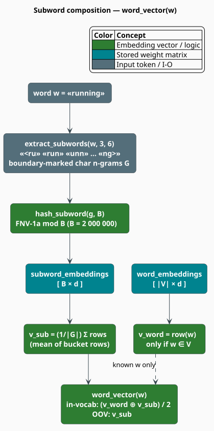

# SubwordEmbedding API Reference

`SubwordEmbedding` is libgrammstein's FastText-style word-embedding model
[[1]](#references): every word is represented as the composition of a **word vector** and the
vectors of its **character n-grams** (subwords). Because the subword vectors are shared across
the vocabulary, the model can produce a meaningful vector for a word it has **never seen** —
which is precisely what the hybrid model leans on for out-of-vocabulary coverage.

> **Scope.** Source of truth: [`src/embedding/mod.rs`](../../src/embedding/mod.rs),
> [`src/embedding/model.rs`](../../src/embedding/model.rs),
> [`src/embedding/trainer.rs`](../../src/embedding/trainer.rs). For the theory see
> [Subword Embeddings](../components/embedding/overview.md),
> [Skip-gram training](../components/embedding/skip-gram.md), and
> [Similarity](../components/embedding/similarity.md); for tuning see the
> [Embedding Training guide](../training/embedding.md).

## Exports

```rust
use libgrammstein::embedding::{
    // model
    SubwordEmbedding,
    DEFAULT_EMBEDDING_DIM,      // 100
    DEFAULT_BUCKET_COUNT,       // 2_000_000
    DEFAULT_MIN_SUBWORD_LEN,    // 3
    DEFAULT_MAX_SUBWORD_LEN,    // 6
    // training
    EmbeddingTrainerBuilder, EmbeddingTrainer, EmbeddingConfig, EmbeddingProgress,
    // subword machinery
    extract_subwords, hash_subword, BpeTokenizer, BpeTrainer, MergeOp,
};
```

`SubwordEmbedding` is **not** generic — there is no dictionary type parameter. It stores two
dense `ndarray` matrices and is `Clone + Send + Sync`.

## Notation

| Symbol | Meaning |
|---|---|
| $`w`$ | a word |
| $`d`$ | the embedding dimension (`dim`) |
| $`u_w \in \mathbb{R}^{d}`$ | the learned **word** vector of an in-vocabulary $`w`$ (row of `word_embeddings`) |
| $`G_w`$ | the character n-grams of the **boundary-marked** word `<w>` whose lengths lie in $`[n_{\min}, n_{\max}]`$ |
| $`z_g \in \mathbb{R}^{d}`$ | the **subword** vector of n-gram $`g`$ (row $`\mathrm{hash}(g)`$ of `subword_embeddings`) |
| $`B`$ | the number of subword hash buckets (`bucket_count`) |
| $`v_w`$ | the vector `word_vector(w)` finally returns |

## The word vector

`word_vector` composes the two halves of the model. For an **in-vocabulary** word it averages
the learned word vector with the mean of its subword vectors; for an **OOV** word only the
subword half exists, so that mean *is* the vector:

```math
v_w \;=\;
\begin{cases}
\dfrac{1}{2}\Bigl(u_w \;+\; \dfrac{1}{\lvert G_w \rvert}\displaystyle\sum_{g \in G_w} z_{\mathrm{hash}(g)}\Bigr) & w \in V \\[2ex]
\dfrac{1}{\lvert G_w \rvert}\displaystyle\sum_{g \in G_w} z_{\mathrm{hash}(g)} & w \notin V
\end{cases} \tag{E1}
```

A word with no extractable subwords (whose marked form is shorter than $`n_{\min}`$) yields the
zero vector.



`extract_subwords` wraps the word in boundary markers — `hello` becomes `<hello>` — and then
enumerates **every** character n-gram of the marked string for each length
$`n \in [n_{\min}, n_{\max}]`$. The markers are what let the model distinguish a prefix from the
same letters mid-word.

Subwords are **hashed into buckets** rather than stored in a table: $`\mathrm{hash}(g) \in [0, B)`$
(FNV-1a), with $`B = 2{,}000{,}000`$ by default. This keeps memory bounded no matter how many
distinct character n-grams the corpus contains, at the cost of occasional collisions (two n-grams
sharing a row) — a trade FastText makes deliberately.

```rust
use libgrammstein::embedding::{extract_subwords, hash_subword};

// Every char n-gram of "<hello>" with length 3..=6.
let subwords = extract_subwords("hello", 3, 6);
// n=3: "<he", "hel", "ell", "llo", "lo>"
// n=4: "<hel", "hell", "ello", "llo>"
// n=5: "<hell", "hello", "ello>"
// n=6: "<hello", "hello>"

let bucket = hash_subword("hel", 2_000_000);   // row index in subword_embeddings
```

## Model methods

```rust
impl SubwordEmbedding {
    // construction
    pub fn new(vocab: Vec<String>, dim: usize, bucket_count: usize) -> Self;
    pub fn from_embeddings(
        word_embeddings: Array2<f32>,     // [vocab_size, dim]
        subword_embeddings: Array2<f32>,  // [bucket_count, dim]
        vocab: Vec<String>,
    ) -> Self;
    pub fn with_subword_range(self, min_len: usize, max_len: usize) -> Self;
    pub fn with_tokenizer(self, tokenizer: BpeTokenizer) -> Self;
    pub fn with_cache_size(self, size: usize) -> Self;   // default 100_000

    // vectors
    pub fn word_vector(&self, word: &str) -> Array1<f32>;            // (E1), memoized
    pub fn word_vector_uncached(&self, word: &str) -> Array1<f32>;   // (E1), bypassing the cache
    pub fn sentence_vector(&self, words: &[&str]) -> Array1<f32>;    // mean of word vectors

    // similarity
    pub fn similarity(&self, word1: &str, word2: &str) -> f32;
    pub fn most_similar(&self, word: &str, k: usize) -> Vec<(String, f32)>;
    pub fn most_similar_to_vector(
        &self, vector: ArrayView1<f32>, k: usize, exclude: Option<&str>,
    ) -> Vec<(String, f32)>;
    pub fn analogy(&self, a: &str, b: &str, c: &str, k: usize) -> Vec<(String, f32)>;

    // vocabulary
    pub fn contains(&self, word: &str) -> bool;
    pub fn word_index(&self, word: &str) -> Option<usize>;
    pub fn index_to_word(&self, idx: usize) -> Option<&str>;
    pub fn vocab(&self) -> &[String];                                 // index order
    pub fn embedding_by_index(&self, idx: usize) -> Option<ArrayView1<'_, f32>>;  // u_w, no subwords

    // properties + cache
    pub fn dim(&self) -> usize;
    pub fn vocab_size(&self) -> usize;
    pub fn bucket_count(&self) -> usize;
    pub fn clear_cache(&self);        // &self: the cache is a lock-free DashMap
}
```

### Similarity

All similarity methods use **cosine similarity** on the composed vectors of $`(\mathrm{E1})`$:

```math
\cos(v_a, v_b) \;=\; \frac{v_a \cdot v_b}{\lVert v_a \rVert \, \lVert v_b \rVert} \;\in\; [-1, 1] \tag{E2}
```

Zero-norm vectors (an unrepresentable word) yield $`0.0`$ rather than `NaN`.

| Method | Returns | Notes |
|---|---|---|
| `similarity(a, b)` | `f32` | $`(\mathrm{E2})`$. Works for OOV words on either side. |
| `most_similar(word, k)` | `Vec<(String, f32)>` | Top-$`k`$ by descending $`(\mathrm{E2})`$, **excluding the query word**. |
| `most_similar_to_vector(v, k, exclude)` | `Vec<(String, f32)>` | Same, against an arbitrary query vector. |
| `analogy(a, b, c, k)` | `Vec<(String, f32)>` | "$`a`$ is to $`b`$ as $`c`$ is to *?*" — searches near $`v_b - v_a + v_c`$ and drops $`a, b, c`$ from the results. |

The search compares against the **word-embedding rows** ($`u`$), so results are always
in-vocabulary; the *query* may be OOV.

```rust
let sim = model.similarity("king", "queen");            // e.g. 0.72
let near = model.most_similar("king", 10);              // [(word, score); 10], descending

// "man" is to "king" as "woman" is to ?   →  v_king − v_man + v_woman
for (word, score) in model.analogy("man", "king", "woman", 5) {
    println!("{word}: {score:.4}");
}

// OOV words still get a vector — that is the whole point of the subword half.
let unseen = model.word_vector("antidisestablishmentarianistic");
assert_eq!(unseen.len(), model.dim());
```

### The word-vector cache

`word_vector` memoizes into a lock-free `DashMap` capped at `max_cache_size`
(`with_cache_size`, default `100_000`); once full it simply stops inserting. The cache is
**not** serialized and is **not** cloned — a `SubwordEmbedding` obtained from `clone()` or
`load()` starts empty. Call `clear_cache()` after mutating embeddings, and
`word_vector_uncached` when you deliberately want to bypass memoization.

## Training

`EmbeddingTrainerBuilder` is the fluent entry point. Like the n-gram trainer, **`train` consumes
both the builder and the reader.**

```rust
impl EmbeddingTrainerBuilder {
    pub fn new() -> Self;
    pub fn dim(self, dim: usize) -> Self;                 // default 100
    pub fn window_size(self, size: usize) -> Self;        // default 5
    pub fn min_count(self, count: u64) -> Self;           // default 5
    pub fn neg_samples(self, n: usize) -> Self;           // default 5
    pub fn epochs(self, epochs: usize) -> Self;           // default 5
    pub fn learning_rate(self, lr: f32) -> Self;          // default 0.05
    pub fn batch_size(self, size: usize) -> Self;         // default 10_000
    pub fn build(self) -> EmbeddingTrainer;

    pub fn train<R: CorpusReader + 'static>(self, reader: R) -> Result<SubwordEmbedding>;
    pub fn train_streaming<F, R>(self, reader_factory: F) -> Result<SubwordEmbedding>
        where F: Fn() -> Result<R>, R: CorpusReader + 'static;
    pub fn train_continued<R: CorpusReader + 'static>(
        self, model: SubwordEmbedding, start_epoch: usize, reader: R,
    ) -> Result<SubwordEmbedding>;
}
```

```rust
use libgrammstein::embedding::EmbeddingTrainerBuilder;
use libgrammstein::corpus::PlaintextReader;

let model = EmbeddingTrainerBuilder::new()
    .dim(100)
    .window_size(5)
    .min_count(5)
    .epochs(5)
    .neg_samples(5)
    .learning_rate(0.05)
    .train(PlaintextReader::from_file("corpus.txt")?)?;   // reader is MOVED
# Ok::<(), libgrammstein::Error>(())
```

### `train` vs `train_streaming` — pick by corpus size

`train` buffers the corpus's sentences in memory so it can re-visit them each epoch. For a large
corpus that is fatal. **`train_streaming` takes a *factory*** — a closure that produces a *fresh*
reader for every pass (one vocabulary pass, then one per epoch) — and never materializes the
corpus:

```rust
use std::path::Path;

let path = Path::new("huge-corpus.txt");
let model = EmbeddingTrainerBuilder::new()
    .dim(300)
    .epochs(10)
    .train_streaming(|| Ok(PlaintextReader::from_file(path)?))?;
# Ok::<(), libgrammstein::Error>(())
```

`train_continued(model, start_epoch, reader)` resumes a checkpointed model: it keeps the existing
weights **and vocabulary** (so embedding-row indices stay aligned) and runs epochs
`start_epoch .. epochs`, resuming the learning-rate schedule at the right point. It rebuilds the
ephemeral corpus statistics (the negative-sampling table and sub-sampling counts, which are not
checkpointed) in one pass.

### `EmbeddingConfig` — the knobs the builder does not expose

The builder covers the common seven. The subword geometry and the sub-sampling threshold live
only on `EmbeddingConfig`, so reach for `EmbeddingTrainer::new(config)` when you need them:

```rust
pub struct EmbeddingConfig {
    pub dim: usize,                 // 100
    pub window_size: usize,         // 5
    pub min_count: u64,             // 5
    pub neg_samples: usize,         // 5
    pub epochs: usize,              // 5
    pub learning_rate: f32,         // 0.05
    pub bucket_count: usize,        // 2_000_000   ← builder-inaccessible
    pub min_subword_len: usize,     // 3           ← builder-inaccessible
    pub max_subword_len: usize,     // 6           ← builder-inaccessible
    pub subsample_threshold: f32,   // 1e-4        ← builder-inaccessible
    pub batch_size: usize,          // 10_000
}
```

```rust
use libgrammstein::embedding::{EmbeddingConfig, EmbeddingTrainer};

let mut config = EmbeddingConfig::new(200)   // dim = 200
    .with_window_size(8)
    .with_min_count(10);
config.min_subword_len = 4;                  // only reachable through the struct
config.max_subword_len = 7;

let model = EmbeddingTrainer::new(config).train(PlaintextReader::from_file("corpus.txt")?)?;
# Ok::<(), libgrammstein::Error>(())
```

### Progress reporting

`train_with_progress` lives on `EmbeddingTrainer` (not on the builder) and reports
`EmbeddingProgress { epoch, words_processed, total_words, learning_rate, loss: Option<f32> }`:

```rust
use crossbeam_channel::bounded;
use libgrammstein::embedding::{EmbeddingConfig, EmbeddingProgress, EmbeddingTrainer};

let (tx, rx) = bounded::<EmbeddingProgress>(100);
std::thread::spawn(move || {
    while let Ok(p) = rx.recv() {
        println!(
            "epoch {} — {}/{} words, lr {:.6}",
            p.epoch, p.words_processed, p.total_words, p.learning_rate
        );
    }
});

let trainer = EmbeddingTrainer::new(EmbeddingConfig::new(100));
let model = trainer.train_with_progress(PlaintextReader::from_file("corpus.txt")?, tx)?;
# Ok::<(), libgrammstein::Error>(())
```

### What training optimizes

Skip-gram with negative sampling [[2]](#references): for a centre word $`w`$ and a context word
$`c`$ drawn from a window of `window_size` on each side, maximize

```math
\log \sigma(v_w \cdot u_c) \;+\; \sum_{j=1}^{k} \mathbb{E}_{c_j \sim P_n}\bigl[\log \sigma(-v_w \cdot u_{c_j})\bigr] \tag{E3}
```

where $`k`$ is `neg_samples`, $`\sigma`$ is the logistic function, and the noise distribution
$`P_n`$ is the unigram distribution raised to the $`3/4`$ power (drawn in $`O(1)`$ from a
precomputed alias-style table). Both the word row $`u`$ and every subword row $`z`$ of $`w`$
receive the gradient, which is what ties the two halves of $`(\mathrm{E1})`$ together.

## Persistence (feature `serde-extras`)

```rust
model.save("embeddings.bin")?;                              // bincode
let model = SubwordEmbedding::load("embeddings.bin")?;      // cache starts empty
# Ok::<(), libgrammstein::Error>(())
```

Both matrices are serialized in full, so file size is
$`(\lvert V \rvert + B) \times d \times 4`$ bytes — the bucket table dominates. Reducing
`bucket_count` is the effective lever on model size.

## Performance notes

- **`dim`**: 100 for small corpora, 300 at Wikipedia scale. Cost is linear in $`d`$ for every
  vector op and for the similarity scan.
- **`most_similar` is a full linear scan** over $`\lvert V \rvert`$ rows — $`O(\lvert V \rvert \cdot d)`$
  per call. It is not indexed; for repeated top-$`k`$ search over a large vocabulary, use the
  [RAG index](../components/rag/index.md) instead.
- **`min_count`** is the primary control on $`\lvert V \rvert`$ (and hence on memory and scan
  cost); rare words are dropped from the word table but still contribute subwords.
- **`neg_samples`** dominates training time: $`(\mathrm{E3})`$ costs $`k + 1`$ dot products per
  positive pair.

## Complete workflow

```rust
use libgrammstein::corpus::PlaintextReader;
use libgrammstein::embedding::EmbeddingTrainerBuilder;

fn main() -> libgrammstein::Result<()> {
    let path = std::path::Path::new("corpus.txt");

    // Streaming training: the corpus is never buffered.
    let model = EmbeddingTrainerBuilder::new()
        .dim(100)
        .window_size(5)
        .epochs(5)
        .train_streaming(|| Ok(PlaintextReader::from_file(path)?))?;

    println!("vocab = {}, dim = {}", model.vocab_size(), model.dim());

    for (word, score) in model.most_similar("king", 10) {
        println!("  {word}: {score:.4}");
    }

    // OOV coverage — the subword half always yields a vector.
    let oov = model.word_vector("untrainedword");
    println!("OOV vector dim = {}", oov.len());

    model.save("embeddings.bin")?;   // feature: serde-extras
    Ok(())
}
```

## References

1. P. Bojanowski, E. Grave, A. Joulin & T. Mikolov (2017). *Enriching word vectors with subword
   information* (FastText). Transactions of the ACL 5, 135–146.
   [doi:10.1162/tacl_a_00051](https://doi.org/10.1162/tacl_a_00051)
2. T. Mikolov, I. Sutskever, K. Chen, G. Corrado & J. Dean (2013). *Distributed representations
   of words and phrases and their compositionality.* NeurIPS 26.
   [arXiv:1310.4546](https://arxiv.org/abs/1310.4546)

## See also

- [Subword Embeddings overview](../components/embedding/overview.md) — concepts and design
- [Skip-gram](../components/embedding/skip-gram.md) — the training objective in depth
- [Similarity](../components/embedding/similarity.md) — cosine geometry and top-$`k`$ search
- [BPE](../components/embedding/bpe.md) — byte-pair-encoding tokenization
- [HybridLanguageModel API](hybrid.md) — how these vectors become probabilities
- [Embedding Training guide](../training/embedding.md) — hyperparameters and workflow
