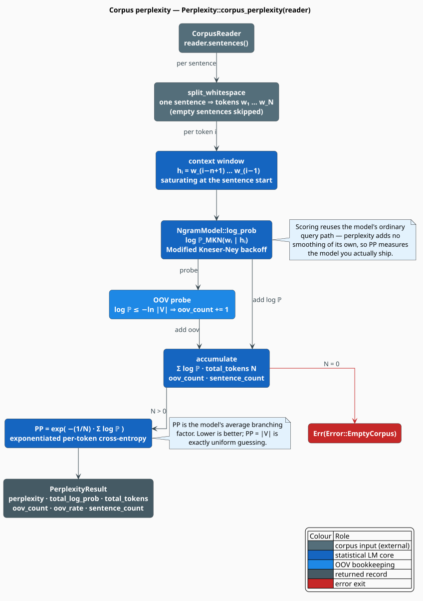
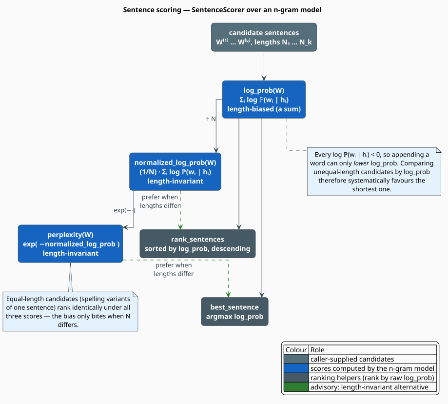

# Scoring API Reference

`libgrammstein::scoring` is the model-evaluation surface: **`Perplexity`** measures how well an
n-gram model predicts a held-out corpus, and **`SentenceScorer`** scores and ranks individual
sentences. Both are thin, borrowing views over an existing `NgramModel<D>` — they own nothing,
allocate almost nothing, and compute no probabilities of their own; every number they report
comes from the model's Modified Kneser-Ney query path.

> **Scope.** Source of truth: [`src/scoring/mod.rs`](../../src/scoring/mod.rs),
> [`src/scoring/perplexity.rs`](../../src/scoring/perplexity.rs),
> [`src/scoring/sentence.rs`](../../src/scoring/sentence.rs). For the theory — why perplexity is
> a branching factor, and the length-bias trap in sentence ranking — see the
> [Scoring component doc](../components/scoring/overview.md).

## Exports

```rust
pub use libgrammstein::scoring::{Perplexity, SentenceScorer};
// PerplexityResult is returned by Perplexity::corpus_perplexity.
```

`Perplexity` is also re-exported from the crate [prelude](traits.md#the-prelude).

## Type parameter and bound

| Parameter | Bound | Meaning |
|---|---|---|
| `D` | `MutableMappedDictionary<Value = NgramEntry>` | the dictionary backend of the `NgramModel<D>` being scored |
| `'a` | — | the borrow of that model; a scorer may not outlive it |

> **The bound is stricter than the usage.** Neither type ever writes to the dictionary, yet both
> require `MutableMappedDictionary` rather than the `MappedDictionary` that `NgramModel` itself
> is generic over. The practical consequence: a **static `DoubleArrayTrieChar`-backed model
> cannot be wrapped** in `Perplexity` or `SentenceScorer`, because that backend is bulk-built,
> read-only, and implements only `MappedDictionary`. Score a static model by calling
> `NgramModel::sentence_log_prob` and exponentiating yourself — see
> [Scoring a static model](#scoring-a-static-model). Compatible backends are `DynamicDawgChar`,
> `PathMapDictionary`, and `SharedCharARTrie`; see the
> [backend matrix](traits.md#backend-capability-matrix).

## `Perplexity<'a, D>`

A borrowing evaluator over one model.

```rust
impl<'a, D> Perplexity<'a, D>
where
    D: MutableMappedDictionary<Value = NgramEntry>,
{
    pub fn new(model: &'a NgramModel<D>) -> Self;
    pub fn corpus_perplexity<R: CorpusReader>(&self, reader: &R) -> Result<PerplexityResult>;
    pub fn sentence_log_prob(&self, tokens: &[&str]) -> f64;
}
```

| Method | Returns | Description |
|---|---|---|
| `new(model)` | `Self` | Borrow a model for evaluation. Zero-cost; no state is built. |
| `corpus_perplexity(reader)` | `Result<PerplexityResult>` | Stream the corpus, score every token, and reduce to a `PerplexityResult`. `Err(Error::EmptyCorpus)` if no token was scorable. |
| `sentence_log_prob(tokens)` | `f64` | The log-probability of one already-tokenized sentence — delegates to `NgramModel::sentence_log_prob`. |

`corpus_perplexity` takes the reader **by reference** (`&R`), unlike the trainers, which consume
theirs. The corpus is streamed sentence-by-sentence and never buffered, so memory stays flat in
the corpus size.

The reported value is the exponentiated per-token cross-entropy over **all** tokens of **all**
sentences (a token-weighted average, not a mean of per-sentence perplexities):

```math
\begin{array}{lr}
\displaystyle \mathrm{PP} = \exp\!\Bigl(-\frac{1}{N}\sum_{i=1}^{N} \log \mathbb{P}(w_i \mid h_i)\Bigr) & \text{(A1)}
\end{array}
```

where $`N`$ is `total_tokens` and $`h_i`$ is the window of up to `order - 1` preceding tokens
**within the same sentence** (context never crosses a sentence boundary).



### `PerplexityResult`

```rust
#[derive(Debug, Clone)]
pub struct PerplexityResult {
    pub perplexity: f64,      // (A1)
    pub total_log_prob: f64,  // sum of log P over every scored token, in nats
    pub total_tokens: usize,  // N
    pub oov_count: usize,     // tokens that hit the uniform floor (see below)
    pub oov_rate: f64,        // oov_count / total_tokens
    pub sentence_count: usize,// non-empty sentences scored
}
```

`PerplexityResult` implements `Display`:

```text
Perplexity: 142.87 | Tokens: 51234 | OOV: 3.12% | Sentences: 2410
```

**What `oov_count` counts.** There is no `<unk>` token; OOV is *detected*, by testing each
token's score against the model's uniform floor:

```math
\begin{array}{lr}
\displaystyle \log \mathbb{P}(w_i \mid h_i) \;\leq\; \texttt{model.oov\_log\_prob()} \;=\; -\log \lvert V \rvert & \text{(A2)}
\end{array}
```

This fires for every genuinely unseen word, and *also* for a known-but-extremely-improbable one
that happens to score at or below the floor. Read `oov_rate` as "the fraction of tokens the
model could not beat uniform guessing on". For an exact vocabulary test, use
`NgramModel::in_vocabulary` instead.

## `SentenceScorer<'a, D>`

```rust
impl<'a, D> SentenceScorer<'a, D>
where
    D: MutableMappedDictionary<Value = NgramEntry>,
{
    pub fn new(model: &'a NgramModel<D>) -> Self;
    pub fn log_prob(&self, tokens: &[&str]) -> f64;
    pub fn normalized_log_prob(&self, tokens: &[&str]) -> f64;
    pub fn perplexity(&self, tokens: &[&str]) -> f64;
    pub fn rank_sentences<'b>(&self, sentences: &[&'b [&'b str]]) -> Vec<(&'b [&'b str], f64)>;
    pub fn best_sentence<'b>(&self, sentences: &[&'b [&'b str]]) -> Option<(&'b [&'b str], f64)>;
}
```

| Method | Returns | Description |
|---|---|---|
| `log_prob(tokens)` | `f64` | $`\ell(W) = \sum_i \log \mathbb{P}(w_i \mid h_i)`$ — **length-biased** (a sum). |
| `normalized_log_prob(tokens)` | `f64` | $`\ell(W)/N`$ — length-invariant. Returns `0.0` for an empty slice. |
| `perplexity(tokens)` | `f64` | $`\exp(-\ell(W)/N)`$ — length-invariant. |
| `rank_sentences(&[..])` | `Vec<(&[&str], f64)>` | All candidates paired with their **raw** `log_prob`, sorted descending. |
| `best_sentence(&[..])` | `Option<(&[&str], f64)>` | The `argmax` of the **raw** `log_prob`. `None` only for an empty candidate list. |



> **Ranking gotcha.** `rank_sentences` and `best_sentence` sort on the **raw** `log_prob`. Since
> every per-token $`\log \mathbb{P} < 0`$, a longer sentence can only score lower — so across
> candidates of *unequal length* these helpers systematically favour the shortest. That is the
> right default for their intended use (equal-length rewrites, such as competing spelling
> corrections, where the $`1/N`$ factor is a shared constant and cannot change the order). When
> lengths differ, rank on `normalized_log_prob` or `perplexity` yourself — see
> [Ranking candidates](#ranking-candidates).

## Usage

### Corpus perplexity

```rust
use libgrammstein::corpus::PlaintextReader;
use libgrammstein::ngram::{NgramEntry, TrainerBuilder};
use libgrammstein::scoring::Perplexity;
use libdictenstein::dynamic_dawg::char::DynamicDawgChar;

let model = TrainerBuilder::new(DynamicDawgChar::<NgramEntry>::new())
    .order(5)
    .train(PlaintextReader::from_file("train.txt")?)?;

let dev = PlaintextReader::from_file("dev.txt")?;
let result = Perplexity::new(&model).corpus_perplexity(&dev)?;

println!("{result}");                                   // Display impl
println!("PP        = {:.2}", result.perplexity);
println!("OOV rate  = {:.2}%", result.oov_rate * 100.0);
println!("tokens    = {}", result.total_tokens);
# Ok::<(), libgrammstein::Error>(())
```

### Ranking candidates

```rust
use libgrammstein::scoring::SentenceScorer;

let scorer = SentenceScorer::new(&model);

// Equal-length candidates: the built-in helpers are exactly right.
let with_fox: &[&str] = &["the", "quick", "brown", "fox"];
let with_fax: &[&str] = &["the", "quick", "brown", "fax"];
if let Some((best, log_p)) = scorer.best_sentence(&[with_fox, with_fax]) {
    println!("best = {best:?}  (log P = {log_p:.3})");
}

// Unequal-length candidates: normalize, or the shortest always wins.
let short: &[&str] = &["the", "fox"];
let long: &[&str] = &["the", "quick", "brown", "fox", "jumped"];
let mut ranked: Vec<(&[&str], f64)> = [short, long]
    .into_iter()
    .map(|s| (s, scorer.normalized_log_prob(s)))
    .collect();
ranked.sort_by(|a, b| b.1.total_cmp(&a.1));   // descending: least surprising first
```

### Scoring a static model

`DoubleArrayTrieChar` is read-only, so it fails the module's `MutableMappedDictionary` bound.
Apply $`(\mathrm{A1})`$ directly to the model instead:

```rust
use libgrammstein::ngram::{NgramEntry, NgramModel};
use libdictenstein::double_array_trie::char::DoubleArrayTrieChar;

// serde-extras: bulk-load the fast, immutable backend from a portable snapshot.
let model: NgramModel<DoubleArrayTrieChar<NgramEntry>> =
    NgramModel::load_static_portable("model.portable.bin")?;

let tokens = ["the", "quick", "brown", "fox"];
let log_prob = model.sentence_log_prob(&tokens);              // sum of log P
let perplexity = (-log_prob / tokens.len() as f64).exp();     // (A1)
println!("PP = {perplexity:.2}");
# Ok::<(), libgrammstein::Error>(())
```

## Caveats

| Caveat | Detail |
|---|---|
| **Tokenization must match training** | `corpus_perplexity` splits sentences with `str::split_whitespace`, while training uses `Tokenizer::words` (which also strips punctuation). Punctuation-adjacent tokens (`quick,`) are therefore unseen types and hit the OOV floor, inflating both `oov_rate` and `perplexity`. Pre-normalize the evaluation corpus, or tokenize yourself and call `sentence_log_prob`. |
| **Perplexities are only comparable across a shared vocabulary and tokenization** | A smaller $`\lvert V \rvert`$ mechanically lowers perplexity (uniform guessing scores exactly $`\lvert V \rvert`$). |
| **Hybrid models are scored elsewhere** | This module is generic over `NgramModel<D>` only. `HybridLanguageModel` carries its own `sentence_log_prob` and `perplexity` — see the [Hybrid API](hybrid.md). |
| **Accumulation is single-threaded** | The fold is sequential. `NgramModel` is `Send + Sync` with a lock-free query path, so shard the corpus and sum the partial `total_log_prob` / `total_tokens` yourself if you need throughput. |

## References

1. F. Jelinek, R. L. Mercer, L. R. Bahl & J. K. Baker (1977). *Perplexity — a measure of the
   difficulty of speech recognition tasks.* Journal of the Acoustical Society of America
   62(S1), S63. [doi:10.1121/1.2016299](https://doi.org/10.1121/1.2016299)
2. S. F. Chen & J. Goodman (1999). *An empirical study of smoothing techniques for language
   modeling.* Computer Speech & Language 13(4), 359–393.
   [doi:10.1006/csla.1999.0128](https://doi.org/10.1006/csla.1999.0128)

## See also

- [Scoring overview](../components/scoring/overview.md) — theory, derivations, and the engineering rationale
- [NgramModel API](ngram.md) — `log_prob`, `sentence_log_prob`, `oov_log_prob`, `in_vocabulary`
- [HybridLanguageModel API](hybrid.md) — `perplexity` for interpolated models
- [Traits API](traits.md) — the `CorpusReader` and dictionary bounds used above
- [Errors](errors.md) — `Error::EmptyCorpus`, the one failure mode of `corpus_perplexity`
- [Perplexity Scoring example](../examples/perplexity-scoring.md) — end-to-end quality filtering
