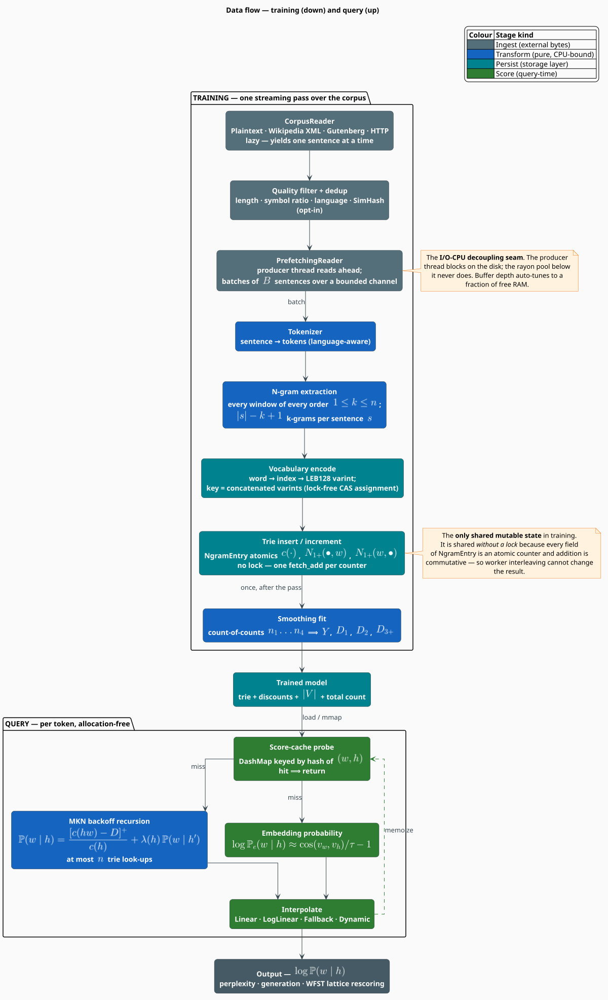
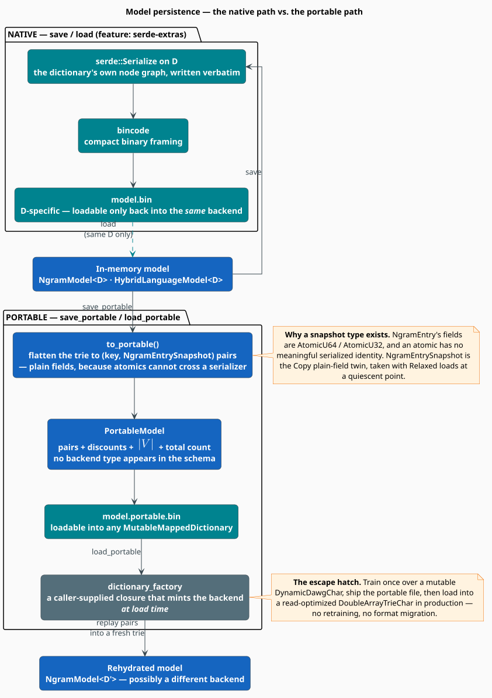

# Data Flow

This document follows a single unit of data through libgrammstein twice: **downward**, as a
corpus sentence becomes a set of smoothed counts, and **upward**, as a query becomes a
log-probability. Between the two passes sits the artifact that both share — the **varint-encoded
trie key** — and the two ways of writing it to disk.

> **Scope.** Source of truth:
> [`src/corpus/`](../../src/corpus/) (readers, prefetch, filters),
> [`src/ngram/trainer.rs`](../../src/ngram/trainer.rs) (the counting pass),
> [`src/ngram/vocabulary.rs`](../../src/ngram/vocabulary.rs) (key encoding),
> [`src/ngram/model.rs`](../../src/ngram/model.rs) (the query path), and
> [`src/hybrid/model.rs`](../../src/hybrid/model.rs) (interpolation). The *concurrency* of these
> flows is the subject of [Threading Model](threading.md); their *memory* behavior is the subject
> of [Memory Optimization](memory-optimization.md). The Google Books ingestion path is a
> specialization of the training flow described here and has its own document:
> [Google Books Importer](google-books-importer.md).

## Notation

Every symbol below is defined before it is used in a formula.

| Symbol | Meaning |
|---|---|
| $`s`$ | a sentence — a finite sequence of tokens |
| $`\lvert s \rvert`$ | the length of sentence $`s`$ in tokens |
| $`n`$ | the maximum n-gram **order** of the model, $`1 \leq n \leq 5`$ |
| $`k`$ | a specific order under consideration, $`1 \leq k \leq n`$ |
| $`C`$ | corpus size in tokens |
| $`w`$ | the word (token) whose probability is being estimated |
| $`h`$ | the *history* (context) — the words preceding $`w`$ |
| $`h'`$ | the *backed-off* history — $`h`$ with its oldest (leftmost) word removed |
| $`c(h\,w)`$ | raw training count of the n-gram formed by appending $`w`$ to $`h`$ |
| $`D`$ | the absolute discount applied by Modified Kneser-Ney |
| $`\lambda(h)`$ | the backoff weight for history $`h`$ |
| $`n_i`$ | *count-of-counts* — the number of n-grams occurring exactly $`i`$ times |
| $`\lvert V \rvert`$ | vocabulary size |
| $`\iota(w)`$ | the integer index assigned to word $`w`$ by the vocabulary |
| $`B`$ | prefetch batch size, in sentences |
| $`\alpha \in [0,1]`$ | the interpolation weight |
| $`\tau`$ | the embedding temperature |
| $`[x]^{+}`$ | $`\max(x, 0)`$ |

**Acronyms.** *MKN* — Modified Kneser-Ney; *LEB128* — Little-Endian Base-128 (a variable-length
integer encoding); *OOV* — Out-Of-Vocabulary; *CAS* — Compare-And-Swap; *WAL* — Write-Ahead Log.

## 1 · The shape of the problem

Training and inference are **inverses over the same index**. Training walks the corpus once and
writes counts into a trie keyed by n-gram; inference walks a backoff chain and reads those counts
back out. Everything in between — tokenization, vocabulary encoding, atomic counting, smoothing —
exists to make the write side cheap enough to survive a corpus that does not fit in memory, and
the read side cheap enough to survive a lattice rescorer that issues thousands of queries per
sentence.

Two properties are preserved end to end, and every design choice below is downstream of them:

1. **The corpus is never fully materialized.** Readers are lazy; batches are bounded; the trie is
   memory-mapped. Peak memory is a function of the *configuration*, not of the corpus size.
2. **The key is canonical.** One n-gram has exactly one byte key, regardless of which reader
   produced it or which backend stores it. Without that, backoff — which manufactures keys for
   contexts it never explicitly saw — would not work.

## 2 · The training flow



**Figure 1** — the two passes. Colour encodes the *stage kind*: ingest (grey), pure transform
(blue), persist (teal), score (green).

### 2.1 · Read — lazily

Every corpus source implements one trait, and every implementation is an **iterator**, not a
loader:

```rust
pub trait CorpusReader: Send {
    /// Yields one clean sentence at a time. Never materializes the corpus.
    fn sentences(self) -> impl Iterator<Item = String>;
}
```

The shipped readers are `PlaintextReader`, `WikipediaReader` (streams a compressed XML dump
without decompressing it to disk), and `GutenbergReader` (strips the licence boilerplate that
would otherwise dominate the count distribution). A 60 GB Wikipedia dump therefore trains in a
constant working set.

### 2.2 · Filter — optionally

Two opt-in stages sit between the reader and the tokenizer:

- **Quality filtering** rejects sentences by length, by symbol-to-letter ratio, and by detected
  language. Its purpose is to keep boilerplate, tables, and markup out of the count
  distribution — a corpus of navigation bars produces a language model of navigation bars.
- **Deduplication** rejects near-duplicate sentences by SimHash [[5]](#references). Web-scale
  corpora contain the same sentence thousands of times; without deduplication, those repeats
  inflate $`c(\cdot)`$ and distort the count-of-counts $`n_i`$ that the discounts are estimated
  from — so deduplication is not merely a size optimization, it is a *statistical correctness*
  measure.

### 2.3 · Prefetch — the I/O–CPU seam

Reading is I/O-bound; counting is CPU-bound. Running them in the same thread means each waits for
the other. `PrefetchingReader` splits them: a **producer thread** pulls sentences from the reader
and pushes fixed-size batches over a **bounded** channel, while the consumer (a rayon pool) drains
batches and counts.

The channel's boundedness is the design point. It provides **backpressure**: if counting falls
behind, the producer blocks on a full channel rather than accumulating an unbounded queue of
sentences in RAM. The buffer depth auto-tunes to a fraction of free memory (default: 10 %), and
the batch size defaults to $`B = 10\,000`$ sentences.

### 2.4 · Tokenize

The tokenizer splits a sentence into tokens, with optional lowercasing and punctuation removal,
and language-aware rules when the `cli` feature supplies a detected language tag. Tokenization is
*pure* — it touches no shared state — which is why it can run inside the parallel section.

### 2.5 · Extract n-grams

For each sentence $`s`$ and each order $`k \leq \min(n, \lvert s \rvert)`$, every contiguous window
of length $`k`$ is one n-gram. The number of n-grams produced by a sentence is therefore

```math
\begin{array}{lr}
\displaystyle \#\text{ngrams}(s) \;=\; \sum_{k=1}^{\min(n,\,\lvert s \rvert)} \bigl(\lvert s \rvert - k + 1\bigr)
\;\approx\; n \cdot \lvert s \rvert \quad\text{for } \lvert s \rvert \gg n & \text{(D1)}
\end{array}
```

Summing $`(\mathrm{D1})`$ over the corpus gives the $`O(C \cdot n)`$ training cost quoted in the
[Architecture Overview](overview.md#8--complexity): each of the $`C`$ tokens is the *last* token
of at most $`n`$ n-grams.

Note that **all orders $`1 \ldots n`$ are counted**, not just order $`n`$. MKN's backoff recursion
needs the lower-order counts, and computing them in a second pass would mean a second traversal
of the corpus.

### 2.6 · Encode the key

This is the step that makes everything else composable. A word is mapped to an integer index by
the vocabulary, the index is encoded as an LEB128 varint, and the n-gram key is the
**concatenation of its words' varints**:

```math
\begin{array}{lr}
\displaystyle \mathrm{key}(w_1\,w_2 \cdots w_k) \;=\;
\mathrm{leb128}\bigl(\iota(w_1)\bigr) \;\Vert\;
\mathrm{leb128}\bigl(\iota(w_2)\bigr) \;\Vert\; \cdots \;\Vert\;
\mathrm{leb128}\bigl(\iota(w_k)\bigr) & \text{(D2)}
\end{array}
```

where $`\Vert`$ is byte concatenation and $`\iota : \text{word} \to \mathbb{N}`$ is the
vocabulary's injective index assignment.

Three properties fall out of $`(\mathrm{D2})`$, and each of them matters:

| Property | Why it matters |
|---|---|
| **No delimiter is needed.** LEB128 is self-terminating: the high bit of each byte says "another byte follows". | The obvious alternative — `"the\|quick\|brown"` — corrupts silently the moment a token contains the delimiter. The corpus decides what tokens look like; the encoding must not have opinions. |
| **Frequent words are short.** Indices are assigned in first-seen order, and Zipf's law [[4]](#references) puts the commonest words first. Indices $`0 \ldots 127`$ occupy one byte. | The hottest keys are also the shortest, so the hottest trie traversals are also the shallowest. |
| **The key is a prefix-closed byte string.** $`\mathrm{key}(h)`$ is a byte-prefix of $`\mathrm{key}(h\,w)`$. | Backoff is a *prefix truncation*, not a re-encode — see §3.2. |

Index $`0`$ is reserved: a varint of $`0`$ is the byte `\x00`, which is also the prefix that marks
internal metadata keys. Word indices therefore start at $`1`$.

Index assignment is a **lock-free CAS** into a shared vocabulary trie, so it runs inside the
parallel section without serializing the workers.

### 2.7 · Count — atomically, without a lock

The n-gram key is inserted into the trie, and the associated
[`NgramEntry`](../../src/ngram/entry.rs)'s counters are incremented. Every field is an atomic:

```rust
#[derive(Debug, Default)]
pub struct NgramEntry {
    count: AtomicU64,                 // c(h·w) — raw corpus count
    continuation_count: AtomicU32,    // N1+(•, ngram) — distinct preceding contexts
    unique_continuations: AtomicU32,  // N1+(ngram, •) — distinct following words
}
```

No lock is taken, and none is needed: `fetch_add` is atomic, and addition is commutative and
associative, so the final counts are independent of the interleaving. The argument is made
rigorous in [Threading Model §4](threading.md#4--why-the-counters-need-no-lock).

### 2.8 · Fit the discounts

The counting pass is followed by a single reduction over the trie that computes the
**count-of-counts** $`n_1, n_2, n_3, n_4`$ — the number of n-grams seen exactly once, twice, three
times, four times — from which MKN's three discounts follow [[2]](#references):

```math
\begin{array}{lr}
\displaystyle Y = \frac{n_1}{n_1 + 2\,n_2}, \qquad
D_1 = 1 - 2Y\frac{n_2}{n_1}, \qquad
D_2 = 2 - 3Y\frac{n_3}{n_2}, \qquad
D_{3+} = 3 - 4Y\frac{n_4}{n_3} & \text{(D3)}
\end{array}
```

This is the *only* stage that must see the whole corpus at once, and it sees it as four integers
rather than as text. The derivation of $`(\mathrm{D3})`$ and the clamping applied for numerical
safety are covered in [Modified Kneser-Ney](../components/ngram/modified-kneser-ney.md).

## 3 · The query flow

### 3.1 · Probe the cache

A hybrid score is memoized in a `DashMap` keyed by a hash digest of $`(w, h)`$. The probe is
lock-free, so $`k`$ scorer threads contend for nothing. On a hit, the flow ends here.

### 3.2 · Walk the backoff chain

On a miss, the n-gram expert evaluates the MKN recursion — a discounted higher-order term plus a
weighted lower-order term:

```math
\begin{array}{lr}
\displaystyle \mathbb{P}_{\mathrm{MKN}}(w \mid h) =
\frac{\bigl[\,c(h\,w) - D\,\bigr]^{+}}{c(h)}
\;+\; \lambda(h)\,\mathbb{P}_{\mathrm{MKN}}(w \mid h') & \text{(D4)}
\end{array}
```

The recursion peels the **leftmost (oldest)** word of the history at each level, so a 5-gram
context shrinks 5 → 4 → 3 → 2 → 1. Because of the prefix-closure property of $`(\mathrm{D2})`$,
"peel the oldest word" is a *byte-prefix truncation of the key*: no re-encoding, no vocabulary
lookups, no allocation. This is why the backoff chain costs $`O(n)`$ trie look-ups and not
$`O(n)`$ *re-encodes*.

### 3.3 · Ask the embedding expert

In parallel, the embedding side converts geometry into a score: the context vector $`v_h`$ is the
mean of the context words' subword vectors, and the candidate's score is the cosine similarity to
$`v_w`$, tempered and taken in log space:

```math
\begin{array}{lr}
\displaystyle \log \mathbb{P}_e(w \mid h) \;\approx\; \frac{\cos(v_w, v_h)}{\tau} - 1 & \text{(D5)}
\end{array}
```

$`(\mathrm{D5})`$ is deliberately **unnormalized** — the true softmax denominator would require a
sum over the whole vocabulary per query. It is a ranking score, not a calibrated probability; the
n-gram side supplies the calibration. See
[Hybrid Interpolation](../components/hybrid/interpolation.md#the-embedding-probability).

### 3.4 · Interpolate, memoize, return

The two experts are fused under the configured strategy — by default the convex combination

```math
\begin{array}{lr}
\displaystyle \mathbb{P}(w \mid h) = \alpha\,\mathbb{P}_n(w \mid h) + (1 - \alpha)\,\mathbb{P}_e(w \mid h),
\qquad \alpha = 0.8 & \text{(D6)}
\end{array}
```

— and the result is written back into the cache. Both log-probabilities are clamped to
$`\geq -50`$ before combination, so a single $`-\infty`$ from either expert cannot annihilate the
score.

### 3.5 · The query path, literately

The following mirrors [`HybridLanguageModel::score`](../../src/hybrid/model.rs) and
[`NgramModel::log_prob`](../../src/ngram/model.rs). `⟨…⟩` names a refinement expanded below.

```
function score(w, h):                                 ▸ returns a log-probability
    if (w, h) in cache: return cache[(w, h)]           ▸ lock-free DashMap probe
    p_n <- ngram_log_prob(w, h)                        ▸ ⟨Backoff chain⟩
    p_e <- embedding_log_prob(w, h)                    ▸ (D5); unnormalized, for ranking
    s   <- interpolate(p_n, p_e, strategy)             ▸ (D6) by default
    cache.insert((w, h), s)                            ▸ lock taken ONLY on LRU eviction
    return s

⟨Backoff chain⟩ ≡
    key <- encode(h ++ w)                              ▸ (D2), once — never re-encoded below
    for level in 0 .. n-1:                             ▸ peel the OLDEST word each level
        c_hw <- trie.get(key)                          ▸ O(k) traversal
        c_h  <- trie.get(prefix_of(key, without_last)) ▸ the context's count
        if c_h > 0:
            D      <- discount(c_hw)                   ▸ D1 / D2 / D3+ per (D3)
            p_high <- max(c_hw - D, 0) / c_h           ▸ the discounted mass, per (D4)
            lambda <- D * unique_continuations(h) / c_h
            return ln( p_high + lambda * recurse(...) )
        key <- drop_first_varint(key)                  ▸ BYTE-PREFIX truncation, not a re-encode
    return unigram_base_case(w)                        ▸ strictly positive ⟹ log is finite
```

## 4 · Where the two flows meet: the key

The single artifact shared by both passes is the byte key of $`(\mathrm{D2})`$. It is worth
stating explicitly what would break without its two invariants:

| Invariant | What breaks if it is violated |
|---|---|
| **Canonicity** — one n-gram, one key, for every reader and every backend | Backoff manufactures the key of a context it may never have inserted explicitly. If two encoders disagree, the lookup misses and the model silently backs off further than it should — inflating perplexity with no error and no crash. |
| **Prefix-closure** — $`\mathrm{key}(h)`$ is a byte-prefix of $`\mathrm{key}(h\,w)`$ | The backoff chain would have to re-encode a shorter history at every level: $`n`$ vocabulary lookups and $`n`$ allocations per query instead of zero. |

## 5 · Streaming and backpressure

The training flow holds a bounded working set at every stage:

| Stage | Resident data | Bound |
|---|---|---|
| Reader | one sentence | $`O(\lvert s \rvert)`$ |
| Prefetch channel | $`\text{buffer\_batches} \times B`$ sentences | auto-tuned to ≈10 % of free RAM |
| Rayon worker | one sentence's tokens + one key | $`O(\lvert s \rvert + n)`$ per thread |
| Trie | the whole index | memory-mapped; resident set bounded by eviction — see [Memory Optimization](memory-optimization.md) |

The consequence: **peak memory is a function of the configuration, not of the corpus.** Doubling
the corpus doubles the *run time*, not the resident set.

## 6 · Persistence: the two write paths



**Figure 2** — the native path and the portable path, and what each costs.

A trained model has to reach disk, and there are two ways to put it there because there are two
different things a user might want.

### 6.1 · The native path — `save` / `load`

Serializes the dictionary's own node graph with `serde` and frames it with `bincode`. It is the
fastest path in both directions and produces the smallest file, because it writes the structure
the trie already has.

Its cost is **rigidity**: the file is welded to the backend type $`D`$ that produced it. A model
saved from a `DynamicDawgChar` cannot be loaded into a `DoubleArrayTrieChar`. It is also gated on
the `serde-extras` feature, because not every backend is `serde`-able.

### 6.2 · The portable path — `save_portable` / `load_portable`

Flattens the trie into a list of $`(\text{key}, \text{entry})`$ pairs, and stores those pairs
alongside the discounts, $`\lvert V \rvert`$, and the total count. **No backend type appears in
the schema.** On load, the caller supplies a `dictionary_factory` closure that mints a fresh trie,
and the pairs are replayed into it.

That indirection is what allows the deployment story the architecture is built for: *train once
over a mutable backend, ship one file, load into a read-optimized backend in production* — with
no retraining and no format migration.

The one subtlety is that `NgramEntry`'s fields are atomics, and an atomic has no meaningful
serialized identity. The portable format therefore stores
[`NgramEntrySnapshot`](../../src/ngram/entry.rs) — the `Copy`, plain-field twin, taken with
`Relaxed` loads at a quiescent point (nothing is writing during serialization).

### 6.3 · Choosing

| You want to… | Use | Because |
|---|---|---|
| checkpoint a long training run | native `save` | fastest round-trip; the backend is not changing |
| ship a model to a different deployment | `save_portable` | the consumer picks its own backend |
| load into a backend you do not control | `save_portable` | the schema names no backend |
| store the smallest possible file | native `save` | no key-list overhead |

## 7 · Complexity summary

| Stage | Cost per unit | Unit |
|---|---|---|
| Read + filter | $`O(\lvert s \rvert)`$ | sentence |
| Tokenize | $`O(\lvert s \rvert)`$ | sentence |
| Extract n-grams | $`O(n \cdot \lvert s \rvert)`$ | sentence — see $`(\mathrm{D1})`$ |
| Encode key | $`O(k)`$ | n-gram of order $`k`$ |
| Trie insert | $`O(\lvert \mathrm{key} \rvert)`$ | n-gram |
| Fit discounts | $`O(N)`$ | one pass over the $`N`$ distinct n-grams |
| **Training, total** | $`O(C \cdot n)`$ | corpus of $`C`$ tokens |
| Cache probe | $`O(1)`$ | query |
| Backoff chain | $`O(n \cdot k)`$ | query — $`\leq n`$ look-ups, each $`O(k)`$ |
| Embedding score | $`O(d + s)`$ | query — $`d`$ dimensions, $`s`$ subwords |
| **Query, total** | $`O(n \cdot k + d + s)`$ | query; $`O(1)`$ on a cache hit |

## Usage

```rust
use libgrammstein::corpus::{PlaintextReader, WikipediaReader};
use libgrammstein::ngram::{NgramEntry, TrainerBuilder};
use libdictenstein::dynamic_dawg::char::DynamicDawgChar;

// Downward: corpus → counts → discounts. The 60 GB dump is never materialized.
let reader = WikipediaReader::from_dump("enwiki.xml.bz2")?;
let model = TrainerBuilder::new(DynamicDawgChar::<NgramEntry>::new())
    .order(5)
    .train(reader)?;

// Upward: query → backoff chain → log-probability.
let log_p = model.log_prob("fox", &["the", "quick", "brown"]);

// Persist: the portable path, so the consumer may choose its own backend.
model.save_portable("english.portable.bin")?;
# Ok::<(), libgrammstein::Error>(())
```

## References

1. R. Kneser & H. Ney (1995). *Improved backing-off for M-gram language modeling.* ICASSP '95,
   181–184. [doi:10.1109/ICASSP.1995.479394](https://doi.org/10.1109/ICASSP.1995.479394)
2. S. F. Chen & J. Goodman (1999). *An empirical study of smoothing techniques for language
   modeling.* Computer Speech & Language 13(4), 359–393.
   [doi:10.1006/csla.1999.0128](https://doi.org/10.1006/csla.1999.0128)
3. P. Bojanowski, E. Grave, A. Joulin & T. Mikolov (2017). *Enriching word vectors with subword
   information* (FastText). TACL 5, 135–146.
   [doi:10.1162/tacl_a_00051](https://doi.org/10.1162/tacl_a_00051)
4. G. K. Zipf (1949). *Human Behavior and the Principle of Least Effort.* Addison-Wesley.
   *(The frequency–rank law that makes short varints land on frequent words.)*
5. M. S. Charikar (2002). *Similarity estimation techniques from rounding algorithms.* STOC '02,
   380–388. [doi:10.1145/509907.509965](https://doi.org/10.1145/509907.509965)
   *(SimHash, used by the deduplication filter.)*

## See also

- [Threading Model](threading.md) — how these flows are parallelized
- [Memory Optimization](memory-optimization.md) — how the resident set is bounded
- [Google Books Importer](google-books-importer.md) — the training flow at corpus scale
- [Modified Kneser-Ney](../components/ngram/modified-kneser-ney.md) — the recursion of $`(\mathrm{D4})`$ in full
- [Trie Storage](../components/ngram/trie-storage.md) — the backends behind the key
- [Hybrid Interpolation](../components/hybrid/interpolation.md) — the fusion of $`(\mathrm{D6})`$
- [Large Corpora](../training/large-corpora.md) — operational guidance for streaming training
