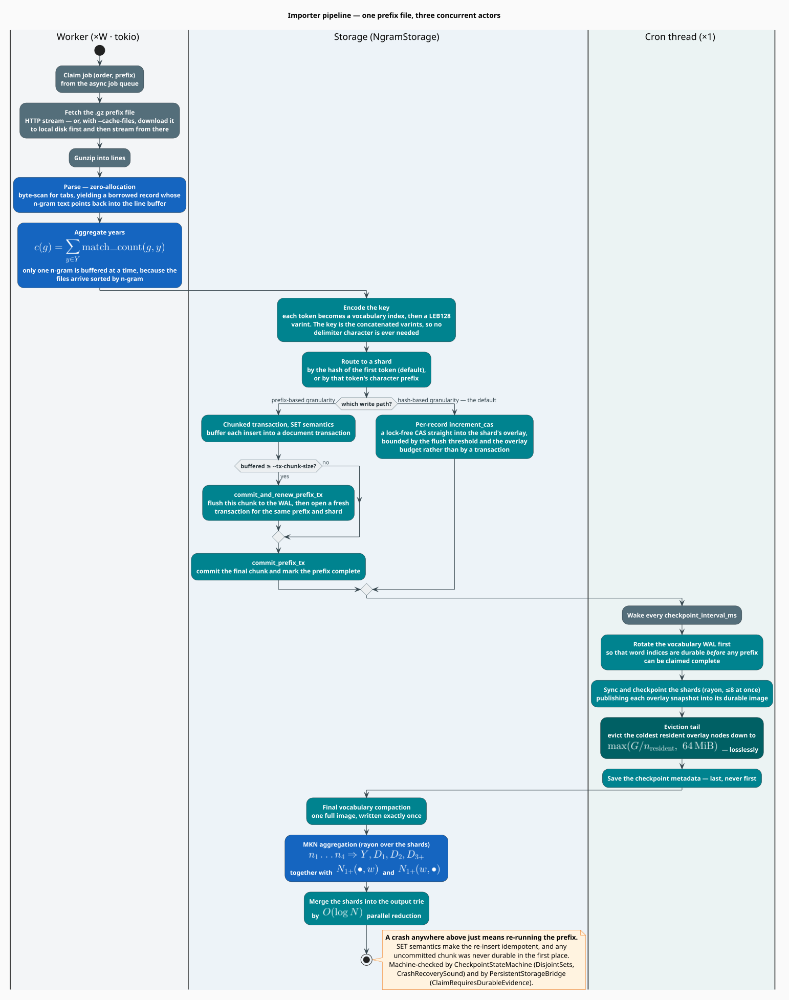
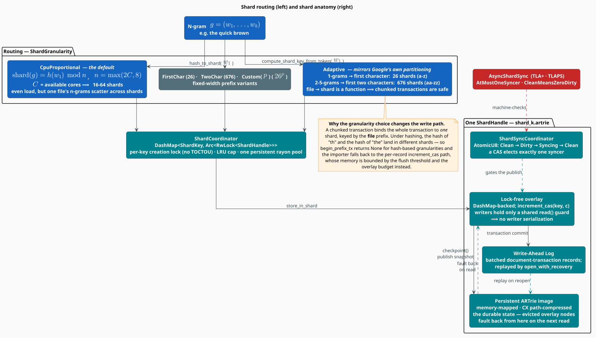
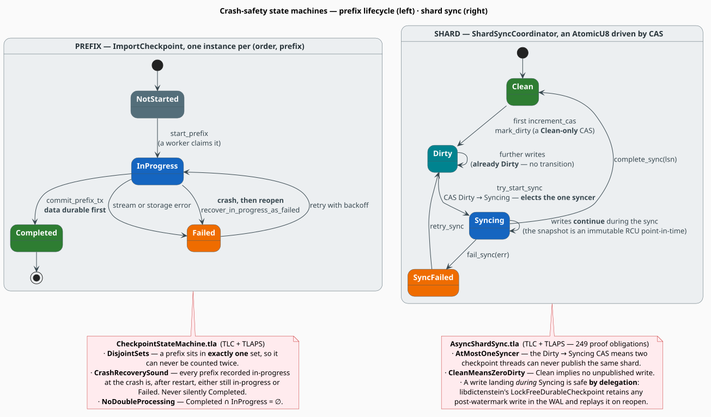

# The Google Books Importer

The Google Books n-gram corpus is the largest artifact libgrammstein consumes: **billions of
n-grams** distilled from over eight million books across several centuries, delivered as hundreds
of gigabytes of gzipped, prefix-partitioned TSV. The importer ingests all of it — over an
unreliable network, across a multi-hour run, under a **hard heap bound**, and with a crash at any
instant costing at most one prefix file of re-work.

This document is the complete design. It covers the corpus and its shape, the sharded lock-free
write path, the chunked-transaction and compare-and-swap ingestion modes and why there are two,
the crash-safety protocol and its ordering constraint, the periodic-checkpoint cron loop, the
lossless overlay eviction that bounds the heap, the worker pool's retry and defer machinery, and
the finalization pass that computes Modified Kneser-Ney statistics and merges the shards. It ends
with the machine-checked invariants that hold the whole thing together.

*(Cargo feature: `google-books`.)*

> **Scope.** Source of truth:
> [`src/sources/google_books/importer/`](../../src/sources/google_books/importer/) (orchestration,
> worker pool, cron, finalization),
> [`src/sources/google_books/sharding/`](../../src/sources/google_books/sharding/) (routing,
> coordinator, shards, checkpoint, merge, MKN),
> [`src/sources/google_books/storage.rs`](../../src/sources/google_books/storage.rs) (the storage
> façade), [`src/sources/google_books/state_machine.rs`](../../src/sources/google_books/state_machine.rs)
> (lifecycle), and [`src/util/cron/mod.rs`](../../src/util/cron/mod.rs) (the scheduler).
> The heap arithmetic is derived in [Memory Optimization](memory-optimization.md); the
> concurrency primitives are inventoried in [Threading Model](threading.md); the operator-facing
> flags are in [the CLI guide](../cli/import-google-books.md).

## Notation

Every symbol below is defined before it is used in a formula.

| Symbol | Meaning |
|---|---|
| $`g`$ | an n-gram — a sequence of tokens $`(w_1, \ldots, w_k)`$ |
| $`k`$ | the **order** of an n-gram: its token count, $`1 \leq k \leq 5`$ |
| $`w_1`$ | the **first token** of an n-gram — the value routing is computed from |
| $`y`$ | a publication year |
| $`Y`$ | the year filter — the set of years whose counts are summed (all years, by default) |
| $`c(g)`$ | the aggregated corpus count of n-gram $`g`$ |
| $`R`$ | total $`(\text{n-gram}, \text{year})`$ rows streamed from the corpus |
| $`N`$ | number of **distinct** n-grams after year aggregation |
| $`S`$ | number of shards |
| $`C`$ | number of available CPU cores |
| $`W`$ | number of import workers (`--parallel`) |
| $`G`$ | the global overlay-heap budget in bytes (`--overlay-budget-gib`) |
| $`n_{\text{resident}}`$ | number of simultaneously-resident shards |
| $`b_s`$ | the per-shard overlay budget in bytes |
| $`\theta_{\text{tx}}`$ | transaction chunk size, in entries (`--tx-chunk-size`) |
| $`h(\cdot)`$ | the routing hash function |
| $`\iota(w)`$ | the integer index the vocabulary assigns to word $`w`$ |
| $`n_i`$ | *count-of-counts* — the number of n-grams occurring exactly $`i`$ times |
| $`N_{1+}(\bullet, w)`$ | *continuation count* — the number of **distinct** contexts in which $`w`$ appears |
| $`N_{1+}(w, \bullet)`$ | the number of **distinct** words that follow $`w`$ |

**Acronyms.** *MKN* — Modified Kneser-Ney; *WAL* — Write-Ahead Log; *CAS* — Compare-And-Swap;
*RCU* — Read-Copy-Update; *LRU* — Least Recently Used; *TOCTOU* — Time-Of-Check-To-Time-Of-Use;
*LSN* — Log Sequence Number; *ARTrie* — Adaptive Radix Trie (persistent); *CX* — the
path-compression scheme applied to persisted ARTrie nodes; *LEB128* — Little-Endian Base-128;
*POS* — Part-Of-Speech; *TSV* — Tab-Separated Values; *SET semantics* — an insert that *assigns* a
value rather than incrementing it, and is therefore idempotent under replay.

## 1 · The corpus

### 1.1 · Format

Each line of a Google Books n-gram file is four tab-separated fields:

```text
ngram <TAB> year <TAB> match_count <TAB> volume_count
```

so one n-gram contributes **one row per year in which it was observed**:

```text
the cat sat	1950	12345	678
the cat sat	1960	23456	789
the cat sat	1961	21001	744
```

Records arrive **sorted by n-gram**, which is the single most useful property of the format: it
means year aggregation needs to buffer only one n-gram at a time (§3.4).

### 1.2 · Partitioning

Files are already partitioned by the **first characters of the first token**, and named
predictably:

```text
googlebooks-{corpus_id}-all-{order}gram-{version}-{prefix}.gz
```

| Order | Prefixes |
|---|---|
| 1-grams | `a` … `z`, plus `other` |
| 2–5-grams | `aa` … `zz`, plus `other` and punctuation buckets |

That partitioning is not incidental — it is the reason the `Adaptive` sharding granularity exists
(§4.2), and it is the unit of both parallelism and crash recovery: **a prefix file is the
importer's atom of work.**

### 1.3 · Scale

Approximate distinct-n-gram counts for English, before any `min_count` filtering:

| Order | Distinct n-grams |
|---|---|
| 1-grams | ≈13 M |
| 2-grams | ≈314 M |
| 3-grams | ≈977 M |
| 4-grams | ≈1.313 B |
| 5-grams | ≈1.176 B |

A single 2-gram prefix file holds 50–100 M entries. These figures are what the importer's own
`estimate_ngram_count` uses to pre-size its structures, scaled down by a factor reflecting how
aggressively the `min_count` threshold prunes rare n-grams.

### 1.4 · Filtering at the door

Two filters run before an n-gram ever reaches storage:

- **`min_count`** (default **40**, which is Google's own published threshold). Rare n-grams in
  this corpus are dominated by OCR errors and scanning artifacts; keeping them would inflate
  storage and, worse, distort the count-of-counts $`n_1, n_2`$ from which the MKN discounts are
  estimated.
- **POS-tag rejection** (default on). Google Books n-grams include syntactic annotations such as
  `_NOUN_`. A language model over `the _NOUN_ sat` is not a language model over English.

## 2 · The design at a glance


**Figure 1** — the whole importer in one picture: workers stream prefix files into per-shard
lock-free overlays; a cron loop checkpoints them into memory-mapped ARTries; an eviction tail
reclaims the coldest resident overlay nodes; and the TLA+ specifications machine-check the
durability invariants.

Four forces shaped this design, and every subsequent section is a consequence of one of them.

| Force | Consequence |
|---|---|
| **The corpus does not fit in RAM.** | The write buffer must be *bounded*, not merely *fast*. Hence lossless overlay eviction (§8). |
| **$`W`$ workers must not serialize on one trie.** | Hence prefix-routed **sharding** (§4) plus a per-shard **lock-free overlay** (§5). |
| **A multi-hour download over the public internet will fail.** | Hence retry with backoff, HTTP Range resume, optional local caching, and a job queue that defers rather than blocks (§10). |
| **A crash must not corrupt or double-count.** | Hence **SET semantics**, chunked transactions, a strict checkpoint ordering, and WAL replay on reopen (§5, §6). |

## 3 · The pipeline



**Figure 2** — one prefix file's journey, with the three concurrent actors in separate swimlanes so
that the asynchrony is visible rather than implied.

### 3.1 · Claim

A worker takes the next ready job — a $`(\text{order}, \text{prefix})`$ pair — from an async MPMC
queue. Jobs already completed in a previous run are skipped, because the checkpoint records
completion per $`(\text{order}, \text{prefix})`$ (§5).

### 3.2 · Fetch

The file is streamed over HTTP through a **shared** `reqwest` client — one connection pool and
HTTP/2 multiplexing across all workers, rather than a client per worker. With `--cache-files`, the
raw `.gz` is first downloaded to a local cache and then streamed from disk (§10.3).

### 3.3 · Parse, without allocating

`parse_ngram_line_ref` locates the tab positions by byte-scanning and returns a **borrowed**
record whose n-gram text points back into the line buffer. At 50–100 M records per file, the
alternative — `split('\t').collect::<Vec<String>>()` — would mean 50–100 M allocations per file.
See [Memory Optimization §6](memory-optimization.md#6--bounding-the-parse-path-allocate-nothing-per-record).

### 3.4 · Aggregate the years

The importer wants one count per n-gram, not one per $`(\text{n-gram}, \text{year})`$ row:

```math
\begin{array}{lr}
\displaystyle c(g) \;=\; \sum_{y \in Y} \mathrm{match\_count}(g, y) & \text{(G1)}
\end{array}
```

where $`Y`$ is the configured year filter (all years by default; `--year-range` narrows it, which
is how one builds a model of *modern* English rather than of English-since-1500).

Because the file is sorted by n-gram, $`(\mathrm{G1})`$ is computed by a **streaming** aggregator
that buffers exactly one n-gram's running total. It emits the completed n-gram the moment a
different one appears. Memory is $`O(1)`$ in the file size, and `YearAggregator::push_ref`
allocates a `String` only when the n-gram actually changes — once per n-gram, not once per row.

Alongside the summed count it tracks the maximum single-year volume count, the number of distinct
years, and the first and last year observed — the metadata a downstream consumer needs in order to
filter by breadth of usage rather than by raw frequency.

### 3.5 · Encode

Each token is mapped to a vocabulary index and the index is LEB128-encoded; the n-gram key is the
concatenation of its tokens' varints:

```math
\begin{array}{lr}
\displaystyle \mathrm{key}(w_1 \cdots w_k) \;=\;
\mathrm{leb128}\bigl(\iota(w_1)\bigr) \;\Vert\; \cdots \;\Vert\;
\mathrm{leb128}\bigl(\iota(w_k)\bigr) & \text{(G2)}
\end{array}
```

LEB128 is self-terminating, so no delimiter byte is needed — which matters here more than
anywhere else in the codebase, because *this corpus is the one that will contain a token
containing your delimiter*. The full rationale is in
[Data Flow §2.6](data-flow.md#26--encode-the-key).

### 3.6 · Route, write, checkpoint, evict

Covered in §4 through §8.

## 4 · Sharding



**Figure 3** — the routing families (left) and the internals of a single shard (right).

### 4.1 · Routing

An n-gram is routed by its **first token** $`w_1`$ — never by the whole n-gram — so that a given
first token always lands in the same shard regardless of order. Two families of routing function
exist:

```math
\begin{array}{lr}
\displaystyle \mathrm{shard}(g) =
\begin{cases}
h(w_1) \bmod S & \textbf{hash-based} \;(\texttt{CpuProportional}) \\[4pt]
\mathrm{prefix}_p(w_1) & \textbf{prefix-based} \;(\texttt{FirstChar},\ \texttt{TwoChar},\ \texttt{Adaptive},\ \texttt{Custom})
\end{cases} & \text{(G3)}
\end{array}
```

Prefix extraction lowercases, keeps only alphabetic characters, and takes the first $`p`$ of them.
Two edge cases are handled explicitly: a first token with **no** alphabetic characters (numerals,
symbols) routes to a reserved `_`-padded shard, and a token **shorter** than $`p`$ is right-padded
with `a` so that lexicographic ordering is preserved.

### 4.2 · The granularities

| Granularity | Shards | Routing | Notes |
|---|---|---|---|
| **`CpuProportional`** *(the default)* | $`\max(2C,\ 8)`$ — typically 16–64 | hash | Even load; a modest file count; all shards stay resident. |
| `Adaptive` | 26 for 1-grams, **676** for 2–5-grams | prefix | **Mirrors Google's own file partitioning.** One prefix file maps to exactly one shard. |
| `FirstChar` | 26 | prefix | Fixed single-character prefix. |
| `TwoChar` | 676 | prefix | Fixed two-character prefix. |
| `Custom(p)` | $`26^p`$ | prefix | Arbitrary fixed prefix width. |

The default is hash-based rather than the Google-mirroring `Adaptive` for a straightforward
reason: 676 shards means 676 open files, 676 WALs, and 676 overlay budgets to divide $`G`$ among,
while $`\max(2C, 8)`$ shards is *enough* parallelism to keep $`W`$ workers from contending and
produces an order of magnitude fewer files. Hashing also distributes load **evenly**, whereas
prefix distribution follows the letter frequencies of the language — the `th` shard of an English
corpus is enormous and the `qz` shard is empty.

But the choice is not free, and this is the design's one genuinely surprising consequence:

> **The routing family determines the write path.** A chunked transaction binds a whole
> transaction to *one* shard, keyed by the **file** prefix. Under hashing, $`h(\texttt{"th"})`$ and
> $`h(\texttt{"the"})`$ are different shards — the file prefix does not predict where the file's
> n-grams will land. So the transactional path is only available under prefix-based routing. See
> §6.

### 4.3 · The coordinator

`ShardCoordinator` owns the shard set and mediates every access to it:

| Concern | Mechanism |
|---|---|
| Shard lookup | `DashMap<ShardKey, Arc<RwLock<ShardHandle>>>` — lock-free reads |
| Shard **creation** | a per-key `Mutex`, closing the TOCTOU race in which two workers both observe "the file does not exist" and both create it |
| Residency | an optional LRU cap (`max_open_shards`); evicting a shard **checkpoints it first**, so eviction never loses data |
| Checkpoint parallelism | one **persistent** rayon pool, built once on first use — rebuilding a pool per checkpoint would spawn $`N`$ threads on every one of the many checkpoints in a long import |
| Heap bound | eviction is **armed** on each shard at open/create time (§8) |

## 5 · Crash safety



**Figure 4** — the two state machines. Left: a prefix's lifecycle in the global checkpoint. Right:
a shard's sync lifecycle. Both are live TLA+ models; the red notes name the proved invariants.

### 5.1 · The atom of recovery is the prefix file

The global checkpoint records, per $`(\text{order}, \text{prefix})`$, exactly one of four states:
**NotStarted**, **InProgress**, **Completed**, **Failed**. The three non-trivial sets are provably
disjoint (`DisjointSets`), which is what makes "has this prefix been imported?" a question with
one answer.

On reopen, every prefix found **InProgress** is moved to **Failed**
(`recover_in_progress_as_failed`), because a crash mid-prefix may have left partially-committed
chunks. Failed prefixes are then simply re-imported.

### 5.2 · SET semantics make re-import idempotent

Re-importing a prefix would be a disaster under increment semantics — every already-committed
count would double. So the transactional inserts **assign** rather than increment:

```math
\begin{array}{lr}
\displaystyle \mathrm{set}(k, v) \circ \mathrm{set}(k, v) = \mathrm{set}(k, v)
\qquad\text{whereas}\qquad
\mathrm{inc}(k, v) \circ \mathrm{inc}(k, v) = \mathrm{inc}(k, 2v) & \text{(G4)}
\end{array}
```

This works precisely *because* each prefix file is complete and self-contained: the file contains
**all** occurrences of its n-grams, so $`c(g)`$ from $`(\mathrm{G1})`$ is the final value, not a
partial contribution to be accumulated. Assignment is therefore not merely safe — it is the
*correct* operation. Re-running a prefix rewrites identical values, and $`(\mathrm{G4})`$ makes
that a no-op.

### 5.3 · The checkpoint protocol, and its ordering constraint

A checkpoint runs three steps, and their **order is load-bearing**:

```
1.  rotate the vocabulary WAL          ▸ word indices become durable FIRST
2.  sync + checkpoint the n-gram shards (rayon, ≤8 concurrent)
3.  save the checkpoint metadata       ▸ the "prefix is complete" claim comes LAST
```

**Why the order matters.** An n-gram key is a sequence of *vocabulary indices* — $`(\mathrm{G2})`$.
Suppose step 3 ran first, and the process crashed before step 1. The checkpoint would then claim a
prefix is complete while the indices its keys were built from are not yet durable. On resume, the
vocabulary would restart from a stale index — and every n-gram encoded with a newer index would be
orphaned: present in the trie, unreachable by any word.

The general principle: **metadata must never outrun the data it describes.** This is not
maintained by convention; it is proved. `PersistentStorageBridge.tla` establishes
`ClaimRequiresDurableEvidence` and `VocabularyDurableRequiresVisible` — a checkpoint claim cannot
be published without durable evidence for the data *and* the vocabulary beneath it.

### 5.4 · Shard state lives inside the shard

Each shard stores its own checkpoint state — its completed prefixes, its current prefix, its
processed-n-gram count — **inside its own trie**, under a reserved `\x00__shard_ckpt__:` key
prefix. That is a deliberate choice with a specific payoff: the state is written through the
**same WAL** as the data it describes, so a crash cannot separate them. On reopen, WAL replay
restores both together, atomically.

This makes the per-shard state **authoritative** and the global checkpoint JSON a cache of it. On
open, the coordinator *reconciles*: it replays each shard's WAL and folds any completed prefixes
it finds into the global checkpoint. A prefix the global checkpoint claims complete but that the
shard cannot corroborate is marked for retry.

### 5.5 · The shard sync state machine

Concurrently, each shard runs a four-state machine in a single `AtomicU8`:

| Transition | Trigger | Mechanism |
|---|---|---|
| Clean → Dirty | the first write after a publish | CAS, **Clean-only**: a write landing on an already-Dirty or Syncing shard changes nothing |
| Dirty → Syncing | a checkpoint claims the shard | CAS — this is what **elects exactly one syncer** |
| Syncing → Clean | the publish succeeds | store, with the synced LSN |
| Syncing → SyncFailed | the publish fails | store, with the error retained |
| SyncFailed → Dirty | retry | CAS |

The `Dirty → Syncing` CAS is the crux: it is why two checkpoint threads can never publish the same
shard concurrently (`AtMostOneSyncer`). And writes **continue during a sync** — the published
snapshot is an immutable RCU point-in-time, so `checkpoint()` needs only a shared guard, and a
write that lands mid-sync is retained in the WAL and replayed on reopen.

## 6 · The two write paths

The routing choice of §4.2 splits the ingestion path in two. Both are correct; they bound memory
differently.

### 6.1 · Prefix-based routing → chunked transactions

Because a file prefix maps to exactly one shard, the whole file can be imported inside a
**document transaction** on that shard, committed in fixed-size chunks:

```
function import_prefix_transactional(file, prefix, order):
    tx <- begin_prefix_tx(shard_for(prefix, order), prefix)
    chunk <- 0
    for (g, c) in aggregated_stream(file):            ▸ (G1)
        tx_insert(tx, encode(g), c)                   ▸ SET semantics — (G4)
        chunk <- chunk + 1
        if chunk >= tx_chunk_size:                    ▸ bounds H_tx
            commit_and_renew_prefix_tx(tx, prefix, order)   ▸ flush; open a fresh tx
            chunk <- 0                                       ▸ prefix NOT yet complete
    commit_prefix_tx(tx)                              ▸ final chunk AND mark prefix complete
    ▸ crash before the final commit ⟹ the prefix stays InProgress ⟹ re-imported on resume,
    ▸ and (G4) makes the overwrite of already-committed chunks a no-op.
```

The chunk boundary is what bounds the in-flight buffer:

```math
\begin{array}{lr}
\displaystyle H_{\text{tx}} \;\leq\; W \cdot \theta_{\text{tx}} \cdot s_{\text{entry}} & \text{(G5)}
\end{array}
```

with $`\theta_{\text{tx}}`$ = `--tx-chunk-size` (default 500 000). Note the asymmetry that makes
recovery work: `commit_chunk` writes the data but does **not** mark the prefix complete; only the
final `commit_prefix` does both.

### 6.2 · Hash-based routing → per-record compare-and-swap

Under the default `CpuProportional` granularity, a file's n-grams scatter across shards, so no
single transaction can hold the file. `begin_prefix_tx` therefore returns nothing, and the
importer writes **per record**, straight into the target shard's lock-free overlay:

```rust
let shard_key = coordinator.route_tokens(&tokens);      // hash(w_1) mod S
let guard = shard.read();                               // SHARED guard — W workers at once
guard.increment_lockfree(encoded_key, count)?;          // a CAS; no lock, no transaction
```

There is no per-transaction buffer to bound, so $`(\mathrm{G5})`$ does not apply. Memory is bounded
instead by the two overlay mechanisms: the **flush threshold**
(`--lockfree-flush-threshold`, which publishes any shard whose resident overlay exceeds it) and the
**eviction tail** (§8).

### 6.3 · Comparing them

| | Prefix-based (transactional) | Hash-based (CAS) — *default* |
|---|---|---|
| Write primitive | buffered `tx_insert`, batch-committed | `increment_cas` per record |
| Atomicity | whole chunk, or nothing | per record |
| Memory bound | $`(\mathrm{G5})`$ — the chunk size | flush threshold + eviction |
| Lock taken | brief exclusive guard at each chunk commit | **none** — shared guard only |
| Load distribution | follows the language's letter frequencies (skewed) | even |
| Shard count | 26 / 676 | $`\max(2C, 8)`$ |

Neither is strictly better, which is why both exist. The default trades transactional batching for
even load, fewer files, and a write path that takes no exclusive lock at all.

## 7 · The cron loop

Checkpoints are driven by a **lock-free reactive state machine**, not a sleep loop, and it runs on
its own thread so that it never contends with the workers:

```text
CheckEvents → DrainChannel → ExecutingTask → Sleeping → CheckEvents → … → Terminated
```

| Component | Primitive | Lock-free |
|---|---|---|
| Task submission | crossbeam MPSC channel | yes |
| Termination signal | `AtomicBool`, re-checked at **every** transition | yes |
| Progress counters | `AtomicU64` | yes |
| Checkpoint state | `ArcSwap<ImportCheckpoint>` | yes |
| The due-task queue | a `BinaryHeap` **owned by the scheduler thread** | not shared at all |

Two properties are worth naming. First, re-checking the termination flag at every transition —
rather than only when a sleep expires — is what makes `Ctrl+C` respond promptly instead of "within
one interval". Second, a re-entrancy guard (`checkpoint_in_progress: AtomicBool`) means a
checkpoint that overruns its interval is *skipped*, not *queued* — checkpoints can never pile up
behind a slow disk.

Two schedules run concurrently:

| Trigger | Cadence | Method |
|---|---|---|
| Time-based (cron) | every `checkpoint_interval_ms` (default 5 s) | full durable checkpoint |
| Progress-based | every 5 completed files (at $`W \geq 8`$), else every 10 | asynchronous checkpoint — WAL rotation returns immediately, workers continue |

The cron machine is modelled and checked in
[`formal/tla/CronStateMachine.tla`](../../formal/tla/CronStateMachine.tla).

## 8 · The heap bound

The checkpoint's **tail** is where the importer's headline result comes from. After a shard's
overlay snapshot has been published into its durable image, the tail evicts that shard's **coldest
resident overlay nodes** down to its slice of a global budget:

```math
\begin{array}{lr}
\displaystyle b_s \;=\; \max\!\left( \frac{G}{n_{\text{resident}}},\; 64\,\text{MiB} \right) & \text{(G6)}
\end{array}
```

Eviction is **lossless**, and the invariant is exactly:

> A node is evicted **only if** its value is already durable in the on-disk image or the retained
> WAL. On the next read of an evicted key, the node **faults back**. Eviction changes *where* a
> value lives, never *whether* it exists.

This converts the resident overlay — the one heap term that would otherwise grow monotonically for
the entire import — from unbounded to bounded by $`G`$. A naïve build peaks at **≈33.79 GB**; the
bounded build holds **under 16 GB**. Add `mimalloc` as the global allocator, which removes the
**≈49 % of CPU** the naïve build spent in `__mprotect` syscalls, and the import becomes tractable
on an ordinary workstation.

The complete derivation — every heap term, the budget arithmetic, the 64 MiB floor, the
200 000-node per-pass cap, and the measured cost of the bound — is in
[Memory Optimization](memory-optimization.md).

## 9 · The vocabulary

All shards share **one** vocabulary: a bijection between words and integer indices, backed by a
lock-free, WAL-durable ARTrie. Three properties earn it its own section.

**Index assignment is lock-free.** A new word's index is claimed by CAS, so $`W`$ workers extend the
vocabulary concurrently without serializing.

**It is pre-sized.** A geometrically-growing structure holds both the old and the new table during
a resize; for a ≈5.8 M-word English vocabulary, that transient doubling is gigabytes, arriving
unpredictably. The importer estimates the final size from the language and `min_count` and
pre-allocates, skipping the doublings entirely.

**It rotates its WAL during the import, and publishes its image once at the end.**

| Operation | What it does | When |
|---|---|---|
| `merge_and_rotate_vocabulary_wal` | syncs and rotates the WAL, **retaining it for replay**; publishes no image | on **every** checkpoint |
| `checkpoint_vocabulary` | publishes the full overlay image | **once**, at finalization |

Publishing a full image on every periodic checkpoint would re-serialize the whole vocabulary each
time, growing the file without bound. Rotating the WAL delivers the same crash-recovery guarantee
at a cost proportional to the *new* words, not to $`\lvert V \rvert`$. The final compaction exists
purely so that the *next* open does not have to replay a long WAL.

## 10 · The worker pool

### 10.1 · The job queue

Jobs are $`(\text{url}, \text{prefix}, \text{order}, \text{attempt}, \text{backoff}, \text{ready\_at})`$
tuples on an async MPMC channel. $`W`$ workers drain it. A job whose `ready_at` lies in the future
is **requeued rather than executed**, which is how backoff is implemented without a timer wheel.

### 10.2 · Three ways a job can be postponed

They are genuinely different, and conflating them would break either progress or correctness:

| Situation | Attempt counter | Delay | Rationale |
|---|---|---|---|
| **Retryable error** — timeout, connection reset, DNS failure, truncated gzip | incremented | exponential backoff | A transient fault. Retry, but not forever. |
| **Rate limited** — HTTP 429 | incremented | the server's `Retry-After` | The server has told us exactly when to return. Obey it. |
| **Target shard is syncing** | **not** incremented | 50 ms | This is **not an error**. Deferring keeps the worker productive instead of blocking on an fsync — the *defer-and-continue* pattern. |

Failing to distinguish the third case from the first would burn a job's retry budget on a healthy
system that merely happened to be checkpointing.

**Starvation guard.** If every queued job targets a syncing shard, a worker that keeps deferring
would spin. So after cycling the whole queue, the worker sleeps until the earliest job is ready —
with **per-worker jitter**, so that $`W`$ workers do not wake simultaneously and stampede the same
shard.

### 10.3 · `--cache-files`

With caching enabled, a worker first downloads the raw `.gz` to a local cache directory and then
streams from the local file. This **decouples download reliability from parse CPU**: with direct
streaming, a connection that drops at 90 % of a file discards all the CPU already spent parsing it.

The download itself is crash-safe by the standard technique: write to a `.gz.downloading` suffix
and **atomically rename** on completion, so a partial download can never be mistaken for a
complete cached file. An interrupted download resumes via HTTP **206 Range**; a server that
answers **416 Range-Not-Satisfiable** triggers a clean full re-download.

## 11 · Finalization

Once every prefix file is imported, a three-stage teardown runs.

### 11.1 · Compact the vocabulary

One full image write (§9), so the next open replays no WAL.

### 11.2 · Compute the MKN statistics

Counting n-grams is not enough — MKN needs statistics *about* the counts. A rayon pass over the
shards computes, per order:

- the **count-of-counts** $`n_1, n_2, n_3, n_4`$ — how many n-grams occur exactly once, twice,
  three times, four times — from which the three discounts follow [[2]](#references):

```math
\begin{array}{lr}
\displaystyle Y = \frac{n_1}{n_1 + 2 n_2}, \qquad
D_1 = 1 - 2Y\frac{n_2}{n_1}, \qquad
D_2 = 2 - 3Y\frac{n_3}{n_2}, \qquad
D_{3+} = 3 - 4Y\frac{n_4}{n_3} & \text{(G7)}
\end{array}
```

- the **continuation counts** $`N_{1+}(\bullet, w)`$ and $`N_{1+}(w, \bullet)`$, which is what lets
  the lower-order backoff terms measure a word's *versatility* rather than its raw frequency. (The
  "San Francisco" intuition: *Francisco* is frequent but follows essentially only *San*, so it
  earns almost no lower-order mass. See
  [Modified Kneser-Ney](../components/ngram/modified-kneser-ney.md).)

The aggregation is per-shard-parallel and its partial results merge by a **commutative, associative
fold** — a property proved in Rocq (`FrequencyCountsMerge`), which is what licenses computing it in
parallel and combining in arbitrary order. The discounts' bounds and their `binary64` evaluation
are likewise proved (`MknStatistics`, `MknFloatBounds`).

This phase can run for minutes on a full corpus, so it honors a **cancellation flag**: a `Ctrl+C`
during MKN aggregation exits cleanly at the next shard boundary rather than running to completion.

### 11.3 · Merge

The shards are reduced into a single output trie by **pairwise parallel reduction** — merge
adjacent shards, then merge the merges — for a critical path of $`O(\log S)`$ rounds rather than
$`O(S)`$ sequential merges. Shard files are then deleted unless `--keep-shards` is passed.

## 12 · Formal verification


**Figure 5** — the coverage map. The importer is the subsystem all of this exists for.

| Specification | Proves (selected) |
|---|---|
| [`CheckpointStateMachine`](../../formal/tla/CheckpointStateMachine.tla) | `DisjointSets` (a prefix is in exactly one state — no double-counting); `CrashRecoverySound` (a prefix in-progress at the crash is, after restart, in-progress or Failed — **never silently Completed**); `NoDoubleProcessing`; `WorkerAssignmentConsistent` |
| [`AsyncShardSync`](../../formal/tla/AsyncShardSync.tla) | `AtMostOneSyncer`; `CleanMeansZeroDirty`; `CheckpointAtomicity`; `JobPartition` (no job lost or duplicated). **249 TLAPS proof obligations discharged.** |
| [`PersistentStorageBridge`](../../formal/tla/PersistentStorageBridge.tla) | `ClaimRequiresDurableEvidence`; `VocabularyDurableRequiresVisible`; `CheckpointAfterWorkerDrain`; `ForceQuitPublishesNoNewClaim` — i.e. §5.3's ordering constraint |
| [`ImporterLifecycle`](../../formal/tla/ImporterLifecycle.tla) | phase ordering; no illegal transition |
| [`WorkerShutdown`](../../formal/tla/WorkerShutdown.tla) | every worker terminates; no job is lost at shutdown |
| [`CronStateMachine`](../../formal/tla/CronStateMachine.tla) | the scheduler terminates and executes every due task |
| [`QuerySemanticsBridge`](../../formal/tla/QuerySemanticsBridge.tla) | internal metadata keys never leak into query results |
| Rocq: `MknStatistics`, `MknFloatBounds`, `FrequencyCountsMerge` | discount bounds; `binary64` evaluation bounds; merge associativity and commutativity |

Two guarantees are **delegated, not re-proved**, because libdictenstein proves them at the layer
that owns them: that a write landing *during* a checkpoint survives
(`LockFreeDurableCheckpoint`), and that an evicted overlay node faults back losslessly
(`LockFreeDurableCheckpointEviction`). Re-proving a dependency's theorem at the consumer is
duplicated work that drifts. See
[`formal/dependencies/libdictenstein-contracts.md`](../../formal/dependencies/libdictenstein-contracts.md).

Reproduce the entire gate:

```bash
make -C formal complete-with-dependencies
```

## 13 · The lifecycle, and why cleanup order is a correctness property

The importer's teardown is an explicit state machine
([`state_machine.rs`](../../src/sources/google_books/state_machine.rs)):

```text
happy path : Initializing → Downloading ⇄ Paused → ComputingStats → Merging → CleaningUp → Completed
terminal   : Downloading | Paused | ComputingStats | Merging → Cancelled | ForceQuit | Failed
```

Resources are released **LIFO** through a `CleanupGuard`, and the order is not cosmetic. Dropping
the shared worker state *before* the workers have exited does not free it — the workers still hold
`Arc` references. Those references keep the progress channel's sender alive, which keeps the
progress-converter task from ever observing a closed channel, which hangs the shutdown. The
correct order is therefore:

```
1. signal the workers to shut down
2. WAIT for them to exit          ▸ they drop their Arc references here
3. drop the shared state
4. drop the remaining channel senders
5. abort and join the stats task  ▸ this releases the last Arc, closing the progress channel
6. wait for the progress converter ▸ it can now observe the closed channel and exit
7. abort and join the command handler
```

Encoding this as a state machine with an explicit guard — rather than as a sequence of `drop`s a
future maintainer might innocently reorder — is what turns a subtle hang into a structural
impossibility.

## 14 · Complexity

| Stage | Cost | Notes |
|---|---|---|
| Stream + parse | $`O(R)`$ | $`R`$ = total rows; $`O(1)`$ heap per row |
| Year aggregation | $`O(R)`$ time, $`O(1)`$ space | one n-gram buffered — the file is sorted |
| Encode key | $`O(k)`$ | $`k`$ = n-gram order, ≤5 |
| Route | $`O(1)`$ hash, or $`O(p)`$ prefix | $`p`$ ≤ 2 |
| Overlay write | $`O(\lvert \mathrm{key} \rvert)`$ amortized | a CAS; no lock |
| Checkpoint | $`O(\text{dirty nodes})`$ | slot-level dirty tracking skips clean arenas |
| Eviction tail | $`O(\min(\text{excess},\ 200\,000))`$ per shard per pass | capped for latency |
| MKN aggregation | $`O(N)`$, parallel over $`S`$ shards | $`N`$ = distinct n-grams |
| Merge | $`O(N \log S)`$ | pairwise parallel reduction, $`O(\log S)`$ rounds |
| **Peak heap** | $`O(G + W\theta_{\text{tx}} + \lvert V \rvert)`$ | **independent of $`N`$** — see $`(\mathrm{G6})`$ and [Memory Optimization](memory-optimization.md) |

The last row is the one that matters: peak heap is a function of the **configuration**, not of the
corpus size.

## Usage

```rust
use libgrammstein::sources::google_books::{
    run_import_with_periodic_checkpoints, GoogleBooksConfig, GoogleBooksImporter,
    DEFAULT_CHECKPOINT_INTERVAL_MS,
};

let config = GoogleBooksConfig::builder()
    .language("en")
    .orders(1..=5)
    .min_count(40)              // Google's own threshold
    .parallel_downloads(8)
    .output_path("english.artrie")
    .build()?;

// Resumes from a checkpoint if one exists; otherwise starts fresh.
let importer = GoogleBooksImporter::resume_or_start(config)?;

let stats = run_import_with_periodic_checkpoints(
    importer,
    |p| println!("order {} · {}/{} files", p.current_order, p.files_completed, p.total_files),
    DEFAULT_CHECKPOINT_INTERVAL_MS,   // 5 s
)
.await?;

println!("imported {} n-grams in {} s", stats.total_ngrams, stats.elapsed_seconds);
# Ok::<(), libgrammstein::sources::google_books::ImportError>(())
```

From the command line, with the terminal UI:

```bash
grammstein train import-google-books english.artrie \
  --language en --orders 1..=5 --parallel 8 \
  --tx-chunk-size 500000 --overlay-budget-gib 10 --cache-files
```

## 15 · Configuration

| Flag | Default | Governs |
|---|---|---|
| `--language` | `en` | corpus selection (eng · ger · fre · spa · ita · rus · heb · chi-sim) |
| `--orders` | `1..=5` | which n-gram orders to import |
| `--min-count` | 40 | the rare-n-gram filter (§1.4) |
| `--year-range` | all years | the $`Y`$ of $`(\mathrm{G1})`$ |
| `--parallel` | 4 | $`W`$, the worker count |
| `--overlay-budget-gib` | 10 | $`G`$ in $`(\mathrm{G6})`$ — the heap bound (`0` disables) |
| `--tx-chunk-size` | 500 000 | $`\theta_{\text{tx}}`$ in $`(\mathrm{G5})`$ (`0` disables chunking) |
| `--lockfree-flush-threshold` | 50 000 ($`W \geq 8`$) / 100 000 | inter-checkpoint overlay growth |
| `--cache-files` | off | download-then-parse (§10.3) |
| `--prefix` | all | import a single prefix — useful for debugging |
| `--keep-shards` | off | retain the shard files after the merge |

Machine-class recommendations for each are in
[the CLI guide](../cli/import-google-books.md).

## References

1. J.-B. Michel *et al.* (2011). *Quantitative analysis of culture using millions of digitized
   books.* Science 331(6014), 176–182.
   [doi:10.1126/science.1199644](https://doi.org/10.1126/science.1199644)
   *(The Google Books n-gram corpus itself.)*
2. S. F. Chen & J. Goodman (1999). *An empirical study of smoothing techniques for language
   modeling.* Computer Speech & Language 13(4), 359–393.
   [doi:10.1006/csla.1999.0128](https://doi.org/10.1006/csla.1999.0128)
   *(The discounts of $`(\mathrm{G7})`$.)*
3. R. Kneser & H. Ney (1995). *Improved backing-off for M-gram language modeling.* ICASSP '95,
   181–184. [doi:10.1109/ICASSP.1995.479394](https://doi.org/10.1109/ICASSP.1995.479394)
   *(Continuation counts.)*
4. C. Mohan, D. Haderle, B. Lindsay, H. Pirahesh & P. Schwarz (1992). *ARIES: A transaction
   recovery method supporting fine-granularity locking and partial rollbacks using write-ahead
   logging.* ACM TODS 17(1), 94–162.
   [doi:10.1145/128765.128770](https://doi.org/10.1145/128765.128770)
   *(The WAL discipline behind §5.)*
5. V. Leis, A. Kemper & T. Neumann (2013). *The adaptive radix tree: ARTful indexing for
   main-memory databases.* ICDE 2013, 38–49.
   [doi:10.1109/ICDE.2013.6544812](https://doi.org/10.1109/ICDE.2013.6544812)
   *(The ARTrie each shard is built on.)*
6. D. Leijen, B. Zorn & L. de Moura (2019). *Mimalloc: Free list sharding in action.* APLAS 2019,
   LNCS 11893, 244–265.
   [doi:10.1007/978-3-030-34175-6_13](https://doi.org/10.1007/978-3-030-34175-6_13)
7. L. Lamport (2002). *Specifying Systems: The TLA+ Language and Tools for Hardware and Software
   Engineers.* Addison-Wesley. ISBN 978-0-321-14306-8.
8. M. Herlihy & N. Shavit (2012). *The Art of Multiprocessor Programming*, revised 1st ed.
   Morgan Kaufmann. ISBN 978-0-12-397337-5. *(Compare-and-swap and lock-freedom.)*

## See also

- [Memory Optimization](memory-optimization.md) — the heap bound of §8, derived in full
- [Threading Model](threading.md) — the lock-free overlay and the defer-and-continue pattern
- [Data Flow](data-flow.md) — the key encoding of $`(\mathrm{G2})`$ and the query path it feeds
- [Architecture Overview](overview.md) — where the importer sits in the stack
- [CLI: `import-google-books`](../cli/import-google-books.md) — operator-facing tuning
- [Modified Kneser-Ney](../components/ngram/modified-kneser-ney.md) — what §11.2's statistics are for
- [Large Corpora](../training/large-corpora.md) — the same discipline for plain-text corpora
- [`formal/README.md`](../../formal/README.md) — the specifications of §12
