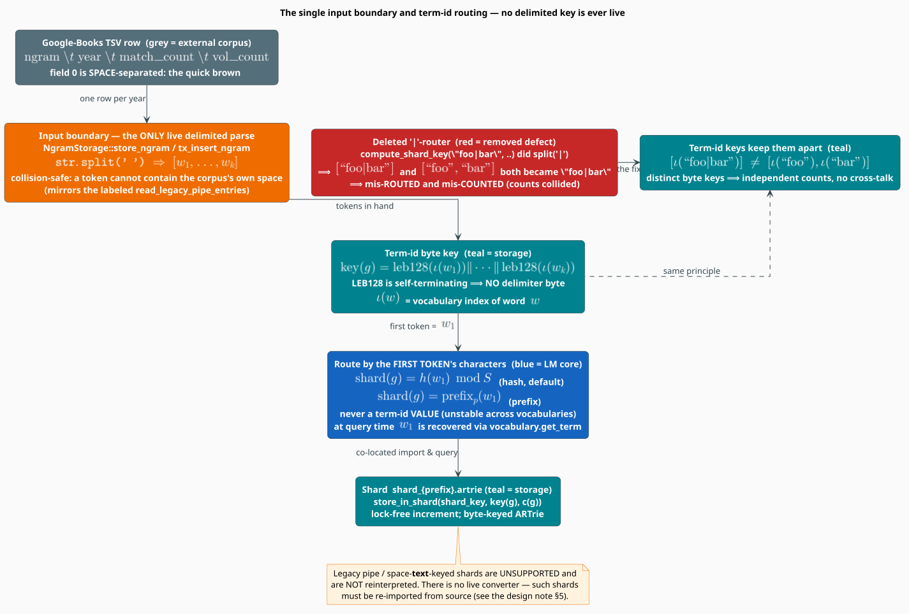

# Google-Books Shard Routing — Term-Id Keys and the Single Input Boundary

This note documents the **shard routing** contract of the Google-Books importer after its
migration off `'|'`-joined n-gram strings onto **byte-native term-id routing**. It complements
[The Google Books Importer](google-books-importer.md) — which covers the pipeline, sharding
families, crash safety, and heap bound — by focusing narrowly on one invariant: **a delimited
string is never a live representation of an n-gram**, and the single, clearly-labeled boundary
where wire text is transcoded to term-ids.

It is the sharded companion to the model-side migration documented at
[N-gram Trie Storage](../components/ngram/trie-storage.md); the two share the term-id key format
of equation (G2) in the importer doc.

## Notation

Every symbol is defined before use. Symbols shared with the importer doc keep their meaning.

| Symbol | Meaning |
|---|---|
| $`g`$ | an n-gram — a token sequence $`(w_1, \ldots, w_k)`$ |
| $`k`$ | the **order** of $`g`$: its token count, $`1 \leq k \leq 5`$ |
| $`w_1`$ | the **first token** — the value routing is computed from |
| $`\iota(w)`$ | the integer index (term-id) the vocabulary assigns to word $`w`$ |
| $`\mathrm{leb128}(\cdot)`$ | Little-Endian Base-128 varint encoding (self-terminating) |
| $`\Vert`$ | byte-string concatenation |
| $`h(\cdot)`$ | the routing hash (`std::collections::hash_map::DefaultHasher`) |
| $`S`$ | number of shards |
| $`\mathrm{prefix}_p(w)`$ | the lowercase, alphabetic-only, $`p`$-character prefix of $`w`$ |

## The data flow



**Figure** — one row's journey from the corpus to a shard. The amber node is the *only* place a
delimited string is parsed on the live path; everything after it is a token slice or a term-id
byte key. The red/teal pair at the bottom is the delimiter collision the term-id key eliminates.

A Google-Books line is four tab-separated fields; field 0 is a **space**-separated n-gram. The
importer transcodes it once, at the boundary, then never reconstructs a delimited string:

```text
TSV row  ──►  split(' ')  ──►  term-id varint key  ──►  route by w₁  ──►  shard
"the quick"   ["the","quick"]   leb128(ι(the))‖leb128(ι(quick))   h(w₁)%S / prefixₚ(w₁)   shard_{…}.artrie
```

## 1 · The principle — delimited text is never a live representation

The hard invariant, inherited from the model migration:

> Legacy delimited parsing may exist **only** at a clearly-labeled one-shot I/O boundary that
> immediately transcodes to term-ids.

There is exactly **one** such boundary in the importer, and it splits on the corpus's own
**space** separator, not on `'|'`:

- `NgramStorage::store_ngram` and `NgramStorage::tx_insert_ngram`
  (`src/sources/google_books/storage.rs`) perform `str.split(' ')` and hand the resulting token
  slice straight to `store_tokens` / `tx_insert_tokens`, which vocabulary-encode it to the
  term-id byte key of equation (G2).

Splitting on `' '` is **collision-safe**: a Google-Books token cannot contain the corpus's own
space separator, so `["the","quick"]` and `["the quick"]` can never both stringify to the same
wire form — unlike the former `'|'` join, under which a token *containing* `'|'` was ambiguous.
This boundary mirrors the model's labeled `read_legacy_pipe_entries`
(`src/ngram/model.rs`), the only sanctioned `split('|')` in the crate.

Past the boundary, an n-gram's live representation is always one of:

| Representation | Where |
|---|---|
| `&[&str]` token slice | at/just past the input boundary |
| `&[u64]` term-id slice | the query seam (`ShardedView`, `GrammarCore`) |
| concatenated-LEB128 **term-id byte key** | on disk in every shard, and in MKN/merge |

## 2 · The key — self-terminating term-ids, no delimiter byte

The stored key is the concatenation of each token's varint-encoded term-id (equation (G2) of the
importer doc):

```math
\mathrm{key}(w_1 \cdots w_k) \;=\;
\mathrm{leb128}\bigl(\iota(w_1)\bigr) \;\Vert\; \cdots \;\Vert\;
\mathrm{leb128}\bigl(\iota(w_k)\bigr)
```

LEB128 is self-terminating, so the boundaries between tokens are recoverable **without** any
separator byte. The vocabulary reserves index $`0`$ (indices start at
$`\texttt{FIRST_VALID_INDEX} = 1`$) so a varint byte is never `\x00`, which keeps n-gram keys
disjoint from the `\x00`-prefixed metadata keys that share the trie.

## 3 · Routing is a function of the first token's characters — never the term-id value

An n-gram is routed by its **first token** $`w_1`$ (equation (G3) of the importer doc):

```math
\mathrm{shard}(g) =
\begin{cases}
h(w_1) \bmod S & \textbf{hash-based} \;(\texttt{CpuProportional},\ \text{the default}) \\[4pt]
\mathrm{prefix}_p(w_1) & \textbf{prefix-based} \;(\texttt{FirstChar},\ \texttt{TwoChar},\ \texttt{Adaptive},\ \texttt{Custom})
\end{cases}
```

Crucially, routing consults the first token's **characters**, never its term-id **value**.
Term-ids are *vocabulary-assignment-order dependent* — $`\iota(w)`$ for the same word $`w`$
differs between two independently-built vocabularies — so routing on a term-id value would be
**unstable across vocabularies** and would break co-location between an import vocabulary and any
re-derived one. At query time the characters are recovered from the leading term-id via
`vocabulary.get_term(w_1)`, so the import seam and the query seam evaluate the *same* pure
function `compute_shard_key_from_token(w₁, k, granularity)` and therefore agree.

The determinism this buys (proved by
`routing.rs::test_compute_shard_key_from_token_routes_by_characters_not_term_id`):

| Word | vocab A: $`\iota(w)`$ | vocab B: $`\iota(w)`$ | route under `TwoChar` | route under `CpuProportional` |
|---|---|---|---|---|
| `the` | 1 | 97 | `th` | `h("the") % S` |
| `apple` | 2 | 12 | `ap` | `h("apple") % S` |
| `zebra` | 3 | 5000 | `ze` | `h("zebra") % S` |

The two vocabularies assign different term-ids to the same words, yet the route is byte-identical
in both — because only the word **string** reaches the router.

For hash-based routing, $`h`$ is `DefaultHasher` (fixed SipHash keys within a toolchain). A shard
count change reshuffles the mapping, so import and query must use the same $`S`$ — the multi-shard
corrector's documented cross-host precondition. This precondition is pre-existing and unchanged by
this migration.

## 4 · The delimiter collision this removes

The deleted `compute_shard_key(ngram: &str, ..)` recovered structure by `split('|')`. It therefore
could not distinguish the **one**-token n-gram `["foo|bar"]` from the **two**-token n-gram
`["foo","bar"]` — both stringify to `"foo|bar"`:

```math
\underbrace{[\,\text{``foo|bar''}\,]}_{k=1}
\;\xrightarrow{\;\text{join('|')}\;}\;
\text{``foo|bar''}
\;\xleftarrow{\;\text{join('|')}\;}\;
\underbrace{[\,\text{``foo''},\ \text{``bar''}\,]}_{k=2}
```

The two n-grams then **mis-counted** (their counts collided onto a single `"foo|bar"` key) and,
under the whole-string hash of the old `CpuProportional` branch, **mis-routed** relative to the
first-token router. The term-id key eliminates the collision structurally:

```math
[\,\iota(\text{``foo|bar''})\,] \;\neq\; [\,\iota(\text{``foo''}),\ \iota(\text{``bar''})\,]
\qquad\text{since}\qquad \iota(\text{``foo|bar''}) \notin \{\iota(\text{``foo''}),\ \iota(\text{``bar''})\}
```

`tests/google_books_sharding_delimiter_collision.rs` is the acceptance proof: it stores
`["foo|bar"]`, `["foo|bar","baz"]`, and `["foo","bar"]` the importer's way and asserts each
retrieves *its own* count with no cross-talk — the sharded analogue of the model test
`src/ngram/migration_tests.rs::delimiter_collision_trains_and_scores`.

## 5 · Compatibility — legacy shards are unsupported, and there is no converter

Because the routing function and its inputs are unchanged by this migration, **existing on-disk
term-id shards remain bit-for-bit valid and queryable** — there is no re-shard and no re-import for
them. `MergeCoordinator` and `MknAggregator` already read the byte keys verbatim.

Legacy **pipe / space-text-keyed** shards — the kind only producible by the now-deleted
`coordinator.store_ngram(&str)` path, which stored raw text bytes — hold non-term-id keys that the
term-id query path can never read. Mirroring the model migration's stance:

- Such shards are **unsupported** and are **never silently reinterpreted**.
- There is **no live converter and no offline converter** — the plan's optional Phase 5 was
  explicitly declined.
- If such a shard exists, it must be **re-imported from source**. Re-importing is the sanctioned
  path and is lossless (the source corpus is the ground truth); reinterpreting old text keys is not
  offered because the one case it could not recover — a token that itself contains the old `'|'`
  delimiter — is precisely the corruption the term-id format exists to prevent.

## Provenance

| Concern | Location |
|---|---|
| Routing function | `src/sources/google_books/sharding/routing.rs::compute_shard_key_from_token` |
| Coordinator byte API | `src/sources/google_books/sharding/coordinator/routing.rs` (`route_tokens`, `store_in_shard`, `get_in_shard`) |
| The input boundary | `src/sources/google_books/storage.rs::store_ngram` / `tx_insert_ngram` |
| Cross-shard read view | `src/sources/google_books/sharding/query.rs` (`ShardedTrieView`, byte-native) |
| Key format (G2) & routing (G3) | [google-books-importer.md](google-books-importer.md) §3.5, §4.1 |
| Encode rationale | [data-flow.md §2.6](data-flow.md) |
| Determinism test | `routing.rs::test_compute_shard_key_from_token_routes_by_characters_not_term_id` |
| Collision acceptance test | `tests/google_books_sharding_delimiter_collision.rs` |
| Behavioral oracle | `tests/sharded_grammar_corrector_proptest.rs` |
