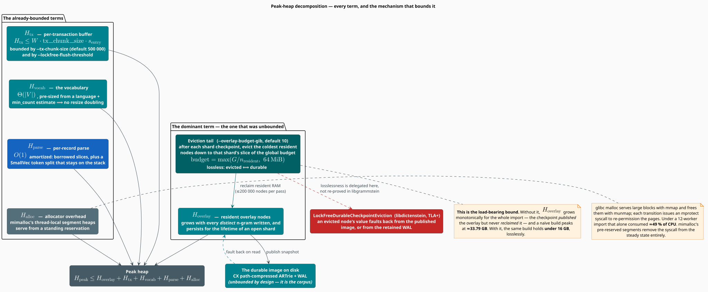

# Memory Optimization: The Bounded Heap

The Google Books importer ingests a corpus that does not fit in memory — billions of n-grams, of
which a single 2-gram prefix file contributes 50–100 million — and it does so under a **hard heap
bound**. This document derives that bound: it decomposes peak heap into its five terms, shows the
mechanism that bounds each one, and states the invariant that makes the load-bearing mechanism —
**lossless overlay eviction** — safe.

The headline: a naïve build peaks at **≈33.79 GB** and burns **≈49 % of CPU** in `__mprotect`
syscalls. The bounded build holds peak heap **under 16 GB**, **losslessly** — every n-gram that
went in comes back out.

> **Scope.** Source of truth:
> [`src/sources/google_books/sharding/config.rs`](../../src/sources/google_books/sharding/config.rs)
> (the budget arithmetic),
> [`src/sources/google_books/sharding/shard.rs`](../../src/sources/google_books/sharding/shard.rs)
> (arming eviction),
> [`src/sources/google_books/storage.rs`](../../src/sources/google_books/storage.rs) (chunked
> transactions, vocabulary WAL),
> [`src/sources/google_books/parser.rs`](../../src/sources/google_books/parser.rs) (the
> zero-allocation parser), and [`Cargo.toml`](../../Cargo.toml) (the allocator). This document
> covers the **why** and the **arithmetic**; for the operator-facing knobs see
> [the CLI guide](../cli/import-google-books.md), and for the surrounding subsystem see
> [Google Books Importer](google-books-importer.md).
>
> Cross-references elsewhere in the repository that cite a numbered optimization (for example
> "#15") refer to **overlay-heap eviction**, which is [§3](#3--bounding-the-resident-overlay-the-eviction-tail)
> here.

## Notation

Every symbol below is defined before it is used in a formula.

| Symbol | Meaning |
|---|---|
| $`H_{\text{peak}}`$ | peak resident heap over the whole import |
| $`H_{\text{overlay}}`$ | heap held by **resident overlay nodes** across all open shards |
| $`H_{\text{tx}}`$ | heap held by in-flight, uncommitted transaction buffers |
| $`H_{\text{vocab}}`$ | heap held by the word ↔ index vocabulary |
| $`H_{\text{parse}}`$ | heap held by the per-record parse and aggregation state |
| $`H_{\text{alloc}}`$ | allocator overhead — arenas held but not handed to the program |
| $`G`$ | the **global overlay budget** in bytes (`--overlay-budget-gib`, default 10 GiB) |
| $`S`$ | total number of shards |
| $`n_{\text{resident}}`$ | number of **simultaneously-resident** shards |
| $`b_s`$ | the per-shard overlay budget in bytes |
| $`W`$ | number of import workers (`--parallel`) |
| $`\theta_{\text{tx}}`$ | transaction chunk size in entries (`--tx-chunk-size`, default 500 000) |
| $`s_{\text{entry}}`$ | mean heap cost of one buffered entry |
| $`\lvert V \rvert`$ | vocabulary size — the number of distinct words |
| $`N`$ | number of distinct n-grams in the corpus |

**Acronyms.** *WAL* — Write-Ahead Log; *CAS* — Compare-And-Swap; *RSS* — Resident Set Size;
*LEB128* — Little-Endian Base-128 (a variable-length integer encoding); *ARTrie* — Adaptive Radix
Trie (persistent); *CX* — the path-compression scheme applied to persisted ARTrie nodes; *LRU* —
Least Recently Used; *SET semantics* — an insert that *assigns* a value rather than incrementing
it, and is therefore idempotent under replay.

## 1 · The problem

Ingesting a corpus larger than RAM is not, by itself, hard: stream it. The difficulty is that a
trie **write buffer is not a stream**. To absorb writes from $`W`$ workers without a lock, each
shard fronts its memory-mapped image with a **lock-free overlay** — a concurrent map of the nodes
that have been touched but not yet published. That overlay is exactly the structure that makes the
import fast, and it is exactly the structure that grows without bound.

The naïve failure is subtle, and worth naming precisely, because it is the crux of the whole
design:

> A checkpoint **publishes** the overlay into the durable image. It does not, by itself,
> **reclaim** the overlay's memory. So the on-disk state is correct after every checkpoint, and
> the heap still grows monotonically for the entire import.

Publication and reclamation are different operations, and conflating them is what costs 33.79 GB.

## 2 · The heap model



**Figure 1** — the five terms of peak heap, and the mechanism that bounds each. Exactly one term
was unbounded; exactly one mechanism bounds it.

Peak heap decomposes as

```math
H_{\text{peak}} \;\leq\; H_{\text{overlay}} \;+\; H_{\text{tx}} \;+\; H_{\text{vocab}}
\;+\; H_{\text{parse}} \;+\; H_{\text{alloc}} \tag{M1}
```

and the strategy is to bound each term independently. Sections 3–7 take them in order of
magnitude. The durable image on disk is deliberately absent from $`(\mathrm{M1})`$: it is
memory-mapped, so it is paged, not heap — and it is unbounded by design, because *it is the
corpus*.

## 3 · Bounding the resident overlay: the eviction tail

This is the load-bearing mechanism. Everything else in this document is supporting work.

### 3.1 · The budget

A **global** overlay budget $`G`$ (CLI `--overlay-budget-gib`, default 10 GiB) is divided among
the shards that are simultaneously resident. Each shard's slice is floored, so that a large shard
count or a small global budget cannot drive eviction into thrashing:

```math
b_s \;=\; \max\!\left( \frac{G}{n_{\text{resident}}},\; 64\,\text{MiB} \right) \tag{M2}
```

The resident count itself depends on the sharding granularity, because the two granularity
families keep different numbers of shards open at once:

```math
n_{\text{resident}} =
\begin{cases}
S & \text{hash-based routing, or an unlimited shard cap} \\[4pt]
\min\bigl(\texttt{max_open_shards},\, S\bigr) & \text{prefix-based routing with an LRU cap}
\end{cases} \tag{M3}
```

Summing $`(\mathrm{M2})`$ over the resident set gives the actual bound on the overlay term:

```math
H_{\text{overlay}} \;\leq\; n_{\text{resident}} \cdot b_s
\;=\; \max\bigl(\,G,\;\; n_{\text{resident}} \cdot 64\,\text{MiB}\,\bigr) \tag{M4}
```

**When does the global budget actually hold?** Reading $`(\mathrm{M4})`$, the intended bound
$`H_{\text{overlay}} \leq G`$ is achieved exactly when the 64 MiB floor does **not** bind:

```math
n_{\text{resident}} \;\leq\; \frac{G}{64\,\text{MiB}}
\qquad\Longleftrightarrow\qquad
H_{\text{overlay}} \;\leq\; G \tag{M5}
```

With the default $`G = 10\ \text{GiB}`$, that threshold is $`n_{\text{resident}} \leq 160`$ shards.
Both shipped configurations sit comfortably inside it:

| Granularity | $`S`$ | $`n_{\text{resident}}`$ | $`b_s`$ at $`G = 10`$ GiB | Floor binds? |
|---|---|---|---|---|
| `CpuProportional` *(default)* | $`\max(2C, 8)`$ — e.g. 24 on a 12-core host | 24 (all resident: hash routing) | 426 MiB | No |
| `Adaptive` | 26 (1-grams) / 676 (2–5-grams) | 100 (the `max_open_shards` LRU cap) | 102 MiB | No |
| `TwoChar`, no LRU cap | 676 | 676 | 64 MiB (floor) | **Yes** — effective bound 42.25 GiB |

The last row is the configuration to avoid, and $`(\mathrm{M5})`$ is precisely why: with 676
simultaneously-resident shards, the per-shard floor — not the global budget — sets the bound.
The shipped defaults keep $`n_{\text{resident}}`$ well under 160, so the global budget is the
operative constraint.

### 3.2 · The invariant: evicted ⟺ durable

Eviction would be worthless if it lost data, and it does not. The tail runs **after** the
checkpoint has published the overlay snapshot into the durable image, and it evicts **only** nodes
that are covered by that publication. Hence the invariant:

> **Lossless eviction.** A node is evicted from the resident overlay **only if** its value is
> already durable in the on-disk image or in the retained WAL. On the next read of an evicted key,
> the node **faults back** from that durable state. Eviction changes *where* a value lives, never
> *whether* it exists.

The consequence is that eviction is invisible to every reader. A query that touches an evicted
n-gram pays one page fault and gets the same answer.

### 3.3 · The tail, literately

The following mirrors the checkpoint tail armed by
[`ShardHandle::arm_eviction`](../../src/sources/google_books/sharding/shard.rs). `⟨…⟩` names a
refinement expanded below.

```
function checkpoint_tail(shard, G, n_resident):
    publish_durable(shard.overlay)                  ▸ RCU snapshot → the on-disk image
    b_s <- max(G / n_resident, 64 MiB)              ▸ this shard's slice of the budget — (M2)
    evicted <- 0
    while resident_bytes(shard) > b_s:
        if evicted >= 200_000: break                ▸ ⟨Per-pass cap⟩
        node <- coldest_resident(shard.overlay)
        assert node in durable_image(shard)         ▸ SAFETY: never evict an unpublished node …
        drop_resident(node)                         ▸ … so the drop is lossless (it faults back)
        resident_bytes(shard) -= sizeof(node)
        evicted <- evicted + 1
    ▸ INVARIANT on exit: resident_bytes ≤ b_s, OR the per-pass cap was reached
    ▸ and the next checkpoint will continue draining.

⟨Per-pass cap⟩ ≡                                    ▸ bounds checkpoint-tail LATENCY
    ▸ Evicting an unbounded number of nodes in one pass would turn a fast
    ▸ checkpoint into a multi-second stall. The cap (200 000 nodes) trades a
    ▸ slightly slower approach to the budget for a predictable checkpoint time.
    ▸ It is a rate limit, not a weaker bound: successive checkpoints keep draining.
```

Two guards make the tail well-behaved rather than merely correct:

| Guard | Value | Prevents |
|---|---|---|
| Per-shard floor | 64 MiB | Thrashing. A shard evicted below roughly one arena would fault back the nodes it is actively writing. |
| Per-pass eviction cap | 200 000 nodes | Latency spikes. The checkpoint tail is on the critical path of the cron loop; an unbounded eviction pass would stall it. |

The eviction preset runs **without a per-shard memory-monitor thread**: the tail fires purely on
the arithmetic condition `resident_bytes > b_s`, so $`S`$ shards do not spawn $`S`$ sampling
threads.

### 3.4 · The cost of the bound

Bounding a heap is not free, and the trade-off is worth stating plainly. Measured in isolation
([`benches/overlay_eviction.rs`](../../benches/overlay_eviction.rs) — one shard, 1 M distinct
n-grams, run with `cargo bench --features google-books --bench overlay_eviction`):

| Configuration | Ingest throughput | Final checkpoint | Nodes reclaimed |
|---|---|---|---|
| Eviction **off** (unbounded overlay) | ≈211 K n-grams/s | 448 ms | 0 |
| Eviction **on**, 4 MiB budget *(a worst-case stress)* | ≈135 K n-grams/s | 139 ms | 1 078 092 |

Three things to read out of this:

1. **The bound works.** A 4 MiB budget reclaims the *entire* resident overlay — over a million
   nodes — with no loss.
2. **The throughput cost is real but bounded**, and this row is a deliberate worst case. A 4 MiB
   budget forces maximal eviction; the production default ($`G`$ = 10 GiB divided across the
   resident shards, with a 64 MiB floor) evicts far less often, so the real-world cost is much
   smaller than the ≈36 % shown here.
3. **The final checkpoint gets 3× faster.** This is not a paradox: with eviction on, the overlay
   is published and reclaimed *incrementally* throughout the import, so there is no
   multi-hundred-megabyte overlay left to serialize at the end.

The trade the design makes is therefore: *some steady-state throughput, in exchange for a heap
that does not grow without bound.* For a multi-hour import that would otherwise be killed by the
OOM killer, that is not a close call.

## 4 · Bounding the transaction buffers: chunked transactions

A prefix transaction buffers its inserts and commits them as one atomic batch. For a 2-gram prefix
file with 50–100 M entries, buffering the whole file would cost gigabytes per worker. So the
transaction commits in **fixed-size chunks**:

```math
H_{\text{tx}} \;\leq\; W \cdot \theta_{\text{tx}} \cdot s_{\text{entry}} \tag{M6}
```

With the default $`\theta_{\text{tx}} = 500\,000`$ and $`W = 8`$ workers, $`(\mathrm{M6})`$ holds
the in-flight buffer to a few hundred megabytes regardless of how large the prefix file is.

**Why chunking is safe.** The inserts use **SET semantics** — they *assign* a count rather than
incrementing one. Assignment is **idempotent**, so replaying it is harmless:

```math
\mathrm{set}(k, v) \circ \mathrm{set}(k, v) \;=\; \mathrm{set}(k, v)
\qquad\text{whereas}\qquad
\mathrm{inc}(k, v) \circ \mathrm{inc}(k, v) \;=\; \mathrm{inc}(k, 2v) \tag{M7}
```

$`(\mathrm{M7})`$ is what makes crash recovery trivial. Committed chunks are durable in the WAL;
uncommitted chunks are discarded; the prefix is **not** marked complete until its final chunk
commits. So on resume, an interrupted prefix is simply re-imported from the start, and the
already-committed chunks are overwritten with **identical values**. No deduplication, no
compensation log, no double-counting. Under increment semantics this would silently double every
count in the replayed range.

A second, independent bound covers the shards' overlays between checkpoints: each `ShardHandle`
tracks an approximate resident-entry count, and
`ShardCoordinator::flush_lockfree_over_threshold` publishes any shard that exceeds
`--lockfree-flush-threshold` (auto-scaled: 50 000 entries per shard at ≥8 workers, 100 000 below
that). The check is a fast read-guarded probe on every shard; only the shards actually over the
threshold pay for a publish, so workers on the other shards continue uninterrupted.

> **A design constraint worth knowing.** Chunked transactions bind a whole transaction to *one*
> shard, keyed by the **file** prefix — which is only well-defined when routing is prefix-based.
> Under the default hash-based routing, `hash("th")` and `hash("the")` land in different shards, so
> the transaction path is not available and the importer uses per-record CAS writes instead. That
> path is bounded by the flush threshold and by eviction (§3) rather than by $`(\mathrm{M6})`$. See
> [Google Books Importer §6](google-books-importer.md#6--the-two-write-paths).

## 5 · Bounding the vocabulary: pre-sizing and WAL rotation

The vocabulary is a bijection between words and integer indices, and it is $`\Theta(\lvert V \rvert)`$
— for English, roughly 5.8 M distinct words after the `min_count` filter. Two mechanisms keep it
from spiking well above that floor.

### 5.1 · Pre-sizing eliminates resize doubling

A geometrically-growing hash map or vector holds **both** the old and the new table during a
resize. For a multi-million-entry vocabulary, that transient doubling is several gigabytes,
arriving at an unpredictable moment. The importer avoids it by pre-sizing the structure at
creation time:

```rust
let estimated_vocab = estimate_vocabulary_size(&config);
let vocabulary = open_or_create_concurrent_vocabulary_lockfree_with_capacity(
    &vocabulary_path,
    estimated_vocab,   // no geometric doubling during the import
)?;
```

`estimate_vocabulary_size` derives the capacity from the language and the `min_count` threshold —
an English base of ≈13 M distinct 1-grams, scaled down by a factor that reflects how aggressively
a higher `min_count` prunes rare words. The estimate needs only to be within a factor of two: it
exists to skip the doublings, not to be exact.

### 5.2 · Rotate the WAL during the import; publish the image once at the end

The vocabulary has two durability operations, and using the right one at the right time is what
keeps the file from bloating:

| Operation | What it does | Used |
|---|---|---|
| `merge_and_rotate_vocabulary_wal` | Syncs and rotates the WAL, **retaining it for replay**. No overlay image is published. | On **every** checkpoint — periodic durability with no file growth |
| `checkpoint_vocabulary` | Publishes the full overlay image to disk. | **Once**, at finalization — a compaction that removes the need to replay a long WAL on next open |

Publishing a full image on every periodic checkpoint would re-serialize the entire vocabulary
each time and grow the file without bound. Rotating the WAL gives the same crash-recovery
guarantee (replay the tail on reopen) at a cost proportional to the *new* entries, not to
$`\lvert V \rvert`$.

Since the vocabulary migrated to a **single lock-free layer** (the overlay *is* the vocabulary,
with no separate persistent map behind it), there is no second structure to merge into — so the
doubled reverse-index rebuild that a two-layer design would incur is now *structurally impossible*
rather than merely avoided.

### 5.3 · The ordering invariant

The checkpoint sequence is **not** arbitrary. It is:

```
1.  rotate the vocabulary WAL        ▸ word indices become durable FIRST
2.  sync + checkpoint the n-gram shards
3.  save the checkpoint metadata     ▸ the "prefix is complete" claim comes LAST
```

The reason is a durability ordering constraint. An n-gram key is a sequence of *vocabulary
indices*. If step 3 ran before step 1, a crash in between would leave the checkpoint claiming that
a prefix is complete while the indices its keys were encoded with are not yet durable — and on
resume, the vocabulary would restart from a stale index, orphaning every n-gram encoded with a
newer one. Metadata must never outrun the data it describes.

This is not a convention maintained by discipline; it is a machine-checked invariant.
[`PersistentStorageBridge.tla`](../../formal/tla/PersistentStorageBridge.tla) proves
`ClaimRequiresDurableEvidence` and `VocabularyDurableRequiresVisible` — a checkpoint claim cannot
be published without durable evidence for the data *and* the vocabulary underneath it.

## 6 · Bounding the parse path: allocate nothing per record

At 50–100 M records per prefix file, a single heap allocation per record is 50–100 M allocations.
The parse path therefore allocates **$`O(1)`$ amortized**:

- **Borrowed parsing.** `parse_ngram_line_ref` finds the tab positions by byte-scanning and
  returns an `NgramRecordRef<'a>` whose n-gram text **borrows from the line buffer** — rather than
  `split('\t').collect::<Vec<String>>()`, which would allocate a `Vec` and four `String`s per
  line.
- **Borrowed aggregation.** Google Books files are sorted by n-gram, so a year-aggregator needs to
  buffer only one n-gram at a time. `YearAggregator::push_ref` allocates a `String` **only when the
  n-gram actually changes** — which, across the years of a single n-gram's row group, is once per
  *n-gram*, not once per *record*.
- **Stack-inline token splits.** N-gram orders run 1–5, so the token split uses
  `SmallVec<[&str; 5]>`: the split of every supported order fits inline on the stack and touches
  the heap not at all.

## 7 · Bounding the allocator overhead

The last term is the one that is invisible in application code, and it was the single largest CPU
cost in the naïve build.

**The mechanism.** glibc's `malloc` serves large allocations by `mmap` and returns them by
`munmap`. Both syscalls must update page permissions, which issues `mprotect`. A trie under bulk
ingest allocates and frees large blocks continuously — so the process spends its time in the
kernel re-permissioning pages rather than in userspace counting n-grams. Measured on a 12-worker
English import, this accounted for **≈49 % of CPU**.

**The fix.** `mimalloc` [[2]](#references) uses thread-local segment heaps carved from
pre-allocated regions. An allocation is satisfied from a standing reservation, so the steady state
issues no per-allocation `mprotect` at all. It is installed as the global allocator in all three
binaries, gated on the `mimalloc-alloc` feature (which the `google-books` feature pulls in
transitively):

```rust
#[cfg(feature = "mimalloc-alloc")]
#[global_allocator]
static GLOBAL: mimalloc::MiMalloc = mimalloc::MiMalloc;
```

This is a two-line change that removes a ~49 % CPU tax, which is a reminder worth internalizing:
**the allocator is part of the architecture**, not an implementation detail beneath it.

> **A measurement caveat.** mimalloc *retains* freed pages in its reservation, so process RSS lags
> the live heap and **understates** the reduction. To observe the heap bound directly, profile the
> live heap (`valgrind --tool=massif`) or read the reclamation counters off
> `eviction_stats().nodes_evicted` — do not infer it from RSS alone.

## 8 · Supporting mechanisms

Three further mechanisms shrink the constants rather than change the asymptotics, and all three
live in the storage layer:

| Mechanism | Effect |
|---|---|
| **CX path compression** | Compresses the persisted form of ARTrie nodes, shrinking both the on-disk image and the evicted node representation. It does not shrink the *resident hot set*, so it complements eviction rather than substituting for it. |
| **Two-tier `ChildStore`** | A node's children live inline (`[u32; 4]` keys + 4 child pointers) for the ≈85 % of nodes with ≤4 children, and in a flat `Vec` for the rest. This replaces a persistent `im::Vector`, whose copy-on-write `Arc` churn both allocated heavily and generated the `mprotect` pressure of §7. |
| **xxh3 hashing** | The merge and MKN aggregation paths key their internal maps on byte-encoded n-gram contexts — non-adversarial data, so a cryptographic-strength hash buys nothing. Swapping SipHash for xxh3 [[3]](#references) is a free speedup on cache-line-sized keys. |

## 9 · How the bounds compose

Substituting the per-term bounds back into $`(\mathrm{M1})`$:

```math
H_{\text{peak}} \;\leq\;
\underbrace{\max\bigl(G,\, n_{\text{resident}} \cdot 64\,\text{MiB}\bigr)}_{\text{eviction, §3}}
\;+\;
\underbrace{W \cdot \theta_{\text{tx}} \cdot s_{\text{entry}}}_{\text{chunking, §4}}
\;+\;
\underbrace{\Theta(\lvert V \rvert)}_{\text{pre-sized, §5}}
\;+\;
\underbrace{O(W)}_{\text{zero-alloc parse, §6}}
\;+\;
\underbrace{O(1)}_{\text{mimalloc arenas, §7}} \tag{M8}
```

Every term on the right of $`(\mathrm{M8})`$ is a function of the **configuration** — $`G`$,
$`W`$, $`\theta_{\text{tx}}`$, $`\lvert V \rvert`$ — and **none is a function of $`N`$, the corpus
size**. That is the whole point. Doubling the corpus doubles the run time; it does not move peak
heap.

**A worked example.** Defaults on a 12-core host with the default `CpuProportional` granularity:
$`G = 10`$ GiB, $`S = n_{\text{resident}} = 24`$, $`W = 8`$, $`\theta_{\text{tx}} = 500\,000`$, and
an English vocabulary of ≈5.8 M words:

| Term | Bound | Value |
|---|---|---|
| $`H_{\text{overlay}}`$ | $`\max(G,\ 24 \times 64\ \text{MiB})`$ | 10 GiB (the floor does not bind — $`(\mathrm{M5})`$) |
| $`H_{\text{tx}}`$ | $`8 \times 500\,000 \times s_{\text{entry}}`$ | a few hundred MiB |
| $`H_{\text{vocab}}`$ | $`\Theta(5.8 \times 10^6)`$ | ~1 GiB, pre-sized, no doubling |
| $`H_{\text{parse}}`$ | $`O(W)`$ | negligible |
| $`H_{\text{alloc}}`$ | $`O(1)`$ | mimalloc's standing reservation |
| **Total** | | **under 16 GB** |

## 10 · Verification

### 10.1 · What is tested

The mechanisms are guarded by roughly twenty unit and integration tests, concentrated where a
regression would be silent rather than loud:

| Area | Tests |
|---|---|
| Overlay eviction | Eviction fires and is **observable** (`nodes_evicted > 0`) and **lossless** (every evicted key faults back); a 1 MiB budget reclaims the bulk of a 50 K-node overlay; no writes are lost under writers **racing** the budget eviction, deterministically across repeats. |
| Chunked transactions | Chunk-commit lifecycle; SET-semantics idempotency; two regression tests for the checkpoint-resume double-count class. |
| Flush threshold | `flush_lockfree_over_threshold`, `total_lockfree_entries`, `commit_chunk_tx`. |
| Vocabulary WAL | `merge_and_rotate_vocabulary_wal` idempotency. |
| Zero-alloc parse | `parse_ngram_line_ref` across unigram / bigram / Unicode / malformed inputs, plus equivalence to the owned parser; `push_ref` allocates nothing on an unchanged n-gram and agrees with `push`. |

### 10.2 · What is proved, and by whom

The losslessness of eviction is **not re-proved in libgrammstein** — it is *imported* as a
dependency contract. libdictenstein's `LockFreeDurableCheckpointEviction` TLA+ model proves that
evicting a cold overlay node to its durable image loses no value: every evicted term faults back
from the published image or the retained WAL on the next read.

What libgrammstein owns, and therefore must verify itself, is:

| Obligation | Owner |
|---|---|
| Lossless fault-back of an evicted node | **libdictenstein** — `LockFreeDurableCheckpointEviction.tla` |
| The **budget arithmetic** of $`(\mathrm{M2})`$–$`(\mathrm{M4})`$ | libgrammstein — unit tests |
| The eviction coordinator's **lifecycle** (its weak self-reference is torn down when the shard's last handle drops) | libgrammstein — unit tests |
| Metadata never outruns data (§5.3) | libgrammstein — `PersistentStorageBridge.tla` |
| At most one syncer publishes a shard | libgrammstein — `AsyncShardSync.tla` |

This split is deliberate: a proof is only as valuable as the boundary it is stated at, and
re-proving a dependency's guarantee at the consumer would be duplicated work that drifts. See
[`formal/dependencies/libdictenstein-contracts.md`](../../formal/dependencies/libdictenstein-contracts.md).

## 11 · Configuration

| Flag | Default | Bounds | Raise it when | Lower it when |
|---|---|---|---|---|
| `--overlay-budget-gib` | 10 | $`H_{\text{overlay}}`$ | you have headroom and want fewer read faults | the heap ceiling is tight (`0` disables eviction entirely — the unbounded behavior) |
| `--tx-chunk-size` | 500 000 | $`H_{\text{tx}}`$ | you have RAM and want fewer WAL writes | memory-constrained (`0` disables chunking — buffers a whole prefix file) |
| `--lockfree-flush-threshold` | 50 000 (≥8 workers) / 100 000 | inter-checkpoint overlay growth | fast disk, large RAM | memory-constrained |
| `--parallel` | 4 | $`W`$ in $`(\mathrm{M6})`$ | the network is the bottleneck | the upstream is rate-limiting, or heap is tight |
| `--cache-files` | off | — | the connection is unstable — a failed download no longer wastes parse CPU | disk is scarce |

Operator-facing guidance for each of these, including recommended settings by machine class, is in
[the CLI guide](../cli/import-google-books.md).

## References

1. J.-i. Aoe (1989). *An efficient digital search algorithm by using a double-array structure.*
   IEEE Trans. Software Engineering 15(9), 1066–1077.
   [doi:10.1109/32.31365](https://doi.org/10.1109/32.31365)
   *(The double-array trie whose compactness motivates the persisted node form.)*
2. D. Leijen, B. Zorn & L. de Moura (2019). *Mimalloc: Free list sharding in action.* APLAS 2019,
   LNCS 11893, 244–265. [doi:10.1007/978-3-030-34175-6_13](https://doi.org/10.1007/978-3-030-34175-6_13)
3. Y. Collet (2016). *xxHash — extremely fast non-cryptographic hash algorithm.*
   <https://github.com/Cyan4973/xxHash>
4. V. Leis, A. Kemper & T. Neumann (2013). *The adaptive radix tree: ARTful indexing for
   main-memory databases.* ICDE 2013, 38–49.
   [doi:10.1109/ICDE.2013.6544812](https://doi.org/10.1109/ICDE.2013.6544812)
   *(The ARTrie whose nodes the overlay fronts and eviction reclaims.)*
5. C. Mohan, D. Haderle, B. Lindsay, H. Pirahesh & P. Schwarz (1992). *ARIES: A transaction
   recovery method supporting fine-granularity locking and partial rollbacks using write-ahead
   logging.* ACM TODS 17(1), 94–162.
   [doi:10.1145/128765.128770](https://doi.org/10.1145/128765.128770)
   *(The write-ahead logging discipline the shards' WALs follow.)*
6. L. Lamport (2002). *Specifying Systems: The TLA+ Language and Tools for Hardware and Software
   Engineers.* Addison-Wesley. ISBN 978-0-321-14306-8.

## See also

- [Google Books Importer](google-books-importer.md) — the subsystem these bounds protect
- [Threading Model](threading.md) — the lock-free overlay that makes the bound necessary
- [Data Flow](data-flow.md) — the key encoding whose compactness shrinks every term
- [Architecture Overview](overview.md) — where storage sits in the stack
- [CLI: `import-google-books`](../cli/import-google-books.md) — operator-facing tuning guidance
- [Large Corpora](../training/large-corpora.md) — the same discipline applied to plain-text training
- [`formal/README.md`](../../formal/README.md) — the machine-checked durability specifications
