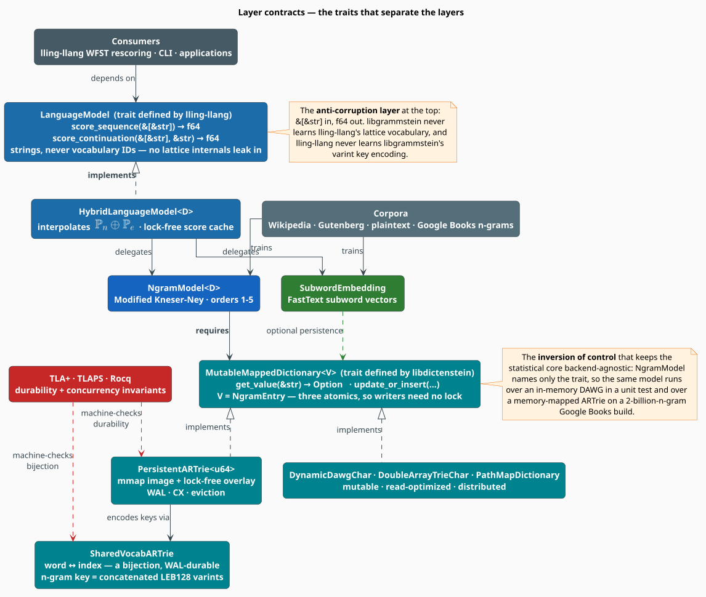

# Architecture Overview

libgrammstein is a **layered language-modeling toolkit**: a persistent-storage foundation, a
statistical + embedding core, a hybrid scorer, and a fan of higher-level capabilities (neural
rescoring, retrieval, topic modeling, code and LaTeX correction) that a developer enables à la
carte with Cargo features. This document explains *what* the layers are, *why* the boundaries
fall where they do, and *which contracts* hold the stack together.

> **Scope.** This is the map, not the territory. Each layer has its own deep doc — see
> [See also](#see-also). The three companion architecture documents are
> [Data Flow](data-flow.md) (how bytes become probabilities), [Threading Model](threading.md)
> (how the work is parallelized), and [Memory Optimization](memory-optimization.md) (how the
> heap is bounded). Source of truth for the layer wiring is
> [`src/lib.rs`](../../src/lib.rs) and [`Cargo.toml`](../../Cargo.toml).

## Notation

Every symbol below is defined before it is used in a formula.

| Symbol | Meaning |
|---|---|
| $`w`$ | the word (token) whose probability is being estimated |
| $`h`$ | the *history* (context) — the words preceding $`w`$ |
| $`n`$ | the maximum n-gram **order** of the model (libgrammstein supports $`1 \leq n \leq 5`$) |
| $`c(h\,w)`$ | raw training count of the n-gram formed by appending $`w`$ to $`h`$ |
| $`\lvert V \rvert`$ | vocabulary size — the number of distinct words |
| $`N_{\text{doc}}`$ | number of documents in a retrieval index |
| $`d`$ | embedding dimensionality |
| $`\mathbb{P}_n(w \mid h)`$ | the n-gram (Modified Kneser-Ney) probability |
| $`\mathbb{P}_e(w \mid h)`$ | the embedding-derived probability |
| $`\alpha \in [0,1]`$ | the interpolation weight mixing $`\mathbb{P}_n`$ with $`\mathbb{P}_e`$ |
| $`k`$ | key length in bytes (the cost parameter of a trie traversal) |
| $`C`$ | corpus size in tokens |
| $`m`$ | sentence length in tokens |

**Acronyms.** *MKN* — Modified Kneser-Ney; *OOV* — Out-Of-Vocabulary; *ARTrie* — Adaptive Radix
Trie (persistent); *WAL* — Write-Ahead Log; *WFST* — Weighted Finite-State Transducer; *CPG* —
Code Property Graph; *HNSW* — Hierarchical Navigable Small-World graph; *RAG* —
Retrieval-Augmented Generation; *LEB128* — Little-Endian Base-128 (a variable-length integer
encoding); *CAS* — Compare-And-Swap; *DAG* — Directed Acyclic Graph.

## 1 · The forces

An architecture is the residue of the constraints that shaped it. Four forces shaped this one.

| Force | Consequence in the design |
|---|---|
| **Statistical accuracy is non-negotiable.** MKN is the strongest count-based smoother known [[1]](#references)[[2]](#references); anything weaker would undercut every layer above it. | MKN is *always on* and never feature-gated. The statistical core is the one thing you cannot compile out. |
| **The corpus is larger than RAM.** The Google Books n-gram corpus runs to billions of n-grams; a single 2-gram prefix file holds 50–100 M entries. | Storage is a *memory-mapped, crash-safe* trie with a bounded resident overlay — never a hash map that must fit in memory. See [Memory Optimization](memory-optimization.md). |
| **Correction is inherently parallel.** A WFST lattice rescorer issues thousands of independent $`\mathbb{P}(w \mid h)`$ queries per sentence. | Every model is `Send + Sync`; the query path is lock-free; the training path is a work-stealing pool. See [Threading Model](threading.md). |
| **Most users want a slice, not the whole cake.** A spell-checker needs the n-gram core; it does not need ONNX, tree-sitter, and a graph neural network. | Everything above the core sits behind a Cargo feature. The default build compiles the statistical + embedding + hybrid core and nothing else. |

## 2 · The layer stack


**Figure 1** — the layers, coloured by concern. The palette is used consistently in every
diagram in this repository; the legend inside
[`architecture.puml`](../diagrams/architecture.puml) is its canonical definition.

Reading from the bottom:

1. **Storage** *(teal)* — persistent, crash-safe tries supplied by **libdictenstein**, plus the
   fuzzy-matching dictionaries of **liblevenshtein**. This layer owns durability: the
   write-ahead log, the memory-mapped image, the lock-free overlay, and overlay-heap eviction.
2. **Statistical core** *(blue)* — the n-gram model with Modified Kneser-Ney smoothing over
   orders 1–5, and the vocabulary that turns words into compact varint keys.
3. **Embeddings** *(green)* — FastText-style subword vectors [[4]](#references), plus BPE,
   phonetic, and acoustic variants.
4. **Hybrid scorer** — interpolates the two experts. This is the layer most consumers hold.
5. **Capabilities** *(green / purple / orange)* — neural rescoring, retrieval, topic modeling,
   code correction, LaTeX modeling. Each is optional, and each depends *downward only*.
6. **Integrations** *(grey)* — the `LanguageModel` implementation that lets **lling-llang** use
   any libgrammstein model as a WFST lattice rescorer.

The dependency graph is a **DAG with no upward edges**: a lower layer never names a type from a
higher one. That property is what makes the feature gating sound — deleting the `code` feature
cannot break the n-gram model, because the n-gram model has never heard of it.

## 3 · Why hybrid?

The two core experts fail in **complementary** ways, and that complementarity is the entire
argument for the hybrid layer.

| Model | Strong when | Weak when |
|---|---|---|
| N-gram (MKN) | the exact local context was seen in training | the word or context is unseen (OOV); long contexts are sparse |
| Subword embedding | the word is semantically near known words; subwords cover OOV | precise word order matters |

Because the two error distributions are largely independent, a weighted combination is more
robust than either alone [[3]](#references). The default is a convex combination of the
probabilities:

```math
\mathbb{P}(w \mid h) = \alpha\,\mathbb{P}_n(w \mid h) + (1 - \alpha)\,\mathbb{P}_e(w \mid h),
\qquad \alpha = 0.8 \tag{A1}
```

Three further strategies — log-linear (a product of experts), a hard OOV fallback, and a
context-length-dependent $`\alpha`$ — are available. See
[Hybrid Interpolation](../components/hybrid/interpolation.md) for the mathematics of each and
the guidance on choosing between them.

## 4 · The two contracts that hold the stack together

Layers are cheap to draw and expensive to enforce. libgrammstein enforces its layering with
exactly **two load-bearing traits**, one at each end of the core.



**Figure 2** — the trait seams. Everything else in the stack is an implementation detail hidden
behind one of these two interfaces.

### 4.1 · Below the core: `MutableMappedDictionary<Value = NgramEntry>`

The statistical core is **generic over its storage backend**. `NgramModel<D>` names only the
trait, never a concrete trie:

```rust
use libdictenstein::MutableMappedDictionary;
use libgrammstein::ngram::{smoothing::KneserNeySmoothing, NgramEntry};

pub struct NgramModel<D>
where
    D: MutableMappedDictionary<Value = NgramEntry>,
{
    dictionary: D,                    // DAWG · double-array · persistent ARTrie · PathMap
    smoothing: KneserNeySmoothing,    // D1, D2, D3+
    vocab_size: usize,                // |V|
    total_count: u64,                 // sum of all unigram counts
}
```

This inversion of control [[8]](#references) buys three things:

- **Testability.** A unit test trains over an in-memory `DynamicDawgChar` in milliseconds.
- **Deployment flexibility.** The *same* model type runs over a read-optimized
  `DoubleArrayTrieChar` in production and over a memory-mapped `PersistentARTrie` during a
  billions-of-n-grams Google Books import.
- **A clean durability boundary.** Crash safety lives *entirely* in the backend. The n-gram
  model itself contains no I/O and no `unsafe`.

The trait's value type is fixed to [`NgramEntry`](../../src/ngram/entry.rs), which is three
atomic counters — the raw count $`c(\cdot)`$, the continuation count $`N_{1+}(\bullet, w)`$ (how
many distinct contexts $`w`$ completes), and the follower count $`N_{1+}(w, \bullet)`$ (how many
distinct words follow $`w`$). Because those fields are atomics and their updates are commutative
additions, **parallel corpus workers need no lock at all**; the argument is made precise in
[Threading Model §4](threading.md#4--why-the-counters-need-no-lock).

### 4.2 · Above the core: `LanguageModel` (defined by lling-llang)

The consumer-facing contract is deliberately austere:

```rust
pub trait LanguageModel: Send + Sync {
    /// log P(w_1, …, w_m) — the joint log-probability of a whole token sequence.
    fn score_sequence(&self, tokens: &[&str]) -> f64;

    /// log P(next | prefix) — the conditional log-probability of one continuation.
    fn score_continuation(&self, prefix: &[&str], next: &str) -> f64;
}
```

It speaks in **`&str`, never in vocabulary IDs**. That is the anti-corruption layer between the
two crates: lling-llang never learns libgrammstein's LEB128 varint key encoding, and
libgrammstein never learns lling-llang's lattice vocabulary. The cost is one hash lookup per
token to re-derive the index; the benefit is that either side can change its internal
representation without a coordinated release. `Send + Sync` is a hard requirement, because the
lattice rescorer fans its queries out across a thread pool.

## 5 · Compile-time composition

libgrammstein is a **single crate with a feature lattice**, not a workspace of micro-crates. The
default build is the always-on core; everything else is opt-in.

| Feature | Unlocks | Notable transitive cost |
|---|---|---|
| *(default)* | n-gram (MKN), subword embeddings, hybrid model, perplexity, corpus streaming | — |
| `google-books` | the sharded, checkpointed Google Books importer | `mimalloc`, `tokio`, `reqwest` |
| `neural-rescore` | ModernBERT embeddings, masked-LM rescoring, MMR summarization | `candle` |
| `rag` / `rag-hnsw` | retrieval index — exact cosine / HNSW [[7]](#references); topic modeling | `ndarray` / `hnsw_rs` |
| `code` · `code-{python,rust,javascript,rholang,metta}` | code correction over Code Property Graphs | `tree-sitter` grammars |
| `latex` / `latex-neural` / `latex-rag` | mode-aware LaTeX modeling | — |
| `acoustic` / `candle-model` / `gpu` | MFCC features [[6]](#references) / neural acoustic models / GPU kernels | `candle`, CUDA |
| `lling-llang-integration` | the `LanguageModel` implementation + WFST export | `lling-llang` |
| `cli` | the `grammstein` binary + the terminal UI | `clap`, `ratatui` |

The rule that keeps this tractable: **a feature may add a module, never mutate one.** No feature
changes the meaning of an existing API; it only makes new APIs exist. That is why the feature
powerset does not explode into a combinatorial test matrix — the features are orthogonal by
construction, not by luck.

## 6 · Concurrency posture, in one paragraph

Every model is `Send + Sync`. **Training** is a rayon work-stealing pool over batches supplied by
a prefetching producer thread. **Import** is a tokio worker pool writing into per-shard lock-free
overlays by compare-and-swap, with a cron thread driving periodic durable checkpoints. **Query**
is lock-free: a `DashMap`-backed score cache in front of a read-only trie traversal. The only
mutex on any hot path is the LRU eviction queue behind the score cache, and it is taken only when
the cache is over capacity. The full inventory — every thread, every shared edge, and the
primitive guarding it — is in [Threading Model](threading.md).

## 7 · Memory posture, in one paragraph

The governing constraint is a **hard heap bound under an unbounded corpus**. Peak heap decomposes
into five terms; four of them (per-transaction buffers, the vocabulary, the per-record parse, and
allocator overhead) are bounded by construction. The fifth — the resident overlay in front of
each shard — is bounded by an **eviction tail** that runs after every checkpoint and reclaims the
coldest resident nodes down to a configured budget. Eviction is **lossless**: an evicted node
faults back from the durable on-disk image on the next read. A naïve build peaks at ≈33.79 GB and
burns ≈49 % of CPU in `__mprotect`; the bounded build holds under 16 GB with that syscall
overhead removed. The full derivation is in [Memory Optimization](memory-optimization.md).

## 8 · Complexity

| Operation | Cost | Notes |
|---|---|---|
| N-gram probability $`\mathbb{P}_n(w \mid h)`$ | $`O(n \cdot k)`$ | at most $`n`$ trie look-ups (one per backoff level), each $`O(k)`$ in key length; ≈100 ns for a 5-gram model |
| Embedding lookup | $`O(d + s)`$ | $`s`$ = number of character n-grams (subwords) hashed |
| Hybrid score | $`O(n \cdot k + d + s)`$ | collapses to a single hash probe on a cache hit |
| Sentence score, $`m`$ tokens | $`O(m \cdot (n \cdot k + d + s))`$ | embarrassingly parallel across sentences |
| N-gram training | $`O(C \cdot n)`$ | each of the $`C`$ tokens starts at most $`n`$ n-grams |
| Embedding training | $`O(C \cdot \omega \cdot d \cdot E)`$ | $`\omega`$ = window size, $`E`$ = epochs |
| Exact-cosine retrieval | $`O(N_{\text{doc}} \cdot d)`$ | exhaustive; exact |
| HNSW retrieval [[7]](#references) | $`O(\log N_{\text{doc}})`$ | approximate; recall tunable via the beam width |

## 9 · Formal verification

The importer's correctness-sensitive machinery — concurrency, crash recovery, checkpoint
durability, and query semantics — is **machine-checked, not merely tested**.


**Figure 3** — the coverage map. Seven live TLA+ [[5]](#references) specifications are checked by
**TLC** (bounded model checking), proved with **TLAPS**, and typechecked by **Apalache**; three
**Rocq** modules bound the MKN arithmetic; **loom** exhaustively explores memory-ordering
interleavings in the Rust itself.

| Concern | Specification(s) | Verifies (examples) |
|---|---|---|
| Concurrency | `AsyncShardSync` | at most one syncer per shard; clean ⇒ zero dirty |
| Lifecycle | `ImporterLifecycle`, `WorkerShutdown`, `CronStateMachine` | phase ordering; no job lost; termination |
| Durability | `CheckpointStateMachine`, `PersistentStorageBridge`, `QuerySemanticsBridge` | no-loss publish; recovery soundness; no metadata leak |
| Arithmetic | Rocq: `MknStatistics`, `MknFloatBounds`, `FrequencyCountsMerge` | discount bounds; `binary64` evaluation; merge associativity and commutativity |

Reproduce the whole gate with `make -C formal complete-with-dependencies`. The specifications,
their model-checking configurations, and the contracts imported from libdictenstein and
liblevenshtein are documented in [`formal/README.md`](../../formal/README.md).

## 10 · Design decisions, and the alternatives rejected

### Why a trait-generic storage backend rather than one blessed trie?

The workloads are genuinely different. A unit test wants a structure it can build in
microseconds. A production spell-checker wants the fastest possible read path and never mutates
after load. A Google Books import wants a crash-safe, memory-mapped structure with a bounded
resident set. No single data structure is best at all three, and blessing one would have forced
the other two workloads to pay for capabilities they never use. The trait costs one layer of
static dispatch — monomorphized away at compile time — and buys all three.

### Why rayon for training rather than an async runtime?

N-gram training is **CPU-bound and embarrassingly parallel**: sentences are independent and the
counter updates commute. An async runtime is the wrong tool — it optimizes for many *blocked*
tasks, and once the I/O is decoupled into a producer thread there is nothing left to block on.
Rayon's work-stealing scheduler saturates the cores with no per-task allocation and no executor
overhead. The importer, by contrast, genuinely *is* I/O-bound (it downloads hundreds of gigabytes
over HTTP), so it *does* use tokio — with a rayon pool nested inside it for the CPU-bound
checkpoint work.

### Why `&[&str]` in the `LanguageModel` trait rather than pre-resolved IDs?

Passing vocabulary IDs would be marginally faster and would couple the two crates' internals
permanently. The boundary is crossed once per candidate token in a lattice — a hash lookup, not a
hot loop — so the cost is negligible against the $`O(n \cdot k)`$ trie traversal that immediately
follows it. Decoupling wins.

### Why is MKN not feature-gated?

Because every layer above it assumes a *calibrated* probability. The embedding side is
deliberately **unnormalized** (see
[Hybrid Interpolation](../components/hybrid/interpolation.md)): it supplies OOV coverage and
semantic tie-breaking, and it borrows its calibration from the n-gram side. Removing MKN would
leave the stack with no calibrated expert at all.

## 11 · Module map

```text
src/
├── ngram/        # Modified Kneser-Ney model, varint vocabulary, trie storage   [always on]
├── embedding/    # FastText subword · BPE · phonetic · acoustic · GPU           [always on]
├── hybrid/       # n-gram ⊕ embedding interpolation + OOV handling              [always on]
├── scoring/      # perplexity, sentence scoring                                 [always on]
├── generation/   # autoregressive sampling (greedy · temperature · top-k · nucleus)
├── corpus/       # streaming readers, prefetch, dedup, quality filters
├── dictionary/   # word extraction, spelling dictionaries
├── language/     # language detection + language-aware tokenization             [cli]
├── sources/      # Google Books importer + PDF→LaTeX extraction     [google-books, pdf-extraction]
├── aggregated/   # aggregated n-gram store used by the importer                 [google-books]
├── neural/       # ModernBERT embedder · rescorer · summarizer                  [neural-rescore]
├── rag/          # retrieval index: exact cosine · HNSW                         [rag]
├── topic/        # HAC clustering · c-TF-IDF · dendrogram                       [rag]
├── code/         # tree-sitter · CPG · PCFG · GNN · constrained decoding        [code]
├── latex/        # mode-aware tokenizer · n-gram · embeddings · equation RAG    [latex]
├── integration/  # lling-llang LanguageModel trait + WFST export   [lling-llang-integration]
├── util/         # lock-free cron scheduler, hashing
└── cli/          # the `grammstein` binary + terminal UI                        [cli]
formal/           # TLA+ / TLAPS / Apalache specs + Rocq proofs + loom tests
benches/          # criterion microbenchmarks
docs/             # this documentation tree
```

## References

1. R. Kneser & H. Ney (1995). *Improved backing-off for M-gram language modeling.* ICASSP '95,
   181–184. [doi:10.1109/ICASSP.1995.479394](https://doi.org/10.1109/ICASSP.1995.479394)
2. S. F. Chen & J. Goodman (1999). *An empirical study of smoothing techniques for language
   modeling.* Computer Speech & Language 13(4), 359–393.
   [doi:10.1006/csla.1999.0128](https://doi.org/10.1006/csla.1999.0128)
3. F. Jelinek & R. L. Mercer (1980). *Interpolated estimation of Markov source parameters from
   sparse data.* In *Pattern Recognition in Practice*, 381–397. North-Holland.
4. P. Bojanowski, E. Grave, A. Joulin & T. Mikolov (2017). *Enriching word vectors with subword
   information* (FastText). TACL 5, 135–146.
   [doi:10.1162/tacl_a_00051](https://doi.org/10.1162/tacl_a_00051)
5. L. Lamport (2002). *Specifying Systems: The TLA+ Language and Tools for Hardware and Software
   Engineers.* Addison-Wesley. ISBN 978-0-321-14306-8.
6. S. Davis & P. Mermelstein (1980). *Comparison of parametric representations for monosyllabic
   word recognition in continuously spoken sentences.* IEEE Trans. ASSP 28(4), 357–366.
   [doi:10.1109/TASSP.1980.1163420](https://doi.org/10.1109/TASSP.1980.1163420)
7. Y. A. Malkov & D. A. Yashunin (2020). *Efficient and robust approximate nearest neighbor
   search using Hierarchical Navigable Small World graphs.* IEEE TPAMI 42(4), 824–836.
   [doi:10.1109/TPAMI.2018.2889473](https://doi.org/10.1109/TPAMI.2018.2889473)
8. R. C. Martin (2017). *Clean Architecture: A Craftsman's Guide to Software Structure and
   Design.* Prentice Hall. ISBN 978-0-13-449416-6. *(The dependency-inversion argument of §4.)*

## See also

- [Data Flow](data-flow.md) — how corpus bytes become probabilities, and back again
- [Threading Model](threading.md) — every thread, every shared edge, every primitive
- [Memory Optimization](memory-optimization.md) — how the heap is bounded
- [Google Books Importer](google-books-importer.md) — the largest subsystem, in full
- [Modified Kneser-Ney](../components/ngram/modified-kneser-ney.md) — the statistical core
- [Hybrid Interpolation](../components/hybrid/interpolation.md) — the four fusion strategies
- [lling-llang Integration](../integration/lling-llang/overview.md) — WFST lattice rescoring
- [`formal/README.md`](../../formal/README.md) — the machine-checked specifications
