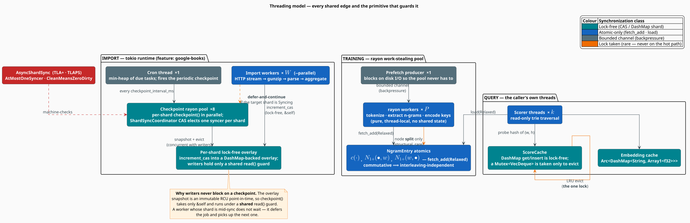

# Threading Model

libgrammstein's concurrency design rests on a single organizing question: **is this operation
commutative?** Where the answer is yes — n-gram counting, overlay writes — the code takes no lock
at all, because the interleaving cannot change the result. Where the answer is no — stochastic
gradient descent, LRU eviction, shard creation — the code takes a lock, and pays for it
deliberately. This document is the complete inventory: every thread, every shared edge, every
primitive, and the argument for each choice.

> **Scope.** Source of truth:
> [`src/ngram/entry.rs`](../../src/ngram/entry.rs) (the atomic counters),
> [`src/ngram/trainer.rs`](../../src/ngram/trainer.rs) (the rayon training pool),
> [`src/corpus/prefetch.rs`](../../src/corpus/prefetch.rs) (the producer thread),
> [`src/hybrid/model.rs`](../../src/hybrid/model.rs) (the score cache),
> [`src/sources/google_books/sharding/`](../../src/sources/google_books/sharding/) (the shard
> coordinator and its sync state machine), and
> [`src/util/cron/mod.rs`](../../src/util/cron/mod.rs) (the checkpoint scheduler). The
> concurrency invariants are machine-checked; see
> [`formal/tla/AsyncShardSync.tla`](../../formal/tla/AsyncShardSync.tla) and §9.

## Notation

Every symbol below is defined before it is used in a formula.

| Symbol | Meaning |
|---|---|
| $`P`$ | number of hardware threads (rayon pool width) |
| $`W`$ | number of import workers (`--parallel`) |
| $`S`$ | number of shards |
| $`k`$ | number of concurrent scorer threads |
| $`p`$ | the **parallelizable fraction** of a workload, $`p \in [0,1]`$ |
| $`T_1`$ | wall-clock time of the serial execution |
| $`T_P`$ | wall-clock time on $`P`$ threads |
| $`(M, \oplus, e)`$ | a monoid: a set $`M`$, an associative operation $`\oplus`$, an identity $`e`$ |
| $`c(\cdot)`$ | the raw count stored in an `NgramEntry` |
| $`\eta`$ | the SGD learning rate |
| $`\nabla_\theta`$ | the gradient with respect to parameters $`\theta`$ |

**Acronyms.** *CAS* — Compare-And-Swap; *RCU* — Read-Copy-Update; *LRU* — Least Recently Used;
*TOCTOU* — Time-Of-Check-To-Time-Of-Use; *WAL* — Write-Ahead Log; *SGD* — Stochastic Gradient
Descent; *MPSC* — Multi-Producer Single-Consumer; *LSN* — Log Sequence Number.

## 1 · The organizing principle

A shared-memory update needs synchronization **exactly when the result depends on the order of
the updates**. That is an algebraic property, not an engineering preference, and it partitions
libgrammstein's write paths cleanly in two:

| Update | Algebraic structure | Consequence |
|---|---|---|
| Increment an n-gram count | $`(\mathbb{N}, +, 0)`$ — a **commutative** monoid | Order-independent ⟹ **no lock**. A plain `fetch_add` suffices. |
| Insert into the shard overlay | $`(\mathbb{N}, +, 0)`$ per key, keys independent | Order-independent ⟹ **no lock**. A CAS loop suffices. |
| Apply an SGD update $`\theta \leftarrow \theta - \eta \nabla_\theta`$ | **not** commutative — $`\nabla_\theta`$ depends on the current $`\theta`$ | Order-dependent ⟹ needs exclusion, or a deliberate decision to tolerate races. |
| Evict the LRU entry | order **is** the semantics | Needs a lock. |
| Create a shard file | not idempotent at the filesystem level (TOCTOU) | Needs a lock. |

Everything below is a consequence of this table.

## 2 · Thread inventory



**Figure 1** — every thread and every shared edge. Colour encodes the *synchronization class*:
lock-free (teal), atomic-only (blue), bounded channel (grey), and — the exceptions worth naming —
lock taken (orange).

libgrammstein runs three distinct concurrency regimes, and they do not overlap in a single
process phase:

| Regime | Executor | Threads | What is shared |
|---|---|---|---|
| **Training** | rayon work-stealing pool | 1 producer + $`P`$ workers | the trie's atomic counters |
| **Import** | tokio runtime + a nested rayon pool | $`W`$ workers + 1 cron + ≤8 checkpointers | $`S`$ per-shard overlays; the vocabulary |
| **Query** | the caller's own threads | $`k`$ | the score cache; the read-only trie |

## 3 · Training

### 3.1 · The producer/consumer seam

Reading a corpus is I/O-bound; counting n-grams is CPU-bound. Fusing them in one thread means
each waits on the other. `PrefetchingReader` splits them across a **bounded** channel:

```rust
// The producer thread blocks on the disk so the rayon pool never has to.
for batch in prefetch.batches() {
    batch.par_iter().for_each(|sentence| {
        let tokens: Vec<&str> = tokenize(sentence);
        for n in 1..=order.min(tokens.len()) {
            for i in 0..=(tokens.len() - n) {
                trie.insert(&tokens[i..i + n]);   // atomic; no lock
            }
        }
    });
}
```

The channel's **boundedness is the load-bearing property**: it supplies backpressure. If counting
falls behind, the producer blocks on a full channel rather than accumulating an unbounded backlog
of sentences in RAM. Buffer depth auto-tunes to ≈10 % of free memory.

### 3.2 · Why the batch loop is sequential and the inner loop is parallel

`prefetch.batches()` is consumed serially; `batch.par_iter()` is where the parallelism lives. That
is deliberate. Making the outer loop parallel too would require the channel receiver to be shared
across the pool, adding contention — for no benefit, since the inner loop already saturates all
$`P`$ threads with a batch of 10 000 sentences.

## 4 · Why the counters need no lock

This is the argument that the entire training design rests on, so it is worth making precisely.

**Claim.** Let $`T`$ threads concurrently apply increments to an `NgramEntry`'s `count` field
using `fetch_add` with `Relaxed` ordering. Then the final value of `count` equals the sum of all
increments, regardless of the interleaving.

**Proof.** The increments form a multiset $`\{\delta_1, \ldots, \delta_r\}`$ with
$`\delta_i \in \mathbb{N}`$. Each `fetch_add` is, by the definition of a read-modify-write atomic,
*indivisible*: it reads a value $`v`$ and writes $`v + \delta_i`$ with no interleaved write to that
location observable between the two. Therefore every execution is a total order
$`\sigma`$ on the $`r`$ operations, and the final value is

```math
\begin{array}{lr}
\displaystyle c_{\text{final}} \;=\; \Bigl( \cdots \bigl( (0 \oplus \delta_{\sigma(1)}) \oplus \delta_{\sigma(2)} \bigr) \cdots \Bigr) \oplus \delta_{\sigma(r)}
\;=\; \sum_{i=1}^{r} \delta_i & \text{(T1)}
\end{array}
```

The last equality holds because $`(\mathbb{N}, +, 0)`$ is an **associative and commutative**
monoid: associativity lets the parenthesization be ignored, and commutativity lets the
permutation $`\sigma`$ be ignored. Hence $`c_{\text{final}}`$ is independent of $`\sigma`$. $`\square`$

**Why `Relaxed` is sufficient.** `Relaxed` guarantees atomicity but *not* ordering with respect to
other memory operations. The proof of $`(\mathrm{T1})`$ uses only atomicity — it never needs one
counter's update to be ordered against another's. The counters are read only *after* the training
pass has joined (a `happens-before` edge supplied by the rayon join), so the reader observes all
increments. Paying for `SeqCst` here would buy a guarantee the algorithm does not use, at the cost
of a memory fence on every increment of a multi-billion-increment workload.

All three of `NgramEntry`'s fields — the raw count, the continuation count, and the follower
count — are counters under $`(\mathbb{N}, +, 0)`$, so the same argument covers all three.

### 4.1 · The contrast: why embedding training is *not* lock-free

Skip-gram training applies $`\theta \leftarrow \theta - \eta \nabla_\theta \mathcal{L}(\theta)`$,
and $`\nabla_\theta \mathcal{L}`$ is evaluated **at the current $`\theta`$**. Two updates therefore
do not commute: applying $`u_1`$ then $`u_2`$ differs from $`u_2`$ then $`u_1`$, because $`u_2`$'s
gradient was computed at a $`\theta`$ that $`u_1`$ has since moved. The monoid argument of
$`(\mathrm{T1})`$ simply does not apply.

libgrammstein's embedding trainer therefore performs its SGD updates **sequentially within an
epoch** (`EmbeddingTrainer::train_epoch_on_sentences` holds `&mut SubwordEmbedding`). The
parallelism it does exploit is upstream: corpus reading, tokenization, subword extraction, and
vocabulary construction.

> **Honest limitation.** The literature offers an escape — **Hogwild!** [[3]](#references) shows
> that for *sparse* objectives, letting threads race on the parameter vector without locks
> converges anyway, because two updates rarely touch the same coordinates. Skip-gram is exactly
> such a sparse objective, and that is how the reference FastText implementation parallelizes.
> libgrammstein does not currently take that route: it would trade a reproducible, deterministic
> training run for throughput, and the n-gram side — not the embedding side — is this crate's
> flagship. This is a deliberate, revisitable trade-off, not an oversight.

## 5 · Import

The importer is the one place where all three regimes collide, and it is documented in full in
[Google Books Importer](google-books-importer.md). The concurrency-relevant summary:

### 5.1 · Writers hold a *shared* guard

Each shard is an `Arc<RwLock<ShardHandle>>`, but the write path takes the **read** guard:

```rust
let guard = shard.read();                       // SHARED — many workers at once
guard.increment_lockfree(encoded_key, count)?;  // &self — a lock-free CAS into the overlay
```

This looks paradoxical and is not. The `RwLock` protects the shard *handle's* structure (whether
it is open, whether it is being torn down), not its *contents*. The contents — the lock-free
overlay — are internally synchronized by CAS. So $`W`$ workers write to the same shard
concurrently under $`W`$ simultaneous read guards, and none of them blocks another. The exclusive
`write()` guard is taken only where a `&mut self` operation genuinely requires it: committing a
document transaction.

### 5.2 · Checkpoints do not stop writers

`checkpoint()` is also a `&self` operation taken under a **read** guard. It publishes an immutable
RCU snapshot of the overlay into the durable image; writers continue mutating the live overlay
throughout. A write that lands *during* the snapshot is not lost — it is retained in the WAL and
replayed on reopen, a guarantee delegated to and machine-checked by libdictenstein's
`LockFreeDurableCheckpoint` model.

### 5.3 · Defer-and-continue

A worker whose target shard is mid-sync does not block. It **defers**: the job is pushed back to
the queue with a small delay, the worker picks up the next job, and no retry counter is
incremented (this is not an error). A starvation guard handles the degenerate case in which
*every* queued job targets a syncing shard: after cycling the whole queue, the worker sleeps until
the earliest job is ready, with per-worker jitter to prevent a thundering herd.

This is the pattern that keeps $`W`$ workers busy across $`S`$ shards while ≤8 of those shards are
being fsynced.

### 5.4 · The cron thread

Periodic checkpoints are driven by a **lock-free reactive state machine**
([`src/util/cron/mod.rs`](../../src/util/cron/mod.rs)) rather than a sleep loop:

| Component | Primitive | Lock-free |
|---|---|---|
| Task submission | crossbeam MPSC channel | yes |
| Termination signal | `AtomicBool` | yes |
| Statistics | `AtomicU64` | yes |
| Checkpoint state reads | `ArcSwap` + `AtomicU64` | yes |
| Task queue | `BinaryHeap`, **thread-local** to the scheduler | not shared at all |

The scheduler's states are `CheckEvents → DrainChannel → ExecutingTask → Sleeping → Terminated`,
and the termination flag is re-examined at every transition — which is what makes shutdown prompt
rather than "prompt within one sleep interval". The machine is modelled and checked in
[`formal/tla/CronStateMachine.tla`](../../formal/tla/CronStateMachine.tla).

## 6 · Query

Queries are read-only and therefore trivially parallel. The only shared mutable state is the
memoization cache, and it is designed so the hot path never blocks:

```rust
struct ScoreCache {
    entries: DashMap<u64, f64>,          // lock-free get + insert
    access_order: Mutex<VecDeque<u64>>,  // the ONE lock — LRU order
    num_entries: AtomicUsize,            // fast size check, no lock
}
```

- **Probe** — a `DashMap` get. Lock-free; $`k`$ scorer threads contend for nothing.
- **Insert** — a `DashMap` insert plus an `AtomicUsize` bump. Lock-free.
- **Evict** — takes the `Mutex<VecDeque>`. This is the only lock on the query path, and it is
  taken **only when the cache is over capacity** (`cache_size`, default 50 000).

The embedding side memoizes word vectors in an `Arc<DashMap<String, Array1<f32>>>` (capacity
100 000) with no eviction lock at all — it simply stops inserting once full.

## 7 · The lock ledger

Every lock in the system, and when it is taken. If a lock is not on this list, it does not exist.

| Lock | Guards | Taken when | On a hot path? |
|---|---|---|---|
| `Mutex<VecDeque<u64>>` (score cache) | LRU ordering | only when the cache is over capacity | No — amortized to rare |
| `RwLock<ShardHandle>` — **read** | shard-handle structure | on every overlay write and every checkpoint | Yes, but **shared**: readers never exclude readers |
| `RwLock<ShardHandle>` — **write** | shard-handle structure | committing a document transaction (`&mut self`) | Once per chunk, not per record |
| `Mutex<()>` per shard key | shard **creation** | first time a shard key is routed to | Once per shard, ever |
| `Mutex<LruCache<ShardKey, ()>>` | which shards stay open | on shard access, when `max_open_shards` is finite | Brief; skipped entirely when unbounded |
| `Mutex<CheckpointManager>` | the global checkpoint JSON | once per checkpoint | No |
| `Mutex<Option<String>>` (sync coordinator) | the last error message | only on a sync failure | No |

Two properties of this ledger are worth stating explicitly:

1. **No lock is held across an `await` or an fsync.** The expensive operations (network I/O, disk
   sync) happen with no lock held; the locks guard bookkeeping, not I/O.
2. **No lock is nested inside another**, with one audited exception: the shard-creation mutex is
   held while `maybe_evict_shard` briefly takes the LRU mutex. The order is fixed and
   documented, so the classic lock-ordering deadlock cannot arise.

## 8 · Memory-ordering discipline

| Ordering | Where | Why that one |
|---|---|---|
| `Relaxed` | all counters — n-gram counts, overlay entry counts, statistics | Atomicity is required; ordering is not. See §4. |
| `Acquire` / `Release` | the shard sync state (`AtomicU8`), the interrupt flag | These *publish* and *observe* state. A `Release` store must make prior writes visible to the `Acquire` loader — that is precisely the ordering the sync handoff needs. |
| `AcqRel` | the CAS in `mark_dirty` and `try_start_sync` | A successful CAS both publishes (Release) and observes (Acquire). |
| `SeqCst` | the import job-queue size counter | The only place a *global* total order across independent atomics is genuinely required, for the all-deferred starvation check. |

The rule of thumb: **pick the weakest ordering that the correctness argument actually uses.**
Over-ordering is not "safer" — it is a fence the algorithm does not need, on a path executed
billions of times.

## 9 · The concurrency is machine-checked


**Figure 2** — the verification coverage. Concurrency is the red column on the left.

The shard sync state machine of §5 is not merely tested; it is proved.

| Property | Meaning | Where |
|---|---|---|
| `AtMostOneSyncer` | The `Dirty → Syncing` CAS means two checkpoint threads can never publish the same shard concurrently. | [`AsyncShardSync.tla`](../../formal/tla/AsyncShardSync.tla) |
| `CleanMeansZeroDirty` | A shard reported `Clean` has no unpublished write. | `AsyncShardSync.tla` |
| `CheckpointAtomicity` | A checkpoint's synced set is exactly its target set before it may save metadata. | `AsyncShardSync.tla` |
| `JobPartition` | Every job is in exactly one of {queued, in-flight, completed}. No job is lost or duplicated. | `AsyncShardSync.tla` |
| `WorkerStateJobConsistency` | A `Processing` worker holds a job; an `Idle` worker holds none. | `AsyncShardSync.tla` |

The specification is checked by **TLC** (bounded model checking), **proved by TLAPS** (249 proof
obligations discharged), and typechecked by **Apalache**. In addition, **loom** exhaustively
explores the memory-ordering interleavings of the Rust implementation itself
([`tests/loom_formal_alignment.rs`](../../tests/loom_formal_alignment.rs)), which is what keeps the
model and the code from drifting apart.

Two things this suite deliberately does *not* re-prove, because libdictenstein already does:

- that a write landing *during* a checkpoint survives (`LockFreeDurableCheckpoint`), and
- that an evicted overlay node faults back losslessly (`LockFreeDurableCheckpointEviction`).

See [`formal/dependencies/libdictenstein-contracts.md`](../../formal/dependencies/libdictenstein-contracts.md)
for the full list of imported contracts.

## 10 · Scaling

Training scales with the parallelizable fraction $`p`$ under Amdahl's law [[1]](#references):

```math
\begin{array}{lr}
\displaystyle S(P) \;=\; \frac{T_1}{T_P} \;=\; \frac{1}{(1 - p) + \dfrac{p}{P}} & \text{(T2)}
\end{array}
```

For n-gram training, the serial residue $`1 - p`$ is small — it comprises the producer thread's
I/O (overlapped, so mostly hidden) and the final count-of-counts reduction ($`O(N)`$, run once).
The counting itself is $`O(C \cdot n)`$ and fully parallel with no lock, so $`p \to 1`$ and speedup
is near-linear until memory bandwidth saturates.

For the importer, the binding constraint is usually *not* $`P`$. It is:

| Constraint | Symptom | Lever |
|---|---|---|
| Network bandwidth | workers idle waiting on HTTP | raise `--parallel`; enable `--cache-files` |
| Upstream rate limiting | HTTP 429s, deferred jobs | lower `--parallel` |
| Disk fsync latency | checkpoints dominate wall time | fewer, larger checkpoints |
| Heap pressure | eviction thrashing | raise `--overlay-budget-gib` |

Adding cores does not help a workload waiting on a socket. Diagnose before tuning.

## 11 · `Send` and `Sync`

Every model is `Send + Sync`, which is a hard requirement of the `LanguageModel` trait that
lling-llang's lattice rescorer consumes. The bounds are structural, not asserted:

| Type | `Send + Sync` because |
|---|---|
| `NgramModel<D>` | `D: Send + Sync` and `NgramEntry` is atomics-only |
| `SubwordEmbedding` | immutable arrays + an `Arc<DashMap>` cache |
| `HybridLanguageModel<D>` | `DashMap` is `Sync`; `parking_lot::Mutex` is `Send + Sync` |
| `ShardCoordinator` | `DashMap` + `parking_lot` primitives throughout |

There is no `unsafe impl Send` or `unsafe impl Sync` anywhere in the crate — the bounds are
derived by the compiler from the field types, which means they cannot silently become wrong when
a field is added.

## Usage

```rust
use std::sync::Arc;
use std::thread;

// Queries are read-only: share one model across as many threads as you like.
let model = Arc::new(trained_model);

let handles: Vec<_> = (0..8)
    .map(|_| {
        let model = Arc::clone(&model);
        thread::spawn(move || model.log_prob("fox", &["the", "quick", "brown"]))
    })
    .collect();

for handle in handles {
    let _score = handle.join().expect("scorer thread panicked");
}
```

For batch scoring, prefer rayon over hand-rolled threads — and consider clearing the score cache
first, since a batch workload has little key reuse and the cache would only add eviction churn:

```rust
use rayon::prelude::*;

hybrid.clear_cache();  // a batch pass has poor cache locality; skip the eviction overhead
let scores: Vec<f64> = sentences
    .par_iter()
    .map(|s| hybrid.sentence_log_prob(s))
    .collect();
```

## Sizing guidance

| Workload | Pool width | Score-cache size |
|---|---|---|
| Interactive correction (REPL, editor) | `num_cpus` | 10 000 — high key reuse |
| Batch scoring / evaluation | `num_cpus` | disabled or cleared — low key reuse |
| Serving (many concurrent requests) | `num_cpus` | 100 000+ — reuse across requests |
| Google Books import | `--parallel` = 8–12; see [the CLI guide](../cli/import-google-books.md) | not applicable |

## References

1. G. M. Amdahl (1967). *Validity of the single processor approach to achieving large scale
   computing capabilities.* AFIPS '67, 483–485.
   [doi:10.1145/1465482.1465560](https://doi.org/10.1145/1465482.1465560)
2. M. Herlihy & N. Shavit (2012). *The Art of Multiprocessor Programming*, revised 1st ed.
   Morgan Kaufmann. ISBN 978-0-12-397337-5. *(Read-modify-write atomics and lock-freedom.)*
3. B. Recht, C. Ré, S. Wright & F. Niu (2011). *Hogwild!: A lock-free approach to parallelizing
   stochastic gradient descent.* NIPS 24, 693–701.
   [arXiv:1106.5730](https://arxiv.org/abs/1106.5730) *(The escape hatch discussed in §4.1.)*
4. P. E. McKenney & J. D. Slingwine (1998). *Read-copy update: Using execution history to solve
   concurrency problems.* PDCS '98, 509–518. *(The RCU discipline the overlay snapshot follows.)*
5. L. Lamport (2002). *Specifying Systems: The TLA+ Language and Tools for Hardware and Software
   Engineers.* Addison-Wesley. ISBN 978-0-321-14306-8.

## See also

- [Architecture Overview](overview.md) — the layers these threads run inside
- [Data Flow](data-flow.md) — what the threads are actually computing
- [Memory Optimization](memory-optimization.md) — the heap bound the checkpoint thread enforces
- [Google Books Importer](google-books-importer.md) — the import regime in full
- [Modified Kneser-Ney](../components/ngram/modified-kneser-ney.md) — the `NgramEntry` atomics in context
- [Large Corpora](../training/large-corpora.md) — operational guidance for parallel training
- [`formal/README.md`](../../formal/README.md) — the machine-checked concurrency specifications
