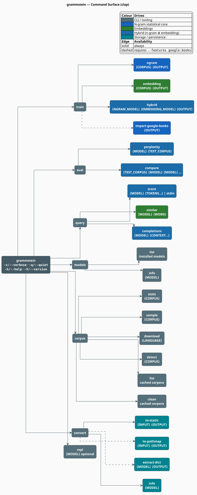

# grammstein CLI Reference

`grammstein` is the command-line front end to libgrammstein: it **trains** n-gram, embedding and
hybrid language models, **evaluates** them by held-out perplexity, **queries** them for scores,
completions and nearest neighbours, and **manages** the corpora and model artifacts around them.
This document is a complete reference for that surface — every command, every flag, every default
— reconciled line-by-line against the `clap` definitions that implement it.

> **Scope.** Source of truth: [`src/cli/args.rs`](../../src/cli/args.rs) (the argument grammar) and
> [`src/cli/commands/`](../../src/cli/commands/) (the behaviour). For the *why* behind the training
> knobs see [N-gram Training](../training/ngram.md), [Embedding Training](../training/embedding.md),
> [Hybrid Training](../training/hybrid.md) and [Hyperparameter Tuning](../training/hyperparameters.md).
> The Google Books importer has its own memory/reliability guide:
> [`import-google-books.md`](import-google-books.md).

## 1. Installation

The binary is gated behind the `cli` feature (it pulls in `clap`, `rustyline`, `indicatif`,
`comfy-table`, `console` and the corpus readers):

```bash
cargo build --release --features cli
```

The binary lands at `target/release/grammstein`. The Google Books importer, the PathMap converter
and the dictionary extractor additionally require the `google-books` feature:

```bash
cargo build --release --features cli,google-books
```

Commands marked **(google-books)** below are absent from a build without that feature — they are
`#[cfg]`-gated at the `clap` level, so they do not even appear in `--help`.

## 2. Reading the synopses

| Convention | Meaning |
|---|---|
| `<ARG>` | required positional argument |
| `[ARG]` | optional positional argument |
| `<ARG>…` | one or more values |
| `-o, --order <N>` | a flag with both a short and a long form |
| **(inert)** | the flag parses, but no code reads it — see [§11](#11-flags-that-parse-but-do-nothing) |

Every default quoted below is the literal `default_value` in
[`src/cli/args.rs`](../../src/cli/args.rs). Enum-valued flags accept the kebab-case spelling of the
variant (`--strategy log-linear`, `--format plaintext`).

## 3. The command surface

Seven top-level groups. `train`, `eval`, `query`, `models`, `corpus` and `convert` each take a
subcommand; `repl` takes an optional model.



*Figure 1 — every command, subcommand and positional argument declared in `src/cli/args.rs`.
Dashed edges are feature-gated on `google-books`.*

## 4. The canonical workflow

The single most important structural fact about the CLI: **`train hybrid` does not read a corpus.**
It is an *assembly* step over two already-trained model files. The two training arms are therefore
independent — you can train them in parallel, and you can reuse one n-gram model across many
hybrids while sweeping `--alpha`.


*Figure 2 — inspect, train the two experts independently, assemble, evaluate, serve.*

```bash
# 1. Look before you leap.
grammstein corpus stats corpus.txt
grammstein corpus detect corpus.txt

# 2. Train the two experts (independent; can run concurrently).
grammstein train ngram     corpus.txt ngram.bin --order 5 --min-count 2
grammstein train embedding corpus.txt embed.bin --dim 100 --epochs 5

# 3. Assemble them. No corpus argument — two model paths and an output path.
grammstein train hybrid ngram.bin embed.bin hybrid.bin --strategy linear --alpha 0.8

# 4. Measure on held-out text, then compare against the n-gram baseline.
grammstein eval perplexity hybrid.bin dev.txt
grammstein eval compare    dev.txt ngram.bin hybrid.bin

# 5. Serve.
grammstein query score hybrid.bin the quick brown fox --sentence
grammstein repl hybrid.bin
```

## 5. Global options

Accepted before or after any subcommand (`clap` global args).

| Flag | Effect |
|---|---|
| `-v, --verbose` | log level `Debug`; echoes the resolved configuration before running |
| `-q, --quiet` | log level `Error`; suppresses progress bars, banners and result tables |
| `-h, --help` | print help for the current command |
| `-V, --version` | print the crate version |

## 6. `train`

### 6.1 `train ngram`

```
grammstein train ngram <CORPUS> <OUTPUT> [OPTIONS]
```

Counts every n-gram of order $`1 \ldots n`$ in the corpus, collects the Kneser-Ney continuation
statistics, estimates the discounts, and writes a portable n-gram model.

| Flag | Default | Meaning |
|---|---|---|
| `-o, --order <ORDER>` | `5` | maximum n-gram order $`n`$ |
| `-m, --min-count <MIN_COUNT>` | `2` | minimum n-gram frequency to retain — **only applied on the checkpointed path**, see the note below |
| `-b, --batch-size <BATCH_SIZE>` | `10000` | sentences per prefetched, rayon-parallel batch |
| `-f, --format <FORMAT>` | `plaintext` | `plaintext` · `wikipedia` · `gutenberg` |
| `--lowercase` | off | lowercase every token before counting |
| `--checkpoint <DIR>` | — | enable the WAL-backed accumulator and write checkpoints here |
| `--resume <PATH\|latest>` | — | resume from a checkpoint; **requires `--checkpoint`** |
| `--checkpoint-interval <N>` | `1000000` | sentences between checkpoints |
| `--keep-checkpoints <N>` | `5` | checkpoint files retained (oldest pruned) |
| `--no-progress` | off | suppress the progress bar |
| `-L, --language <TAG>` | — | BCP 47 language tag **(inert)** |
| `--detect-language` | off | **(inert)** |
| `--threads <N>` | — | **(inert)** |
| `--max-memory <SIZE>` | — | **(inert)** |
| `--auto-clean` | off | **(inert)** |

> **`--min-count` behaves differently on the two paths.** Without `--checkpoint`, training runs
> in memory through `TrainerBuilder`, whose `min_word_freq` field is *stored but never read* while
> counting — so **no pruning happens and every n-gram is kept**. With `--checkpoint`, the finalizer
> exports only those n-grams whose accumulated count reaches `--min-count`. If you need a pruned
> model today, train with `--checkpoint`. See [N-gram Training §3](../training/ngram.md#3-the-two-training-paths).

```bash
# In-memory (fast, no pruning, no resumption):
grammstein train ngram corpus.txt model.bin --order 5

# Checkpointed (resumable, prunes at --min-count):
grammstein train ngram big.txt model.bin --order 5 --min-count 5 \
  --checkpoint ./checkpoints --checkpoint-interval 500000

# Interrupted? Resume. (Ctrl-C also writes a checkpoint before exiting.)
grammstein train ngram big.txt model.bin --checkpoint ./checkpoints --resume latest

# A Wikipedia dump — note that a URL requires --format wikipedia.
grammstein train ngram \
  "https://dumps.wikimedia.org/enwiki/latest/enwiki-latest-pages-articles.xml.bz2" \
  model.bin --format wikipedia --checkpoint ./checkpoints
```

**Corpus resolution.** `plaintext` and `gutenberg` accept a file *or* a directory; `wikipedia`
accepts a local file, or an `http://` / `https://` URL when the `http-corpus` feature is on
(it is, under `cli`). A URL passed with the default `plaintext` format is treated as a filesystem
path and fails with "file not found".

### 6.2 `train embedding`

```
grammstein train embedding <CORPUS> <OUTPUT> [OPTIONS]
```

Trains FastText-style subword embeddings with skip-gram and negative sampling.

| Flag | Default | Meaning |
|---|---|---|
| `-d, --dim <DIM>` | `100` | embedding dimension |
| `-w, --window <WINDOW>` | `5` | maximum context window (the effective width is drawn uniformly from $`\{1,\dots,w\}`$ per centre word) |
| `-m, --min-count <MIN_COUNT>` | `5` | discard words below this corpus frequency |
| `-n, --neg-samples <N>` | `5` | negative samples per positive pair |
| `-e, --epochs <EPOCHS>` | `5` | passes over the corpus |
| `-l, --learning-rate <LR>` | `0.025` | initial learning rate; decays linearly to $`0`$ |
| `-f, --format <FORMAT>` | `plaintext` | `plaintext` · `wikipedia` · `gutenberg` |
| `--checkpoint <DIR>` | — | write a checkpoint after training completes |
| `--resume <PATH>` | — | continue a checkpointed run; **requires `--checkpoint`** |
| `--checkpoint-interval <N>` | `1000000` | accepted; the embedding path checkpoints per-run, not per-interval |
| `--keep-checkpoints <N>` | `5` | checkpoint files retained |
| `--no-progress` | off | suppress the progress bar |
| `-L, --language <TAG>` | — | **(inert)** |
| `--detect-language` | off | **(inert)** |
| `--vocab-first` | off | **(inert)** |
| `--threads <N>` | — | **(inert)** |
| `--max-memory <SIZE>` | — | **(inert)** |
| `--auto-clean` | off | **(inert)** |

> **The CLI default learning rate is not the library default.** `--learning-rate` defaults to
> $`0.025`$, while `EmbeddingConfig::default` uses $`0.05`$. A CLI run and a library run with
> "default" settings are therefore *not* the same experiment.

> **Checkpointing is coarse.** `train_embedding_with_checkpoints` trains **all** epochs and then
> writes one checkpoint; the trainer has no epoch-by-epoch entry point. `--resume` continues from
> the saved epoch count via `train_continued`, which recovers the ephemeral sampling statistics in
> one extra vocabulary-aligned pass.

```bash
grammstein train embedding corpus.txt embed.bin --dim 300 --epochs 10 --window 5
```

### 6.3 `train hybrid`

```
grammstein train hybrid <NGRAM_MODEL> <EMBEDDING_MODEL> <OUTPUT> [OPTIONS]
```

**Three positionals, no corpus.** Loads two pre-trained models, wraps them in a
`HybridLanguageModel`, and writes the combined artifact.

| Flag | Default | Meaning |
|---|---|---|
| `-s, --strategy <STRATEGY>` | `linear` | `linear` · `log-linear` · `ngram-fallback` · `dynamic` |
| `-a, --alpha <ALPHA>` | `0.8` | interpolation weight $`\alpha`$; $`1`$ = pure n-gram, $`0`$ = pure embedding |
| `--cache-size <N>` | `50000` | entries in the lock-free score cache |

`--alpha` maps onto the strategies differently — this is the one place the CLI *derives* parameters
rather than passing them through:

| `--strategy` | Resulting `InterpolationStrategy` | Use of $`\alpha`$ |
|---|---|---|
| `linear` | `Linear { alpha: α }` | mixing weight on probabilities |
| `log-linear` | `LogLinear { alpha: α }` | mixing weight in log space |
| `ngram-fallback` | `NgramWithEmbeddingFallback` | **ignored** |
| `dynamic` | `Dynamic { base_alpha: 0.5·α, alpha_per_context: 0.1, max_alpha: min(α, 0.95) }` | seeds all three fields |

`HybridConfig::embedding_smoothing` ($`10^{-8}`$) and `temperature` ($`1.0`$) are **not** exposed as
flags; they take their defaults. Tune them through the library API.

```bash
grammstein train hybrid ngram.bin embed.bin hybrid.bin --strategy log-linear --alpha 0.7
```

### 6.4 `train import-google-books` **(google-books)**

```
grammstein train import-google-books <OUTPUT> [OPTIONS]
```

Imports the public Google Books n-gram dataset directly into a `PersistentARTrie`, over HTTP or
from a directory of `.gz` files. `<OUTPUT>` is a **positional** argument — there is no `--output`
flag, and orders are given as a `--min-order` / `--max-order` pair, not a range literal.

| Flag | Default | Meaning |
|---|---|---|
| `-L, --language <LANG>` | `en` | `en` · `de` · `fr` · `es` · `it` · `ru` · `he` · `zh` |
| `--min-order <N>` | `1` | lowest n-gram order to import |
| `--max-order <N>` | `5` | highest n-gram order to import (max `5`) |
| `-m, --min-count <N>` | `40` | frequency floor |
| `--min-year <YEAR>` | — | drop older publications (with only `--min-year`, the range becomes `[min, 2020]`) |
| `--max-year <YEAR>` | — | drop newer publications (with only `--max-year`, the range becomes `[1800, max]`) |
| `--prefix <PREFIX>` | — | import a single prefix: `a`–`z`/`other` for 1-grams; `aa`–`zz`/`other`/`punctuation` for 2–5-grams |
| `--skip-pos-tags` | off | drop POS-tagged n-grams (`_NOUN_`, …) |
| `--local-files <DIR>` | — | import from `.gz` files on disk instead of HTTP |
| `--parallel <N>` | `4` | concurrent download streams (also sizes the Tokio worker pool) |
| `--cache-files` | off | download each `.gz` to `{output_dir}/grammstein-cache/` before parsing |
| `--tx-chunk-size <ENTRIES>` | `500000` | entries per chunked transaction; `0` disables chunking |
| `--lockfree-flush-threshold <ENTRIES>` | auto | overlay entries per shard before a forced flush; auto = `50000` when `--parallel >= 8`, else `100000` |
| `--overlay-budget-gib <GIB>` | `10` | global resident-overlay heap budget; `0` disables eviction |
| `--sharding <MODE>` | `enabled` | `enabled` · `disabled` |
| `--keep-shards` | off | keep shard files after the merge |
| `--no-progress` | off | disable the TUI and fall back to line logging |
| `--no-resume` | off | **(inert)** — the importer always calls `resume_or_start` |
| `--threads <N>` | — | **(inert)** |
| `--max-memory <SIZE>` | — | **(inert)** |

```bash
# 1–5-grams of English, into ./english.artrie (positional!), 8 workers.
grammstein train import-google-books ./english.artrie \
  --language en --min-order 1 --max-order 5 --parallel 8 --cache-files
```

The HTTP path runs a `ratatui` TUI unless `--quiet` or `--no-progress` is given; pressing **q**
cancels and waits up to 60 s for a checkpoint to land. Debug logs are written to
`import-debug.log` beside `<OUTPUT>` (this is the one place `RUST_LOG` is honoured — see
[§12](#12-logging)). Memory and reliability tuning is covered in depth in
[`import-google-books.md`](import-google-books.md).

## 7. `eval`

There is **no `--metric` flag**; perplexity and comparison are separate subcommands. Both accept
n-gram *and* hybrid models — the loader tries `HybridLanguageModel::load_portable` first, then
`NgramModel::load_portable`. A bare embedding model is not a scoring model and is rejected.

### 7.1 `eval perplexity`

```
grammstein eval perplexity <MODEL> <TEST_CORPUS> [OPTIONS]
```

Reports the corpus perplexity

```math
\mathrm{PPL} = \exp\!\left(-\frac{1}{N}\sum_{i=1}^{N} \log \mathbb{P}(w_i \mid h_i)\right) \tag{E1}
```

where $`N`$ is the total token count and $`h_i`$ the history of token $`w_i`$. Lower is better; the
theoretical floor is $`1`$, and a uniform model over a vocabulary $`V`$ scores $`\lvert V \rvert`$.

| Flag | Default | Meaning |
|---|---|---|
| `-f, --format <FORMAT>` | `plaintext` | test-corpus format |
| `--per-sentence` | off | also report min / max / median of the per-sentence perplexities |
| `-o, --output <PATH>` | — | write the full result as JSON |

Printed: perplexity, total log probability, OOV rate ($`100 \cdot \text{oov} / N`$), average tokens
per sentence, and elapsed time. The JSON adds the per-sentence array when `--per-sentence` is set.

```bash
grammstein eval perplexity hybrid.bin test.txt --per-sentence -o ppl.json
```

### 7.2 `eval compare`

```
grammstein eval compare <TEST_CORPUS> <MODEL> <MODEL> [MODEL…]
```

**The corpus comes first**, then two or more models (`num_args = 2..`). The corpus is read once
into memory and replayed for each model, so the comparison is exactly like-for-like.

| Flag | Default | Meaning |
|---|---|---|
| `-f, --format <FORMAT>` | `plaintext` | test-corpus format |
| `-o, --output <PATH>` | — | write the comparison as JSON |

Prints one row per model — file name, perplexity, OOV rate, elapsed time — and then names the model
with the lowest perplexity.

```bash
grammstein eval compare test.txt ngram.bin hybrid.bin hybrid-alpha0.6.bin
```

## 8. `query`

| Subcommand | Synopsis | Notes |
|---|---|---|
| `score` | `query score <MODEL> [TOKENS…]` | with no tokens, reads **one line** from stdin |
| `similar` | `query similar <MODEL> <WORD>` | needs an embedding or hybrid model |
| `completions` | `query completions <MODEL> <CONTEXT…>` | ranks a candidate vocabulary by score |

**`query score`** — `--sentence` scores the whole token sequence; `--continuation` scores the *last*
token given the preceding ones and requires at least two tokens; `-j, --json` emits JSON.

**`query similar`** — `-n, --top <N>` (default `10`), `-j, --json`. Cosine nearest neighbours over
the embedding matrix.

**`query completions`** — `-n, --top <N>` (default `10`), `-j, --json`. For a hybrid model the
candidate set is the *embedding vocabulary*; for a pure n-gram model the trie's unigrams are
enumerated instead, which is markedly slower on a large model.

```bash
grammstein query score hybrid.bin the quick brown fox --sentence
echo "the quick brown fox" | grammstein query score hybrid.bin --sentence
grammstein query score hybrid.bin the quick brown fox --continuation
grammstein query similar embed.bin king -n 5
grammstein query completions hybrid.bin the quick -n 10 --json
```

## 9. `models`, `corpus`, `convert`

### 9.1 `models`

| Subcommand | Synopsis | Flags |
|---|---|---|
| `list` | `models list` | `-L, --language <TAG>` · `--format table\|json` (default `table`) · `--models-dir <DIR>` (default `./models`) |
| `info` | `models info <MODEL>` | `-j, --json` |

`models list` enumerates the **model files installed in a directory** (inferring language and
dialect from the path); it does not list the n-grams inside a model. `models info` reports the
detected type, order, vocabulary size and file size.

### 9.2 `corpus`

| Subcommand | Synopsis | Flags |
|---|---|---|
| `stats` | `corpus stats <CORPUS>` | `-f, --format` |
| `sample` | `corpus sample <CORPUS>` | `-n, --count <N>` (default `10`) · `-f, --format` · `--seed <SEED>` |
| `download` | `corpus download <LANGUAGE>` | `-s, --source wikipedia\|gutenberg\|oscar` (default `wikipedia`) · `-o, --output <DIR>` · `--sample` · `--resume` |
| `detect` | `corpus detect <CORPUS>` | `-f, --format` |
| `list` | `corpus list` | `--verbose` · `--format table\|json` |
| `clean` | `corpus clean` | `--dry-run` · `-s, --source <SRC>` · `--older-than <DAYS>` · `-f, --force` · `--all` |

`corpus stats` reports document, sentence, token and vocabulary counts plus the min/max/mean tokens
per document. `corpus detect` reports the detected language and a confidence percentage.
`corpus list` / `corpus clean` manage the download cache; `--dry-run` shows what `clean` would
delete.

### 9.3 `convert`

| Subcommand | Synopsis | Notes |
|---|---|---|
| `to-static` | `convert to-static <INPUT> <OUTPUT>` | rebuilds the model on an immutable `DoubleArrayTrieChar` — faster reads, no further writes. Works for n-gram, hybrid and embedding models. |
| `to-pathmap` | `convert to-pathmap <INPUT> <OUTPUT>` | **(google-books)** translate a `PersistentARTrie` model to PathMap; `--verify` re-checks integrity afterwards |
| `extract-dict` | `convert extract-dict <MODEL> <OUTPUT>` | **(google-books)** build a `DoubleArrayTrieChar` dictionary from the model's 1-grams; `-m, --min-count <N>` (default `100`) · `--unigrams-only` |
| `info` | `convert info <MODEL>` | print the model's metadata |

```bash
grammstein convert to-static hybrid.bin hybrid-static.bin
grammstein convert extract-dict english.artrie dict.datc --min-count 100
```

## 10. `repl`

```
grammstein repl [MODEL] [--history <PATH>]
```

`--history` defaults to `~/.grammstein_history` (tilde-expanded). A model given on the command line
is loaded at startup; otherwise use `load`.

| REPL command | Meaning |
|---|---|
| `load <path>` | load a model (hybrid, then n-gram, then embedding are tried in order) |
| `info` | show the loaded model's type and statistics |
| `score <tokens…>` | log-probability and perplexity of a sentence |
| `prob <context…> \| <word>` | $`\mathbb{P}(\text{word} \mid \text{context})`$ — note the literal `\|` separator |
| `similar <word> [n]` | nearest neighbours (default `n = 10`) |
| `complete <context…> [n]` | top completions (default `n = 10`); a trailing integer is read as `n` |
| `perplexity <file>` (`ppl`) | evaluate perplexity on a file |
| `help` (`h`, `?`) | list the commands |
| `quit` (`exit`, `q`) | leave |

`Ctrl-C` cancels the current line; `Ctrl-D` exits.

## 11. Flags that parse but do nothing

These are declared in [`src/cli/args.rs`](../../src/cli/args.rs) and accepted on the command line,
but **no code reads them**. They are documented here rather than omitted, because silently ignoring
a flag an operator believes is limiting memory or parallelism is worse than saying so.

| Flag | Where accepted | Status |
|---|---|---|
| `--threads <N>` | `train ngram` · `train embedding` · `train import-google-books` | never read; rayon uses its default pool (`RAYON_NUM_THREADS` still works). For the importer, `--parallel` *does* size the Tokio pool. |
| `--max-memory <SIZE>` | same | never read; use `--checkpoint`, `--tx-chunk-size` and `--overlay-budget-gib` to bound memory |
| `-L, --language`, `--detect-language` | `train ngram` · `train embedding` | never read on the training paths. `-L` *is* honoured by `models list`, `corpus download` and `train import-google-books`. |
| `--vocab-first` | `train embedding` | never read; the trainer always builds the vocabulary in a first pass |
| `--auto-clean` | `train ngram` · `train embedding` | never read; downloaded corpora are not deleted |
| `--no-resume` | `train import-google-books` | never read; the importer always resumes an existing checkpoint. To force a fresh import, remove the checkpoint directory. |

## 12. Logging

Verbosity is controlled by `-v` / `-q` alone: `--quiet` maps to `Error`, `--verbose` to `Debug`,
the default to `Info`. The main binary initialises `env_logger` with an explicit level filter and
**does not consult `RUST_LOG`**.

The single exception is `train import-google-books`, whose TUI installs a `tracing` file subscriber
using `EnvFilter::try_from_default_env()`. There, `RUST_LOG` *is* honoured; the fallback filter is
`libgrammstein::sources::google_books=debug,libgrammstein::cli::tui=debug`, and output goes to
`import-debug.log` beside the output file (not to the terminal, which the TUI owns).

## 13. Exit codes

| Code | Meaning |
|---|---|
| `0` | success |
| `1` | the command failed — the `CliError` is printed to stderr |
| `2` | `clap` rejected the arguments (unknown flag, missing positional, bad enum value) |

## 14. See also

- [Google Books import guide](import-google-books.md) — memory and reliability flags in depth
- [N-gram Training](../training/ngram.md) · [Embedding Training](../training/embedding.md) ·
  [Hybrid Training](../training/hybrid.md) — the theory and practice behind the `train` flags
- [Hyperparameter Tuning](../training/hyperparameters.md) — how to choose `--order`, `--dim`, `--alpha`
- [Large Corpora](../training/large-corpora.md) — checkpointing, streaming and memory bounds
- [Modified Kneser-Ney](../components/ngram/modified-kneser-ney.md) — the smoother behind every n-gram model
- [Hybrid Interpolation](../components/hybrid/interpolation.md) — what `--strategy` and `--alpha` actually do
