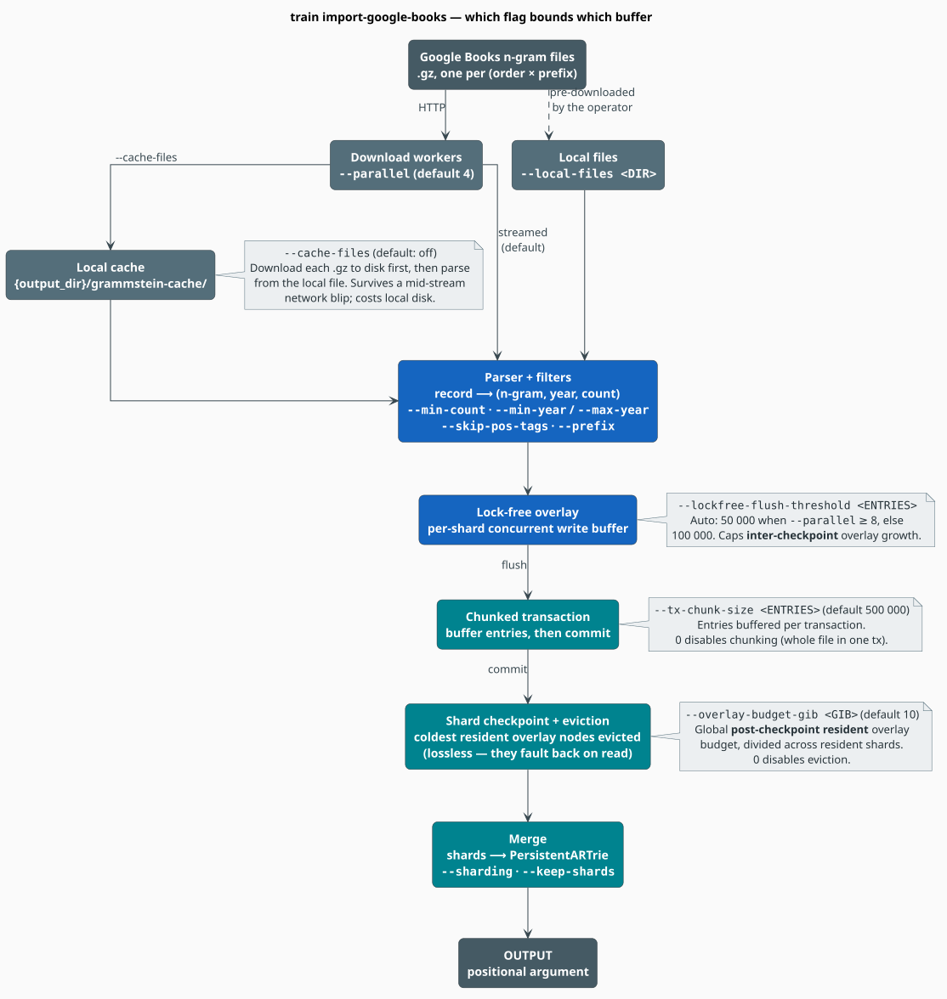

# `train import-google-books` — Memory & Reliability

The Google Books n-gram corpus is the largest input libgrammstein ingests: billions of n-gram
records, arriving over HTTP as gzipped, prefix-partitioned files, landing in a persistent
adaptive-radix trie. At that scale the interesting question is not *what* the importer computes but
*how much RAM it holds while computing it*. This guide explains the four flags that bound the
importer's memory, the one flag that hardens its network path, and how to size them for a given
machine.

> **Scope.** Source of truth: [`src/cli/args.rs`](../../src/cli/args.rs) (flag grammar),
> [`src/cli/commands/train/google_books.rs`](../../src/cli/commands/train/google_books.rs)
> (command wiring), [`src/sources/google_books/importer/cache.rs`](../../src/sources/google_books/importer/cache.rs)
> (the `--cache-files` download path) and
> [`src/sources/google_books/sharding/config.rs`](../../src/sources/google_books/sharding/config.rs)
> (the overlay-eviction budget). For the design story behind these bounds see
> [Memory Optimization](../architecture/memory-optimization.md); for the full command surface see
> the [CLI Reference](README.md#64-train-import-google-books-google-books).

## Notation

| Symbol | Meaning |
|---|---|
| $`B`$ | the global resident-overlay budget in bytes (`--overlay-budget-gib` $`\times\ 2^{30}`$) |
| $`S`$ | the number of **simultaneously resident** shards |
| $`b_s`$ | the per-shard resident-overlay budget derived from $`B`$ |
| $`K`$ | the number of shards the granularity defines (`num_shards`) |
| $`M`$ | `max_open_shards` — the LRU cap on resident shards (default $`100`$) |
| $`T`$ | `--tx-chunk-size`, entries buffered per transaction |
| $`F`$ | `--lockfree-flush-threshold`, overlay entries per shard before a forced flush |
| $`P`$ | `--parallel`, the number of concurrent download workers |

## 1. TL;DR — a 32 GB machine

`<OUTPUT>` is a **positional argument** (there is no `--output` flag), and the order range is a
`--min-order` / `--max-order` **pair** (there is no `--orders` flag):

```bash
grammstein train import-google-books ./english.artrie \
  --language en \
  --min-order 1 \
  --max-order 5 \
  --parallel 8 \
  --tx-chunk-size 250000 \
  --lockfree-flush-threshold 25000 \
  --overlay-budget-gib 12 \
  --cache-files
```

Every one of those flags is independent of the others; the sections below say what each one bounds
and how to move it.

## 2. What the importer actually does

For each order in $`[\text{min\_order}, \text{max\_order}]`$ and each prefix partition of that
order, a worker fetches one `.gz` file, parses its records into
$`(\text{n-gram}, \text{year}, \text{count})`$ triples, applies the year and frequency filters, and
folds the surviving counts into a shard of the persistent trie. When every file is done, the shards are merged into the single
output trie and the Modified Kneser-Ney statistics are derived from the merged image.

Four buffers sit on that path, and each has exactly one flag that bounds it.

## 3. Flag → stage map



*Figure 1 — the download path (bounded by `--cache-files`) and the write path (bounded by
`--tx-chunk-size`, `--lockfree-flush-threshold` and `--overlay-budget-gib`).*

## 4. `--cache-files` — hardening the download

**Default: off.** With the flag on, a worker downloads the whole `.gz` to a local cache directory
and *then* parses it from disk, rather than parsing straight out of the HTTP byte stream.

| Enable it when | Skip it when |
|---|---|
| the upstream connection is unstable — a dropped socket costs a re-download, not a re-parse | the network is fast and stable, and local disk is scarce |
| the import is long enough that a mid-stream blip would waste hours of CPU | the run is a single small prefix that finishes before caching pays off |
| you are debugging the parser against a fixed input | you are RAM- and disk-constrained and would rather stream |

**Mechanics** (from [`cache.rs`](../../src/sources/google_books/importer/cache.rs)):

- Cached files live in `{output_dir}/grammstein-cache/`.
- A download writes to `<name>.gz.downloading` and **atomically renames** it to `<name>.gz` on
  completion, so a partial file can never be mistaken for a complete one.
- If a complete `.gz` is already present, the download is **skipped** (cache hit).
- If a `.gz.downloading` remnant is present, the worker resumes it with a
  `Range: bytes=<len>-` request. A `206 Partial Content` response is appended to the remnant;
  a `200 OK` (server ignored the range) restarts the file; a `416 Range Not Satisfiable` deletes
  the stale remnant and re-requests from scratch.
- HTTP `429` is surfaced as a retryable rate-limit error carrying the server's `Retry-After`.
- After each attempt — **success or failure** — the worker deletes both the `.gz` and any
  `.downloading` remnant. Resumption therefore matters *across process restarts* (a hard kill leaves
  the remnant behind, and the next run continues it), not between retries inside one run.

## 5. `--tx-chunk-size <ENTRIES>` — the transaction buffer

**Default: 500 000.** The number of n-grams buffered in one prefix transaction before a chunked
commit. This is the flag that matters most for the 2-gram files, which carry 50–100 M entries each:
buffering one of those in a single transaction is several GiB **per worker**.

| Value | Effect |
|---|---|
| `0` | chunking disabled — the entire prefix file is buffered in one transaction. Lowest write-ahead-log churn, highest peak memory. |
| 100 000 – 250 000 | memory-constrained hosts (16–32 GB with $`P = 8`$). |
| 500 000 (default) | balanced for 64 GB and up. |
| 1 000 000 and above | large-memory hosts trading RAM for throughput. |

Chunked commits use **set semantics**, so re-importing a prefix is idempotent: if the process dies
between two chunk commits, the prefix is re-imported from the beginning on resume and the
already-committed chunks are overwritten with identical values. Correctness never depends on where
the chunk boundary fell.

## 6. `--lockfree-flush-threshold <ENTRIES>` — the overlay high-water mark

**Default: auto-scaled** — $`F = 50\,000`$ when $`P \geq 8`$, otherwise $`F = 100\,000`$.

The overlay is the lock-free write buffer in front of each shard's persistent trie: it is what lets
many workers write concurrently without a lock. $`F`$ caps how many entries a shard's overlay may
accumulate before the importer forces a flush, which bounds overlay growth **between checkpoints**.

| Value | Effect |
|---|---|
| 10 000 – 25 000 | very memory-constrained; frequent flushes, lower peak heap, more I/O |
| 50 000 (auto when $`P \geq 8`$) | standard for high-parallelism imports |
| 100 000 (auto when $`P < 8`$) | lower parallelism amortises the flush cost over fewer writers |
| 200 000 and above | large-memory hosts on fast SSDs: fewer flushes, higher peak |

Passing the flag overrides the auto-scaled value. Driving it very low (say $`1\,000`$) turns nearly
every write into a flush: useful when bisecting a corruption bug, ruinous for throughput.

## 7. `--overlay-budget-gib <GIB>` — the resident-heap bound

**Default: 10 GiB.** This is the hard ceiling on the *resident* overlay across all shards, and it is
the flag that keeps a full 1–5-gram import inside a fixed heap. After each shard checkpoint, the
tail evicts that shard's coldest resident overlay nodes down to its share of the budget. Eviction is
**lossless**: an evicted node faults back from the durable image the next time it is read.

The budget is divided across the shards that are resident *at the same time*, so the sum over the
resident set approximates the global budget regardless of granularity:

```math
S = \begin{cases}
K & \text{hash-based granularity, or } M = 0 \\
\min(M,\ K) & \text{otherwise}
\end{cases}
\qquad
b_s = \max\!\left(\left\lfloor \frac{B}{S} \right\rfloor,\ 64\ \mathrm{MiB}\right) \tag{G1}
```

The $`64\ \mathrm{MiB}`$ floor stops the division from producing a budget so small that the shard
thrashes — evicting nodes it is about to read back. Each eviction pass is additionally capped at
$`200\,000`$ nodes so the checkpoint tail cannot stall.

**Worked example.** Defaults: `Adaptive` granularity (prefix-based, so $`M`$ applies), $`K = 676`$
shards for 2–5-grams, $`M = 100`$, $`B = 10\ \mathrm{GiB}`$. Then $`S = \min(100, 676) = 100`$ and
$`b_s = \max(10240/100,\ 64) = 102.4\ \mathrm{MiB}`$ per resident shard, for $`\approx 10`$ GiB
resident in total.

| Value | Effect |
|---|---|
| `0` | eviction disabled — the resident overlay grows without bound (the legacy behaviour) |
| 8 | aggressive: more headroom under a 16 GB ceiling, more fault-back-on-read |
| 10 (default) | balanced for a $`\leq 16`$ GB heap target on a 32 GB machine |
| 12 – 14 | larger heaps: fewer read faults, tighter against the limit |

## 8. How the flags interact

- **`--cache-files` is orthogonal to the other three.** It governs the *download* path; they govern
  the *write* path.
- **$`F`$ and $`B`$ are complementary overlay bounds.** $`F`$ caps *inter-checkpoint* growth
  (entries before a forced flush); $`B`$ caps the *post-checkpoint resident* overlay (bytes retained
  after eviction). $`F`$ paces the flushes; $`B`$ reclaims the RAM at each checkpoint tail. Setting
  one does not relieve you of setting the other.
- **$`T`$ multiplies with $`P`$.** Peak transaction memory scales as $`O(P \cdot T)`$ — doubling
  the workers doubles the number of live transaction buffers. Halve $`T`$ when you double $`P`$ if
  the heap is already tight.
- **Resume ignores your old flags.** $`T`$ and $`F`$ are re-read from the current run's command
  line; they are not stored in the checkpoint. A resumed import runs with whatever you pass it now.
- **`mimalloc-alloc` is on automatically.** The `google-books` feature enables it, which removes the
  `mprotect` syscall pressure glibc's allocator generates for large allocations. It is a
  compile-time choice with no CLI knob.

## 9. Sizing recipes

| Machine | `--parallel` | `--tx-chunk-size` | `--lockfree-flush-threshold` | `--overlay-budget-gib` |
|---|---|---|---|---|
| 16 GB | 4 | 100000 | 10000 | 6 |
| 32 GB | 8 | 250000 | 25000 | 12 |
| 64 GB | 8 | 500000 | 50000 (auto) | 24 |
| 256 GB | 16 | 1000000 | 200000 | 96 |

Start from the row above your machine, run a single prefix (`--prefix th --min-order 2 --max-order 2`),
watch the resident set, and only then launch the full import.

## 10. Operating the import

- **Progress.** The HTTP path drives a `ratatui` TUI unless `--quiet` or `--no-progress` is set.
  Pressing **q** cancels; the importer then has up to 60 seconds to land a checkpoint.
- **Logs.** Because the TUI owns the terminal, debug output goes to `import-debug.log` beside
  `<OUTPUT>`. This is the one command that honours `RUST_LOG`; the fallback filter is
  `libgrammstein::sources::google_books=debug,libgrammstein::cli::tui=debug`.
- **Resume is automatic.** The importer always calls `resume_or_start`, so re-running the same
  command continues from the checkpoint. (`--no-resume` parses but is **not read** — to force a
  fresh import, delete the checkpoint directory.)
- **Local files.** `--local-files <DIR>` bypasses HTTP entirely and imports every `.gz` in the
  directory; the command fails immediately if there are none.
- **One prefix at a time.** `--prefix` restricts the run to a single partition (`a`–`z` or `other`
  for 1-grams; `aa`–`zz`, `other` or `punctuation` for 2–5-grams). The prefix must be valid for at
  least one order in the requested range, or the command is rejected.

## 11. Compatibility and migration

The importer builds against libdictenstein's lock-free persistent-ARTrie. Two operational
consequences follow:

- **Checkpoints written by older builds must be re-imported.** A prior bug corrupted a
  vocabulary/n-gram checkpoint on reopen once its serialized image spanned more than a few arenas —
  which is to say, every at-scale Google Books checkpoint. The bug is fixed, but an image written by
  an older build is not trustworthy and there is no in-place repair. Start a fresh import.
- **One owner per checkpoint.** Opening any persistent trie (vocabulary, n-gram shard, or
  checkpoint metadata) takes an advisory `flock` on a `<path>.wlock` sidecar. A second process — or
  a second independent handle to the same file — is rejected with an explicit "already
  opened/locked" error instead of silently corrupting the image. Same-process reopen (resume after
  crash) is unaffected. The sidecars are transient and git-ignored; a stale one left by a hard kill
  can be removed by hand.

## 12. See also

- [CLI Reference](README.md) — the complete command surface
- [Large Corpora](../training/large-corpora.md) — the corpus-scale strategies these flags serve
- [Memory Optimization](../architecture/memory-optimization.md) — the design story behind the
  overlay budget and the chunked-transaction pipeline
- [Modified Kneser-Ney](../components/ngram/modified-kneser-ney.md) — the statistics computed from
  the merged image
