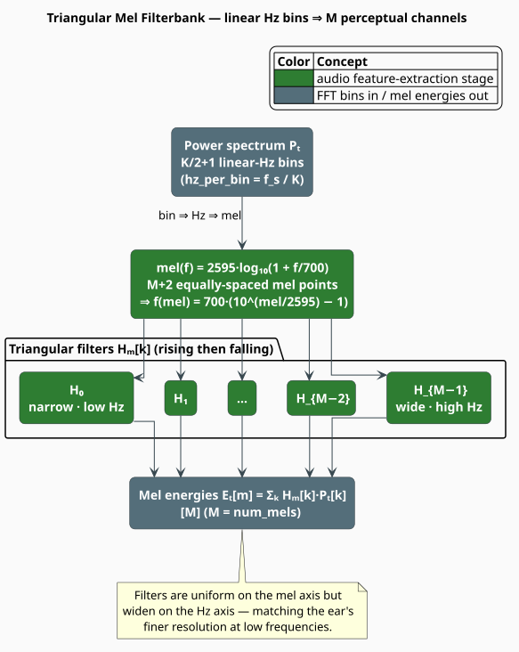
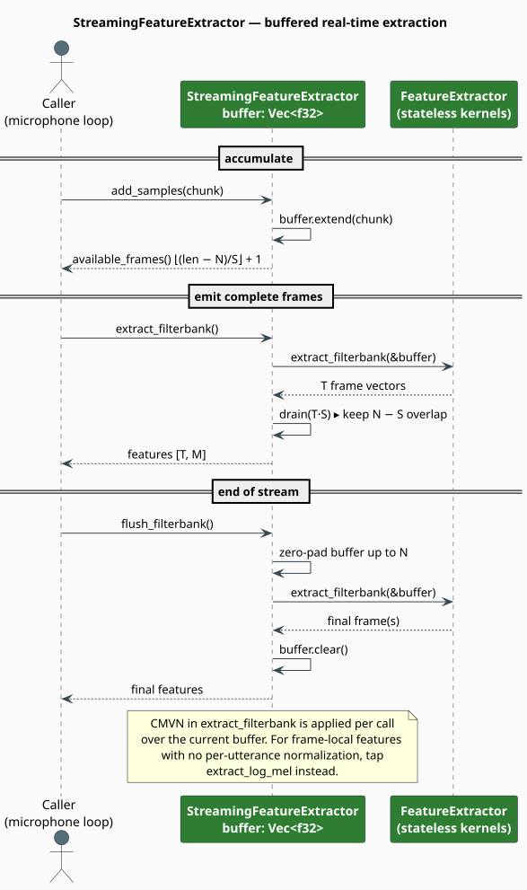

# Feature Extraction

`FeatureExtractor` and `StreamingFeatureExtractor` are the front end of libgrammstein's acoustic
stack: they convert a raw audio waveform into the mel-filterbank, MFCC, log-mel, or spectrogram
frames that downstream acoustic models consume. This document derives the complete signal-
processing pipeline — every stage the code performs, in order — and maps each equation onto the
method that implements it.

> **Scope.** Source of truth: [`src/acoustic/features.rs`](../../../src/acoustic/features.rs). For
> the module tour and feature gates see the [Acoustic Overview](overview.md); for the neural
> models that consume these frames see [Acoustic Models](models.md). The classic MFCC recipe is
> due to Davis & Mermelstein [[1]](#references) and the mel scale to Stevens et al.
> [[2]](#references).

## What & why

Raw audio at $`16{,}000`$ samples per second is far too fine-grained to classify directly:
recognition depends on the *short-time spectral envelope*, not on individual samples. Feature
extraction reduces the signal to roughly $`100`$ frames per second — one short vector every
$`10`$ ms — each summarizing the energy distribution across a bank of perceptually-spaced
frequency channels. Two design choices make these features robust: the **mel scale** spaces the
channels the way the ear resolves pitch, and the **logarithm** turns multiplicative gain (a
louder microphone, a nearer speaker) into an additive offset that later mean-normalization can
remove.

## Notation

Every symbol below is defined before it is used in a formula.

| Symbol | Meaning |
|---|---|
| $`x[n]`$ | raw audio sample at index $`n`$ |
| $`y[n]`$ | the pre-emphasized signal |
| $`\alpha`$ | pre-emphasis coefficient (`pre_emphasis`; default $`0.97`$) |
| $`N`$ | frame size in samples (`frame_size`) |
| $`S`$ | frame shift / hop in samples (`frame_shift`) |
| $`K`$ | FFT size (`fft_size`; a power of two $`\geq N`$) |
| $`w[n]`$ | window-function weight at index $`n`$ |
| $`\tilde{x}_t[n]`$ | the windowed frame $`t`$ |
| $`X_t[k]`$ | complex FFT of frame $`t`$ at bin $`k`$ |
| $`P_t[k]`$ | power (or magnitude) spectrum of frame $`t`$ |
| $`f`$ | a frequency in Hz |
| $`\mathrm{mel}(f)`$ | the mel value of frequency $`f`$ |
| $`M`$ | number of mel channels (`num_mels`) |
| $`b_i`$ | the $`i`$-th mel-point position in fractional FFT bins |
| $`H_m[k]`$ | triangular filter weight, channel $`m`$, bin $`k`$ |
| $`E_t[m]`$ | mel-band energy of frame $`t`$, channel $`m`$ |
| $`\varepsilon`$ | log-stability floor (`LOG_EPSILON` $`= 10^{-10}`$) |
| $`L_t[m]`$ | log mel energy |
| $`c_t[j]`$ | $`j`$-th MFCC coefficient of frame $`t`$ |
| $`J`$ | number of MFCC coefficients (`num_mfcc`) |
| $`\Theta`$ | delta window (`delta_window`; default $`2`$) |
| $`\mu[m], \sigma[m]`$ | per-channel mean and RMS used by CMVN |
| $`T`$ | number of frames; $`L`$ = audio length in samples |

**Acronyms.** *FFT* — Fast Fourier Transform; *DCT* — Discrete Cosine Transform; *MFCC* —
Mel-Frequency Cepstral Coefficients; *CMVN* — Cepstral Mean-and-Variance Normalization.

## Theory

The pipeline is a fixed sequence of stages. The figure shows the shared trunk and the four points
at which the extraction methods tap their outputs.


### Pre-emphasis

A first-difference high-pass filter lifts the high frequencies, compensating for the roughly
$`-6`$ dB/octave spectral tilt of voiced speech (`apply_pre_emphasis`). The first sample passes
through unchanged:

```math
y[0] = x[0], \qquad y[n] = x[n] - \alpha\,x[n-1] \quad (n \geq 1) \tag{F1}
```

Setting $`\alpha = 0`$ (i.e. `pre_emphasis = 0.0`) disables the stage and copies the input.

### Framing and windowing

The signal is cut into overlapping frames of $`N`$ samples advancing by $`S`$; frame $`t`$ begins
at sample $`tS`$. Each frame is copied into a length-$`K`$ zero-padded buffer and multiplied
point-wise by a window $`w[n]`$ (`extract_frame`, `build_window`):

```math
x_t[n] = y[tS + n]\ (0 \le n < N), \qquad \tilde{x}_t[n] = w[n]\,x_t[n] \tag{F2}
```

Windowing tapers each frame to zero at its edges so that the FFT does not see the abrupt frame
boundary as spurious high-frequency energy (*spectral leakage*). The `WindowType` enum selects
the taper; `Hanning` is the default.

| `WindowType` | $`w[n]`$ | Character |
|---|---|---|
| `Hanning` | $`0.5\left(1 - \cos\frac{2\pi n}{N-1}\right)`$ | zero at edges; balanced main-lobe / side-lobe (default) |
| `Hamming` | $`0.54 - 0.46\cos\frac{2\pi n}{N-1}`$ | small non-zero edges; lower nearest side lobe |
| `Blackman` | $`0.42 - 0.5\cos\frac{2\pi n}{N-1} + 0.08\cos\frac{4\pi n}{N-1}`$ | widest main lobe; strongest side-lobe rejection |
| `Rectangular` | $`1`$ | no taper; maximal leakage (special cases only) |

### FFT and the power spectrum

A real-input FFT (from the `realfft` crate, planned once at construction) transforms the windowed
frame; keeping the non-redundant half gives $`K/2 + 1`$ frequency bins (`compute_spectrum`):

```math
X_t[k] = \sum_{n=0}^{K-1} \tilde{x}_t[n]\, e^{-\mathrm{i}\,2\pi k n / K}, \qquad 0 \le k \le \tfrac{K}{2} \tag{F3}
```

The bin is reduced to a real energy — the squared magnitude when `use_power` is set (the default),
otherwise the magnitude:

```math
P_t[k] = \begin{cases} \lvert X_t[k] \rvert^2 & \texttt{use\_power} = \text{true} \\ \lvert X_t[k] \rvert & \text{otherwise} \end{cases} \tag{F4}
```

`extract_spectrogram` returns this $`P_t`$ directly, one $`K/2+1`$-vector per frame.

### The mel filterbank

Frequency in Hz is warped to the mel scale so that equal steps correspond to equal *perceived*
pitch [[2]](#references):

```math
\mathrm{mel}(f) = 2595 \, \log_{10}\!\left(1 + \frac{f}{700}\right),
\qquad
f(\mathrm{mel}) = 700 \left(10^{\,\mathrm{mel}/2595} - 1\right) \tag{F5}
```

`build_filters` lays down $`M + 2`$ points equally spaced on the mel axis between
$`\mathrm{mel}(\texttt{low\_freq})`$ and $`\mathrm{mel}(\texttt{high\_freq})`$, converts each back
to Hz via $`(\mathrm{F5})`$, and then to a fractional FFT-bin position
$`b_i = f_i / (f_s / K)`$. Filter $`m \in [0, M)`$ is the triangle rising from $`b_m`$ to its
center $`b_{m+1}`$ and falling to $`b_{m+2}`$:

```math
H_m[k] = \begin{cases}
\dfrac{k - b_m}{b_{m+1} - b_m} & b_m \le k < b_{m+1} \\[8pt]
\dfrac{b_{m+2} - k}{b_{m+2} - b_{m+1}} & b_{m+1} \le k < b_{m+2} \\[4pt]
0 & \text{otherwise}
\end{cases} \tag{F6}
```

Because the points are uniform in mel but the mel scale is compressive, the triangles are narrow
at low frequency and widen toward high frequency — exactly the ear's resolution profile. Each
filter is stored sparsely (a `start_bin` and a short `weights` run), so applying the bank is a
handful of multiply-adds per channel:

```math
E_t[m] = \sum_{k} H_m[k]\, P_t[k] \tag{F7}
```



### Log compression

The mel energies are compressed by a natural logarithm, with a small floor $`\varepsilon`$ that
keeps the logarithm finite when a band has no energy:

```math
L_t[m] = \ln\!\bigl(E_t[m] + \varepsilon\bigr), \qquad \varepsilon = 10^{-10} \tag{F8}
```

`extract_log_mel` returns $`L_t`$ directly, *without* the normalization of $`(\mathrm{F10})`$ —
which is why it is the right tap for streaming, where per-utterance statistics are not yet known.

### DCT: from log-mel to cepstrum

MFCC applies a **DCT-II** to each log-mel vector. The transform decorrelates the neighbouring
mel channels and concentrates the smooth spectral-envelope information into the first few
coefficients; keeping only the low-order $`J`$ of $`M`$ coefficients discards the fine pitch
structure. libgrammstein uses the orthonormal DCT-II, whose DC row is scaled separately
(`DctTransform`):

```math
c_t[j] = \begin{cases}
\sqrt{\dfrac{1}{M}} \displaystyle\sum_{m=0}^{M-1} L_t[m] & j = 0 \\[12pt]
\sqrt{\dfrac{2}{M}} \displaystyle\sum_{m=0}^{M-1} L_t[m] \cos\!\left(\dfrac{\pi\,j\,(m + \tfrac12)}{M}\right) & 1 \le j < J
\end{cases} \tag{F9}
```

### Normalization and delta features

Cepstral **mean** normalization removes the per-channel average across the utterance (channel
compensation); optional **variance** normalization then divides by the per-channel RMS, floored
for safety (`normalize`). With `normalize_mean` (default on) and `normalize_variance` (default
off):

```math
\mu[m] = \frac{1}{T}\sum_{t=0}^{T-1} L_t[m], \qquad \hat{L}_t[m] = L_t[m] - \mu[m] \tag{F10}
```

```math
\sigma[m] = \max\!\left(\sqrt{\tfrac{1}{T}\textstyle\sum_{t} \hat{L}_t[m]^2},\ 10^{-10}\right),
\qquad \hat{L}_t[m] \leftarrow \hat{L}_t[m] \,/\, \sigma[m] \tag{F11}
```

The same normalization is applied to MFCC vectors when MFCC is the chosen feature. **Delta**
(velocity) and **delta-delta** (acceleration) features add temporal context via a symmetric
regression over a $`\pm\Theta`$ window, with the frame index clamped at the utterance edges
(`compute_delta`):

```math
\Delta c_t[j] = \frac{\displaystyle\sum_{\theta=1}^{\Theta} \theta\,\bigl(c_{t+\theta}[j] - c_{t-\theta}[j]\bigr)}{2\displaystyle\sum_{\theta=1}^{\Theta} \theta^2} \tag{F12}
```

Delta-delta is $`(\mathrm{F12})`$ applied to the deltas. When enabled the streams are
concatenated per frame as $`[\,c_t,\ \Delta c_t,\ \Delta^2 c_t\,]`$, tripling the width.

### Frame count

For $`L`$ audio samples the extractor produces (`num_frames`)

```math
T = \left\lfloor \frac{L - N}{S} \right\rfloor + 1 \quad (L > N) \tag{F13}
```

frames; a non-empty utterance with $`L \le N`$ yields a single frame, and $`L = 0`$ yields none.

## The algorithm, literately

The following mirrors [`FeatureExtractor::extract_filterbank`](../../../src/acoustic/features.rs);
`⟨…⟩` names a refinement expanded below.

```
function extract_filterbank(audio):                   ▸ returns [T, M] (+ deltas)
    if audio is empty: return []
    y <- pre_emphasis(audio)                           ▸ (F1)
    T <- num_frames(len(y))                            ▸ (F13)
    features <- [] with capacity T
    for t in 0 .. T:
        ⟨Extract one log-mel frame⟩
        features.push(L)
    normalize(features)                                ▸ CMVN in place: (F10), (F11)
    ⟨Append delta streams if configured⟩               ▸ (F12)
    return features

⟨Extract one log-mel frame⟩ ≡
    frame <- copy y[t*S .. t*S + N] into zero-padded length-K buffer, times w   ▸ (F2), (F3)
    P     <- power_spectrum(frame)                     ▸ real FFT, then |.|^2 or |.|  (F3), (F4)
    E     <- filterbank.apply(P)                       ▸ mel energies  (F7)
    L     <- [ ln(e + epsilon) for e in E ]            ▸ log compression  (F8)

⟨Append delta streams if configured⟩ ≡
    if include_delta or include_delta_delta:
        d1 <- compute_delta(features, delta_window)
        if include_delta_delta:
            d2 <- compute_delta(d1, delta_window)
            for t: features[t] <- features[t] ++ d1[t] ++ d2[t]
        else:
            for t: features[t] <- features[t] ++ d1[t]
```

`extract_mfcc` is identical except for a single inserted step — `mfcc <- dct.apply(L)` via
$`(\mathrm{F9})`$ before the push — so the DCT sits between log compression and normalization.

## FeatureConfig

`FeatureConfig` holds every knob; `Default` targets 16 kHz wideband speech.

| Field | Type | Default | Meaning |
|---|---|---|---|
| `sample_rate` | `u32` | $`16{,}000`$ | audio sample rate $`f_s`$ in Hz |
| `frame_size` | `usize` | $`400`$ | samples per frame $`N`$ ($`25`$ ms) |
| `frame_shift` | `usize` | $`160`$ | hop $`S`$ ($`10`$ ms) |
| `fft_size` | `usize` | $`512`$ | FFT size $`K`$ (`frame_size.next_power_of_two()`) |
| `num_mels` | `usize` | $`40`$ | mel channels $`M`$ |
| `num_mfcc` | `usize` | $`13`$ | MFCC coefficients $`J`$ |
| `pre_emphasis` | `f32` | $`0.97`$ | coefficient $`\alpha`$ ($`0`$ disables) |
| `window_type` | `WindowType` | `Hanning` | frame taper |
| `low_freq` | `f32` | $`20.0`$ | lower filterbank bound (Hz) |
| `high_freq` | `f32` | $`8000.0`$ | upper filterbank bound (Hz) |
| `use_power` | `bool` | `true` | power vs magnitude spectrum |
| `normalize_mean` | `bool` | `true` | subtract per-channel mean $`(\mathrm{F10})`$ |
| `normalize_variance` | `bool` | `false` | divide by per-channel RMS $`(\mathrm{F11})`$ |
| `include_delta` | `bool` | `false` | append $`\Delta`$ features |
| `include_delta_delta` | `bool` | `false` | append $`\Delta^2`$ features |
| `delta_window` | `usize` | $`2`$ | delta window $`\Theta`$ |

Constructors and queries:

```rust
use libgrammstein::acoustic::{FeatureConfig, WindowType};

let config = FeatureConfig::default();      // 16 kHz wideband (alias: FeatureConfig::wideband())
let phone  = FeatureConfig::telephony();    //  8 kHz narrowband
let music  = FeatureConfig::music();        // 44.1 kHz, num_mels = 80

let custom = FeatureConfig {
    num_mels: 80,
    include_delta: true,
    include_delta_delta: true,
    window_type: WindowType::Hamming,
    ..Default::default()
};

// Timing and dimensionality helpers.
let _ms   = custom.frame_duration_ms();     // 25.0
let _hop  = custom.frame_shift_ms();        // 10.0
let dim   = custom.feature_dim();           // 240 = 80 + 80 + 80 (base + delta + delta-delta)
```

> **`feature_dim()` reports the filterbank width.** It returns `num_mels`, plus `num_mels` for
> each enabled delta stream — the dimensionality of `extract_filterbank` / `extract_log_mel`
> output. MFCC frames instead carry `num_mfcc` coefficients (plus `num_mfcc` per delta stream),
> so size an MFCC buffer from `num_mfcc`, not from `feature_dim()`.

## FeatureExtractor

`FeatureExtractor::new` precomputes everything that does not depend on the audio: the length-$`N`$
window vector, the sparse `MelFilterbank`, the $`J \times M`$ DCT matrix, and a forward real-FFT
plan (`Arc<dyn RealToComplex<f32>>`). Each call then reuses those artifacts.

| Method | Output shape | Notes |
|---|---|---|
| `extract_filterbank(&audio)` | $`[T, M]`$ (+ deltas) | log-mel with CMVN; the neural-model default |
| `extract_mfcc(&audio)` | $`[T, J]`$ (+ deltas) | adds the DCT of $`(\mathrm{F9})`$ |
| `extract_log_mel(&audio)` | $`[T, M]`$ | log-mel **without** CMVN (streaming-friendly) |
| `extract_spectrogram(&audio)` | $`[T, K/2 + 1]`$ | raw power/magnitude spectrum |
| `num_frames(len)` | `usize` | frame count per $`(\mathrm{F13})`$ |
| `config()`, `filterbank()` | — | borrow the config / mel filterbank |

```rust
use libgrammstein::acoustic::{FeatureConfig, FeatureExtractor};

let extractor = FeatureExtractor::new(FeatureConfig::default());
let audio: Vec<f32> = load_audio("speech.wav");   // mono, 16 kHz, [-1.0, 1.0]

let expected = extractor.num_frames(audio.len()); // e.g. 98 for 1 s
let filterbank = extractor.extract_filterbank(&audio);
assert_eq!(filterbank.len(), expected);
assert_eq!(filterbank[0].len(), 40);
```

### The mel filterbank

`MelFilterbank` can also be built and queried directly — useful for visualization or a custom
front end. `hz_to_mel` / `mel_to_hz` implement $`(\mathrm{F5})`$, `apply` implements
$`(\mathrm{F7})`$, and `to_dense` expands the sparse filters into an $`M \times (K/2+1)`$ matrix.

```rust
use libgrammstein::acoustic::MelFilterbank;

let fb = MelFilterbank::new(40, 512, 16_000, 20.0, 8000.0);
let mel = MelFilterbank::hz_to_mel(1000.0);   // ~ 1000 mel
let _hz = MelFilterbank::mel_to_hz(mel);      // ~ 1000 Hz (round-trips)

let spectrum = vec![1.0f32; 257];             // 512/2 + 1 flat power bins
let energies = fb.apply(&spectrum);           // [40] mel energies
assert_eq!(energies.len(), fb.num_mels());
```

## StreamingFeatureExtractor

`StreamingFeatureExtractor` wraps a `FeatureExtractor` with an audio buffer for real-time use:
push samples as they arrive, drain complete frames, and pad-and-flush at end of stream.



| Method | Effect |
|---|---|
| `add_samples(&chunk) -> usize` | append samples; return the number of complete frames now available |
| `available_frames() -> usize` | complete frames buffered, without consuming |
| `extract_filterbank()` / `extract_mfcc()` | emit ready frames and drain $`T \cdot S`$ samples, retaining $`N - S`$ overlap |
| `flush_filterbank()` / `flush_mfcc()` | zero-pad the tail up to $`N`$, emit, and clear the buffer |
| `reset()` | clear the buffer and the processed-sample counter |
| `samples_processed()`, `buffer_len()` | introspection |

```rust
use libgrammstein::acoustic::{FeatureConfig, StreamingFeatureExtractor};

let mut streaming = StreamingFeatureExtractor::new(FeatureConfig::default());

// Feed audio in chunks (e.g. 100 ms = 1600 samples at 16 kHz).
for chunk in audio_chunks {
    if streaming.add_samples(&chunk) > 0 {
        let frames = streaming.extract_filterbank();   // complete frames only
        acoustic_model_forward(&frames);
    }
}

// End of stream: pad and emit the tail.
let tail = streaming.flush_filterbank();
```

> **CMVN is per call in streaming mode.** `extract_filterbank` / `extract_mfcc` run the same
> per-utterance normalization of $`(\mathrm{F10})`$–$`(\mathrm{F11})`$ over the *current* buffer,
> so the mean is a running estimate rather than a whole-utterance one. When you need strictly
> frame-local features (no per-utterance statistics), tap `FeatureExtractor::extract_log_mel`
> instead.

## Engineering

### Cost and preallocation

Per utterance the extractor runs $`T`$ frames; each frame costs one $`O(K \log K)`$ real FFT
(the dominant term), $`O\bigl(\sum_m \lvert H_m\rvert\bigr)`$ multiply-adds for the sparse
filterbank, and — for MFCC — an $`O(J \cdot M)`$ DCT. The window, filterbank, DCT matrix, and FFT
plan are built once in `new` and shared across every call; each output `Vec` is preallocated to
$`T`$ frames.

### Memory

An utterance of $`L`$ samples produces $`T`$ frames of $`d`$ `f32` values, i.e. $`4\,T\,d`$
bytes. At the 16 kHz default ($`d = 40`$), one minute of audio is about
$`4 \times 6000 \times 40 \approx 0.96`$ MB of features.

### Batch versus streaming

| Aspect | `FeatureExtractor` (batch) | `StreamingFeatureExtractor` |
|---|---|---|
| Normalization | whole utterance $`(\mathrm{F10})`$–$`(\mathrm{F11})`$ | per extraction call (running) |
| Latency | needs the full utterance | ~one frame ($`25`$ ms) |
| Memory | $`O(L)`$ | $`O(N)`$ buffer + overlap |
| Use case | offline processing | live microphone / socket |

### Feature gate

Feature extraction lives behind the `acoustic` gate, which pulls in `rustfft` and `realfft`. See
the [Acoustic Overview](overview.md#feature-gates) for the gate table.

## Usage

```rust
use libgrammstein::acoustic::{FeatureConfig, FeatureExtractor};

// A neural-ASR front end: 80-dim log-mel with velocity and acceleration.
let config = FeatureConfig {
    num_mels: 80,
    include_delta: true,
    include_delta_delta: true,
    normalize_mean: true,
    normalize_variance: true,
    ..Default::default()
};
let extractor = FeatureExtractor::new(config);

let audio: Vec<f32> = load_audio("speech.wav");
let features = extractor.extract_filterbank(&audio);
// Each frame is 240-dimensional: 80 log-mel + 80 delta + 80 delta-delta.
println!("{} frames x {} dims", features.len(), features[0].len());
```

## References

1. S. B. Davis & P. Mermelstein (1980). *Comparison of parametric representations for
   monosyllabic word recognition in continuously spoken sentences.* IEEE Transactions on
   Acoustics, Speech, and Signal Processing 28(4), 357–366.
   [doi:10.1109/TASSP.1980.1163420](https://doi.org/10.1109/TASSP.1980.1163420)
2. S. S. Stevens, J. Volkmann & E. B. Newman (1937). *A scale for the measurement of the
   psychological magnitude pitch.* Journal of the Acoustical Society of America 8(3), 185–190.
   [doi:10.1121/1.1915893](https://doi.org/10.1121/1.1915893)

## See also

- [Acoustic Overview](overview.md) — module tour, configurations, and feature gates
- [Acoustic Models](models.md) — the neural models that consume these frames
- [Acoustic-Word Embeddings](../embedding/acoustic-word.md) — the phonetic embedding companion
