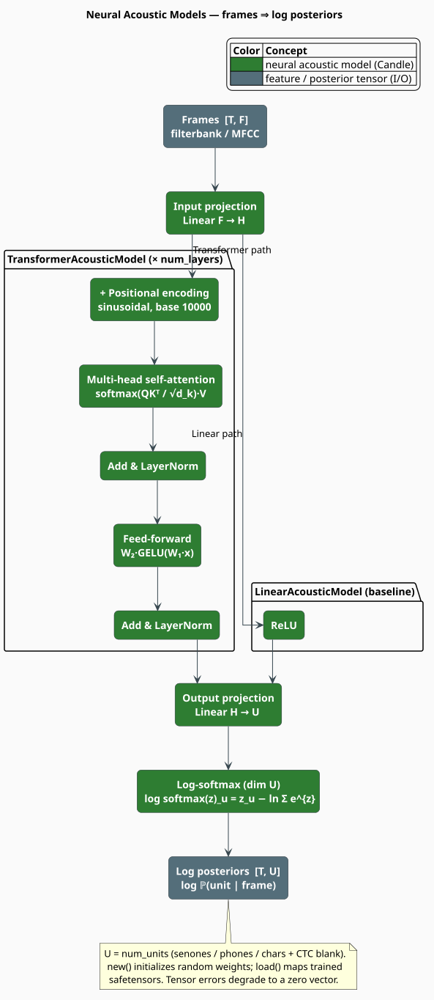

# Acoustic Models

An **acoustic model** maps a sequence of audio feature frames to a sequence of log posterior
distributions over output units — senones, phonemes, or characters plus a CTC blank. Those
posteriors are the emission probabilities a CTC or HMM decoder searches when it composes the
acoustic evidence with a language model. libgrammstein ships three implementations behind the
`candle-model` gate, built on the [Candle](https://github.com/huggingface/candle) tensor
framework: a linear baseline, a Transformer encoder, and a deterministic mock for testing.

> **Scope.** Source of truth: [`src/acoustic/model.rs`](../../../src/acoustic/model.rs)
> (feature-gated `candle-model`). For the features these models consume see
> [Feature Extraction](features.md); for where the model sits in the recognizer see the
> [Acoustic Overview](overview.md#from-features-to-transcription). The Transformer encoder follows
> Vaswani et al. [[1]](#references); the CTC blank contract follows Graves et al.
> [[2]](#references).

## What & why

A recognizer needs $`\log \mathbb{P}(u \mid \text{frame})`$ for every output unit $`u`$ at every
time step — the *emission* term of the search. The acoustic model is the neural network that
produces it. Its quality dominates recognition accuracy, so the architecture matters: a purely
frame-local model (the linear baseline) cannot use temporal context, whereas a Transformer lets
every frame attend to every other frame, resolving coarticulation and long-range dependencies.
All three models share one contract — the `AcousticModel` trait — so a decoder can treat them
interchangeably.

## Notation

Every symbol below is defined before it is used in a formula.

| Symbol | Meaning |
|---|---|
| $`\mathbf{x}`$ | one input feature frame (dimension $`F`$) |
| $`F`$ | input feature dimension (`feature_dim`) |
| $`H`$ | hidden dimension (`hidden_dim`) |
| $`U`$ | number of output units (`num_units`) |
| $`T`$ | number of frames in the input sequence |
| $`\mathbf{z}`$ | pre-softmax logits (dimension $`U`$) |
| $`W_\bullet, \mathbf{b}_\bullet`$ | a learned weight matrix and bias |
| $`Q, K, V`$ | query, key, value projections in attention |
| $`d_k`$ | per-head dimension (`hidden_dim / num_heads`) |
| $`\gamma, \beta`$ | LayerNorm scale and shift |
| $`p`$ | a time position in the positional encoding |

**Acronyms.** *CTC* — Connectionist Temporal Classification; *HMM* — Hidden Markov Model;
*GELU* — Gaussian Error Linear Unit; *MHSA* — Multi-Head Self-Attention; *LN* — Layer
Normalization.

## The `AcousticModel` trait

The trait is a deliberate local mirror of lling-llang's acoustic-model trait, kept inside
libgrammstein to avoid a circular crate dependency. A `forward` receives $`T`$ frames of $`F`$
values and returns $`T`$ log-posterior vectors of $`U`$ values.

```rust
pub trait AcousticModel: Send + Sync {
    /// Input feature dimensionality F.
    fn feature_dim(&self) -> usize;

    /// Number of output units U.
    fn num_units(&self) -> usize;

    /// Log posteriors for frames: [T, F] -> [T, U].
    fn forward(&self, frames: &[Vec<f32>]) -> Vec<Vec<f32>>;

    /// CTC blank id, when this is a CTC model.
    fn blank_id(&self) -> Option<u32> { None }

    /// Human-readable name for an output unit (default: none).
    fn unit_name(&self, _unit: u32) -> Option<String> { None }
}
```

The `Send + Sync` bound lets one model be shared across decoder threads. Each concrete model
overrides `blank_id` to return `Some(blank_id)` when configured for CTC; `unit_name` uses the
default (`None`) unless a future model supplies a symbol table.

## `AcousticModelConfig`

One configuration record parameterizes every model.

| Field | Type | Default | Meaning |
|---|---|---|---|
| `feature_dim` | `usize` | $`40`$ | input feature dimension $`F`$ |
| `hidden_dim` | `usize` | $`256`$ | encoder hidden dimension $`H`$ |
| `num_units` | `usize` | $`4096`$ | output units $`U`$ |
| `num_layers` | `usize` | $`6`$ | Transformer encoder layers |
| `dropout` | `f64` | $`0.1`$ | training dropout probability |
| `num_heads` | `usize` | $`4`$ | attention heads |
| `ff_dim` | `usize` | $`1024`$ | feed-forward width |
| `is_ctc` | `bool` | `true` | model has a CTC blank token |
| `blank_id` | `u32` | $`0`$ | blank token id |

> **`is_ctc` defaults to `true`.** With the default config every model reports
> `blank_id() == Some(0)`. The `dropout` field configures training; the inference `forward`
> implemented here does not apply dropout.

Three presets and three builder methods are provided — and **only** these three builder methods:

```rust
use libgrammstein::acoustic::AcousticModelConfig;

let small  = AcousticModelConfig::small();   // H=128, layers=2, heads=2, ff=512
let medium = AcousticModelConfig::medium();  // = default: H=256, layers=6, heads=4, ff=1024
let large  = AcousticModelConfig::large();   // H=512, layers=12, heads=8, ff=2048

// Builder methods: with_feature_dim, with_num_units, with_ctc.
let config = AcousticModelConfig::default()
    .with_feature_dim(80)   // 80-dim filterbank input
    .with_num_units(4096)   // output vocabulary
    .with_ctc(0);           // is_ctc = true, blank_id = 0
```

To change `hidden_dim`, `num_layers`, `num_heads`, or `ff_dim`, start from a preset or set the
fields directly with struct-update syntax (`..Default::default()`) — there are no
`with_hidden_dim` / `with_num_layers` setters.

## Theory

### The shared skeleton

Every model ends the same way: it produces logits $`\mathbf{z} \in \mathbb{R}^U`$ per frame and
applies a **log-softmax** so the output is a proper log distribution over units:

```math
\begin{array}{lr}
\displaystyle \log\mathrm{softmax}(\mathbf{z})_u = z_u - \log \sum_{u'=0}^{U-1} e^{z_{u'}} & \text{(M1)}
\end{array}
```

so that $`\sum_u \exp\bigl(\log \mathbb{P}(u \mid \text{frame})\bigr) = 1`$.

### LinearAcousticModel

The baseline is a two-layer perceptron applied to each frame independently — no temporal context:

```math
\begin{array}{lr}
\displaystyle \mathbf{h} = \mathrm{ReLU}\bigl(W_{\mathrm{in}}\mathbf{x} + \mathbf{b}_{\mathrm{in}}\bigr),
\qquad
\mathbf{z} = W_{\mathrm{out}}\mathbf{h} + \mathbf{b}_{\mathrm{out}},
\qquad
\log \mathbb{P}(\cdot \mid \mathbf{x}) = \log\mathrm{softmax}(\mathbf{z}) & \text{(M2)}
\end{array}
```

with $`W_{\mathrm{in}} \in \mathbb{R}^{H \times F}`$ and
$`W_{\mathrm{out}} \in \mathbb{R}^{U \times H}`$. It is intended for wiring tests and baselines,
not accuracy.

### TransformerAcousticModel

The Transformer processes all $`T`$ frames as one sequence, so each frame's representation is
informed by the whole utterance. The input is projected to $`H`$ dimensions and a sinusoidal
**positional encoding** is added so the otherwise order-agnostic attention knows frame order:

```math
\begin{array}{lr}
\displaystyle \mathrm{PE}[p, 2i] = \sin\!\left(\frac{p}{10000^{\,2i/H}}\right),
\qquad
\mathrm{PE}[p, 2i+1] = \cos\!\left(\frac{p}{10000^{\,2i/H}}\right) & \text{(M3)}
\end{array}
```

Each of the `num_layers` encoder blocks is a **post-norm** pair of residual sublayers: multi-head
self-attention then a position-wise feed-forward network. Scaled dot-product attention lets each
frame weight every other frame [[1]](#references):

```math
\begin{array}{lr}
\displaystyle \mathrm{Attn}(Q, K, V) = \mathrm{softmax}\!\left(\frac{Q K^{\top}}{\sqrt{d_k}}\right) V,
\qquad d_k = \frac{H}{\text{num\_heads}} & \text{(M4)}
\end{array}
```

with $`Q = \mathbf{x}W_Q`$, $`K = \mathbf{x}W_K`$, $`V = \mathbf{x}W_V`$ reshaped into
`num_heads` heads and recombined by an output projection. The feed-forward network uses a GELU
nonlinearity:

```math
\begin{array}{lr}
\displaystyle \mathrm{FFN}(\mathbf{x}) = W_2\,\mathrm{GELU}\bigl(W_1 \mathbf{x} + \mathbf{b}_1\bigr) + \mathbf{b}_2 & \text{(M5)}
\end{array}
```

and each sublayer is wrapped in a residual connection and Layer Normalization
($`\mu, \sigma^2`$ over the hidden axis, $`\epsilon = 10^{-5}`$):

```math
\begin{array}{lr}
\displaystyle \mathrm{LN}(\mathbf{x}) = \frac{\mathbf{x} - \mu}{\sqrt{\sigma^2 + \epsilon}} \odot \gamma + \beta,
\qquad
\begin{aligned}
\mathbf{x}' &= \mathrm{LN}_1\bigl(\mathbf{x} + \mathrm{Attn}(\mathbf{x})\bigr) \\
\mathbf{x}'' &= \mathrm{LN}_2\bigl(\mathbf{x}' + \mathrm{FFN}(\mathbf{x}')\bigr)
\end{aligned} & \text{(M6)}
\end{array}
```

A final projection to $`U`$ units and $`(\mathrm{M1})`$ give the per-frame log posteriors.

### MockAcousticModel

The mock returns a uniform log distribution for every frame — a fixed emission for testing
decoders and pipelines with no neural dependency:

```math
\begin{array}{lr}
\displaystyle \log \mathbb{P}(u \mid \text{frame}) = -\log U & \text{(M7)}
\end{array}
```



## The forward pass, literately

The following mirrors [`TransformerAcousticModel::forward`](../../../src/acoustic/model.rs).

```
function forward(frames):                       ▸ [T, F] -> [T, U] log posteriors
    if frames is empty: return []
    x <- tensor(frames) as [1, T, F]             ▸ one sequence, batch = 1
    h <- input_proj(x)                            ▸ Linear F -> H
    h <- h + positional_encoding(T, H)            ▸ (M3)
    for layer in layers:                          ▸ num_layers blocks
        h <- layer_norm1(h + self_attention(h))   ▸ (M4), (M6)
        h <- layer_norm2(h + feed_forward(h))      ▸ (M5), (M6)
    z <- output_proj(h)                           ▸ Linear H -> U
    return log_softmax(z, dim = U).squeeze(0)     ▸ (M1)
    ▸ on ANY tensor error, degrade to zeros [T, U] instead of panicking
```

`LinearAcousticModel::forward` differs in two ways: it shapes the frames as $`[T, F]`$ (each frame
independent, no positional encoding, no attention), and its body is the single $`(\mathrm{M2})`$
expression `output_proj(relu(input_proj(x)))` before the log-softmax.

## Engineering

### Untrained `new` vs. loaded weights

`new(config, &device)` builds the architecture with **randomly initialized** weights (a fresh
Candle `VarMap`), so its posteriors are meaningless until the model is trained. For real
recognition, `load(path, config, &device)` memory-maps a trained `safetensors` file. Both are
available for `LinearAcousticModel` and `TransformerAcousticModel`.

```rust
use libgrammstein::acoustic::{AcousticModel, AcousticModelConfig, TransformerAcousticModel};
use candle_core::Device;

let device = Device::cuda_if_available(0).unwrap_or(Device::Cpu);
let config = AcousticModelConfig::default().with_num_units(4096).with_ctc(0);

// Load trained weights (use ::new(config, &device) only to test wiring).
let model = TransformerAcousticModel::load("acoustic.safetensors", config, &device)
    .expect("load acoustic model");

assert_eq!(model.feature_dim(), 40);
assert_eq!(model.blank_id(), Some(0));
```

### Graceful degradation

`forward` never panics on a tensor error. If tensor construction or a kernel fails, it returns a
$`T \times U`$ block of zeros rather than propagating the error. A zero vector is a sentinel, not a
valid log distribution (its probabilities do not sum to one), so a downstream decoder should treat
an all-zero frame as "no acoustic information."

### CTC blank contract

When `is_ctc` is set, unit `blank_id` (default $`0`$) is the CTC blank. A greedy CTC collapse
reads the argmax unit per frame, drops blanks, and merges immediate repeats [[2]](#references):

```rust
let posteriors = model.forward(&features);      // [T, U] log posteriors
let blank = model.blank_id().unwrap_or(0);
let mut prev = blank;
let mut units = Vec::new();
for frame in &posteriors {
    let best = frame.iter().enumerate()
        .max_by(|(_, a), (_, b)| a.partial_cmp(b).expect("finite posterior"))
        .map(|(u, _)| u as u32).expect("non-empty frame");
    if best != blank && best != prev { units.push(best); }
    prev = best;
}
```

### Device and cost

Models run on any Candle `Device` — `Device::Cpu`, `Device::cuda_if_available(0)`, or Metal on
Apple silicon. The Linear model is $`O(T \cdot (FH + HU))`$; the Transformer adds
$`O(\text{num\_layers} \cdot (T^2 H + T H\,\text{ff\_dim}))`$, the $`T^2`$ term being the
attention over all frame pairs. Preset sizes trade cost against accuracy:

| Preset | `hidden_dim` | `num_layers` | `num_heads` | Use case |
|---|---|---|---|---|
| `small` | $`128`$ | $`2`$ | $`2`$ | fast inference, wiring tests |
| `medium` (default) | $`256`$ | $`6`$ | $`4`$ | balanced |
| `large` | $`512`$ | $`12`$ | $`8`$ | highest accuracy |

### Feature gate

The models require the `candle-model` gate (which also enables `acoustic` for feature
extraction). See the [Acoustic Overview](overview.md#feature-gates).

## Usage

```rust
use libgrammstein::acoustic::{
    AcousticModel, AcousticModelConfig, FeatureConfig, FeatureExtractor,
    TransformerAcousticModel,
};
use candle_core::Device;

// 1. Extract features.
let extractor = FeatureExtractor::new(FeatureConfig::default());
let audio: Vec<f32> = load_audio("speech.wav");
let features = extractor.extract_filterbank(&audio);   // [T, 40]

// 2. Load a trained acoustic model matching the feature dimension.
let device = Device::cuda_if_available(0).unwrap_or(Device::Cpu);
let config = AcousticModelConfig::default().with_feature_dim(40).with_ctc(0);
let model = TransformerAcousticModel::load("acoustic.safetensors", config, &device)
    .expect("load acoustic model");

// 3. Emit per-frame log posteriors for the decoder.
let posteriors = model.forward(&features);             // [T, num_units]
```

## References

1. A. Vaswani, N. Shazeer, N. Parmar, J. Uszkoreit, L. Jones, A. N. Gomez, Ł. Kaiser &
   I. Polosukhin (2017). *Attention is all you need.* NeurIPS 30.
   [arXiv:1706.03762](https://arxiv.org/abs/1706.03762)
2. A. Graves, S. Fernández, F. Gomez & J. Schmidhuber (2006). *Connectionist temporal
   classification: labelling unsegmented sequence data with recurrent neural networks.* ICML,
   369–376. [doi:10.1145/1143844.1143891](https://doi.org/10.1145/1143844.1143891)

## See also

- [Acoustic Overview](overview.md) — module tour and the ASR cascade
- [Feature Extraction](features.md) — the features these models consume
- [Modified Kneser-Ney](../ngram/modified-kneser-ney.md) — the grammar composed with the emissions
