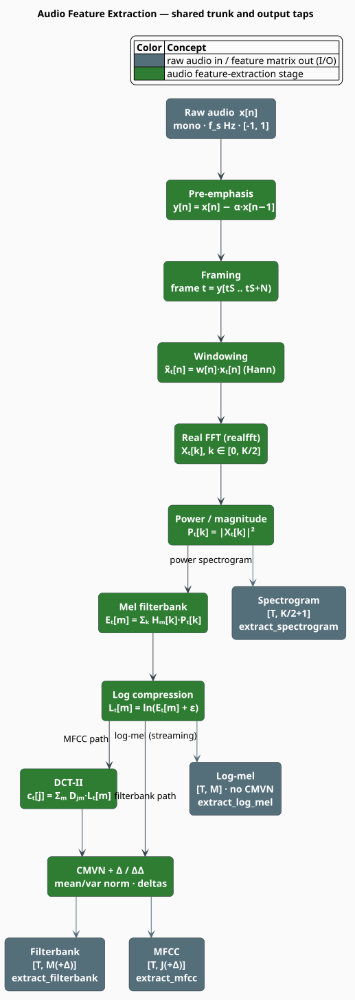
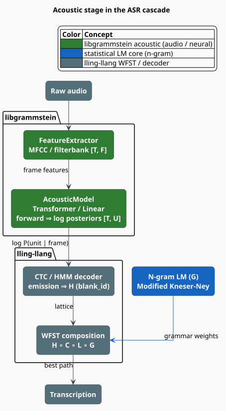

# Acoustic Processing

The **acoustic module** turns a raw audio waveform into the compact, perceptually-motivated
feature frames that speech recognizers consume, and — behind an optional feature gate — runs
those frames through a neural **acoustic model** to produce per-frame log posteriors over output
units. It is libgrammstein's bridge from *sound* to the symbolic world of the n-gram and hybrid
language models. This document introduces *what* the module produces, *why* those representations
are the right ones, and *how* the pieces compose into an automatic-speech-recognition (ASR)
cascade.

> **Scope.** Source of truth: [`src/acoustic/mod.rs`](../../../src/acoustic/mod.rs),
> [`src/acoustic/features.rs`](../../../src/acoustic/features.rs), and (feature-gated)
> [`src/acoustic/model.rs`](../../../src/acoustic/model.rs). For the extraction API in depth see
> [Feature Extraction](features.md); for the neural models see [Acoustic Models](models.md); for
> the phonetic *embedding* that shares this vocabulary of ideas see
> [Acoustic-Word Embeddings](../embedding/acoustic-word.md).

## What & why

A microphone delivers roughly $`16{,}000`$ samples per second. That stream is highly redundant
for recognition: the ear does not hear individual samples, it hears the *short-time spectral
envelope* — how energy is distributed across frequency bands over windows of a few tens of
milliseconds. Acoustic feature extraction reproduces this computationally. It slices the signal
into overlapping **frames**, measures the energy in a bank of **mel-scaled** frequency bands
(spaced the way the cochlea resolves pitch [[2]](#references)), and log-compresses the result so
that multiplicative gain becomes additive offset. The output is a short vector per frame —
typically $`40`$ numbers every $`10`$ ms instead of $`160`$ raw samples — that is far easier for a
statistical or neural model to classify.

The module offers four feature families and, when the `candle-model` gate is on, three neural
models that map frames to log posteriors:

| Feature (method) | Dimensions | Best for |
|---|---|---|
| **Filterbank** (`extract_filterbank`) | $`40`$–$`80`$ | neural encoders (Conformer, Whisper-style) |
| **MFCC** (`extract_mfcc`) | $`13`$–$`39`$ | GMM-HMM systems; compact decorrelated features |
| **Log-mel** (`extract_log_mel`) | $`40`$–$`80`$ | streaming ASR (frame-local, no utterance normalization) |
| **Spectrogram** (`extract_spectrogram`) | $`K/2 + 1`$ | visualization, debugging, custom front-ends |

## Notation

Every symbol below is defined before it is used in a formula.

| Symbol | Meaning |
|---|---|
| $`x[n]`$ | raw audio sample at index $`n`$ |
| $`f_s`$ | sample rate in Hz (`sample_rate`; default $`16{,}000`$) |
| $`N`$ | frame size in samples (`frame_size`; default $`400 = 25`$ ms) |
| $`S`$ | frame shift (hop) in samples (`frame_shift`; default $`160 = 10`$ ms) |
| $`K`$ | FFT size (`fft_size`; a power of two $`\geq N`$) |
| $`M`$ | number of mel channels (`num_mels`; default $`40`$) |
| $`J`$ | number of MFCC coefficients (`num_mfcc`; default $`13`$) |
| $`T`$ | number of frames extracted from an utterance |
| $`U`$ | number of acoustic-model output units (`num_units`) |
| $`f`$ | a frequency in Hz |
| $`\mathrm{mel}(f)`$ | the mel value of frequency $`f`$ |

**Acronyms.** *ASR* — Automatic Speech Recognition; *MFCC* — Mel-Frequency Cepstral
Coefficients; *FFT* — Fast Fourier Transform; *DCT* — Discrete Cosine Transform; *CMVN* —
Cepstral Mean-and-Variance Normalization; *CTC* — Connectionist Temporal Classification;
*WFST* — Weighted Finite-State Transducer.

## The extraction pipeline

Every extraction method walks the same trunk and taps out at a different stage. Pre-emphasis
lifts the high frequencies, the signal is cut into windowed frames, each frame is transformed to
a power spectrum, the spectrum is binned by the mel filterbank and log-compressed; MFCC then
applies a DCT, and filterbank/MFCC optionally add mean-variance normalization and delta features.



The mel warping is the perceptual heart of the pipeline. Frequency in Hz is mapped to the mel
scale before the triangular filters are laid down, so the filters are uniformly spaced in *pitch*
even though they widen in *Hz*:

```math
\mathrm{mel}(f) = 2595 \, \log_{10}\!\left(1 + \frac{f}{700}\right),
\qquad
f(\mathrm{mel}) = 700 \left(10^{\,\mathrm{mel}/2595} - 1\right) \tag{A1}
```

The full stage-by-stage mathematics — pre-emphasis, windowing, the power spectrum, the triangular
filters, log compression, the DCT, and the delta regression — is derived in
[Feature Extraction](features.md#theory). The number of frames an utterance yields is

```math
T = \left\lfloor \frac{L - N}{S} \right\rfloor + 1 \qquad (L > N) \tag{A2}
```

for an audio length of $`L`$ samples; a non-empty utterance shorter than one frame yields a
single frame, and empty audio yields none.

## Configurations

`FeatureConfig` bundles every knob. Three named presets cover the common sample rates, and
`wideband()` is an alias for `default()`.

```rust
use libgrammstein::acoustic::FeatureConfig;

let wideband  = FeatureConfig::default();    // 16 kHz: N=400, S=160, K=512, M=40, J=13
let narrow    = FeatureConfig::telephony();  //  8 kHz: N=200, S=80,  K=256, high_freq=4000
let hifi      = FeatureConfig::music();      // 44.1 kHz: N=1102, S=441, K=2048, M=80
```

| Preset | `sample_rate` | `frame_size` | `frame_shift` | `fft_size` | `num_mels` | `high_freq` |
|---|---|---|---|---|---|---|
| `default` / `wideband` | $`16{,}000`$ | $`400`$ | $`160`$ | $`512`$ | $`40`$ | $`8000`$ |
| `telephony` | $`8000`$ | $`200`$ | $`80`$ | $`256`$ | $`40`$ | $`4000`$ |
| `music` | $`44{,}100`$ | $`1102`$ | $`441`$ | $`2048`$ | $`80`$ | $`22{,}050`$ |

The `high_freq` bound tracks the Nyquist frequency $`f_s / 2`$ of each rate, so the filterbank
never places a filter above the representable band. See
[Feature Extraction](features.md#featureconfig) for the full field table and defaults.

## From features to transcription

Features are only the front end. In the lling-llang ASR cascade they feed an `AcousticModel`
whose `forward` method returns per-frame log posteriors $`\log \mathbb{P}(u \mid \text{frame})`$
over $`U`$ output units; a CTC or HMM decoder folds those emissions into the search transducer
$`H`$, which is composed with the context, lexicon, and grammar transducers
($`H \circ C \circ L \circ G`$) — the grammar $`G`$ being a libgrammstein n-gram language model.



The `AcousticModel` trait defined here is a deliberate local mirror of lling-llang's trait, kept
inside libgrammstein to avoid a circular crate dependency; any type implementing it adapts
cleanly into the cascade. See [Acoustic Models](models.md) for the trait, the concrete models,
and the CTC blank-token contract, and the
[lling-llang integration overview](../../integration/lling-llang/overview.md) for how the
transducers are assembled.

## Engineering

### Feature gates

Acoustic support is opt-in so that a pure text-modeling build pulls in neither an FFT library nor
a tensor framework.

| Feature flag | Pulls in | Enables |
|---|---|---|
| `acoustic` | `rustfft`, `realfft` | `FeatureExtractor`, `StreamingFeatureExtractor`, `MelFilterbank` |
| `candle-model` | `candle-core`, `candle-nn` (+ `acoustic`) | `AcousticModel` trait and the neural models |

```toml
[dependencies]
# feature extraction only
libgrammstein = { version = "0.1", features = ["acoustic"] }
# ...or add the neural acoustic models
libgrammstein = { version = "0.1", features = ["candle-model"] }
```

### Types at a glance

- [`FeatureConfig`](features.md#featureconfig) — the configuration record, with `default`,
  `telephony`, `wideband`, and `music` constructors.
- [`FeatureExtractor`](features.md#featureextractor) — batch extraction (`extract_filterbank`,
  `extract_mfcc`, `extract_log_mel`, `extract_spectrogram`), backed by a pre-planned real FFT, a
  cached mel filterbank, and a cached DCT matrix.
- [`StreamingFeatureExtractor`](features.md#streamingfeatureextractor) — a buffered wrapper for
  real-time audio that emits complete frames as they become available.
- [`MelFilterbank`](features.md#the-mel-filterbank), `WindowType` — the perceptual filterbank and
  the window-function selector.
- [`AcousticModel`](models.md) and `LinearAcousticModel`, `TransformerAcousticModel`,
  `MockAcousticModel`, `AcousticModelConfig` — the neural side (`candle-model`).

## Usage

```rust
use libgrammstein::acoustic::{FeatureConfig, FeatureExtractor};

// A wideband (16 kHz) extractor.
let extractor = FeatureExtractor::new(FeatureConfig::default());

// Mono audio in [-1.0, 1.0] at the configured sample rate.
let audio: Vec<f32> = load_audio("speech.wav");

// 40-dimensional log-mel filterbank features, one vector per ~10 ms frame.
let filterbank = extractor.extract_filterbank(&audio);
println!("{} frames x {} dims", filterbank.len(), filterbank[0].len());

// ...or 13-dimensional MFCC for a GMM-HMM front end.
let mfcc = extractor.extract_mfcc(&audio);
```

## References

1. S. B. Davis & P. Mermelstein (1980). *Comparison of parametric representations for
   monosyllabic word recognition in continuously spoken sentences.* IEEE Transactions on
   Acoustics, Speech, and Signal Processing 28(4), 357–366.
   [doi:10.1109/TASSP.1980.1163420](https://doi.org/10.1109/TASSP.1980.1163420)
2. S. S. Stevens, J. Volkmann & E. B. Newman (1937). *A scale for the measurement of the
   psychological magnitude pitch.* Journal of the Acoustical Society of America 8(3), 185–190.
   [doi:10.1121/1.1915893](https://doi.org/10.1121/1.1915893)
3. A. Graves, S. Fernández, F. Gomez & J. Schmidhuber (2006). *Connectionist temporal
   classification: labelling unsegmented sequence data with recurrent neural networks.* ICML,
   369–376. [doi:10.1145/1143844.1143891](https://doi.org/10.1145/1143844.1143891)

## See also

- [Feature Extraction](features.md) — the `FeatureExtractor` API and the full MFCC mathematics
- [Acoustic Models](models.md) — the Candle-based neural acoustic models and CTC contract
- [Acoustic-Word Embeddings](../embedding/acoustic-word.md) — the phonetic embedding companion
- [Modified Kneser-Ney](../ngram/modified-kneser-ney.md) — the grammar $`G`$ in the cascade
- [lling-llang integration overview](../../integration/lling-llang/overview.md) — WFST assembly
