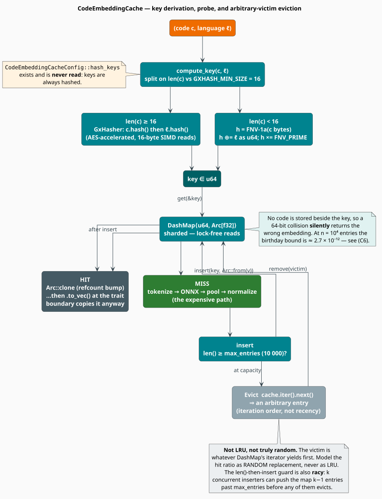

# The Code-Embedding Cache

A transformer forward pass costs milliseconds; a hash-map probe costs nanoseconds. Whenever the
same snippet is embedded twice — and in a code-analysis workload it is embedded many times — the
cheapest inference is the one you never run. `CodeEmbeddingCache` is the concurrent memo table
that makes that happen, and every shipped embedder owns one by default.

This document derives the key, quantifies what a cache is worth ($`(\mathrm{C2})`$), bounds the
probability that it lies to you ($`(\mathrm{C3})`$), and is candid about its eviction policy —
which is **not LRU**, and whose weakness turns out to be precisely bounded.

> **Scope.** Source of truth: the cache section of
> [`src/neural/code/mod.rs`](../../../src/neural/code/mod.rs) and the hash helpers in
> [`src/util/hash.rs`](../../../src/util/hash.rs). Feature gate `code-neural`. The cache is
> **per-embedder**, never shared; it is not serialized, so it always starts empty.

## Notation

| Symbol | Meaning |
|---|---|
| $`c`$ | a source-code snippet; $`\lvert c \rvert`$ its length **in bytes** |
| $`\ell`$ | the `CodeLanguage` tag; $`\ell`$ also denotes its integer discriminant |
| $`h(c, \ell)`$ | the 64-bit cache key |
| $`m`$ | the key universe, $`m = 2^{64}`$ |
| $`M`$ | the cache capacity, `max_entries` (default $`10^{4}`$) |
| $`n`$ | the number of entries resident in the cache, $`n \leq M`$ |
| $`d`$ | the embedding dimension of the owning model |
| $`H`$ | the hit rate, $`H \in [0, 1]`$ |
| $`t_{\mathrm{hit}}, t_{\mathrm{miss}}`$ | the latency of a hit and of a miss |
| $`r`$ | the cost ratio $`t_{\mathrm{hit}} / t_{\mathrm{miss}}`$, $`0 < r \ll 1`$ |
| $`S`$ | the speed-up over an uncached embedder |
| $`W`$ | the workload's **working set** — its distinct $`(c, \ell)`$ keys |
| $`Q`$ | the number of queries issued |
| $`p_i`$ | the probability that a query requests item $`i`$ (popularity) |
| $`q_i`$ | the stationary probability that item $`i`$ is resident |
| $`\alpha`$ | the Zipf exponent of the popularity law |
| $`\phi, \pi`$ | the FNV-1a offset basis and prime |
| $`\oplus`$ | bitwise exclusive-or |

**Acronyms.** *IRM* — Independent Reference Model; *LRU* — Least-Recently-Used; *FIFO* —
First-In-First-Out; *FNV* — Fowler–Noll–Vo (a hash function); *SIMD* — Single Instruction, Multiple
Data.

## Architecture

```rust
pub struct CodeEmbeddingCacheConfig {
    /// Maximum number of embeddings to cache.
    pub max_entries: usize,   // default: 10_000
    /// Whether to hash code for cache keys (saves memory for long code).
    pub hash_keys: bool,      // default: true  — but see below
}

pub struct CodeEmbeddingCache {
    cache: dashmap::DashMap<u64, Arc<[f32]>>,
    config: CodeEmbeddingCacheConfig,
}
```

The map is a **sharded, lock-free-on-read `DashMap`**, preallocated to `max_entries` at
construction (`DashMap::with_capacity`), so a steady-state workload never rehashes. Values are
`Arc<[f32]>`, so a hit is in principle a refcount bump rather than a copy — with a caveat noted
in [The `Arc` that isn't shared](#the-arc-that-isnt-shared).



*Figure 1 — key derivation, the lock-free probe, and the arbitrary-victim eviction.*

> **`hash_keys` is inert.** The field exists, defaults to `true`, and is **never read** by any code
> path. Keys are *always* hashed. Setting it to `false` changes nothing. Its doc-comment
> ("saves memory for long code") describes an alternative that was never implemented — there is no
> store-the-code-verbatim mode to opt out of.

## The key

```math
h(c, \ell) \;=\;
\begin{cases}
\mathrm{Gx}\bigl(\,\mathsf{Hash}(c) \,\Vert\, \mathsf{Hash}(\ell)\,\bigr)
  & \lvert c \rvert \geq 16 \\[6pt]
\bigl(\mathrm{FNV}(c) \,\oplus\, \ell\bigr) \cdot \pi \bmod 2^{64}
  & \lvert c \rvert < 16
\end{cases} \tag{C1}
```

where $`\mathrm{FNV}`$ is FNV-1a over the raw bytes of $`c`$,

```math
h_0 = \phi, \qquad
h_{k+1} = \bigl(h_k \oplus c_k\bigr) \cdot \pi \bmod 2^{64}, \qquad
\mathrm{FNV}(c) = h_{\lvert c \rvert}
\tag{C1$'$}
```

with $`\phi = \texttt{0xcbf29ce484222325}`$ and $`\pi = \texttt{0x100000001b3}`$, and
$`\mathrm{Gx}`$ is `gxhash::GxHasher`, an AES-accelerated streaming hasher.

**Why the 16-byte split?** The threshold is `crate::util::hash::GXHASH_MIN_SIZE`. Per that
module's own documentation, gxhash's SSE2/AES path reads its input in 16-byte chunks and can
therefore read **past the end** of a shorter buffer; the split routes short inputs to a scalar
hash instead. Since $`\lvert c \rvert`$ is measured in bytes, a 5-character ASCII snippet takes
the short branch while a 5-character CJK-comment snippet may not — the branch is a function of the
encoded length, not the character count.

Three properties of $`(\mathrm{C1})`$ are worth internalizing:

1. **The language is part of the key.** The same bytes tagged `Python` and tagged `Rust` occupy
   two slots. For [UniXcoder](unixcoder.md) and [GraphCodeBERT](graphcodebert.md) — which ignore
   $`\ell`$ everywhere *except* the key — those two slots hold **identical vectors**. The tag is
   pure key-space fragmentation for them, and it is the only place their `language` argument goes.
2. **The two branches are different hash families.** The long branch goes through
   `std::hash::Hash` (so `str`'s terminator byte and the enum's derived discriminant encoding are
   both in the stream); the short branch hashes the raw bytes and folds $`\ell`$ in by $`\oplus`$
   and a single multiply. Keys are consistent *within* a branch, which is all correctness requires
   — but if you ever recompute a key outside the crate, you must reproduce the branch exactly.
3. **The short branch is on the legacy path.** `compute_key` calls `fnv1a` directly rather than
   `util::hash::safe_hash`, even though `safe_hash` implements the *same* short/long split with
   xxh3 on the short side, and `fnv1a`'s own doc-comment says: *"Prefer `safe_hash()` which uses
   xxh3 for better performance. This is kept for compatibility."* Switching the short branch to
   `safe_hash` would be a one-line change with no behavioural risk beyond invalidating in-memory
   keys (which never outlive the process).

## What a cache is worth

Let $`H`$ be the hit rate, $`t_{\mathrm{hit}}`$ and $`t_{\mathrm{miss}}`$ the two latencies, and
$`r = t_{\mathrm{hit}} / t_{\mathrm{miss}}`$. The expected per-query cost and the resulting
speed-up over an uncached embedder are

```math
\mathbb{E}[T] = H\,t_{\mathrm{hit}} + (1 - H)\,t_{\mathrm{miss}},
\qquad
S = \frac{t_{\mathrm{miss}}}{\mathbb{E}[T]} = \frac{1}{(1 - H) + H\,r}
\tag{C2}
```

A `DashMap` probe is nanoseconds and a transformer forward pass is milliseconds, so $`r`$ is on
the order of $`10^{-5}`$ and $`(\mathrm{C2})`$ collapses to the familiar $`S \approx 1/(1-H)`$.
The lesson is the **brutal non-linearity** of that curve:

| $`H`$ | $`S`$ at $`r \to 0`$ | Reading |
|---|---|---|
| $`0.00`$ | $`1\times`$ | a pure scan — the cache is dead weight |
| $`0.50`$ | $`2\times`$ | |
| $`0.90`$ | $`10\times`$ | |
| $`0.99`$ | $`100\times`$ | |
| $`0.999`$ | $`1000\times`$ | |

Going from $`H = 0.9`$ to $`H = 0.99`$ is worth as much as the first $`90\%`$ was. This is why
sizing $`M`$ correctly — the subject of the next section — dominates every other cache decision.

> **$`H`$ is not instrumented.** The cache keeps **no hit/miss counters**. `cache_stats()` on an
> embedder returns `Option<usize>` — the *occupancy* $`n`$ (i.e. `len()`), not the hit rate. To
> obtain $`H`$ you must count hits and misses yourself, outside the crate. The models below let you
> *predict* $`H`$; they are not a substitute for measuring it.

## Sizing: the regime that actually matters

### Regime 1 — the working set fits: eviction never happens

Let $`W`$ be the set of distinct $`(c, \ell)`$ keys the workload ever requests. Suppose
$`\lvert W \rvert \leq M`$. Trace the guard in `insert`: before inserting the $`k`$-th *distinct*
key the map holds $`k-1`$ entries, and eviction fires only when $`k - 1 \geq M`$. For every
$`k \leq M`$ this is false, so **no eviction ever occurs**, every key is resident forever after its
first miss, and the misses are exactly the compulsory ones:

```math
H \;=\; 1 - \frac{\lvert W \rvert}{Q}
\qquad\xrightarrow[Q \to \infty]{}\qquad 1
\tag{C3}
```

$`(\mathrm{C3})`$ is **exact**, not an approximation. It is also the design target: *make $`M`$
exceed your working set and the eviction policy becomes irrelevant.* For a repository of
$`50\,000`$ functions, the default $`M = 10^{4}`$ does **not** suffice — raise it.

### Regime 2 — a pure scan: the cache is dead weight

If every key is requested exactly once ($`Q = \lvert W \rvert`$), then $`H = 0`$ by
$`(\mathrm{C3})`$ and the cache contributes only hashing, insertion, and memory. Turn it off:

```rust
use libgrammstein::neural::code::CodeT5Config;

let config = CodeT5Config {
    cache_config: None,   // no CodeEmbeddingCache is constructed at all
    ..CodeT5Config::codet5p_110m_embedding("/models/codet5p-110m-embedding")
};
```

### Regime 3 — $`\lvert W \rvert > M`$ with reuse: the only place the policy matters

Here, and *only* here, does eviction quality affect $`H`$. Model the request stream with the
**Independent Reference Model**: each query independently draws item $`i`$ with probability
$`p_i`$, typically Zipf-distributed, $`p_i \propto i^{-\alpha}`$.

The shipped policy is **not** LRU (see below); analytically it behaves as **RANDOM** replacement,
for which — together with FIFO, whose IRM hit ratio is identical [[1]](#references) — the
stationary residency probabilities solve the fixed point

```math
q_i \;=\; \frac{p_i\,\theta}{1 + p_i\,\theta},
\qquad \theta > 0 \ \text{chosen so that} \ \sum_i q_i = M,
\qquad
H_{\mathrm{RAND}} = \sum_i p_i\, q_i
\tag{C4}
```

LRU, by contrast, obeys the Che approximation [[2]](#references) — accurate to within a fraction of
a percent for Zipf traffic [[3]](#references)[[4]](#references) —

```math
q_i \;=\; 1 - e^{-p_i t_C},
\qquad t_C \ \text{chosen so that} \ \sum_i q_i = M,
\qquad
H_{\mathrm{LRU}} = \sum_i p_i\, q_i
\tag{C5}
```

The two fixed points differ, and on skewed streams LRU is the stronger policy: it protects the hot
items it has just seen, whereas RANDOM will happily evict them. **Model this cache with
$`(\mathrm{C4})`$, never with $`(\mathrm{C5})`$** — a hit-rate projection computed under an LRU
assumption will be optimistic.

The consolation is how narrow this regime is. Two of the three regimes make the policy moot; the
practical response to the third is to *leave it*, by raising $`M`$ until Regime 1 applies.

## Eviction, honestly

```rust
pub fn insert(&self, code: &str, language: CodeLanguage, embedding: Vec<f32>) {
    // Simple eviction: if over capacity, remove a random entry
    if self.cache.len() >= self.config.max_entries {
        if let Some(entry) = self.cache.iter().next() {
            let key = *entry.key();
            drop(entry);
            self.cache.remove(&key);
        }
    }
    let key = self.compute_key(code, language);
    self.cache.insert(key, Arc::from(embedding.into_boxed_slice()));
}
```

Four properties, all consequential, none documented in the source comment (which says only
*"remove a random entry"*):

1. **It is not LRU, and it is not even uniformly random.** The victim is whatever
   `DashMap::iter().next()` yields — an artefact of shard order and intra-shard layout. It carries
   **no information about recency or frequency**, which is exactly why RANDOM $`(\mathrm{C4})`$ is
   the right analytic model and LRU $`(\mathrm{C5})`$ is not.
2. **The capacity guard is racy.** `len()` is read, then acted upon. $`k`$ threads that miss
   concurrently can each observe `len() < max_entries` and all proceed to insert, pushing the map
   up to $`k-1`$ entries **past** `max_entries`. (`DashMap::len()` is itself a sum over shards, not
   a linearizable snapshot.) The overshoot is transient and bounded by concurrency, not unbounded —
   `max_entries` is a soft target, not an invariant.
3. **A racing double-miss shrinks the cache.** If two threads miss on the *same* key
   simultaneously, both insert. At capacity, the second evicts an innocent victim and then
   *overwrites* the key the first just wrote — net effect: one entry lost, none gained. Rare;
   real.
4. **One victim per insert, no batching.** The map cannot fall behind by more than the overshoot in
   (2), so there is no eviction-storm pathology.

None of this is a correctness bug — a cache is allowed to forget anything at any time. It is a
*performance* characteristic, and the honest summary is: **plan for RANDOM replacement, and size
$`M`$ so that you never depend on the policy.**

## Collisions: the one way a cache can lie

The cache stores the key and the vector — **not the code**. A `get` that finds a key therefore
returns the stored vector *without verifying* that it belongs to the queried snippet. A 64-bit
collision is consequently a **silent wrong answer**, not a crash. How worried should you be?

Model $`h`$ as a uniform map into $`m = 2^{64}`$ and let $`n`$ be the number of distinct keys ever
inserted. The probability that *some* pair among them collides is the birthday bound
[[5]](#references):

```math
\Pr[\text{collision}]
\;=\; 1 - \prod_{k=1}^{n-1}\left(1 - \frac{k}{m}\right)
\;\leq\; 1 - e^{-n(n-1)/(2m)}
\;\approx\; \frac{n^{2}}{2m}
\qquad (n \ll \sqrt{m})
\tag{C6}
```

| $`n`$ (distinct keys) | $`\Pr[\text{collision}]`$ |
|---|---|
| $`10^{4}`$ (the default $`M`$) | $`\approx 2.7 \times 10^{-12}`$ |
| $`10^{6}`$ | $`\approx 2.7 \times 10^{-8}`$ |
| $`10^{8}`$ | $`\approx 2.7 \times 10^{-4}`$ |
| $`2^{32} \approx 4.3 \times 10^{9}`$ | $`\approx 0.39`$ — the classic $`\sqrt{m}`$ cliff |

$`(\mathrm{C6})`$ is the conservative reading, because a collision only *harms* you if both
colliding keys are resident at overlapping times — and at most $`M`$ are resident at once. The
per-query probability that a fresh key false-hits against the resident set is

```math
\Pr[\text{false hit on one query}] \;\approx\; \frac{n}{m}
\;=\; \frac{10^{4}}{2^{64}} \;\approx\; 5.4 \times 10^{-16}
\tag{C6$'$}
```

so a run of $`10^{9}`$ queries expects $`\approx 5.4 \times 10^{-7}`$ false hits. At the default
capacity this is **not a risk worth engineering against**. It becomes one only if you push a single
cache toward $`10^{8}`$ distinct keys — at which point you want a keyed store that verifies the
snippet, not a 64-bit memo table.

## Memory

Each entry costs the vector itself plus a fixed overhead:

```math
\mathrm{bytes}(M, d)
\;\approx\; M \cdot \Bigl(
\underbrace{4d}_{\text{the } f32 \text{ vector}}
\;+\; \underbrace{16}_{\texttt{Arc}\ \text{refcounts}}
\;+\; \underbrace{24}_{\texttt{u64}\ \text{key} \,+\, \text{fat pointer}}
\Bigr) \cdot (1 + \varepsilon)
\tag{C7}
```

Only the $`4d`$ term is exact; $`\varepsilon`$ absorbs hash-table slack (the map is preallocated,
so it is load-factor headroom rather than growth) and allocator rounding. Taking
$`\varepsilon \approx 1/7`$ for a hashbrown-style table at its target load:

| Model | $`d`$ | Cache at $`M = 10^{4}`$ |
|---|---|---|
| [CodeT5+](codet5.md) | 256 | $`\approx 12`$ MB |
| [UniXcoder](unixcoder.md) | 768 | $`\approx 36`$ MB |
| [GraphCodeBERT](graphcodebert.md) | 768 | $`\approx 36`$ MB |
| All three, as an [ensemble](ensemble.md) | — | $`\approx 84`$ MB |

That last row is the one people get wrong. **The ensemble has no cache of its own**: it delegates
to the members', so a three-model ensemble carries **three** independent caches, each capped at
$`M`$. Its memory is the *sum* of the members' — it is not a single $`M \times 1792`$-wide table,
and raising $`M`$ raises all three at once.

### The `Arc` that isn't shared

`CodeEmbeddingCache::get` returns `Option<Arc<[f32]>>` — a cheap refcount bump. But
`CodeEmbedder::embed_code` returns `Result<Vec<f32>>`, so every embedder immediately does:

```rust
if let Some(embedding) = cache.get(code, language) {
    return Ok(embedding.to_vec());   // ← copies 4d bytes, defeating the Arc
}
```

Through the trait, therefore, **every hit still copies the vector**; the `Arc` saves an allocation
only for code that calls `CodeEmbeddingCache::get` directly. If you are hitting the cache in a hot
loop and $`d = 768`$, that is a 3 KB `memcpy` per hit that the data structure was designed to
avoid. Reach for the cache directly when it matters:

```rust
use std::sync::Arc;
use libgrammstein::neural::code::{CodeEmbeddingCache, CodeEmbeddingCacheConfig, CodeLanguage};

let cache = CodeEmbeddingCache::new(CodeEmbeddingCacheConfig {
    max_entries: 50_000,      // size it to your working set — (C3)
    hash_keys: true,          // inert; the field is never read
});

cache.insert("fn main() {}", CodeLanguage::Rust, vec![0.1, 0.2, 0.3]);

// A zero-copy hit: an Arc clone, not a Vec.
let hit: Option<Arc<[f32]>> = cache.get("fn main() {}", CodeLanguage::Rust);
assert!(hit.is_some());

// The language is part of the key — (C1).
assert!(cache.get("fn main() {}", CodeLanguage::Python).is_none());

assert_eq!(cache.len(), 1);
assert!(!cache.is_empty());
cache.clear();
```

## Usage

### Sizing the per-embedder cache

```rust
use libgrammstein::neural::code::{
    CodeEmbeddingCacheConfig, CodeT5Config, CodeT5Embedder, UniXcoderConfig, UniXcoderEmbedder,
};

// Target Regime 1: make max_entries exceed the working set, and eviction never fires — (C3).
let cache_config = CodeEmbeddingCacheConfig { max_entries: 100_000, hash_keys: true };

let embedder = CodeT5Embedder::load(CodeT5Config {
    cache_config: Some(cache_config.clone()),
    ..CodeT5Config::codet5p_110m_embedding("/models/codet5p-110m-embedding")
})?;

// The same config type is shared by all three embedders.
let unixcoder = UniXcoderEmbedder::load(UniXcoderConfig {
    cache_config: Some(cache_config),
    ..UniXcoderConfig::unixcoder_base("/models/unixcoder-base")
})?;
# Ok::<(), libgrammstein::neural::code::CodeEmbeddingError>(())
```

At $`M = 10^{5}`$ and $`d = 256`$, $`(\mathrm{C7})`$ puts the CodeT5+ cache at roughly $`120`$ MB —
budget for it before raising the number.

### Inspecting and clearing

```rust
// Occupancy n, NOT the hit rate. None when caching is disabled.
let occupancy: Option<usize> = embedder.cache_stats();

// Drop every cached vector (e.g. after a corpus is re-indexed and old snippets are stale).
embedder.clear_cache();
```

The cache is **not persisted**. It holds no lifecycle hooks, is not serialized with the model, and
starts empty on every process launch: the first pass over a corpus always pays full inference.

## Summary of known limitations

| Limitation | Consequence | Mitigation |
|---|---|---|
| `hash_keys` is never read | the field is inert | ignore it |
| eviction is arbitrary, not LRU | model with RANDOM $`(\mathrm{C4})`$, not LRU $`(\mathrm{C5})`$ | raise $`M`$ into Regime 1 |
| capacity check is racy | `max_entries` is a soft target; transient overshoot | budget memory with headroom |
| a racing double-miss evicts an innocent entry | one entry lost, rarely | none needed |
| no hit/miss counters | $`H`$ cannot be read from the crate | count externally |
| `Arc` defeated by `to_vec()` at the trait boundary | every trait-level hit copies $`4d`$ bytes | call `CodeEmbeddingCache::get` directly |
| short-key branch uses `fnv1a`, not `safe_hash` | the legacy hash path, against its own advice | none needed; keys are process-local |
| not persisted | cold start on every launch | pre-warm if it matters |

## References

1. E. Gelenbe (1973). *A Unified Approach to the Evaluation of a Class of Replacement Algorithms.*
   IEEE Transactions on Computers C-22(6), 611–618. — establishes that FIFO and RANDOM share the
   same hit ratio under the IRM.
   [doi:10.1109/TC.1973.5009115](https://doi.org/10.1109/TC.1973.5009115)
2. H. Che, Y. Tung & Z. Wang (2002). *Hierarchical Web Caching Systems: Modeling, Design and
   Experimental Results.* IEEE Journal on Selected Areas in Communications 20(7), 1305–1314. — the
   origin of the "characteristic time" approximation for LRU.
   [doi:10.1109/JSAC.2002.801752](https://doi.org/10.1109/JSAC.2002.801752)
3. C. Fricker, P. Robert & J. Roberts (2012). *A Versatile and Accurate Approximation for LRU Cache
   Performance.* ITC 24. arXiv:1202.3974.
   [doi:10.48550/arXiv.1202.3974](https://doi.org/10.48550/arXiv.1202.3974)
4. V. Martina, M. Garetto & E. Leonardi (2014). *A Unified Approach to the Performance Analysis of
   Caching Systems.* IEEE INFOCOM 2014. arXiv:1307.6702. — treats LRU, FIFO, and RANDOM in one
   framework.
   [doi:10.48550/arXiv.1307.6702](https://doi.org/10.48550/arXiv.1307.6702)
5. M. Mitzenmacher & E. Upfal (2005). *Probability and Computing: Randomized Algorithms and
   Probabilistic Analysis.* Cambridge University Press. — the birthday bound of $`(\mathrm{C6})`$.
   [doi:10.1017/CBO9780511813603](https://doi.org/10.1017/CBO9780511813603)
6. G. Zipf (1949). *Human Behavior and the Principle of Least Effort.* Addison-Wesley. — the
   popularity law assumed in Regime 3.

## See also

- [Code Embeddings Overview](overview.md) — where the cache sits in the pipeline
- [CodeT5+](codet5.md) · [UniXcoder](unixcoder.md) · [GraphCodeBERT](graphcodebert.md) — each owns
  one of these caches
- [Ensemble](ensemble.md) — which owns *none*, and delegates to its members'
- [Neural cache](../neural/cache.md) — the separate KV/embedding cache of the ModernBERT rescorer
