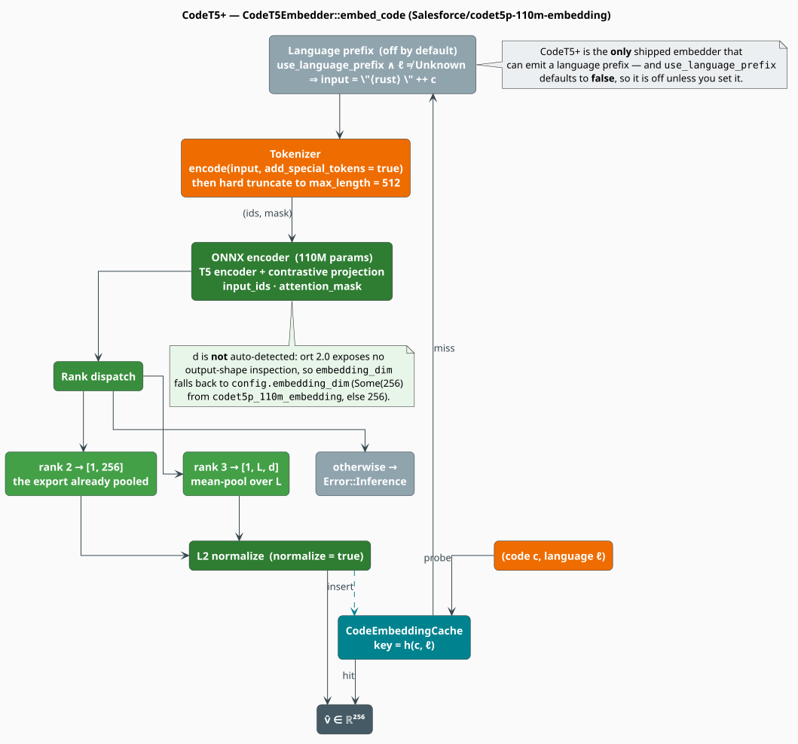

# CodeT5+

**CodeT5+** is Salesforce's family of encoder-decoder code models [[1]](#references). The
checkpoint libgrammstein targets — `Salesforce/codet5p-110m-embedding` — is the *embedding*
member of that family: an encoder plus a contrastively-trained projection head that emits a
compact 256-dimensional vector. It is the smallest of the three shipped models, the only one
trained on nine languages, and the only one that can prepend a language tag to its input.

> **Scope.** Source of truth: [`src/neural/code/codet5.rs`](../../../src/neural/code/codet5.rs).
> Feature gate `code-neural`. The trait, the notation, and the pooling rules are introduced in
> the [Code Embeddings Overview](overview.md); this document assumes them. Bring your own
> weights: `CodeT5Embedder` reads a directory holding `model.onnx` and `tokenizer.json`.

## Notation

In addition to the [overview's notation](overview.md#notation):

| Symbol | Meaning |
|---|---|
| $`v_i`$ | the embedding of the $`i`$-th snippet in a contrastive training batch |
| $`v_i^{+}`$ | the embedding of a *positive* — a snippet or docstring paired with $`i`$ |
| $`\tau`$ | the softmax temperature of the contrastive objective, $`\tau > 0`$ |
| $`B`$ | a contrastive training batch; $`\lvert B \rvert`$ its size |
| $`\mathcal{L}_{\mathrm{con}}`$ | the contrastive (InfoNCE) loss |
| $`r`$ | the rank — the number of axes — of the ONNX output tensor |
| $`d'`$ | the hidden width actually emitted by the graph, which may differ from $`d`$ |

**Acronym.** *InfoNCE* — Information Noise-Contrastive Estimation, the softmax-over-negatives
loss [[4]](#references).

## What CodeT5+ is

### The family, and the checkpoint that matters here

CodeT5+ [[1]](#references) extends CodeT5 [[2]](#references) — itself a code-specialized T5
[[3]](#references) — into a *modular* family whose components can be assembled into encoder-only,
decoder-only, or encoder-decoder configurations. It is pre-trained with a **mixture** of
objectives rather than a single one: span denoising, causal language modeling, text-code
contrastive learning, and text-code matching, over both unimodal code and bimodal
(code, docstring) data.

Only one of those objectives shapes the vector space we consume: **contrastive learning**. The
`-embedding` checkpoint is the encoder with a projection head trained under that objective, and
the projection is what fixes $`d = 256`$ — a width *narrower* than the encoder's hidden size.
That is operationally load-bearing, and [The dimension trap](#the-dimension-trap) explains why.

### Why the vectors are comparable: the contrastive objective

A transformer trained only to denoise spans has no reason to place semantically related snippets
near one another; nothing in that loss mentions distance. Contrastive pre-training supplies
exactly that pressure. With $`v_i`$ the embedding of a snippet, $`v_i^{+}`$ the embedding of a
paired positive, and every other member of the batch serving as a negative, the InfoNCE loss
[[4]](#references) is

```math
\begin{array}{lr}
\displaystyle \mathcal{L}_{\mathrm{con}}
= -\frac{1}{\lvert B \rvert} \sum_{i \in B}
\log
\frac{\exp\bigl(\cos(v_i, v_i^{+}) / \tau\bigr)}
     {\sum_{j \in B} \exp\bigl(\cos(v_i, v_j) / \tau\bigr)} & \text{(T1)}
\end{array}
```

Minimizing $`(\mathrm{T1})`$ maximizes $`\cos(v_i, v_i^{+})`$ while pushing $`\cos(v_i, v_j)`$
down for every $`j \neq i`$. Two consequences license everything downstream:

1. **Cosine is the trained metric.** The loss is written *in* cosine, so cosine — not the raw dot
   product, not $`L^1`$ — is the similarity the weights were optimized for. `normalize: true` is
   therefore the right default, and $`(\mathrm{CE4})`$ from the overview then makes Euclidean
   nearest-neighbour search order-equivalent to it.
2. **The geometry is calibrated only for the pairings used in training.** The positives are
   predominantly (code, docstring) and (code, code) pairs drawn from the pre-training corpus.
   Similarity between, say, two Rholang processes is an extrapolation, not a trained quantity.

## The shipped path



*Figure 1 — `CodeT5Embedder::embed_code`. Muted nodes are configured-but-off by default.*

### Configuration

`CodeT5Config` is the entire knob surface. Defaults are those of `CodeT5Config::default()`.

| Field | Type | Default | Meaning |
|---|---|---|---|
| `model_path` | `String` | `""` | path to `model.onnx` |
| `tokenizer_path` | `String` | `""` | path to `tokenizer.json` |
| `max_length` | `usize` | `512` | hard truncation length, in tokens |
| `use_language_prefix` | `bool` | `false` | prepend the language tag to the input |
| `num_threads` | `usize` | `4` | ONNX Runtime **intra-op** threads |
| `optimization_level` | `u8` | `3` | graph optimization level, $`0`$–$`3`$ |
| `cache_config` | `Option<CodeEmbeddingCacheConfig>` | `Some(default)` | `None` disables caching |
| `normalize` | `bool` | `true` | apply $`(\mathrm{CE2})`$ to the pooled vector |
| `embedding_dim` | `Option<usize>` | `None` | the *declared* dimension; see below |

The convenience constructor fills the paths and pins the dimension:

```rust
use libgrammstein::neural::code::CodeT5Config;

// <dir>/model.onnx + <dir>/tokenizer.json; max_length = 512; embedding_dim = Some(256).
let config = CodeT5Config::codet5p_110m_embedding("/models/codet5p-110m-embedding");
```

`optimization_level` maps onto `ort`'s `GraphOptimizationLevel` by saturating: $`0 \mapsto`$
`Disable`, $`1 \mapsto`$ `Level1`, $`2 \mapsto`$ `Level2`, and **everything else** — including
the default $`3`$ and stray values such as $`99`$ — $`\mapsto`$ `Level3`.

### Tokenization, and the language prefix

CodeT5+ is the **only** shipped embedder that hands the language tag to the tokenizer. When
`use_language_prefix` is `true` *and* $`\ell \neq`$ `Unknown`, the input string becomes the prefix
token, a space, then the code:

```rust
// CodeLanguage::Rust.prefix() == "<rust>"
let input = format!("{} {}", language.prefix(), code); // "<rust> fn main() {}"
```

It defaults to `false`, so the prefix is **off** unless you opt in — and you should opt in only if
your checkpoint's tokenizer actually knows those tokens. If `<rust>` is absent from the vocabulary
the tokenizer will shred it into subwords and you will merely have prepended noise. `Unknown`
yields the empty prefix and is skipped.

Tokenization then truncates **hard** to `max_length`:

```math
\begin{array}{lr}
\displaystyle \mathrm{ids} \;=\; \bigl(\mathrm{enc}_0, \ldots, \mathrm{enc}_{L-1}\bigr),
\qquad
L \;=\; \min\bigl(\lvert \mathrm{enc} \rvert,\ \texttt{max\_length}\bigr) & \text{(T2)}
\end{array}
```

There is no sliding window and no chunk-and-pool: tokens past `max_length` are **discarded**. A
3000-token file embedded whole is, in effect, an embedding of its first 512 tokens. Split large
inputs into functions before embedding them.

### Inference, and the rank dispatch

The ids and mask are shaped into $`[1, L]`$ `i64` tensors, the session mutex is taken, and the
graph is run. Its output is dispatched on the rank $`r`$:

```math
\begin{array}{lr}
\displaystyle v \;=\;
\begin{cases}
\textsf{data} & r = 2 \;\;\text{— shape } [1, d]\text{: the graph already pooled} \\[6pt]
\dfrac{1}{L}\displaystyle\sum_{i=0}^{L-1} H_i & r = 3 \;\;\text{— shape } [1, L, d']\text{: mean-pool} \\[10pt]
\textsf{Err}(\textsf{Inference}) & \text{otherwise}
\end{cases} & \text{(T3)}
\end{array}
```

The $`r = 3`$ branch additionally rejects a batch axis greater than $`1`$
(`Err(Inference("Unexpected batch size > 1"))`), consistent with the module's
one-snippet-at-a-time design. The pooled vector is then $`L^2`$-normalized when `normalize` is
set, inserted into the cache, and returned.

An export of `codet5p-110m-embedding` that *includes* the projection head takes the $`r = 2`$
branch: the graph emits $`[1, 256]`$ and libgrammstein passes it through untouched. The mean-pool
branch is the **fallback** for exports that stop at `last_hidden_state`.

### The dimension trap

Those two branches can disagree about the width, and nothing in the code checks:

- `embedding_dim()` reports `config.embedding_dim.unwrap_or(256)` — a *declaration* fixed at load
  time. It is **not** read back from the graph. The source is explicit that output-shape
  inspection is unavailable in `ort` 2.0, so there is no auto-detection, whatever the field's own
  doc-comment ("detected from model or set explicitly") suggests.
- The vector actually returned by the $`r = 3`$ branch has length $`d' =`$ `shape_dims[2]` — the
  encoder's hidden width, **not** the projection width.

So if you export a graph that emits `last_hidden_state` while leaving `embedding_dim` at the value
`codet5p_110m_embedding` set, `embed_code` hands back a $`d'`$-vector while `embedding_dim()`
insists on $`256`$. Downstream the mismatch is silent and corrosive: an
[`EnsembleCodeEmbedder`](ensemble.md) sizes its concatenated output — and validates its
equal-dimension strategies — from `embedding_dim()`, so it will compute the wrong width, or accept
a pairing it should have rejected.

> **Guard against it.** Probe once at start-up and let it fail loudly rather than silently:
>
> ```rust
> use libgrammstein::neural::code::{CodeEmbedder, CodeLanguage};
>
> let probe = embedder.embed_code("fn f() {}", CodeLanguage::Rust)?;
> assert_eq!(
>     probe.len(),
>     embedder.embedding_dim(),
>     "the ONNX export emits {} dims but embedding_dim() declares {}; \
>      set CodeT5Config::embedding_dim to match the export",
>     probe.len(),
>     embedder.embedding_dim(),
> );
> # Ok::<(), libgrammstein::neural::code::CodeEmbeddingError>(())
> ```

## Embedding, literately

The following mirrors `CodeT5Embedder::{tokenize, run_inference}` and its `CodeEmbedder` impl.
`⟨…⟩` names a refinement expanded below.

```
function embed_code(c, l):
    if cache and cache.get(c, l) = Some(v): return v.to_vec()   ▸ hit: no lock, no inference
    (ids, mask) <- ⟨Tokenize with optional prefix⟩
    v <- ⟨Run the graph, pool by rank⟩
    if config.normalize: normalize_embedding(v)                 ▸ (CE2)
    if cache: cache.insert(c, l, clone of v)
    return v

⟨Tokenize with optional prefix⟩ ≡
    input <- prefix(l) ++ " " ++ c   if use_language_prefix and l != Unknown
             c                       otherwise
    enc   <- tokenizer.encode(input, add_special_tokens = true)
    L     <- min(len(enc.ids), max_length)                      ▸ (T2): hard truncation
    return (enc.ids[0..L] as i64, enc.attention_mask[0..L] as i64)

⟨Run the graph, pool by rank⟩ ≡
    ids_t  <- Tensor from an Array2 of shape [1, L]             ▸ batch axis pinned to 1
    mask_t <- Tensor from an Array2 of shape [1, L]
    session <- self.session.lock()                              ▸ the single serialization point
    out     <- session.run({input_ids_name: ids_t, attention_mask_name: mask_t})
    (shape, data) <- out[output_name].try_extract_tensor::<f32>()
    match rank(shape):                                          ▸ (T3)
        2 -> return data                                        ▸ [1, d] — already pooled
        3 -> if shape[0] != 1: return Err(Inference("Unexpected batch size > 1"))
             return the mean of the L rows of data              ▸ (CE6); the mask is NOT applied
        _ -> return Err(Inference("Unexpected output shape"))
```

## Engineering

### I/O node-name detection

Exported graphs disagree about node names, so `load` probes the session instead of hard-coding
them:

| Node | Rule | Fallback |
|---|---|---|
| ids input | the first input whose name contains `input_ids` | `"input_ids"` |
| mask input | the first input whose name contains `attention_mask` | `"attention_mask"` |
| output | the **first** output of the graph | `"last_hidden_state"` |

The resolved names are readable after the fact, which is the fastest way to diagnose a graph that
loads but yields nothing useful:

```rust
let (ids_name, mask_name) = embedder.input_names();
println!("{ids_name} / {mask_name} -> {}", embedder.output_name());
```

Taking the *first* output is worth knowing about: a graph exporting both `last_hidden_state` and
`pooler_output` will be read from whichever ONNX lists first — which may not be the one you meant.

### Thread safety and caching

The `Session` lives behind `Arc<Mutex<Session>>` (a `parking_lot::Mutex`), so concurrent
`embed_code` calls serialize on inference while cache hits proceed lock-free through the
`DashMap`. The hand-written `unsafe impl Send` and `unsafe impl Sync` are justified by exactly
that discipline: every `Session` access goes through the mutex. `embed_code_batch` is a sequential
`map` over `embed_code` — an ergonomic wrapper, **not** a batched forward pass; the source says as
much (*"process sequentially… the mutex-based session access makes true batching complex"*). See
[the overview's engineering section](overview.md#engineering) for how to recover parallelism (one
embedder per worker).

Cache control is per-embedder:

```rust
embedder.clear_cache();                                  // drop every cached vector
let occupancy: Option<usize> = embedder.cache_stats();   // entries held; None if caching is off
```

`cache_stats` reports **occupancy, not hit rate** — no hit/miss counters exist. See
[Caching](caching.md).

## Usage

```rust
use libgrammstein::neural::code::{CodeEmbedder, CodeLanguage, CodeT5Config, CodeT5Embedder};

// Opt into the language prefix, widen the ONNX thread pool, keep the default cache.
let config = CodeT5Config {
    use_language_prefix: true,
    num_threads: 8,
    ..CodeT5Config::codet5p_110m_embedding("/models/codet5p-110m-embedding")
};
let embedder = CodeT5Embedder::load(config)?;

let v = embedder.embed_code("fn main() { println!(\"hello\"); }", CodeLanguage::Rust)?;

assert_eq!(embedder.model_name(), "CodeT5+");
assert_eq!(embedder.max_sequence_length(), 512);
assert_eq!(v.len(), embedder.embedding_dim()); // see "The dimension trap"
# Ok::<(), libgrammstein::neural::code::CodeEmbeddingError>(())
```

`CodeT5Embedder::from_directory(dir)` is the same call with the default config. Turning the cache
off entirely — appropriate for a single-pass batch job, where every key is cold and the map is
pure overhead:

```rust
use libgrammstein::neural::code::CodeT5Config;

let config = CodeT5Config {
    cache_config: None,
    ..CodeT5Config::codet5p_110m_embedding("/models/codet5p-110m-embedding")
};
```

## When to choose CodeT5+

| Situation | Verdict |
|---|---|
| You need C, C++, or C# | **CodeT5+ only** — the other two shipped models saw six languages, none of them these |
| Index size or memory is tight | **CodeT5+** — $`d = 256`$ is a third the width of the others, so the index is a third the size |
| Code-to-code clone detection | Prefer [UniXcoder](unixcoder.md), contrastively trained for exactly that |
| Structure-sensitive retrieval | Prefer [GraphCodeBERT](graphcodebert.md) — but read its data-flow caveat first |
| Accuracy first, cost second | Combine all three: [Ensemble](ensemble.md) |

Note the interaction with the ensemble: because $`d = 256 \neq 768`$, CodeT5+ **cannot** be
averaged or max-pooled against the other two. Only `EnsembleStrategy::Concatenate` accepts it.

## References

1. Y. Wang, H. Le, A. D. Gotmare, N. D. Q. Bui, J. Li & S. C. H. Hoi (2023). *CodeT5+: Open Code
   Large Language Models for Code Understanding and Generation.* EMNLP 2023. arXiv:2305.07922.
   [doi:10.48550/arXiv.2305.07922](https://doi.org/10.48550/arXiv.2305.07922)
2. Y. Wang, W. Wang, S. Joty & S. C. H. Hoi (2021). *CodeT5: Identifier-aware Unified Pre-trained
   Encoder-Decoder Models for Code Understanding and Generation.* EMNLP 2021. arXiv:2109.00859.
   [doi:10.48550/arXiv.2109.00859](https://doi.org/10.48550/arXiv.2109.00859)
3. C. Raffel, N. Shazeer, A. Roberts, K. Lee, S. Narang, M. Matena, Y. Zhou, W. Li & P. J. Liu
   (2020). *Exploring the Limits of Transfer Learning with a Unified Text-to-Text Transformer*
   (T5). JMLR 21(140), 1–67. arXiv:1910.10683.
   [doi:10.48550/arXiv.1910.10683](https://doi.org/10.48550/arXiv.1910.10683)
4. A. van den Oord, Y. Li & O. Vinyals (2018). *Representation Learning with Contrastive
   Predictive Coding* (InfoNCE). arXiv:1807.03748.
   [doi:10.48550/arXiv.1807.03748](https://doi.org/10.48550/arXiv.1807.03748)

## See also

- [Code Embeddings Overview](overview.md) — the trait, the notation, the pooling rules
- [UniXcoder](unixcoder.md) · [GraphCodeBERT](graphcodebert.md) — the sibling encoders
- [Ensemble](ensemble.md) — why CodeT5+'s 256 dims force `Concatenate`
- [Caching](caching.md) — the cache this embedder owns
