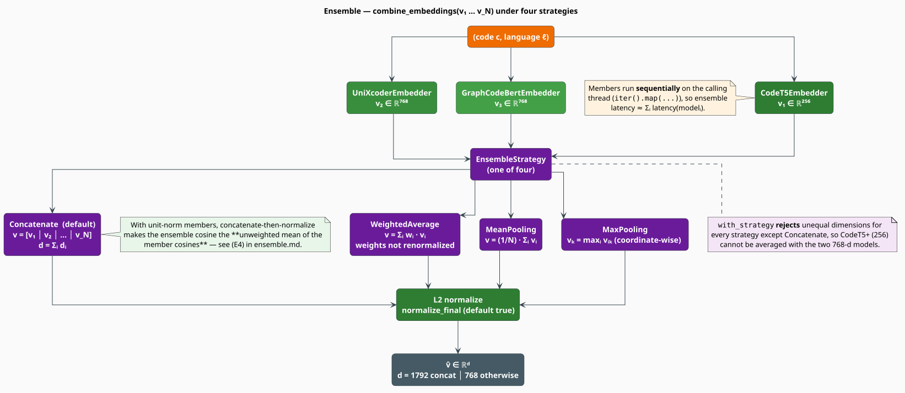

# Ensemble Code Embeddings

An **ensemble** fuses the vectors of several encoders into one, on the theory that models which
fail differently cover each other's blind spots. `EnsembleCodeEmbedder` implements four fusion
strategies over any number of members, and — because it implements `CodeEmbedder` itself — an
ensemble is a drop-in replacement for a single model anywhere, including inside another ensemble.

The headline result of this document is a small theorem: **under the default settings,
concatenation is exactly the unweighted mean of the members' cosine judgements**
($`(\mathrm{E4})`$). That single identity tells you what an ensemble is really doing, why the
weights behave as they do, and when the extra memory buys you nothing.

> **Scope.** Source of truth:
> [`src/neural/code/ensemble.rs`](../../../src/neural/code/ensemble.rs). Feature gate
> `code-neural`. The trait, the notation, and the cosine machinery come from the
> [Code Embeddings Overview](overview.md).

## Notation

In addition to the [overview's notation](overview.md#notation):

| Symbol | Meaning |
|---|---|
| $`N`$ | the number of ensemble members, $`N \geq 1`$ |
| $`f_i`$ | the $`i`$-th member embedder, $`i = 1, \ldots, N`$ |
| $`d_i`$ | the embedding dimension of member $`i`$ |
| $`v_i`$ | the vector returned by member $`i`$, $`v_i = f_i(c, \ell) \in \mathbb{R}^{d_i}`$ |
| $`v_{i,k}`$ | coordinate $`k`$ of $`v_i`$ |
| $`w_i`$ | the fusion weight of member $`i`$ (`weights[i]`, an `f64`) |
| $`\Phi`$ | the fusion map — one of the four strategies |
| $`\nu`$ | the final $`L^2`$ normalization, applied iff `normalize_final` |
| $`u`$ | the fused, un-normalized vector, $`u = \Phi(v_1, \ldots, v_N)`$ |
| $`\hat{u}`$ | the ensemble's output, $`\hat{u} = \nu(u)`$ |
| $`[\,a \Vert b\,]`$ | vector concatenation |
| $`s_i`$ | the cosine score member $`i`$ assigns to a snippet pair |
| $`\rho`$ | the pairwise correlation between members' score errors |

## Why ensemble at all?

The three shipped encoders disagree by construction — different architectures, different
objectives, different structural priors:

| Model | Architecture | Objective that shapes the space | Blind spot |
|---|---|---|---|
| [CodeT5+](codet5.md) | encoder-decoder (T5) | text-code contrastive | narrow $`d = 256`$; no structural channel |
| [UniXcoder](unixcoder.md) | unified RoBERTa, prefix-masked | multi-modal contrastive | surface-form sensitive; sees no data flow |
| [GraphCodeBERT](graphcodebert.md) | RoBERTa | MLM + data-flow edge prediction | run-time data flow is **not wired** in this crate |

Ensembling is worth the cost precisely to the extent that their errors are *uncorrelated*
[[1]](#references)[[2]](#references) — and $`(\mathrm{E7})`$ below makes that statement
quantitative rather than aspirational.



*Figure 1 — members are queried sequentially, fused by one of four strategies, then normalized.*

## Theory

### The ensemble map

```math
\hat{u} \;=\; \nu\bigl(\Phi(v_1, \ldots, v_N)\bigr),
\qquad
v_i = f_i(c, \ell),
\qquad
\nu(u) = \begin{cases} u / \lVert u \rVert_2 & \texttt{normalize\_final} \\ u & \text{otherwise} \end{cases}
\tag{E1}
```

`normalize_final` defaults to `true` and is togglable via `set_normalize_final`. Every member is
handed the *same* $`(c, \ell)`$; the ensemble adds no tokenization or caching of its own.

### The four strategies

```math
\Phi(v_1, \ldots, v_N) \;=\;
\begin{cases}
\bigl[\, v_1 \,\Vert\, v_2 \,\Vert\, \cdots \,\Vert\, v_N \,\bigr]
  & \texttt{Concatenate} \quad \text{(the default)} \\[6pt]
\displaystyle\sum_{i=1}^{N} w_i \, v_i
  & \texttt{WeightedAverage} \\[10pt]
\dfrac{1}{N} \displaystyle\sum_{i=1}^{N} v_i
  & \texttt{MeanPooling} \\[10pt]
\Bigl(\, \max_{1 \leq i \leq N} v_{i,k} \,\Bigr)_{k=1}^{d}
  & \texttt{MaxPooling}
\end{cases} \tag{E2}
```

Only `Concatenate` tolerates members of differing width; the other three are coordinate-wise and
therefore demand that every $`d_i`$ agree. `with_strategy` enforces exactly that, so the output
width is

```math
d_{\mathrm{ens}} \;=\;
\begin{cases}
\sum_{i=1}^{N} d_i & \texttt{Concatenate} \\[4pt]
d_1 \quad\text{(with } d_1 = d_2 = \cdots = d_N \text{ enforced at construction)} & \text{otherwise}
\end{cases} \tag{E3}
```

With the three shipped models this means $`d_{\mathrm{ens}} = 256 + 768 + 768 = 1792`$ under
`Concatenate` — and that the other three strategies are **unavailable** for the full trio, because
CodeT5+'s $`256`$ cannot be added coordinate-wise to $`768`$. UniXcoder and GraphCodeBERT alone,
both at $`768`$, admit all four.

### The concatenation identity

Here is the result that demystifies `Concatenate`.

> **Proposition (concatenation is a mean of cosines).**
> Suppose every member returns a unit vector — $`\lVert v_i \rVert_2 = 1`$ for all $`i`$, which is
> exactly what `normalize: true` (the default on all three embedders) guarantees — and suppose
> `normalize_final` is `true`. Then for any two snippets $`a`$ and $`b`$, the ensemble's cosine is
> the **unweighted arithmetic mean of the members' cosines**:
>
> ```math
> \cos\bigl(\hat{u}(a),\, \hat{u}(b)\bigr)
> \;=\; \frac{1}{N} \sum_{i=1}^{N} \cos\bigl(v_i(a),\, v_i(b)\bigr) \tag{E4}
> ```

**Proof.** Write $`u(a) = [\,v_1(a) \Vert \cdots \Vert v_N(a)\,]`$. Concatenation places the
members' coordinates in disjoint blocks, so both the squared norm and the inner product decompose
blockwise:

```math
\lVert u(a) \rVert_2^{2}
= \sum_{i=1}^{N} \lVert v_i(a) \rVert_2^{2}
= \sum_{i=1}^{N} 1
= N,
\qquad\text{hence}\qquad
\lVert u(a) \rVert_2 = \sqrt{N},
```

and identically $`\lVert u(b) \rVert_2 = \sqrt{N}`$. For the inner product,

```math
\langle u(a),\, u(b) \rangle
= \sum_{i=1}^{N} \langle v_i(a),\, v_i(b) \rangle
= \sum_{i=1}^{N} \cos\bigl(v_i(a),\, v_i(b)\bigr),
```

where the second equality uses $`\lVert v_i(a) \rVert_2 = \lVert v_i(b) \rVert_2 = 1`$, so each
inner product *is* the corresponding cosine. Since $`\nu`$ is a positive rescaling it leaves the
cosine unchanged, and therefore

```math
\cos\bigl(\hat{u}(a), \hat{u}(b)\bigr)
= \frac{\langle u(a), u(b) \rangle}{\lVert u(a) \rVert_2 \, \lVert u(b) \rVert_2}
= \frac{\sum_{i=1}^{N} \cos\bigl(v_i(a), v_i(b)\bigr)}{\sqrt{N} \cdot \sqrt{N}}
= \frac{1}{N} \sum_{i=1}^{N} \cos\bigl(v_i(a), v_i(b)\bigr). \qquad \blacksquare
```

Three consequences, all practical:

1. **`Concatenate` is score-level fusion in disguise.** It is the *sum rule* of Kittler et al.
   [[2]](#references), executed in vector space. It does not magically create information that
   scoring the members separately and averaging would not.
2. **Why do it anyway?** Because one $`1792`$-dimensional index answers a query in one pass,
   whereas three separate indices need three passes and a merge. `Concatenate` buys *engineering*
   convenience, not statistical power.
3. **When it buys nothing:** if you are already scoring members individually for some other reason,
   averaging their cosines is equivalent, uses $`3\times`$ less index memory, and lets you weight
   them — which `Concatenate` cannot (it has no weights).

### Without unit-norm members, the mean becomes norm-weighted

Drop the unit-norm hypothesis (i.e. set some member's `normalize: false`) and $`(\mathrm{E4})`$
generalizes to a *norm-weighted* mean — the same algebra, without the simplifications:

```math
\cos\bigl(\hat{u}(a), \hat{u}(b)\bigr)
= \frac{\displaystyle\sum_{i=1}^{N} \lVert v_i(a) \rVert_2 \, \lVert v_i(b) \rVert_2 \, \cos\bigl(v_i(a), v_i(b)\bigr)}
       {\sqrt{\displaystyle\sum_{i=1}^{N} \lVert v_i(a) \rVert_2^{2}} \;\cdot\; \sqrt{\displaystyle\sum_{i=1}^{N} \lVert v_i(b) \rVert_2^{2}}}
\tag{E5}
```

A member whose raw vectors happen to be long therefore **silently dominates** the ensemble, in
proportion to its norm, with no weight ever having been configured. Keep `normalize: true` on every
member unless you have a specific reason not to — it is what makes the fusion egalitarian.

### `MeanPooling` and uniform `WeightedAverage` are the same thing

```math
\text{For any } \gamma > 0: \quad
\nu\Bigl(\textstyle\sum_i \gamma \, v_i\Bigr)
= \nu\Bigl(\gamma N \cdot \tfrac{1}{N}\textstyle\sum_i v_i\Bigr)
= \nu\Bigl(\tfrac{1}{N}\textstyle\sum_i v_i\Bigr) \tag{E6}
```

because $`\nu`$ is invariant under multiplication by a positive scalar. Two corollaries you can act
on:

- **`with_strategy(…, WeightedAverage, None)` is `MeanPooling`.** The `None` case fills
  $`w_i = 1/N`$, a uniform vector, so by $`(\mathrm{E6})`$ the two strategies emit the *identical*
  unit vector. Choosing between them is a matter of intent, not of arithmetic.
- **Weight *scale* is irrelevant; only the *ratios* matter.** `weights = [2.0, 3.0]` and
  `weights = [0.4, 0.6]` produce the same output. This is why the fact that
  `with_strategy` never renormalizes the weights you hand it is harmless — under the default
  `normalize_final = true`. Turn normalization off and the scale suddenly matters. (Negative
  weights are accepted by the type and will *subtract* a member's direction; that is almost
  certainly not what you want.)

### How much does an ensemble actually help?

Model member $`i`$'s cosine for a given pair as a noisy estimate of the truth $`s^{*}`$:
$`s_i = s^{*} + \varepsilon_i`$, with $`\mathbb{E}[\varepsilon_i] = 0`$,
$`\mathrm{Var}(\varepsilon_i) = \sigma^{2}`$, and pairwise correlation
$`\mathrm{Corr}(\varepsilon_i, \varepsilon_j) = \rho`$ for $`i \neq j`$. By $`(\mathrm{E4})`$
the ensemble score is the mean $`\bar{s} = \frac{1}{N}\sum_i s_i`$, whose variance is

```math
\mathrm{Var}(\bar{s})
= \frac{\sigma^{2}}{N^{2}} \Bigl( N + N(N-1)\rho \Bigr)
= \frac{\sigma^{2}}{N}\bigl(1 + (N-1)\rho\bigr)
\;\xrightarrow[N \to \infty]{}\; \rho \, \sigma^{2} \tag{E7}
```

Read $`(\mathrm{E7})`$ carefully, because it is the whole business case:

- **$`\rho = 0`$ (independent errors):** variance falls as $`\sigma^2 / N`$ — the textbook ensemble
  win [[1]](#references).
- **$`\rho = 1`$ (identical errors):** variance is $`\sigma^{2}`$ — the ensemble is pure cost.
- **Reality:** UniXcoder and GraphCodeBERT are both RoBERTa-family encoders trained on the *same*
  six-language CodeSearchNet corpus, so their $`\rho`$ is high; CodeT5+ differs in architecture,
  objective, corpus breadth, and width, so it is the member most likely to *decorrelate* the pool.
  The floor $`\rho\sigma^{2}`$ in $`(\mathrm{E7})`$ is why stacking three near-identical models is
  a poor trade and why heterogeneity — not member count — is what you are actually buying.

### `MaxPooling`, honestly

Element-wise maximum is the one strategy with no cosine identity and no variance argument. It is
not a linear map of its inputs, so nothing above applies to it; it selects, per coordinate, the
strongest activation among members. It is cheap and occasionally effective, but it is the least
theoretically motivated of the four — treat it as an empirical option to be validated on your data,
not as a principled default. Two edge cases follow from the implementation, which seeds the
accumulator with $`-\infty`$: a coordinate in which *every* member yields `NaN` is never written
(because `NaN > x` is false) and remains $`-\infty`$, which the final normalization then turns into
`NaN`. Unit-norm inputs from a healthy model never trigger this; a broken export can.

## Construction and validation

Two constructors, with materially different strictness.

```rust
use std::sync::Arc;
use libgrammstein::neural::code::{CodeEmbedder, EnsembleCodeEmbedder, EnsembleStrategy};

// 1. `new` — Concatenate, weights all 1.0, normalize_final = true. Does NOT validate.
let ensemble = EnsembleCodeEmbedder::new(members.clone());

// 2. `with_strategy` — validates, and is the constructor you should reach for.
let ensemble = EnsembleCodeEmbedder::with_strategy(
    members,
    EnsembleStrategy::WeightedAverage,
    Some(vec![0.6, 0.4]),   // None => uniform 1/N  (== MeanPooling, by (E6))
)?;
# Ok::<(), libgrammstein::neural::code::CodeEmbeddingError>(())
```

`with_strategy` rejects three things, each as `CodeEmbeddingError::Inference` (an odd variant for
what are really *configuration* errors, but that is what the code returns):

| Rejected | Message |
|---|---|
| an empty member list | `Ensemble requires at least one embedder` |
| `weights.len() != embedders.len()` | `Weight count (…) must match embedder count (…)` |
| unequal $`d_i`$ under a non-`Concatenate` strategy | `… strategy requires equal embedding dimensions. Embedder i has dim … but expected …` |

> **`new` does not validate.** `EnsembleCodeEmbedder::new(vec![])` is accepted: it yields an
> ensemble with $`N = 0`$, `embedding_dim() == 0`, and an `embed_code` that returns an **empty
> vector** rather than an error (`combine_embeddings` short-circuits on an empty input). Prefer
> `with_strategy`, which catches this. Note also that `new` seeds `weights` with `1.0` each rather
> than $`1/N`$ — harmless, because `Concatenate` never reads them and no setter can change the
> strategy afterwards.

## Fusing, literately

```
function embed_code(c, l):                          ▸ EnsembleCodeEmbedder
    vs <- []
    for each member f_i in embedders:               ▸ SEQUENTIAL — iter().map(), not par_iter()
        vs.push( f_i.embed_code(c, l)? )            ▸ each member consults ITS OWN cache
    return combine_embeddings(vs)

function combine_embeddings(vs):
    if vs is empty: return []                       ▸ the N = 0 escape hatch; see the note above
    u <- match strategy:                            ▸ (E2)
        Concatenate     -> flatten(vs)
        WeightedAverage -> sum_i  w_i * v_i         ▸ zips vs with weights, pairwise
        MeanPooling     -> sum_i  v_i / N
        MaxPooling      -> coordinate-wise max, accumulator seeded at -inf
    if normalize_final: normalize_embedding(u)      ▸ (E1); default true
    return u
```

`embed_code_batch` runs each member's own `embed_code_batch` (itself a sequential loop, see the
[overview](overview.md#honest-limits)), then transposes the results and fuses per snippet. It
clones each member's vector during the transpose, so a batch of $`B`$ snippets over $`N`$ members
performs $`B \cdot N`$ extra vector copies on top of the inference cost.

## Engineering

### The ensemble is sequential, and holds no cache

Both facts follow directly from the source and both are load-bearing:

- **Sequential.** Members are visited with `iter().map(…)`, on the calling thread. Latency is
  therefore additive, not parallel:

  ```math
  T_{\mathrm{ens}}(c) \;=\; \sum_{i=1}^{N} T_i(c),
  \qquad
  \mathrm{RAM}_{\mathrm{ens}} \;=\; \sum_{i=1}^{N} \mathrm{RAM}_i \tag{E8}
  ```

  Nothing about this is inherent — each member has its own `Session` behind its own mutex, so the
  calls are mutually independent and could be issued concurrently. Today they are not. If you need
  the parallel version, drive the members yourself from $`N`$ threads and call
  `cosine_similarity` on each result, then average — which by $`(\mathrm{E4})`$ is *exactly*
  `Concatenate`, at $`\max_i T_i`$ instead of $`\sum_i T_i`$.
- **No cache of its own.** The ensemble delegates entirely to the members' individual
  [`CodeEmbeddingCache`s](caching.md). A repeated snippet is therefore still cheap — every member
  hits — but the fusion arithmetic of $`(\mathrm{E2})`$ is redone on every call. That is
  microseconds against a transformer's milliseconds, so it is the right trade.

### Trait conformance quirks

| Method | What the ensemble returns | Note |
|---|---|---|
| `model_name()` | `"Ensemble"` | not derived from the members |
| `embedding_dim()` | $`(\mathrm{E3})`$ | computed at construction from the members' *declared* dims — see [the dimension trap](codet5.md#the-dimension-trap) |
| `max_sequence_length()` | $`\min_i`$ over members (`512` if empty) | the safe floor: the shortest member truncates first |
| `supported_languages()` | `&[]` | **empty means "all"** per the trait's default `supports_language`, so the ensemble advertises universal support rather than the intersection of its members' sets. The source concedes this is a simplification |

Because `EnsembleCodeEmbedder` implements `CodeEmbedder`, ensembles **nest**: an
`Arc<EnsembleCodeEmbedder>` is a legal member of another ensemble, letting you concatenate a
$`768`$-dimensional mean-pooled sub-ensemble with CodeT5+'s $`256`$.

## Usage

### The full trio (the only strategy that accepts all three)

```rust
use std::sync::Arc;
use libgrammstein::neural::code::{
    CodeEmbedder, CodeLanguage, CodeT5Embedder, EnsembleCodeEmbedder, EnsembleStrategy,
    GraphCodeBertEmbedder, UniXcoderEmbedder,
};

let members: Vec<Arc<dyn CodeEmbedder>> = vec![
    Arc::new(CodeT5Embedder::from_directory("/models/codet5p-110m-embedding")?),
    Arc::new(UniXcoderEmbedder::from_directory("/models/unixcoder-base")?),
    Arc::new(GraphCodeBertEmbedder::from_directory("/models/graphcodebert-base")?),
];

// Concatenate is the only strategy that tolerates 256 + 768 + 768.
let ensemble = EnsembleCodeEmbedder::with_strategy(members, EnsembleStrategy::Concatenate, None)?;

assert_eq!(ensemble.embedding_dim(), 1792);       // (E3)
assert_eq!(ensemble.num_embedders(), 3);
assert_eq!(ensemble.strategy(), EnsembleStrategy::Concatenate);

let v = ensemble.embed_code("fn main() {}", CodeLanguage::Rust)?;
assert_eq!(v.len(), 1792);
// By (E4), cos(v(a), v(b)) is the mean of the three models' cosines.
# Ok::<(), libgrammstein::neural::code::CodeEmbeddingError>(())
```

### Two 768-dimensional models, weighted

```rust
use std::sync::Arc;
use libgrammstein::neural::code::{
    CodeEmbedder, EnsembleCodeEmbedder, EnsembleStrategy, GraphCodeBertEmbedder, UniXcoderEmbedder,
};

let members: Vec<Arc<dyn CodeEmbedder>> = vec![
    Arc::new(UniXcoderEmbedder::from_directory("/models/unixcoder-base")?),
    Arc::new(GraphCodeBertEmbedder::from_directory("/models/graphcodebert-base")?),
];

// Trust UniXcoder more for code-to-code similarity. Only the RATIO 0.7 : 0.3 matters — (E6).
let mut ensemble = EnsembleCodeEmbedder::with_strategy(
    members,
    EnsembleStrategy::WeightedAverage,
    Some(vec![0.7, 0.3]),
)?;
ensemble.set_normalize_final(true);               // the default; stated for emphasis

assert_eq!(ensemble.embedding_dim(), 768);        // (E3): not 1536 — this is not a concatenation
assert_eq!(ensemble.weights(), &[0.7, 0.3]);
# Ok::<(), libgrammstein::neural::code::CodeEmbeddingError>(())
```

Attempting the same with CodeT5+ in the list fails loudly, which is the intended behaviour:

```rust
// CodeT5+ is 256-d; UniXcoder is 768-d. WeightedAverage is coordinate-wise, so:
let result = EnsembleCodeEmbedder::with_strategy(
    mismatched_members,
    EnsembleStrategy::WeightedAverage,
    None,
);
assert!(result.is_err()); // "…requires equal embedding dimensions…"
```

## Choosing a strategy

| Situation | Strategy | Why |
|---|---|---|
| Members of differing width (any set including CodeT5+) | **`Concatenate`** | the only one $`(\mathrm{E3})`$ permits; equals the mean of member cosines by $`(\mathrm{E4})`$ |
| One index, one pass, no tuning | **`Concatenate`** | the default, and the engineering win of $`(\mathrm{E4})`$ |
| Equal widths, one member you trust more | **`WeightedAverage`** | the only strategy with a tunable knob; ratios are what count $`(\mathrm{E6})`$ |
| Equal widths, no preference | **`MeanPooling`** | identical to uniform `WeightedAverage` $`(\mathrm{E6})`$; keeps $`d`$ small |
| Index memory is the binding constraint | **`MeanPooling`** | $`d`$ instead of $`Nd`$ — a $`3\times`$ saving over `Concatenate` |
| You have measured that it helps | `MaxPooling` | no theory backs it; validate empirically |

And the meta-rule from $`(\mathrm{E7})`$: **add a member only if it fails differently.** A fourth
RoBERTa trained on CodeSearchNet will move $`\rho`$ toward $`1`$ and buy you a slower system with
the same variance.

## References

1. T. G. Dietterich (2000). *Ensemble Methods in Machine Learning.* Multiple Classifier Systems
   (MCS 2000), LNCS 1857, 1–15.
   [doi:10.1007/3-540-45014-9_1](https://doi.org/10.1007/3-540-45014-9_1)
2. J. Kittler, M. Hatef, R. P. W. Duin & J. Matas (1998). *On Combining Classifiers.* IEEE
   Transactions on Pattern Analysis and Machine Intelligence 20(3), 226–239.
   [doi:10.1109/34.667881](https://doi.org/10.1109/34.667881)
3. Y. Wang, H. Le, A. D. Gotmare, N. D. Q. Bui, J. Li & S. C. H. Hoi (2023). *CodeT5+: Open Code
   Large Language Models for Code Understanding and Generation.* EMNLP 2023. arXiv:2305.07922.
   [doi:10.48550/arXiv.2305.07922](https://doi.org/10.48550/arXiv.2305.07922)
4. D. Guo, S. Lu, N. Duan, Y. Wang, M. Zhou & J. Yin (2022). *UniXcoder: Unified Cross-Modal
   Pre-training for Code Representation.* ACL 2022. arXiv:2203.03850.
   [doi:10.48550/arXiv.2203.03850](https://doi.org/10.48550/arXiv.2203.03850)
5. D. Guo, S. Ren, S. Lu, Z. Feng, D. Tang, S. Liu, L. Zhou, N. Duan et al. (2021).
   *GraphCodeBERT: Pre-training Code Representations with Data Flow.* ICLR 2021. arXiv:2009.08366.
   [doi:10.48550/arXiv.2009.08366](https://doi.org/10.48550/arXiv.2009.08366)

## See also

- [Code Embeddings Overview](overview.md) — the trait every member implements
- [CodeT5+](codet5.md) — why its $`d = 256`$ forces `Concatenate`
- [UniXcoder](unixcoder.md) · [GraphCodeBERT](graphcodebert.md) — the $`d = 768`$ pair that admits
  every strategy
- [Caching](caching.md) — the per-member caches the ensemble relies on
- [Hybrid Interpolation](../hybrid/interpolation.md) — the same fusion instinct, applied to
  probabilities rather than vectors
