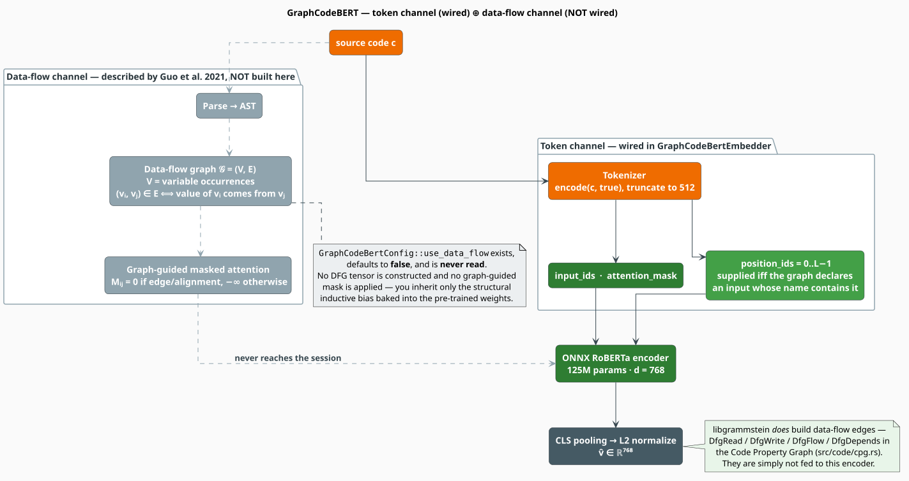

# GraphCodeBERT

**GraphCodeBERT** is the one shipped encoder that was pre-trained against explicit *semantic
structure*: not the abstract syntax tree, but the **data-flow graph** — the "where-does-this-value-come-from"
relation between variable occurrences [[1]](#references). That inductive bias is what makes it
strong on clone detection and on retrieval where two snippets differ syntactically but move data
the same way.

It is also the model with the widest gap between what the literature promises and what the crate
currently delivers. This document lays out the theory in full, then states — precisely, and
without euphemism — that **libgrammstein does not feed data flow to this model at inference
time**, and what that does and does not cost you.

> **Scope.** Source of truth:
> [`src/neural/code/graphcodebert.rs`](../../../src/neural/code/graphcodebert.rs). Feature gate
> `code-neural`. The trait, the notation, and the pooling rules come from the
> [Code Embeddings Overview](overview.md). Bring your own weights: `GraphCodeBertEmbedder` reads a
> directory holding `model.onnx` and `tokenizer.json`, exported from `microsoft/graphcodebert-base`
> or a compatible checkpoint.

## Notation

In addition to the [overview's notation](overview.md#notation):

| Symbol | Meaning |
|---|---|
| $`\mathcal{G}(c)`$ | the data-flow graph of snippet $`c`$ |
| $`V`$ | the vertex set of $`\mathcal{G}`$ — one vertex per *variable occurrence* |
| $`E`$ | the edge set of $`\mathcal{G}`$, $`E \subseteq V \times V`$ |
| $`C`$ | the sequence of code tokens |
| $`W`$ | the sequence of comment (natural-language) tokens |
| $`X`$ | the full model input, a concatenation of $`C`$, $`W`$, and $`V`$ |
| $`M`$ | the additive attention mask, $`M \in \{0, -\infty\}^{\lvert X \rvert \times \lvert X \rvert}`$ |
| $`E'`$ | the *node-alignment* relation between a variable vertex and the code token it came from |
| $`\sigma`$ | the logistic function, $`\sigma(z) = (1 + e^{-z})^{-1}`$ |
| $`\delta_{ij}`$ | the indicator that edge $`(i, j)`$ truly exists in $`E`$ |

**Acronyms.** *DFG* — Data-Flow Graph; *AST* — Abstract Syntax Tree; *MLM* — Masked Language
Modeling; *BCE* — Binary Cross-Entropy.

## Theory: structure without the tree

### Why data flow, and not the AST

An AST is a *syntactic* object: it is deep, it is language-specific, and two programs that compute
the same thing can have wildly different trees. GraphCodeBERT's argument [[1]](#references) is
that a **data-flow graph** is the better structure to hand a transformer, because it is

- **semantic, not syntactic** — $`x = 1;\ y = x`$ and $`y = (1)`$ induce the same value flow;
- **flat** — it adds no deep hierarchy, so it can be appended to the token sequence instead of
  requiring a tree-shaped architecture;
- **variable-centric** — it captures precisely the relation that alpha-renaming preserves and that
  lexical matching destroys.

Formally, for a snippet $`c`$:

```math
\mathcal{G}(c) = (V, E),
\qquad
(v_i, v_j) \in E \iff \text{the value of } v_j \text{ is computed from the value of } v_i
\tag{G1}
```

Each $`v \in V`$ is an *occurrence* of a variable, not a variable name — so the two $`x`$s in
$`x = 1;\ x = x + 1`$ are distinct vertices joined by an edge. Consider:

```python
def f(a, b):
    c = a + b     # value of c comes from a and b
    d = c * 2     # value of d comes from c
    return d      # returned value comes from d
```

Then $`E \supseteq \{(a, c),\ (b, c),\ (c, d),\ (d, \mathrm{ret})\}`$. Rename every identifier and
$`\mathcal{G}`$ is unchanged — which is exactly the invariance a code embedder wants.

### Graph-guided masked attention

The model is a RoBERTa-family transformer [[3]](#references), so it must be fed a *sequence*. The
DFG is appended to it, and the attention mask is used to teach the model which parts of the
sequence may see which. The input is

```math
X \;=\; \bigl[\,\texttt{[CLS]},\ C,\ \texttt{[SEP]},\ W,\ \texttt{[SEP]},\ V\,\bigr] \tag{G2}
```

and the **graph-guided** mask $`M`$, plugged into the additive attention of
[$`(\mathrm{U1})`$](unixcoder.md#attention-with-an-additive-mask), permits an attention pair only
when it is licensed by the sequence or by the graph:

```math
M_{ij} =
\begin{cases}
0 & \text{if } x_i, x_j \in C \cup W & \text{(text and code attend freely)} \\[4pt]
0 & \text{if } x_i \in V,\ x_j \in V,\ (v_i, v_j) \in E & \text{(a vertex sees its data-flow neighbours)} \\[4pt]
0 & \text{if } x_i \in V,\ x_j \in C,\ (v_i, x_j) \in E' & \text{(a vertex sees the token it came from)} \\[4pt]
-\infty & \text{otherwise} & \text{(everything else is blocked)}
\end{cases} \tag{G3}
```

$`(\mathrm{G3})`$ is the whole mechanism: structure enters the transformer as *permission to
attend*, and nothing else about the architecture changes.

### The three pre-training objectives

| Objective | What it asks the model to do | Why it matters here |
|---|---|---|
| **MLM** | recover masked code and comment tokens | the standard lexical prior |
| **Edge prediction** | mask DFG edges, then predict which pairs are truly connected | forces the vertex representations to *encode data flow* |
| **Node alignment** | predict which code token a masked variable vertex was aligned from | ties the structural channel to the lexical one |

Edge prediction is a binary decision per candidate pair, scored from the two vertex
representations and trained with BCE:

```math
p_{ij} = \sigma\bigl(\langle v_i, v_j \rangle\bigr),
\qquad
\mathcal{L}_{\mathrm{edge}} = -\!\!\sum_{(i,j) \in E_{\mathrm{mask}}}\!\!
\Bigl[\, \delta_{ij} \log p_{ij} + (1 - \delta_{ij}) \log (1 - p_{ij}) \,\Bigr] \tag{G4}
```

This is what bakes data-flow awareness **into the weights** — a fact that will matter a great deal
in the next section.

## The data-flow channel is not wired



*Figure 1 — the two channels. Green is what `GraphCodeBertEmbedder` submits; muted-and-dashed is
what the paper adds and libgrammstein does not build.*

Stated plainly:

- `GraphCodeBertConfig::use_data_flow` exists, its default is `false`, and it is **never read** by
  any code path. Its only appearances in the crate are the field declaration, the `Default` impl,
  and an `assert!(!config.use_data_flow)` in a unit test. Setting it to `true` changes nothing.
- No $`\mathcal{G}(c)`$ is constructed at embed time. No vertex sequence $`V`$ is appended, so the
  $`X`$ of $`(\mathrm{G2})`$ is never assembled, and the $`M`$ of $`(\mathrm{G3})`$ is never
  applied. `GraphCodeBertEmbedder::run_inference` submits `input_ids` and `attention_mask` — the
  plain, fully-bidirectional token channel — plus `position_ids` under the conditions below.

### What you still get, and what you lose

This is not a claim that the model is useless without the channel — the distinction is precise and
worth internalizing:

- **You keep the pre-training bias.** $`(\mathrm{G4})`$ shaped the *weights*. A checkpoint trained
  to make its representations predict data-flow edges carries that structure-sensitivity into every
  forward pass, even one that never sees a DFG. This is why `microsoft/graphcodebert-base` is a
  useful code encoder when driven as a plain RoBERTa: you inherit a better prior.
- **You lose run-time structural conditioning.** The model cannot attend over *this* snippet's
  actual data flow, because it was never told what it is. Two snippets whose token streams are
  similar but whose value flows differ will not be separated by the mechanism designed to separate
  them.

For a standard HF-to-ONNX export of `graphcodebert-base` — which is an ordinary `RobertaModel`
graph with no DFG inputs — this is not even a deviation: such a graph *cannot* accept the extra
channel. The honest summary is that **libgrammstein ships GraphCodeBERT's weights driven through a
RoBERTa-shaped interface**, and the config field that suggests otherwise is inert. The source
comment concedes the point: *"Most ONNX exports don't include DFG inputs."*

### The irony: libgrammstein already builds data-flow graphs

The crate is not missing the *capability*, only the *connection*. The
[Code Property Graph](../code/cpg.md) in [`src/code/cpg.rs`](../../../src/code/cpg.rs) constructs
exactly the edges $`(\mathrm{G1})`$ calls for — its `CpgEdgeKind` enumerates `DfgRead`, `DfgWrite`,
`DfgFlow`, and `DfgDepends`. Wiring them to this encoder would require, in full:

1. an ONNX export that **declares** DFG inputs (vertex ids, the graph-guided mask $`M`$, and the
   structural position index) — the binding constraint, and not something libgrammstein can fix
   alone;
2. a projection from `CpgEdgeKind` edges to the paper's $`E`$ and $`E'`$ relations;
3. assembling $`X`$ per $`(\mathrm{G2})`$ and materializing $`M`$ per $`(\mathrm{G3})`$;
4. reading `use_data_flow` — the one line that already has a home.

Until then, treat `use_data_flow` as documentation of an intent, not a feature.

## `position_ids`: a caveat worth reading

`GraphCodeBertEmbedder` is the only shipped embedder that supplies `position_ids`. At load it
probes the graph, and at inference it conditionally adds an arange:

```rust
// at load:
let has_position_ids = session.inputs.iter().any(|i| i.name.contains("position_ids"));

// at inference, only if the flag is set:
let position_ids: Vec<i64> = (0..seq_len as i64).collect();   // 0, 1, 2, …, L-1
inputs.push((Cow::Borrowed("position_ids"), position_ids_tensor.into_dyn()));
```

The flag is readable via `embedder.has_position_ids()`. Two things about this deserve scrutiny
before you trust an export that declares the input.

**1. RoBERTa positions do not start at zero.** RoBERTa-family models — and GraphCodeBERT *is* one
— offset their position ids by `padding_idx`, so the first real token is at position $`2`$, not
$`0`$. (This is why their position-embedding table has $`514 = 512 + 2`$ rows.) The arange above
starts at $`0`$ and therefore selects the two reserved rows at the bottom of that table and shifts
every subsequent position by two:

```math
\text{shipped: } (0, 1, \ldots, L-1)
\qquad\text{versus}\qquad
\text{RoBERTa convention: } (2, 3, \ldots, L+1) \tag{G5}
```

If your export computes positions internally from `input_ids` — the common case, and the reason
`has_position_ids` is usually `false` — none of this fires and the model is fed correctly. If your
export *does* declare `position_ids`, verify the convention it expects; a checkpoint expecting
$`(\mathrm{G5})`$-right will be silently mis-positioned by $`(\mathrm{G5})`$-left. (Note also that
the paper's `position_idx` is not an arange at all: it is a *structural* index in which DFG
vertices take position $`0`$ and code tokens take positions $`\geq 2`$ — one more thing an export
with DFG inputs would need and libgrammstein does not build.)

**2. Detection and submission use different names.** The probe accepts any input whose name merely
*contains* `position_ids`, but the tensor is then submitted under the hard-coded literal
`"position_ids"` — unlike `input_ids` and `attention_mask`, whose *detected* names are stored and
reused. A graph whose node is called, say, `model_position_ids` will set the flag and then be fed
a key it does not have, producing a run-time `ort` error rather than a silent fallback. Name the
node exactly `position_ids`, or leave it out.

## Embedding, literately

```
function embed_code(c, l):                          ▸ GraphCodeBertEmbedder
    if cache and cache.get(c, l) = Some(v): return v.to_vec()
    (ids, mask) <- tokenize(c)                      ▸ l is NOT passed; cache key only
    v <- run_inference(ids, mask)
    if config.normalize: normalize_embedding(v)     ▸ (CE2)
    if cache: cache.insert(c, l, clone of v)
    return v

function run_inference(ids, mask):
    inputs <- { input_ids_name: [1, L] i64, attention_mask_name: [1, L] i64 }
    if has_position_ids:                            ▸ probed once, at load
        inputs += { "position_ids": (0, 1, …, L-1) }  ▸ see (G5) — the arange caveat
    session <- self.session.lock()                  ▸ the single serialization point
    out     <- session.run(inputs)
    (shape, data) <- out[output_name].try_extract_tensor::<f32>()
    match rank(shape):
        2 -> return data                            ▸ [1, d] — already pooled by the graph
        3 -> return data[0 .. shape[2]]             ▸ CLS row H_0 — (CE5)
        _ -> return Err(Inference("Unexpected output shape"))
```

CLS pooling here **does** follow the reference: GraphCodeBERT's own code-search model returns the
pooled CLS position of the encoder output. (Strictly, the reference returns the *pooler output* —
$`\tanh(W H_0)`$ — while a `last_hidden_state` export gives libgrammstein the raw $`H_0`$. If your
export lists `pooler_output` first, the rank-2 branch passes it straight through and the
distinction vanishes; see the [first-output rule](codet5.md#io-node-name-detection).) This is the
opposite situation from [UniXcoder](unixcoder.md#2-cls-pooling-where-the-reference-mean-pools),
whose reference mean-pools.

## Configuration

| Field | Type | Default | Meaning |
|---|---|---|---|
| `model_path` | `String` | `""` | path to `model.onnx` |
| `tokenizer_path` | `String` | `""` | path to `tokenizer.json` |
| `max_length` | `usize` | `512` | hard truncation length, in tokens |
| `num_threads` | `usize` | `4` | ONNX Runtime **intra-op** threads |
| `optimization_level` | `u8` | `3` | $`0 \mapsto`$ `Disable`, $`1`$, $`2`$, else `Level3` |
| `cache_config` | `Option<CodeEmbeddingCacheConfig>` | `Some(default)` | `None` disables caching |
| `normalize` | `bool` | `true` | apply $`(\mathrm{CE2})`$ |
| `embedding_dim` | `usize` | `768` | plain `usize`, no `Option` |
| **`use_data_flow`** | `bool` | `false` | **inert — never read** |

## Engineering

`Arc<Mutex<Session>>` (`parking_lot`) serializes inference; cache hits bypass the mutex through the
sharded `DashMap`; `unsafe impl Send`/`unsafe impl Sync` are justified by that discipline;
`embed_code_batch` is a sequential `map` over `embed_code`, not a batched forward pass. See
[the overview's engineering section](overview.md#engineering).

Two small implementation notes, both visible in the source:

- `run_inference` clones the `input_ids` vector into the `Array2` (`input_ids.clone()`) although the
  original is never read afterwards — the `position_ids` arange is built from `seq_len`, not from
  the ids. The clone is a redundant allocation per call.
- The rank-3 branch does not check the batch axis before slicing, relying on the caller's guarantee
  that batch $`= 1`$. [`CodeT5Embedder`](codet5.md#inference-and-the-rank-dispatch) *does* check.

## Usage

```rust
use libgrammstein::neural::code::{
    cosine_similarity, CodeEmbedder, CodeLanguage, GraphCodeBertConfig, GraphCodeBertEmbedder,
};

let embedder = GraphCodeBertEmbedder::load(GraphCodeBertConfig {
    num_threads: 8,
    ..GraphCodeBertConfig::graphcodebert_base("/models/graphcodebert-base")
})?;

// Alpha-renamed clones: identical data flow, disjoint identifiers.
let a = embedder.embed_code("def f(a, b): c = a + b; return c", CodeLanguage::Python)?;
let b = embedder.embed_code("def g(x, y): z = x + y; return z", CodeLanguage::Python)?;

assert_eq!(embedder.model_name(), "GraphCodeBERT");
assert_eq!(embedder.embedding_dim(), 768);
println!("cos = {:.3}", cosine_similarity(&a, &b));

// Did the export declare a position_ids input? If so, re-read the caveat above.
if embedder.has_position_ids() {
    eprintln!("graph declares position_ids — verify the 0-based arange suits this checkpoint");
}
# Ok::<(), libgrammstein::neural::code::CodeEmbeddingError>(())
```

## When to choose GraphCodeBERT

| Situation | Verdict |
|---|---|
| Clone detection across renamed variables | **GraphCodeBERT** — the pre-training bias $`(\mathrm{G4})`$ is exactly this |
| Retrieval where value flow matters more than surface form | **GraphCodeBERT** |
| You expected run-time data-flow conditioning | **It is not there.** Use the [CPG](../code/cpg.md) directly, and treat the embedding as a lexical-plus-prior signal |
| You need C, C++, or C# | [CodeT5+](codet5.md) — GraphCodeBERT saw only the six CodeSearchNet languages [[2]](#references) |
| Pure code-to-code similarity | [UniXcoder](unixcoder.md) is the stronger contrastive choice |
| Accuracy first | [Ensemble](ensemble.md) — it pairs with UniXcoder at a matching $`d = 768`$, so every strategy is available |

## References

1. D. Guo, S. Ren, S. Lu, Z. Feng, D. Tang, S. Liu, L. Zhou, N. Duan, A. Svyatkovskiy, S. Fu,
   M. Tufano, S. K. Deng, C. Clement, D. Drain, N. Sundaresan, J. Yin, D. Jiang & M. Zhou (2021).
   *GraphCodeBERT: Pre-training Code Representations with Data Flow.* ICLR 2021. arXiv:2009.08366.
   [doi:10.48550/arXiv.2009.08366](https://doi.org/10.48550/arXiv.2009.08366)
2. H. Husain, H.-H. Wu, T. Gazit, M. Allamanis & M. Brockschmidt (2019). *CodeSearchNet
   Challenge: Evaluating the State of Semantic Code Search.* arXiv:1909.09436.
   [doi:10.48550/arXiv.1909.09436](https://doi.org/10.48550/arXiv.1909.09436)
3. Y. Liu, M. Ott, N. Goyal, J. Du, M. Joshi, D. Chen, O. Levy, M. Lewis, L. Zettlemoyer &
   V. Stoyanov (2019). *RoBERTa: A Robustly Optimized BERT Pretraining Approach.* arXiv:1907.11692.
   [doi:10.48550/arXiv.1907.11692](https://doi.org/10.48550/arXiv.1907.11692)
4. Z. Feng, D. Guo, D. Tang, N. Duan, X. Feng, M. Gong, L. Shou, B. Qin, T. Liu, D. Jiang &
   M. Zhou (2020). *CodeBERT: A Pre-Trained Model for Programming and Natural Languages.*
   Findings of EMNLP 2020. arXiv:2002.08155.
   [doi:10.48550/arXiv.2002.08155](https://doi.org/10.48550/arXiv.2002.08155)
5. F. Yamaguchi, N. Golde, D. Arp & K. Rieck (2014). *Modeling and Discovering Vulnerabilities
   with Code Property Graphs.* IEEE S&P 2014, 590–604.
   [doi:10.1109/SP.2014.44](https://doi.org/10.1109/SP.2014.44)

## See also

- [Code Embeddings Overview](overview.md) — the trait, the notation, the pooling rules
- [CodeT5+](codet5.md) · [UniXcoder](unixcoder.md) — the sibling encoders
- [Code Property Graph](../code/cpg.md) — where libgrammstein's *real* data-flow edges live
- [Ensemble](ensemble.md) — pairing GraphCodeBERT with UniXcoder at a matching $`d = 768`$
- [Caching](caching.md) — the cache this embedder owns
