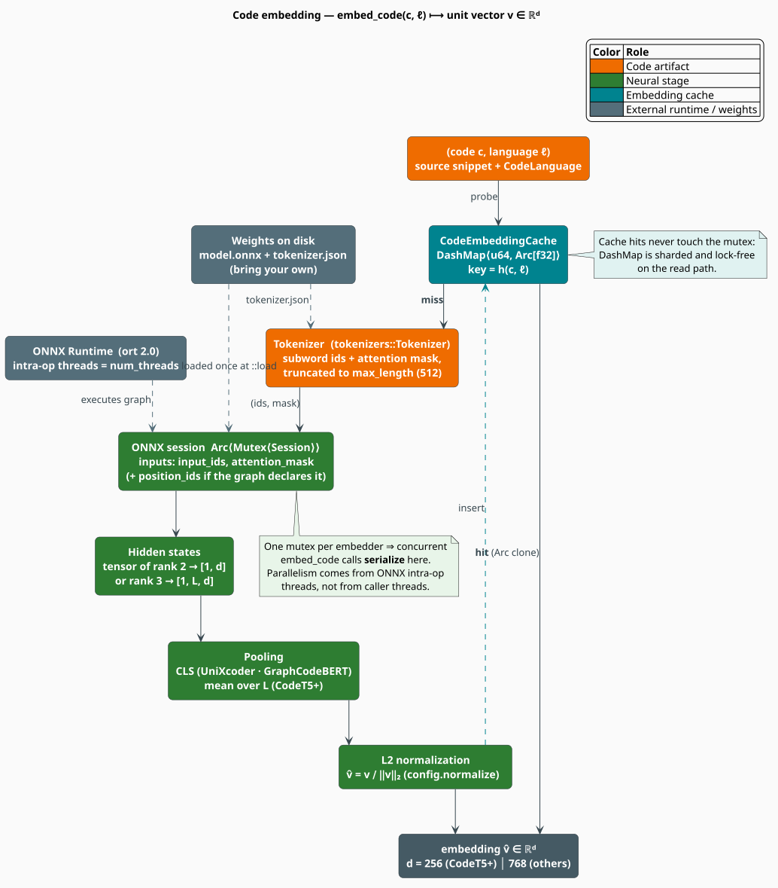
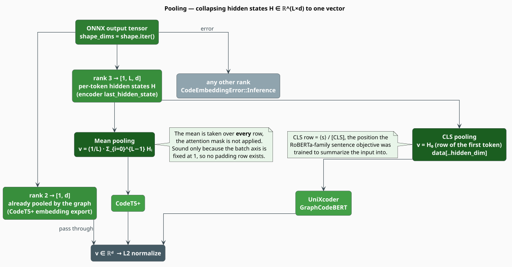
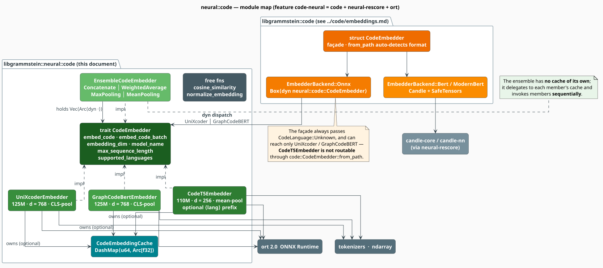

# Neural Code Embeddings

A **code embedding** is a dense vector that stands in for a source-code snippet, positioned so
that *semantically* similar code lands at nearby points — even when the two snippets share no
identifiers and no surface syntax. libgrammstein ships three pre-trained transformer encoders
behind a single trait, an ensemble that fuses them, and a concurrent cache that makes repeated
lookups free. This document explains *what* the vectors mean, *how* the shipped pipeline
produces them, and — candidly — *which parts of the literature the code does not yet implement*.

> **Scope.** Source of truth: [`src/neural/code/mod.rs`](../../../src/neural/code/mod.rs).
> Everything here is gated on the `code-neural` feature. Per-model documents:
> [CodeT5+](codet5.md), [UniXcoder](unixcoder.md), [GraphCodeBERT](graphcodebert.md);
> see also [Ensemble](ensemble.md) and [Caching](caching.md).
>
> **Bring your own weights.** libgrammstein contains no model downloader. Every embedder is
> constructed from a directory you supply that already holds a `model.onnx` graph and a
> `tokenizer.json`.

## Notation

Every symbol is defined before it is used in a formula.

| Symbol | Meaning |
|---|---|
| $`c`$ | a source-code snippet — a finite string, $`c \in \Sigma^{*}`$ |
| $`\Sigma^{*}`$ | the set of finite strings over the source character set |
| $`\ell`$ | a language tag, $`\ell \in \mathcal{L}`$ (the `CodeLanguage` enum) |
| $`\mathcal{L}`$ | the finite set of language tags recognized by the crate |
| $`f_{\theta}`$ | a pre-trained encoder with frozen parameters $`\theta`$ |
| $`d`$ | the embedding dimension (`embedding_dim`) |
| $`L`$ | the token-sequence length after tokenization and truncation |
| $`H`$ | the per-token hidden states, $`H \in \mathbb{R}^{L \times d}`$ |
| $`H_i`$ | row $`i`$ of $`H`$ — the hidden state of the $`i`$-th token |
| $`v`$ | the pooled vector, $`v \in \mathbb{R}^{d}`$ |
| $`\hat{v}`$ | the $`L^2`$-normalized pooled vector |
| $`\lVert x \rVert_2`$ | the Euclidean norm, $`\sqrt{\sum_k x_k^2}`$ |
| $`\cos(a, b)`$ | cosine similarity between vectors $`a`$ and $`b`$ |
| $`\langle a, b \rangle`$ | the Euclidean inner product, $`\sum_k a_k b_k`$ |

**Acronyms.** *ONNX* — Open Neural Network Exchange (the portable graph format executed here by
ONNX Runtime); *CLS* — the leading classification token of a BERT-family input (spelled `<s>` in
RoBERTa tokenizers); *AST* — Abstract Syntax Tree; *DFG* — Data-Flow Graph; *MLM* — Masked
Language Modeling; *OOD* — out-of-distribution.

## The problem: code is not prose, and it is not its own spelling

Two functions can be behaviourally identical and lexically disjoint:

```python
def add(a, b): return a + b        # snippet A
def total(x, y): return y + x      # snippet B
```

Every identifier differs, and the operands are swapped. Exact matching scores these at zero
similarity; edit distance scores them as far apart; even a bag-of-tokens model sees only the
shared `def`, `return`, and `+`. The information that actually matters — *both compute a binary
sum* — lives in the **structure** and in the **distributional habits** of real code, not in the
characters.

A neural encoder is trained on millions of functions so that its output vector captures that
latent structure. The working hypothesis of the entire module is:

> **Embedding hypothesis.** There exists a map $`f_{\theta}`$ from code to $`\mathbb{R}^{d}`$
> under which geometric proximity approximates semantic relatedness. Retrieval, clone detection,
> and re-ranking then reduce to nearest-neighbour search in $`\mathbb{R}^{d}`$.

This complements — rather than replaces — the crate's symbolic machinery. Where
[the code module](../code/overview.md) reasons over parse trees and data-flow edges *exactly*,
the encoders here generalize *approximately*, and the two are strongest in each other's blind
spots.

## Theory

### The embedding map

An embedder is a deterministic map from a (snippet, language) pair to a fixed-width vector:

```math
\begin{array}{lr}
\displaystyle f_{\theta} : \Sigma^{*} \times \mathcal{L} \longrightarrow \mathbb{R}^{d},
\qquad
v = f_{\theta}(c, \ell) & \text{(CE1)}
\end{array}
```

$`\theta`$ is frozen: nothing in this module trains or fine-tunes. The map factors into four
stages — tokenize, encode, pool, normalize — which the next sections take in turn.



*Figure 1 — `embed_code` end to end. A cache hit short-circuits everything to the right of the
cache; a miss pays the full transformer forward pass.*

### Normalization, and why cosine is the only metric you need

Every shipped embedder sets `normalize: true` by default, projecting the pooled vector onto the
unit sphere (`normalize_embedding`, which is a no-op when $`\lVert v \rVert_2 = 0`$):

```math
\begin{array}{lr}
\displaystyle \hat{v} \;=\; \frac{v}{\lVert v \rVert_2}
\qquad\text{so that}\qquad
\lVert \hat{v} \rVert_2 = 1 & \text{(CE2)}
\end{array}
```

Similarity is then measured by the **cosine** — the inner product of the two directions, which
discards magnitude and keeps only orientation (`cosine_similarity`):

```math
\begin{array}{lr}
\displaystyle \cos(a, b) \;=\; \frac{\langle a, b \rangle}{\lVert a \rVert_2 \, \lVert b \rVert_2}
\;\in\; [-1, 1] & \text{(CE3)}
\end{array}
```

The shipped function returns $`0`$ when either argument has zero norm, so it is total. Note the
range: $`[-1, 1]`$, **not** $`[0, 1]`$ — orthogonal snippets score $`0`$ and antipodal ones
score $`-1`$.

Normalizing first is not merely cosmetic. For unit vectors the cosine and the Euclidean distance
are **order-equivalent**, because

```math
\begin{array}{lr}
\displaystyle \lVert \hat{a} - \hat{b} \rVert_2^{2}
= \langle \hat{a} - \hat{b},\, \hat{a} - \hat{b} \rangle
= \lVert \hat{a} \rVert_2^{2} + \lVert \hat{b} \rVert_2^{2} - 2\,\langle \hat{a}, \hat{b} \rangle
= 2 \bigl(1 - \cos(\hat{a}, \hat{b})\bigr) & \text{(CE4)}
\end{array}
```

Since $`t \mapsto 2(1 - t)`$ is strictly decreasing, ranking by descending cosine and ranking by
ascending $`L^2`$ distance produce **exactly the same order**. That is what licenses handing
these vectors to any Euclidean index (a flat scan, an HNSW graph, or the crate's
[RAG index](../rag/overview.md)) and still getting cosine semantics back.

### Pooling: from a token matrix to one vector

A transformer encoder emits one hidden state *per token*: a matrix $`H \in \mathbb{R}^{L \times d}`$.
Collapsing it to a single vector is the **pooling** step, and the three shipped models do not
agree on how.

**CLS pooling** takes the row belonging to the leading classification token — the position that
BERT-family sentence objectives train to summarize the whole input [[8]](#references):

```math
\begin{array}{lr}
\displaystyle v^{\mathrm{CLS}} \;=\; H_0 & \text{(CE5)}
\end{array}
```

**Mean pooling** averages every row, which is more robust when the model was never given a
sentence-level objective [[7]](#references):

```math
\begin{array}{lr}
\displaystyle v^{\mathrm{mean}} \;=\; \frac{1}{L} \sum_{i=0}^{L-1} H_i & \text{(CE6)}
\end{array}
```

| Model | Pooling in libgrammstein | Where |
|---|---|---|
| CodeT5+ | mean over the sequence axis, $`(\mathrm{CE6})`$ | [`codet5.rs`](../../../src/neural/code/codet5.rs) |
| UniXcoder | CLS, $`(\mathrm{CE5})`$ | [`unixcoder.rs`](../../../src/neural/code/unixcoder.rs) |
| GraphCodeBERT | CLS, $`(\mathrm{CE5})`$ | [`graphcodebert.rs`](../../../src/neural/code/graphcodebert.rs) |

All three first branch on the **rank** of the ONNX output tensor: a rank-2 result (shape
$`[1, d]`$) is already pooled by the exported graph and is passed through untouched; a rank-3
result (shape $`[1, L, d]`$) is pooled by $`(\mathrm{CE5})`$ or $`(\mathrm{CE6})`$; any other
rank raises `CodeEmbeddingError::Inference`.



*Figure 2 — rank dispatch and the two pooling rules.*

> **Honest note on the mean.** $`(\mathrm{CE6})`$ divides by $`L`$ and sums over *every* row —
> it never consults `attention_mask`. That is sound **only** because the batch axis is pinned to
> $`1`$, so a single sequence is submitted and no padding row exists. Should batched inference
> ever be wired up (see [Limits](#honest-limits)), this sum must become the mask-weighted mean
> $`\bigl(\sum_i m_i H_i\bigr) / \sum_i m_i`$, or padding will drag every vector toward the pad
> embedding.

## The three encoders

| Model | Params | $`d`$ | Max $`L`$ | Pooling | Trained languages | Document |
|---|---|---|---|---|---|---|
| **CodeT5+** (Salesforce) | 110M | 256 | 512 | mean | 9: Python, Java, JavaScript, Go, Ruby, PHP, C, C++, C# | [codet5.md](codet5.md) |
| **UniXcoder** (Microsoft) | 125M | 768 | 512 | CLS | 6: Python, Java, JavaScript, Go, Ruby, PHP | [unixcoder.md](unixcoder.md) |
| **GraphCodeBERT** (Microsoft) | 125M | 768 | 512 | CLS | 6: Python, Java, JavaScript, Go, Ruby, PHP | [graphcodebert.md](graphcodebert.md) |

The parameter counts and dimensions are those of the reference checkpoints named in each
module's documentation (`Salesforce/codet5p-110m-embedding`, `microsoft/unixcoder-base`,
`microsoft/graphcodebert-base`); the "trained languages" column is exactly what each
`supported_languages()` returns. The 6-language sets are the
[CodeSearchNet](#references) corpus [[6]](#references); CodeT5+ adds C, C++, and C#.

Their inductive biases differ, which is the whole reason an [ensemble](ensemble.md) is worth
building: CodeT5+ is an encoder-decoder trained with a contrastive embedding objective;
UniXcoder is a prefix-controlled unified model that saw flattened ASTs and comments in
pre-training; GraphCodeBERT is the only one pre-trained against explicit **data-flow** structure.

## The contract: the `CodeEmbedder` trait

Every encoder — and the ensemble itself — implements one trait. It is `Send + Sync`, so a single
embedder may be shared across threads behind an `Arc`.

```rust
pub trait CodeEmbedder: Send + Sync {
    /// Embed a single code snippet.
    fn embed_code(&self, code: &str, language: CodeLanguage) -> Result<Vec<f32>>;

    /// Embed multiple code snippets in a batch.
    fn embed_code_batch(&self, codes: &[&str], languages: &[CodeLanguage])
        -> Result<Vec<Vec<f32>>>;

    fn embedding_dim(&self) -> usize;
    fn model_name(&self) -> &str;
    fn max_sequence_length(&self) -> usize;
    fn supported_languages(&self) -> &[CodeLanguage];

    /// An empty `supported_languages()` means "all languages".
    fn supports_language(&self, language: CodeLanguage) -> bool {
        let supported = self.supported_languages();
        supported.is_empty() || supported.contains(&language)
    }
}
```

`Result<T>` is the module-local `std::result::Result<T, CodeEmbeddingError>`, whose variants are
`ModelLoad`, `Tokenization`, `Inference`, `Onnx`, `UnsupportedLanguage`, and `Io`. `From` impls
lift `ort::Error` into `Onnx` and `tokenizers::Error` into `Tokenization`.

Three free functions round out the surface:

```rust
pub fn cosine_similarity(a: &[f32], b: &[f32]) -> f32;   // (CE3); 0.0 if either norm is 0
pub fn normalize_embedding(embedding: &mut [f32]);       // (CE2), in place
pub fn normalize_embedding_clone(embedding: &[f32]) -> Vec<f32>;
```

> **Two different things are named `CodeEmbedder`.** The **trait** above lives in
> `libgrammstein::neural::code`. A **struct** of the same name lives in `libgrammstein::code`
> ([`src/code/embeddings.rs`](../../../src/code/embeddings.rs), documented in
> [code/embeddings.md](../code/embeddings.md)); it is a higher-level façade whose `from_path`
> sniffs a directory and loads either a Candle/SafeTensors model **or** — via its
> `EmbedderBackend::Onnx(Box<dyn neural::code::CodeEmbedder>)` variant — one of the ONNX
> embedders documented here. Import them under distinct paths, and note two consequences of the
> bridge: the façade always passes `CodeLanguage::Unknown`, and it can reach only
> `UniXcoderEmbedder` and `GraphCodeBertEmbedder` — **`CodeT5Embedder` is not routable through
> it**.

## `CodeLanguage`

The tag is a plain `Copy + Hash` enum with 20 named variants plus `Unknown`: Python, Java,
JavaScript, TypeScript, Go, Ruby, PHP, C, C++, C#, Rust, Kotlin, Scala, Swift, Haskell, OCaml,
Elixir, Bash, **Rholang**, and **MeTTa** (the two F1R3FLY.io languages).

```rust
CodeLanguage::from_extension("rs")     // -> CodeLanguage::Rust
CodeLanguage::from_extension("rho")    // -> CodeLanguage::Rholang
CodeLanguage::from_extension("metta")  // -> CodeLanguage::MeTTa
CodeLanguage::from_extension("xyz")    // -> CodeLanguage::Unknown

CodeLanguage::Rust.name()              // -> "rust"
CodeLanguage::Rust.prefix()            // -> "<rust>"   (Unknown yields "")
```

The tag has **three distinct jobs**, and it is worth being precise about which apply where:

1. **Cache-key discriminant** — always. $`h(c, \ell)`$ mixes the tag in, so the same bytes
   embedded as two languages occupy two cache slots (see [Caching](caching.md)).
2. **Tokenizer prefix** — for `CodeT5Embedder` only, and only when
   `CodeT5Config::use_language_prefix` is set (it defaults to `false`). `UniXcoderEmbedder` and
   `GraphCodeBertEmbedder` tokenize the raw snippet and never consult $`\ell`$ at all.
3. **Advertised support** — `supported_languages()`. This is *advisory*: nothing in the crate
   calls `supports_language`, and no embedder ever returns `UnsupportedLanguage`. Embedding Rust,
   Rholang, or MeTTa therefore **succeeds**, but the weights never saw those languages, so treat
   the result as out-of-distribution and validate before trusting it.

## Embedding, literately

The following mirrors the `CodeEmbedder for …` impls in
[`codet5.rs`](../../../src/neural/code/codet5.rs),
[`unixcoder.rs`](../../../src/neural/code/unixcoder.rs), and
[`graphcodebert.rs`](../../../src/neural/code/graphcodebert.rs), which differ only in the two
refinements marked ✱. `⟨…⟩` names a refinement expanded below.

```
function embed_code(c, l):                            ▸ the whole public surface, per model
    if cache is enabled and cache.get(c, l) = Some(v):
        return v.to_vec()                             ▸ hit: an Arc clone, then a copy out
    (ids, mask) <- ⟨Tokenize ✱⟩
    v <- ⟨Run the ONNX graph⟩
    if config.normalize:
        normalize_embedding(v)                        ▸ (CE2), in place
    if cache is enabled:
        cache.insert(c, l, clone of v)
    return v

⟨Tokenize ✱⟩ ≡                                        ▸ CodeT5+ only:
    input <- (prefix(l) ++ " " ++ c)  if use_language_prefix and l != Unknown  else  c
    enc   <- tokenizer.encode(input, add_special_tokens = true)
    ids   <- enc.ids[0 .. min(len, max_length)]       ▸ hard truncation, not a sliding window
    mask  <- enc.attention_mask[0 .. min(len, max_length)]
                                                      ▸ UniXcoder / GraphCodeBERT: identical,
                                                      ▸ but with input <- c  (l is never read)

⟨Run the ONNX graph⟩ ≡
    inputs <- { input_ids: [1, L] as i64, attention_mask: [1, L] as i64 }
    if has_position_ids:                              ▸ GraphCodeBERT only; probed at load time
        inputs += { position_ids: [0, 1, …, L-1] }
    session <- self.session.lock()                    ▸ ⚠ the ONE lock; see Engineering
    out     <- session.run(inputs)[output_name]
    (shape, data) <- out.try_extract_tensor::<f32>()
    return ⟨Pool by rank ✱⟩

⟨Pool by rank ✱⟩ ≡
    match rank(shape):
        2 -> data                                     ▸ [1, d]: graph already pooled
        3 -> H0            if CLS-pooling             ▸ (CE5) — UniXcoder, GraphCodeBERT
             mean_i(H_i)   if mean-pooling            ▸ (CE6) — CodeT5+
        _ -> Err(Inference("Unexpected output shape"))
```

## Engineering

### The module map, and where ONNX ends



*Figure 3 — the trait, its three implementors, the ensemble, the cache, and the `code::CodeEmbedder`
façade that wraps them.*

**These three embedders are ONNX-only.** They are built on `ort` 2.0.0-rc.10 (ONNX Runtime),
`tokenizers`, and `ndarray`; not one line of them touches Candle. Candle *does* enter the
dependency graph — `code-neural` implies `neural-rescore`, which pulls in `candle-core`,
`candle-nn`, and `candle-transformers` — but those crates are used by
[the neural rescorer](../neural/overview.md) and by the `code::CodeEmbedder` façade's SafeTensors
backends, never by `neural::code`. If you have only a `.safetensors` checkpoint, you must either
export it to ONNX or load it through the façade.

### The single session mutex

Each embedder owns `Arc<Mutex<Session>>` (a `parking_lot::Mutex`), and every inference takes that
lock:

```rust
let mut session = self.session.lock();
let outputs = session.run(inputs)?;
```

The consequences are worth stating plainly, because they invert the usual intuition about a
`Send + Sync` type:

- **Caller threads do not parallelize inference.** $`k`$ threads calling `embed_code` on the same
  embedder queue up on one mutex. Throughput is set by ONNX Runtime's *intra-op* thread pool
  (`num_threads`, default `4`), configured once at load.
- **Cache hits never touch the mutex.** The cache is a sharded `DashMap`, so a hot workload
  scales cleanly across threads even though the miss path is serialized.
- To get inference-level parallelism, **load one embedder per worker** (each owns its own
  `Session`), and accept the proportional increase in resident memory.
- Each embedder additionally carries a hand-written `unsafe impl Send`/`unsafe impl Sync`. The
  invariant that makes them sound is exactly the one above: all `Session` access is funnelled
  through the mutex.

### Feature gates

```toml
# Cargo.toml — code-neural = ["code", "neural-rescore", "dep:ort"]
[dependencies]
libgrammstein = { version = "0.1", features = ["code-neural"] }
```

`code-neural` is the *only* gate for this module; there is no per-model feature. Enabling it also
compiles the symbolic [`code`](../code/overview.md) module and the
[`neural`](../neural/overview.md) rescorer. `code-full` additionally turns on the mainstream and
DSL tree-sitter grammars (`code-full = ["code-neural", "code-mainstream", "code-dsl"]`). Running
ONNX Runtime also requires the ONNX Runtime shared library to be discoverable at build/run time,
per `ort`'s own setup.

### Cost model

A forward pass through an $`n`$-layer transformer over $`L`$ tokens of width $`d`$ costs

```math
\begin{array}{lr}
\displaystyle \Theta\bigl(n \cdot (L^{2} d + L d^{2})\bigr) & \text{(CE7)}
\end{array}
```

— the $`L^{2}d`$ term is self-attention, the $`Ld^{2}`$ term the feed-forward blocks. Two
practical readings follow. First, cost is **quadratic in snippet length**, so truncating at
`max_length` is a hard performance cliff, not a formality: halving $`L`$ more than halves the
work. Second, $`d`$ and $`n`$ are fixed by the checkpoint, so the only knobs you own are $`L`$,
the intra-op thread count, and the [cache](caching.md) — which removes the cost entirely on a
repeat.

> **No benchmark numbers are published here.** The repository ships no benchmark, example, or
> integration test that performs real ONNX inference (the 16 unit tests in `src/neural/code/`
> cover configuration, pooling arithmetic, cosine, and the cache). Any throughput or
> memory-footprint figure would therefore be invented rather than measured, so this document
> states none. Measure on your own hardware and checkpoint with the crate's
> benchmarking conventions before you size a deployment.

## Honest limits

The module is production-shaped but not production-complete. In full:

| Limitation | Detail |
|---|---|
| **Batching is sequential** | `embed_code_batch` is a `map` over `embed_code`. It is an ergonomic wrapper, **not** a batched forward pass: the batch axis is pinned to $`1`$ and each snippet takes the session mutex in turn. The source says so (*"process sequentially… true batching complex"*). Expect no speed-up over a loop. |
| **`supports_language` is inert** | Nothing calls it, and `CodeEmbeddingError::UnsupportedLanguage` is never constructed. Unsupported input embeds silently. |
| **Rust / Rholang / MeTTa are OOD** | They are `CodeLanguage` variants and have `prefix()` tokens, but no shipped checkpoint was trained on them. |
| **CodeT5+ dimension is not auto-detected** | `ort` 2.0 exposes no output-shape inspection, so `embedding_dim` falls back to `config.embedding_dim` (or `256`). Set it explicitly for a non-default checkpoint. |
| **GraphCodeBERT's data flow is not wired** | `use_data_flow` exists, defaults to `false`, and is **never read**. See [graphcodebert.md](graphcodebert.md). |
| **UniXcoder's mode prefix is not emitted** | The shipped tokenizer call passes raw code. See [unixcoder.md](unixcoder.md). |
| **Cache eviction is not LRU** | An arbitrary entry is dropped at capacity, and the capacity check is racy. See [caching.md](caching.md). |
| **`normalize_embedding_clone` is unused internally** | It is a public convenience with no in-crate caller. |

## Usage

### One model, one snippet

```rust
use libgrammstein::neural::code::{CodeEmbedder, CodeLanguage, CodeT5Config, CodeT5Embedder};

// A directory holding `model.onnx` + `tokenizer.json` that you exported yourself.
let config = CodeT5Config::codet5p_110m_embedding("/models/codet5p-110m-embedding");
let embedder = CodeT5Embedder::load(config)?;

let code = "fn calculate_sum(items: &[i32]) -> i32 { items.iter().sum() }";
let embedding = embedder.embed_code(code, CodeLanguage::Rust)?;

assert_eq!(embedding.len(), embedder.embedding_dim()); // 256
# Ok::<(), libgrammstein::neural::code::CodeEmbeddingError>(())
```

`CodeT5Embedder::from_directory(dir)` is the same call with the default config.

### Similarity, and a nearest-neighbour scan

```rust
use libgrammstein::neural::code::{cosine_similarity, CodeEmbedder, CodeLanguage};

let a = embedder.embed_code("def add(a, b): return a + b", CodeLanguage::Python)?;
let b = embedder.embed_code("def total(x, y): return y + x", CodeLanguage::Python)?;

// (CE3). Both vectors are already unit-norm, so this is a plain dot product.
let similarity = cosine_similarity(&a, &b);
println!("cos = {similarity:.3}"); // in [-1, 1]
# Ok::<(), libgrammstein::neural::code::CodeEmbeddingError>(())
```

Because of $`(\mathrm{CE4})`$, a top-$`k`$ scan by descending cosine is identical to a top-$`k`$
scan by ascending Euclidean distance:

```rust
use libgrammstein::neural::code::{cosine_similarity, CodeEmbedder, CodeLanguage};

/// Rank an in-memory corpus against a query snippet. `index` holds (id, unit vector) pairs.
fn top_k<'a>(
    embedder: &dyn CodeEmbedder,
    index: &'a [(String, Vec<f32>)],
    query: &str,
    language: CodeLanguage,
    k: usize,
) -> Result<Vec<(&'a str, f32)>, libgrammstein::neural::code::CodeEmbeddingError> {
    let q = embedder.embed_code(query, language)?;

    let mut scored: Vec<(&str, f32)> = index
        .iter()
        .map(|(id, v)| (id.as_str(), cosine_similarity(&q, v)))
        .collect();

    // Descending cosine; `total_cmp` is total, so no unwrap on NaN is needed.
    scored.sort_by(|a, b| b.1.total_cmp(&a.1));
    scored.truncate(k);
    Ok(scored)
}
```

For corpora too large to scan, hand the same vectors to the
[RAG index](../rag/overview.md) — $`(\mathrm{CE4})`$ guarantees the ordering survives.

## References

1. Y. Wang, H. Le, A. D. Gotmare, N. D. Q. Bui, J. Li & S. C. H. Hoi (2023). *CodeT5+: Open Code
   Large Language Models for Code Understanding and Generation.* EMNLP 2023. arXiv:2305.07922.
   [doi:10.48550/arXiv.2305.07922](https://doi.org/10.48550/arXiv.2305.07922)
2. D. Guo, S. Lu, N. Duan, Y. Wang, M. Zhou & J. Yin (2022). *UniXcoder: Unified Cross-Modal
   Pre-training for Code Representation.* ACL 2022. arXiv:2203.03850.
   [doi:10.48550/arXiv.2203.03850](https://doi.org/10.48550/arXiv.2203.03850)
3. D. Guo, S. Ren, S. Lu, Z. Feng, D. Tang, S. Liu, L. Zhou, N. Duan, A. Svyatkovskiy, S. Fu,
   M. Tufano, S. K. Deng, C. Clement, D. Drain, N. Sundaresan, J. Yin, D. Jiang & M. Zhou (2021).
   *GraphCodeBERT: Pre-training Code Representations with Data Flow.* ICLR 2021. arXiv:2009.08366.
   [doi:10.48550/arXiv.2009.08366](https://doi.org/10.48550/arXiv.2009.08366)
4. Z. Feng, D. Guo, D. Tang, N. Duan, X. Feng, M. Gong, L. Shou, B. Qin, T. Liu, D. Jiang &
   M. Zhou (2020). *CodeBERT: A Pre-Trained Model for Programming and Natural Languages.*
   Findings of EMNLP 2020. arXiv:2002.08155.
   [doi:10.48550/arXiv.2002.08155](https://doi.org/10.48550/arXiv.2002.08155)
5. A. Vaswani, N. Shazeer, N. Parmar, J. Uszkoreit, L. Jones, A. N. Gomez, Ł. Kaiser &
   I. Polosukhin (2017). *Attention Is All You Need.* NeurIPS 2017. arXiv:1706.03762.
   [doi:10.48550/arXiv.1706.03762](https://doi.org/10.48550/arXiv.1706.03762)
6. H. Husain, H.-H. Wu, T. Gazit, M. Allamanis & M. Brockschmidt (2019). *CodeSearchNet
   Challenge: Evaluating the State of Semantic Code Search.* arXiv:1909.09436.
   [doi:10.48550/arXiv.1909.09436](https://doi.org/10.48550/arXiv.1909.09436)
7. N. Reimers & I. Gurevych (2019). *Sentence-BERT: Sentence Embeddings using Siamese
   BERT-Networks.* EMNLP-IJCNLP 2019. arXiv:1908.10084.
   [doi:10.48550/arXiv.1908.10084](https://doi.org/10.48550/arXiv.1908.10084)
8. J. Devlin, M.-W. Chang, K. Lee & K. Toutanova (2019). *BERT: Pre-training of Deep
   Bidirectional Transformers for Language Understanding.* NAACL-HLT 2019. arXiv:1810.04805.
   [doi:10.48550/arXiv.1810.04805](https://doi.org/10.48550/arXiv.1810.04805)

## See also

- [CodeT5+](codet5.md) · [UniXcoder](unixcoder.md) · [GraphCodeBERT](graphcodebert.md) — the
  three encoders in depth
- [Ensemble](ensemble.md) — fusing them, and why concatenation is a mean of cosines
- [Caching](caching.md) — the key, the eviction policy, and the hit-rate model
- [Code module overview](../code/overview.md) — the symbolic half: AST, CPG, PCFG, correction
- [code/embeddings.md](../code/embeddings.md) — the `code::CodeEmbedder` façade that wraps these
- [Neural overview](../neural/overview.md) — ModernBERT rescoring, the Candle half of the crate
- [RAG overview](../rag/overview.md) — retrieval over the vectors produced here
