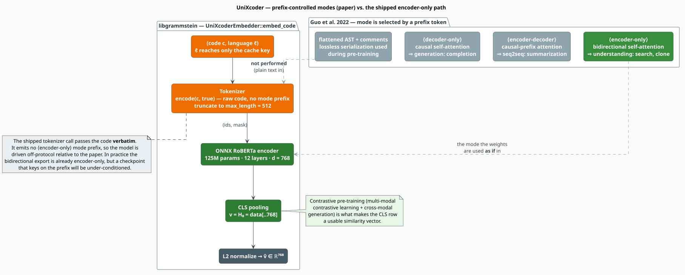

# UniXcoder

**UniXcoder** is Microsoft's *unified cross-modal* pre-trained model for code [[1]](#references).
Its distinguishing idea is that one set of weights can behave as an encoder, a decoder, or an
encoder-decoder, because the behaviour is selected at inference time by a **prefix token** that
swaps the self-attention mask. libgrammstein uses it in the encoder role, for code-to-code
similarity and code search.

This document explains the mask-switching mechanism, states precisely what
`UniXcoderEmbedder` feeds the graph, and — because the two differ — documents **two deviations
from the reference protocol** that you must account for before trusting the vectors.

> **Scope.** Source of truth:
> [`src/neural/code/unixcoder.rs`](../../../src/neural/code/unixcoder.rs). Feature gate
> `code-neural`. The trait, the notation, and the pooling rules come from the
> [Code Embeddings Overview](overview.md). Bring your own weights: `UniXcoderEmbedder` reads a
> directory holding `model.onnx` and `tokenizer.json`, exported from `microsoft/unixcoder-base`
> or a compatible checkpoint.

## Notation

In addition to the [overview's notation](overview.md#notation):

| Symbol | Meaning |
|---|---|
| $`Q, K, V`$ | the query, key, and value matrices of a self-attention head |
| $`d_k`$ | the per-head key dimension |
| $`M`$ | the additive attention mask, $`M \in \{0, -\infty\}^{L \times L}`$ |
| $`M_{ij}`$ | the mask entry governing whether token $`i`$ may attend to token $`j`$ |
| $`m_i`$ | the attention-mask **bit** of token $`i`$: $`1`$ for a real token, $`0`$ for padding |
| $`H_i`$ | the hidden state of token $`i`$ (row $`i`$ of $`H`$) |

## Theory: one model, three behaviours

### Attention with an additive mask

A self-attention head computes, for a length-$`L`$ sequence,

```math
\mathrm{Attn}(Q, K, V) \;=\; \mathrm{softmax}\!\left(\frac{Q K^{\top}}{\sqrt{d_k}} + M\right) V
\tag{U1}
```

The mask $`M`$ is *additive* and takes only two values. Adding $`0`$ leaves a logit untouched;
adding $`-\infty`$ drives $`\exp(\cdot) \to 0`$, so the softmax assigns that pair exactly zero
weight. $`M`$ is therefore a hard, differentiable-free switch on *who may see whom*
[[3]](#references).

### The three modes are three masks

UniXcoder's insight is that the *architecture* need not change to change the behaviour — only
$`M`$ must [[1]](#references):

```math
M_{ij} \;=\;
\begin{cases}
0 & \text{always} & \text{(encoder-only: full bidirectional attention)} \\[4pt]
0 \ \text{if}\ j \leq i,\ \ -\infty \ \text{otherwise} & & \text{(decoder-only: causal)} \\[4pt]
0 \ \text{if}\ j \leq i \ \text{or}\ j \in \mathrm{prefix},\ \ -\infty \ \text{otherwise} & & \text{(encoder-decoder: causal-prefix)}
\end{cases} \tag{U2}
```

Which row of $`(\mathrm{U2})`$ applies is chosen by a **mode token** prepended to the input:
`<encoder-only>`, `<decoder-only>`, or `<encoder-decoder>`. Understanding tasks — code search,
clone detection, the embeddings we want — use the first.

Two further ingredients give UniXcoder its edge on code:

- **Flattened AST + comments.** Pre-training does not see raw token streams alone. UniXcoder
  serializes the abstract syntax tree into a sequence *losslessly* (the tree can be recovered from
  the flattening) and mixes in docstrings, so structure and intent are both in-distribution.
- **Multi-modal contrastive learning + cross-modal generation.** These are what actually shape the
  vector space, exactly as for [CodeT5+](codet5.md#why-the-vectors-are-comparable-the-contrastive-objective):
  they pull semantically-paired fragments together and push everything else apart, in cosine.



*Figure 1 — the paper's prefix-selected modes (top) versus what `UniXcoderEmbedder` actually
submits (bottom). Muted nodes are described by the paper but not emitted by libgrammstein.*

## The shipped path

### Configuration

| Field | Type | Default | Meaning |
|---|---|---|---|
| `model_path` | `String` | `""` | path to `model.onnx` |
| `tokenizer_path` | `String` | `""` | path to `tokenizer.json` |
| `max_length` | `usize` | `512` | hard truncation length, in tokens |
| `num_threads` | `usize` | `4` | ONNX Runtime **intra-op** threads |
| `optimization_level` | `u8` | `3` | $`0 \mapsto`$ `Disable`, $`1`$, $`2`$, else `Level3` |
| `cache_config` | `Option<CodeEmbeddingCacheConfig>` | `Some(default)` | `None` disables caching |
| `normalize` | `bool` | `true` | apply $`(\mathrm{CE2})`$ |
| `embedding_dim` | `usize` | `768` | a plain `usize`, **not** an `Option` |

Note the contrast with [`CodeT5Config`](codet5.md#configuration): there is **no**
`use_language_prefix` field here, because UniXcoder's tokenizer path never sees the language at
all. And `embedding_dim` is unconditional — there is no `unwrap_or` fallback to disagree with.

```rust
use libgrammstein::neural::code::{UniXcoderConfig, UniXcoderEmbedder};

// <dir>/model.onnx + <dir>/tokenizer.json, embedding_dim = 768.
let config = UniXcoderConfig::unixcoder_base("/models/unixcoder-base");
let embedder = UniXcoderEmbedder::load(config)?;
// Equivalently: UniXcoderEmbedder::from_directory("/models/unixcoder-base")?
# Ok::<(), libgrammstein::neural::code::CodeEmbeddingError>(())
```

### What actually reaches the graph

```
function embed_code(c, l):                          ▸ UniXcoderEmbedder
    if cache and cache.get(c, l) = Some(v): return v.to_vec()
    (ids, mask) <- tokenize(c)                      ▸ NOTE: l is NOT passed to tokenize
    v <- run_inference(ids, mask)
    if config.normalize: normalize_embedding(v)     ▸ (CE2)
    if cache: cache.insert(c, l, clone of v)        ▸ l reappears here — cache key only
    return v

function tokenize(c):                               ▸ the whole function; no prefix, no language
    enc <- tokenizer.encode(c, add_special_tokens = true)
    L   <- min(len(enc.ids), max_length)
    return (enc.ids[0..L] as i64, enc.attention_mask[0..L] as i64)

function run_inference(ids, mask):
    session <- self.session.lock()                  ▸ the single serialization point
    out     <- session.run({input_ids: [1, L], attention_mask: [1, L]})
    (shape, data) <- out[output_name].try_extract_tensor::<f32>()
    match rank(shape):
        2 -> return data                            ▸ [1, d] — already pooled by the graph
        3 -> return data[0 .. shape[2]]             ▸ CLS row H_0 — see (U4)
        _ -> return Err(Inference("Unexpected output shape"))
```

The language tag $`\ell`$ is threaded through `embed_code` **only** to reach the
[cache key](caching.md). It never influences tokenization, inference, or the vector. Embedding the
same bytes as `Python` and as `Rust` yields two cache entries holding two *identical* vectors.

## Deviations from the reference protocol

The shipped embedder differs from UniXcoder's own reference implementation
([`microsoft/CodeBERT`, `UniXcoder/unixcoder.py`](https://github.com/microsoft/CodeBERT/blob/master/UniXcoder/unixcoder.py))
in two concrete ways. Neither is fatal, both are worth knowing, and both are cheap to correct in
your own fork.

### 1. The mode prefix is not emitted

The reference `tokenize` builds its input as

```
[CLS] <encoder-only> [SEP]  ⟨code tokens⟩  [SEP]
```

`UniXcoderEmbedder::tokenize` calls `tokenizer.encode(code, true)` and submits the result
verbatim, so the `<encoder-only>` token is **absent**. In practice a stock HF export of
`microsoft/unixcoder-base` is an ordinary bidirectional RoBERTa encoder — the encoder-only mask of
$`(\mathrm{U2})`$ is already baked into the graph — so the model is *behaving* as encoder-only
regardless. The cost is that the model is under-conditioned relative to how it was trained: the
prefix token it learned to key on is missing from every input. Expect similarity scores that are
serviceable but not reproductions of the published numbers.

### 2. CLS pooling, where the reference mean-pools

This is the sharper of the two. The reference computes a **mask-weighted mean** over token
embeddings:

```math
v^{\mathrm{ref}} \;=\; \frac{\sum_{i=0}^{L-1} m_i \, H_i}{\sum_{i=0}^{L-1} m_i} \tag{U3}
```

libgrammstein instead slices the first row of the hidden-state tensor — CLS pooling:

```math
v^{\mathrm{shipped}} \;=\; H_0
\qquad\text{(the Rust is \texttt{data[..hidden_dim]})} \tag{U4}
```

These are different vectors, and $`(\mathrm{U4})`$ is not the representation the sentence-level
objective optimized. Note also the near-miss: because this module pins the batch axis to $`1`$,
**no padding row exists**, so $`m_i = 1`$ for all $`i`$ and $`(\mathrm{U3})`$ collapses exactly
onto the plain mean $`(\mathrm{CE6})`$ — the very pooling that
[CodeT5+ already implements](codet5.md#inference-and-the-rank-dispatch). Aligning with the
reference is therefore a one-branch change (mean the $`L`$ rows instead of taking row $`0`$), not
a redesign.

> **What to do about it today.** Two options, in order of preference.
>
> 1. **Export a pooled graph.** If your ONNX export ends in a pooling node and emits a rank-2
>    $`[1, 768]`$ tensor, the $`r = 2`$ branch passes it straight through and *neither*
>    $`(\mathrm{U3})`$ nor $`(\mathrm{U4})`$ is applied by libgrammstein — the graph's own pooling
>    wins. This is the cleanest fix and requires no change to libgrammstein.
> 2. **Validate before you trust.** If your export emits `last_hidden_state`, run a sanity pair
>    (a known clone and a known non-clone) through `cosine_similarity` and confirm the gap is what
>    you expect. A CLS row from a mean-trained checkpoint can still be discriminative — it is
>    simply not the trained summary.
>
> Either way, be consistent: never mix $`(\mathrm{U3})`$-pooled and $`(\mathrm{U4})`$-pooled
> vectors in one index.

## Engineering

### I/O node-name detection

`load` probes the session for its node names rather than hard-coding them:

| Node | Rule | Fallback |
|---|---|---|
| ids input | the first input whose name contains `input_ids` | `"input_ids"` |
| mask input | the first input whose name contains `attention_mask` | `"attention_mask"` |
| output | the **first** output of the graph | `"last_hidden_state"` |

Unlike [`CodeT5Embedder`](codet5.md#io-node-name-detection), `UniXcoderEmbedder` exposes no
accessor for the resolved names — the `Debug` impl (which prints `model_path`, `embedding_dim`,
`max_length`, and cache occupancy) is your window into a misconfigured load.

Two smaller asymmetries with the CodeT5+ path, both visible in the source:

- The rank-3 branch here does **not** check the batch axis before slicing; it takes
  `data[..hidden_dim]` on the assumption that batch $`= 1`$, which the caller guarantees.
- Supplying no `position_ids` is correct for this embedder — unlike
  [GraphCodeBERT](graphcodebert.md#position_ids-a-caveat-worth-reading), `UniXcoderEmbedder` never
  probes for or supplies that input.

### Thread safety and caching

`Arc<Mutex<Session>>` (`parking_lot`) serializes inference; `unsafe impl Send`/`unsafe impl Sync`
are justified by that discipline. Cache hits bypass the mutex entirely (sharded `DashMap`).
`embed_code_batch` is a sequential `map` over `embed_code`, **not** a batched forward pass. Cache
control is `clear_cache()` and `cache_stats() -> Option<usize>` (occupancy, not hit rate). See
[the overview's engineering section](overview.md#engineering) and [Caching](caching.md).

## Usage

```rust
use libgrammstein::neural::code::{
    cosine_similarity, CodeEmbedder, CodeLanguage, UniXcoderConfig, UniXcoderEmbedder,
};

let embedder = UniXcoderEmbedder::load(UniXcoderConfig {
    num_threads: 8,
    ..UniXcoderConfig::unixcoder_base("/models/unixcoder-base")
})?;

// Clone detection: two implementations of the same idea, no shared identifiers.
let a = embedder.embed_code("def add(a, b): return a + b", CodeLanguage::Python)?;
let b = embedder.embed_code("def total(x, y): return y + x", CodeLanguage::Python)?;
let similarity = cosine_similarity(&a, &b);

assert_eq!(embedder.model_name(), "UniXcoder");
assert_eq!(embedder.embedding_dim(), 768);
assert_eq!(embedder.max_sequence_length(), 512);
println!("cos = {similarity:.3}");
# Ok::<(), libgrammstein::neural::code::CodeEmbeddingError>(())
```

`supported_languages()` returns the six [CodeSearchNet](#references) languages
[[2]](#references) — Python, Java, JavaScript, Go, Ruby, PHP. Nothing enforces that list
(`supports_language` is never called), so the call above with `CodeLanguage::Rust` would succeed
and simply be out-of-distribution.

## When to choose UniXcoder

| Situation | Verdict |
|---|---|
| Code-to-code similarity, clone detection | **UniXcoder** — the task its contrastive objective targets |
| Natural-language query → code search | **UniXcoder** — pre-trained cross-modally against comments |
| You need C, C++, or C# | [CodeT5+](codet5.md) — UniXcoder saw only the six CodeSearchNet languages |
| Structure-sensitive retrieval | [GraphCodeBERT](graphcodebert.md), caveats included |
| Accuracy first | Fuse them: [Ensemble](ensemble.md). Its $`d = 768`$ matches GraphCodeBERT's, so every strategy is available for that pair |

## References

1. D. Guo, S. Lu, N. Duan, Y. Wang, M. Zhou & J. Yin (2022). *UniXcoder: Unified Cross-Modal
   Pre-training for Code Representation.* ACL 2022. arXiv:2203.03850.
   [doi:10.48550/arXiv.2203.03850](https://doi.org/10.48550/arXiv.2203.03850)
2. H. Husain, H.-H. Wu, T. Gazit, M. Allamanis & M. Brockschmidt (2019). *CodeSearchNet
   Challenge: Evaluating the State of Semantic Code Search.* arXiv:1909.09436.
   [doi:10.48550/arXiv.1909.09436](https://doi.org/10.48550/arXiv.1909.09436)
3. A. Vaswani, N. Shazeer, N. Parmar, J. Uszkoreit, L. Jones, A. N. Gomez, Ł. Kaiser &
   I. Polosukhin (2017). *Attention Is All You Need.* NeurIPS 2017. arXiv:1706.03762.
   [doi:10.48550/arXiv.1706.03762](https://doi.org/10.48550/arXiv.1706.03762)
4. Y. Liu, M. Ott, N. Goyal, J. Du, M. Joshi, D. Chen, O. Levy, M. Lewis, L. Zettlemoyer &
   V. Stoyanov (2019). *RoBERTa: A Robustly Optimized BERT Pretraining Approach.* arXiv:1907.11692.
   [doi:10.48550/arXiv.1907.11692](https://doi.org/10.48550/arXiv.1907.11692)
5. N. Reimers & I. Gurevych (2019). *Sentence-BERT: Sentence Embeddings using Siamese
   BERT-Networks.* EMNLP-IJCNLP 2019. arXiv:1908.10084.
   [doi:10.48550/arXiv.1908.10084](https://doi.org/10.48550/arXiv.1908.10084)

## See also

- [Code Embeddings Overview](overview.md) — the trait, the notation, the pooling rules
- [CodeT5+](codet5.md) · [GraphCodeBERT](graphcodebert.md) — the sibling encoders
- [Ensemble](ensemble.md) — pairing UniXcoder with GraphCodeBERT at a matching $`d = 768`$
- [Caching](caching.md) — where the otherwise-unused language tag ends up
