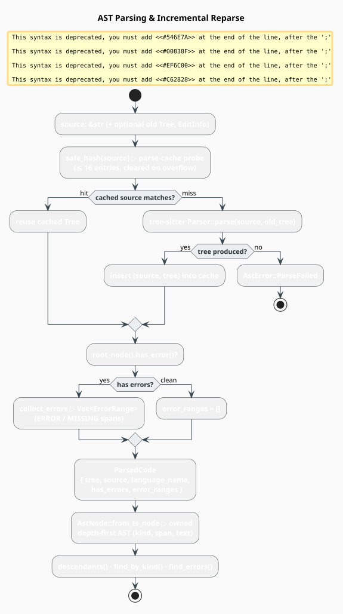

# AST Parsing with tree-sitter

The **AST** (Abstract Syntax Tree) layer wraps [tree-sitter](https://tree-sitter.github.io/) to
turn source text into a parse tree — even when that text is syntactically broken. tree-sitter is
an incremental **GLR** (Generalized LR) parser with *error recovery*: it never fails, always
returning a tree in which the unparseable regions are marked with `ERROR` and `MISSING` nodes.
Those markers are exactly what a code corrector needs to localize a repair.

> **Scope.** Source of truth: [`src/code/ast.rs`](../../../src/code/ast.rs). The tree produced
> here feeds the [Tokenizer](tokenizer.md) and the [Code Property Graph](cpg.md); the
> [Pipeline](pipeline.md) owns the parser. Language-specific node kinds come from the
> [`CodeLanguage`](language.md) implementations.

## What & why: incremental parsing and error recovery

Two properties make tree-sitter the right front-end for correction:

- **Error recovery.** A classic LR parser aborts at the first unexpected token. tree-sitter
  instead splices an `ERROR` node around the offending span and resynchronizes, and inserts a
  zero-width `MISSING` node where the grammar required a token that was absent. The rest of the
  file still parses into a usable tree. This is what lets the pipeline correct *partial* code.
- **Incremental reparse.** After an edit, re-parsing the whole file is wasteful in an editor.
  Given the previous tree and a description of the edit, tree-sitter reuses unaffected subtrees
  and only re-derives the neighborhood of the change — work proportional to the edited region
  and its affected ancestors, not to file size [[1]](#references).

## Theory: the tree, formally

An abstract syntax tree is a **rooted, ordered, labeled tree**

```math
A = (V,\; E,\; r,\; \prec,\; \kappa) \tag{A1}
```

where $`V`$ is the set of nodes, $`E \subseteq V \times V`$ the parent→child edges, $`r \in V`$
the root, $`\prec`$ a total left-to-right order on the children of each node (source order), and
$`\kappa : V \to \Sigma`$ a labeling that assigns every node a *kind* drawn from the language's
grammar alphabet $`\Sigma`$ (for example `function_definition`, `identifier`, `string`). Leaves
carry source text; interior nodes do not.

Error recovery extends the alphabet with two synthetic kinds. Write
$`\text{span}(v) = [\,b_s(v),\, b_e(v)\,)`$ for the half-open byte range of node $`v`$:

- an **`ERROR`** node $`v`$ has $`b_e(v) > b_s(v)`$ and wraps text the grammar could not accept;
- a **`MISSING`** node $`v`$ has $`b_e(v) = b_s(v)`$ (zero width) and marks a token the grammar
  expected but did not find.

`ParsedCode` records `has_errors` iff the tree contains at least one node of either kind, and
collects their spans into `error_ranges`.

### Positions

tree-sitter reports positions as **0-indexed** `(row, column)` pairs, and `column` counts
Unicode scalar values, not bytes. The helper `byte_offset_to_position(source, offset)` converts
a byte offset to that convention, clamping $`\text{offset}`$ to $`\lvert \text{source} \rvert`$
and counting characters from the last newline so multi-byte UTF-8 is handled correctly:

```rust
use libgrammstein::code::byte_offset_to_position;

let source = "héllo\nworld";     // 'é' is two UTF-8 bytes
assert_eq!(byte_offset_to_position(source, 0), (0, 0));  // 'h'
assert_eq!(byte_offset_to_position(source, 7), (1, 0));  // 'w' (after the newline)
```

## Key types

| Type | Role |
|---|---|
| `ParsedCode` | parse tree + source + `has_errors` + `error_ranges` |
| `ErrorRange` | byte span, `(row, column)` span, text, and `kind` of one error |
| `AstNode` | owned, cloneable, depth-first-traversable node |
| `CodeParser<L>` | a parser bound to language `L`, with a bounded parse cache |
| `EditInfo` | a described edit, convertible to a tree-sitter `InputEdit` |
| `AstError` | `ParserInit(String)`, `ParseFailed`, `LanguageMismatch { expected, got }` |

### `ParsedCode`

```rust
pub struct ParsedCode {
    pub tree: tree_sitter::Tree,   // the live tree-sitter tree (borrow-based, not Clone)
    pub source: String,            // the exact text that was parsed
    pub language_name: String,     // e.g. "python"
    pub has_errors: bool,          // any ERROR or MISSING node present?
    pub error_ranges: Vec<ErrorRange>,
}
```

Its methods are thin, allocation-free accessors: `root() -> Node<'_>`, `errors() -> impl
Iterator<Item = &ErrorRange>`, `error_count() -> usize`, and `is_in_error(byte_offset) -> bool`
(true when the offset falls inside any error span — the pipeline uses it to scope corrections).

### `AstNode`: an owned mirror of the tree

`tree_sitter::Node<'_>` borrows its `Tree`, which is inconvenient to pass around. `AstNode` is an
owned, `Clone`-able snapshot built by `AstNode::from_ts_node(node, source)`. Leaf text is
captured only for childless nodes (`text: Option<String>`); interior nodes leave `text` `None`.
It records `kind`, byte span, `(row, column)` span, and the tree-sitter predicates `is_named`,
`is_error`, `is_missing`.

Traversal is depth-first and pre-order via an explicit stack (children are pushed in reverse so
they pop in source order):

- `descendants()` — every node, root first;
- `find_by_kind(kind)` — descendants whose `kind` matches;
- `find_errors()` — descendants where `is_error || is_missing`.

All three return iterators (no intermediate `Vec`); call `.collect()` when you need one.

### `EditInfo`: describing a change for incremental reparse

```rust
pub struct EditInfo {
    pub start_byte: usize,
    pub old_end_byte: usize,      // end of the replaced span, before the edit
    pub new_end_byte: usize,      // end of the inserted text, after the edit
    pub start_position: (usize, usize),
    pub old_end_position: (usize, usize),
    pub new_end_position: (usize, usize),
}
```

The constructors `EditInfo::insertion(position, row, column, inserted_text)` and
`EditInfo::deletion(start_byte, end_byte, start_pos, end_pos)` compute the six fields for the two
common cases; `to_input_edit()` converts to the `tree_sitter::InputEdit` that
`Tree::edit` consumes.

## The parse algorithm, literately

`CodeParser::parse` mirrors the following. `⟨…⟩` names a refinement expanded below; `safe_hash`
is the crate's collision-resistant digest (xxh3 for short inputs, gxhash for $`\geq 16`$ bytes).

```
function parse(source):                               ▸ CodeParser::parse
    key <- safe_hash(source)                          ▸ 64-bit digest of the bytes
    if key in cache and cache[key].source == source:  ▸ verify text to defeat hash collisions
        return parsed_code_from_tree(clone(cache[key].tree), source)
    parsed <- ⟨Fresh parse⟩
    if size(cache) >= MAX_PARSE_CACHE_ENTRIES:        ▸ 16 entries
        clear(cache)                                  ▸ bounded memory: drop all, then insert
    cache[key] <- (source, clone(parsed.tree))
    return parsed

⟨Fresh parse⟩ ≡                                       ▸ parse_with_old_tree(source, None)
    tree <- ts_parser.parse(source, old_tree = None)
    if tree is None: raise AstError::ParseFailed      ▸ only on allocation failure
    return parsed_code_from_tree(tree, source)

function parsed_code_from_tree(tree, source):
    has_errors <- tree.root().has_error()
    ranges <- collect_errors(tree, source) if has_errors else []   ▸ recursive ERROR/MISSING scan
    return ParsedCode { tree, source, language_name, has_errors, error_ranges = ranges }

function parse_incremental(source, old_tree, edit):   ▸ editor path
    old_tree.edit(edit.to_input_edit())               ▸ shift byte/point offsets past the edit
    return parse_with_old_tree(source, Some(old_tree)) ▸ tree-sitter reuses unaffected subtrees
```

`collect_errors` walks the tree and, for every node where `is_error() || is_missing()`, records
an `ErrorRange` carrying the byte span, the `(row, column)` span, the offending text
(`utf8_text`, empty for a zero-width `MISSING`), and the node `kind`.

## Engineering

### Bounded parse cache

`CodeParser<L>` holds `tree_cache: HashMap<u64, (String, Tree)>` keyed by `safe_hash(source)`.
Two design points matter:

1. **Stored source, not just the hash.** The value keeps the full source string, and a cache hit
   is confirmed by `cached_source == source`. A 64-bit hash collision therefore causes a re-parse,
   never a wrong tree.
2. **Bounded to `MAX_PARSE_CACHE_ENTRIES = 16`.** When the map reaches capacity it is *cleared
   wholesale* before the next insert. This is a deliberately trivial eviction policy — the cache
   exists to make *repeated analysis of the same buffer* free (the common editor case), not to be
   a general LRU — and it caps memory at sixteen trees regardless of workload.

### Complexity

| Operation | Cost | Notes |
|---|---|---|
| First full parse | $`O(n)`$ | linear in source bytes $`n`$ |
| Incremental reparse | $`O(\Delta + h)`$ | edited region $`\Delta`$ plus affected ancestors $`h`$ [[1]](#references) |
| `collect_errors` | $`O(V)`$ | one pass; only run when `has_errors` |
| `AstNode::from_ts_node` | $`O(V)`$ | builds an owned mirror of all $`V`$ nodes |
| `descendants` / `find_*` | $`O(V)`$ | stack-based, no allocation beyond the stack |

### Thread-safety

`CodeParser<L>` wraps tree-sitter's `Parser`, which is **not** `Sync`; keep one parser per
thread. The *outputs* are freely shareable — `ParsedCode` and `AstNode` are plain owned data, so
wrap them in `Arc` and fan out to worker threads for analysis.



*Figure 1. The parse path: a `safe_hash` cache probe, a tree-sitter parse (fresh or incremental
against an edited old tree), an `ERROR`/`MISSING` scan into `error_ranges`, and finally an owned
`AstNode` mirror for downstream traversal.*

## Usage

Detecting and reporting syntax errors:

```rust
use std::sync::Arc;
use libgrammstein::code::{CodeParser, Python};

let mut parser = CodeParser::new(Arc::new(Python::new()))?;
let parsed = parser.parse("def foo(\n    return 42")?;   // missing ')'

if parsed.has_errors {
    for e in parsed.errors() {
        let (row, col) = e.start_position;
        println!("{} at line {}, col {}: {:?}", e.kind, row + 1, col, e.text);
    }
}
# Ok::<(), libgrammstein::code::AstError>(())
```

Incremental reparse after an edit (the editor case):

```rust
use std::sync::Arc;
use libgrammstein::code::{CodeParser, EditInfo, Python};

let mut parser = CodeParser::new(Arc::new(Python::new()))?;
let mut parsed = parser.parse("def foo():\n    pass")?;
let mut tree = parsed.tree;

// User appends " + 1" after "pass" at byte 19, (row 1, col 8).
let edit = EditInfo::insertion(19, 1, 8, " + 1");
let reparsed = parser.parse_incremental("def foo():\n    pass + 1", &mut tree, &edit)?;
assert!(!reparsed.has_errors);
# Ok::<(), libgrammstein::code::AstError>(())
```

Finding structure with the owned tree:

```rust
use libgrammstein::code::AstNode;

let ast = AstNode::from_ts_node(parsed.root(), &parsed.source);
for func in ast.find_by_kind("function_definition") {
    if let Some(name) = func.children.iter().find(|c| c.kind == "identifier") {
        println!("function {:?} at row {}", name.text, func.start_position.0);
    }
}
```

## References

1. T. A. Wagner & S. L. Graham (1998). *Efficient and flexible incremental parsing.* ACM
   Transactions on Programming Languages and Systems 20(5), 980–1013.
   [doi:10.1145/293677.293678](https://doi.org/10.1145/293677.293678)
2. F. Yamaguchi, N. Golde, D. Arp & K. Rieck (2014). *Modeling and Discovering Vulnerabilities
   with Code Property Graphs.* IEEE Symposium on Security and Privacy, 590–604.
   [doi:10.1109/SP.2014.44](https://doi.org/10.1109/SP.2014.44)

## See also

- [Language](language.md) — `CodeLanguage` and the node kinds each grammar emits
- [Tokenizer](tokenizer.md) — extracting typed tokens from this tree
- [CPG](cpg.md) — the Code Property Graph built from the AST
- [Pipeline](pipeline.md) — where the parser is owned and driven
- [Overview](overview.md) — how AST parsing fits the whole module
