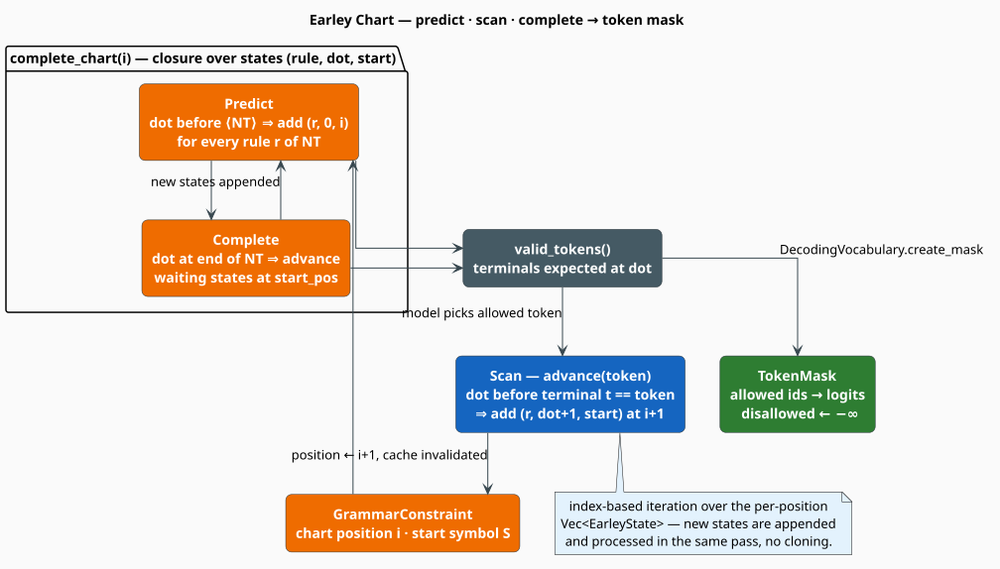

# Grammar-Constrained Decoding

**Grammar-constrained decoding** forces a generator to emit only tokens that keep the output on a path
to a syntactically valid program. libgrammstein implements it with an incremental **Earley parser**
[[1]](#references) that, after every accepted token, reports exactly which terminals may legally come
next; that set becomes a **token mask** that zeroes out every invalid choice before the next token is
picked. The same machinery powers the [grammar corrector](correctors/grammar.md), which asks the
constraint "what did you *expect* here?" to propose repairs. This is the classical, provably-sound
form of the technique that modern engines such as PICARD [[2]](#references) and XGrammar
[[3]](#references) scale to large vocabularies.

> **Scope.** Source of truth: [`src/code/constrained_decoding.rs`](../../../src/code/constrained_decoding.rs).
> The grammar being enforced is a [PCFG](pcfg.md) (`WeightedCFG`). For repair-oriented use see the
> [Grammar Corrector](correctors/grammar.md); for the finite-state alternative see
> [WFST Export](wfst-export.md).

## What & why

An autoregressive generator over a vocabulary of size $`\lvert \mathcal{V} \rvert`$ may, at each step,
emit any token. Fine-tuned to a formal language it will still sometimes produce something ungrammatical
— a stray bracket, a keyword where an expression belongs. Rejecting-and-resampling wastes compute and
has no soundness guarantee. Constrained decoding instead **intersects the model with the grammar at
every step**: the parser tracks the set of live partial derivations, and only terminals that extend at
least one of them are permitted.

Earley parsing is the right engine because it (i) handles *arbitrary* context-free grammars, including
the left-recursive and ambiguous rules that real PCFGs learned from ASTs contain, without a normal-form
conversion, and (ii) is naturally **incremental** — it consumes one token at a time and maintains a
chart from which the next legal terminals are read off directly.

## Theory

### Notation

| Symbol | Meaning |
|---|---|
| $`A \to \alpha \bullet \beta`$ | a **dotted rule**: $`\alpha`$ already matched, $`\beta`$ still expected |
| $`\bullet`$ | the **dot** — the parse position within a rule's RHS |
| $`(A \to \alpha \bullet \beta,\, j)`$ | an **Earley item**: a dotted rule that began matching at input position $`j`$ |
| $`\mathcal{C}_i`$ | the **chart** column at input position $`i`$ — the items live after $`i`$ tokens |
| $`a`$ | a terminal (concrete token) |
| $`B`$ | a non-terminal |
| $`\mathcal{A}_i`$ | the set of **admissible terminals** at position $`i`$ |
| $`\mathcal{V}`$ | the decoding vocabulary; $`\lvert \mathcal{V} \rvert`$ its size |

In the code an item $`(A \to \alpha \bullet \beta,\, j)`$ living in column $`i`$ is the triple
`EarleyState { rule_idx, dot_pos, start_pos = j }` stored in `chart.states[i]`; `dot_pos` is the length
of $`\alpha`$.

### The three Earley operations

A single pass builds each chart column by repeatedly applying three rules until no new item appears
[[1]](#references). **Prediction** and **completion** happen inside a column (`complete_chart`);
**scanning** is what moves the parser to the next column (`advance`).

```math
\textbf{Predict:}\quad
\frac{(A \to \alpha \bullet B\beta,\, j) \in \mathcal{C}_i \qquad B \to \gamma \in R}
     {(B \to \bullet\gamma,\, i) \in \mathcal{C}_i} \tag{E1}
```

```math
\textbf{Scan:}\quad
\frac{(A \to \alpha \bullet a\beta,\, j) \in \mathcal{C}_i \qquad \text{input}_i = a}
     {(A \to \alpha a \bullet \beta,\, j) \in \mathcal{C}_{i+1}} \tag{E2}
```

```math
\textbf{Complete:}\quad
\frac{(B \to \gamma \bullet,\, j) \in \mathcal{C}_i \qquad (A \to \alpha \bullet B\beta,\, k) \in \mathcal{C}_j}
     {(A \to \alpha B \bullet \beta,\, k) \in \mathcal{C}_i} \tag{E3}
```

An input is accepted when some item $`(S \to \gamma \bullet,\, 0)`$ for the start symbol $`S`$, begun
at position $`0`$, is complete in the current column — exactly `GrammarConstraint::can_complete`.

### From chart to token mask

The **admissible set** is every terminal sitting immediately after a dot in the current column:

```math
\mathcal{A}_i = \bigl\{\, a \in \Sigma :\ (A \to \alpha \bullet a\beta,\, j) \in \mathcal{C}_i \,\bigr\} \tag{E4}
```

`GrammarConstraint::valid_tokens` computes $`(\mathrm{E4})`$; `DecodingVocabulary::create_mask` turns it
into a `TokenMask`, and `TokenMask::apply_to_logits` rewrites the generator's logits so disallowed
tokens can never be sampled:

```math
\text{logit}'_v =
\begin{cases}
\text{logit}_v & v \in \mathcal{A}_i \\
-\infty & v \notin \mathcal{A}_i
\end{cases} \tag{E5}
```

After the softmax, every $`-\infty`$ logit maps to probability $`0`$, so the renormalized distribution
places all mass on grammatical continuations — the intersection of model and grammar, exactly.

## The algorithm, literately

The following mirrors [`GrammarConstraint::complete_chart`](../../../src/code/constrained_decoding.rs)
and `advance`. Both iterate the per-column `Vec<EarleyState>` **by index**, so newly appended items are
processed in the same pass without cloning; the parallel `seen` `HashSet` makes `chart.add` idempotent.

```
function initialize():                               ▸ seed column 0 with the start symbol
    for rule_idx in rules_for(start_symbol):
        chart.add(0, EarleyState(rule_idx, dot = 0, start = 0))
    complete_chart(0)

function complete_chart(i):                           ▸ apply Predict (E1) + Complete (E3) to fixpoint
    k <- 0
    while k < chart.state_count_at(i):               ▸ Vec grows in place; re-read the bound each step
        (rule, dot, start) <- chart.state_at_index(i, k)
        (lhs, rhs, _) <- parser.rule(rule)
        if dot < len(rhs):
            if rhs[dot] is NonTerminal(B):            ▸ PREDICT
                for r in rules_for(B):
                    chart.add(i, EarleyState(r, 0, i))
        else:                                         ▸ COMPLETE: this item is (B -> gamma .)
            for w in 0 .. chart.state_count_at(start):
                (wr, wdot, wstart) <- chart.state_at_index(start, w)
                (_, wrhs, _) <- parser.rule(wr)
                if wdot < len(wrhs) and wrhs[wdot] == NonTerminal(lhs):
                    chart.add(i, EarleyState(wr, wdot + 1, wstart))
        k <- k + 1

function valid_tokens():                              ▸ the admissible set A_i, eq. (E4)
    valid <- {}
    for state in chart.states_at(position):
        (_, rhs, _) <- parser.rule(state.rule)
        if state.dot < len(rhs) and rhs[state.dot] is Terminal(t):
            valid.insert(t)
    return valid                                      ▸ cached when config.cache_states

function advance(token):                              ▸ SCAN (E2): consume one accepted terminal
    if token not in valid_tokens(): return false
    for state in chart.states_at(position):           ▸ index-based in the real code
        (_, rhs, _) <- parser.rule(state.rule)
        if state.dot < len(rhs) and rhs[state.dot] == Terminal(token):
            chart.add(position + 1, EarleyState(state.rule, state.dot + 1, state.start))
    position <- position + 1
    invalidate valid_tokens cache
    complete_chart(position)                          ▸ close the new column under Predict + Complete
    return true
```

## Engineering

### Data structures

```rust
pub struct EarleyState {   // an Earley item; its column is where it is stored
    pub rule_idx: usize,   // index into EarleyParser.rules
    pub dot_pos: usize,    // |alpha|: symbols of the RHS already matched
    pub start_pos: usize,  // input position j where this rule began
}

pub struct EarleyChart {
    states: Vec<Vec<EarleyState>>,    // column i = states[i], index-addressable
    seen:   Vec<HashSet<EarleyState>>, // O(1) dedup so add() is idempotent
}

pub struct GrammarConstraint {
    parser: EarleyParser,             // flattened rules + rules_by_lhs index
    config: ConstrainedDecodingConfig,
    chart: EarleyChart,
    position: usize,                  // current column
    valid_tokens_cache: Option<HashSet<String>>,
}
```

`ConstrainedDecodingConfig` defaults: `max_lookahead = 3`, `cache_states = true`,
`min_rule_probability = 1e-10`, `allow_partial = true`. The chart is pre-sized to
`max_lookahead * 2` columns on `initialize`, which bounds a single constrained-generation window.

### Applying the mask

`TokenMask` stores the allowed indices as a `HashSet<usize>` plus the vocabulary size; besides
`apply_to_logits` $`(\mathrm{E5})`$ it offers `to_bool_vec` and `count_allowed`. `DecodingVocabulary`
is a bidirectional `String`-to-`usize` map (`add_token`, `get_idx`, `get_token`) whose `create_mask`
translates the string admissible set $`(\mathrm{E4})`$ into integer token indices for the logits.

### Complexity

| Quantity | Cost | Note |
|---|---|---|
| Chart build over $`n`$ tokens | $`O(n^3)`$ worst case | $`O(n^2)`$ unambiguous, $`O(n)`$ for many grammars [[1]](#references) |
| `valid_tokens` at a position | $`O(\lvert \mathcal{C}_i \rvert)`$ | one scan of the column; then cached |
| `apply_to_logits` | $`O(\lvert \mathcal{V} \rvert)`$ | one pass over the logit vector |
| `advance` | $`O(\lvert \mathcal{C}_i \rvert)`$ + a `complete_chart` | scan then re-close the column |

The whole module is behind the base `code` Cargo feature. A `GrammarConstraint` is single-threaded and
stateful — one instance tracks one decoding stream — but many instances built from the same shared
`WeightedCFG` run independently in parallel.



## Usage

```rust
use libgrammstein::code::constrained_decoding::{DecodingVocabulary, GrammarConstraint, TokenMask};
use libgrammstein::code::pcfg::{Production, Symbol, WeightedCFG};

// A tiny grammar: S -> "a" "b"
let mut cfg = WeightedCFG::new("S");
cfg.add_rule(
    Production::new("S", vec![Symbol::terminal("a"), Symbol::terminal("b")]),
    1.0,
);

let mut constraint = GrammarConstraint::with_default_config(cfg);

// At the start only "a" is admissible, eq. (E4).
assert!(constraint.valid_tokens().contains("a"));
assert!(constraint.advance("a"));          // SCAN, eq. (E2)

// Now only "b" is admissible; after it the parse can complete.
assert!(constraint.valid_tokens().contains("b"));
assert!(constraint.advance("b"));
assert!(constraint.can_complete());

// Turn the admissible set into a logit mask for a generator, eq. (E5).
let mut vocab = DecodingVocabulary::new();
let a = vocab.add_token("a");
let _b = vocab.add_token("b");
let mask: TokenMask = vocab.create_mask(&constraint.valid_tokens());
let mut logits = vec![0.0_f32; vocab.len()];
mask.apply_to_logits(&mut logits);          // disallowed logits -> -inf
```

## References

1. J. Earley (1970). *An efficient context-free parsing algorithm.* Communications of the ACM 13(2),
   94–102. [doi:10.1145/362007.362035](https://doi.org/10.1145/362007.362035)
2. T. Scholak, N. Schucher & D. Bahdanau (2021). *PICARD: Parsing Incrementally for Constrained
   Auto-Regressive Decoding from Language Models.* EMNLP 2021, 9895–9901.
   [doi:10.18653/v1/2021.emnlp-main.779](https://doi.org/10.18653/v1/2021.emnlp-main.779)
3. Y. Dong, C. F. Ruan, Y. Cai, R. Lai, Z. Xu, Y. Zhao & T. Chen (2024). *XGrammar: Flexible and
   Efficient Structured Generation Engine for Large Language Models.*
   [arXiv:2411.15100](https://arxiv.org/abs/2411.15100)

## See also

- [PCFG](pcfg.md) — the grammar whose rules the parser enforces
- [Grammar Corrector](correctors/grammar.md) — repairs driven by the admissible-token set
- [WFST Export](wfst-export.md) — a finite-state approximation for composition with lattices
- [Correctors Overview](correctors/overview.md) — where grammar enforcement fits in the stack
