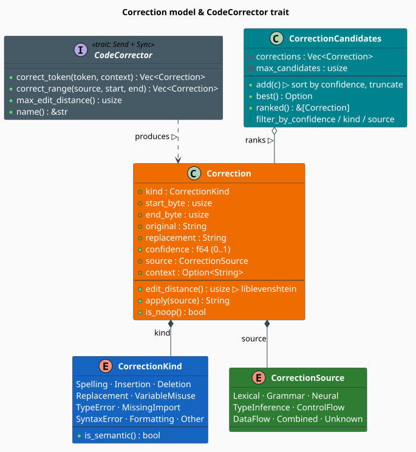

# The Correction Data Model

Every corrector in the module — lexical, grammar, semantic, and the ensemble that merges them —
speaks one vocabulary: it consumes a token (or a byte range) and emits **`Correction`s**. A
`Correction` is a *proposed splice*: replace these bytes with that text, with this confidence, for
this reason, from this analysis. The `CodeCorrector` trait fixes the interface, and
`CorrectionCandidates` is the ranked bag that results. This page defines that model precisely; the
correctors that populate it are documented under [Correctors](correctors/overview.md).

> **Scope.** Source of truth: [`src/code/correction.rs`](../../../src/code/correction.rs). Tokens
> come from the [Tokenizer](tokenizer.md), the ranking is driven end-to-end by the
> [Pipeline](pipeline.md), and edit distances are computed by
> [liblevenshtein](https://github.com/universal-automata/liblevenshtein-rust).

## Notation

| Symbol | Meaning |
|---|---|
| $`s`$ | the source text, indexed by byte offset |
| $`c`$ | a single `Correction` |
| $`[b_0, b_1)`$ | the half-open byte span `c.start_byte .. c.end_byte` |
| $`\gamma(c) \in [0,1]`$ | the confidence of $`c`$ |
| $`d(x,y)`$ | Levenshtein distance between strings $`x`$ and $`y`$ |
| $`K`$ | the set of `CorrectionKind` values |
| $`K_{\mathrm{sem}}`$ | the **semantic** kinds |
| $`k`$ | `max_candidates`, the capacity of a `CorrectionCandidates` |



*Figure 1. A `Correction` carries a byte span, the original and replacement text, a confidence, and
two orthogonal labels: **what** kind of defect it repairs (`CorrectionKind`) and **which** analysis
proposed it (`CorrectionSource`). Every corrector implements `CodeCorrector`; their outputs are
collected into a `CorrectionCandidates`, which keeps them sorted by descending confidence and
truncated to a bound.*

## `Correction`: a proposed splice

```rust
pub struct Correction {
    pub kind: CorrectionKind,       // what class of defect this repairs
    pub start_byte: usize,          // b0 — inclusive
    pub end_byte: usize,            // b1 — exclusive
    pub original: String,           // the text currently at [b0, b1)
    pub replacement: String,        // what to put there instead
    pub confidence: f64,            // in [0, 1]; clamped on construction
    pub source: CorrectionSource,   // which analysis proposed it
    pub context: Option<String>,    // human-readable justification
}
```

The semantics of a correction are exactly one string splice:

```math
\begin{array}{lr}
\displaystyle \mathrm{apply}(s, c) \;=\; s\bigl[0,\, b_0\bigr) \;\Vert\; c.\text{replacement} \;\Vert\; s\bigl[b_1,\, \lvert s \rvert\bigr) & \text{(R1)}
\end{array}
```

`Correction::new` sets `confidence` to `1.0`, `source` to `Unknown`, and `context` to `None`; three
fluent setters refine them. **`with_confidence` clamps its argument into $`[0,1]`$**, so an
over-eager scorer cannot inject a confidence of `2.0` and dominate the ranking:

```rust
use libgrammstein::code::{Correction, CorrectionKind, CorrectionSource};

let c = Correction::new(CorrectionKind::Spelling, 4, 9, "pritn", "print")
    .with_confidence(0.95)
    .with_source(CorrectionSource::Lexical)
    .with_context("Levenshtein distance 2 from a stdlib function");

assert_eq!(c.apply("def pritn(x): pass"), "def print(x): pass");
assert_eq!(Correction::new(CorrectionKind::Other, 0, 0, "", "").with_confidence(2.0).confidence, 1.0);
```

### Distance and no-ops

`edit_distance()` delegates to liblevenshtein's `standard_distance` — the **plain Levenshtein**
metric, whose edit operations are insertion, deletion, and substitution [[1]](#references). It is
total: `0` for equal strings and `max(len)` when one operand is empty, so no special-casing is
needed at the call site. Note that this metric has **no transposition operation**, so the
archetypal typo `pritn` → `print` costs **2**, not 1:

```rust
use libgrammstein::code::{Correction, CorrectionKind};

let d = |a: &str, b: &str| Correction::new(CorrectionKind::Spelling, 0, 0, a, b).edit_distance();

assert_eq!(d("test", "test"), 0);
assert_eq!(d("pritn", "print"), 2);   // transposition = two substitutions
assert_eq!(d("kitten", "sitting"), 3);
assert_eq!(d("", "abc"), 3);          // empty operand → length of the other
```

`is_noop()` reports `original == replacement`. Correctors should not emit no-ops, but the pipeline
does not filter them, so consumers that *apply* corrections may wish to.

> **`apply` slices raw bytes.** $`(\mathrm{R1})`$ is implemented with `&source[..start_byte]` and
> `&source[end_byte..]`, so `start_byte` and `end_byte` must be **valid UTF-8 character
> boundaries within `source`** or the slice panics. Nothing checks that `start_byte <= end_byte`
> either: an inverted span silently *duplicates* text rather than failing. Corrections built from
> `CodeToken` offsets are always well-formed; corrections you synthesize by hand must be.

## `CorrectionKind`: what was wrong

Ten variants, each with a `description()`. The `is_semantic()` predicate partitions them exactly:

```math
\begin{array}{lr}
\displaystyle K_{\mathrm{sem}} \;=\; \{\,\texttt{VariableMisuse},\; \texttt{TypeError},\; \texttt{MissingImport}\,\} & \text{(R2)}
\end{array}
```

| Kind | `description()` | Semantic? | Analysis that finds it |
|---|---|---|---|
| `Spelling` | Spelling correction | no | fuzzy dictionary match |
| `Insertion` | Insert missing token | no | grammar (a `MISSING` node) |
| `Deletion` | Remove extra token | no | grammar |
| `Replacement` | Replace token | no | grammar or neural |
| `SyntaxError` | Syntax error | no | grammar (an `ERROR` node) |
| `Formatting` | Formatting | no | token/layout analysis |
| `VariableMisuse` | Wrong variable name | **yes** | data flow over the CPG |
| `TypeError` | Type error | **yes** | type inference |
| `MissingImport` | Missing import | **yes** | symbol resolution |
| `Other` | Other correction | no | — |

The split is not cosmetic: a *syntactic* repair can be validated by re-parsing the spliced source,
whereas a *semantic* repair cannot — it needs the [CPG](cpg.md), which is why
`full_semantic_analysis` gates CPG construction in the [Pipeline](pipeline.md).

## `CorrectionSource`: which analysis proposed it

`CorrectionKind` says what the defect *is*; `CorrectionSource` says **who noticed**. The two are
orthogonal — a `Replacement` may come from `Grammar` or from `Neural` — and keeping them separate
is what lets the ensemble reward *agreement between independent analyses*.

| Source | Emitted by |
|---|---|
| `Lexical` | [Lexical corrector](correctors/lexical.md) — liblevenshtein fuzzy matching |
| `Grammar` | [Grammar corrector](correctors/grammar.md) — PCFG + Earley |
| `Neural` | [Semantic corrector](correctors/semantic.md) — GNN / code embeddings |
| `TypeInference` | type analysis |
| `ControlFlow` | CFG traversal over the CPG |
| `DataFlow` | DFG traversal over the CPG |
| `Combined` | [Ensemble corrector](correctors/ensemble.md) — a merged, agreement-boosted suggestion |
| `Unknown` | the default from `Correction::new` when no source is set |

## `CodeCorrector`: the trait

```rust
pub trait CodeCorrector: Send + Sync {
    fn correct_token(&self, token: &CodeToken, context: &TokenContext) -> Vec<Correction>;
    fn correct_range(&self, source: &str, start_byte: usize, end_byte: usize) -> Vec<Correction>;
    fn max_edit_distance(&self) -> usize { 2 }   // provided
    fn name(&self) -> &str;
}
```

Four points carry the design:

1. **`&self`, not `&mut self`.** A corrector is *read-only during correction*, so one instance
   serves any number of threads. Learning (adding identifiers, registering variables) happens
   through separate `&mut` methods before analysis begins.
2. **`Send + Sync`** is a supertrait, making `Arc<dyn CodeCorrector>` shareable by construction.
3. **Two entry points.** `correct_token` is the per-token path the pipeline drives;
   `correct_range` handles defects that are not attached to a single token (a missing
   parenthesis lives *between* tokens).
4. **`max_edit_distance` defaults to 2** — the classic bound for single-word spelling correction,
   beyond which the candidate set explodes and precision collapses [[1]](#references).

Both `correct_token` and `correct_range` return a **`Vec<Correction>`, not a ranked structure**:
ranking is the collector's job, not the corrector's. A corrector should emit everything it
plausibly believes, scored honestly, and let the ensemble arbitrate.

### Implementing a corrector

```rust
use libgrammstein::code::{
    CodeCorrector, CodeToken, Correction, CorrectionKind, CorrectionSource, TokenContext, TokenType,
};

/// Flags a token whose text is a keyword within edit distance 1 of a *different* keyword —
/// e.g. Python's `elif` mistyped as `elsif`.
struct KeywordCorrector {
    keywords: Vec<String>,
}

impl CodeCorrector for KeywordCorrector {
    fn correct_token(&self, token: &CodeToken, _context: &TokenContext) -> Vec<Correction> {
        // Only correct token types worth correcting, and only closed-vocabulary ones.
        if !token.token_type.is_correctable() || !token.token_type.has_fixed_vocabulary() {
            return Vec::new();
        }

        let end_byte = token.byte_offset + token.text.len();
        let max_d = self.max_edit_distance();

        self.keywords
            .iter()
            .filter(|kw| kw.as_str() != token.text)
            .filter_map(|kw| {
                let d = liblevenshtein::distance::standard_distance(&token.text, kw);
                (d <= max_d).then(|| {
                    // Nearer candidates are more credible: d = 1 → 0.9, d = 2 → 0.8.
                    let confidence = 1.0 - 0.1 * (d as f64);
                    Correction::new(
                        CorrectionKind::Spelling,
                        token.byte_offset,
                        end_byte,
                        token.text.clone(),
                        kw.clone(),
                    )
                    .with_confidence(confidence)
                    .with_source(CorrectionSource::Lexical)
                    .with_context(format!("within edit distance {d} of the keyword `{kw}`"))
                })
            })
            .collect()
    }

    fn correct_range(&self, _source: &str, _start_byte: usize, _end_byte: usize) -> Vec<Correction> {
        Vec::new() // this corrector is purely token-local
    }

    fn name(&self) -> &str {
        "keyword"
    }
}

// Only `Keyword` tokens are considered, because only they have a fixed vocabulary.
assert!(TokenType::Keyword.has_fixed_vocabulary());
assert!(!TokenType::Identifier.has_fixed_vocabulary());
```

## `CorrectionCandidates`: the ranked bag

```rust
pub struct CorrectionCandidates {
    corrections: Vec<Correction>, // kept sorted by descending confidence
    max_candidates: usize,        // k — the bound; Default is 10
}
```

The invariant is maintained on **every** insertion: `add` pushes, re-sorts the whole vector by
descending confidence, and truncates to $`k`$. So at all times

```math
\begin{array}{lr}
\displaystyle \mathrm{ranked}(C) \;=\; \bigl\langle c_1, \dots, c_m \bigr\rangle, \quad
m = \min\bigl(\lvert C \rvert,\, k\bigr), \quad
\gamma(c_1) \ge \gamma(c_2) \ge \dots \ge \gamma(c_m) & \text{(R3)}
\end{array}
```

| Method | Behavior |
|---|---|
| `new(k)` | empty, bounded at $`k`$ (`Default` is `new(10)`) |
| `add(c)` | insert, re-sort descending, truncate to $`k`$ |
| `add_all(iter)` | `add` each |
| `best()` | `Option<&Correction>` — the head of $`(\mathrm{R3})`$ |
| `ranked()` | `&[Correction]` — the whole ordered slice |
| `len()` / `is_empty()` | size of the bag |
| `filter_by_confidence(min)` | retain $`\gamma(c) \ge \text{min}`$ |
| `filter_by_kind(k)` / `filter_by_source(s)` | retain matching corrections |

It implements `IntoIterator` both by value (yielding `Correction`) and by reference (yielding
`&Correction`), so both loops below work:

```rust
use libgrammstein::code::{Correction, CorrectionCandidates, CorrectionKind};

let mut candidates = CorrectionCandidates::new(3);
candidates.add(Correction::new(CorrectionKind::Spelling, 0, 5, "pritn", "print").with_confidence(0.9));
candidates.add(Correction::new(CorrectionKind::Spelling, 0, 5, "pritn", "prion").with_confidence(0.5));
candidates.add(Correction::new(CorrectionKind::Spelling, 0, 5, "pritn", "pint").with_confidence(0.7));

// (R3): sorted by descending confidence.
let ranked = candidates.ranked();
assert_eq!(ranked[0].replacement, "print");
assert_eq!(ranked[1].replacement, "pint");
assert_eq!(ranked[2].replacement, "prion");
assert_eq!(candidates.best().map(|c| c.replacement.as_str()), Some("print"));

// The top 3 — there is no `top(n)`; slice or take from `ranked()`.
let top3: Vec<&str> = candidates.ranked().iter().take(3).map(|c| c.replacement.as_str()).collect();
assert_eq!(top3, ["print", "pint", "prion"]);

for c in &candidates { /* by reference */ let _ = c.confidence; }
for c in candidates  { /* by value    */ let _ = c.replacement; }
```

Two properties are worth relying on:

- **NaN-safe.** The comparator is `b.confidence.partial_cmp(&a.confidence).unwrap_or(Ordering::Equal)`,
  so a `NaN` score from a misbehaving neural scorer is treated as *equal* to everything rather than
  panicking the sort — a deliberate robustness choice on a path that runs inside an editor.
- **Stable among ties.** `sort_by` is stable, so corrections with identical confidence retain their
  relative insertion order.

> **`add` is $`O(k \log k)`$, not $`O(\log k)`$.** Because it re-sorts on every insertion, feeding
> $`n`$ corrections through `add` costs $`O(n \cdot k \log k)`$. This is fine for the tens of
> candidates a single token attracts, and wrong for the hundreds of thousands a whole file
> produces — which is precisely why [`CorrectionPipeline`](pipeline.md) does **not** use
> `CorrectionCandidates` on its hot path. It streams into a bounded min-heap and materializes a
> `CorrectionCandidates` only once, at the end.

## Confidence: what it does and does not mean

`confidence` is a producer-defined score in $`[0,1]`$, clamped on construction. The framework
**orders** by it and **thresholds** on it; it never *calibrates* it. Two consequences:

1. **Confidences are not comparable across correctors a priori.** A `0.8` from the lexical
   corrector (an edit-distance heuristic) and a `0.8` from the semantic corrector (a GNN logit) are
   not the same claim. Reconciling them is exactly the job of the
   [Ensemble corrector](correctors/ensemble.md), which reweights per source and rewards agreement.
2. **The pipeline applies a floor, not a calibration.** `PipelineConfig::min_confidence` (default
   `0.3`) discards anything below the threshold *before* ranking. Raise it to trade recall for
   precision.

## Applying more than one correction

`Correction::apply` splices **one** correction. Applying several is not simply repeated
application: every splice shifts the offsets of everything after it. The fix is to apply in
**descending order of `start_byte`**, so each splice only disturbs bytes that have already been
processed — which is what [`CorrectionPipeline::apply_corrections`](pipeline.md) does:

```rust
use libgrammstein::code::{Correction, CorrectionKind};

let source = "funtion foo() { retrun 42; }";

// Descending by start_byte: the later splice cannot invalidate the earlier one's offsets.
let mut fixes = vec![
    Correction::new(CorrectionKind::Spelling, 0, 7, "funtion", "function"),
    Correction::new(CorrectionKind::Spelling, 16, 22, "retrun", "return"),
];
fixes.sort_by(|a, b| b.start_byte.cmp(&a.start_byte));

let mut fixed = source.to_string();
for c in &fixes {
    fixed.replace_range(c.start_byte..c.end_byte, &c.replacement);
}
assert_eq!(fixed, "function foo() { return 42; }");
```

> **Overlaps are not detected.** Neither `apply` nor `apply_corrections` checks whether two
> corrections' spans intersect. Two corrections proposing different repairs for *the same* token
> will both be applied, corrupting the output. The pipeline's collector de-duplicates on the key
> `(start_byte, end_byte, replacement)` — which suppresses *identical* suggestions but **not**
> competing ones over the same span. If you apply more than the single `best()` per site, filter to
> one correction per span first.

## Complexity and concurrency

| Operation | Cost | Note |
|---|---|---|
| `Correction::apply` | $`O(\lvert s \rvert)`$ | copies the source once; capacity pre-reserved |
| `Correction::edit_distance` | $`O(\lvert x \rvert \cdot \lvert y \rvert)`$ | liblevenshtein's standard distance |
| `CorrectionCandidates::add` | $`O(k \log k)`$ | re-sorts the bounded vector |
| `CorrectionCandidates::add_all` ($`n`$ items) | $`O(n \cdot k \log k)`$ | see the note above |
| `best()` / `ranked()` | $`O(1)`$ | the vector is already ordered |
| `filter_by_*` | $`O(k)`$ | in-place `retain` |

`Correction`, `CorrectionKind`, and `CorrectionSource` are plain owned data (`Clone`, and `Copy`
for the two enums). `CodeCorrector` is `Send + Sync` with `&self` methods, so a single corrector
behind an `Arc` can serve a thread pool:

```rust
use libgrammstein::code::{CodeCorrector, LexicalCorrector, Python};
use std::sync::Arc;

let corrector = Arc::new(LexicalCorrector::with_defaults(Arc::new(Python::new())));

let worker = Arc::clone(&corrector);
std::thread::spawn(move || {
    assert_eq!(worker.name(), "LexicalCorrector");
    assert_eq!(worker.max_edit_distance(), 2); // LexicalCorrectorConfig::default()
});
```

`CorrectionCandidates` is *not* internally synchronized — it is a plain `Vec` behind a bound. Give
each thread its own, or use the pipeline's collector.

## References

1. F. J. Damerau (1964). *A technique for computer detection and correction of spelling errors.*
   Communications of the ACM 7(3), 171–176. — the origin of the edit-distance-bounded correction
   model, and of the observation that most typos are within distance 1–2.
   [doi:10.1145/363958.363994](https://doi.org/10.1145/363958.363994)
2. V. I. Levenshtein (1966). *Binary codes capable of correcting deletions, insertions, and
   reversals.* Soviet Physics Doklady 10(8), 707–710. — the insert/delete/substitute metric that
   `edit_distance()` computes.
3. F. Yamaguchi, N. Golde, D. Arp & K. Rieck (2014). *Modeling and Discovering Vulnerabilities
   with Code Property Graphs.* IEEE Symposium on Security and Privacy, 590–604. — the graph the
   semantic kinds $`(\mathrm{R2})`$ are diagnosed from.
   [doi:10.1109/SP.2014.44](https://doi.org/10.1109/SP.2014.44)

## See also

- [Correctors](correctors/overview.md) — the four implementations that produce `Correction`s
- [Pipeline](pipeline.md) — the streaming collector that ranks them at scale
- [Tokenizer](tokenizer.md) — the `CodeToken` and `TokenContext` a corrector is handed
- [Language](language.md) — how `TokenType` selects the candidate vocabulary
- [CPG](cpg.md) — the graph the semantic kinds are diagnosed from
- [Overview](overview.md) — the module map
