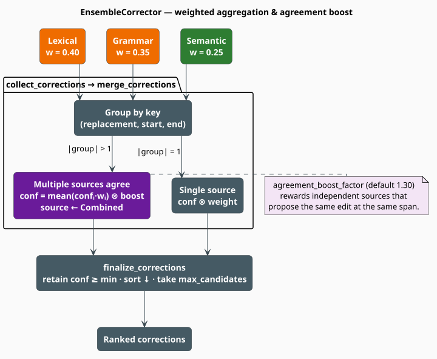

# Ensemble Corrector: Weighted Aggregation and Agreement

The **ensemble corrector** is the arbiter. It asks all three specialists the same question, collects
their answers, and decides what the user actually sees. Its central idea is simple and sound: group
proposals by **the edit they describe** — not by who made them — and when several independent
correctors converge on the same edit at the same place, treat that convergence as evidence and
promote it. When errors are weakly correlated across members, this is exactly the regime in which
combining classifiers pays [[1]](#references)[[2]](#references).

This page derives the aggregation function from the source, and then does the arithmetic. That
arithmetic has a surprising conclusion, so it gets its own section: under the **shipped default
configuration**, the only single-source correction that can reach the output is a lexical spelling
fix at edit distance $`1`$. Everything else — every grammar repair, every semantic finding — is
filtered out unless a second source corroborates it.

> **Scope.** Source of truth: [`src/code/correctors/ensemble.rs`](../../../../src/code/correctors/ensemble.rs).
> The three members: [Lexical](lexical.md), [Grammar](grammar.md), [Semantic](semantic.md). The
> container it feeds: [Correction](../correction.md). The driver that calls it:
> [Pipeline](../pipeline.md).

## Notation

| Symbol | Meaning |
|---|---|
| $`\mathcal{S}`$ | the sources, $`\{\text{lex}, \text{gram}, \text{sem}\}`$ |
| $`w_s \in \mathbb{R}_{\geq 0}`$ | the **weight** of source $`s`$ (`lexical_weight`, …) |
| $`x`$ | a `Correction`, with confidence $`c(x)`$ and source $`s(x)`$ |
| $`k(x)`$ | the **grouping key** of $`x`$ — eq. $`(\mathrm{E1})`$ |
| $`g`$ | a **group**: all corrections sharing one key |
| $`\lvert g \rvert`$ | the number of members of $`g`$ |
| $`\hat{c}(g)`$ | the **aggregated** confidence of the group — eq. $`(\mathrm{E2})`$ |
| $`\beta`$ | `agreement_boost_factor`, default $`1.3`$ |
| $`\theta`$ | `min_confidence`, default $`0.3`$ |
| $`K`$ | `max_candidates`, default $`10`$ |
| $`\gamma_s`$ | the **effective agreement gain** for source $`s`$ — eq. $`(\mathrm{E5})`$ |

Default weights: $`w_{\text{lex}} = 0.40`$, $`w_{\text{gram}} = 0.35`$, $`w_{\text{sem}} = 0.25`$.
They happen to sum to $`1`$; nothing in the code requires or enforces that.

## Theory

### Collection and the grouping key

`collect_corrections` calls `correct_token` on each present member and pairs every returned
correction with its source's weight, producing a multiset of $`(x, w_{s(x)})`$. Two corrections are
then considered **the same edit** — and hence candidates for merging — exactly when they agree on
the replacement text and the byte span:

```math
\begin{array}{lr}
\displaystyle k(x) \;=\; \bigl(\, r(x),\; b_0(x),\; b_1(x) \,\bigr) & \text{(E1)}
\end{array}
```

Notice what is *absent* from $`(\mathrm{E1})`$: the `CorrectionKind` and the `CorrectionSource`. A
lexical `Spelling` fix and a grammar `Replacement` that both rewrite bytes $`[4,11)`$ to `return`
are **the same edit** and will merge. This is the right key — it is the *edit* that either helps the
user or does not — and it is what makes cross-source agreement detectable at all.

### The aggregation function

For a group $`g`$ of corrections sharing a key, `merge_corrections` computes:

```math
\begin{array}{lr}
\displaystyle \hat{c}(g) \;=\;
\begin{cases}
c_1 \, w_1 & \lvert g \rvert = 1 \\[8pt]
\min\!\left( \beta \cdot \dfrac{\displaystyle\sum_{i \in g} c_i \, w_i}{\displaystyle\sum_{i \in g} w_i},\;\; 1 \right) & \lvert g \rvert > 1
\end{cases} & \text{(E2)}
\end{array}
```

where $`\beta = \texttt{agreement\_boost\_factor}`$ when `agreement_boost` is enabled and
$`\lvert g \rvert > 1`$, and $`\beta = 1`$ otherwise. A merged group additionally:

- inherits the **kind, span, and replacement of its highest-scoring member**, the argmax of
  $`c_i w_i`$;
- has its source overwritten to `CorrectionSource::Combined`;
- has its context replaced by `"Suggested by N sources"`.

Finally, `finalize_corrections` applies the floor, the order, and the cut:

```math
\begin{array}{lr}
\displaystyle \text{output} \;=\; \text{top-}K \bigl\{\, g \;:\; \hat{c}(g) \geq \theta \,\bigr\}
\quad \text{sorted by } \hat{c} \text{ descending} & \text{(E3)}
\end{array}
```

Setting `deduplicate = false` bypasses grouping entirely: every correction is weighted by
$`c \, w`$ and passed straight to $`(\mathrm{E3})`$, so no agreement can ever be detected.

### The two branches are not the same function

This is the subtlety that governs everything below. Look at how $`w`$ enters each branch of
$`(\mathrm{E2})`$.

In the **singleton** branch, $`w`$ is a **multiplicative penalty**: a weight below $`1`$ strictly
shrinks the confidence.

In the **multi-source** branch, $`w`$ is a **mixing coefficient** in a weighted mean — and a
weighted mean is *scale-invariant* in its weights. In particular, if every member of a group shares
the same confidence $`c`$, then for **any** weights whatsoever:

```math
\begin{array}{lr}
\displaystyle \frac{\sum_{i \in g} c \, w_i}{\sum_{i \in g} w_i} \;=\; c \cdot \frac{\sum_i w_i}{\sum_i w_i} \;=\; c & \text{(E4)}
\end{array}
```

The weights cancel. So the very same correction, with the very same confidence $`c`$, is worth
$`c \, w_s`$ when it stands alone and $`\beta c`$ when corroborated. The **effective agreement
gain** is therefore not $`\beta`$ but

```math
\begin{array}{lr}
\displaystyle \gamma_s \;=\; \frac{\hat{c}_{\text{corroborated}}}{\hat{c}_{\text{solo}}} \;=\; \frac{\beta \, c}{c \, w_s} \;=\; \frac{\beta}{w_s} & \text{(E5)}
\end{array}
```

| Source | $`w_s`$ | $`\gamma_s = \beta / w_s`$ |
|---|---|---|
| Lexical | $`0.40`$ | $`3.25\times`$ |
| Grammar | $`0.35`$ | $`3.71\times`$ |
| Semantic | $`0.25`$ | $`5.20\times`$ |

Agreement is worth between $`3.25\times`$ and $`5.2\times`$ — not the $`1.3\times`$ that the field
name `agreement_boost_factor` advertises. And the *less* a source is trusted, the *more* it gains
from being corroborated. Whether that inversion is intended is a design question; that it is the
behavior is a fact, and it follows directly from $`(\mathrm{E4})`$.

## Calibration: what actually survives the default thresholds

A solo correction from source $`s`$ reaches the output if and only if
$`\hat{c} = c \, w_s \geq \theta`$, that is:

```math
\begin{array}{lr}
\displaystyle c \;\geq\; \frac{\theta}{w_s} & \text{(E6)}
\end{array}
```

Evaluate the right-hand side with the shipped defaults ($`\theta = 0.3`$):

| Source | $`w_s`$ | Required confidence $`\theta / w_s`$ | Attainable? ($`c \leq 1`$) |
|---|---|---|---|
| Lexical | $`0.40`$ | $`0.750`$ | yes |
| Grammar | $`0.35`$ | $`\approx 0.857`$ | yes, in principle |
| Semantic | $`0.25`$ | $`\mathbf{1.200}`$ | **no — exceeds the maximum possible confidence** |

**Proposition 1 (the semantic source is structurally mute).** Under the default configuration, no
semantic correction can *ever* be emitted on its own, whatever it finds and however certain it is:
$`(\mathrm{E6})`$ would require $`c \geq 1.2`$, and `Correction::with_confidence` clamps every
confidence into $`[0,1]`$. $`\blacksquare`$

Now bring in the confidence ceilings established on the other pages — the lexical decay
$`(\mathrm{L4})`$, the grammar ceiling $`c \leq \beta_0 = 0.8`$ from $`(\mathrm{G5})`$, and the
semantic bounds from $`(\mathrm{S3})`$ and the two CPG rules:

| Source | Correction | Attainable $`c`$ | $`\hat{c} = c \, w_s`$ | vs $`\theta = 0.3`$ |
|---|---|---|---|---|
| Lexical | `Spelling`, $`d_L = 1`$ | $`0.85`$ | $`\mathbf{0.340}`$ | **passes** |
| Lexical | `Spelling`, $`d_L = 2`$ | $`0.70`$ | $`0.280`$ | filtered |
| Grammar | `Insertion` | $`\leq 0.80`$ | $`\leq 0.280`$ | filtered |
| Grammar | `Replacement` | $`\leq 0.80`$ | $`\leq 0.280`$ | filtered |
| Grammar | `Deletion` | $`0.56`$ | $`0.196`$ | filtered |
| Semantic | `VariableMisuse` (trait) | $`< 0.70`$ | $`< 0.175`$ | filtered |
| Semantic | `UnusedBinding` (CPG) | $`0.36`$ | $`0.090`$ | filtered |
| Semantic | `MissingErrorHandling` (CPG) | $`0.375`$ | $`0.094`$ | filtered |

**Proposition 2 (only one solo survivor).** Under the default configuration the sole single-source
correction that reaches the output is a **lexical spelling fix at edit distance $`1`$**, at
$`\hat{c} = 0.85 \times 0.40 = 0.34`$. Every grammar correction is capped at
$`0.8 \times 0.35 = 0.28 < 0.3`$; every semantic correction is barred by Proposition 1; and a
distance-$`2`$ lexical fix lands at $`0.28 < 0.3`$. $`\blacksquare`$

**Proposition 3 (`analyze_full` is empty by default).** `EnsembleCorrector::analyze_full` routes
*only* semantic corrections into the merge, each weighted $`w_{\text{sem}} = 0.25`$. Distinct
issues arise from distinct CPG nodes (a node cannot be both a `Variable` and a `Call`), which carry
distinct byte spans, so every group is a **singleton** and $`(\mathrm{E2})`$ reduces to
$`\hat{c} = c \cdot 0.25 \leq 0.375 \times 0.25 = 0.094`$. As $`0.094 < 0.3 = \theta`$, the filter
in $`(\mathrm{E3})`$ removes everything: **`analyze_full` returns an empty `Vec` for every input.**
$`\blacksquare`$

Proposition 3 has a real cost. The [Pipeline](../pipeline.md) enables `full_semantic_analysis` by
default, builds the entire Code Property Graph, calls `analyze_full`, and discards the result — the
CPG is paid for and never used.

### Agreement rescues everything

None of this makes the ensemble broken; it makes it *conservative*. The moment two sources agree,
$`(\mathrm{E4})`$ cancels the weights and the boost lifts the result well clear of the floor. A
lexical distance-$`1`$ fix corroborated by a grammar replacement of confidence $`c_g`$ scores

```math
\hat{c} \;=\; 1.3 \cdot \frac{0.85 \times 0.40 \;+\; c_g \times 0.35}{0.40 + 0.35}
\;=\; 1.3 \cdot \frac{0.34 + 0.35\,c_g}{0.75}
```

which is $`0.589`$ even at $`c_g = 0`$ and $`0.771`$ at $`c_g = 0.3`$ — comfortably above $`\theta`$,
and far above the $`0.34`$ the lexical fix earns alone. Even the two "mute" sources rescue *each
other*: a grammar repair at $`0.5`$ agreeing with a semantic finding at $`0.6`$ yields
$`1.3 \times (0.175 + 0.15)/0.60 = 0.704`$. The ensemble is thus a **near-pure agreement filter** in
its default configuration: solo evidence is (almost) never enough.

### Recalibrating, without touching the code

The cleanest fix preserves the designers' *relative* trust ordering while removing the systematic
shrink: **rescale all three weights so the largest is $`1`$** (multiply by
$`1/\max_s w_s = 2.5`$). The ratios $`0.40 : 0.35 : 0.25`$ are unchanged, so nothing about the
intended precedence is lost:

| Source | Default $`w_s`$ | Rescaled $`w_s`$ | Solo survivors at $`\theta = 0.3`$ |
|---|---|---|---|
| Lexical | $`0.40`$ | $`1.000`$ | $`d_L \in \{1, 2\}`$ ($`0.85`$, $`0.70`$) |
| Grammar | $`0.35`$ | $`0.875`$ | deletions ($`0.49`$); insertions/replacements when $`c \geq 0.343`$ |
| Semantic | $`0.25`$ | $`0.625`$ | trait misuse when $`\mathrm{sim} \geq 0.686`$ |

The two CPG advisories still land just under the bar ($`0.36 \times 0.625 = 0.225`$ and
$`0.375 \times 0.625 = 0.234`$), so lower $`\theta`$ to $`0.20`$ if you want them:

```rust
use libgrammstein::code::correctors::ensemble::EnsembleCorrectorConfig;

let config = EnsembleCorrectorConfig {
    lexical_weight: 1.000,  // 0.40 * 2.5  -- ratios preserved exactly
    grammar_weight: 0.875,  // 0.35 * 2.5
    semantic_weight: 0.625, // 0.25 * 2.5
    min_confidence: 0.20,   // admits the CPG advisories at 0.225 / 0.234
    ..Default::default()
};
```

Keeping $`\max_s w_s = 1`$ matters for a second reason: `apply_weight` mutates
`c.confidence *= weight` **directly**, bypassing the $`[0,1]`$ clamp that `with_confidence`
enforces, and the singleton branch of $`(\mathrm{E2})`$ has no `min(·, 1)`. A weight above $`1`$
therefore produces confidences above $`1`$ — legal in the type, meaningless as a probability.

Two further cautions:

- **The pipeline applies its own floor.** `PipelineConfig::min_confidence` (also $`0.3`$) is
  enforced *again* by `StreamingCorrectionCollector`. Lowering $`\theta`$ on the ensemble alone is
  not enough when driving through `CorrectionPipeline` — lower both.
- **Raising `base_confidence` cannot rescue the semantic source.** From $`(\mathrm{E6})`$, grammar
  needs $`\beta_0 \geq \theta / w_{\text{gram}} \approx 0.857`$ merely to become *possible*; the
  semantic source needs $`c \geq 1.2`$, which no configuration of its own can produce. Only the
  weight or the floor can fix it.

## The algorithm, literately

```
function correct_token(token, context):               ▸ the CodeCorrector entry point
    pairs  <- collect_corrections(token, context)     ▸ [(correction, source_weight)]
    merged <- merge_corrections(pairs)
    return finalize_corrections(merged)

function collect_corrections(token, context):
    for each present member m in [lexical, grammar, semantic]:
        for c in m.correct_token(token, context):
            emit (c, weight_of(m))                    ▸ absent members contribute nothing

function merge_corrections(pairs):
    if pairs is empty: return []
    if not config.deduplicate:                        ▸ no grouping, no agreement possible
        return [ apply_weight(c, w) for (c, w) in pairs ]

    groups <- HashMap presized to |pairs|             ▸ worst case: one group per correction
    for (c, w) in pairs:
        groups[(c.replacement, c.start_byte, c.end_byte)].push((c, w))   ▸ the key, eq. (E1)

    for g in groups.values():
        if |g| = 1:
            emit apply_weight(c₁, w₁)                 ▸ conf ← c·w   (no clamp!)
        else:
            total <- Σ wᵢ
            avg   <- (Σ cᵢ·wᵢ) / total                ▸ a weighted MEAN — weights cancel, eq. (E4)
            best  <- argmax_{i ∈ g} (cᵢ · wᵢ)         ▸ keeps its kind, span, replacement
            boost <- agreement_boost_factor if (agreement_boost and |g| > 1) else 1
            best.confidence <- min(avg · boost, 1)    ▸ eq. (E2), multi-source branch
            best.source     <- Combined
            best.context    <- "Suggested by {|g|} sources"
            emit best

function finalize_corrections(cs):                    ▸ eq. (E3)
    retain c where c.confidence ≥ min_confidence      ▸ θ = 0.3 by default
    sort by confidence descending                     ▸ NaN treated as Equal — never panics
    truncate to max_candidates                        ▸ K = 10
```



*Figure 1. Weighted candidates from the three sources are grouped by $`(\mathrm{E1})`$. A singleton
is scaled by its source weight; a group of two or more is collapsed to a weighted mean, boosted by
$`\beta`$, and re-tagged `Combined`. The floor and the top-$`K`$ cut of $`(\mathrm{E3})`$ produce the
final ranking.*

## Engineering

### Configuration

```rust
pub struct EnsembleCorrectorConfig {
    pub lexical_weight: f64,          // default 0.40
    pub grammar_weight: f64,          // default 0.35
    pub semantic_weight: f64,         // default 0.25
    pub min_confidence: f64,          // default 0.30   (the theta of E3)
    pub max_candidates: usize,        // default 10     (the K of E3)
    pub deduplicate: bool,            // default true   (false disables agreement entirely)
    pub dedup_threshold: f64,         // default 0.90   -- INERT, never read
    pub agreement_boost: bool,        // default true
    pub agreement_boost_factor: f64,  // default 1.30   (the beta of E2)
}
```

`dedup_threshold` is declared, defaulted, and **never read**: deduplication is exact-match on the
key $`(\mathrm{E1})`$, not a similarity threshold. Setting it has no effect.

### Construction

| Constructor | Lexical | Grammar | Semantic |
|---|---|---|---|
| `new(lang, grammar, config)` | always | iff `grammar.is_some()` | always |
| `with_defaults(lang, grammar)` | always | iff `grammar.is_some()` | always |
| `lexical_only(lang)` | always | never | never |
| `EnsembleCorrectorBuilder` | `without_lexical()` to drop | `with_grammar(cfg)` **and** not `without_grammar()` | `without_semantic()` to drop |

All of these require `L: CodeLanguage + Clone` (the `Arc<L>` is cloned once per member). The
`CodeCorrector` impl additionally requires `L: Send + Sync`.

`lexical_mut()` and `semantic_mut()` expose the two trainable members; `add_identifiers` and
`register_variables` are the convenience wrappers over them. There is **no** `grammar_mut()` — the
grammar is fixed at construction — and no wrapper for `SemanticCorrector::register_function`
(which, as [Semantic](semantic.md#dead-state-known_functions-type_name-scope_level) notes, nothing
reads anyway).

`max_edit_distance()` returns the maximum over the **present** members, floored at $`2`$: with all
three, the semantic corrector's $`3`$ wins.

### Cost

Let $`n`$ be the number of candidates collected for one token and $`G`$ the number of distinct
groups.

| Step | Cost | Note |
|---|---|---|
| `collect_corrections` | $`\sum_s T_s`$ | the members' own costs — see each page |
| grouping | $`O(n)`$ expected | one `HashMap` probe per candidate |
| key construction | $`O(n)`$ **String clones** | `c.replacement.clone()` for every candidate |
| per-group merge | $`O(\lvert g \rvert)`$ | two folds plus one `max_by` |
| `finalize_corrections` | $`O(G \log G)`$ | the sort dominates |

The `HashMap` is pre-sized to $`n`$ (the worst case is one group per candidate), which removes
mid-loop resize doubling. The one avoidable allocation is the key's `String` clone; hashing the
triple directly would remove it.

Every float comparison in the module maps `NaN` to `Ordering::Equal`, and the single `max_by` on a
group is followed by `.expect("ensemble group is non-empty by construction")` — the group cannot be
empty, since it was created by pushing into it. The ensemble cannot panic on a bad score from a
member.

### Concurrency

`EnsembleCorrector<L>` is `Send + Sync` when `L` is, and `correct_token`, `correct_range`, and
`analyze_full` all take `&self`. Build it, train it (`add_identifiers` / `register_variables` take
`&mut self`), wrap it in an `Arc`, and correct from any number of threads. The members hold no
interior mutability and take no locks.

## Usage

### The default ensemble

```rust
use libgrammstein::code::correction::CodeCorrector;
use libgrammstein::code::correctors::EnsembleCorrector;
use libgrammstein::code::language::{TokenContext, TokenType};
use libgrammstein::code::tokenizer::CodeToken;
use libgrammstein::code::Python;
use std::sync::Arc;

let python = Arc::new(Python::new());
let mut ensemble = EnsembleCorrector::with_defaults(Arc::clone(&python), None);
ensemble.add_identifiers(&["calculate_total", "user_count"]);

let token = CodeToken::new("calculate_totl", 0, 0, 0, TokenType::Identifier, "identifier");
let context = TokenContext::new(TokenType::Identifier);

for c in ensemble.correct_token(&token, &context) {
    // "calculate_totl" -> "calculate_total": lexical, d = 1, 0.85 * 0.40 = 0.34 >= 0.30.
    println!("{} -> {} ({:.2}, {:?})", c.original, c.replacement, c.confidence, c.source);
}
```

### Building a custom ensemble

```rust
use libgrammstein::code::correctors::ensemble::{EnsembleCorrectorBuilder, EnsembleCorrectorConfig};
use libgrammstein::code::pcfg::WeightedCFG;
use libgrammstein::code::Python;
use std::sync::Arc;

// `cfg` trained beforehand -- see the PCFG docs.
let cfg = WeightedCFG::new("source_file");
let python = Arc::new(Python::new());

let ensemble = EnsembleCorrectorBuilder::new(Arc::clone(&python))
    .with_grammar(cfg)
    .without_semantic()      // drop the member that cannot clear the floor anyway
    .lexical_weight(1.00)    // rescaled, per the calibration analysis
    .grammar_weight(0.875)
    .build();

assert_eq!(ensemble.config().lexical_weight, 1.00);
```

### Recalibrated, end to end through the pipeline

Both floors must move together, since the pipeline re-applies its own:

```rust
use libgrammstein::code::pipeline::{CorrectionPipeline, PipelineConfig};
use libgrammstein::code::Python;
use std::sync::Arc;

let python = Arc::new(Python::new());
let pipeline_config = PipelineConfig {
    min_confidence: 0.20,        // must match the ensemble's floor, or it re-filters
    max_corrections: 50,
    full_semantic_analysis: true,
    ..Default::default()
};
let mut pipeline = CorrectionPipeline::new(python, None, pipeline_config)?;

let result = pipeline.analyze("def f(items):\n    retrun sum(items)\n")?;
for c in result.corrections.ranked() {
    println!("{:?} {:.2}: {} -> {}", c.source, c.confidence, c.original, c.replacement);
}
# Ok::<(), libgrammstein::code::PipelineError>(())
```

Note that `CorrectionPipeline` constructs its own `EnsembleCorrector` with **default** weights, so
the rescaling above cannot be applied through `PipelineConfig` today; to combine both you must
drive the ensemble directly.

## References

1. T. G. Dietterich (2000). *Ensemble Methods in Machine Learning.* Multiple Classifier Systems,
   LNCS 1857, 1–15. [doi:10.1007/3-540-45014-9_1](https://doi.org/10.1007/3-540-45014-9_1)
2. J. Kittler, M. Hatef, R. P. W. Duin & J. Matas (1998). *On Combining Classifiers.* IEEE
   Transactions on Pattern Analysis and Machine Intelligence 20(3), 226–239.
   [doi:10.1109/34.667881](https://doi.org/10.1109/34.667881)
3. L. I. Kuncheva (2004). *Combining Pattern Classifiers: Methods and Algorithms.* Wiley.
   [doi:10.1002/0471660264](https://doi.org/10.1002/0471660264)

## See also

- [Correctors Overview](overview.md) — the shared contract and the honest-status summary
- [Lexical Corrector](lexical.md) — the $`(\mathrm{L4})`$ confidence decay this page's tables use
- [Grammar Corrector](grammar.md) — the $`\beta_0 = 0.8`$ ceiling of $`(\mathrm{G5})`$
- [Semantic Corrector](semantic.md) — the two CPG rules whose corrections `analyze_full` discards
- [Correction](../correction.md) — `CorrectionCandidates`, the bounded ranked container
- [Pipeline](../pipeline.md) — `StreamingCorrectionCollector` and the second confidence floor
