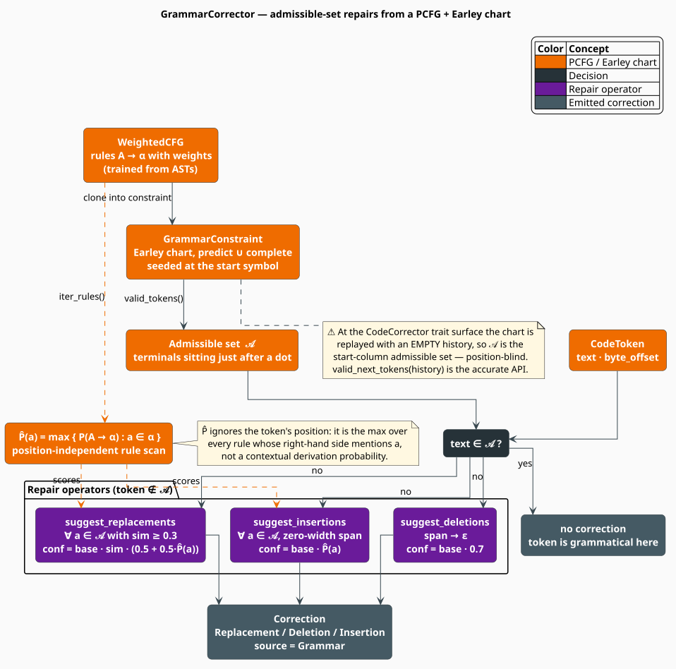

# Grammar Corrector: PCFG-Scored Structural Repairs

The **grammar corrector** answers a question the lexical corrector cannot even ask: *is this token
allowed to be here?* It drives an incremental **Earley parser** [[1]](#references) over a
**Probabilistic Context-Free Grammar** learned from a corpus of parsed code, reads off the set of
terminals the grammar would admit at the current parse position, and turns the mismatch between
"what is here" and "what was expected" into three kinds of repair — **replace** the token,
**delete** it, or **insert** the one that is missing. Rule probabilities rank the results, so the
repair the corpus makes most often is the repair offered first.

This is the *minimum-distance error-correcting parser* idea of Aho and Peterson
[[2]](#references), assembled from parts documented elsewhere: the grammar is a
[PCFG](../pcfg.md), and the chart is the one built for
[grammar-constrained decoding](../constrained-decoding.md).

> **Scope.** Source of truth: [`src/code/correctors/grammar.rs`](../../../../src/code/correctors/grammar.rs).
> The grammar type (`WeightedCFG`) and how it is trained: [PCFG](../pcfg.md). The Earley chart,
> its three inference rules, and the admissible-token set: [Constrained
> Decoding](../constrained-decoding.md). The corrections it emits are merged by the
> [Ensemble](ensemble.md).

## Notation

Symbols carried over from [PCFG](../pcfg.md) and [Constrained Decoding](../constrained-decoding.md)
are restated so this page stands alone.

| Symbol | Meaning |
|---|---|
| $`G = (V, \Sigma, R, S)`$ | the grammar: non-terminals, terminals, rules, start symbol |
| $`A \to \alpha`$ | a **production**; $`A \in V`$, $`\alpha \in (V \cup \Sigma)^{*}`$ |
| $`\mathbb{P}(A \to \alpha)`$ | the rule's probability, normalized per left-hand side |
| $`\tau`$ | a derivation (parse tree) |
| $`\mathcal{C}_i`$ | the Earley **chart column** after $`i`$ tokens |
| $`\mathcal{A}_i \subseteq \Sigma`$ | the **admissible set**: terminals legal at position $`i`$ |
| $`h`$ | a **token history**: the sequence of terminals consumed so far |
| $`o`$ | the observed token's text |
| $`a`$ | a candidate terminal, $`a \in \mathcal{A}`$ |
| $`\hat{P}(a)`$ | the corrector's **token score** for $`a`$ — see $`(\mathrm{G3})`$ |
| $`\beta_0`$ | `base_confidence`, default $`0.8`$ |
| $`\mathrm{sim}(a,b)`$ | character-bigram Jaccard similarity — see $`(\mathrm{G4})`$ |
| $`\varepsilon`$ | the empty string |

## Theory

### What the grammar knows

A PCFG assigns every derivation the product of the probabilities of the rules that built it
[[3]](#references):

```math
\mathbb{P}(\tau) \;=\; \prod_{(A \to \alpha) \,\in\, \tau} \mathbb{P}(A \to \alpha) \tag{G1}
```

Correction, therefore, has a clean formulation: among all token strings reachable from the observed
one by a bounded number of edits, prefer the one whose most probable derivation is most probable.
Aho and Peterson [[2]](#references) realized this exactly, by augmenting the grammar with
error productions and running a standard parser over the result.

libgrammstein does **not** implement that global search. It implements a **local, greedy**
approximation: at the position under repair it asks the chart a single question — which terminals
are admissible? — and proposes edits toward that set.

### The admissible set

An Earley item $`(A \to \alpha \bullet \beta,\, j)`$ records a partially matched rule; the chart
column $`\mathcal{C}_i`$ holds every item alive after $`i`$ tokens. The terminals that may legally
come next are the ones sitting immediately after a dot [[1]](#references):

```math
\mathcal{A}_i \;=\; \bigl\{\, a \in \Sigma \;:\; (A \to \alpha \bullet a\beta,\ j) \in \mathcal{C}_i \,\bigr\} \tag{G2}
```

`GrammarConstraint::valid_tokens` computes $`(\mathrm{G2})`$; `GrammarCorrector::valid_next_tokens`
wraps it, replaying a history $`h`$ through `advance` first. If any token of $`h`$ is rejected, the
parse is already off the rails and `valid_next_tokens` returns $`\emptyset`$ — an honest signal that
nothing downstream can be trusted.

The observed token is **grammatical** exactly when $`o \in \mathcal{A}`$; the corrector emits
nothing in that case. Otherwise it proposes repairs.

### Scoring a candidate terminal

To rank the members of $`\mathcal{A}`$, the corrector needs a score per terminal.
`token_probability` supplies one — and it is important to state precisely what it is, because it is
*not* a conditional probability:

```math
\hat{P}(a) \;=\; \max \bigl\{\, \mathbb{P}(A \to \alpha) \;:\; (A \to \alpha) \in R,\ a \text{ occurs in } \alpha \,\bigr\},
\qquad \max \emptyset = 0 \tag{G3}
```

Read that carefully. $`\hat{P}(a)`$ is the largest probability of **any** rule whose right-hand side
mentions $`a`$ **anywhere** — not the probability of $`a`$ given the parse state, not a marginal
over derivations, and not a function of position at all. The method even takes a `_context`
parameter and ignores it. $`\hat{P}`$ is a **static popularity prior** on terminals: a token that
appears in some very common production scores high, wherever it occurs. It is a defensible
tie-breaker and a poor probability; treating it as $`\mathbb{P}(a \mid h)`$ would be a mistake.

### Scoring a replacement

A replacement must also be *plausible as a typo*, so it is gated on orthographic similarity. The
corrector uses the **Jaccard index over character bigrams**:

```math
\mathrm{sim}(a,b) \;=\; \frac{\lvert B_a \cap B_b \rvert}{\lvert B_a \cup B_b \rvert},
\qquad
B_s \;=\; \bigl\{\, (s_i, s_{i+1}) \;:\; 1 \leq i < \lvert s \rvert \,\bigr\} \tag{G4}
```

with two special cases wired in: $`\mathrm{sim}(a,a) = 1`$, and if either string is a single
character (so its bigram set is empty) the similarity is $`1`$ if the strings are equal and $`0`$
otherwise. Note $`(\mathrm{G4})`$ is *not* a metric-derived similarity: distinct strings can score
$`1.0`$ when their bigram sets coincide (`aba` and `abab` both yield
$`\{(a,b), (b,a)\}`$). Candidates scoring below $`0.3`$ are discarded as too dissimilar to be a
credible typo.

### The three repair operators

Let $`\beta_0 = \texttt{base\_confidence}`$ (default $`0.8`$). For an observed token $`o`$ with
byte span $`[b_0, b_1)`$ and an admissible set $`\mathcal{A}`$:

```math
\begin{aligned}
\textbf{Replace: } & o \mapsto a \quad (a \in \mathcal{A},\ \mathrm{sim}(o,a) \geq 0.3), &
c_{\text{rep}}(a) &= \beta_0 \cdot \mathrm{sim}(o, a) \cdot \Bigl( \tfrac{1}{2} + \tfrac{1}{2}\hat{P}(a) \Bigr) \\[4pt]
\textbf{Delete: } & o \mapsto \varepsilon \quad \text{over } [b_0, b_1), &
c_{\text{del}} &= 0.7 \, \beta_0 \;=\; 0.56 \\[4pt]
\textbf{Insert: } & \varepsilon \mapsto a \quad \text{at } [b_0, b_0), &
c_{\text{ins}}(a) &= \beta_0 \cdot \hat{P}(a)
\end{aligned}
\tag{G5}
```

The replacement's $`\bigl(\tfrac{1}{2} + \tfrac{1}{2}\hat{P}\bigr)`$ factor is a **shrinkage** term:
it maps $`\hat{P} \in [0,1]`$ into $`[0.5, 1]`$, so a terminal that the grammar has never made
popular is halved rather than annihilated. Orthographic similarity, not rule popularity, therefore
dominates the replacement score — which is the right instinct, since $`\hat{P}`$ is the weaker
signal.

**Confidence bounds.** Every grammar correction satisfies $`c \leq \beta_0 = 0.8`$, with equality
approached only when $`\hat{P}(a) = 1`$ (insert) or $`\mathrm{sim} = \hat{P} = 1`$ (replace). Delete
is pinned at $`0.56`$. This ceiling matters: see
[the ensemble's calibration analysis](ensemble.md#calibration-what-actually-survives-the-default-thresholds).

## Honest status: an empty history at the trait surface

The theory above assumes the chart sits at the token's true parse position. **At the
`CodeCorrector` trait surface, it does not.**

`correct_token` obtains its admissible set with

```rust
let valid_tokens = self.valid_next_tokens(&[]);   // <- an EMPTY history
```

so the chart is freshly initialized, closed under prediction and completion at column $`0`$, and
never advanced. The set it returns is $`\mathcal{A}_0`$: the terminals that may begin a program.
Every token in the file is then judged against *that* set. The insertion path is worse still — it
calls `self.suggest_insertions(0, &[], "", token.byte_offset)`, hard-coding position $`0`$ and an
empty context.

The consequences are concrete and worth naming:

- For any token that is not a legal *program starter* — which is to say, nearly every token in a
  real file — $`o \notin \mathcal{A}_0`$ holds, and the corrector fires. It proposes replacing the
  token with a statement keyword, deleting it, and inserting a statement keyword before it.
- The corrector is therefore **noisy by construction** at this surface. It is saved in practice
  only by the ensemble's confidence floor, which (as it happens) discards *every* grammar
  correction unless a second source agrees with it.
- The source comment concedes the point: *"In practice, the pipeline should provide token history
  for better accuracy."* The [Pipeline](../pipeline.md) does not: it calls `correct_token` per
  token, passing a `TokenContext` that carries no history and that no corrector reads.

**The accurate API exists and is not what the trait calls.** Three methods take a real history and
behave exactly as the theory says:

| Method | Signature | Behavior |
|---|---|---|
| `valid_next_tokens` | `(&self, &[&str]) -> HashSet<String>` | replays the history, returns $`\mathcal{A}_{\lvert h \rvert}`$, or $`\emptyset`$ if the history is itself ungrammatical |
| `suggest_completions` | `(&self, &[&str], usize) -> Vec<(String, f64)>` | $`\mathcal{A}`$ ranked by $`\hat{P}`$, truncated |
| `find_syntax_errors` | `(&self, &[&str]) -> Vec<SyntaxError>` | walks a token stream, reporting the first position that the grammar rejects |

If you want grammar-aware correction that is actually position-aware, drive **these** — feed them
the token prefix — rather than `correct_token`.

### Three further discrepancies

1. **Two configuration fields are inert.** `GrammarCorrectorConfig::min_rule_probability` (default
   $`0.01`$) and `GrammarCorrectorConfig::max_lookahead` (default $`3`$) are declared, defaulted,
   and **never read**. `create_constraint` builds a `ConstrainedDecodingConfig::default()`, which
   carries its *own* `min_rule_probability` ($`10^{-10}`$) and `max_lookahead` ($`3`$). Setting the
   corrector's `min_rule_probability` to $`0.5`$ therefore prunes nothing; the lookahead agrees with
   the constraint's only by coincidence of defaults.

2. **`find_syntax_errors` reports at most one error.** The loop records a `SyntaxError` when
   `is_valid_token` fails, then calls `advance` — but `advance` consults the *same* admissible set
   and so must also fail, hitting the `break`. The "*Try to recover by skipping the token*" comment
   describes a recovery strategy that is not implemented. Expect a singleton `Vec`, not a full
   diagnostic list.

3. **Two `SyntaxErrorType` variants are never constructed.** `MissingToken` and
   `UnclosedDelimiter` exist in the enum (and in `SyntaxError::message`) but no code path produces
   them. Also note the naming of the two that *are* produced reads backwards:

   | Variant | Produced when | Plain reading of the name |
   |---|---|---|
   | `UnexpectedToken` | $`\mathcal{A} = \emptyset`$ — the parser is **stuck**; nothing at all can follow | suggests "this one token is a surprise" |
   | `InvalidToken` | $`\mathcal{A} \neq \emptyset`$ — something *could* follow, just not this | suggests "the token is malformed" |

## The algorithm, literately

Mirrors `correct_token` and the three `suggest_*` methods.

```
function correct_token(token):                        ▸ the CodeCorrector entry point
    𝒜 <- valid_next_tokens([])                        ▸ ⚠ EMPTY history: this is 𝒜₀, eq. (G2)
    if token.text ∈ 𝒜:
        return []                                     ▸ grammatical here; nothing to say
    corrections <- []
    corrections ++= suggest_replacements(token, 𝒜)
    corrections ++= suggest_deletions(token, 𝒜)
    corrections ++= suggest_insertions(0, [], "", token.byte_offset)
    return corrections                                ▸ NOT sorted or truncated as a whole

function suggest_replacements(token, 𝒜):              ▸ eq. (G5), replace
    for a in 𝒜 where a ≠ token.text:
        s <- string_similarity(token.text, a)         ▸ bigram Jaccard, eq. (G4)
        if s < 0.3: continue                          ▸ not a credible typo
        p <- token_probability(a, [])                 ▸ eq. (G3); full scan of every rule
        emit Correction {
            kind: Replacement, span: [off, off+len), original: token.text, replacement: a,
            confidence: base_confidence * s * (0.5 + 0.5*p),
            source: Grammar, context: "Grammar suggests '{a}'",
        }
    sort by confidence descending; truncate to max_candidates

function suggest_deletions(token, 𝒜):                 ▸ eq. (G5), delete
    if not config.suggest_deletions: return []
    if 𝒜 = ∅ or token.text ∉ 𝒜:                       ▸ (the caller already ensured the latter)
        emit Correction {
            kind: Deletion, span: [off, off+len), original: token.text, replacement: "",
            confidence: base_confidence * 0.7, source: Grammar, context: "Unexpected token",
        }

function suggest_insertions(position, context, _source, byte_position):   ▸ eq. (G5), insert
    if not config.suggest_insertions: return []
    for (a, p) in suggest_completions(context, max_candidates):           ▸ 𝒜 ranked by P̂
        emit Correction {
            kind: Insertion, span: [byte_position, byte_position),        ▸ zero-width!
            original: "", replacement: a,
            confidence: base_confidence * p, source: Grammar,
            context: "Expected token at position {position}",
        }

function token_probability(a, _context):              ▸ eq. (G3) — ignores _context entirely
    best <- 0
    for (production, _weight) in grammar.iter_rules():        ▸ O(|R|) every call
        for symbol in production.rhs:
            if symbol = Terminal(a):
                best <- max(best, grammar.probability(production))
    return best
```

Note that `correct_token` concatenates the three operators' outputs **without** a final sort or
truncation: `suggest_replacements` truncates to `max_candidates` internally, `suggest_insertions`
truncates via `suggest_completions`, and `suggest_deletions` adds at most one. A single token can
thus yield up to $`2 \cdot \texttt{max\_candidates} + 1`$ corrections ($`11`$ by default). Ranking
is left to the [Ensemble](ensemble.md).



*Figure 1. The PCFG seeds an Earley chart; the chart yields the admissible terminal set
$`\mathcal{A}`$. A token outside $`\mathcal{A}`$ triggers the three repair operators of
$`(\mathrm{G5})`$, each scored with $`\beta_0`$, the bigram similarity, and the static token score
$`\hat{P}`$. The two warnings mark exactly where the implementation departs from the theory.*

## Engineering

### Types

```rust
pub struct GrammarCorrectorConfig {
    pub max_candidates: usize,       // default 5
    pub min_rule_probability: f64,   // default 0.01  -- INERT, never read
    pub suggest_insertions: bool,    // default true
    pub suggest_deletions: bool,     // default true
    pub max_lookahead: usize,        // default 3     -- INERT, never read
    pub base_confidence: f64,        // default 0.8   (the beta_0 of G5)
}

pub struct GrammarCorrector<L: CodeLanguage> {
    language: Arc<L>,
    config: GrammarCorrectorConfig,
    grammar: WeightedCFG,            // owned, immutable after construction
}

pub struct SyntaxError {
    pub position: usize,             // index into the token stream
    pub token: String,
    pub expected: HashSet<String>,   // the admissible set at that position
    pub error_type: SyntaxErrorType,
}
```

`CodeCorrector::max_edit_distance` is hard-coded to $`2`$ here — it does **not** consult the config
— and `name()` returns `"GrammarCorrector"`.

### The cost of a correction

Every call to `create_constraint` **clones the entire `WeightedCFG`**: its rule `HashMap`, its
`rules_by_lhs` index, and every `Vec<Symbol>` inside every `Production`. `correct_token` calls it
once (via `valid_next_tokens`), and `suggest_insertions` calls it again (via
`suggest_completions` → `valid_next_tokens`). Correcting one token therefore deep-copies the grammar
**twice**.

Let $`\lvert R \rvert`$ be the rule count, $`a`$ the mean arity, $`\lvert \mathcal{A} \rvert`$ the
admissible-set size, and $`m`$ the token length.

| Operation | Cost | Note |
|---|---|---|
| `create_constraint` | $`O(\lvert R \rvert \cdot a)`$ **time and allocation** | a full deep clone of the grammar |
| chart `initialize` | $`O(\lvert \mathcal{C}_0 \rvert)`$ | predict/complete closure at column $`0`$ |
| `valid_tokens` | $`O(\lvert \mathcal{C} \rvert)`$ | one column scan, then cached |
| `token_probability` | $`O(\lvert R \rvert \cdot a)`$ | **a full rule scan, per candidate** |
| `string_similarity` | $`O(m + m')`$ | two bigram `HashSet`s, pre-sized |
| `suggest_replacements` | $`O\bigl(\lvert \mathcal{A} \rvert \cdot (m + \lvert R \rvert a)\bigr)`$ | dominated by `token_probability` |
| `suggest_completions` | $`O\bigl(\lvert R \rvert a + \lvert \mathcal{A} \rvert \cdot \lvert R \rvert a\bigr)`$ | clone, then score every admissible terminal |
| **`correct_token`** | $`O\bigl(\lvert R \rvert a \cdot (1 + \lvert \mathcal{A} \rvert)\bigr)`$ | the module's hot spot |
| `find_syntax_errors` over $`n`$ tokens | $`O(n^3)`$ worst case | Earley's bound [[1]](#references) |

Two optimizations are obvious and neither requires changing the API's shape: **memoize
$`\hat{P}`$** in a `HashMap<String, f64>` built once from `iter_rules` (turning the
$`\lvert \mathcal{A} \rvert \cdot \lvert R \rvert a`$ term into $`\lvert \mathcal{A} \rvert`$
lookups), and hold the grammar behind an `Arc` so `GrammarConstraint` can borrow rather than clone
it.

### Concurrency

`GrammarCorrector<L>` is `Send + Sync` when `L` is, and every correction method takes `&self` — the
per-call `GrammarConstraint` is a fresh local, so there is no shared mutable parse state and no
lock. The price of that thread-safety is precisely the grammar clone described above.

## Usage

Train a grammar (see [PCFG](../pcfg.md)), then correct with the **history-aware** API:

```rust
use libgrammstein::code::correctors::grammar::{GrammarCorrector, GrammarCorrectorConfig};
use libgrammstein::code::pcfg::{Production, Symbol, WeightedCFG};
use libgrammstein::code::Python;
use std::sync::Arc;

// A toy grammar:  stmt -> "return" expr ";"  |  expr ";"       expr -> "x" | "y"
let mut cfg = WeightedCFG::new("stmt");
cfg.add_rule(
    Production::new("stmt", vec![
        Symbol::terminal("return"),
        Symbol::non_terminal("expr"),
        Symbol::terminal(";"),
    ]),
    3.0,
);
cfg.add_rule(
    Production::new("stmt", vec![Symbol::non_terminal("expr"), Symbol::terminal(";")]),
    1.0,
);
cfg.add_rule(Production::new("expr", vec![Symbol::terminal("x")]), 1.0);
cfg.add_rule(Production::new("expr", vec![Symbol::terminal("y")]), 1.0);

let python = Arc::new(Python::new());
let corrector = GrammarCorrector::with_defaults(Arc::clone(&python), cfg);

// The admissible set at the start of a statement, eq. (G2).
let start = corrector.valid_next_tokens(&[]);
assert!(start.contains("return"));

// After "return", an expression must follow.
let after_return = corrector.valid_next_tokens(&["return"]);
assert!(after_return.contains("x") && after_return.contains("y"));

// Rank the legal continuations by the static token score, eq. (G3).
for (token, score) in corrector.suggest_completions(&["return"], 5) {
    println!("{token}  P-hat = {score:.3}");
}

// Locate the first position the grammar rejects (at most one error is reported).
for err in corrector.find_syntax_errors(&["return", "z", ";"]) {
    println!("{}", err.message()); // Invalid token 'z', expected one of: 'x', 'y'
}
```

Tune the operators with the config — the two live switches are the insertion and deletion toggles:

```rust
let config = GrammarCorrectorConfig {
    max_candidates: 3,
    suggest_insertions: false, // replacements and deletions only
    base_confidence: 0.9,      // raise the ceiling of (G5) from 0.8 to 0.9
    ..Default::default()
};
```

Raising `base_confidence` is the one lever that lifts grammar corrections above the ensemble's
default confidence floor on their own; $`\beta_0 \geq 0.858`$ is required, as derived in
[Ensemble](ensemble.md#calibration-what-actually-survives-the-default-thresholds).

## References

1. J. Earley (1970). *An efficient context-free parsing algorithm.* Communications of the ACM
   13(2), 94–102. [doi:10.1145/362007.362035](https://doi.org/10.1145/362007.362035)
2. A. V. Aho & T. G. Peterson (1972). *A Minimum Distance Error-Correcting Parser for Context-Free
   Languages.* SIAM Journal on Computing 1(4), 305–312.
   [doi:10.1137/0201022](https://doi.org/10.1137/0201022)
3. T. L. Booth & R. A. Thompson (1973). *Applying probability measures to abstract languages.* IEEE
   Transactions on Computers C-22(5), 442–450.
   [doi:10.1109/T-C.1973.223746](https://doi.org/10.1109/T-C.1973.223746)
4. P. Jaccard (1912). *The distribution of the flora in the alpine zone.* New Phytologist 11(2),
   37–50. [doi:10.1111/j.1469-8137.1912.tb05611.x](https://doi.org/10.1111/j.1469-8137.1912.tb05611.x)

## See also

- [Correctors Overview](overview.md) — the shared `CodeCorrector` contract
- [PCFG](../pcfg.md) — how `WeightedCFG` is trained and normalized
- [Constrained Decoding](../constrained-decoding.md) — the Earley chart, predict/scan/complete, and $`\mathcal{A}_i`$
- [Lexical Corrector](lexical.md) — the orthographic signal this corrector only approximates with bigrams
- [Ensemble Corrector](ensemble.md) — why grammar corrections need a corroborating source by default
- [Pipeline](../pipeline.md) — the driver that calls `correct_token` without a history
