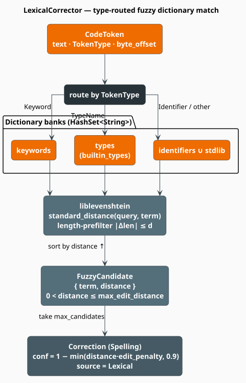

# Lexical Corrector: Fuzzy Dictionary Matching

The **lexical corrector** answers the narrowest and most useful question in code correction: *is
this token a misspelling of something I know?* It keeps four dictionaries of legitimate strings —
keywords, builtin types, standard-library functions, and the project's own identifiers — routes
each token to the dictionary appropriate to its `TokenType`, and returns every entry within a
small **edit distance**, ranked by how few edits it took. `retrun` becomes `return`; `calulateTotal`
becomes `calculateTotal`.

> **Scope.** Source of truth: [`src/code/correctors/lexical.rs`](../../../../src/code/correctors/lexical.rs).
> The token taxonomy it routes on is defined in [Language](../language.md) and produced by the
> [Tokenizer](../tokenizer.md); the `Correction` it emits is described in
> [Correction](../correction.md). Its output is weighted and merged by the
> [Ensemble](ensemble.md).

## Notation

| Symbol | Meaning |
|---|---|
| $`\Sigma`$ | the alphabet (Unicode scalar values) |
| $`q \in \Sigma^{*}`$ | the **query**: the token's text, possibly misspelled |
| $`t \in \Sigma^{*}`$ | a **term**: one entry of a dictionary |
| $`D \subseteq \Sigma^{*}`$ | a **dictionary**: a finite set of valid terms |
| $`d_L(a,b)`$ | the **Levenshtein distance** between $`a`$ and $`b`$ |
| $`d`$ | the maximum edit distance considered, `max_edit_distance` (default $`2`$) |
| $`p`$ | the **edit penalty**, `edit_penalty` (default $`0.15`$) |
| $`c`$ | the confidence assigned to a candidate, in $`[0,1]`$ |
| $`\lvert a \rvert`$ | the length of string $`a`$ |
| $`\varepsilon`$ | the empty string |

## Theory

### Levenshtein distance

The **Levenshtein distance** $`d_L(a,b)`$ is the minimum number of single-character
**insertions**, **deletions**, and **substitutions** that transform $`a`$ into $`b`$
[[1]](#references). It is computed by the Wagner–Fischer dynamic program [[2]](#references): let
$`m = \lvert a \rvert`$, $`n = \lvert b \rvert`$, and let $`D_{i,j}`$ be the distance between the
length-$`i`$ prefix of $`a`$ and the length-$`j`$ prefix of $`b`$. Then

```math
\begin{array}{lr}
\displaystyle D_{i,j} =
\begin{cases}
i & j = 0 \\
j & i = 0 \\
\min \begin{cases}
  D_{i-1,j} + 1 & \text{(delete } a_i \text{)} \\
  D_{i,j-1} + 1 & \text{(insert } b_j \text{)} \\
  D_{i-1,j-1} + \mathbb{1}\bigl[a_i \neq b_j\bigr] & \text{(substitute / match)}
\end{cases} & \text{otherwise}
\end{cases} & \text{(L1)}
\end{array}
```

and $`d_L(a,b) = D_{m,n}`$. Note that a **transposition** is *not* a primitive: `pritn` and
`print` are at distance $`2`$, not $`1`$ — a fact the corrector's tests pin down explicitly. If
transpositions matter for your error model, the Damerau–Levenshtein variant is the one to want;
libgrammstein does not use it here.

### The correction problem, and the automaton that solves it

What the corrector actually needs is not one distance but a **set**: every dictionary term within
$`d`$ of the query.

```math
\begin{array}{lr}
\displaystyle \mathcal{M}(q, d) \;=\; \bigl\{\, t \in D \;:\; 0 < d_L(q,t) \leq d \,\bigr\} & \text{(L2)}
\end{array}
```

The strict lower bound $`0 < d_L`$ excludes the query itself: a token that is *already* in the
dictionary is spelled correctly and yields no correction.

The classical way to compute $`(\mathrm{L2})`$ without touching every term is the **Levenshtein
automaton**. For a fixed query $`q`$ and bound $`d`$ there is a nondeterministic finite automaton
$`A(q,d)`$ whose language is exactly the set of strings within $`d`$ edits of $`q`$:

```math
\begin{array}{lr}
\displaystyle L\bigl(A(q,d)\bigr) \;=\; \bigl\{\, t \in \Sigma^{*} \;:\; d_L(q,t) \leq d \,\bigr\} & \text{(L3)}
\end{array}
```

so that $`\mathcal{M}(q,d) = \bigl( D \cap L(A(q,d)) \bigr) \setminus \{q\}`$ — a **language
intersection**. Schulz and Mihov [[3]](#references) showed that one can go further and precompute a
single **universal** deterministic automaton for each $`d`$, independent of $`q`$: the query enters
only through the *characteristic vectors* that drive the transitions. Intersecting that automaton
with a dictionary stored as a trie or DAWG explores only the trie nodes reachable within $`d`$
edits, making a lookup cost roughly $`O(\lvert q \rvert \cdot d)`$ state transitions and **entirely
independent of $`\lvert D \rvert`$**. This is precisely the machinery liblevenshtein exists to
provide (its `DynamicDawg`, `DoubleArrayTrie`, and transducers).

### Confidence

A candidate's confidence decays linearly with the number of edits required, floored so that even a
distant match keeps a little mass:

```math
\begin{array}{lr}
\displaystyle c(d_L) \;=\; 1 \;-\; \min\bigl(d_L \cdot p,\; 0.9\bigr), \qquad p = \texttt{edit\_penalty} & \text{(L4)}
\end{array}
```

With the defaults ($`p = 0.15`$, $`d \leq 2`$) only two values are reachable:

| $`d_L(q,t)`$ | $`c`$ | Interpretation |
|---|---|---|
| $`1`$ | $`0.85`$ | one edit away — the overwhelmingly common typo |
| $`2`$ | $`0.70`$ | two edits — includes every transposition |

The $`0.9`$ clamp puts a floor of $`c = 0.1`$ on the confidence, but it only binds at
$`d_L \geq 6`$, which `max_edit_distance = 2` makes unreachable. It is dead code today and live
insurance if the bound is ever raised.

**Proposition (ranking by distance is ranking by confidence).** On the reachable range
$`d_L \cdot p < 0.9`$, $`(\mathrm{L4})`$ is strictly decreasing in $`d_L`$. Therefore sorting
candidates by ascending distance and truncating to the first `max_candidates` yields exactly the
`max_candidates` highest-confidence corrections. This is why `fuzzy_search` can sort by the integer
key `distance` and `correct_token` can simply `take(max_candidates)` — no float comparison is
needed on the hot path.

### The length prefilter is sound

Before computing any distance, `fuzzy_search` discards terms whose length differs from the query's
by more than $`d`$. This is not a heuristic; it is an **admissible filter**, and the reason is a
one-line lemma.

**Lemma.** For all $`a, b \in \Sigma^{*}`$,
$`d_L(a,b) \;\geq\; \bigl\lvert\, \lvert a \rvert - \lvert b \rvert \,\bigr\rvert`$.

*Proof.* Each primitive edit changes a string's length by at most one: an insertion by $`+1`$, a
deletion by $`-1`$, a substitution by $`0`$. An optimal edit script transforming $`a`$ into $`b`$
consists of exactly $`d_L(a,b)`$ such operations, so the total length change it effects is bounded
in magnitude by the number of operations:
$`\bigl\lvert \lvert a \rvert - \lvert b \rvert \bigr\rvert \leq d_L(a,b)`$. $`\blacksquare`$

**Corollary.** If $`\bigl\lvert \lvert q \rvert - \lvert t \rvert \bigr\rvert > d`$ then
$`d_L(q,t) > d`$, so $`t \notin \mathcal{M}(q,d)`$ and it may be skipped without computing
$`(\mathrm{L1})`$. The filter never discards a true match. $`\blacksquare`$

## Honest status: a linear scan, not an automaton

Everything in $`(\mathrm{L3})`$ is true, and none of it is what the shipped corrector does.

`LexicalCorrector::levenshtein_distance` delegates to
`liblevenshtein::distance::standard_distance` — a **pairwise** distance function, taking a
bit-parallel Myers path [[4]](#references) for ASCII inputs of at most 64 bytes and a
character-based path otherwise. `fuzzy_search` then calls it **once per dictionary term, in a
linear scan over a `HashSet<String>`**:

```rust
for term in dictionary {
    let len_diff = (query.len() as isize - term.len() as isize).unsigned_abs();
    if len_diff > max_dist { continue; }               // the sound prefilter, Corollary above
    let distance = Self::levenshtein_distance(query, term);
    if distance > 0 && distance <= max_dist { /* keep */ }
}
```

So the cost of a lookup is $`\Theta(\lvert D \rvert)`$ prefilter tests plus a full DP for each term
that survives them — proportional to the dictionary size, exactly what the universal automaton was
invented to avoid. The dictionaries are `HashSet<String>`, not the tries and DAWGs
(`DynamicDawg`, `DoubleArrayTrie`) that liblevenshtein ships for this purpose, so the automaton
intersection cannot be run against them as they stand.

This is a real, working corrector — keyword and type dictionaries hold tens to low hundreds of
entries, and a linear scan over them is genuinely fast. It becomes the bottleneck only as the
*identifier* dictionary grows, since `add_identifiers_from_source` will happily ingest every
distinct word in a large codebase. **Migrating the dictionaries to a liblevenshtein trie and
querying them through a Levenshtein transducer is the single highest-value optimization available
in this module**, and the confidence and routing logic above would survive it untouched.

### A second, subtler defect: bytes versus characters

The prefilter compares `query.len()` and `term.len()` — **byte** lengths — while
`standard_distance` counts **characters**. The Lemma is a statement about character lengths, so
applying it to byte lengths breaks soundness for non-ASCII identifiers, which Python, Rust, and
JavaScript all permit. Concretely, with $`d = 2`$:

| $`q`$ | $`t`$ | $`d_L`$ (chars) | byte-length difference | Outcome |
|---|---|---|---|---|
| `cafe` | `café` | $`1`$ | $`1`$ | kept — correct |
| `日本語` | `日本` | $`1`$ | $`3`$ | **pruned — a true match is lost** |

`min_token_length` compares byte lengths too, so a short non-ASCII token is more likely to be
skipped than an ASCII one of the same character length. Both would be fixed by measuring in
`chars().count()`; neither affects ASCII-only code, which is why they have gone unnoticed.

## The algorithm, literately

The following mirrors `correct_token`, `get_candidates`, and `fuzzy_search`. The notation
$`\langle \dots \rangle`$ names a refinement expanded below.

```
function correct_token(token):                        ▸ the CodeCorrector entry point
    if byte_length(token.text) < min_token_length:    ▸ default 2; skips "x", "i", ...
        return []
    candidates <- get_candidates(token.text, token.token_type)
    return [ candidate_to_correction(c, token) for c in candidates[.. max_candidates] ]

function get_candidates(q, token_type):               ▸ route by token type, eq. (L2)
    match token_type:
        Keyword    -> fuzzy_search(q, keywords)
        TypeName   -> fuzzy_search(q, types)
        Identifier -> ⟨Search identifiers, then stdlib⟩
        _          -> ⟨Search all four dictionaries⟩

⟨Search identifiers, then stdlib⟩ ≡
    cands <- fuzzy_search(q, identifiers) ++ fuzzy_search(q, stdlib)
    dedup cands by term, keeping the FIRST occurrence   ▸ project identifiers beat stdlib on ties
    re-sort cands by distance ascending
    return cands

⟨Search all four dictionaries⟩ ≡                       ▸ reached by correct_range, TokenType::Unknown
    cands <- fuzzy_search(q, keywords) ++ fuzzy_search(q, identifiers)
          ++ fuzzy_search(q, types)    ++ fuzzy_search(q, stdlib)
    dedup by term, re-sort by distance ascending
    return cands

function fuzzy_search(q, D):                           ▸ THE LINEAR SCAN (see Honest status)
    for t in D:                                        ▸ iteration order of a HashSet: arbitrary
        if | byte_len(q) - byte_len(t) | > max_edit_distance:
            continue                                   ▸ sound prune, by the Corollary
        k <- standard_distance(q, t)                   ▸ liblevenshtein; bit-parallel for ASCII
        if 0 < k <= max_edit_distance:                 ▸ 0 excluded: an exact hit is not an error
            emit FuzzyCandidate { term: t, distance: k }
    sort candidates by distance ascending               ▸ = by confidence descending, Proposition
    return candidates

function candidate_to_correction(cand, token):
    c <- 1 - min(cand.distance * edit_penalty, 0.9)     ▸ eq. (L4)
    return Correction {
        kind:        Spelling,
        span:        [token.byte_offset, token.byte_offset + byte_len(token.text)),
        original:    token.text,
        replacement: cand.term,
        confidence:  c,
        source:      Lexical,
        context:     "Edit distance: {cand.distance}",
    }
```

Because the `HashSet` iteration order is arbitrary, ties at equal distance are broken
nondeterministically between runs (Rust's default hasher is randomly seeded per process). If you
need a stable ranking among equidistant candidates, sort the final list by `(distance, term)`.

## Engineering

### The four dictionaries

Three are populated from the `CodeLanguage` at construction; the fourth is yours to fill.

| Field | Populated from | Typical size | Reached by `TokenType` |
|---|---|---|---|
| `keywords` | `language.keywords()` | tens | `Keyword` |
| `types` | `language.builtin_types()` | tens | `TypeName` |
| `stdlib` | `language.stdlib_functions()` | tens–hundreds | `Identifier` |
| `identifiers` | **you** — starts empty | unbounded | `Identifier` |

Three methods grow the identifier set, all `&mut self` and all gated on
`CodeLanguage::is_valid_identifier`:

- `add_identifier(&str)` — one name;
- `add_identifiers_from_tokens(&[CodeToken])` — every token whose type is `Identifier`;
- `add_identifiers_from_source(&str)` — splits the raw text on any character that is neither
  alphanumeric nor `_`, and inserts every valid fragment. This is a blunt instrument: it will
  ingest words from comments and strings as readily as from code.

`keyword_count()` and `identifier_count()` report the sizes; `language()` and `config()` expose the
rest.

### Configuration

```rust
pub struct LexicalCorrectorConfig {
    pub max_edit_distance: usize, // default 2    (the d in L2/L3)
    pub min_token_length: usize,  // default 2    (skip 1-char tokens entirely)
    pub max_candidates: usize,    // default 5    (per token)
    pub edit_penalty: f64,        // default 0.15 (the p in L4)
}
```

`max_edit_distance` is also what `CodeCorrector::max_edit_distance` returns, overriding the trait's
default of $`2`$ with the configured value.

### Complexity

Let $`m = \lvert q \rvert`$, let $`\bar{n}`$ be the mean term length, $`w`$ the machine word size
(64), and $`D`$ the dictionary actually searched.

| Operation | Cost | Note |
|---|---|---|
| length prefilter | $`O(\lvert D \rvert)`$ | one integer compare per term; no allocation |
| one surviving distance | $`O(m \bar{n} / w)`$ ASCII, $`O(m\bar{n})`$ otherwise | bit-parallel Myers [[4]](#references) |
| `fuzzy_search` | $`O\bigl(\lvert D \rvert \cdot (1 + m\bar{n}/w)\bigr)`$ | the linear scan |
| sort candidates | $`O(k \log k)`$ | $`k`$ = survivors, usually tiny |
| `correct_token` (`Identifier`) | two scans + dedup | `identifiers` then `stdlib` |
| `correct_token` (`Unknown`) | **four** scans + dedup | the `correct_range` path |
| *automaton alternative* | $`O(m \cdot d)`$ transitions | independent of $`\lvert D \rvert`$ [[3]](#references) |

Memory is $`O(\sum_{t \in D} \lvert t \rvert)`$ — every term is an owned `String`, stored once per
dictionary. `FuzzyCandidate` clones the matched term, so a scan allocates once per survivor.

### Concurrency

`LexicalCorrector<L>` is `Send + Sync` whenever `L` is, and `correct_token` / `correct_range` take
`&self`: build the dictionaries once, wrap in `Arc`, and correct from any number of threads. The
`add_*` methods take `&mut self` and must therefore run before sharing.



*Figure 1. A token is routed to the dictionary bank matching its `TokenType`; every term surviving
the length prefilter is scored with `standard_distance`; survivors within `max_edit_distance`
become `Spelling` corrections whose confidence decays with distance, per $`(\mathrm{L4})`$.*

## Usage

```rust
use libgrammstein::code::correction::CodeCorrector;
use libgrammstein::code::correctors::lexical::{LexicalCorrector, LexicalCorrectorConfig};
use libgrammstein::code::language::{TokenContext, TokenType};
use libgrammstein::code::tokenizer::CodeToken;
use libgrammstein::code::Python;
use std::sync::Arc;

let python = Arc::new(Python::new());

// Tighten the penalty so distance-2 hits stay competitive, and widen the candidate list.
let config = LexicalCorrectorConfig {
    max_edit_distance: 2,
    min_token_length: 3,
    max_candidates: 8,
    edit_penalty: 0.10, // d=1 -> 0.90, d=2 -> 0.80
};
let mut corrector = LexicalCorrector::new(Arc::clone(&python), config);

// Teach it the project's vocabulary (both take &mut self).
corrector.add_identifier("calculate_total");
corrector.add_identifiers_from_source("def process_batch(records): ...");

// Keywords are already loaded from the language.
let token = CodeToken::new("calulate_total", 4, 1, 4, TokenType::Identifier, "identifier");
let context = TokenContext::new(TokenType::Identifier);

for c in corrector.correct_token(&token, &context) {
    // "calulate_total" -> "calculate_total", distance 1, confidence 0.90
    println!("{} -> {} ({:.2}) [{}]", c.original, c.replacement, c.confidence,
             c.context.as_deref().unwrap_or(""));
}

assert!(corrector.identifier_count() >= 1);
```

A token already present in its dictionary produces **no** correction — the $`0 < d_L`$ guard in
$`(\mathrm{L2})`$ — so a correctly spelled `return` is silently left alone.

## References

1. V. I. Levenshtein (1966). *Binary codes capable of correcting deletions, insertions, and
   reversals.* Soviet Physics Doklady 10(8), 707–710.
2. R. A. Wagner & M. J. Fischer (1974). *The String-to-String Correction Problem.* Journal of the
   ACM 21(1), 168–173. [doi:10.1145/321796.321811](https://doi.org/10.1145/321796.321811)
3. K. U. Schulz & S. Mihov (2002). *Fast string correction with Levenshtein automata.*
   International Journal on Document Analysis and Recognition 5(1), 67–85.
   [doi:10.1007/s10032-002-0082-8](https://doi.org/10.1007/s10032-002-0082-8)
4. G. Myers (1999). *A fast bit-vector algorithm for approximate string matching based on dynamic
   programming.* Journal of the ACM 46(3), 395–415.
   [doi:10.1145/316542.316550](https://doi.org/10.1145/316542.316550)

## See also

- [Correctors Overview](overview.md) — the shared `CodeCorrector` contract
- [Grammar Corrector](grammar.md) — the structural signal that lexical matching cannot see
- [Semantic Corrector](semantic.md) — which reuses Levenshtein for *name* similarity
- [Ensemble Corrector](ensemble.md) — how `Spelling` corrections are weighted against the rest
- [Language](../language.md) — `TokenType` and the `keywords` / `builtin_types` / `stdlib_functions` sources
- [Tokenizer](../tokenizer.md) — where `CodeToken` and its `byte_offset` come from
