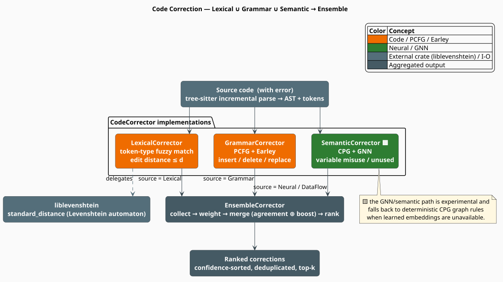

# Code Correctors: A Three-Signal Ensemble

A **corrector** turns a suspicious span of source code into a ranked list of concrete edits.
libgrammstein ships four: three that each look at the program through one lens — **lexical**
(is this token spelled like something in the dictionary?), **grammar** (is this token allowed by
the grammar here?), and **semantic** (does this token *mean* the right thing?) — and an
**ensemble** that fuses their proposals into one confidence-ordered list. This page defines the
shared contract every corrector implements, the formal model of a correction, and — critically —
an honest account of what the shipped implementations actually compute.

> **Scope.** Source of truth: [`src/code/correctors/mod.rs`](../../../../src/code/correctors/mod.rs)
> and the four modules it re-exports. The data model lives in [Correction](../correction.md); the
> driver that feeds these correctors is the [Pipeline](../pipeline.md). Each corrector has its own
> page: [Lexical](lexical.md), [Grammar](grammar.md), [Semantic](semantic.md),
> [Ensemble](ensemble.md).

## Acronyms and notation

Every symbol used below is defined here before its first use.

| Symbol / Acronym | Expansion | Meaning here |
|---|---|---|
| **AST** | Abstract Syntax Tree | tree-sitter's parse tree (see [AST](../ast.md)) |
| **CPG** | Code Property Graph | fused AST + control-flow + data-flow graph [[3]](#references) |
| **PCFG** | Probabilistic Context-Free Grammar | grammar with rule probabilities (see [PCFG](../pcfg.md)) |
| **GNN** | Graph Neural Network | message-passing scorer over the CPG [[4]](#references) |
| $`S`$ | — | the source text, a byte string |
| $`t`$ | — | a `CodeToken`: text, `TokenType`, and byte offset |
| $`\mathcal{S}`$ | — | the set of correction sources, $`\{\text{lex}, \text{gram}, \text{sem}\}`$ |
| $`x`$ | — | a single `Correction` |
| $`c(x) \in [0,1]`$ | — | the confidence attached to $`x`$ |
| $`\mathcal{X}_s(t)`$ | — | the candidate corrections proposed by source $`s`$ for token $`t`$ |
| $`d_L(a,b)`$ | — | the Levenshtein distance between strings $`a`$ and $`b`$ |
| $`D`$ | — | a dictionary: a finite set of valid strings |
| $`\varepsilon`$ | — | the empty string |

## What & why

The three correctors exist because they **fail independently**. A token-level fuzzy matcher will
happily repair `retrun` to `return`, but it cannot notice that a perfectly-spelled `total` should
have been `subtotal`. A grammar checker knows a `)` is missing but has no opinion about identifier
spelling. A data-flow analysis sees that a binding is never read but cannot tell you how to spell
it. Combining estimators whose errors are weakly correlated is the classical justification for
ensembles [[5]](#references), and it is exactly the structure a compiler front-end already
suggests:

| Stratum | Question it answers | Signal | Page |
|---|---|---|---|
| **Lexical** | Is this token *spelled* like a known one? | edit distance to a dictionary | [Lexical](lexical.md) |
| **Grammar** | Is this token *allowed* here? | PCFG rule probabilities via an Earley chart | [Grammar](grammar.md) |
| **Semantic** | Does this token *mean* the right thing? | CPG graph rules + name similarity | [Semantic](semantic.md) |
| **Ensemble** | Which repair should the user see first? | weighted aggregation + agreement boost | [Ensemble](ensemble.md) |

## The contract

Every corrector implements one trait ([`correction.rs`](../../../../src/code/correction.rs)). Both
correction methods take `&self`, so a corrector is immutable while correcting and therefore
shareable across threads:

```rust
pub trait CodeCorrector: Send + Sync {
    fn correct_token(&self, token: &CodeToken, context: &TokenContext) -> Vec<Correction>;
    fn correct_range(&self, source: &str, start_byte: usize, end_byte: usize) -> Vec<Correction>;
    fn max_edit_distance(&self) -> usize { 2 }   // provided default
    fn name(&self) -> &str;
}
```

### A correction, formally

A `Correction` is a **span replacement** carrying provenance and a confidence:

```math
x = \bigl(\, \kappa,\ [b_0, b_1),\ o,\ r,\ c,\ s \,\bigr) \tag{C1}
```

where $`\kappa`$ is the `CorrectionKind`, $`[b_0, b_1)`$ a half-open **byte** range into the
source, $`o`$ the original text $`S[b_0 \mathbin{..} b_1)`$, $`r`$ the replacement,
$`c \in [0,1]`$ the confidence, and $`s`$ the `CorrectionSource`. Applying it splices $`r`$ over
the span — exactly `Correction::apply`:

```math
\mathrm{apply}(x, S) \;=\; S[0 \mathbin{..} b_0) \;\cdot\; r \;\cdot\; S[b_1 \mathbin{..} \lvert S \rvert) \tag{C2}
```

Two degenerate spans are meaningful and both are used: $`b_0 = b_1`$ is a pure **insertion**
(zero-width span, $`o = \varepsilon`$), and $`r = \varepsilon`$ is a pure **deletion**. A
correction with $`o = r`$ is a **no-op**, reported by `Correction::is_noop` — the semantic
corrector deliberately emits one as an advisory (see [Semantic](semantic.md)).

`Correction::edit_distance` reports $`d_L(o, r)`$ via `liblevenshtein::distance::standard_distance`;
`Correction::with_confidence` clamps its argument into $`[0,1]`$.

### Kinds and sources

`CorrectionKind` says *what* changed; `CorrectionSource` says *who* proposed it. They are
independent axes, and the ensemble's agreement logic keys on neither — it keys on the **edit
itself** (see [Ensemble](ensemble.md)).

| `CorrectionKind` | Emitted by | Meaning |
|---|---|---|
| `Spelling` | lexical | token is a near-miss of a dictionary entry |
| `Insertion` | grammar | a token is missing at this position |
| `Deletion` | grammar, semantic | this token or binding should be removed |
| `Replacement` | grammar | swap this token for a grammatical one |
| `VariableMisuse` | semantic | wrong in-scope variable |
| `TypeError` | semantic | type mismatch |
| `Other` | semantic | advisory (e.g. "consider adding error handling") |
| `SyntaxError`, `MissingImport`, `Formatting` | — | declared in the taxonomy; no corrector emits them today |

`CorrectionKind::is_semantic` returns `true` for exactly `VariableMisuse`, `TypeError`, and
`MissingImport`. `CorrectionSource` has eight variants: `Lexical`, `Grammar`, `Neural`,
`TypeInference`, `ControlFlow`, `DataFlow`, `Combined`, and `Unknown`. Note that the semantic
corrector spreads its output across **four** of them (`Neural`, `TypeInference`, `ControlFlow`,
`DataFlow`) depending on the issue it found, and the ensemble rewrites any merged correction's
source to `Combined`.

### Candidate sets and ranking

For a token $`t`$, each source contributes a candidate set and the ensemble ranks their union:

```math
\mathcal{X}(t) \;=\; \bigcup_{s \in \mathcal{S}} \mathcal{X}_s(t),
\qquad
\text{output} \;=\; \text{top-}K \bigl\{\, x \in \mathcal{X}(t) \;:\; \hat{c}(x) \geq \theta \,\bigr\} \tag{C3}
```

ordered by descending aggregated confidence $`\hat{c}`$, where $`\theta`$ is `min_confidence` and
$`K`$ is `max_candidates`. The aggregation $`\hat{c}`$ is defined in [Ensemble](ensemble.md).
`CorrectionCandidates` (in [`correction.rs`](../../../../src/code/correction.rs)) is the bounded,
always-sorted container maintaining this invariant: every `add` re-sorts by descending confidence
and truncates to `max_candidates` (default $`10`$), treating `NaN` as `Equal` so one bad score
cannot panic the pipeline.



*Figure 1. One parse feeds all three correctors. Each tags its output with a `CorrectionSource`;
the `EnsembleCorrector` groups proposals by the edit they describe, boosts those that several
sources independently agree on, and emits a ranked, deduplicated list.*

## Honest status: what actually runs

The module's own doc comments describe an aspiration ("*Semantic*: GNN/embedding-based semantic
analysis"). The shipped code is more modest, and this documentation set describes the code. Three
gaps are worth stating up front; each is developed rigorously on its own page.

1. **Lexical correction does not use Levenshtein automata.** It calls
   `liblevenshtein::distance::standard_distance` — a *pairwise* distance — inside a **linear scan
   over `HashSet<String>` dictionaries**, guarded by a length-difference prefilter. The
   automaton-based dictionary intersection that liblevenshtein also provides (and that would make
   the query cost independent of $`\lvert D \rvert`$) is **not** wired in. See
   [Lexical](lexical.md#honest-status-a-linear-scan-not-an-automaton).

2. **Grammar correction is position-blind at the trait surface.** `correct_token` builds its
   admissible-token set by replaying an **empty** token history through a fresh Earley chart, so it
   always sees the terminals admissible at the *start symbol* rather than at the token's actual
   position. The richer API (`valid_next_tokens`, `suggest_completions`, `find_syntax_errors`)
   does accept a history and is accurate. See
   [Grammar](grammar.md#honest-status-an-empty-history-at-the-trait-surface).

3. **Semantic correction runs no neural network.** `GnnSemanticScorer::node_embeddings` is
   initialized empty and **never written** by any code path in the crate, so the graph-convolution
   forward pass never executes and `score_node` returns $`0.0`$. What runs instead is a pair of
   **deterministic CPG graph rules** plus a **Levenshtein name-similarity fallback** over
   registered variables — the latter tagged, confusingly, `CorrectionSource::Neural`. See
   [Semantic](semantic.md#honest-status-graph-rules-and-name-similarity-no-gnn).

A fourth, quantitative gap concerns the ensemble's default calibration: with the shipped weights
and thresholds, the **only** single-source correction that can clear the confidence floor is a
lexical spelling fix at edit distance $`1`$. Every grammar and semantic proposal is filtered out
unless another source corroborates it. This is derived from the source, with config-only remedies,
in [Ensemble](ensemble.md#calibration-what-actually-survives-the-default-thresholds).

None of these are incomplete: each surface is real, tested, and stable. They are *labelled extension
points*, and saying so plainly is more useful than a marketing description.

## Complexity at a glance

For a token of length $`m`$, dictionaries of total size $`\lvert D \rvert`$ whose terms average
$`\bar{n}`$ characters, a grammar with $`\lvert R \rvert`$ rules of mean arity $`a`$, an Earley
column $`\mathcal{C}`$, an admissible set $`\mathcal{A}`$, a CPG with $`\lvert \mathcal{N} \rvert`$
nodes and $`\lvert \mathcal{E} \rvert`$ edges, and $`V`$ registered variables:

| Corrector | `correct_token` cost | Dominated by |
|---|---|---|
| Lexical | $`O(\lvert D \rvert \cdot m \bar{n} / w)`$ | linear dictionary scan; $`w`$ = machine word (bit-parallel Myers) |
| Grammar | $`O(\lvert R \rvert + \lvert \mathcal{C} \rvert + \lvert \mathcal{A} \rvert \cdot \lvert R \rvert \cdot a)`$ | grammar clone, chart build, then a full rule scan **per** admissible terminal |
| Semantic | $`O(V \cdot m^{2})`$ | Wagner–Fischer over every registered variable name |
| Ensemble | $`O(n \log n)`$ atop its members | hash grouping plus the final sort of $`n`$ candidates |

The grammar corrector's $`\lvert \mathcal{A} \rvert \cdot \lvert R \rvert \cdot a`$ term comes from
`token_probability`, which rescans *every* production for *every* candidate terminal; it is the
module's most obvious optimization target. The CPG path (`analyze_full`) costs
$`O(\lvert \mathcal{N} \rvert + \lvert \mathcal{E} \rvert)`$ for detection plus
$`O(\lvert \mathcal{N} \rvert)`$ per issue for the node lookup.

## Concurrency

All four correctors are `Send + Sync` and correct through `&self`, so one instance behind an `Arc`
can serve many threads. Mutation is confined to *construction and training*:
`LexicalCorrector::add_identifier`, `SemanticCorrector::register_variable`, and the ensemble's
`add_identifiers` / `register_variables` all take `&mut self`. The intended lifecycle is therefore
**build and populate on one thread, then share immutably** — the pattern the rest of the crate
follows (see [Threading Model](../../../architecture/threading.md)).

The `GrammarCorrector` is the one to watch: `create_constraint` **clones the entire
`WeightedCFG`**, and `correct_token` calls it once per token. See
[Grammar](grammar.md#engineering) for the cost and how to avoid it.

## Usage

The ensemble is the intended entry point. Construct it with an optional grammar, then teach it the
project's vocabulary:

```rust
use libgrammstein::code::correction::CodeCorrector;
use libgrammstein::code::correctors::EnsembleCorrector;
use libgrammstein::code::language::{TokenContext, TokenType};
use libgrammstein::code::tokenizer::CodeToken;
use libgrammstein::code::Python;
use std::sync::Arc;

let python = Arc::new(Python::new());

// `None` = no PCFG, so the grammar corrector is simply absent from the ensemble.
let mut ensemble = EnsembleCorrector::with_defaults(Arc::clone(&python), None);
ensemble.add_identifiers(&["calculate_total", "user_count"]);
ensemble.register_variables(&[("user_count".to_string(), Some("int".to_string()))]);

// Correct one token. `TokenContext` is accepted but ignored by every corrector.
let token = CodeToken::new("calculate_totl", 0, 0, 0, TokenType::Identifier, "identifier");
let context = TokenContext::new(TokenType::Identifier);

for c in ensemble.correct_token(&token, &context) {
    println!("{} -> {} ({:.2}, {:?})", c.original, c.replacement, c.confidence, c.source);
}
```

For whole-file analysis prefer the [Pipeline](../pipeline.md), which parses, tokenizes, builds the
CPG, and streams every corrector's output through a bounded collector.

> **A note on `TokenContext`.** The trait passes a `TokenContext` (parent node type, sibling types,
> AST depth, `in_error_region`, expected types) to every corrector, and the pipeline dutifully
> constructs one per token — but from the token type alone, leaving every other field at its
> default. **All three correctors then ignore it**, each binding the parameter as `_context`. It is
> a designed-in extension point that no implementation yet reads; treating it as live context would
> be a mistake.

## References

1. V. I. Levenshtein (1966). *Binary codes capable of correcting deletions, insertions, and
   reversals.* Soviet Physics Doklady 10(8), 707–710.
2. J. Earley (1970). *An efficient context-free parsing algorithm.* Communications of the ACM
   13(2), 94–102. [doi:10.1145/362007.362035](https://doi.org/10.1145/362007.362035)
3. F. Yamaguchi, N. Golde, D. Arp & K. Rieck (2014). *Modeling and Discovering Vulnerabilities
   with Code Property Graphs.* IEEE Symposium on Security and Privacy, 590–604.
   [doi:10.1109/SP.2014.44](https://doi.org/10.1109/SP.2014.44)
4. T. N. Kipf & M. Welling (2017). *Semi-Supervised Classification with Graph Convolutional
   Networks.* ICLR 2017. [arXiv:1609.02907](https://arxiv.org/abs/1609.02907)
5. T. G. Dietterich (2000). *Ensemble Methods in Machine Learning.* Multiple Classifier Systems,
   LNCS 1857, 1–15. [doi:10.1007/3-540-45014-9_1](https://doi.org/10.1007/3-540-45014-9_1)

## See also

- [Lexical Corrector](lexical.md) — fuzzy dictionary matching, edit distance, automata
- [Grammar Corrector](grammar.md) — PCFG-scored insertions, deletions, replacements
- [Semantic Corrector](semantic.md) — CPG graph rules and name similarity
- [Ensemble Corrector](ensemble.md) — weighting, agreement, and the calibration analysis
- [Correction](../correction.md) — the `Correction` / `CorrectionCandidates` data model
- [Pipeline](../pipeline.md) — the end-to-end `analyze` workflow that drives the ensemble
- [Code Module Overview](../overview.md) — where correction sits in the wider `code` module
