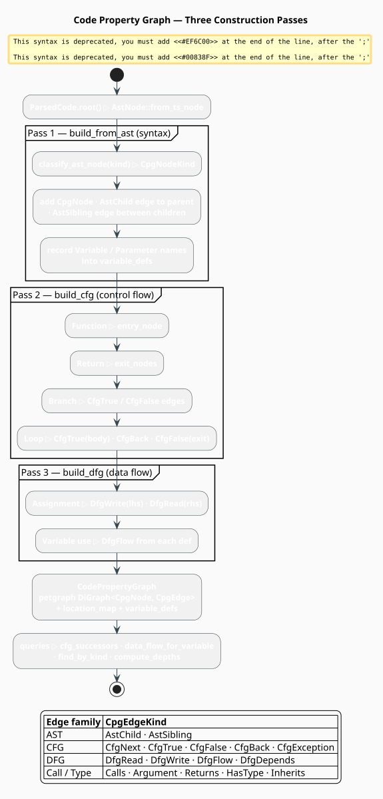

# The Code Property Graph

A **CPG** (Code Property Graph) is a single graph that fuses three classical program
representations — the **AST** (Abstract Syntax Tree), the **CFG** (Control-Flow Graph), and the
**DFG** (Data-Flow Graph) — over a shared node set. Yamaguchi, Golde, Arp & Rieck introduced it
so that bug and vulnerability patterns spanning *syntax, control, and data* could be expressed as
a single graph traversal [[1]](#references). libgrammstein builds a CPG from one tree-sitter
parse and uses it as the substrate for semantic correction.

> **Scope.** Source of truth: [`src/code/cpg.rs`](../../../src/code/cpg.rs). The CPG is built
> from a [`ParsedCode`](ast.md) and consumed by the [Semantic corrector](correctors/semantic.md)
> and [GNN](gnn.md). See the [Overview](overview.md) for where it sits in the pipeline.

## Notation

| Symbol | Meaning |
|---|---|
| $`V`$ | the shared node set (program constructs: functions, variables, calls, …) |
| $`E`$ | the edge set of the CPG |
| $`\mu`$ | edge-labeling function assigning each edge a *kind* |
| $`\nu`$ | node-labeling function assigning each node a `CpgNodeKind` |
| $`E_{\mathrm{AST}}, E_{\mathrm{CFG}}, E_{\mathrm{DFG}}`$ | the AST, CFG, and DFG edge subsets |
| $`\mathrm{def}(x), \mathrm{use}(x)`$ | the definition and use nodes of variable $`x`$ |
| $`\mathcal{L}`$ | the set of all edge-kind labels |

## Why one graph instead of three

The three representations answer different questions about the same program:

| Representation | Question it answers | Classic reference |
|---|---|---|
| **AST** | *How is the code written?* (syntactic structure) | tree-sitter parse ([AST](ast.md)) |
| **CFG** | *In what order can statements execute?* | Allen 1970 [[2]](#references) |
| **DFG** | *Which definitions reach which uses?* | Kildall 1973 [[3]](#references) |

Many real defects are invisible to any one of them alone. "This user-controlled value
(**data** flow) reaches a system call (**syntax**) on a path that skips the sanitizer
(**control** flow)" is a single sentence but a three-representation query. Keeping the three edge
families over one node set lets such a pattern be matched by walking one graph — the core insight
of the CPG [[1]](#references).


*Figure 1. One tree-sitter parse yields the AST, CFG, and DFG over a shared node set; the joint
graph feeds the lexical, grammar, and (CPG-reading) semantic correctors.*

## Theory: the CPG as a labeled directed multigraph

Take the AST as the rooted, ordered, labeled tree $`A = (V, E_{\mathrm{AST}}, r, \prec, \kappa)`$
of [the AST page](ast.md). The **CFG** adds directed edges over the *same* nodes for every
possible transfer of control, distinguishing a designated entry node and a set of exit nodes; the
**DFG** adds an edge $`\mathrm{def}(x) \to u`$ for each use $`u \in \mathrm{use}(x)`$ reached by a
definition of variable $`x`$. The CPG is their union:

```math
G = (V,\; E,\; \mu), \qquad
E = E_{\mathrm{AST}} \cup E_{\mathrm{CFG}} \cup E_{\mathrm{DFG}} \cup E_{\mathrm{call}} \cup E_{\mathrm{type}} \tag{C1}
```

with an edge-labeling $`\mu : E \to \mathcal{L}`$ and a node-labeling $`\nu : V \to K`$ into the
kind set $`K`$ (`CpgNodeKind`). Because two nodes may be joined by several edges of *different*
kinds — a parent–child pair is linked by `AstChild`, and if the child is a variable also by
`DfgFlow` — $`G`$ is a **directed multigraph**, not a simple digraph:

```math
\exists\, u, v \in V,\; \ell_1 \neq \ell_2 \in \mathcal{L} : (u, v, \ell_1) \in E \;\wedge\; (u, v, \ell_2) \in E \tag{C2}
```

This is realized directly by petgraph's `DiGraph`, which permits parallel edges.

### Node kinds

$`\nu`$ is computed by `classify_ast_node`, a language-agnostic **substring** mapping from the
tree-sitter node kind to one of 17 `CpgNodeKind` values. Working across languages, it keys on
common morphemes in grammar names (`function_definition`, `function_item`, and
`method_declaration` all contain `function`/`method`):

| `CpgNodeKind` | Matches tree-sitter kind containing … |
|---|---|
| `Function` | `function`, `method` |
| `Parameter` | `parameter`, `param` |
| `Variable` | `variable`, `binding`, `let` |
| `Type` | `type` (but not `typeof`) |
| `Call` | `call`, `invoke` |
| `Return` | `return` |
| `Branch` | `if`, `match`, `switch` |
| `Loop` | `for`, `while`, `loop` |
| `Assignment` | `assignment`, or the literal `=` |
| `BinaryOp` / `UnaryOp` | `binary` / `unary` |
| `Literal` | `literal`, `string`, `number` |
| `FieldAccess` / `IndexAccess` | `field`/`member` / `index`/`subscript` |
| `Block` | `block`, `body` |
| `Import` | `import`, `use`, `include` |
| `Other` | anything unmatched |

### Edge kinds

$`\mathcal{L}`$ (`CpgEdgeKind`) partitions into five families:

| Family | Labels | Meaning |
|---|---|---|
| AST | `AstChild`, `AstSibling` | parent→child, and left→right sibling order |
| CFG | `CfgNext`, `CfgTrue`, `CfgFalse`, `CfgBack`, `CfgException` | sequential, true/false branch, loop back-edge, exception path |
| DFG | `DfgRead`, `DfgWrite`, `DfgFlow`, `DfgDepends` | value read, value written, def→use flow, data dependency |
| Call | `Calls`, `Argument`, `Returns` | call graph relations |
| Type | `HasType`, `Inherits` | type annotation and inheritance |

## Construction: three passes over one AST

`CodePropertyGraph::from_parsed_code` runs `build_from_ast`, then `build_cfg`, then `build_dfg`.
The following mirrors the implementation.

```
function from_parsed_code(parsed):
    cpg <- empty CodePropertyGraph
    ast <- AstNode::from_ts_node(parsed.root(), parsed.source)
    build_from_ast(cpg, ast, parent = None)           ▸ Pass 1: syntax
    build_cfg(cpg)                                     ▸ Pass 2: control flow
    build_dfg(cpg)                                     ▸ Pass 3: data flow
    return cpg

⟨Pass 1 — build_from_ast(node, parent)⟩ ≡
    kind <- classify_ast_node(node.kind)               ▸ substring map into CpgNodeKind
    idx  <- add CpgNode { id, kind, name = node.text, location, position, ast_kind }
    if kind in { Variable, Parameter } and node.text is Some(name):
        variable_defs[name].push(idx)                  ▸ index definitions by name
    if parent is Some(p): add_edge(p -> idx, AstChild)
    prev <- None
    for child in node.children:                        ▸ preserve source order
        c <- build_from_ast(child, parent = idx)
        if prev is Some(q): add_edge(q -> c, AstSibling)
        prev <- Some(c)

⟨Pass 2 — build_cfg⟩ ≡                                 ▸ per node, by kind
    Function: if entry_node is None: entry_node <- idx
    Return:   exit_nodes.push(idx)
    Branch:   let ch = AstChild-children(idx)
              if |ch| >= 2: add_edge(idx -> ch[0], CfgTrue,  "true")
              if |ch| >= 3: add_edge(idx -> ch[1], CfgFalse, "false")
    Loop:     let ch = AstChild-children(idx); nxt = first AstSibling target
              add_edge(idx     -> ch.first, CfgTrue,  "body")
              add_edge(ch.last -> idx,      CfgBack,  "loop")
              add_edge(idx     -> nxt,      CfgFalse, "exit")

⟨Pass 3 — build_dfg⟩ ≡                                 ▸ per node, by kind
    Assignment: let ch = AstChild-children(idx)
                if |ch| >= 2:
                    add_edge(idx -> ch[0], DfgWrite)   ▸ left-hand side is written
                    add_edge(idx -> ch[1], DfgRead)    ▸ right-hand side is read
    Variable:   for d in variable_defs[node.name], d != idx:
                    add_edge(d -> idx, DfgFlow)        ▸ each definition flows to this use
```

> **Honest approximation.** `build_cfg` and `build_dfg` are deliberately *structural,
> language-agnostic heuristics*, not a full dataflow fixpoint. They read control and data
> structure off AST child/sibling positions rather than resolving scopes or evaluation order per
> language. This keeps CPG construction linear and language-independent; it also means the CFG is
> an over-approximation and `DfgFlow` links *all* like-named definitions to a use rather than only
> the reaching ones. The [Semantic corrector](correctors/semantic.md) and [GNN](gnn.md) are built
> to tolerate that noise, and language-specific refinement is a natural extension point.



*Figure 2. `build_from_ast` lays down nodes and AST edges and indexes variable definitions;
`build_cfg` adds entry/exit and branch/loop edges; `build_dfg` adds assignment read/write and
def→use flow edges — all into one petgraph `DiGraph`.*

## Engineering: the `CodePropertyGraph` type

```rust
pub struct CodePropertyGraph {
    graph: DiGraph<CpgNode, CpgEdge>,                 // petgraph; parallel edges allowed
    location_map: HashMap<(usize, usize), NodeIndex>, // (start_byte, end_byte) -> node
    variable_defs: HashMap<String, Vec<NodeIndex>>,   // name -> its definition nodes
    entry_node: Option<NodeIndex>,                    // first Function seen
    exit_nodes: Vec<NodeIndex>,                       // all Return nodes
}
```

A `CpgNode` carries a stable `id` (its insertion index), its `kind` (`CpgNodeKind`), an optional
`name`, a `location` byte span `(start_byte, end_byte)`, a `position` `(row, column)`, the raw
`ast_kind` string, and a `properties` map for analysis annotations. A `CpgEdge` is a `kind`
(`CpgEdgeKind`) plus an optional human-readable `label` (e.g. `"true"`, `"body"`).

### Query surface

The type exposes read-only queries that the correctors traverse:

| Method | Returns |
|---|---|
| `find_by_kind(kind)` | all nodes of a given `CpgNodeKind` |
| `node_at_location(start, end)` | the node at a byte span (via `location_map`) |
| `variable_definitions(name)` | definition nodes for a variable |
| `data_flow_for_variable(name)` | `(node, kind)` read/write/flow edges of a variable |
| `cfg_successors(idx)` / `cfg_predecessors(idx)` | CFG neighbors (`CfgNext`/`True`/`False`/`Back`) |
| `edges_from(idx)` / `edges_to(idx)` | outgoing / incoming `(node, edge)` pairs |
| `entry()` / `exits()` | the entry node / exit nodes |
| `compute_depths()` | AST depth of each node (BFS over `AstChild`) |
| `compute_child_counts()` | AST child count of each node |
| `node_count()` / `edge_count()` | graph sizes |
| `all_nodes()` / `all_edges()` | iterators for export (e.g. to the GNN) |

### Complexity and concurrency

Each of the three passes visits every node once, so construction is $`O(V + E)`$ in time and
space. Queries are $`O(\deg(v))`$ over a node's incident edges, except `find_by_kind` and the
`compute_*` methods, which scan all nodes in $`O(V)`$ (or $`O(V + E)`$ for the BFS in
`compute_depths`). `node_at_location` and `variable_definitions` are $`O(1)`$ hash lookups.
`CodePropertyGraph` is plain owned data with no interior mutability, so it is `Send` and trivially
shareable behind an `Arc` once built.

## Usage

Building and querying a CPG:

```rust
use libgrammstein::code::{CodeParser, CodePropertyGraph, CpgNodeKind, Python};
use std::sync::Arc;

let mut parser = CodeParser::new(Arc::new(Python::new()))?;
let parsed = parser.parse("def f(x):\n    y = x + 1\n    return y")?;

let cpg = CodePropertyGraph::from_parsed_code(&parsed);
println!("{} nodes, {} edges", cpg.node_count(), cpg.edge_count());

// Every function definition, and the control-flow exit points.
for idx in cpg.find_by_kind(CpgNodeKind::Function) {
    if let Some(node) = cpg.node(idx) {
        println!("function span {:?}", node.location);
    }
}
println!("exit nodes: {}", cpg.exits().len());

// Data-flow edges touching `y`.
for (target, kind) in cpg.data_flow_for_variable("y") {
    println!("y {:?} -> {:?}", kind, target);
}
# Ok::<(), libgrammstein::code::AstError>(())
```

### Worked analyses over the query surface

The query methods compose into lightweight *structural* analyses. Given the heuristic nature of
the CFG/DFG passes (see the honesty note above), treat these as indicators, not proofs. Nodes
with no CFG predecessor — that are neither the entry nor a function — are structurally
unreachable:

```rust
use libgrammstein::code::{CodePropertyGraph, CpgNodeKind};

fn unreachable_nodes(cpg: &CodePropertyGraph) -> Vec<usize> {
    cpg.nodes()
        .filter(|&(idx, node)| {
            cpg.cfg_predecessors(idx).is_empty()
                && cpg.entry() != Some(idx)
                && node.kind != CpgNodeKind::Function
        })
        .map(|(_, node)| node.id)
        .collect()
}
```

A variable with a definition but no `DfgRead` edge is structurally unused:

```rust
use libgrammstein::code::{CodePropertyGraph, CpgEdgeKind, CpgNodeKind};

fn unused_variables(cpg: &CodePropertyGraph) -> Vec<String> {
    let mut unused = Vec::new();
    for idx in cpg.find_by_kind(CpgNodeKind::Variable) {
        if let Some(name) = cpg.node(idx).and_then(|n| n.name.clone()) {
            let has_read = cpg
                .data_flow_for_variable(&name)
                .iter()
                .any(|(_, kind)| *kind == CpgEdgeKind::DfgRead);
            if !has_read {
                unused.push(name);
            }
        }
    }
    unused
}
```

## References

1. F. Yamaguchi, N. Golde, D. Arp & K. Rieck (2014). *Modeling and Discovering Vulnerabilities
   with Code Property Graphs.* IEEE Symposium on Security and Privacy, 590–604.
   [doi:10.1109/SP.2014.44](https://doi.org/10.1109/SP.2014.44)
2. F. E. Allen (1970). *Control flow analysis.* ACM SIGPLAN Notices 5(7), 1–19.
   [doi:10.1145/390013.808479](https://doi.org/10.1145/390013.808479)
3. G. A. Kildall (1973). *A unified approach to global program optimization.* POPL '73, 194–206.
   [doi:10.1145/512927.512945](https://doi.org/10.1145/512927.512945)

## See also

- [AST](ast.md) — the syntax tree the CPG is built from
- [Semantic corrector](correctors/semantic.md) — the CPG's primary consumer
- [GNN](gnn.md) — message passing over the CPG
- [Correction](correction.md) — how CPG findings become `Correction`s
- [Overview](overview.md) — the module map
