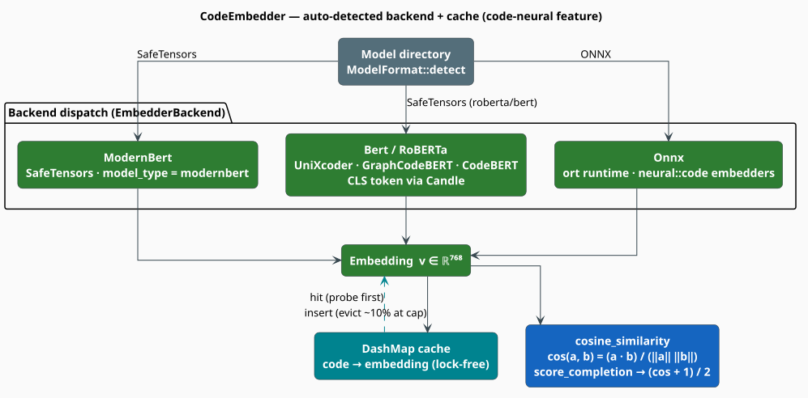

# Code Embeddings

A **code embedding** maps a snippet of source to a dense vector, so that snippets which *mean* the
same thing land near one another — even when they share no tokens. That geometry is what the
lexical and grammar correctors cannot supply: `usr_cnt` and `user_count` are two edits apart, but
`user_count` and `numberOfUsers` are unrelated lexically and adjacent semantically. `CodeEmbedder`
is libgrammstein's façade over the transformer models that produce those vectors — with
**auto-detected** model format and architecture, three interchangeable inference backends, and a
lock-free cache.

> **Scope.** Source of truth: [`src/code/embeddings.rs`](../../../src/code/embeddings.rs). This
> page documents the `code` module's embedder façade. The underlying ONNX model zoo — UniXcoder,
> GraphCodeBERT, CodeT5+, the ensemble and its cache — is a component in its own right; see
> [Neural code embeddings](../code-embeddings/overview.md). The consumers of these vectors are the
> [Semantic corrector](correctors/semantic.md) and the [GNN](gnn.md).

## Notation

| Symbol | Meaning |
|---|---|
| $`x, y`$ | source snippets (strings) |
| $`x \Vert y`$ | their concatenation |
| $`\phi`$ | the embedding map, $`\phi : \Sigma^{*} \to \mathbb{R}^{d}`$ |
| $`d`$ | the embedding dimension (768 for every shipped model) |
| $`L`$ | token-sequence length after tokenization (capped at `max_length`) |
| $`\lVert v \rVert`$ | the Euclidean norm of $`v`$ |

## Feature gate

The module is compiled only under **`code-neural`**, which pulls in the Candle stack and the ONNX
runtime:

```toml
[dependencies]
libgrammstein = { version = "0.1", features = ["code-neural"] }
```

`code-neural = ["code", "neural-rescore", "dep:ort"]`, so it transitively enables `code`. Without
it, nothing on this page exists.

> **Import paths.** Only `CodeEmbedder` and `EmbeddingModel` are re-exported at
> `libgrammstein::code`. `CodeEmbedderConfig`, `CodeEmbedderError`, `ModelFormat`, and
> `ModelArchitecture` live in the submodule and must be imported from
> `libgrammstein::code::embeddings`.



*Figure 1. `ModelFormat::detect` inspects a directory and routes to one of three backends — ONNX
(via `ort`), or SafeTensors decoded as ModernBERT or as a BERT/RoBERTa family model (via Candle).
Every backend yields a vector in $`\mathbb{R}^{768}`$. A `DashMap` cache is probed before inference
and written after it; similarity is cosine.*

## The model zoo

`EmbeddingModel` names the *intended* model. All four agree on width and context window:

| Variant | `hf_model_id()` | `embedding_dim()` | `max_length()` | Character |
|---|---|---|---|---|
| `UniXcoder` | `microsoft/unixcoder-base` | 768 | 512 | unified cross-modal code/text representation [[1]](#references) |
| `GraphCodeBERT` | `microsoft/graphcodebert-base` | 768 | 512 | data-flow-aware pre-training [[3]](#references) |
| `CodeBERT` | `microsoft/codebert-base` | 768 | 512 | the original bimodal code/NL encoder [[2]](#references) |
| `Custom` | `""` (empty) | 768 | 512 | anything else you load from disk |

All three named models are **RoBERTa-family** architectures, which is why they share a backend.

## Loading a model

`CodeEmbedder::from_path` is the constructor that honors your configuration. It looks at what is
actually on disk and dispatches accordingly — first by **format**, then, for SafeTensors, by the
**architecture** declared in `config.json`:

| Detected | Required files | Backend |
|---|---|---|
| `ModelFormat::Onnx` | `model.onnx` + `tokenizer.json` | `ort` runtime, via [`neural::code`](../code-embeddings/overview.md) |
| `ModelFormat::SafeTensors` | `model.safetensors` + `config.json` + `tokenizer.json` | Candle |

```
function from_path(path, config):
    if not path.exists():                 return Err(ModelLoad)
    format <- ModelFormat::detect(path)                       ▸ ONNX wins if model.onnx is present
        if None:                          return Err(ModelLoad "could not detect model format")

    match format:
      Onnx        -> backend <- (config.model == GraphCodeBERT)              ▸ ort-backed
                                  ? GraphCodeBertEmbedder::from_directory(path)
                                  : UniXcoderEmbedder::from_directory(path)
                     architecture <- Roberta
      SafeTensors -> arch <- ModelArchitecture::from_config(read "config.json")  ▸ the model_type field
                     match arch:
                       ModernBert       -> backend <- ModernBertEmbedder (Candle)
                       Roberta | Bert   -> backend <- Candle BertModel + tokenizers::Tokenizer
                       Unknown          -> return Err(ModelLoad "unknown model architecture")
```

`ModelArchitecture::from_config` reads a single field — `model_type` — and is total: malformed
JSON, a missing field, or an unrecognized value all yield `Unknown` rather than panicking.

| `model_type` in `config.json` | `ModelArchitecture` |
|---|---|
| `"modernbert"` | `ModernBert` |
| `"roberta"` | `Roberta` (UniXcoder, GraphCodeBERT, CodeBERT) |
| `"bert"` | `Bert` |
| anything else, absent, or invalid JSON | `Unknown` → `ModelLoad` error |

```rust
use libgrammstein::code::embeddings::{CodeEmbedderConfig, ModelArchitecture};
use libgrammstein::code::{CodeEmbedder, EmbeddingModel};

let config = CodeEmbedderConfig { model: EmbeddingModel::UniXcoder, ..Default::default() };
let embedder = CodeEmbedder::from_path("/models/unixcoder-base", config)?;

// What actually got loaded, as opposed to what was requested:
assert_eq!(embedder.architecture(), ModelArchitecture::Roberta);
assert_eq!(embedder.model(), EmbeddingModel::UniXcoder);
# Ok::<(), libgrammstein::code::embeddings::CodeEmbedderError>(())
```

> **`new()` and `with_config()` ignore `config.model`.** Both always construct a **ModernBERT**
> backend — they do not download or locate the model named by `config.model`, and
> `architecture()` will report `ModernBert` no matter what you asked for. Worse,
> `embedding_dim()` is defined as `config.model.embedding_dim()`, i.e. it reports the *requested*
> model's width (always `768`), which need not equal the width the ModernBERT backend actually
> produces. **To load UniXcoder, GraphCodeBERT, or CodeBERT you must use
> [`CodeEmbedder::from_path`](#loading-a-model).** When the true width matters, measure it —
> `embedder.embed(code)?.len()` — rather than trusting `embedding_dim()`.

## Configuration

```rust
pub struct CodeEmbedderConfig {
    pub model: EmbeddingModel,  // default UniXcoder — honored only by `from_path`
    pub device: Device,         // default Cpu; also Cuda(usize) and Metal
    pub use_cache: bool,        // default true
    pub cache_size: usize,      // default 10_000
    pub normalize: bool,        // default true
    pub batch_size: usize,      // default 32
}
```

```rust
use libgrammstein::code::embeddings::CodeEmbedderConfig;
use libgrammstein::code::EmbeddingModel;
use libgrammstein::neural::Device;

let config = CodeEmbedderConfig {
    model: EmbeddingModel::GraphCodeBERT,
    device: Device::Cuda(0),
    cache_size: 50_000,
    batch_size: 64,
    ..Default::default()
};
```

## Embedding and scoring

### The embedding map

Each backend reduces a token sequence to one vector by taking the **`[CLS]` token's final hidden
state** — the first position of the last layer — which is the pooling convention BERT introduced
for sentence-level representation [[2]](#references):

```rust
use libgrammstein::code::CodeEmbedder;

let embedder = CodeEmbedder::new()?;
let v = embedder.embed("def add(a, b):\n    return a + b")?;
println!("d = {}", v.len());
# Ok::<(), libgrammstein::code::embeddings::CodeEmbedderError>(())
```

### Cosine similarity

`cosine_similarity` is an **associated function** — it takes no `self`, so it can compare vectors
from anywhere:

```math
\begin{array}{lr}
\displaystyle \cos(u, v) \;=\; \frac{u \cdot v}{\lVert u \rVert \; \lVert v \rVert} \;\in\; [-1, 1] & \text{(E1)}
\end{array}
```

It is defensive rather than panicking: if the two slices differ in length, or if either norm is
zero, it returns `0.0` — "no evidence of similarity" — instead of producing a `NaN` that would
poison a downstream ranking.

```rust
use libgrammstein::code::CodeEmbedder;

let a = [1.0_f32, 0.0, 0.0];
let b = [1.0_f32, 0.0, 0.0];
let c = [0.0_f32, 1.0, 0.0];

assert!((CodeEmbedder::cosine_similarity(&a, &b) - 1.0).abs() < 1e-6); // identical
assert!(CodeEmbedder::cosine_similarity(&a, &c).abs() < 1e-6);         // orthogonal
assert_eq!(CodeEmbedder::cosine_similarity(&a, &[1.0, 0.0]), 0.0);     // length mismatch → 0.0
```

`score_similarity(x, y)` is the convenience that embeds both snippets (through the cache) and
returns $`\cos(\phi(x), \phi(y))`$.

### Scoring a completion

`score_completion` asks a different question: *how coherent is $`x`$ once $`y`$ is appended?* It
embeds the context and the concatenation, takes their cosine, and rescales it from $`[-1,1]`$ into
a probability-shaped $`[0,1]`$:

```math
\begin{array}{lr}
\displaystyle \mathrm{score}(x, y) \;=\; \frac{\cos\bigl(\phi(x),\; \phi(x \Vert y)\bigr) + 1}{2} \;\in\; [0, 1] & \text{(E2)}
\end{array}
```

> **$`(\mathrm{E2})`$ is a coherence proxy, not a likelihood.** It measures how little the
> candidate *perturbs* the context's embedding — so it is maximized by a completion that changes
> nothing at all (the empty string scores exactly `1.0`), and it systematically favors short
> candidates over long ones. Use it to rank candidates **of comparable length** against each other;
> do not read it as $`\mathbb{P}(y \mid x)`$, and do not use it to decide *whether* to complete.
> For a calibrated conditional probability, score with the n-gram or hybrid model instead (see
> [Hybrid interpolation](../hybrid/interpolation.md)).

## Caching

Embedding a snippet costs a full transformer forward pass; embedding the *same* snippet twice is
pure waste, and an editor re-analyzing a file on every keystroke does exactly that. The embedder
therefore memoizes into a **`DashMap<String, Vec<f32>>`** keyed by the source text — a sharded,
lock-free map, so concurrent `embed` calls neither block one another nor the writer.

The flow is probe → compute → insert, with eviction when the map is at capacity:

```
function embed(code):
    if cache is enabled and code ∈ cache:  return cache[code]     ▸ hit
    v <- backend.embed(code)                                      ▸ miss: one forward pass
    if cache is enabled:
        if |cache| >= cache_size:                                 ▸ at capacity: shed ~10%
            drop the first (cache_size / 10) entries the iterator yields
        cache.insert(code, v)
    return v
```

> **Eviction is arbitrary, not LRU.** The entries dropped are simply the first
> `cache_size / 10` that `DashMap`'s iterator happens to yield, and that order is unspecified — it
> reflects shard and hash layout, not recency or frequency. A hot entry can therefore be evicted
> while a cold one survives. The policy is a cheap **capacity bound**, not a locality-preserving
> cache; size `cache_size` generously (the default is `10_000` embeddings) rather than relying on
> the eviction to be smart.

`clear_cache()` and `cache_size()` take `&self` and are safe to call concurrently.

## Batching

`embed_batch` is cache-aware: it partitions the inputs into cached and uncached, runs **one**
batched forward pass over the uncached remainder, caches those results, and reassembles the outputs
**in the caller's original order**.

```rust
use libgrammstein::code::CodeEmbedder;

let embedder = CodeEmbedder::new()?;
let snippets = ["def add(a, b): return a + b", "def sub(a, b): return a - b"];
let vectors = embedder.embed_batch(&snippets)?;
assert_eq!(vectors.len(), snippets.len());
# Ok::<(), libgrammstein::code::embeddings::CodeEmbedderError>(())
```

> **The Candle BERT batch path does not mask padding.** To batch, the inputs are padded with token
> id `0` up to the longest sequence in the batch — but the forward pass is invoked with **no
> attention mask**, so those pad positions are attended to like real tokens. The `[CLS]` vector of
> a short snippet batched alongside a much longer one is therefore *not* identical to the vector it
> would receive alone. Two mitigations: batch snippets of **similar length** together, or embed
> length-heterogeneous inputs one at a time with `embed`. (The ONNX and ModernBERT backends handle
> their own padding.)

## API surface

| Method | Receiver | Returns |
|---|---|---|
| `new()` | — | `Result<Self, _>` — **ModernBERT backend**, default config |
| `with_config(config)` | — | `Result<Self, _>` — **ModernBERT backend**, your config |
| `from_path(path, config)` | — | `Result<Self, _>` — auto-detected format *and* architecture |
| `embed(code)` | `&self` | `Result<Vec<f32>, _>` — cached |
| `embed_batch(codes)` | `&self` | `Result<Vec<Vec<f32>>, _>` — cache-aware, order-preserving |
| `cosine_similarity(a, b)` | *associated* | `f32` — $`(\mathrm{E1})`$ |
| `score_similarity(a, b)` | `&self` | `Result<f32, _>` |
| `score_completion(ctx, cand)` | `&self` | `Result<f64, _>` — $`(\mathrm{E2})`$ |
| `embedding_dim()` | `&self` | `usize` — the *requested* model's width (see the pitfall above) |
| `model()` / `architecture()` | `&self` | what was requested / what was loaded |
| `clear_cache()` / `cache_size()` | `&self` | cache control |

## Errors

```rust
pub enum CodeEmbedderError { ModelLoad(String), Embedding(String), InvalidInput(String), Cache(String) }
```

In practice only two occur: **`ModelLoad`** (path missing, format undetectable, architecture
unknown, weights or tokenizer unreadable) and **`Embedding`** (tokenization failed, a Candle/ONNX
tensor operation failed, or the produced vector's width disagreed with the model's declared
`hidden_size`). `InvalidInput` and `Cache` are declared but never constructed.

Note that `impl Default for CodeEmbedder` calls `new().expect(...)` — it **panics** if the default
ModernBERT model cannot be loaded. Prefer `new()` or `from_path()` and handle the `Result`.

## Complexity and concurrency

For a snippet of $`L`$ tokens and width $`d`$:

| Operation | Cost |
|---|---|
| `embed` (cache miss) | $`O(L^{2} d + L d^{2})`$ — self-attention plus the feed-forward blocks |
| `embed` (cache hit) | $`O(d)`$ — a hash probe and a clone of the vector |
| `embed_batch` of $`b`$ uncached snippets | one forward pass over the padded batch |
| `cosine_similarity` | $`O(d)`$ |
| eviction sweep | $`O(\text{cache\_size} / 10)`$, amortized over that many inserts |

Every scoring method takes `&self` and the cache is a `DashMap`, so one embedder serves a thread
pool without locking:

```rust
use libgrammstein::code::CodeEmbedder;
use rayon::prelude::*;
use std::sync::Arc;

let embedder = Arc::new(CodeEmbedder::new()?);
let snippets = ["def f(): pass", "def g(): pass", "class H: pass"];

let vectors: Vec<Vec<f32>> = snippets
    .par_iter()
    .map(|s| embedder.embed(s).expect("embedding failed"))
    .collect();

assert_eq!(vectors.len(), 3);
# Ok::<(), libgrammstein::code::embeddings::CodeEmbedderError>(())
```

## References

1. D. Guo, S. Lu, N. Duan, Y. Wang, M. Zhou & J. Yin (2022). *UniXcoder: Unified Cross-Modal
   Pre-training for Code Representation.* ACL 2022, 7212–7225.
   [doi:10.18653/v1/2022.acl-long.499](https://doi.org/10.18653/v1/2022.acl-long.499)
2. Z. Feng, D. Guo, D. Tang, N. Duan, X. Feng, M. Gong, L. Shou, B. Qin, T. Liu, D. Jiang & M. Zhou
   (2020). *CodeBERT: A Pre-Trained Model for Programming and Natural Languages.* Findings of
   EMNLP 2020, 1536–1547.
   [doi:10.18653/v1/2020.findings-emnlp.139](https://doi.org/10.18653/v1/2020.findings-emnlp.139)
3. D. Guo, S. Ren, S. Lu, Z. Feng, D. Tang, S. Liu, L. Zhou, N. Duan, A. Svyatkovskiy, S. Fu,
   M. Tufano, S. K. Deng, C. Clement, D. Drain, N. Sundaresan, J. Yin, D. Jiang & M. Zhou (2021).
   *GraphCodeBERT: Pre-training Code Representations with Data Flow.* ICLR 2021.
   [arXiv:2009.08366](https://arxiv.org/abs/2009.08366)
4. B. Warner, A. Chaffin, B. Clavié, O. Weller, O. Hallström, S. Taghadouini, A. Gallagher,
   R. Biswas, F. Ladhak, T. Aarsen, N. Cooper, G. Adams, J. Howard & I. Poli (2024). *Smarter,
   Better, Faster, Longer: A Modern Bidirectional Encoder.* — the ModernBERT default backend.
   [arXiv:2412.13663](https://arxiv.org/abs/2412.13663)

## See also

- [Neural code embeddings](../code-embeddings/overview.md) — the ONNX model zoo behind the `Onnx` backend
- [Semantic corrector](correctors/semantic.md) — the primary consumer of these vectors
- [GNN](gnn.md) — message passing over the CPG, which these embeddings can feature
- [Hybrid interpolation](../hybrid/interpolation.md) — calibrated probabilities, when $`(\mathrm{E2})`$ is not enough
- [Overview](overview.md) — the module map and the `code-neural` feature
