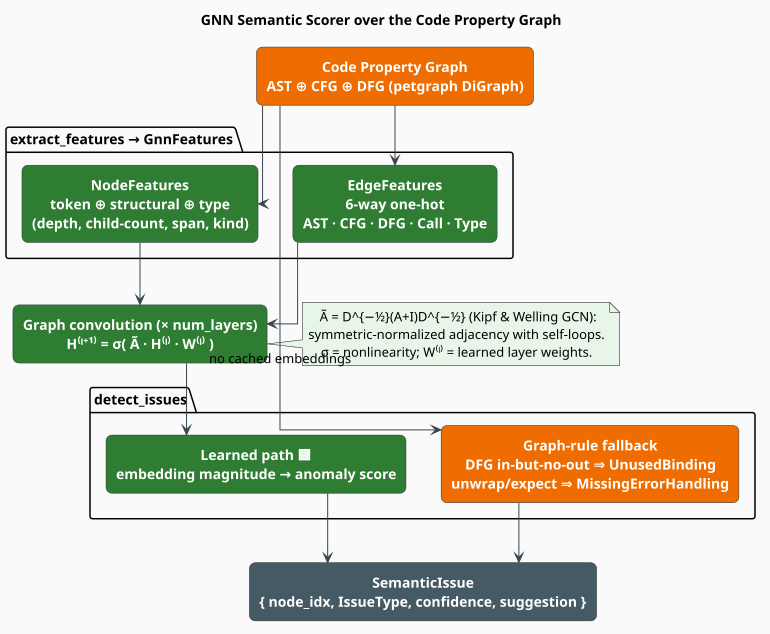

# Graph Neural Networks for Code

A **Graph Neural Network (GNN)** learns vector representations of graph nodes by repeatedly mixing each
node's features with those of its neighbours. libgrammstein applies this idea to the
[Code Property Graph](cpg.md): the fused AST + CFG + DFG is exactly the kind of typed, heterogeneous
graph over which a GNN can localize *semantic* faults — a variable used where a sibling was meant, a
binding written but never read, an unhandled `unwrap`. This module (`GnnSemanticScorer`) provides the
feature extraction and the issue-detection surface that the [semantic corrector](correctors/semantic.md)
consumes.

> **Experimental.** The learned graph-convolution forward pass is **not yet wired** in the shipped
> code. `extract_features` produces GNN-ready tensors and `detect_issues` ships a **deterministic
> graph-rule + lexical-similarity** analysis that runs today; the convolution below is the target
> architecture those tensors feed. This is the ecosystem's most inviting contribution surface. See the
> [honest-status note](#honest-status-what-actually-runs).

> **Scope.** Source of truth: [`src/code/gnn.rs`](../../../src/code/gnn.rs). Input graph:
> [Code Property Graph](cpg.md). Consumer: [Semantic Corrector](correctors/semantic.md). For the
> transformer-based code embeddings that a full model would use as node features see
> [Code Embeddings](embeddings.md).

## What & why

Token- and grammar-level correction cannot see *meaning*: `total` and `subtotal` are both valid
identifiers, and `if (x = 0)` is syntactically fine. Catching "you used the wrong in-scope variable"
or "this value is defined and never read" requires reasoning over how data and control flow through the
program — precisely what the CPG encodes and what a GNN is built to consume. Learning to represent
programs as graphs and predict such faults is the approach of Allamanis et al. [[1]](#references); the
convolution libgrammstein targets is the spectral GCN of Kipf & Welling [[2]](#references), applied to
the CPG of Yamaguchi et al. [[3]](#references).

## Theory

### Notation

| Symbol | Meaning |
|---|---|
| $`G = (\mathcal{N}, \mathcal{E})`$ | the CPG: nodes $`\mathcal{N}`$, typed edges $`\mathcal{E}`$ |
| $`A`$ | the $`\lvert \mathcal{N} \rvert \times \lvert \mathcal{N} \rvert`$ adjacency matrix |
| $`I`$ | the identity matrix (adds a **self-loop** to every node) |
| $`\tilde{A} = A + I`$ | adjacency with self-loops |
| $`\tilde{D}`$ | the diagonal **degree** matrix of $`\tilde{A}`$, $`\tilde{D}_{vv} = \sum_u \tilde{A}_{vu}`$ |
| $`H^{(l)}`$ | the node-feature matrix at layer $`l`$; row $`v`$ is node $`v`$'s embedding |
| $`W^{(l)}`$ | the learned weight matrix of layer $`l`$ |
| $`\sigma`$ | an elementwise nonlinearity (e.g. ReLU) |
| $`\mathbf{x}_v^{\text{struct}}`$ | node $`v`$'s hand-built structural feature vector |

### The graph-convolution layer

One GCN layer propagates features across edges and transforms them, with a **symmetric-normalized**
adjacency so high-degree nodes do not dominate [[2]](#references):

```math
\begin{array}{lr}
\displaystyle H^{(l+1)} = \sigma\!\left( \hat{A}\, H^{(l)} W^{(l)} \right),
\qquad
\hat{A} = \tilde{D}^{-\frac{1}{2}}\,\tilde{A}\,\tilde{D}^{-\frac{1}{2}} & \text{(G1)}
\end{array}
```

Stacking $`L`$ such layers (the `num_layers` field, default $`3`$) lets information reach every node
within $`L`$ hops. $`H^{(0)}`$ is the input feature matrix assembled by `extract_features`; the final
$`H^{(L)}`$ is the per-node embedding a classifier head would map to an [issue type](#issue-taxonomy).

### Input features

Each node carries a concatenation of three blocks — `token_features` (from a code embedder),
`structural_features`, and `type_features` — of total width `NodeFeatures::feature_dim`. The
structural block is computed directly from the CPG in `NodeFeatures::from_cpg_node`, each component
normalized into roughly $`[0, 1]`$:

```math
\begin{array}{lr}
\displaystyle \mathbf{x}_v^{\text{struct}} =
\left[\, \frac{\mathrm{depth}(v)}{20},\ \frac{\mathrm{children}(v)}{10},\ \frac{\mathrm{span}(v)}{1000},\ \frac{\kappa(v)}{8} \,\right] & \text{(G2)}
\end{array}
```

where $`\mathrm{span}(v)`$ is the node's byte length and $`\kappa(v) \in \{0, \dots, 7\}`$ codes its
`CpgNodeKind` (function, variable, call, branch, loop, assignment, return, other). Each edge is a
6-dimensional one-hot over its category $`c(e)`$, grouping the CPG's edge kinds
(`EdgeFeatures::from_edge_kind`):

```math
\begin{array}{lr}
\displaystyle c(e) \in \{\, \text{AST}=0,\ \text{CFG}=1,\ \text{DFG}=2,\ \text{Call}=3,\ \text{Type}=4 \,\} & \text{(G3)}
\end{array}
```

### Issue taxonomy

Detection ultimately emits `SemanticIssue { node_idx, issue_type, confidence, suggestion, related_nodes }`
where `issue_type` is one of `VariableMisuse`, `TypeError`, `MissingErrorHandling`, `NullDereference`,
`UnusedBinding`, `ApiMisuse`, `ResourceLeak`, or `Anomaly`.

## Honest status: what actually runs

The shipped `GnnSemanticScorer` does **not** execute $`(\mathrm{G1})`$. Two things stand in for a
trained model, and both are deliberately conservative:

1. **Deterministic graph rules** (`detect_issues`). Using on-demand edge queries over the CPG:
   - a `Variable` node with an incoming `DfgWrite`/`DfgFlow` but **no** outgoing `DfgRead`/`DfgFlow` is
     flagged `UnusedBinding` at confidence $`0.6`$;
   - a `Call` node named `unwrap` or `expect` is flagged `MissingErrorHandling` at confidence $`0.75`$.
2. **Lexical fallback** (`variable_misuse_candidates`, `compute_similarity`). When no learned node
   embeddings are available, variable-misuse candidates are ranked by a **character-bigram Jaccard**
   similarity between identifier names:

```math
\begin{array}{lr}
\displaystyle \mathrm{sim}(a, b) = \frac{\lvert B_a \cap B_b \rvert}{\lvert B_a \cup B_b \rvert},
\qquad B_s = \{\, (s_i, s_{i+1}) \,\} & \text{(G4)}
\end{array}
```

Candidates with $`\mathrm{sim} > 0.3`$ are kept, top 5. `score_node` reads a cached embedding's
$`\ell_2`$ magnitude when present, but `node_embeddings` is populated only by a (future) trained model,
so it returns $`0.0`$ today. This mirrors the honesty of the n-gram and hybrid docs: the *interface* and
*feature pipeline* are real and stable; the neural forward pass is a labelled extension point, not a
silent no-op.

## The algorithm, literately

```
function extract_features(cpg):                      ▸ build GNN inputs, GnnFeatures
    depths       <- cpg.compute_depths()             ▸ AST BFS depth per node
    child_counts <- cpg.compute_child_counts()
    for node in cpg.all_nodes():
        nf <- NodeFeatures.from_cpg_node(node, depths[node], child_counts[node])  ▸ eq. (G2)
        node_features.append(nf)
    for (src, tgt, edge) in cpg.all_edges():
        edge_features.append(EdgeFeatures.from_edge_kind(src, tgt, edge.kind))     ▸ eq. (G3)
    return GnnFeatures(node_features, edge_features, cpg.node_count(), cpg.edge_count())

function detect_issues(cpg):                          ▸ deterministic rules (see Honest status)
    node_index <- { node.id -> graph_index }          ▸ map ids to petgraph indices
    for node in cpg.all_nodes():
        if node.kind == Variable:
            writes <- count(cpg.edges_to(idx)   where kind in {DfgFlow, DfgWrite})
            reads  <- count(cpg.edges_from(idx) where kind in {DfgFlow, DfgRead})
            if writes > 0 and reads == 0:
                emit UnusedBinding at node.id, confidence 0.6
        if node.kind == Call and node.name in {"unwrap", "expect"}:
            emit MissingErrorHandling at node.id, confidence 0.75
    return issues

function variable_misuse_candidates(cpg, node_idx):   ▸ lexical fallback, eq. (G4)
    name <- node(node_idx).name
    for other in cpg.all_nodes() where other is a distinct Variable:
        s <- compute_similarity(name, other.name)
        if s > 0.3: candidates.append((other.name, s))
    return top 5 candidates by score
```

## Engineering

### On-demand edge queries, not buffered scans

`detect_issues` looks up a node's data-flow neighbourhood with `cpg.edges_to` / `cpg.edges_from`
(petgraph incident-edge iterators) rather than materializing all $`\lvert \mathcal{E} \rvert`$ edges.
For a large CPG this avoids the $`O(\lvert \mathcal{E} \rvert)`$ memory of a buffered edge list and
repeated full scans.

### Types

```rust
pub struct GnnConfig {
    pub num_layers: usize,        // default 3   (the L in G1)
    pub hidden_dim: usize,        // default 256
    pub dropout: f64,             // default 0.1
    pub use_edge_features: bool,  // default true
    pub use_attention: bool,      // default true
    pub embedding_dim: usize,     // default 128
}

pub struct GnnFeatures {
    pub node_features: Vec<NodeFeatures>,
    pub edge_features: Vec<EdgeFeatures>,
    pub num_nodes: usize,
    pub num_edges: usize,
}
```

`GnnFeatures::to_adjacency_list` and `to_node_matrix` project the features into the dense forms a
tensor library expects, so an external trainer can drive $`(\mathrm{G1})`$ without touching the CPG.

### Complexity and feature-gating

| Operation | Cost |
|---|---|
| `extract_features` | $`O(\lvert \mathcal{N} \rvert + \lvert \mathcal{E} \rvert)`$ |
| `detect_issues` | $`O(\lvert \mathcal{N} \rvert + \lvert \mathcal{E} \rvert)`$ (incident-edge queries) |
| `variable_misuse_candidates` | $`O(\lvert \mathcal{N} \rvert \cdot m)`$, $`m`$ = mean identifier length |
| one GCN layer $`(\mathrm{G1})`$ | $`O(\lvert \mathcal{E} \rvert \, d + \lvert \mathcal{N} \rvert \, d^2)`$, $`d`$ = hidden dim |

The module lives behind the base `code` feature (it uses `petgraph` via the CPG). `GnnSemanticScorer`
holds only its config and an (empty) embedding cache, so it is cheap to construct with
`default_scorer()`.



## Usage

```rust
use libgrammstein::code::cpg::CodePropertyGraph;
use libgrammstein::code::gnn::{GnnSemanticScorer, IssueType};

// `cpg` built from parsed code (see the CPG docs).
let scorer = GnnSemanticScorer::default_scorer();

// Feature extraction — GNN-ready tensors, eqs. (G2)/(G3).
let features = scorer.extract_features(&cpg);
let adjacency = features.to_adjacency_list();
let node_matrix = features.to_node_matrix();

// Deterministic issue detection available today.
for issue in scorer.detect_issues(&cpg) {
    if issue.issue_type == IssueType::UnusedBinding {
        println!("node {} may be unused ({:.2})", issue.node_idx, issue.confidence);
    }
}
let _ = (adjacency, node_matrix);
```

## References

1. M. Allamanis, M. Brockschmidt & M. Khademi (2018). *Learning to Represent Programs with Graphs.*
   ICLR 2018. [arXiv:1711.00740](https://arxiv.org/abs/1711.00740)
2. T. N. Kipf & M. Welling (2017). *Semi-Supervised Classification with Graph Convolutional Networks.*
   ICLR 2017. [arXiv:1609.02907](https://arxiv.org/abs/1609.02907)
3. F. Yamaguchi, N. Golde, D. Arp & K. Rieck (2014). *Modeling and Discovering Vulnerabilities with
   Code Property Graphs.* IEEE Symposium on Security and Privacy 2014, 590–604.
   [doi:10.1109/SP.2014.44](https://doi.org/10.1109/SP.2014.44)

## See also

- [Code Property Graph](cpg.md) — the AST ⊕ CFG ⊕ DFG graph the GNN consumes
- [Semantic Corrector](correctors/semantic.md) — turns `SemanticIssue`s into ranked corrections
- [Code Embeddings](embeddings.md) — transformer features that would populate `token_features`
- [Correctors Overview](correctors/overview.md) — where the semantic layer sits
