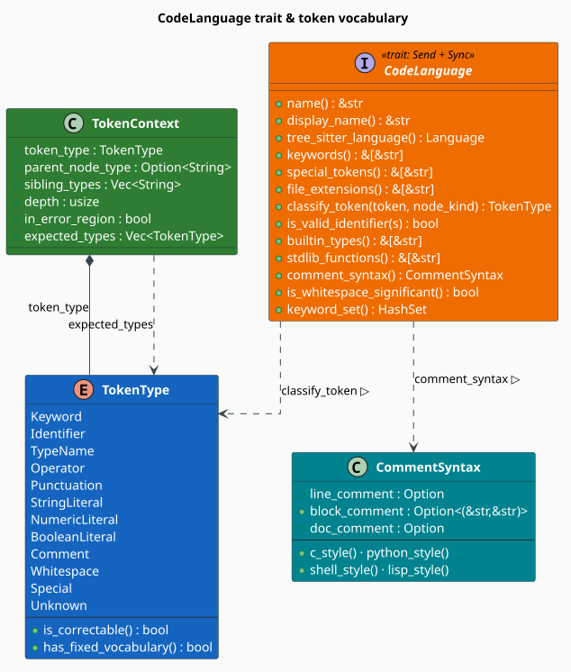

# The Language Framework

The **`CodeLanguage` trait** is the seam between libgrammstein's language-agnostic machinery and a
concrete programming language. The parser, the tokenizer, the Code Property Graph, and every
corrector are generic over some `L: CodeLanguage`; a language implementation supplies the four
things they need — a **tree-sitter grammar** to parse with, a **token classifier** to give each
leaf a type, **closed vocabularies** (keywords, operators, built-in types) to correct against, and
**lexical conventions** (identifier syntax, comment syntax, whitespace significance). Add a new
language and the whole pipeline works on it without any other change.

> **Scope.** Source of truth: [`src/code/language.rs`](../../../src/code/language.rs). The five
> shipped implementations are described in [Languages](languages.md); how the trait is applied to
> a syntax tree is [Tokenizer](tokenizer.md); how token types steer repair is
> [Correction](correction.md). See the [Overview](overview.md) for the module map.

## Notation

| Symbol | Meaning |
|---|---|
| $`\Sigma^{*}`$ | the set of token texts (finite strings of source characters) |
| $`K_{\mathrm{ts}}`$ | the set of tree-sitter **node kinds** for a grammar (e.g. `identifier`, `integer`) |
| $`T`$ | the set of `TokenType` values (the 12 variants below) |
| $`\kappa`$ | the classification function implemented by `classify_token` |
| $`T_{\mathrm{corr}}`$ | the **correctable** token types |
| $`T_{\mathrm{fix}}`$ | the **fixed-vocabulary** token types |
| $`K_{\ell}`$ | the keyword set of language $`\ell`$ (the values of `keywords()`) |

## What a language must decide

tree-sitter tells us *how the source is shaped*: it hands back a tree whose leaves carry a **node
kind** string drawn from the grammar. It does not tell us what a leaf *means* for correction — that
`identifier` is a name we may fuzzy-match against a project dictionary, that `def` is a reserved
word drawn from a 35-element closed set, or that `#` opens a comment we must not touch. Supplying
that judgment is precisely the job of a `CodeLanguage`.

Formally, an implementation supplies a classification function that reads **both** the token text
and its node kind:

```math
\begin{array}{lr}
\displaystyle \kappa : \Sigma^{*} \times K_{\mathrm{ts}} \;\longrightarrow\; T & \text{(L1)}
\end{array}
```

Both arguments are needed. The node kind alone is ambiguous across grammars (tree-sitter-python
labels the keyword `def` with the kind `def`, but labels every name — reserved or not — with
`identifier`), and the text alone is ambiguous within a grammar (`match` is a keyword in Rust and
an ordinary method name in JavaScript). Every shipped implementation therefore matches on
`node_kind` first and falls back to a text test against `keywords()` and `builtin_types()` — see
[Languages](languages.md) for the per-language tables.



*Figure 1. `CodeLanguage` is the trait; `classify_token` maps a token into the `TokenType` enum and
`comment_syntax` yields a `CommentSyntax`. `TokenContext` wraps a `TokenType` with the structural
position the tokenizer recovered from the AST — parent kind, sibling kinds, depth, and whether the
token sits inside an error region.*

## `TokenType`: the classification target

`TokenType` is a flat, `Copy` enum of twelve variants. It is deliberately coarse: it is a
*correction strategy selector*, not a lexical category system.

| Variant | Covers | Fixed vocabulary? | Correctable? |
|---|---|---|---|
| `Keyword` | reserved words (`if`, `fn`, `def`) | yes | yes |
| `Identifier` | user-chosen names | no | yes |
| `TypeName` | type names (`int`, `Vec`, `String`) | no | yes |
| `Operator` | `+`, `-`, `==`, `->` | yes | yes |
| `Punctuation` | `;`, `,`, `(`, `)` | yes | yes |
| `StringLiteral` | `"hello"`, `'c'` | no | yes |
| `NumericLiteral` | `42`, `3.14`, `0xFF` | no | yes |
| `BooleanLiteral` | `true`, `false` | yes | yes |
| `Comment` | line and block comments | no | **no** |
| `Whitespace` | spaces, tabs, newlines | no | **no** |
| `Special` | language-specific markers (macros, wildcards, atomspace refs) | no | yes |
| `Unknown` | anything the classifier did not recognize | no | yes |

Two predicates on `TokenType` carry the whole design, and both are exact:

```math
\begin{array}{lr}
\displaystyle T_{\mathrm{corr}} \;=\; T \setminus \{\,\texttt{Comment},\; \texttt{Whitespace}\,\} & \text{(L2)}
\end{array}
```

```math
\begin{array}{lr}
\displaystyle T_{\mathrm{fix}} \;=\; \{\,\texttt{Keyword},\; \texttt{Operator},\; \texttt{Punctuation},\; \texttt{BooleanLiteral}\,\} & \text{(L3)}
\end{array}
```

- **`is_correctable()`** — $`(\mathrm{L2})`$. Comments and whitespace are excluded because editing
  them cannot fix a program: they carry no semantics. The tokenizer additionally *drops* them by
  default (see [Tokenizer](tokenizer.md)), so this predicate is a second line of defence for
  correctors handed tokens from elsewhere.
- **`has_fixed_vocabulary()`** — $`(\mathrm{L3})`$. This is the question *"can the language itself
  enumerate every legal value of this token?"* For a keyword or an operator the answer is yes: the
  candidate set is exactly `keywords()` or `special_tokens()`, and a corrector can fuzzy-match a
  misspelling against a small closed dictionary with a tight edit-distance bound
  [[1]](#references). For an identifier the answer is no — the legal values are whatever the
  project happens to define — so candidates must come from a *learned* dictionary instead.

Note the deliberate asymmetry: **`TypeName` is not fixed-vocabulary.** Although `builtin_types()`
enumerates the language's own types, user code introduces new ones freely, so the closed-set
assumption would be wrong.

## `TokenContext`: structure around a token

A token's type is not enough to repair it well; *where it sits* matters. `TokenContext` records
that position:

```rust
pub struct TokenContext {
    pub token_type: TokenType,             // the classification
    pub parent_node_type: Option<String>,  // e.g. "function_definition"
    pub sibling_types: Vec<String>,        // kinds of the other children of the parent
    pub depth: usize,                      // nesting depth in the AST (root = 0)
    pub in_error_region: bool,             // inside a tree-sitter ERROR/MISSING subtree
    pub expected_types: Vec<TokenType>,    // token types the grammar admits here
}
```

It is built by a fluent constructor — `TokenContext::new(token_type)` yields a *minimal* context
(no parent, `depth` 0, not in error), which `with_parent`, `with_depth`, and `in_error` refine:

```rust
use libgrammstein::code::{TokenContext, TokenType};

let context = TokenContext::new(TokenType::Identifier)
    .with_parent("function_definition")
    .with_depth(3)
    .in_error();

assert_eq!(context.token_type, TokenType::Identifier);
assert_eq!(context.parent_node_type.as_deref(), Some("function_definition"));
assert_eq!(context.depth, 3);
assert!(context.in_error_region);
```

In practice you rarely build one by hand: [`CodeTokenizer`](tokenizer.md) populates a full
`TokenContext` on every `CodeToken` it emits, filling `parent_node_type`, `sibling_types`,
`depth`, and `in_error_region` from the AST walk.

> **Honest gap.** `expected_types` is a declared field that nothing currently populates — the
> grammar-driven "what could legally appear here?" set is computed instead by the Earley parser in
> [Constrained Decoding](constrained-decoding.md), which does not write it back into
> `TokenContext`. Separately, [`CorrectionPipeline::analyze`](pipeline.md) passes correctors a
> *freshly minimal* `TokenContext::new(token.token_type)` rather than the enriched `token.context`
> the tokenizer already computed; correctors that want structure must read `token.context` off the
> `CodeToken` argument directly. Both are extension points, not invariants to rely on.

## The trait, method by method

Only five methods are required; the remaining eight have defaults, so a minimal language is short.

| Method | Required | Default | Purpose |
|---|---|---|---|
| `name()` | **yes** | — | canonical lowercase name (`"python"`) |
| `tree_sitter_language()` | **yes** | — | the grammar to parse with |
| `keywords()` | **yes** | — | reserved words — the closed dictionary for `Keyword` |
| `file_extensions()` | **yes** | — | extensions **without** a leading dot (`"py"`, not `".py"`) |
| `classify_token()` | **yes** | — | the $`\kappa`$ of $`(\mathrm{L1})`$ |
| `is_valid_identifier()` | **yes** | — | is this string a legal name? |
| `display_name()` | no | `self.name()` | human-facing name (`"Python"`) |
| `special_tokens()` | no | `&[]` | language-specific operators/markers |
| `builtin_types()` | no | `&[]` | the language's own type names |
| `stdlib_functions()` | no | `&[]` | standard-library names, for identifier candidates |
| `comment_syntax()` | no | `CommentSyntax::default()` (C-style) | comment delimiters |
| `is_whitespace_significant()` | no | `false` | true for Python and other layout-sensitive languages |
| `keyword_set()` | no | `keywords().iter().copied().collect()` | the keywords as a `HashSet` |

> **Watch the extensions.** `file_extensions()` returns bare extensions — `["py", "pyw", "pyi"]`,
> `["rs"]`, `["rho"]` — with **no** leading dot. Compare against `path.extension()`, which also
> strips the dot.

## `CommentSyntax`

```rust
pub struct CommentSyntax {
    pub line_comment: Option<&'static str>,              // "//" or "#" or ";"
    pub block_comment: Option<(&'static str, &'static str)>, // ("/*", "*/")
    pub doc_comment: Option<&'static str>,               // "///" or ";;"
}
```

Four presets are provided, and `Default` is `c_style`:

| Preset | `line_comment` | `block_comment` | `doc_comment` |
|---|---|---|---|
| `c_style()` (= `Default`) | `//` | `/*` … `*/` | `///` |
| `python_style()` | `#` | `"""` … `"""` | `#` |
| `shell_style()` | `#` | none | none |
| `lisp_style()` | `;` | `#\|` … `\|#` | `;;` |

A language is free to build a `CommentSyntax` literally instead of taking a preset, and MeTTa does
exactly that: it is Lisp-like but has **no block comments**, so it declines `lisp_style()` and sets
`block_comment: None` (see [Languages](languages.md)).

## Implementing a language

The following is a complete, compiling implementation skeleton. Note the import paths: `CodeLanguage`,
`TokenType`, and `TokenContext` are re-exported at `libgrammstein::code`, but **`CommentSyntax` is
not** — it must be imported from `libgrammstein::code::language`.

```rust
use libgrammstein::code::language::CommentSyntax;
use libgrammstein::code::{CodeLanguage, TokenType};
use tree_sitter::Language;

#[derive(Debug, Clone, Default)]
pub struct MyLang;

impl CodeLanguage for MyLang {
    fn name(&self) -> &str {
        "mylang"
    }

    fn display_name(&self) -> &str {
        "MyLang"
    }

    fn tree_sitter_language(&self) -> Language {
        tree_sitter_mylang::LANGUAGE.into() // or `tree_sitter_mylang::language()` for older crates
    }

    fn keywords(&self) -> &[&str] {
        &["fn", "let", "if", "else", "while", "return"]
    }

    fn special_tokens(&self) -> &[&str] {
        &["@", "!"]
    }

    fn file_extensions(&self) -> &[&str] {
        &["ml"] // no leading dot
    }

    // Match on the node kind first; fall back to the text.
    fn classify_token(&self, token: &str, node_kind: &str) -> TokenType {
        match node_kind {
            "true" | "false" => TokenType::BooleanLiteral,
            k if self.keywords().contains(&k) => TokenType::Keyword,
            "identifier" => {
                if self.builtin_types().contains(&token) {
                    TokenType::TypeName
                } else {
                    TokenType::Identifier
                }
            }
            "integer" | "float" => TokenType::NumericLiteral,
            "string" => TokenType::StringLiteral,
            "comment" => TokenType::Comment,
            "+" | "-" | "*" | "/" | "==" => TokenType::Operator,
            "(" | ")" | "{" | "}" | ";" | "," => TokenType::Punctuation,
            _ => TokenType::Unknown,
        }
    }

    fn is_valid_identifier(&self, s: &str) -> bool {
        let mut chars = s.chars();
        match chars.next() {
            Some(c) if c.is_alphabetic() || c == '_' => {
                chars.all(|c| c.is_alphanumeric() || c == '_')
            }
            _ => false,
        }
    }

    fn builtin_types(&self) -> &[&str] {
        &["int", "float", "bool", "string"]
    }

    fn comment_syntax(&self) -> CommentSyntax {
        CommentSyntax::c_style()
    }
}
```

Three rules of thumb, all learned from the shipped implementations:

1. **Key on `node_kind`, not text.** Text fallbacks are for the cases the grammar leaves
   under-specified (tree-sitter's generic `identifier`), not the common path.
2. **Return `Unknown`, never guess.** `Unknown` is correctable, so a downstream corrector may still
   act on the token; a *wrong* type actively misdirects it.
3. **Make `keywords()` complete.** It is simultaneously the `Keyword` classifier's dictionary and
   the lexical corrector's candidate set; a missing keyword is both a misclassification and a
   missed repair.

## Engineering

### Cost of the vocabulary accessors

Every vocabulary accessor returns a `&[&str]` — a borrowed slice of a `const` array, so calling it
is free. Membership testing, however, is **not** free: `self.keywords().contains(&k)` is a linear
scan, $`O(\lvert K_{\ell} \rvert)`$, and the shipped `classify_token` implementations perform one
or two such scans per token on the fallback path. With $`\lvert K_{\ell} \rvert \le 41`$ for every
shipped language this is comfortably cheaper than the hashing it would replace, which is why it is
written that way.

`keyword_set()` exists for callers that test membership *repeatedly*: it collects into a
`HashSet<&str>` for $`O(1)`$ lookups. It **allocates a fresh set on every call**, so hoist it out
of loops:

```rust
use libgrammstein::code::{CodeLanguage, Python};

let python = Python::new();
let keywords = python.keyword_set(); // build once…
let hits = ["def", "retrun", "class"]
    .iter()
    .filter(|t| keywords.contains(*t)) // …probe many times
    .count();
assert_eq!(hits, 2);
```

### Concurrency

`CodeLanguage` is declared `Send + Sync`, and every shipped implementation is a **unit struct**
(`pub struct Python;`) holding no state. Language handles are therefore free to clone, trivially
shareable, and conventionally passed as `Arc<L>`:

```rust
use libgrammstein::code::{CodeLanguage, Python};
use std::sync::Arc;

let python = Arc::new(Python::new());
let worker = Arc::clone(&python);

std::thread::spawn(move || {
    assert_eq!(worker.name(), "python");
    assert!(worker.is_whitespace_significant());
});
```

Because the trait is object-safe in its own right, `Arc<dyn CodeLanguage>` also works for
heterogeneous collections — though the parser, tokenizer, and correctors are generic over a
concrete `L` (they need `Clone`), so prefer `Arc<Python>` over `Arc<dyn CodeLanguage>` when feeding
the pipeline.

## Where each method is consumed

| Method | Consumed by |
|---|---|
| `tree_sitter_language()` | `CodeParser` ([AST](ast.md)) |
| `classify_token()` | `CodeTokenizer` ([Tokenizer](tokenizer.md)) |
| `keywords()`, `special_tokens()`, `builtin_types()`, `stdlib_functions()` | [Lexical corrector](correctors/lexical.md) — the fuzzy-match dictionaries |
| `is_valid_identifier()` | correctors, to reject candidate repairs that are not legal names |
| `is_whitespace_significant()` | layout-aware repair (indentation is meaningful in Python) |
| `comment_syntax()` | comment detection and doc-comment extraction |
| `name()` / `display_name()` | diagnostics and `ParsedCode::language_name` |

## References

1. F. J. Damerau (1964). *A technique for computer detection and correction of spelling errors.*
   Communications of the ACM 7(3), 171–176.
   [doi:10.1145/363958.363994](https://doi.org/10.1145/363958.363994)
2. T. A. Wagner & S. L. Graham (1998). *Efficient and flexible incremental parsing.* ACM
   Transactions on Programming Languages and Systems 20(5), 980–1013.
   [doi:10.1145/293677.293678](https://doi.org/10.1145/293677.293678)

## See also

- [Languages](languages.md) — the five shipped implementations and their token tables
- [AST](ast.md) — the tree-sitter parse the classifier reads node kinds from
- [Tokenizer](tokenizer.md) — where `classify_token` is applied and `TokenContext` is filled in
- [Correction](correction.md) — how `TokenType` selects a repair strategy
- [Overview](overview.md) — the module map
