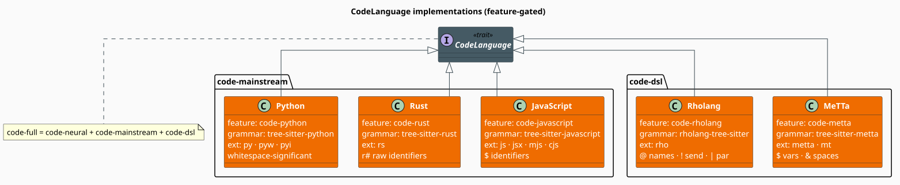

# The Five Shipped Languages

libgrammstein ships five [`CodeLanguage`](language.md) implementations: three **mainstream**
languages (Python, Rust, JavaScript) and two **DSLs** (Rholang, MeTTa). Each is a stateless unit
struct behind its own Cargo feature, so a binary links only the tree-sitter grammars it actually
uses. This page is the reference for what each language declares — its grammar, its vocabularies,
its identifier syntax, and the node kinds its classifier keys on.

> **Scope.** Source of truth: [`src/code/languages/`](../../../src/code/languages/) —
> [`python.rs`](../../../src/code/languages/python.rs),
> [`rust_lang.rs`](../../../src/code/languages/rust_lang.rs),
> [`javascript.rs`](../../../src/code/languages/javascript.rs),
> [`rholang.rs`](../../../src/code/languages/rholang.rs), and
> [`metta.rs`](../../../src/code/languages/metta.rs). The trait they implement is
> [Language](language.md); to add a sixth language, follow the skeleton there.



*Figure 1. Every implementation is a unit struct implementing the one `CodeLanguage` trait. The
`code-mainstream` and `code-dsl` feature groups bundle the three mainstream and two
domain-specific languages respectively; `code-full` is those two groups plus `code-neural`.*

## Feature gates

Each language is gated individually, and every language feature **transitively enables `code`** —
so `features = ["code-python"]` is sufficient; you never need to name `code` yourself.

| Feature | Enables | Pulls in |
|---|---|---|
| `code-python` | `Python` | `tree-sitter-python` |
| `code-rust` | `Rust` | `tree-sitter-rust` |
| `code-javascript` | `JavaScript` | `tree-sitter-javascript` |
| `code-rholang` | `Rholang` | `rholang-tree-sitter` |
| `code-metta` | `MeTTa` | `tree-sitter-metta` |
| `code-mainstream` | Python + Rust + JavaScript | all three mainstream grammars |
| `code-dsl` | Rholang + MeTTa | both DSL grammars |
| `code-full` | `code-neural` + `code-mainstream` + `code-dsl` | everything |

```toml
[dependencies]
libgrammstein = { version = "0.1", features = ["code-python", "code-rholang"] }
```

Each type is re-exported at the crate's `code` root under its own gate, so
`use libgrammstein::code::Python;` works whenever `code-python` is on.

## Vocabularies at a glance

The numbers below are the exact lengths of the slices each implementation returns. They matter:
`keywords()` doubles as the `Keyword` classifier's dictionary *and* the lexical corrector's
closed candidate set, so its size bounds the cost of the linear membership scan in
`classify_token` (see [Language](language.md#cost-of-the-vocabulary-accessors)).

| Language | `keywords()` | `special_tokens()` | `builtin_types()` | `stdlib_functions()` | Extensions |
|---|---|---|---|---|---|
| Python | 35 | 7 | 39 | 68 | `py`, `pyw`, `pyi` |
| Rust | 41 *(39 distinct)* | 14 | 70 | 52 | `rs` |
| JavaScript | 41 | 5 *(4 distinct)* | 43 | 71 | `js`, `jsx`, `mjs`, `cjs` |
| Rholang | 20 | 22 | 6 | 16 | `rho` |
| MeTTa | 34 | 23 | 16 | 45 | `metta`, `mt` |

> **Two harmless duplicates.** `Rust::keywords()` lists `"async"` and `"await"` twice (41 entries,
> 39 distinct), and `JavaScript::special_tokens()` lists `"?."` twice (5 entries, 4 distinct).
> Neither changes behavior — membership tests are unaffected and `keyword_set()` collects into a
> `HashSet`, which de-duplicates — but a corrector that iterates `keywords()` to enumerate
> candidates will visit those two Rust entries twice.

Extensions carry **no leading dot** (`"py"`, not `".py"`), matching `Path::extension()`.

## Cross-language contrasts

The same character is classified differently depending on the language's semantics — which is
exactly why classification is delegated to the language rather than hard-coded:

| Token | Python | Rust | JavaScript | Rholang | MeTTa |
|---|---|---|---|---|---|
| `:` | `Punctuation` | `Punctuation` | **`Operator`** (ternary) | `Punctuation` | `Operator` (type annotation) |
| `@` | `Punctuation` (decorator) | `Punctuation` (pattern binding) | — | **`Operator`** (quote/name) | `Operator` |
| `*` | `Operator` | `Operator` | `Operator` | **`Operator`** (dereference a name) | `Operator` |
| `!` | — | `Operator` | `Operator` (negation) | **`Operator`** (send) | `Operator` (reduce) |
| `true` | `BooleanLiteral` | `BooleanLiteral` | `BooleanLiteral` | `BooleanLiteral` | — (`True`) |
| null-ish | `None` → `Keyword` | — | `null`, `undefined` → `Keyword` | `Nil` → `Keyword` | — |

Structural conventions differ just as much:

| Property | Python | Rust | JavaScript | Rholang | MeTTa |
|---|---|---|---|---|---|
| Whitespace significant | **yes** | no | no | no | no |
| Line comment | `#` | `//` | `//` | `//` | `;` |
| Block comment | `"""` … `"""` | `/*` … `*/` | `/*` … `*/` | `/*` … `*/` | **none** |
| Doc comment | `#` | `///` | `///` | `///` | `;;` |
| Identifier extras | — | `r#` raw | `$` allowed | `'` allowed | `$` vars, `&` spaces |

---

## Python

Indentation-sensitive, with type hints. The only shipped language for which
`is_whitespace_significant()` returns `true` — a signal to layout-aware repair that indentation
edits change meaning.

```rust
use libgrammstein::code::{CodeLanguage, Python};

let python = Python::new();
assert_eq!(python.name(), "python");
assert_eq!(python.display_name(), "Python");
assert!(python.is_whitespace_significant());
assert_eq!(python.file_extensions(), &["py", "pyw", "pyi"]);
```

**Keywords** (35) — the full reserved set of modern Python:

```text
False    None     True     and      as       assert   async    await
break    class    continue def      del      elif     else     except
finally  for      from     global   if       import   in       is
lambda   nonlocal not      or       pass     raise    return   try
while    with     yield
```

**Special tokens** (7): `@` (decorator), `->` (return annotation), `:` (annotation/slice), `**`
(power / kwargs), `//` (floor division), `...` (`Ellipsis`), `_` (conventional throwaway).

**Built-in types** (39) span primitives (`int`, `float`, `complex`, `str`, `bytes`, `bool`, …),
containers (`list`, `tuple`, `set`, `frozenset`, `dict`), exceptions (`Exception`, `TypeError`,
`ValueError`, `KeyError`, …), and `typing` aliases (`Optional`, `Union`, `List`, `Dict`,
`Callable`, `Any`, `Protocol`, …). **`stdlib_functions()`** (68) is the builtins namespace —
`print`, `len`, `range`, `enumerate`, `zip`, `sorted`, `isinstance`, and friends.

**Classification.** Booleans are recognized by node kind (`True`/`False`), but `None` is a
`Keyword`, not a literal. Names arrive from tree-sitter as the generic kind `identifier`, so the
classifier disambiguates by text — keyword first, then built-in type, else a plain identifier:

```rust
use libgrammstein::code::{CodeLanguage, Python, TokenType};

let python = Python::new();
assert_eq!(python.classify_token("def", "def"), TokenType::Keyword);
assert_eq!(python.classify_token("None", "None"), TokenType::Keyword);
assert_eq!(python.classify_token("True", "True"), TokenType::BooleanLiteral);
assert_eq!(python.classify_token("int", "identifier"), TokenType::TypeName);
assert_eq!(python.classify_token("foo", "identifier"), TokenType::Identifier);
assert_eq!(python.classify_token("42", "integer"), TokenType::NumericLiteral);
assert_eq!(python.classify_token("#", "comment"), TokenType::Comment);
```

**Identifiers.** A letter or `_`, then letters, digits, or `_`. The check is Unicode-aware
(`char::is_alphabetic`), so `café` is accepted, as real Python accepts it.

```rust
# use libgrammstein::code::{CodeLanguage, Python};
# let python = Python::new();
assert!(python.is_valid_identifier("_private"));
assert!(python.is_valid_identifier("snake_case_123"));
assert!(!python.is_valid_identifier("123abc")); // leading digit
assert!(!python.is_valid_identifier("my-var")); // hyphen
```

---

## Rust

C-style comments, macro awareness, and raw identifiers.

```rust
use libgrammstein::code::{CodeLanguage, Rust};

let rust = Rust::new();
assert_eq!(rust.name(), "rust");
assert_eq!(rust.file_extensions(), &["rs"]);
assert!(!rust.is_whitespace_significant());
```

**Keywords** (41 entries, 39 distinct):

```text
as     async  await  break  const  continue  crate  dyn
else   enum   extern false  fn     for       if     impl
in     let    loop   match  mod    move      mut    pub
ref    return self   Self   static struct    super  trait
true   type   unsafe use    where  while     try
```

**Special tokens** (14): `#`, `!`, `?`, `::`, `=>`, `->`, `..`, `..=`, `@`, `'` (lifetimes), `&`,
`*`, `$` (macro metavariables), `|`.

**Built-in types** (70) — the largest table of the five — cover the primitives (`bool`, `char`,
`str`, the sized integers, `f32`/`f64`), the common `std` types (`String`, `Vec`, `Box`, `Rc`,
`Arc`, `Option`, `Result`, `HashMap`, `Cow`, `PhantomData`, …), and the common traits (`Copy`,
`Clone`, `Send`, `Sync`, `Iterator`, `From`, `Into`, `Fn`, `FnMut`, `FnOnce`, …). Note that
`Option`'s and `Result`'s *variants* (`Some`, `None`, `Ok`, `Err`) are listed as types too, so they
classify as `TypeName` rather than `Identifier`.

**Classification.** Rust is the one language whose classifier trusts a dedicated type node kind:
`type_identifier` is a `TypeName` outright, without a dictionary lookup. Macro invocations get
`Special`.

```rust
use libgrammstein::code::{CodeLanguage, Rust, TokenType};

let rust = Rust::new();
assert_eq!(rust.classify_token("fn", "fn"), TokenType::Keyword);
assert_eq!(rust.classify_token("true", "true"), TokenType::BooleanLiteral);
assert_eq!(rust.classify_token("i32", "primitive_type"), TokenType::TypeName);
assert_eq!(rust.classify_token("MyStruct", "type_identifier"), TokenType::TypeName);
assert_eq!(rust.classify_token("println!", "macro_invocation"), TokenType::Special);
assert_eq!(rust.classify_token("x", "identifier"), TokenType::Identifier);
```

**Identifiers.** `is_valid_identifier` strips a leading `r#` before validating, so **raw
identifiers are accepted** — the mechanism by which a reserved word becomes a legal name:

```rust
# use libgrammstein::code::{CodeLanguage, Rust};
# let rust = Rust::new();
assert!(rust.is_valid_identifier("r#type"));  // raw identifier
assert!(rust.is_valid_identifier("r#match"));
assert!(rust.is_valid_identifier("_hidden"));
assert!(!rust.is_valid_identifier("123foo"));
```

---

## JavaScript

ES6+ with JSX awareness.

```rust
use libgrammstein::code::{CodeLanguage, JavaScript};

let js = JavaScript::new();
assert_eq!(js.name(), "javascript");
assert_eq!(js.display_name(), "JavaScript");
assert_eq!(js.file_extensions(), &["js", "jsx", "mjs", "cjs"]);
```

**Keywords** (41):

```text
async     await   break   case    catch   class      const
continue  debugger default delete  do      else       export
extends   false   finally for     function if        import
in        instanceof let   new     null    return     static
super     switch  this    throw   true    try        typeof
undefined var     void    while   with    yield
```

**Special tokens** (5 entries, 4 distinct): `=>`, `...`, `?.`, `??`.

**Built-in types** (43): primitive wrappers (`Boolean`, `Number`, `String`, `Symbol`, `BigInt`),
core objects (`Object`, `Array`, `Function`, `Date`, `RegExp`, `Map`, `Set`, `Promise`, `Proxy`,
…), the full typed-array family, the error hierarchy (`TypeError`, `RangeError`, …), plus `JSON`,
`Math`, `Intl`, and `console`. **`stdlib_functions()`** (71) mixes global functions (`parseInt`,
`fetch`, `setTimeout`) with the common `Array`/`Object`/`String`/`Promise`/`console` methods.

**Classification.** JavaScript is where the `:`/`?` contrast bites: both are **`Operator`s** (the
conditional expression), not punctuation. `null` and `undefined` are `Keyword`s, not literals. JSX
element boundaries are `Special`.

```rust
use libgrammstein::code::{CodeLanguage, JavaScript, TokenType};

let js = JavaScript::new();
assert_eq!(js.classify_token("function", "function"), TokenType::Keyword);
assert_eq!(js.classify_token("null", "null"), TokenType::Keyword);
assert_eq!(js.classify_token("undefined", "undefined"), TokenType::Keyword);
assert_eq!(js.classify_token("true", "true"), TokenType::BooleanLiteral);
assert_eq!(js.classify_token("?", "?"), TokenType::Operator);
assert_eq!(js.classify_token("42", "number"), TokenType::NumericLiteral);
assert_eq!(js.classify_token("<div>", "jsx_opening_element"), TokenType::Special);
```

**Identifiers.** A letter, `_`, or `$`, then letters, digits, `_`, or `$` — so the jQuery/Angular
idioms validate:

```rust
# use libgrammstein::code::{CodeLanguage, JavaScript};
# let js = JavaScript::new();
assert!(js.is_valid_identifier("$element"));
assert!(js.is_valid_identifier("$$internal"));
assert!(!js.is_valid_identifier("my-var"));
```

---

## Rholang

Rholang is a reflective, concurrent language built on the **rho-calculus** — a process algebra for
RChain smart contracts. Its abstractions are *names* (channels), *processes*, *contracts*
(persistent receives), and *bundles* (channel access control). It is the language with the richest
operator vocabulary of the five (22 special tokens against 20 keywords) — the operators, not the
keywords, carry the semantics.

```rust
use libgrammstein::code::{CodeLanguage, Rholang};

let rholang = Rholang::new();
assert_eq!(rholang.name(), "rholang");
assert_eq!(rholang.file_extensions(), &["rho"]);
```

**Keywords** (20):

```text
new  in     if      let     match   select  contract  for   else
or   and    matches not
bundle  bundle-  bundle+  bundle0
true    false    Nil
```

**Special tokens** (22), grouped by role:

```text
names        @    quote (process → name)          *     eval (name → process)
send         !    send once                       !!    send persistently
             !?   synchronous send-then-receive   ?!    receive-then-send
receive      <-   linear receive                  <=    persistent receive
             <<-  peek (non-consuming)
composition  |    parallel                        &     concurrent binding
             ;    sequential                      =>    match arm
collections  ++   union / concat                  --    difference
patterns     /\   conjunction                     \/    disjunction
             ~    negation                        %%    interpolation
binding      =    simple                          =*    with dereference
remainder    ...  spread / rest
```

**Built-in types** (6): `Bool`, `Int`, `String`, `Uri`, `ByteArray`, `Nil`. **`stdlib_functions()`**
(16) is *not* a standard library in the usual sense — Rholang has none — but the method names
available on its collections: `nth`, `length`, `slice`, `union`, `diff`, `add`, `delete`,
`contains`, `get`, `getOrElse`, `set`, `keys`, `size`, `toByteArray`, `hexToBytes`, `toUtf8Bytes`.

**Classification.** The classifier keys on the grammar's semantic node kinds — `bool_literal`,
`long_literal`, `uri_literal`, `simple_type`, `var`, and the bind kinds (`linear_bind`,
`repeated_bind`, `peek_bind`) — falling back to keyword and special-token text tests:

```rust
use libgrammstein::code::{CodeLanguage, Rholang, TokenType};

let rholang = Rholang::new();
assert_eq!(rholang.classify_token("new", "new"), TokenType::Keyword);
assert_eq!(rholang.classify_token("contract", "contract"), TokenType::Keyword);
assert_eq!(rholang.classify_token("true", "bool_literal"), TokenType::BooleanLiteral);
assert_eq!(rholang.classify_token("42", "long_literal"), TokenType::NumericLiteral);
assert_eq!(rholang.classify_token("Int", "simple_type"), TokenType::TypeName);
assert_eq!(rholang.classify_token("myVar", "var"), TokenType::Identifier);
assert_eq!(rholang.classify_token("_", "wildcard"), TokenType::Special);
```

**Identifiers** follow the grammar's rule:

```text
identifier ::= [a-zA-Z] [a-zA-Z0-9_']*
             | _ [a-zA-Z0-9_']+
```

so **apostrophes are legal** (the primed-variable convention of process calculi), and a bare `_` is
a *wildcard*, not a name:

```rust
# use libgrammstein::code::{CodeLanguage, Rholang};
# let rholang = Rholang::new();
assert!(rholang.is_valid_identifier("x'"));      // primed
assert!(rholang.is_valid_identifier("foo'bar"));
assert!(rholang.is_valid_identifier("_foo"));
assert!(!rholang.is_valid_identifier("_"));      // wildcard, not an identifier
assert!(!rholang.is_valid_identifier("@foo"));   // @ quotes a process; not part of the name
```

A representative program — a persistent contract, a parallel composition, and a linear receive:

```text
new echo, stdout(`rho:io:stdout`) in {
  contract echo(@msg, return) = {
    return!(msg) |
    stdout!(["Echo:", msg])
  } |
  new ack in {
    echo!("Hello", *ack) |
    for (@response <- ack) {
      stdout!(["Response:", response])
    }
  }
}
```

---

## MeTTa

MeTTa (*Meta Type Talk*) is a homoiconic, functional meta-programming language for knowledge
representation and reasoning: programs are S-expressions over *atoms*, pattern variables are
prefixed `$`, and *atomspaces* are prefixed `&`.

```rust
use libgrammstein::code::{CodeLanguage, MeTTa};

let metta = MeTTa::new();
assert_eq!(metta.name(), "metta");
assert_eq!(metta.display_name(), "MeTTa");
assert_eq!(metta.file_extensions(), &["metta", "mt"]);
```

**Keywords** (34) — note that MeTTa's "keywords" include its type names and its atomspace
primitives, because in a homoiconic language these are ordinary symbols that the classifier must
nonetheless recognize:

```text
True   False
match  let   let*  if  case  function  return  empty  Error
Type   Atom  Symbol  Variable  Expression  Grounded  Unit  Number  String  Bool
new-space  add-atom  remove-atom  get-atoms  import!  include  bind!  pragma!
sequential  chain  eval  quote  unquote
```

**Special tokens** (23): the prefixes `!` (reduce), `?` (query), `'` (quote), `$` (variable), `&`
(atomspace); the binders `:` (type annotation), `=` (definition), `:=` (rule); the arrows `->`,
`<-`, `<<-`; the comparisons `==`, `!=`, `<=`, `>=`, `<`, `>`; and `|`, `,`, `@`, `...`, `.`, `_`.

**Built-in types** (16): the core meta-types (`Type`, `Atom`, `Symbol`, `Variable`, `Expression`,
`Grounded`), the primitives (`Number`, `String`, `Bool`, `Unit`), the collections (`List`,
`Tuple`), `Function` and the arrow `->` itself, plus the special symbols `%Undefined%` and
`%Irreducible%`. **`stdlib_functions()`** (45) covers evaluation, arithmetic, comparison, boolean,
atomspace, list, and type operations (`cons-atom`, `car-atom`, `get-type`, `collapse`,
`superpose`, `println!`, …).

**Comments** are the one place MeTTa refuses a preset: it *is* Lisp-like, but it has **no block
comments**, so it declines `CommentSyntax::lisp_style()` (which would supply `#|` … `|#`) and
constructs its own with `block_comment: None`.

**Classification.** Node kinds carry most of the load; the text fallback recognizes the sigils
directly, so a `$`-prefixed token is an `Identifier` (a variable) and an `&`-prefixed token is
`Special` (an atomspace) even when the grammar does not label them:

```rust
use libgrammstein::code::{CodeLanguage, MeTTa, TokenType};

let metta = MeTTa::new();
assert_eq!(metta.classify_token("True", "boolean_literal"), TokenType::BooleanLiteral);
assert_eq!(metta.classify_token("3.14", "float_literal"), TokenType::NumericLiteral);
assert_eq!(metta.classify_token("$x", "variable"), TokenType::Identifier);
assert_eq!(metta.classify_token("&self", "space_reference"), TokenType::Special);
assert_eq!(metta.classify_token("match", "identifier"), TokenType::Keyword);
assert_eq!(metta.classify_token("foo", "identifier"), TokenType::Identifier);
```

**Identifiers** are the most permissive of the five: *anything* that does not begin with a
delimiter or a sigil and contains no delimiter is a symbol — so `+` and `->` are legal names, as a
Lisp-family language requires. Variables (`$…`) and atomspaces (`&…`) are handled by prefix, and
the wildcard `_` is explicitly admitted:

```rust
# use libgrammstein::code::{CodeLanguage, MeTTa};
# let metta = MeTTa::new();
assert!(metta.is_valid_identifier("+"));           // operators are symbols
assert!(metta.is_valid_identifier("->"));
assert!(metta.is_valid_identifier("my-function")); // hyphens are ordinary
assert!(metta.is_valid_identifier("_"));           // wildcard is a valid symbol
assert!(metta.is_valid_identifier("$x"));          // variable
assert!(metta.is_valid_identifier("$"));           // bare variable marker is accepted
assert!(metta.is_valid_identifier("&self"));       // atomspace
assert!(!metta.is_valid_identifier("&"));          // …but a bare & is not
assert!(!metta.is_valid_identifier("foo(bar"));    // embedded delimiter
```

A representative program — a type declaration, a rule, and an atomspace query:

```text
; Declare a type
(: add-numbers (-> Number Number Number))

; Define a rule
(= (add-numbers $x $y)
   (+ $x $y))

; Populate and query an atomspace
!(bind! &kb (new-space))
!(add-atom &kb (knows (Person "Alice") (Person "Bob")))
!(match &kb (knows (Person "Alice") $who) $who)
```

> **Grammar API drift.** Python, Rust, JavaScript, and Rholang obtain their grammar through the
> modern tree-sitter constant (`tree_sitter_python::LANGUAGE.into()`); MeTTa still uses the older
> function form (`tree_sitter_metta::language()`). This is invisible to callers — both satisfy
> `tree_sitter_language() -> Language` — but it is worth knowing when upgrading grammar crates.

## Concurrency

Every implementation is a **unit struct** with no fields, hence `Send + Sync`, trivially `Clone`,
and free to share:

```rust
use libgrammstein::code::{CodeLanguage, Python, Rust};
use std::sync::Arc;

let python = Arc::new(Python::new());
let rust = Arc::new(Rust::new());

let handles: Vec<_> = [
    {
        let lang = Arc::clone(&python);
        std::thread::spawn(move || lang.keywords().len())
    },
    {
        let lang = Arc::clone(&rust);
        std::thread::spawn(move || lang.keywords().len())
    },
]
.into_iter()
.collect();

let counts: Vec<usize> = handles
    .into_iter()
    .map(|h| h.join().expect("language thread panicked"))
    .collect();
assert_eq!(counts, vec![35, 41]); // Rust's 41 entries include two duplicates
```

## References

1. L. G. Meredith & M. Radestock (2005). *A reflective higher-order calculus.* Electronic Notes in
   Theoretical Computer Science 141(5), 49–67. — the rho-calculus underlying Rholang.
   [doi:10.1016/j.entcs.2005.05.016](https://doi.org/10.1016/j.entcs.2005.05.016)
2. T. A. Wagner & S. L. Graham (1998). *Efficient and flexible incremental parsing.* ACM
   Transactions on Programming Languages and Systems 20(5), 980–1013. — the incremental GLR
   parsing model tree-sitter implements.
   [doi:10.1145/293677.293678](https://doi.org/10.1145/293677.293678)

## See also

- [Language](language.md) — the `CodeLanguage` trait these five implement, and how to add a sixth
- [AST](ast.md) — the tree-sitter parse each grammar produces
- [Tokenizer](tokenizer.md) — where `classify_token` is applied to every leaf
- [Correction](correction.md) — how `TokenType` selects a repair strategy
- [Overview](overview.md) — the module map
