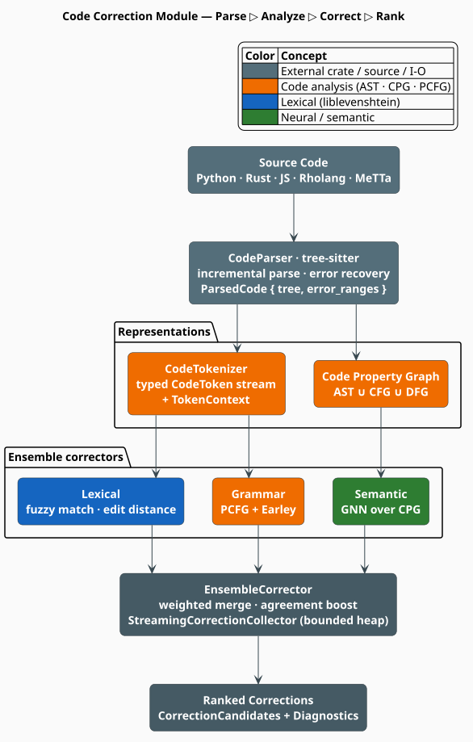

# Code Correction: Module Overview

The **code** module is libgrammstein's framework for modeling programming languages and
performing syntactic and semantic **code correction**. Where the rest of the crate models
*natural* language with n-grams and embeddings, this module models *formal* languages: it parses
source with tree-sitter, fuses three program representations into a Code Property Graph, and
runs an ensemble of correctors — lexical, grammatical, and semantic — to propose ranked repairs
for buggy or partially written code.

> **Scope.** Source of truth: [`src/code/mod.rs`](../../../src/code/mod.rs) and the submodules it
> re-exports. This page is the map; each concept has a dedicated page — [Language](language.md),
> [Languages](languages.md), [AST](ast.md), [CPG](cpg.md), [Tokenizer](tokenizer.md),
> [Correction](correction.md), and [Pipeline](pipeline.md). The corrector implementations live
> under [Correctors](correctors/overview.md); the grammar and neural machinery under
> [PCFG](pcfg.md), [GNN](gnn.md), and [Embeddings](embeddings.md).

## Acronyms

Every acronym is defined here before it is used below.

| Acronym | Expansion | Meaning in this module |
|---|---|---|
| **AST** | Abstract Syntax Tree | tree-sitter's syntactic parse tree |
| **CFG** | Control-Flow Graph | edges for possible execution order |
| **DFG** | Data-Flow Graph | def→use edges between variable definitions and reads |
| **CPG** | Code Property Graph | the joint graph $`\text{AST} \cup \text{CFG} \cup \text{DFG}`$ [[1]](#references) |
| **PCFG** | Probabilistic Context-Free Grammar | production rules weighted by corpus frequency |
| **GNN** | Graph Neural Network | message-passing scorer over the CPG |
| **WFST** | Weighted Finite-State Transducer | export target for lling-llang composition |
| **DSL** | Domain-Specific Language | here: Rholang and MeTTa |

## What the module does, and why

A code corrector faces a problem a natural-language corrector does not: **most tokens are drawn
from a fixed, formally specified vocabulary**, and a single wrong character can make a file
syntactically invalid. Yet real editors must analyze code *while it is being typed* — that is,
while it is still ungrammatical. The module is built around that tension:

1. **Parse permissively.** tree-sitter is an incremental **GLR** parser with *error recovery*:
   it always returns a tree, inserting `ERROR` and `MISSING` marker nodes where the input
   violates the grammar [[2]](#references). Correction can therefore target exactly the broken
   regions (see [AST](ast.md)).
2. **Represent richly.** Beyond syntax, semantic bugs (a misused variable, a type error) need
   *control* and *data* flow. The CPG unifies all three into one queryable graph
   [[1]](#references) (see [CPG](cpg.md)).
3. **Correct in complementary ways.** No single signal catches every error, so three correctors
   with independent failure modes vote, and their agreement is rewarded (see
   [Correctors](correctors/overview.md)).

The three correctors mirror the three classic error strata of a compiler front-end:

- **Lexical** — token-level typos (`retrun` → `return`). Fuzzy matching over the language's
  keyword/type/identifier dictionaries with liblevenshtein automata (see
  [Lexical corrector](correctors/lexical.md)).
- **Grammar** — structural errors (a missing `)` or `;`). A PCFG scores token sequences and an
  Earley parser proposes valid completions (see [Grammar corrector](correctors/grammar.md) and
  [PCFG](pcfg.md)).
- **Semantic** — meaning-level errors (variable misuse, type mismatch). A GNN reads the CPG (see
  [Semantic corrector](correctors/semantic.md) and [GNN](gnn.md)).



*Figure 1. Source flows through one tree-sitter parse into two representations — a typed token
stream and a Code Property Graph — which feed the three correctors. The `EnsembleCorrector`
merges their suggestions through a bounded streaming collector into ranked corrections.*

## Core types

Each type below is re-exported from `libgrammstein::code`; the "Defined in" column links its
page.

| Type | Role | Defined in |
|---|---|---|
| [`CodeLanguage`](language.md) | trait: grammar, keywords, token classification | `language.rs` |
| [`Python`, `Rust`, `JavaScript`, `Rholang`, `MeTTa`](languages.md) | language implementations | `languages/` |
| [`ParsedCode`](ast.md) | tree-sitter parse result with error ranges | `ast.rs` |
| [`AstNode`](ast.md) | owned, traversable syntax node | `ast.rs` |
| [`CodeToken`](tokenizer.md) | typed token with `TokenContext` | `tokenizer.rs` |
| [`CodePropertyGraph`](cpg.md) | fused AST + CFG + DFG | `cpg.rs` |
| [`WeightedCFG`](pcfg.md) | trained probabilistic grammar | `pcfg.rs` |
| [`Correction`](correction.md) | one ranked repair suggestion | `correction.rs` |
| [`CodeCorrector`](correction.md) | trait implemented by every corrector | `correction.rs` |
| [`CorrectionPipeline`](pipeline.md) | end-to-end orchestration | `pipeline.rs` |

## Quick start

The pipeline is the one-call front door. Note that `CorrectionPipeline::new` takes an **optional
grammar** and returns a `Result`, and that `analyze` takes `&mut self` (the parser caches trees):

```rust
use std::sync::Arc;
use libgrammstein::code::{CorrectionPipeline, PipelineConfig, Python};

// A Python pipeline with no PCFG grammar (lexical + semantic correctors only).
let python = Arc::new(Python::new());
let mut pipeline = CorrectionPipeline::new(python, None, PipelineConfig::default())?;

let source = "def calcluate_total(items):\n    retrun sum(items)\n";
let result = pipeline.analyze(source)?;

// Corrections are ranked by descending confidence.
for c in result.corrections.ranked() {
    println!(
        "bytes {}..{}: {} -> {} (confidence {:.2}, {:?})",
        c.start_byte, c.end_byte, c.original, c.replacement, c.confidence, c.source
    );
}
# Ok::<(), libgrammstein::code::PipelineError>(())
```

To teach the ensemble your project's identifiers and variables directly (both take `&mut`):

```rust
use std::sync::Arc;
use libgrammstein::code::{EnsembleCorrector, Python};

let python = Arc::new(Python::new());
// with_defaults(language, grammar): lexical + semantic; add grammar with Some(cfg).
let mut ensemble = EnsembleCorrector::with_defaults(python, None);
ensemble.add_identifiers(&["calculate_total", "user_count"]);
ensemble.register_variables(&[("user_count".to_string(), Some("int".to_string()))]);
```

## Supported languages

Five languages ship, each behind its own feature so a binary pulls in only the tree-sitter
grammars it needs. Details and per-language token tables are in [Languages](languages.md).

| Language | Feature | Tree-sitter grammar | Extensions |
|---|---|---|---|
| Python | `code-python` | `tree-sitter-python` | `py`, `pyw`, `pyi` |
| Rust | `code-rust` | `tree-sitter-rust` | `rs` |
| JavaScript | `code-javascript` | `tree-sitter-javascript` | `js`, `jsx`, `mjs`, `cjs` |
| Rholang | `code-rholang` | `rholang-tree-sitter` | `rho` |
| MeTTa | `code-metta` | `tree-sitter-metta` | `metta`, `mt` |

## Feature gates

The module is entirely optional; enable it and the languages you need in `Cargo.toml`:

```toml
[dependencies]
libgrammstein = { version = "0.1", features = ["code-python", "code-rust"] }
```

| Feature | Pulls in | Enables |
|---|---|---|
| `code` | `tree-sitter`, `petgraph`, `walkdir` | core module (parse, CPG, tokenize, correct) |
| `code-python` / `-rust` / `-javascript` | mainstream grammars | one mainstream language each |
| `code-rholang` / `-metta` | DSL grammars | one domain-specific language each |
| `code-mainstream` | Python + Rust + JavaScript | all mainstream languages |
| `code-dsl` | Rholang + MeTTa | all domain-specific languages |
| `code-neural` | `neural-rescore`, `ort` | CodeT5+ / UniXcoder / GraphCodeBERT embeddings |
| `code-full` | `code-neural` + `code-mainstream` + `code-dsl` | everything |
| `lling-llang-integration` | `lling-llang` | WFST export of PCFGs |

Each language feature transitively enables `code`, so `features = ["code-python"]` is
sufficient; the bare `code` feature gives the framework with no languages.

## Concurrency

The module follows the crate-wide preference for immutable, shareable state (see
[Threading Model](../../architecture/threading.md)):

- every `CodeLanguage` implementation is `Send + Sync` and stateless (a unit struct);
- `CodeCorrector::correct_token` and `correct_range` take `&self`, so one corrector can serve
  many threads;
- `CodePropertyGraph`, `ParsedCode`, and `AstNode` are plain data, freely wrapped in `Arc`.

The one exception is `CodeParser` (inside `CorrectionPipeline`): it owns a mutable tree-sitter
`Parser` and a bounded parse cache, so `analyze` is `&mut self`. For multi-threaded analysis,
build one pipeline per worker thread rather than sharing a single `&mut` pipeline.

## Complexity at a glance

For source of $`n`$ bytes producing $`V`$ graph nodes and $`E`$ edges:

| Stage | Cost | Note |
|---|---|---|
| tree-sitter parse | $`O(n)`$ amortized | incremental after the first parse [[2]](#references) |
| Tokenization | $`O(V)`$ | one pass over AST leaves |
| CPG construction | $`O(V + E)`$ | three linear passes (see [CPG](cpg.md)) |
| Lexical correction | $`O(\lvert D \rvert \cdot d)`$ | dictionary size $`\lvert D \rvert`$, max edit distance $`d`$ |
| Grammar (Earley) | $`O(n^3)`$ worst case | linear for many practical grammars |
| GNN scoring | $`O(L \cdot E)`$ | $`L`$ message-passing layers |

## Integration with lling-llang

Under the `lling-llang-integration` feature, a trained `WeightedCFG` exports to a **WFST** through
the `PcfgWfstExport` trait, so a grammar can be composed into an lling-llang lexical $`\circ`$ grammar $`\circ`$
semantic transducer cascade. See [WFST Export](wfst-export.md) and the ecosystem
[integration docs](../../integration/lling-llang/overview.md).

## References

1. F. Yamaguchi, N. Golde, D. Arp & K. Rieck (2014). *Modeling and Discovering Vulnerabilities
   with Code Property Graphs.* IEEE Symposium on Security and Privacy, 590–604.
   [doi:10.1109/SP.2014.44](https://doi.org/10.1109/SP.2014.44)
2. T. A. Wagner & S. L. Graham (1998). *Efficient and flexible incremental parsing.* ACM
   Transactions on Programming Languages and Systems 20(5), 980–1013.
   [doi:10.1145/293677.293678](https://doi.org/10.1145/293677.293678)

## See also

- [Language](language.md) — the `CodeLanguage` trait and `TokenType` taxonomy
- [Languages](languages.md) — the five shipped language implementations
- [AST](ast.md) — tree-sitter parsing, error recovery, incremental reparse
- [CPG](cpg.md) — the Code Property Graph in depth
- [Correction](correction.md) — the correction data model
- [Pipeline](pipeline.md) — the end-to-end `analyze` workflow
- [Correctors](correctors/overview.md) — lexical, grammar, semantic, and ensemble correctors
