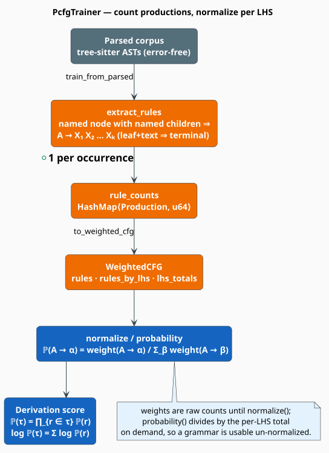

# Probabilistic Context-Free Grammars

A **Probabilistic Context-Free Grammar (PCFG)** attaches a probability to every production rule of a
context-free grammar, turning the grammar into a generative model over syntax trees. Because
programming languages *have* a known formal grammar, libgrammstein learns a PCFG from a corpus of
parsed code and uses it to score how syntactically ordinary a construct is — the statistical backbone
of the [grammar corrector](correctors/grammar.md) and the
[grammar-constrained decoder](constrained-decoding.md). This document explains what a PCFG is, the
maximum-likelihood mathematics that estimates it, and exactly how `WeightedCFG` and `PcfgTrainer`
implement it.

> **Scope.** Source of truth: [`src/code/pcfg.rs`](../../../src/code/pcfg.rs). The grammar is *consumed*
> by [Constrained Decoding](constrained-decoding.md) (Earley parsing), exported to transducers by
> [WFST Export](wfst-export.md), and applied to repairs by the
> [Grammar Corrector](correctors/grammar.md). Rules are harvested from the tree-sitter
> [AST](ast.md).

## What & why

A **context-free grammar (CFG)** describes syntax with rewrite rules such as
`if_statement -> "if" "(" expression ")" block`. A CFG answers a yes/no question — *is this string in
the language?* A PCFG answers a graded one — *how likely is this string, and which of its several
parses is most probable?* That gradation is what a corrector needs: given a malformed fragment, it
must rank candidate repairs, and "more probable under the grammar the corpus actually exhibits" is a
principled ranking signal.

libgrammstein does not hand-write grammars. It **reads production rules directly off parsed ASTs**
(`PcfgTrainer::extract_rules`): every named AST node with named children contributes one rule whose
left-hand side is the node's kind and whose right-hand side is the sequence of its named children's
kinds. Counting these across a corpus and normalizing yields the rule probabilities. The grammar is
therefore an empirical, corpus-specific model of "what code in this language usually looks like,"
rather than the language's full reference grammar.

## Theory

### Notation

Every symbol is defined before it is used.

| Symbol | Meaning |
|---|---|
| $`G = (V, \Sigma, R, S)`$ | a grammar: non-terminals, terminals, rules, start symbol |
| $`V`$ | the set of **non-terminals** (AST node kinds, e.g. `expression`) |
| $`\Sigma`$ | the set of **terminals** (leaf tokens, e.g. `"if"`) |
| $`A \in V`$ | a non-terminal on the left-hand side of a rule |
| $`\alpha \in (V \cup \Sigma)^{*}`$ | a right-hand side: a string of symbols |
| $`A \to \alpha`$ | a **production rule** rewriting $`A`$ as $`\alpha`$ |
| $`c(A \to \alpha)`$ | training **count** of the rule (times it was observed) |
| $`\mathbb{P}(A \to \alpha)`$ | the rule's probability, conditioned on its LHS |
| $`\tau`$ | a **derivation** (parse tree) |
| $`\mathrm{yield}(\tau)`$ | the terminal string at the leaves of $`\tau`$ |

**Acronyms.** *CFG* — Context-Free Grammar; *PCFG* — Probabilistic CFG; *LHS/RHS* — left/right-hand
side; *MLE* — Maximum-Likelihood Estimate.

### Rule probabilities as conditional MLE

A PCFG requires that the probabilities of all rules sharing a left-hand side form a distribution
[[1]](#references):

```math
\begin{array}{lr}
\displaystyle \sum_{\alpha} \mathbb{P}(A \to \alpha) = 1 \quad \text{for every } A \in V & \text{(P1)}
\end{array}
```

The maximum-likelihood estimate of each rule probability is its **relative frequency** — its count
divided by the total count of all rules with the same LHS:

```math
\begin{array}{lr}
\displaystyle \mathbb{P}(A \to \alpha) = \frac{c(A \to \alpha)}{\sum_{\beta} c(A \to \beta)} & \text{(P2)}
\end{array}
```

This is exactly what `WeightedCFG::probability` computes: `weight(production)` is the numerator and
`lhs_totals[lhs]` is the denominator. Storing *weights* (raw counts) rather than pre-divided
probabilities is deliberate — it keeps the grammar usable and updatable before normalization, and
`probability` performs the division $`(\mathrm{P2})`$ lazily on each query.

### Probability of a derivation

Under the context-free independence assumption, the probability of a parse tree $`\tau`$ is the
**product** of the probabilities of the rules used to build it:

```math
\begin{array}{lr}
\displaystyle \mathbb{P}(\tau) = \prod_{(A \to \alpha) \in \tau} \mathbb{P}(A \to \alpha) & \text{(P3)}
\end{array}
```

A string can have several parses; its probability marginalizes over them, and its most probable parse
is the Viterbi derivation:

```math
\begin{array}{lr}
\displaystyle \mathbb{P}(s) = \sum_{\tau \,:\, \mathrm{yield}(\tau) = s} \mathbb{P}(\tau),
\qquad
\hat{\tau}(s) = \arg\max_{\tau \,:\, \mathrm{yield}(\tau) = s} \mathbb{P}(\tau) & \text{(P4)}
\end{array}
```

Because a product of many small probabilities underflows, scoring is done in **log space**, where the
product $`(\mathrm{P3})`$ becomes a sum — this is `PcfgScorer::score_parse` (see
[WFST Export](wfst-export.md)):

```math
\begin{array}{lr}
\displaystyle \log \mathbb{P}(\tau) = \sum_{(A \to \alpha) \in \tau} \log \mathbb{P}(A \to \alpha) & \text{(P5)}
\end{array}
```

`WeightedCFG::log_probability` returns $`\log \mathbb{P}(A \to \alpha)`$, and defines
$`\log 0 = -\infty`$ (`f64::NEG_INFINITY`) for a rule that was never observed, so an impossible
production annihilates the whole derivation's log-probability — the syntactic analogue of the
zero-probability n-gram discussed in [Modified Kneser-Ney](../ngram/modified-kneser-ney.md).

## Training, literately

The trainer walks each parsed AST and emits one production per named internal node. The following
mirrors [`PcfgTrainer::extract_rules`](../../../src/code/pcfg.rs) and `to_weighted_cfg`; `⟨…⟩` names a
refinement expanded below.

```
function train(parsed_files):                       ▸ PcfgTrainer over a corpus
    for parsed in parsed_files:
        ast <- AstNode.from_ts_node(parsed.root, parsed.source)
        extract_rules(ast)                          ▸ accumulate into rule_counts
    return to_weighted_cfg()

function extract_rules(node):
    if node.is_error or node.is_missing: return     ▸ never learn from broken syntax
    if node.is_named and node.children not empty:
        ⟨Emit one production for this node⟩
    for child in node.children:                     ▸ recurse over the whole subtree
        extract_rules(child)

⟨Emit one production for this node⟩ ≡
    lhs <- node.kind                                ▸ the node kind is the non-terminal
    rhs <- []
    for c in node.children where c.is_named:        ▸ unnamed punctuation is skipped
        if c.children empty and c.text present:
            rhs.append(Terminal(c.kind))            ▸ a leaf with text is a terminal
        else:
            rhs.append(NonTerminal(c.kind))         ▸ an internal node is a non-terminal
    if rhs not empty:
        rule_counts[Production(lhs, rhs)] += 1

function to_weighted_cfg():                          ▸ counts -> WeightedCFG
    cfg <- WeightedCFG(start_symbol)                ▸ default start = "source_file"
    for (production, count) in rule_counts:
        cfg.add_rule(production, count as f64)       ▸ weight = raw count
    return cfg
```

`add_rule` maintains three structures in lock-step so later queries are $`O(1)`$: the
`rules: HashMap<Production, f64>` weight table, the `rules_by_lhs` index used by `rules_for`, and the
`lhs_totals` running per-LHS denominator of $`(\mathrm{P2})`$. Calling `normalize` rewrites every
stored weight to its probability and resets each `lhs_totals` entry to $`1.0`$, so a normalized
grammar's `weight` and `probability` coincide.

## Engineering

### Data structures

```rust
pub enum Symbol {
    NonTerminal(String),   // Display: <expr>
    Terminal(String),      // Display: 'if'
}

pub struct Production {
    pub lhs: String,       // a non-terminal
    pub rhs: Vec<Symbol>,  // may be empty (an epsilon production)
}

pub struct WeightedCFG {
    rules: HashMap<Production, f64>,                    // rule -> weight (count)
    rules_by_lhs: HashMap<String, Vec<(Production, f64)>>, // LHS -> its rules (index)
    start_symbol: String,
    lhs_totals: HashMap<String, f64>,                  // LHS -> sum of weights, the (P2) denominator
}
```

`Production` and `Symbol` derive `Hash + Eq`, so a production is a valid `HashMap` key and identical
rules from different files collapse onto one incremented count. `Production::is_epsilon` reports an
empty RHS and `Production::arity` its length.

### Complexity

| Operation | Cost | Note |
|---|---|---|
| `add_rule` | $`O(\lvert \alpha \rvert)`$ amortized | hashes the production; updates three maps |
| `probability` / `log_probability` | $`O(1)`$ | one lookup, one division $`(\mathrm{P2})`$ |
| `rules_for(A)` | $`O(\lvert R_A \rvert)`$ | pre-indexed by LHS |
| `extract_rules` over one AST | $`O(n)`$ | $`n`$ = AST nodes, one visit each |
| `normalize` | $`O(\lvert R \rvert)`$ | one pass over all rules |

Memory is $`O(\lvert R \rvert)`$ — one entry per *distinct* production. A mainstream language with a
few hundred node kinds and average arity around three typically yields a low-thousands rule set of a
few tens of kilobytes.

### Concurrency and feature-gating

The whole `code` module is behind the `code` Cargo feature (which pulls in `tree-sitter` and
`petgraph`). A built `WeightedCFG` is immutable and `Send + Sync`, so a single grammar may be shared
across correction threads by `Arc`; `PcfgTrainer`, by contrast, accumulates counts and needs `&mut`
during training.

### A subtlety: two `PcfgWfstConfig` types

`pcfg.rs` defines a `PcfgWfstConfig` describing *which rules* to export
(`include_epsilon`, `min_probability = 1e-10`, `max_rules`). The actual WFST **builder** in
[`wfst_export.rs`](../../../src/code/wfst_export.rs) carries its own, differently-shaped
`PcfgWfstConfig` (`max_depth`, `include_backoff`, `max_states`) — see [WFST Export](wfst-export.md).
They are distinct types in distinct modules; do not conflate them.



## Usage

Train a grammar from a corpus, normalize it, and score productions:

```rust
use libgrammstein::code::pcfg::{PcfgTrainer, Production, Symbol, WeightedCFG};
use libgrammstein::code::{CodeParser, Python};
use std::sync::Arc;

let python = Arc::new(Python::new());
let mut parser = CodeParser::new(Arc::clone(&python))?;
let mut trainer = PcfgTrainer::new(&*python);

for source in ["def add(a, b): return a + b", "def sub(a, b): return a - b"] {
    let parsed = parser.parse(source)?;
    if !parsed.has_errors {          // only learn from clean parses
        trainer.train_from_parsed(&parsed);
    }
}

let mut cfg = trainer.to_weighted_cfg();
cfg.normalize();                     // weights become probabilities, (P2)

// P(function_definition -> ...) for the most probable expansion.
for (production, _weight) in cfg.rules_for("function_definition") {
    let log_p = cfg.log_probability(production);   // (P5)
    println!("{production}  log P = {log_p:.3}");
}
# Ok::<(), libgrammstein::code::AstError>(())
```

A grammar can also be built by hand for a small language or a test — the classic ambiguous
expression grammar, with weights that `normalize` will turn into $`(\mathrm{P2})`$ probabilities:

```rust
use libgrammstein::code::pcfg::{Production, Symbol, WeightedCFG};

let mut cfg = WeightedCFG::new("expr");
cfg.add_rule(
    Production::new("expr", vec![
        Symbol::non_terminal("expr"),
        Symbol::terminal("+"),
        Symbol::non_terminal("term"),
    ]),
    3.0,   // observed 3 times
);
cfg.add_rule(
    Production::new("expr", vec![Symbol::non_terminal("term")]),
    1.0,   // observed once
);
// P(expr -> expr '+' term) = 3 / (3 + 1) = 0.75
```

## References

1. T. L. Booth & R. A. Thompson (1973). *Applying probability measures to abstract languages.* IEEE
   Transactions on Computers, C-22(5), 442–450.
   [doi:10.1109/T-C.1973.223746](https://doi.org/10.1109/T-C.1973.223746)
2. J. Earley (1970). *An efficient context-free parsing algorithm.* Communications of the ACM 13(2),
   94–102. [doi:10.1145/362007.362035](https://doi.org/10.1145/362007.362035)

## See also

- [Constrained Decoding](constrained-decoding.md) — Earley parsing over this grammar
- [WFST Export](wfst-export.md) — the finite-state approximation of a PCFG
- [Grammar Corrector](correctors/grammar.md) — repairs driven by these rule probabilities
- [Code Property Graph](cpg.md) — the richer graph the semantic path consumes
- [Correctors Overview](correctors/overview.md) — where the grammar layer fits
- [Modified Kneser-Ney](../ngram/modified-kneser-ney.md) — the analogous smoothing story for n-grams
