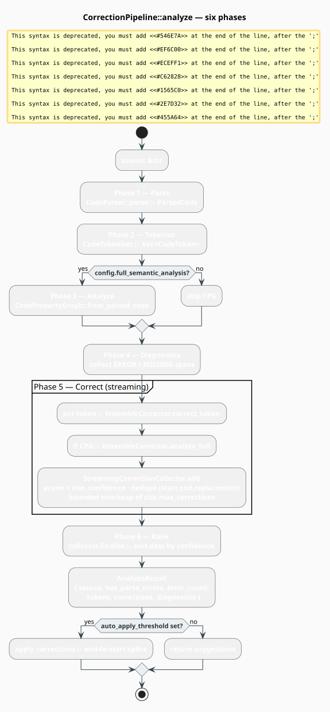

# The Correction Pipeline

`CorrectionPipeline` is the module's front door: hand it source text, get back **ranked
corrections and diagnostics**. It owns the tree-sitter parser, drives the tokenizer, optionally
builds the Code Property Graph, runs the ensemble of correctors, and — the part that makes it
usable on real files — collects their output through a **bounded streaming top-$`k`$ selector**
rather than buffering every suggestion in memory.

> **Scope.** Source of truth: [`src/code/pipeline.rs`](../../../src/code/pipeline.rs). The pieces
> it orchestrates are documented separately: [AST](ast.md), [Tokenizer](tokenizer.md),
> [CPG](cpg.md), [Correctors](correctors/overview.md), and the
> [correction data model](correction.md).

## Notation

| Symbol | Meaning |
|---|---|
| $`n`$ | length of the source in bytes |
| $`t`$ | number of tokens the tokenizer emits |
| $`V, E`$ | nodes and edges of the CPG |
| $`\mathcal{C}`$ | the multiset of **all** corrections proposed by the correctors |
| $`m = \lvert \mathcal{C} \rvert`$ | how many that is — potentially $`10^5`$ for a large file |
| $`k`$ | `max_corrections` — the bound on what is kept (default `50`) |
| $`\theta`$ | `min_confidence` — the pruning floor (default `0.3`) |
| $`\gamma(c)`$ | the confidence of correction $`c`$ |



*Figure 1. `analyze` runs six phases. Parsing and tokenization always run; CPG construction is
gated on `full_semantic_analysis`. Every correction produced in Phase 5 is streamed straight into
a `StreamingCorrectionCollector`, which prunes below `min_confidence`, de-duplicates on
`(start, end, replacement)`, and keeps only the `max_corrections` best in a bounded min-heap.
Phase 6 drains that heap into a ranked `AnalysisResult`. Nothing is ever written back to the
source: applying a fix is the caller's decision, made with `apply_corrections`.*

## The six phases, literately

The following mirrors [`CorrectionPipeline::analyze`](../../../src/code/pipeline.rs) exactly.

```
function analyze(source):                                  ▸ &mut self: the parser is stateful
    parsed <- parser.parse(source)                         ▸ Phase 1 — never fails on bad syntax
        on error: return Err(PipelineError::ParseError)

    tokens <- CodeTokenizer::new(language).tokenize(       ▸ Phase 2 — comments/whitespace dropped
                  parsed.tree, parsed.source)

    cpg <- if config.full_semantic_analysis                ▸ Phase 3 — optional; O(V + E)
               then Some(CodePropertyGraph::from_parsed_code(parsed))
               else None

    diagnostics <- []                                      ▸ Phase 4 — one Error per ERROR/MISSING
    for e in parsed.errors():
        diagnostics.push(Diagnostic {
            severity: Error, message: "Syntax error: {e.kind} '{e.text}'",
            start_byte: e.start_byte, end_byte: e.end_byte,
            line: e.start_position.0, column: e.start_position.1 })

    collector <- StreamingCorrectionCollector::new(        ▸ Phase 5 — bounded, streaming
                     config.max_corrections, config.min_confidence)
    for token in tokens:
        context <- TokenContext::new(token.token_type)     ▸ ⚠ a *minimal* context — see below
        collector.add_all(corrector.correct_token(token, context))
    if cpg is Some(g):
        collector.add_all(corrector.analyze_full(parsed, g))   ▸ CPG-wide semantic pass

    corrections <- collector.finalize()                    ▸ Phase 6 — drain heap, sort descending

    if config.include_diagnostics:                         ▸ one Hint per surviving correction
        for c in corrections.ranked():
            (line, col) <- byte_offset_to_position(source, c.start_byte)
            diagnostics.push(Diagnostic {
                severity: Hint,
                message: c.context ?? "Consider: {c.original} -> {c.replacement}",
                start_byte: c.start_byte, end_byte: c.end_byte, line, column: col })

    return AnalysisResult { source, has_parse_errors: parsed.has_errors,
                            error_count: parsed.error_count(),
                            tokens, corrections, diagnostics }
```

> **Phase 5 discards structural context.** `analyze` constructs a *fresh minimal*
> `TokenContext::new(token.token_type)` — depth `0`, no parent, `in_error_region: false` — instead
> of forwarding `token.context`, which the tokenizer had already populated with the token's parent
> kind, sibling kinds, AST depth, and error-region flag. The information is not lost (it is still
> reachable as `token.context` on the `token` argument every corrector receives), but a corrector
> that trusts the `context` *parameter* sees a stripped-down view. See
> [Language](language.md#tokencontext-structure-around-a-token).

## The streaming collector

A naive pipeline collects every correction into a `Vec`, sorts it, and truncates. For a 10 000-token
file with three correctors each proposing a handful of candidates per token, that `Vec` holds
$`10^5`$ corrections — of which the caller wants the best 50. `StreamingCorrectionCollector`
computes the same answer in $`O(k)`$ space.

It maintains a **bounded min-heap** on confidence — a `BinaryHeap` whose `Ord` is *reversed*, so
`peek()` yields the **worst** correction currently retained. The result is the classic streaming
top-$`k`$ selection:

```math
\mathrm{top}_k(\mathcal{C}) \;=\; \text{the } \min(k,\, \lvert \mathcal{C}_\theta \rvert) \text{ highest-confidence elements of } \mathcal{C}_\theta,
\qquad
\mathcal{C}_\theta \;=\; \{\, c \in \mathcal{C} \;:\; \gamma(c) \ge \theta \,\} \tag{P1}
```

computed in

```math
O\!\bigl(m \log k\bigr) \text{ time and } \Theta(k) \text{ space} \tag{P2}
```

against the $`O(m \log m)`$ time and $`\Theta(m)`$ space of sort-then-truncate. Each arriving
correction takes one of four paths:

```
function add(c):
    if γ(c) < θ:                       return false      ▸ 1. early prune — below the floor
    key <- (c.start_byte, c.end_byte, c.replacement)
    if key ∈ seen:                     return false      ▸ 2. duplicate — an identical suggestion
    if |heap| < k:                                       ▸ 3. room left — always accept
        seen.insert(key); heap.push(c); return true
    worst <- heap.peek()                                 ▸ the *lowest*-confidence retained
    if γ(c) > γ(worst):                                  ▸ 4. better than the worst — swap
        evicted <- heap.pop()
        seen.remove(key_of(evicted))                     ▸ evicted key may be proposed again
        seen.insert(key); heap.push(c); return true
    return false                                         ▸ otherwise drop
```

Three details are load-bearing:

- **The de-duplication key is `(start_byte, end_byte, replacement)`** — not the whole correction.
  Two correctors that independently propose `retrun` → `return` at the same span collapse to one
  entry, which is what you want. But two correctors proposing *different* replacements for the same
  span both survive: they are genuinely competing hypotheses, and ranking is what arbitrates.
- **Eviction retracts the key.** When the heap is full and a better correction displaces the worst
  one, the evicted correction's key is removed from `seen`, so it is not permanently blacklisted.
- **The heap is pre-allocated** at `k + 1` entries, so the hot path performs no reallocation.

`finalize()` drains the heap, sorts descending ($`O(k \log k)`$), and packs the result into a
[`CorrectionCandidates`](correction.md) of capacity $`k`$ — the only point at which that type is
touched, and the reason its $`O(k \log k)`$-per-insert `add` never becomes a bottleneck.

## Configuration

```rust
pub struct PipelineConfig {
    pub max_corrections: usize,          // k      — default 50
    pub min_confidence: f64,             // theta  — default 0.3
    pub include_diagnostics: bool,       //        — default true
    pub auto_apply_threshold: Option<f64>, //      — default None
    pub full_semantic_analysis: bool,    //        — default true
}
```

| Field | Default | Effect |
|---|---|---|
| `max_corrections` | `50` | the $`k`$ of $`(\mathrm{P1})`$; bounds both memory and output |
| `min_confidence` | `0.3` | the $`\theta`$ of $`(\mathrm{P1})`$; raise to trade recall for precision |
| `include_diagnostics` | `true` | emit a `Hint` diagnostic per surviving correction |
| `auto_apply_threshold` | `None` | **advisory only** — see below |
| `full_semantic_analysis` | `true` | build the CPG and run the CPG-wide semantic pass |

> **`auto_apply_threshold` is inert inside the pipeline.** `analyze` never reads it, and never
> mutates your source. It is a *declared policy* that the caller is expected to enforce — filter
> `corrections.ranked()` by the threshold and hand the survivors to `apply_corrections`. The
> example under [Applying corrections](#applying-corrections) does exactly that. Treat the field as
> a place to carry your policy, not as a behavior the pipeline performs.

## Constructing a pipeline

Three constructors, all returning `Result<Self, PipelineError>` (building a tree-sitter parser can
fail if the grammar and the tree-sitter runtime disagree on ABI version):

```rust
use libgrammstein::code::{CorrectionPipeline, PipelineConfig, Python};
use std::sync::Arc;

let python = Arc::new(Python::new());

// 1. Full control. The grammar is Option<WeightedCFG>: None disables the grammar corrector.
let config = PipelineConfig { max_corrections: 20, min_confidence: 0.5, ..Default::default() };
let mut full = CorrectionPipeline::new(Arc::clone(&python), None, config)?;

// 2. Defaults (lexical + semantic; add Some(cfg) for grammar too).
let mut standard = CorrectionPipeline::with_defaults(Arc::clone(&python), None)?;

// 3. Minimal: lexical corrector only, and `full_semantic_analysis` forced off (no CPG).
let mut fast = CorrectionPipeline::minimal(Arc::clone(&python))?;
# let _ = (&mut full, &mut standard, &mut fast);
# Ok::<(), libgrammstein::code::PipelineError>(())
```

**`analyze` takes `&mut self`.** The pipeline owns a tree-sitter `Parser` and its parse cache, both
of which mutate on every parse — that is what makes incremental reparsing possible (see
[AST](ast.md)). The binding must therefore be `mut`.

### Teaching the ensemble your project

The correctors' dictionaries are empty of *your* names until you supply them. Both methods take
`&mut`, so reach them through `corrector_mut()` **before** analyzing:

```rust
use libgrammstein::code::{CorrectionPipeline, Python};
use std::sync::Arc;

let mut pipeline = CorrectionPipeline::with_defaults(Arc::new(Python::new()), None)?;

pipeline.corrector_mut().add_identifiers(&["calculate_total", "process_batch", "user_count"]);
pipeline.corrector_mut().register_variables(&[
    ("user_count".to_string(), Some("int".to_string())),
    ("items".to_string(), Some("list".to_string())),
]);
# Ok::<(), libgrammstein::code::PipelineError>(())
```

Without this, a misspelled call to your own function has no correct spelling to be matched against,
and the lexical corrector will (rightly) stay silent.

## What comes back

```rust
pub struct AnalysisResult {
    pub source: String,                     // the analyzed source, owned
    pub has_parse_errors: bool,             // did tree-sitter recover from anything?
    pub error_count: usize,                 // how many ERROR/MISSING regions
    pub tokens: Vec<CodeToken>,             // the Phase-2 token stream
    pub corrections: CorrectionCandidates,  // ranked, bounded by max_corrections
    pub diagnostics: Vec<Diagnostic>,       // parse errors, then correction hints
}
```

> **The tree and the graph are not returned.** `ParsedCode` and `CodePropertyGraph` are not
> `Clone`, so `AnalysisResult` cannot carry them. If you need the AST or the CPG, build them
> yourself from a [`CodeParser`](ast.md) — the pipeline is a convenience, not the only door.

A `Diagnostic` is an editor-shaped record — severity, message, byte span, and a
**zero-indexed** `(line, column)` computed by `byte_offset_to_position`:

```rust
pub enum DiagnosticSeverity { Error, Warning, Info, Hint }
```

The pipeline emits exactly two kinds: an **`Error`** per tree-sitter error region (`"Syntax error:
ERROR 'retrun'"`), and — when `include_diagnostics` is set — a **`Hint`** per surviving correction,
whose message is the correction's `context` if it has one and `"Consider: retrun -> return"`
otherwise. `Warning` and `Info` are available to callers building their own diagnostics; the
pipeline never produces them.

## Analyzing

```rust
use libgrammstein::code::{CorrectionPipeline, DiagnosticSeverity, Python};
use std::sync::Arc;

let mut pipeline = CorrectionPipeline::with_defaults(Arc::new(Python::new()), None)?;
pipeline.corrector_mut().add_identifiers(&["calculate_total"]);

let source = "def calculate_total(items):\n    retrun sum(items)\n";
let result = pipeline.analyze(source)?;

if result.has_parse_errors {
    println!("{} error region(s)", result.error_count);
}

// Corrections arrive ranked by descending confidence.
for c in result.corrections.ranked() {
    println!(
        "bytes {}..{}: {} -> {} ({:.2}, {:?}, {:?})",
        c.start_byte, c.end_byte, c.original, c.replacement, c.confidence, c.kind, c.source
    );
}

// Diagnostics are editor-ready; line/column are 0-indexed.
for d in &result.diagnostics {
    let tag = match d.severity {
        DiagnosticSeverity::Error => "error",
        DiagnosticSeverity::Warning => "warning",
        DiagnosticSeverity::Info => "info",
        DiagnosticSeverity::Hint => "hint",
    };
    println!("{}:{}: {}: {}", d.line + 1, d.column + 1, tag, d.message);
}
# Ok::<(), libgrammstein::code::PipelineError>(())
```

## Applying corrections

`apply_corrections` is the counterpart to `analyze`, and it is **pure**: it returns a new `String`
and never touches the pipeline's state. It sorts the given corrections by **descending
`start_byte`** and splices from the end of the file toward the beginning, so no splice invalidates
the byte offsets of a splice not yet performed. Corrections whose span falls outside the current
string are skipped rather than panicking.

This is also where an `auto_apply_threshold` policy is actually enforced — by you:

```rust
use libgrammstein::code::{Correction, CorrectionPipeline, PipelineConfig, Python};
use std::sync::Arc;

let config = PipelineConfig { auto_apply_threshold: Some(0.9), ..Default::default() };
let mut pipeline = CorrectionPipeline::new(Arc::new(Python::new()), None, config)?;

let source = "def calculate_total(items):\n    retrun sum(items)\n";
let result = pipeline.analyze(source)?;

// The pipeline records the policy; the caller applies it.
let threshold = pipeline.config().auto_apply_threshold.unwrap_or(1.0);
let confident: Vec<Correction> = result
    .corrections
    .ranked()
    .iter()
    .filter(|c| c.confidence >= threshold)
    .cloned()
    .collect();

let fixed = pipeline.apply_corrections(source, &confident);
println!("{fixed}");
# Ok::<(), libgrammstein::code::PipelineError>(())
```

> **Filter to one correction per span.** `apply_corrections` does not check for overlaps. If two
> competing corrections target the same token, both are spliced and the output is corrupted. When
> auto-applying, keep at most the best correction per byte span — see
> [Correction](correction.md#applying-more-than-one-correction).

## Errors

```rust
pub enum PipelineError {
    ParseError(String),      // tree-sitter could not be configured / the parse failed outright
    TokenizeError(String),
    CpgError(String),
    CorrectionError(String),
    IoError(std::io::Error),
}
```

`PipelineError` implements `Display`, `std::error::Error`, and `From<std::io::Error>`.

> **Only two variants are ever constructed.** `ParseError` (from `CodeParser::new` and
> `CodeParser::parse`) and `IoError` (via the `From` impl). `TokenizeError`, `CpgError`, and
> `CorrectionError` are declared for forward compatibility but no code path produces them today:
> tokenization, CPG construction, and correction are all infallible by construction. Match on them
> if you like — just do not expect them.

Note that a **syntactically invalid file is not an error**. tree-sitter always returns a tree, with
`ERROR` and `MISSING` markers where recovery happened [[1]](#references); the pipeline reports that
through `has_parse_errors` and `error_count`, and proceeds to correct it. `ParseError` is reserved
for the parser failing to *run at all*.

## Complexity

For a source of $`n`$ bytes yielding $`t`$ tokens, a CPG of $`V`$ nodes and $`E`$ edges, and
$`m`$ proposed corrections bounded at $`k`$:

| Phase | Time | Space | Note |
|---|---|---|---|
| 1 — Parse | $`O(n)`$ amortized | $`O(n)`$ | incremental after the first parse [[1]](#references) |
| 2 — Tokenize | $`O(t)`$ | $`O(t)`$ | one pass over the AST leaves |
| 3 — CPG | $`O(V + E)`$ | $`O(V + E)`$ | skipped when `full_semantic_analysis` is `false` |
| 4 — Diagnostics | $`O(\text{errors})`$ | $`O(\text{errors})`$ | one per error region |
| 5 — Correct + collect | $`O(t \cdot \bar{c} + m \log k)`$ | $`\Theta(k)`$ | $`\bar{c}`$ = per-token corrector cost; **$`k`$, not $`m`$** |
| 6 — Finalize | $`O(k \log k)`$ | $`O(k)`$ | drain and sort the heap |

The whole point of $`(\mathrm{P2})`$ is the space column: peak memory is governed by the source,
the token stream, and the graph — never by how many corrections the correctors happened to propose.

## Concurrency

`analyze` is `&mut self`, so a single pipeline cannot be shared across threads. Do **not** wrap one
in a `Mutex` and contend on it — the parser is the whole point of the pipeline and serializing it
serializes your analysis. Build **one pipeline per worker** instead; languages are unit structs, so
the per-worker cost is just a tree-sitter `Parser`:

```rust
use libgrammstein::code::{CorrectionPipeline, Python};
use rayon::prelude::*;
use std::sync::Arc;

let language = Arc::new(Python::new());
let sources: Vec<&str> = vec!["def f(x):\n    retrun x\n", "def g(y):\n    return y\n"];

let error_counts: Vec<usize> = sources
    .par_iter()
    .map(|src| {
        // One pipeline per rayon worker task; the language handle is shared.
        let mut pipeline = CorrectionPipeline::minimal(Arc::clone(&language))
            .expect("failed to build pipeline");
        pipeline
            .analyze(src)
            .map(|r| r.corrections.len())
            .unwrap_or(0)
    })
    .collect();

assert_eq!(error_counts.len(), 2);
```

Everything the pipeline *produces* is plain owned data: `AnalysisResult`, `Diagnostic`, and
`Correction` are all `Send`, so results cross thread boundaries freely.

## Tuning

| Symptom | Lever |
|---|---|
| Analysis too slow | `CorrectionPipeline::minimal` — skips the CPG and the semantic corrector |
| Too many weak suggestions | raise `min_confidence` ($`\theta`$) above the `0.3` default |
| Output list too long | lower `max_corrections` ($`k`$) |
| Semantic bugs missed | ensure `full_semantic_analysis` is on and variables are registered |
| Your own names flagged as typos | `corrector_mut().add_identifiers(...)` |

## References

1. T. A. Wagner & S. L. Graham (1998). *Efficient and flexible incremental parsing.* ACM
   Transactions on Programming Languages and Systems 20(5), 980–1013. — the error-recovering
   incremental parsing model behind Phase 1.
   [doi:10.1145/293677.293678](https://doi.org/10.1145/293677.293678)
2. F. Yamaguchi, N. Golde, D. Arp & K. Rieck (2014). *Modeling and Discovering Vulnerabilities
   with Code Property Graphs.* IEEE Symposium on Security and Privacy, 590–604. — the graph built
   in Phase 3.
   [doi:10.1109/SP.2014.44](https://doi.org/10.1109/SP.2014.44)

## See also

- [Overview](overview.md) — the module map and quick start
- [AST](ast.md) — the parser the pipeline owns, and error recovery
- [Tokenizer](tokenizer.md) — Phase 2
- [CPG](cpg.md) — Phase 3
- [Correctors](correctors/overview.md) — the ensemble driven in Phase 5
- [Correction](correction.md) — `Correction`, `CorrectionCandidates`, and applying repairs
