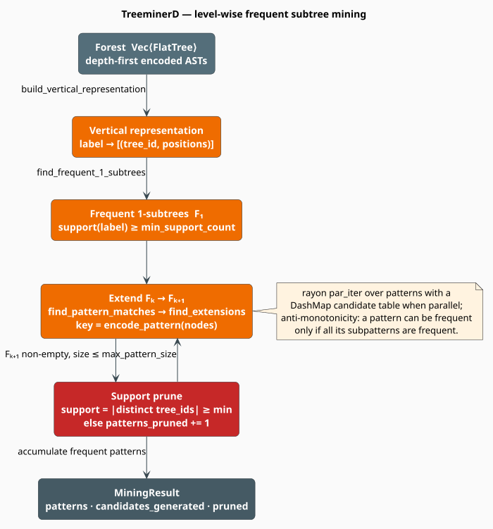

# Frequent Subtree Mining with TreeminerD

Given a forest of ASTs — one per source file — **frequent subtree mining** returns the tree-shaped
patterns that recur across at least a chosen fraction of them. That is how the code module
discovers a codebase's *idioms* without being told what they are: the `try`/`except`/`log`
skeleton, the builder chain, the guard-clause-then-return shape, and the outright copy-paste
clones. libgrammstein implements **TreeminerD**, Zaki's depth-first, level-wise miner
[[1]](#references).

> **Scope.** Source of truth: [`src/code/subtree/`](../../../src/code/subtree/) —
> [`pattern.rs`](../../../src/code/subtree/pattern.rs) (the data structures) and
> [`treeminer.rs`](../../../src/code/subtree/treeminer.rs) (the algorithm). This page covers the
> **mining loop and its engineering** as the code module drives it. The depth-first *encoding*, the
> `FlatTree`/`SubtreePattern` type reference, and the pattern-encoding utilities are documented in
> [Subtree Mining](../subtree/overview.md), with a worked walk-through in
> [TreeminerD Algorithm](../subtree/treeminer-d.md). Read those first if you want the data model;
> read this one if you want to know what `mine` actually does.

## Notation

| Symbol | Meaning |
|---|---|
| $`m`$ | number of trees in the forest |
| $`T_i`$ | the $`i`$-th tree (a `FlatTree`) |
| $`\bar{n}`$ | average nodes per tree |
| $`P`$ | a candidate pattern (a `SubtreePattern`) |
| $`P \sqsubseteq T`$ | $`P`$ occurs in $`T`$ as an **embedded** subtree |
| $`\mathrm{supp}(P)`$ | the **support** of $`P`$ — how many trees contain it |
| $`\sigma \in [0,1]`$ | `min_support`, the required fraction |
| $`\sigma_{\min}`$ | `min_support_count`, the required *count* |
| $`F_k`$ | the set of frequent patterns of size $`k`$ |
| $`L`$ | the number of distinct node labels in the forest |

## Support, frequency, and why the search terminates

The **support** of a pattern is the number of *distinct trees* that contain it. Multiple
occurrences inside one tree do **not** raise support — this is transaction support, the same notion
used in association-rule mining, and it is what makes the measure comparable across files of wildly
different sizes:

```math
\mathrm{supp}(P) \;=\; \bigl\lvert \{\, i \in \{1, \dots, m\} \;:\; P \sqsubseteq T_i \,\} \bigr\rvert,
\qquad
\mathrm{supp\_ratio}(P) \;=\; \frac{\mathrm{supp}(P)}{m} \tag{T1}
```

A pattern is **frequent** when its support clears a threshold derived from `min_support`. The
`max(·, 1)` guard means a forest is never mined with a threshold of zero, however small $`\sigma`$
or $`m`$ may be:

```math
\sigma_{\min} \;=\; \max\bigl(\lceil \sigma \cdot m \rceil,\; 1\bigr) \tag{T2}
```

This is `MiningResult::min_support_count`. Everything hinges on one property — **anti-monotonicity**
(the Apriori property [[3]](#references)): removing a node from a pattern can only make it *easier*
to find, never harder.

```math
P' \sqsubseteq P \;\;\Longrightarrow\;\; \mathrm{supp}(P') \;\ge\; \mathrm{supp}(P) \tag{T3}
```

Contrapositively: **if a pattern is infrequent, every extension of it is infrequent too.** That is
what licenses level-wise search — grow $`F_{k+1}`$ only from $`F_k`$, and prune the moment support
drops below $`\sigma_{\min}`$, secure in the knowledge that nothing frequent was thrown away.
Without $`(\mathrm{T3})`$ the search space (every subtree of every tree) would be hopeless.



*Figure 1. The forest is inverted into a **vertical representation** (label → the trees and
positions where it occurs), from which the frequent single nodes $`F_1`$ fall out directly.
Patterns are then grown one node at a time: each $`F_k`$ pattern is matched against the trees it
occurs in, extended, keyed by its canonical encoding, and kept only when the number of distinct
tree ids reaches $`\sigma_{\min}`$. When `parallel` is on, the extension step runs under rayon with
a `DashMap` candidate table.*

## The mining loop, literately

This mirrors [`TreeminerD::mine`](../../../src/code/subtree/treeminer.rs).

```
function mine(trees):
    if trees is empty: return an empty MiningResult
    m       <- |trees|
    σ_min   <- max(ceil(config.min_support · m), 1)            ▸ (T2)
    tree_map <- { t.tree_id → t  for t in trees }              ▸ built ONCE, reused every level

    vertical <- build_vertical_representation(trees)           ▸ label → [(tree_id, positions)]
    F₁       <- find_frequent_1_subtrees(vertical, σ_min, m)   ▸ single-node patterns

    all      <- F₁ ;  level <- F₁ ;  k <- 2
    while level is non-empty and k <= config.max_pattern_size:
        (next, generated, pruned) <- extend(level, tree_map, σ_min, m)   ▸ parallel or serial
        next <- next filtered by  size >= config.min_pattern_size
                              and max_depth <= config.max_depth
        all.extend(next) ;  level <- next ;  k <- k + 1

    patterns <- all filtered by size >= config.min_pattern_size          ▸ drops F₁ when min_pattern_size > 1
    return MiningResult { patterns, num_trees: m, min_support_count: σ_min,
                          candidates_generated, patterns_pruned, mining_time_ms }

⟨build_vertical_representation(trees)⟩ ≡
    for t in trees:                                            ▸ one entry per (label, tree)
        for (label, positions) in t.label_positions():
            vertical[label].push((t.tree_id, positions))
    ▸ hence |vertical[label]| == the number of trees containing `label` == its support

⟨find_frequent_1_subtrees(vertical, σ_min, m)⟩ ≡
    for (label, occurrences) in vertical:
        if |occurrences| >= σ_min:                             ▸ (T1) directly
            emit SubtreePattern { nodes: [PatternNode(label, depth = 0)],
                                  support: |occurrences|, occurrences: tree_ids, … }

⟨extend(patterns, tree_map, σ_min, m)⟩ ≡
    candidates <- {}                                           ▸ encoding → (nodes, set of tree_ids)
    for P in patterns:                       ▸ rayon par_iter + DashMap when config.parallel
        for tree_id in P.occurrences:                          ▸ only trees P is known to be in
            t <- tree_map[tree_id]
            for ext in find_extensions(P, t):
                candidates_generated += 1
                candidates[encode_pattern(ext)].tree_ids.insert(tree_id)   ▸ a SET: (T1) dedupes
    for (nodes, tree_ids) in candidates:
        if |tree_ids| >= σ_min:  emit SubtreePattern { nodes, support: |tree_ids|, … }
        else:                    patterns_pruned += 1          ▸ (T3): prune, do not recurse
```

Two structural choices deserve emphasis:

- **Candidates are keyed by their canonical encoding.** `encode_pattern` renders a pattern as
  `depth:label` fields joined by `|`:

  ```math
  \mathrm{enc}(P) \;=\; d_1 \!:\! \ell_1 \;\vert\; d_2 \!:\! \ell_2 \;\vert\; \cdots \;\vert\; d_k \!:\! \ell_k \tag{T4}
  ```

  For example `0:function_definition|1:parameters|1:block`. Because pre-order plus relative depth
  determines the tree, this string is a *canonical form*: two patterns are the same tree exactly
  when their encodings are equal. Grouping candidates is therefore a string hash, not a tree
  isomorphism test — the trick that makes the inner loop cheap.
- **Support counts trees, not occurrences.** The candidate table maps an encoding to a
  `HashSet<u64>` of tree ids, so a pattern found five times in one file still contributes exactly
  `1` to its support — enforcing $`(\mathrm{T1})`$ by construction.

### Extension: an honest look

`find_extensions(P, t)` first locates every match of $`P`$ in $`t`$ (`find_pattern_matches`, which
walks pre-order comparing `(label, relative-depth)` pairs and permits intervening nodes to be
skipped — Zaki's *embedded* match), and then, for each match, scans **forward** from the last
matched position, appending each subsequent node as a new pattern node at its relative depth.

> **This is not the canonical scope-list join.** Zaki's TreeminerD generates candidates by joining
> the *scope lists* of patterns within an equivalence class — a construction that enumerates
> exactly the valid extensions. The implementation here substitutes a **forward-scan heuristic**
> with two bounds: it stops descending when a node's relative depth exceeds `max_depth`, and it
> stops scanning once it is more than `max_pattern_size` positions past the last matched node.
> Consequences to be aware of:
>
> - the candidate set is **not guaranteed to be the complete set** of embedded extensions, so
>   recall is traded for speed — a genuinely frequent large pattern can be missed if its nodes are
>   spread beyond the scan window;
> - deduplication inside `find_extensions` uses a linear `Vec::contains`, so producing $`e`$
>   extensions from one match costs $`O(e^{2})`$ comparisons;
> - the `FlatNode::scope` field — Zaki's scope-list ingredient — is **never read** by the miner. As
>   populated by `FlatTree::from_ast_node` it is the node's pre-order index, not the backtrack count
>   its doc-comment describes. It is inert metadata (see
>   [Subtree Mining](../subtree/overview.md#depth-first-tree-encoding)).
>
> The support-pruning half of the algorithm — $`(\mathrm{T2})`$ and $`(\mathrm{T3})`$ — is exact.
> It is candidate *generation* that is approximate. Treat mined patterns as high-precision and
> best-effort-recall.

## Configuration

```rust
pub struct TreeminerConfig {
    pub min_support: f64,        // sigma — default 0.1
    pub max_pattern_size: usize, // default 20
    pub max_depth: usize,        // default 10
    pub min_pattern_size: usize, // default 2
    pub parallel: bool,          // default true
    pub num_threads: usize,      // default 0 — inert
}
```

| Field | Default | Effect |
|---|---|---|
| `min_support` | `0.1` | the $`\sigma`$ of $`(\mathrm{T2})`$. **The dominant cost knob** — lowering it admits more candidates at *every* level. |
| `max_pattern_size` | `20` | caps the number of levels; also bounds the extension scan window |
| `max_depth` | `10` | patterns deeper than this (relative to their root) are discarded |
| `min_pattern_size` | `2` | patterns smaller than this are not reported — so **single-node patterns are absent by default** |
| `parallel` | `true` | run extension under rayon |
| `num_threads` | `0` | **inert — never read** |

> **`num_threads` does nothing.** The parallel path uses rayon's *global* thread pool, and the field
> is never consulted. To control parallelism, set the `RAYON_NUM_THREADS` environment variable or
> install a `rayon::ThreadPoolBuilder` and call `mine` inside `pool.install(...)`.

> **`min_pattern_size` also filters $`F_1`$.** The frequent single-node patterns are accumulated
> during the loop but removed by the final size filter, so with the default of `2` you never see
> them. Set `min_pattern_size: 1` if you want per-label frequencies.

## Building a forest from parsed code

`FlatTree::from_ast_node` flattens an [`AstNode`](ast.md) into pre-order, using each node's `kind`
as its label. Going from source to forest is therefore parse → convert → flatten:

```rust
use libgrammstein::code::subtree::{FlatTree, TreeminerD, TreeminerConfig};
use libgrammstein::code::{AstNode, CodeParser, Python};
use std::sync::Arc;

let sources = [
    "def a(x):\n    if x:\n        return 1\n    return 0\n",
    "def b(y):\n    if y:\n        return 2\n    return 0\n",
    "def c(z):\n    return z\n",
];

let mut parser = CodeParser::new(Arc::new(Python::new()))?;
let mut forest = Vec::with_capacity(sources.len()); // we know the size: preallocate

for (i, src) in sources.iter().enumerate() {
    let parsed = parser.parse(src)?;
    let ast = AstNode::from_ts_node(parsed.root(), &parsed.source);
    forest.push(FlatTree::from_ast_node(&ast, i as u64)); // tree_id: use a file hash in practice
}

// Patterns present in at least two thirds of the files.
let miner = TreeminerD::with_config(TreeminerConfig {
    min_support: 0.66,
    min_pattern_size: 3,
    ..Default::default()
});
let result = miner.mine(&forest);

println!(
    "{} patterns from {} trees (sigma_min = {}); {} candidates, {} pruned, {} ms",
    result.patterns.len(),
    result.num_trees,
    result.min_support_count,
    result.candidates_generated,
    result.patterns_pruned,
    result.mining_time_ms,
);

for p in &result.patterns {
    println!("support {:.0}%:\n{}", p.support_ratio * 100.0, p.to_string_repr());
}
# Ok::<(), libgrammstein::code::AstError>(())
```

Because a `FlatTree` is just a `Vec<FlatNode>` plus an id, any other tree source works too — the
only contract is *pre-order with correct depths*.

## Observability

`MiningResult` reports the search, not merely its answer — which is what lets you tune
`min_support` empirically rather than by guesswork:

| Field | Meaning |
|---|---|
| `patterns` | the frequent patterns that survived every filter |
| `num_trees` | $`m`$ |
| `min_support_count` | $`\sigma_{\min}`$ from $`(\mathrm{T2})`$ |
| `candidates_generated` | how many extensions were *proposed* across all levels |
| `patterns_pruned` | how many were rejected for insufficient support |
| `mining_time_ms` | measured wall time of the whole `mine` call |

A healthy run prunes most of what it generates. If `candidates_generated` is enormous and
`patterns` is tiny, `min_support` is too low; if `patterns_pruned` is near zero, it is too high to
be discriminating.

## Engineering: the parallel path

With `parallel: true` (the default), the extension step maps over the current level with rayon's
`par_iter`, accumulating into two lock-free structures:

- a **`DashMap<String, (Vec<PatternNode>, HashSet<u64>)>`** as the candidate table, sharded so that
  workers extending different patterns rarely contend;
- an **`AtomicU64`** for `candidates_generated`, incremented with `Ordering::Relaxed` — a pure
  counter with no happens-before obligations, so the weakest ordering is the right one.

Pattern ids come from a third atomic, `TreeminerD::pattern_id_counter`, also `Relaxed`. Because
every field is `Sync` and `mine` takes `&self`, a miner is freely shareable:

```rust
use libgrammstein::code::subtree::TreeminerD;
use std::sync::Arc;

let miner = Arc::new(TreeminerD::new(0.1)); // 10% support; all other config default
let worker = Arc::clone(&miner);

// `mine` takes &self and parallelizes internally; sharing it is safe.
std::thread::spawn(move || {
    let _ = worker.mine(&[]);
});
```

The `tree_map` (`tree_id` → `&FlatTree`) is built **once** before the loop and borrowed by every
level, rather than being reconstructed per level — an $`O(m)`$ saving per level that matters when
mining thousands of files.

## Complexity

Per level, for each frequent pattern $`P`$, the miner visits every tree in $`P`$'s occurrence list
and matches $`P`$ against it. `find_pattern_matches` tries every node of the tree as a start
position and scans forward from each, so a single match costs $`O(\bar{n}^{2})`$ in the worst case:

| Stage | Cost |
|---|---|
| `build_vertical_representation` | $`O(m \cdot \bar{n})`$ time and space |
| `find_frequent_1_subtrees` | $`O(L)`$ |
| one extension level | $`O\bigl(\lvert F_k \rvert \cdot \mathrm{supp} \cdot \bar{n}^{2}\bigr)`$ |
| whole run | the above, summed over at most `max_pattern_size` levels |
| space | $`O(m \cdot \bar{n})`$ (vertical rep) + $`O(\lvert F_k \rvert)`$ (current level) |

Frequent-subtree mining is worst-case exponential in the pattern size; $`(\mathrm{T3})`$ is what
makes it tractable in practice, and `min_support` is the lever that decides how tractable. The
practical levers, in order of effect:

1. **Raise `min_support`** — prunes at every level, compounding.
2. **Lower `max_pattern_size` and `max_depth`** — fewer levels, narrower scan window.
3. **Pre-filter the AST** — dropping punctuation and comment node kinds before flattening removes
   labels that are frequent everywhere and discriminate nothing.
4. **Keep `parallel` on.**

## Applications in the code module

| Goal | Configuration | Read from the result |
|---|---|---|
| **Idiom discovery** — what does this codebase *always* do? | high `min_support` (`0.3`–`0.5`), `min_pattern_size: 4` | the top patterns by `support_ratio` |
| **Clone detection** — what is duplicated? | low `min_support` (`0.02`), large `min_pattern_size` (`10`+) | patterns with small `support` (2–5) but large `size()` |
| **Pattern-based completion** | moderate `min_support`, index by `root_label()` | the frequent continuations of a partial tree |
| **Grammar seeding** | any | pattern shapes as evidence for [PCFG](pcfg.md) rule priors |

Clone detection inverts the usual reading of support: an *idiom* is a pattern in many files, whereas
a **clone** is a *large* pattern in only a handful:

```rust
use libgrammstein::code::subtree::{MiningResult, SubtreePattern};

fn likely_clones(result: &MiningResult) -> Vec<&SubtreePattern> {
    result
        .patterns
        .iter()
        .filter(|p| (2..=5).contains(&p.support)) // duplicated, not universal
        .filter(|p| p.size() >= 15)               // and substantial
        .collect()
}
```

## References

1. M. J. Zaki (2005). *Efficiently mining frequent trees in a forest: Algorithms and applications.*
   IEEE Transactions on Knowledge and Data Engineering 17(8), 1021–1035. — TreeMiner and
   TreeMinerD, the scope-list representation, and the embedded-subtree match.
   [doi:10.1109/TKDE.2005.125](https://doi.org/10.1109/TKDE.2005.125)
2. M. J. Zaki (2002). *Efficiently mining frequent trees in a forest.* KDD '02, 71–80. — the
   original presentation.
   [doi:10.1145/775047.775058](https://doi.org/10.1145/775047.775058)
3. R. Agrawal, T. Imieliński & A. Swami (1993). *Mining association rules between sets of items in
   large databases.* SIGMOD '93, 207–216. — transaction support and the anti-monotone pruning
   principle of $`(\mathrm{T3})`$.
   [doi:10.1145/170035.170072](https://doi.org/10.1145/170035.170072)

## See also

- [Subtree Mining](../subtree/overview.md) — the depth-first encoding, the type reference, and the encoding utilities
- [TreeminerD Algorithm](../subtree/treeminer-d.md) — a worked walk-through of the level-wise loop
- [AST](ast.md) — the `AstNode` trees that are flattened into the forest
- [PCFG](pcfg.md) — the other structural model trained from the same parses
- [Pipeline](pipeline.md) — the end-to-end correction workflow
- [Overview](overview.md) — the module map
