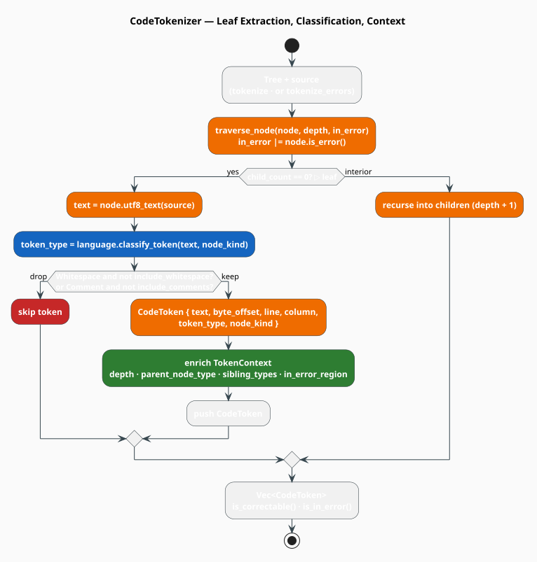

# Code-Aware Tokenization

The tokenizer turns a tree-sitter parse tree into a flat stream of **typed** tokens. Unlike a
plain lexer, every `CodeToken` it emits carries a semantic `TokenType`, its source position, its
raw tree-sitter node kind, and a `TokenContext` describing where it sits in the AST (its parent,
its siblings, its depth, and whether it lies inside a parse error). That context is what makes
correction *grammar-aware*: the same misspelling is corrected differently in a parameter list
than in a type annotation.

> **Scope.** Source of truth: [`src/code/tokenizer.rs`](../../../src/code/tokenizer.rs). Token
> classification is delegated to the [`CodeLanguage`](language.md) implementation; the
> `TokenType`/`TokenContext` types are defined there. Tokens feed the
> [correctors](correctors/overview.md) and the [pipeline](pipeline.md).

## What & why

A parser already produces a tree; why flatten it back into tokens? Because the *unit of
correction* is a token — a misspelled keyword, a wrong identifier, a missing bracket — but the
*evidence* for a good correction is structural. The tokenizer bridges the two: it walks to the
AST leaves (the actual lexemes) yet annotates each with the structural context harvested on the
way down. Correction then operates on a linear stream while still "seeing" the tree.

Formally, the token stream is the projection of the AST onto its leaves, in source order, passed
through an inclusion filter $`\phi`$:

```math
\begin{array}{lr}
\displaystyle S(A) = \bigl[\; \ell : \ell \in \mathrm{leaves}(A),\; \phi(\ell) \;\bigr] & \text{(T1)}
\end{array}
```

where $`\mathrm{leaves}(A)`$ are the childless nodes of the tree $`A`$ and $`\phi`$ drops
whitespace and comment tokens unless the tokenizer is configured to keep them (see below).

## The `CodeToken`

```rust
pub struct CodeToken {
    pub text: String,          // the lexeme
    pub byte_offset: usize,    // start byte in the source
    pub line: usize,           // 0-indexed row
    pub column: usize,         // 0-indexed column
    pub token_type: TokenType, // semantic classification (from CodeLanguage)
    pub node_kind: String,     // raw tree-sitter node kind
    pub context: TokenContext, // structural context (parent, siblings, depth, error)
}
```

Two convenience predicates delegate to the token's type: `is_correctable()` (true unless the
token is a comment or whitespace) and `is_in_error()` (true when the token falls inside an
`ERROR` node). See [Language](language.md) for the full `TokenType` taxonomy; the correctability
rule is exactly:

```rust
// TokenType::is_correctable() — only comments and whitespace are excluded.
!matches!(self, TokenType::Comment | TokenType::Whitespace)
```

Every other type — including `NumericLiteral` and `Punctuation` — is *correctable*; what differs
between them is the correction *strategy* (a `Keyword` matches a fixed dictionary, an `Identifier`
matches the project corpus), not whether correction is attempted.

## `TokenContext` enrichment

As the tokenizer descends to a leaf it fills in the leaf's `TokenContext`:

| Field | Filled from |
|---|---|
| `token_type` | `language.classify_token(text, node_kind)` |
| `depth` | recursion depth (0 at the root) |
| `in_error_region` | true if any ancestor (or the node itself) `is_error()` |
| `parent_node_type` | `parent.kind()` |
| `sibling_types` | the kinds of the parent's *other* children (excluding this node by id) |
| `expected_types` | reserved for grammar-driven expectations (empty by default) |

This is the payload a corrector reads to decide *what could legally go here*.

## The tokenizer

`CodeTokenizer<'a, L>` borrows a language and carries two boolean switches, set with a builder:

```rust
use libgrammstein::code::{CodeTokenizer, Python};

let python = Python::new();
let tokenizer = CodeTokenizer::new(&python)   // default: no whitespace, no comments
    .with_whitespace(true)                    // keep indentation tokens (Python)
    .with_comments(true);                     // keep comments (doc/spell analysis)
```

It offers two extraction methods:

- `tokenize(tree, source) -> Vec<CodeToken>` — every leaf, filtered;
- `tokenize_errors(tree, source) -> Vec<CodeToken>` — only leaves beneath `ERROR`/`MISSING`
  nodes, which is what the pipeline uses to *scope correction to the broken region*.

### Traversal, literately

Both methods share a recursive descent. This mirrors `traverse_node` / `create_token`:

```
function tokenize(tree, source):
    tokens <- []
    traverse_node(tree.root, source, tokens, depth = 0, in_error = false)
    return tokens

function traverse_node(node, source, tokens, depth, in_error):
    in_error <- in_error or node.is_error()             ▸ error taint flows down
    if node.child_count == 0:                           ▸ a leaf = a lexeme
        push create_token(node, source, depth, in_error)?  ▸ may be filtered out
    else:
        for child in node.children:
            traverse_node(child, source, tokens, depth + 1, in_error)

function create_token(node, source, depth, in_error):
    text <- node.utf8_text(source)
    tt   <- language.classify_token(text, node.kind)    ▸ language decides the TokenType
    if (tt == Whitespace and not include_whitespace)    ▸ apply the inclusion filter phi
       or (tt == Comment and not include_comments):
        return None
    token <- CodeToken { text, byte_offset, line, column, token_type = tt, node_kind = node.kind }
    token.context.depth <- depth
    token.context.in_error_region <- in_error
    if node.parent is Some(p):
        token.context.parent_node_type <- Some(p.kind)
        token.context.sibling_types    <- [ c.kind : c in p.children, c.id != node.id ]
    return Some(token)

function tokenize_errors(tree, source):                 ▸ correction-scoped variant
    for each node where node.is_error() or node.is_missing():
        traverse_node(node, source, tokens, depth, in_error = true)
    ▸ (non-error subtrees are skipped entirely)
```



*Figure 1. The tokenizer descends to AST leaves, classifies each via the language's
`classify_token`, drops whitespace/comments unless configured otherwise, and enriches each
surviving token with its structural `TokenContext`.*

## `TokenIterator`

For a self-contained, owning stream, `TokenIterator<L>` bundles the (eagerly computed) token
vector with a cursor. Note it is parameterized only by the language `L` — it owns its `tokens`
and a `PhantomData<L>` marker, not a borrow:

```rust
pub struct TokenIterator<L: CodeLanguage> {
    tokens: Vec<CodeToken>,
    position: usize,
    _marker: std::marker::PhantomData<L>,
}
```

`TokenIterator::new(tokenizer, tree, source)` tokenizes eagerly, then yields tokens one at a time
via `Iterator`, so the standard combinators apply:

```rust
use libgrammstein::code::{TokenIterator, TokenType};

let it = TokenIterator::new(tokenizer, parsed.tree, parsed.source);
let correctable_errors: Vec<_> = it
    .filter(|t| t.is_in_error() && t.is_correctable())
    .collect();
```

## Engineering

### Complexity

| Operation | Cost | Notes |
|---|---|---|
| `tokenize` | $`O(V)`$ | one descent; leaf work is $`O(1)`$ plus context |
| context per token | $`O(s)`$ | $`s`$ = sibling count (scan of the parent's children) |
| `tokenize_errors` | $`O(V_e)`$ | $`V_e`$ = nodes under error regions only |

### Thread-safety

`CodeTokenizer<'a, L>` borrows its language and holds no mutable state, so tokenization is
re-entrant and read-only; it is `Send` when the borrow is. For data-parallel tokenization, build
a tokenizer (and parser) per worker rather than sharing one — the language handlers are cheap
unit structs.

## Usage

Scoping correction to the error region, then feeding a corrector:

```rust
use std::sync::Arc;
use libgrammstein::code::{CodeParser, CodeTokenizer, LexicalCorrector, Python};

let python = Arc::new(Python::new());
let mut parser = CodeParser::new(Arc::clone(&python))?;
let tokenizer = CodeTokenizer::new(python.as_ref());

let source = "def calcluate(x):\n    retrun x";   // two typos, inside error regions
let parsed = parser.parse(source)?;

// Only tokens inside ERROR / MISSING nodes.
let error_tokens = tokenizer.tokenize_errors(&parsed.tree, source);

let corrector = LexicalCorrector::with_defaults(python);
for token in &error_tokens {
    // correct_token returns a Vec<Correction>, already confidence-shaped by the corrector.
    for c in corrector.correct_token(token, &token.context) {
        println!("{} -> {} ({:.2})", token.text, c.replacement, c.confidence);
    }
}
# Ok::<(), libgrammstein::code::AstError>(())
```

## References

1. M. Brunsfeld et al. *tree-sitter: an incremental parsing system for programming tools.*
   Project documentation, [tree-sitter.github.io](https://tree-sitter.github.io/tree-sitter/).

## See also

- [Language](language.md) — `TokenType`, `TokenContext`, and `classify_token`
- [AST](ast.md) — the tree the tokenizer walks
- [Correction](correction.md) — how tokens become `Correction`s
- [Correctors](correctors/overview.md) — the token-level consumers
