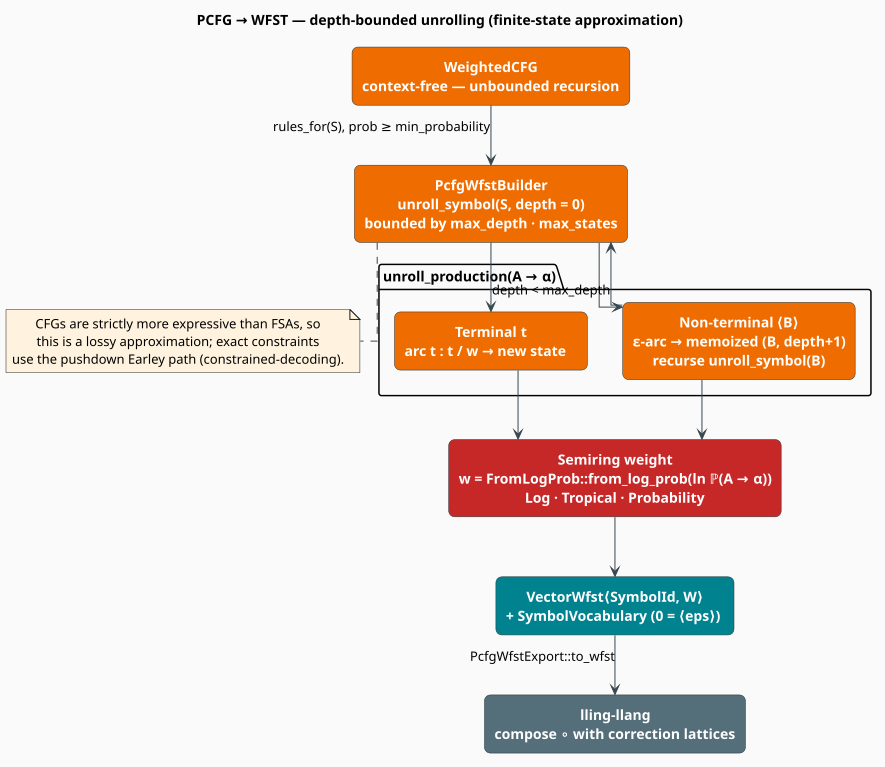

# WFST Export: A Finite-State Approximation of a PCFG

A trained [PCFG](pcfg.md) scores code by its *grammatical structure*. The rest of the
lling-llang ecosystem scores hypotheses by **composing weighted finite-state transducers** — a
lexical transducer with a grammar transducer with a semantic one. To let a code grammar join that
cascade, it must be turned into a WFST. But a context-free grammar is **strictly more expressive**
than any finite automaton, so this cannot be done exactly. This module builds a deliberate,
bounded **approximation**: it unrolls the grammar's derivations to a fixed depth and emits the
result as a weighted transducer over a semiring.

> **Scope.** Source of truth: [`src/code/wfst_export.rs`](../../../src/code/wfst_export.rs). The
> grammar being exported is documented in [PCFG](pcfg.md); the *exact* (pushdown) alternative is
> [Constrained Decoding](constrained-decoding.md); the ecosystem this feeds is the
> [lling-llang integration](../../integration/lling-llang/overview.md).

## Notation

| Symbol | Meaning |
|---|---|
| $`G`$ | a weighted context-free grammar (`WeightedCFG`) |
| $`N, \Sigma`$ | its non-terminals and terminals |
| $`S \in N`$ | the start symbol |
| $`A \to \alpha`$ | a production, $`A \in N`$, $`\alpha \in (N \cup \Sigma)^{*}`$ |
| $`\tau`$ | a derivation (parse tree) |
| $`\mathbb{K} = (K, \oplus, \otimes, \bar{0}, \bar{1})`$ | the semiring the WFST is weighted over |
| $`w[e]`$ | the weight of arc $`e`$ |
| $`\pi`$ | a path through the transducer; $`P(x)`$ = all paths accepting $`x`$ |
| $`D`$ | `max_depth` — the unrolling bound |

## Feature gate

The **entire module** is compiled under `#[cfg(feature = "lling-llang-integration")]`. Two feature
names reach it:

```toml
# either of these works; `wfst-export` is an alias that enables the other
libgrammstein = { version = "0.1", features = ["code", "lling-llang-integration"] }
libgrammstein = { version = "0.1", features = ["code", "wfst-export"] }
```

because `wfst-export = ["lling-llang-integration"]`.

> **Without the feature, *nothing* here exists** — not `PcfgWfstBuilder`, and not `PcfgScorer`,
> `SymbolVocabulary`, or `PcfgWfstConfig` either, even though those three need no WFST machinery of
> their own. They live in the same gated module and disappear with it.

Under the feature, `code::{PcfgScorer, PcfgWfstConfig, SymbolVocabulary, PcfgWfstExport}` are
re-exported at the `code` root. `PcfgWfstBuilder` and the `SymbolId` alias are **not** re-exported;
import them from `libgrammstein::code::wfst_export`.

> **Two different `PcfgWfstConfig` types.** `wfst_export.rs` defines the one that governs
> unrolling (`max_depth`, `min_probability`, `include_backoff`, `max_states`) — this is the one
> re-exported as `code::PcfgWfstConfig` and the only one the builder reads. `pcfg.rs` *also*
> defines a struct named `PcfgWfstConfig` (`include_epsilon`, `min_probability`, `max_rules`),
> which is **dead**: no code path constructs or consumes it. If you write
> `use libgrammstein::code::pcfg::PcfgWfstConfig;` you have the wrong one. See
> [PCFG](pcfg.md#a-subtlety-two-pcfgwfstconfig-types).

## Theory

### What a PCFG assigns

Under the context-free independence assumption, the probability of a derivation is the **product**
of the probabilities of the productions it uses [[4]](#references):

```math
\mathbb{P}(\tau) \;=\; \prod_{(A \to \alpha)\, \in\, \mathrm{rules}(\tau)} \mathbb{P}(A \to \alpha),
\qquad \text{subject to} \quad
\sum_{\alpha \,:\, A \to \alpha} \mathbb{P}(A \to \alpha) \;=\; 1 \quad \forall A \in N \tag{W1}
```

Taking logarithms turns the product into a sum — which is exactly the $`\otimes`$ of the semirings
below, and the reason weights are carried in the log domain:

```math
\log \mathbb{P}(\tau) \;=\; \sum_{(A \to \alpha)\, \in\, \mathrm{rules}(\tau)} \log \mathbb{P}(A \to \alpha) \tag{W2}
```

### Why an exact WFST is impossible

Finite-state machines have no unbounded memory. A CFG's recursion does — $`S \to (\,S\,)`$ derives
$`(^{n}\,)^{n}`$ for every $`n`$, and the classic pumping argument shows no finite automaton
recognizes that language. Real programming-language grammars are full of exactly this shape:
nested parentheses, nested blocks, nested expressions. Hence

```math
\mathcal{L}_{\mathrm{reg}} \;\subsetneq\; \mathcal{L}_{\mathrm{cf}} \tag{W3}
```

and any finite-state rendering of a CFG is necessarily an approximation. Approximating CFGs by
regular languages is a well-studied problem with a spectrum of strategies — Pereira & Wright's
LR-based approximation [[2]](#references), and the family of methods surveyed and refined by
Nederhof [[3]](#references). libgrammstein takes the simplest member of that family:
**depth-bounded unrolling**.

### The approximation this module makes

`PcfgWfstBuilder` expands the grammar from $`S`$, memoizing a state per $`(A, \text{depth})`$ pair
and refusing to expand past $`D`$ = `max_depth`:

```math
T_{D}(G) \;=\; \text{the transducer obtained by expanding every derivation of } G \text{ to depth} \le D \tag{W4}
```

Two consequences follow directly from the construction, and both matter:

1. **Derivations deeper than $`D`$ are truncated.** When `unroll_symbol` is called at depth $`D`$
   it returns immediately, so no arcs are emitted below that point. A program whose parse tree is
   deeper than $`D`$ has no complete path.
2. **Every state is final.** The builder calls `set_final(state, $\bar{1}$)` on the start state and
   on every state it creates. The machine therefore accepts *prefixes* of the derivations it can
   represent, not only complete ones.

So $`T_D(G)`$ is neither a clean subset nor a clean superset of $`L(G)`$: it is a **local,
depth-bounded scorer**, well suited to reweighting hypotheses inside a composition cascade and
unsuited to deciding grammaticality. For an exact decision, use the pushdown (Earley) path in
[Constrained Decoding](constrained-decoding.md) — which is precisely what the note in Figure 1
says.



*Figure 1. The builder walks the grammar from the start symbol. A **terminal** in a production's
right-hand side becomes a labeled arc into a fresh state; a **non-terminal** becomes an
$`\varepsilon`$-arc into the memoized state for $`(B, \text{depth}+1)`$, from which the expansion
recurses. Rule probabilities become semiring weights through `FromLogProb`. Expansion stops at
`max_depth` or `max_states`.*

### Semirings

A **semiring** $`\mathbb{K} = (K, \oplus, \otimes, \bar{0}, \bar{1})`$ is a set with two operations:
$`\otimes`$ accumulates weight **along** a path, and $`\oplus`$ combines the weights **across**
alternative paths [[1]](#references). The weight a transducer $`T`$ assigns to a string $`x`$ is

```math
\llbracket T \rrbracket(x) \;=\; \bigoplus_{\pi \,\in\, P(x)} \;\; \bigotimes_{e \,\in\, \pi} w[e] \tag{W5}
```

Three semirings are available, and the choice determines what $`(\mathrm{W5})`$ *computes*:

| Semiring | $`K`$ | $`\oplus`$ (across paths) | $`\otimes`$ (along a path) | $`\bar{0}`$ | $`\bar{1}`$ | $`(\mathrm{W5})`$ computes |
|---|---|---|---|---|---|---|
| `TropicalWeight` | $`\mathbb{R} \cup \{\infty\}`$ | $`\min`$ | $`+`$ | $`\infty`$ | $`0`$ | the **best** (Viterbi) derivation's cost |
| `LogWeight` | $`\mathbb{R} \cup \{\pm\infty\}`$ | $`a \oplus b = -\ln(e^{-a} + e^{-b})`$ | $`+`$ | $`\infty`$ | $`0`$ | the **total** probability of all derivations |
| `ProbabilityWeight` | $`\mathbb{R}_{\ge 0}`$ | $`+`$ | $`\times`$ | $`0`$ | $`1`$ | the total probability, in the linear domain |

The bridge from a rule probability to a semiring weight is the `FromLogProb` trait
(`crate::integration::wfst_export`), which every arc weight passes through:

```math
\mathrm{from\_log\_prob}(\ln p) \;=\;
\begin{cases}
-\ln p & \text{for } \texttt{LogWeight} \text{ and } \texttt{TropicalWeight} \quad (\text{a } \textbf{cost}: \text{lower is better}) \\[2pt]
\;\;\;\;p & \text{for } \texttt{ProbabilityWeight} \quad (\text{a probability: higher is better})
\end{cases} \tag{W6}
```

Note the sign flip: `Log` and `Tropical` store **negative** log-probabilities, so that $`\otimes = +`$
accumulates a non-negative cost and $`\min`$ picks the most probable path.

## Building the transducer

The following mirrors [`PcfgWfstBuilder`](../../../src/code/wfst_export.rs).

```
function build():
    q0 <- wfst.add_state();  wfst.set_start(q0);  wfst.set_final(q0, 1̄)
    unroll_symbol(G.start_symbol(), q0, depth = 0)
    return (wfst, vocabulary)                       ▸ vocabulary pre-seeded with every terminal

⟨unroll_symbol(A, q, depth)⟩ ≡
    if depth >= config.max_depth:        return     ▸ (W4): the truncation
    if wfst.num_states() >= config.max_states: return    ▸ the safety valve
    for (A → α, w) in G.rules_for(A):
        if w < config.min_probability:   continue   ▸ prune negligible rules
        weight <- W::from_log_prob(ln w)            ▸ (W6) — see the caveat below
        unroll_production(A → α, q, weight, depth)

⟨unroll_production(A → α, q, weight, depth)⟩ ≡
    if α is empty:                       return     ▸ ε-productions contribute no arcs
    cur <- q
    for (i, X) in enumerate(α):
        wᵢ <- if i == 0 then weight else 1̄          ▸ the rule's weight is paid exactly once
        match X:
          Terminal t:
              t_id <- vocabulary.get_id(t)          ▸ 0 = ⟨eps⟩ if absent (cannot happen: pre-seeded)
              nxt  <- wfst.add_state()
              if X is last: wfst.set_final(nxt, 1̄)
              wfst.add_arc(cur, in = t_id, out = t_id, nxt, wᵢ)   ▸ ilabel == olabel: an acceptor
              cur <- nxt
          NonTerminal B:
              nxt <- state_map.entry((B, depth+1)).or_insert_with(|| {
                         s <- wfst.add_state(); wfst.set_final(s, 1̄); s })   ▸ memoized
              wfst.add_epsilon(cur, nxt, wᵢ)
              unroll_symbol(B, nxt, depth + 1)      ▸ recurse
              cur <- nxt
```

Three design points:

- **The rule weight is paid once.** Only the *first* symbol of a right-hand side carries the rule's
  weight; every subsequent symbol carries $`\bar{1}`$. Since $`\otimes`$ accumulates along the
  path, the total contribution of the rule to $`(\mathrm{W5})`$ is exactly
  $`\mathrm{from\_log\_prob}(\ln \mathbb{P}(A \to \alpha))`$ — matching $`(\mathrm{W2})`$.
- **Non-terminal states are memoized** on $`(B, \text{depth}+1)`$, so a non-terminal reachable by
  many routes at the same depth shares one state. This is what keeps the machine from blowing up
  combinatorially — and what bounds the state count (see [Complexity](#complexity)).
- **It is an acceptor.** Terminal arcs are added with `input == output == t_id`, so the "transducer"
  transduces each terminal to itself. It scores strings; it does not rewrite them.

### Correctness: normalize the grammar first

> **Call `WeightedCFG::normalize()` before exporting.** This is not a style preference; it is a
> correctness requirement, and the API does not enforce it.
>
> `WeightedCFG::rules_for` returns the **raw weight** each rule was added with — not a normalized
> probability. And `PcfgTrainer::to_weighted_cfg()` adds rules with their **raw corpus counts**
> (`cfg.add_rule(production, count as f64)`). The builder then computes
> `W::from_log_prob(w.ln())`, treating that value as a probability.
>
> On a freshly trained, un-normalized grammar, a rule seen 40 times therefore yields
> $`\ln 40 \approx +3.69`$, and $`(\mathrm{W6})`$ turns that into a `TropicalWeight` **cost of
> $`-3.69`$** — a *negative* cost. Shortest-path search over negative weights is meaningless (and
> with a cycle, divergent). The frequently-used rule ends up looking like the *expensive* one.
>
> `normalize()` divides every weight by its left-hand side's total, establishing $`(\mathrm{W1})`$,
> so $`w = \mathbb{P}(A \to \alpha) \in (0, 1]`$, $`\ln w \le 0`$, and the cost $`-\ln w \ge 0`$ as
> the semiring requires. It also rebuilds the per-LHS index from the de-duplicated rule map, which
> collapses any duplicate entries a repeated `add_rule` may have left behind. Normalizing
> additionally makes `min_probability` (default $`10^{-10}`$) mean what it says: on raw counts,
> every rule trivially clears that threshold.

```rust
use libgrammstein::code::wfst_export::PcfgWfstExport;
use libgrammstein::code::{PcfgTrainer, PcfgWfstConfig, Python};
use lling_llang::semiring::TropicalWeight;
use lling_llang::wfst::Wfst; // brings `num_states()` into scope

let python = Python::new();
let mut trainer = PcfgTrainer::new(&python);
// ... trainer.train_from_parsed(&parsed) over a corpus ...

let mut grammar = trainer.to_weighted_cfg();
grammar.normalize();                       // ← REQUIRED: counts → probabilities, (W1)

let config = PcfgWfstConfig { max_depth: 4, ..Default::default() };
let (wfst, vocab) = grammar.to_wfst::<TropicalWeight>(config);
println!("{} states, {} symbols", wfst.num_states(), vocab.len());
```

By contrast, **`PcfgScorer` needs no such care**: it calls `WeightedCFG::log_probability`, which
normalizes internally (dividing by the LHS total on every lookup). The asymmetry is the whole
trap — the scorer is safe on a raw grammar and the exporter is not.

## Configuration

```rust
pub struct PcfgWfstConfig {
    pub max_depth: usize,       // D — default 5
    pub min_probability: f64,   // default 1e-10
    pub include_backoff: bool,  // default true — see below
    pub max_states: usize,      // default 100_000
}
```

| Field | Default | Effect |
|---|---|---|
| `max_depth` | `5` | the $`D`$ of $`(\mathrm{W4})`$. The dominant quality/size knob. |
| `min_probability` | $`10^{-10}`$ | rules below this weight are not expanded (see the caveat above) |
| `include_backoff` | `true` | **inert — never read** |
| `max_states` | `100_000` | hard cap; expansion silently stops when reached |

> **`include_backoff` does nothing.** `PcfgWfstBuilder` never reads it, and emits no backoff arcs.
> (This is unlike the *n-gram* WFST exporter in
> [`src/integration/wfst_export.rs`](../../../src/integration/wfst_export.rs), which does build a
> backoff topology.) Setting it has no effect either way.

Also note that `max_states` is enforced by *abandoning* further expansion, not by erroring. A
grammar that hits the cap yields a silently truncated transducer — check `wfst.num_states()`
against your cap if that matters.

## `SymbolVocabulary`

WFST arcs carry integer labels, so terminals must be interned. `SymbolVocabulary` is that bijection,
and **ID `0` is reserved for `<eps>`**, inserted by `new()`:

```rust
use libgrammstein::code::SymbolVocabulary;

let mut vocab = SymbolVocabulary::new();
assert_eq!(vocab.get_id("<eps>"), Some(0)); // epsilon is always symbol 0

let a = vocab.add_symbol("return");
let b = vocab.add_symbol("return"); // idempotent
assert_eq!(a, b);
assert_eq!(vocab.get_symbol(a), Some("return"));
```

`PcfgWfstBuilder::new` pre-seeds the vocabulary with every terminal **and** every non-terminal of
the grammar, so the `unwrap_or(0)` fallback in the terminal path — which would silently turn an
unknown terminal into an $`\varepsilon`$ label — is unreachable in practice. (`is_empty()` can
never return `true`, since `<eps>` is always present.)

## The export trait

```rust
pub trait PcfgWfstExport {
    fn to_wfst<W: Semiring + FromLogProb>(&self, config: PcfgWfstConfig)
        -> (VectorWfst<SymbolId, W>, SymbolVocabulary);

    fn to_wfst_default<W: Semiring + FromLogProb>(&self)  // provided: to_wfst(Default::default())
        -> (VectorWfst<SymbolId, W>, SymbolVocabulary);
}
```

It is implemented for `WeightedCFG`, so a grammar exports itself. The semiring is chosen at the
call site by turbofish — the same grammar can be exported as a Viterbi machine and as a
sum-of-paths machine:

```rust
use libgrammstein::code::wfst_export::PcfgWfstExport;
use libgrammstein::code::WeightedCFG;
use lling_llang::semiring::{LogWeight, TropicalWeight};

# fn demo(mut grammar: WeightedCFG) {
grammar.normalize();

// Best-derivation cost, for Viterbi decoding.
let (viterbi, _vocab) = grammar.to_wfst_default::<TropicalWeight>();

// Total probability over all derivations, for lattice rescoring.
let (total, _vocab) = grammar.to_wfst_default::<LogWeight>();
# let _ = (viterbi, total);
# }
```

## `PcfgScorer`: the lightweight alternative

If all you need is to *score* a known derivation, you do not need a transducer at all. `PcfgScorer`
wraps a grammar and evaluates $`(\mathrm{W2})`$ directly:

```rust
use libgrammstein::code::pcfg::Symbol;   // note: `Symbol` is NOT re-exported at `code::`
use libgrammstein::code::{PcfgScorer, Production, WeightedCFG};

let mut cfg = WeightedCFG::new("S");
cfg.add_rule(Production::new("S", vec![Symbol::non_terminal("NP"), Symbol::non_terminal("VP")]), 1.0);
cfg.add_rule(Production::new("NP", vec![Symbol::terminal("cat")]), 3.0);
cfg.add_rule(Production::new("NP", vec![Symbol::terminal("dog")]), 1.0);

let scorer = PcfgScorer::new(cfg);

// `probability` normalizes internally: 3 / (3 + 1) = 0.75.
assert!((scorer.terminal_probability("NP", "cat") - 0.75).abs() < 1e-9);

// A derivation's score is the sum of its rules' log-probabilities — (W2).
let derivation = vec![
    Production::new("S", vec![Symbol::non_terminal("NP"), Symbol::non_terminal("VP")]),
    Production::new("NP", vec![Symbol::terminal("cat")]),
];
assert!(scorer.score_parse(&derivation) < 0.0); // log-probabilities are non-positive
```

| Method | Returns |
|---|---|
| `score_rule(&production)` | $`\log \mathbb{P}(A \to \alpha)`$ — $`-\infty`$ for an unknown rule |
| `score_parse(&[production])` | $`(\mathrm{W2})`$ — the sum over the derivation |
| `terminal_probability(nt, t)` | $`\mathbb{P}(A \to t)`$ scanning unary rules; `0.0` if none |
| `grammar()` | the wrapped `WeightedCFG` |

## Complexity

Let $`\lvert N \rvert`$ be the number of non-terminals, $`\bar{r}`$ the average rules per
non-terminal, and $`\bar{\alpha}`$ the average right-hand-side length.

| Quantity | Bound | Why |
|---|---|---|
| Non-terminal states | $`O(\lvert N \rvert \cdot D)`$ | memoized on $`(B, \text{depth})`$ |
| Terminal states | $`O(\lvert N \rvert \cdot D \cdot \bar{r} \cdot \bar{\alpha})`$ | one fresh state per terminal occurrence — **not** memoized |
| Arcs | $`O(\text{states})`$ | one arc per RHS position |
| Build time | $`O(\text{states} + \text{arcs})`$ | one pass, memoized |
| Hard ceiling | `max_states` | expansion stops, silently |
| `PcfgScorer::score_parse` | $`O(\lvert \tau \rvert)`$ | one hash lookup per rule |

The asymmetry is worth internalizing: **non-terminals are memoized, terminals are not.** Each
terminal occurrence in each expanded production allocates a new state, so raising `max_depth` grows
the machine multiplicatively, not additively. $`D = 5`$ is the default for good reason; measure
`num_states()` before raising it.

## Composing into lling-llang

The exported `VectorWfst` is an ordinary lling-llang transducer, so it composes with the lexical
and semantic transducers of a correction cascade — the grammar term in a
lexical $`\circ`$ grammar $`\circ`$ semantic pipeline. The `SymbolVocabulary` returned alongside it
is what maps your terminals to the integer labels the composition operates on; the two must travel
together. See the [lling-llang integration docs](../../integration/lling-llang/overview.md) for the
cascade, and [`src/integration/wfst_export.rs`](../../../src/integration/wfst_export.rs) for the
n-gram exporter that shares the `FromLogProb` bridge.

## Choosing an approach

| You want | Use |
|---|---|
| An exact grammaticality decision | [`GrammarConstraint`](constrained-decoding.md) — Earley, a pushdown machine |
| To score a derivation you already have | `PcfgScorer` — no transducer needed, no `normalize()` needed |
| To compose a grammar into a WFST cascade | `PcfgWfstExport::to_wfst` — **after** `normalize()` |
| Best-path (Viterbi) decoding | `TropicalWeight` |
| Sum over all derivations (lattice rescoring) | `LogWeight` |
| Linear-domain probabilities | `ProbabilityWeight` |
| A smaller machine | lower `max_depth`; raise `min_probability` |

## References

1. M. Mohri, F. Pereira & M. Riley (2002). *Weighted finite-state transducers in speech
   recognition.* Computer Speech & Language 16(1), 69–88. — the semiring framework of
   $`(\mathrm{W5})`$ and $`(\mathrm{W6})`$.
   [doi:10.1006/csla.2001.0184](https://doi.org/10.1006/csla.2001.0184)
2. F. C. N. Pereira & R. N. Wright (1991). *Finite-state approximation of phrase structure
   grammars.* ACL '91, 246–255. — the original regular approximation of a CFG.
   [doi:10.3115/981344.981376](https://doi.org/10.3115/981344.981376)
3. M.-J. Nederhof (2000). *Practical experiments with regular approximation of context-free
   languages.* Computational Linguistics 26(1), 17–44. — the survey of approximation strategies
   that depth-bounded unrolling belongs to.
   [doi:10.1162/089120100561610](https://doi.org/10.1162/089120100561610)
4. T. L. Booth & R. A. Thompson (1973). *Applying probability measures to abstract languages.* IEEE
   Transactions on Computers C-22(5), 442–450. — the normalization condition of $`(\mathrm{W1})`$.
   [doi:10.1109/T-C.1973.223746](https://doi.org/10.1109/T-C.1973.223746)

## See also

- [PCFG](pcfg.md) — the `WeightedCFG` being exported, and `normalize()`
- [Constrained Decoding](constrained-decoding.md) — the exact, pushdown alternative
- [Grammar corrector](correctors/grammar.md) — the in-crate consumer of the grammar
- [lling-llang integration](../../integration/lling-llang/overview.md) — the cascade this joins
- [Overview](overview.md) — the module map
