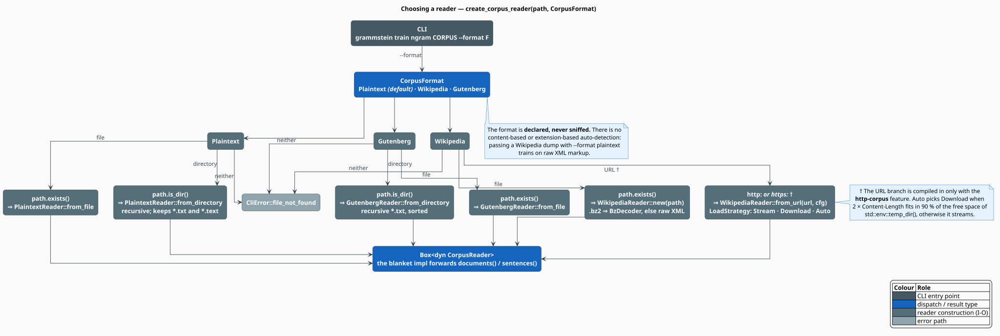
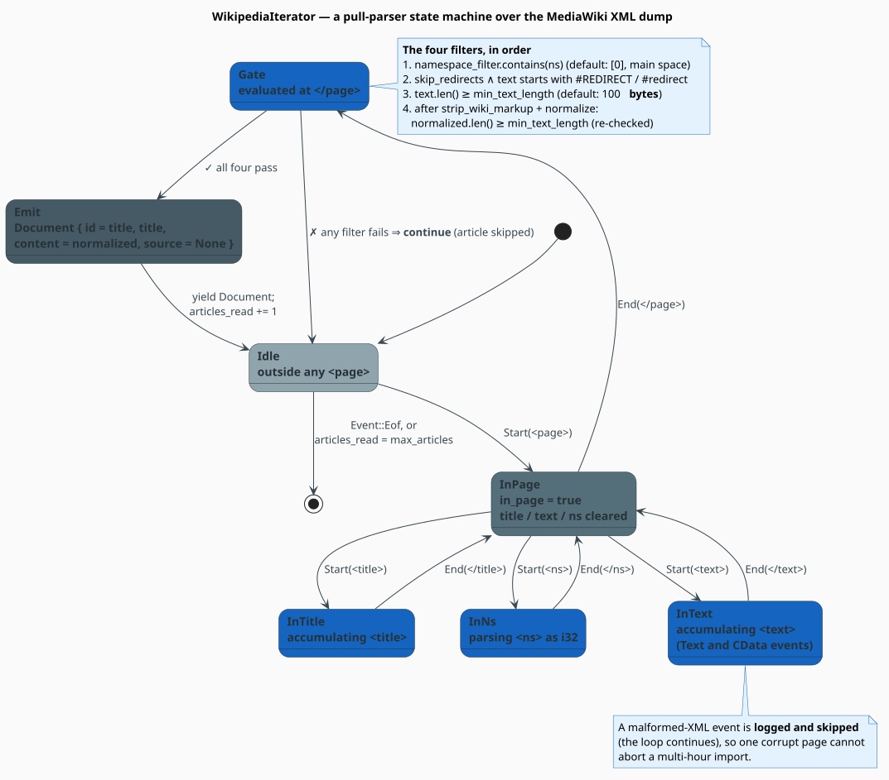
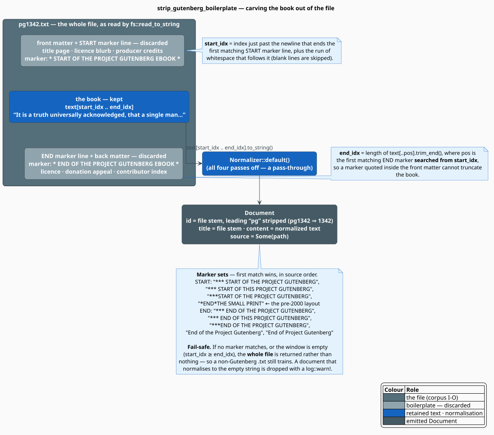

# Corpus Formats

libgrammstein ships **three** corpus readers — plain text, Wikipedia XML dumps, and Project
Gutenberg books — and one rule that governs all of them: **the format is declared, never sniffed.**
This document specifies each format, the exact parser that consumes it, the configuration each
accepts, and (just as importantly) what the module deliberately does *not* do.

> **Scope.** Source of truth: [`src/corpus/plaintext.rs`](../../../src/corpus/plaintext.rs),
> [`src/corpus/wikipedia.rs`](../../../src/corpus/wikipedia.rs),
> [`src/corpus/gutenberg.rs`](../../../src/corpus/gutenberg.rs) and the CLI dispatcher
> [`src/cli/commands/train/corpus_reader.rs`](../../../src/cli/commands/train/corpus_reader.rs).
> For the trait these implement see [Corpus Overview](overview.md); for what stays in RAM see
> [Streaming](streaming.md).

## Choosing a reader

The CLI takes a path and a `--format`, and `create_corpus_reader` turns the pair into a
`Box<dyn CorpusReader>`. The *format* selects the parser; the *shape of the path* (directory, file,
or URL) selects the constructor.



```rust
pub enum CorpusFormat {
    Plaintext,  // the default
    Wikipedia,
    Gutenberg,
}
```

| Format | Directory | File | URL |
|---|---|---|---|
| `Plaintext` | `PlaintextReader::from_directory` | `PlaintextReader::from_file` | not supported |
| `Wikipedia` | not supported | `WikipediaReader::new` | `WikipediaReader::from_url` (feature `http-corpus`) |
| `Gutenberg` | `GutenbergReader::from_directory` | `GutenbergReader::from_file` | not supported |

Anything that is neither an existing path nor (for Wikipedia) an `http://` / `https://` URL is a
`CliError::file_not_found`.

> **There is no auto-detection.** Nothing inspects the file's extension or its first bytes to guess a
> format. Handing a `.xml.bz2` dump to `--format plaintext` will happily train your model on
> compressed binary noise. Say what you mean.

## Plain text

### The format

UTF-8 text. No structure is assumed: the reader slurps a file, normalises it, and hands the whole
thing to the sentence tokenizer, which splits on `[.!?]+\s+` (see [Corpus
Overview](overview.md#tokenisation)). One line per sentence works; so does flowing prose.

```text
The quick brown fox jumps over the lazy dog. Natural language processing
enables computers to understand text. Machine learning models can process
language effectively.
```

### The reader

```rust
use libgrammstein::corpus::{CorpusReader, PlaintextReader};

// A single file: one Document, whose title is the file stem.
let reader = PlaintextReader::from_file("corpus.txt")?;

// A directory: recursive, keeping *.txt and *.text; one Document per file.
let reader = PlaintextReader::from_directory("corpus/")?;

// An explicit file set — the only way to control which files are read.
let reader = PlaintextReader::from_paths(vec!["a.txt".into(), "b.md".into()]);

for sentence in reader.sentences() {
    println!("{sentence}");
}
# Ok::<(), std::io::Error>(())
```

`from_file` and `from_directory` return `std::io::Result` and fail fast if the path does not exist.
`from_paths` performs no checks — unreadable paths are logged with `log::warn!` and skipped during
iteration, so a bad path costs you a document, not the run.

Two builder methods refine the reader: `with_normalizer` and `with_tokenizer` replace the defaults
(`Normalizer::new()` and `Tokenizer::new()`, i.e. all normalisation passes **on**).

> **`with_extensions` is inert.** The extension list is stored on the struct but never read: the
> directory walk in `from_directory` hard-codes `["txt", "text"]`, and no other code path consults
> the field. To read `.md` or `.jsonl` files, enumerate them yourself and use `from_paths`.

### What a `Document` looks like

| Field | Value |
|---|---|
| `id` | `None` |
| `title` | `Some(file stem)` |
| `content` | the whole file, after `Normalizer::new()` (NFC, control-strip, whitespace-collapse, trim) |
| `source` | `Some(path)` |

Residency is *one whole file*, because `documents()` calls `fs::read_to_string`. For a single huge
file, prefer `LineIterator` — see [Streaming](streaming.md#the-unit-of-residency-differs-per-reader).

## Wikipedia XML dumps

### The format

The MediaWiki export schema [[1]](#references): a stream of `<page>` elements, each with a `<title>`,
a namespace `<ns>`, and a `<revision>` containing the wikitext `<text>`.

```xml
<mediawiki>
  <page>
    <title>Albert Einstein</title>
    <ns>0</ns>
    <revision>
      <text>[[Albert Einstein]] developed the {{theory|special relativity}}.</text>
    </revision>
  </page>
</mediawiki>
```

Dumps are distributed **bzip2-compressed** (`enwiki-latest-pages-articles.xml.bz2`), and that is the
one compression scheme the reader understands: a path ending in `.bz2` is wrapped in a `BzDecoder`,
anything else is read as raw XML.

### The parser

`WikipediaIterator` is a four-flag state machine over `quick_xml`'s pull events. It never builds a
DOM; it accumulates the current title, namespace and text, and emits at `</page>` — if and only if
four filters pass.



An article is emitted exactly when

```math
\begin{array}{lr}
\displaystyle \bigl(\mathrm{ns} \in F\bigr)
\;\wedge\;
\neg\bigl(\text{skip\_redirects} \wedge \text{text starts with \#REDIRECT}\bigr)
\;\wedge\;
\bigl(\lvert \text{text} \rvert \geq \ell\bigr)
\;\wedge\;
\bigl(\lvert \text{normalized} \rvert \geq \ell\bigr) & \text{(W1)}
\end{array}
```

where $`F`$ is `namespace_filter` and $`\ell`$ is `min_text_length`. The length test is applied
**twice** — once to the raw wikitext and once after markup stripping — because a page can be
100 characters of pure `{{template}}` and nothing else. Both lengths are **byte** counts (`str::len`).

```rust
pub struct WikipediaConfig {
    pub namespace_filter: Vec<i32>,   // default: vec![0] — main namespace (articles) only
    pub skip_redirects: bool,         // default: true
    pub max_articles: Option<usize>,  // default: None (unlimited)
    pub min_text_length: usize,       // default: 100 bytes
}
```

A malformed XML event is logged and skipped rather than fatal, so a single corrupt page cannot abort
a multi-hour import.

### Markup stripping

`strip_wiki_markup` applies nine regexes, in this order; order matters, because each rewrites the
input of the next.

| # | Pattern | Effect |
|---|---|---|
| 1 | `\{\{[^}]*\}\}` | delete templates — `{{cite web|…}}` |
| 2 | `\[\[(?:[^\|\]]*\|)?([^\]]+)\]\]` | keep the *display* text of an internal link |
| 3 | `\[https?://[^\s\]]+\s*([^\]]*)\]` | keep the display text of an external link |
| 4 | `<ref[^>]*>.*?</ref>` and `<ref[^/]*/>` | delete references |
| 5 | `<[^>]+>` | delete any remaining HTML tag |
| 6 | `={2,}[^=]+={2,}` | replace headings with a space |
| 7 | `'{2,5}` | delete bold/italic markers |
| 8 | `\[\[Category:[^\]]+\]\]` | delete category links |
| 9 | `\[\[(?:File\|Image):[^\]]+\]\]` | delete file and image links |

```text
in:  This is '''bold''' and see [[Wikipedia|the free encyclopedia]] for more.
out: This is bold and see the free encyclopedia for more.
```

Because rule 1 is not recursive (`[^}]*` cannot match a nested `}}`), deeply nested templates may
leave residue. Rule 6 deletes headings entirely, which is intended: a heading is not a sentence.

> **Wikipedia text is *not* Unicode-normalised.** `WikipediaReader` constructs its normalizer with
> `Normalizer::default()`, whose four passes are all **off** (see [Corpus
> Overview](overview.md#normalisation)). The `content` you receive has been markup-stripped but not
> NFC-composed and not whitespace-collapsed.

The emitted `Document` sets `id` and `title` to the article title and leaves `source` as `None`.

### HTTP dumps

With the **`http-corpus`** feature, a dump can be consumed straight from a URL:

```rust
use libgrammstein::corpus::{CorpusReader, LoadStrategy, WikipediaConfig, WikipediaReader};

let url = "https://dumps.wikimedia.org/enwiki/latest/enwiki-latest-pages-articles.xml.bz2";

// Auto: download if there is room, otherwise stream.
let reader = WikipediaReader::from_url(url, WikipediaConfig::default())?;

// Or force the decision.
let reader = WikipediaReader::from_url_with_strategy(
    url,
    WikipediaConfig { max_articles: Some(50_000), ..Default::default() },
    LoadStrategy::Stream,
)?;

for sentence in reader.sentences() {
    train_on(&sentence);
}
# fn train_on(_: &str) {}
# Ok::<(), std::io::Error>(())
```

`LoadStrategy::Auto` decides with a `HEAD` request and a disk-space probe. Writing $`C`$ for the
reported `Content-Length` and $`D`$ for the free space on `std::env::temp_dir()`, it downloads iff

```math
\begin{array}{lr}
\displaystyle 2C \;\leq\; 0.9\,D & \text{(W2)}
\end{array}
```

and streams otherwise. The $`2\times`$ margin covers the download plus decompression overhead; the
$`0.9`$ leaves the filesystem some air. If the size cannot be determined, it streams. Downloading is
faster (the bzip2 decoder can seek and re-read without paying network latency); streaming needs no
disk at all.

## Project Gutenberg

### The format

Public-domain books as UTF-8 plain text, wrapped in a licence header and footer. The body is
delimited by all-caps marker lines:

```text
*** START OF THE PROJECT GUTENBERG EBOOK PRIDE AND PREJUDICE ***

It is a truth universally acknowledged, that a single man in possession
of a good fortune, must be in want of a wife.

*** END OF THE PROJECT GUTENBERG EBOOK PRIDE AND PREJUDICE ***
```

### Carving out the book

`strip_gutenberg_boilerplate` selects the half-open window $`[\,\text{start},\ \text{end}\,)`$ from
the **first** matching marker in each of two lists (four START forms — including the pre-2000
`*END*THE SMALL PRINT` layout — and five END forms).



```math
\begin{array}{lr}
\displaystyle \text{start} = \text{(end of the START marker's line)} + \text{(run of following whitespace)},
\qquad
\text{end} = \bigl\lvert \texttt{text[..pos]}.\mathrm{trim\_end}() \bigr\rvert & \text{(G1)}
\end{array}
```

where `pos` is the first END marker searched **from `start` onwards**, so a marker quoted inside the
front matter cannot truncate the book. If no marker matches, or the window comes out empty
($`\text{start} \geq \text{end}`$), the **whole file** is returned — a non-Gutenberg `.txt` therefore
still trains rather than silently yielding nothing.

### The reader

```rust
use libgrammstein::corpus::{CorpusReader, GutenbergReader};

// Recursive over *.txt, sorted for deterministic ordering.
let reader = GutenbergReader::from_directory("gutenberg/")?;

for doc in reader.documents() {
    // pg1342.txt  =>  id = Some("1342"), title = Some("pg1342")
    println!("{:?}: {} chars", doc.id, doc.content.len());
}
# Ok::<(), std::io::Error>(())
```

`from_directory` walks recursively, keeps only `.txt`, and **sorts** the paths, so two runs see the
books in the same order. The `id` is the file stem with a leading `pg` stripped (`pg1342.txt` becomes
`"1342"`), falling back to the whole stem. A book that normalises to the empty string is dropped with
a warning.

Files are read with `fs::read_to_string`, i.e. **UTF-8 only** — a Latin-1 book raises an I-O error,
which is logged and the book skipped. Transcode first (`iconv -f latin1 -t utf8`) if you have legacy
files. Like Wikipedia, `GutenbergReader` normalises with `Normalizer::default()`, so no NFC or
whitespace collapse is applied.

## Writing your own reader

`CorpusReader` has two required methods, and implementing both is the whole job. Here is a complete
JSON-Lines reader:

```rust
use libgrammstein::corpus::{CorpusReader, Document, Tokenizer};
use std::fs::File;
use std::io::{BufRead, BufReader};
use std::path::PathBuf;

pub struct JsonlReader {
    path: PathBuf,
    tokenizer: Tokenizer,
}

impl JsonlReader {
    pub fn new(path: impl Into<PathBuf>) -> Self {
        Self { path: path.into(), tokenizer: Tokenizer::new() }
    }
}

impl CorpusReader for JsonlReader {
    fn documents(&self) -> Box<dyn Iterator<Item = Document> + Send + '_> {
        let file = match File::open(&self.path) {
            Ok(f) => f,
            Err(e) => {
                log::warn!("cannot open {}: {e}", self.path.display());
                return Box::new(std::iter::empty());
            }
        };
        // One line at a time: residency is one record, not the file.
        Box::new(BufReader::new(file).lines().filter_map(|line| {
            let line = line.ok()?;
            let value: serde_json::Value = serde_json::from_str(&line).ok()?;
            let text = value.get("text")?.as_str()?.to_string();
            Some(Document::new(text))
        }))
    }

    fn sentences(&self) -> Box<dyn Iterator<Item = String> + Send + '_> {
        let tokenizer = self.tokenizer.clone();
        Box::new(
            self.documents()
                .flat_map(move |doc| tokenizer.sentences(&doc.content).collect::<Vec<_>>()),
        )
    }
}
```

Because the blanket impl covers `Box<dyn CorpusReader>`, your reader composes with everything else
immediately — `PrefetchingReader::new(JsonlReader::new("data.jsonl"))` just works.

## What is *not* supported

Stated explicitly, because these are the things people assume:

| Assumed | Reality |
|---|---|
| gzip / xz / zstd decompression | **bzip2 only**, and only for `WikipediaReader` |
| extension- or content-based format detection | none; `--format` is mandatory (default `plaintext`) |
| glob patterns (`corpus/**/*.txt`) | none; use `from_directory` or `from_paths` |
| chaining several corpora into one reader | none; iterate readers in sequence, or `chain()` their `sentences()` |
| HTTP for plaintext or Gutenberg | none; the URL path exists **only** for `WikipediaReader` |
| download resume / retry / rate limiting | none in `src/corpus` |
| filtering readers, quality thresholds baked into a reader | none; filtering is a separate, opt-in stage ([Overview](overview.md#composing-the-pipeline)) |
| skipping disambiguation or near-empty pages | none; only the four filters of $`(\mathrm{W1})`$ |

Chaining, when you want it, is one line of standard Rust:

```rust
use libgrammstein::corpus::{CorpusReader, GutenbergReader, PlaintextReader};

let wiki_books = GutenbergReader::from_directory("gutenberg/")?;
let notes = PlaintextReader::from_directory("notes/")?;

for sentence in wiki_books.sentences().chain(notes.sentences()) {
    train_on(&sentence);
}
# fn train_on(_: &str) {}
# Ok::<(), std::io::Error>(())
```

## CLI

The `grammstein` binary exposes corpus utilities that use exactly these readers:

```sh
# Statistics over a corpus (sentence and token counts).
grammstein corpus stats ./corpus.txt --format plaintext

# Sample sentences — useful for eyeballing a format choice before a long run.
grammstein corpus sample ./enwiki.xml.bz2 --format wikipedia -n 20

# Language detection over a sample of the corpus.
grammstein corpus detect ./gutenberg/ --format gutenberg

# Training reads the corpus through the same dispatcher.
grammstein train ngram ./corpus.txt --format plaintext --order 5
```

`grammstein corpus download`, `list` and `clean` manage the local corpus cache. There is **no**
`grammstein dictionary` command — dictionary building is a library API
([Dictionary Overview](../dictionary/overview.md)).

## References

1. MediaWiki. *Help:Export — the XML export format* (the schema `WikipediaReader` parses).
   <https://www.mediawiki.org/wiki/Help:Export#Export_format>
2. Wikimedia Foundation. *Database dumps.* <https://dumps.wikimedia.org/>
3. Project Gutenberg. <https://www.gutenberg.org/>
4. J. Seward. *bzip2 and libbzip2.* <https://sourceware.org/bzip2/>
5. `quick-xml` — the zero-copy pull parser behind `WikipediaIterator`.
   <https://docs.rs/quick-xml>

## See also

- [Corpus Overview](overview.md) — the reader contract, normalisation, quality and dedup
- [Streaming](streaming.md) — residency per reader, and the prefetcher
- [Large Corpora](../../training/large-corpora.md) — running a full Wikipedia import
- [CLI](../../cli/README.md) — the complete command surface
- [Traits API](../../api/traits.md) — `CorpusReader` reference
