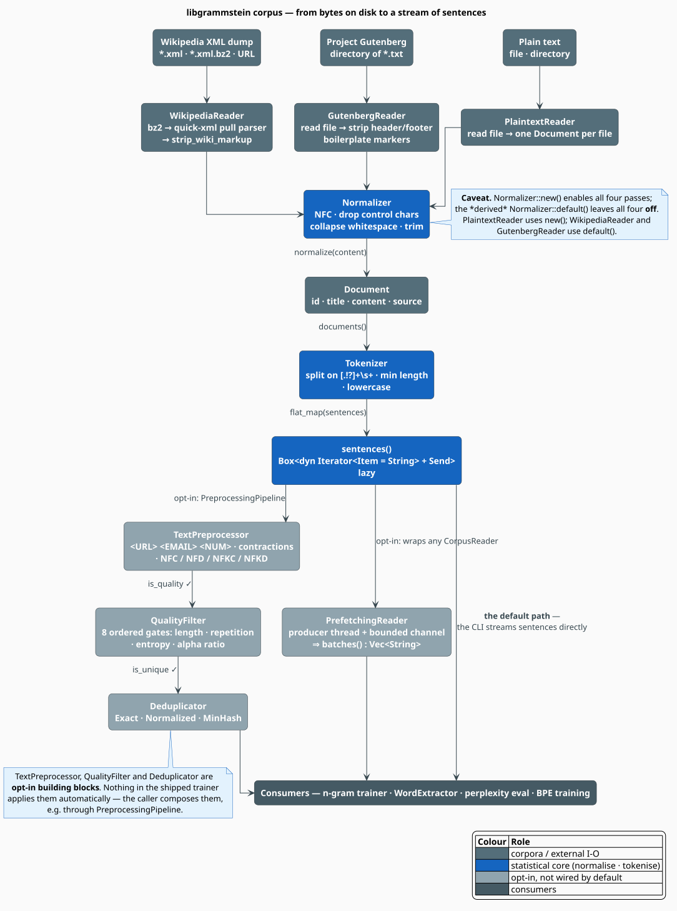
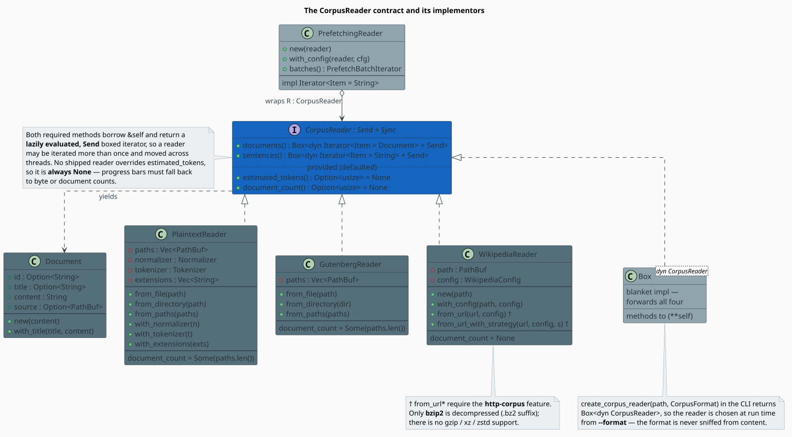

# Corpus Processing

The **corpus** module is libgrammstein's front door: it turns *bytes on disk* into a *lazy stream
of sentences*, and it offers a set of opt-in filters for deciding which of those sentences are worth
training on. Everything downstream — n-gram counting, dictionary extraction, embedding training,
perplexity evaluation — consumes the same one-line interface, `reader.sentences()`.

This document explains *what* the module guarantees, *how* its normalisation, tokenisation, quality
and deduplication stages are defined mathematically, and *where* the shipped defaults will surprise
you.

> **Scope.** Source of truth: [`src/corpus/`](../../../src/corpus/) — chiefly
> [`reader.rs`](../../../src/corpus/reader.rs), [`normalizer.rs`](../../../src/corpus/normalizer.rs),
> [`tokenizer.rs`](../../../src/corpus/tokenizer.rs), [`quality.rs`](../../../src/corpus/quality.rs),
> [`dedup.rs`](../../../src/corpus/dedup.rs) and
> [`preprocessing.rs`](../../../src/corpus/preprocessing.rs). For the memory model and the
> prefetcher see [Streaming](streaming.md); for the three concrete readers see [Formats](formats.md).

## Notation

Every symbol is defined before it is used.

| Symbol | Meaning |
|---|---|
| $`s`$ | a sentence — the unit yielded by `sentences()` |
| $`n`$ | number of whitespace-separated words in $`s`$ |
| $`c(w)`$ | number of occurrences of the word $`w`$ *within one sentence* |
| $`\bar{L}`$ | mean word length of $`s`$, in characters |
| $`H(s)`$ | Shannon entropy of the character distribution of $`s`$, in bits |
| $`k`$ | number of **distinct** non-whitespace characters in $`s`$ |
| $`\alpha(s)`$ | alphabetic ratio — alphabetic characters ÷ *all* characters |
| $`r(s)`$ | repetition ratio — count of the most frequent word ÷ $`n`$ |
| $`A, B`$ | the shingle **sets** of two sentences (deduplication) |
| $`J(A,B)`$ | Jaccard similarity of $`A`$ and $`B`$ |
| $`m`$ | number of hash functions in a MinHash signature (`num_hashes`) |
| $`\tau`$ | Jaccard threshold above which two sentences count as "the same" |
| $`g`$ | shingle size — the character n-gram width (`shingle_size`) |
| $`N`$ | number of sentences streamed from the corpus |

**Acronyms.** *NFC/NFD/NFKC/NFKD* — the four Unicode normalisation forms [[5]](#references);
*OOV* — Out-Of-Vocabulary; *CJK* — Chinese/Japanese/Korean.

## The shape of the module

Three readers, one trait, and a strictly optional back half. Bytes are decoded into `Document`s,
each `Document` is split into sentences, and the sentences are handed to a consumer. The
preprocessing, quality and deduplication stages sit *beside* that path, not inside it.



> **The single most important fact about this module.** `TextPreprocessor`, `QualityFilter` and
> `Deduplicator` are **components that nothing calls for you**. The shipped CLI trainer does exactly
> `for sentence in reader.sentences() { … }`. If you want filtering, you compose it yourself — see
> [Composing the pipeline](#composing-the-pipeline).

## The CorpusReader contract

`CorpusReader` is deliberately tiny: two required methods returning **lazy, `Send`** boxed iterators,
plus two provided size hints.

```rust
pub trait CorpusReader: Send + Sync {
    /// Iterate over documents (articles, chapters, books).
    fn documents(&self) -> Box<dyn Iterator<Item = Document> + Send + '_>;

    /// Iterate over sentences across all documents.
    fn sentences(&self) -> Box<dyn Iterator<Item = String> + Send + '_>;

    /// Estimate total tokens (for progress tracking).
    fn estimated_tokens(&self) -> Option<usize> { None }

    /// Number of documents, if known.
    fn document_count(&self) -> Option<usize> { None }
}
```

Both required methods borrow `&self`, so a reader may be iterated **more than once** and moved
across threads. A blanket `impl CorpusReader for Box<dyn CorpusReader>` forwards all four methods,
which is what lets the CLI choose a reader at run time and still pass a plain generic
`R: CorpusReader` to a trainer.



A `Document` carries whatever provenance its reader could recover:

```rust
pub struct Document {
    pub id: Option<String>,      // Wikipedia: the article title; Gutenberg: "1342" from pg1342.txt
    pub title: Option<String>,   // the same, or the file stem for plaintext
    pub content: String,         // the (possibly normalized) text
    pub source: Option<PathBuf>, // the file it came from; None for Wikipedia
}
```

**Two contract caveats worth internalising.**

1. **`estimated_tokens()` is always `None`.** No shipped reader overrides it, so a progress bar must
   be driven by bytes consumed or documents seen — never by a token estimate.
2. **`document_count()` is `Some(n)` only for the file-based readers.** `PlaintextReader` and
   `GutenbergReader` return the number of collected paths. `WikipediaReader` cannot know the article
   count without a full pass, so it returns `None`.

## Normalisation

`Normalizer` applies up to four passes, in this fixed order:

| Pass | Effect | Implementation |
|---|---|---|
| NFC | canonical composition: `"cafe\u{0301}"` becomes `"café"` | `unicode-normalization` [[5]](#references) |
| control-character removal | deletes the C0 controls except `\t`, `\n`, `\r`, plus `DEL` | regex |
| whitespace collapse | every `\s+` run becomes one space | regex |
| strip | trims leading and trailing whitespace | `str::trim` |

> **The `new()` / `default()` trap.** `Normalizer::new()` enables **all four** passes.
> `Normalizer::default()` is `#[derive(Default)]` over four `bool` fields, so it enables **none** of
> them — it is the identity function. `PlaintextReader` builds its normalizer with `new()`;
> `WikipediaReader` and `GutenbergReader` build theirs with `default()`. Wikipedia and Gutenberg text
> therefore reaches the tokenizer **un-normalised**: no NFC, no whitespace collapse. If you need
> normalisation there, run a `TextPreprocessor` over the sentence stream.

## Tokenisation

`Tokenizer` is a pair of regexes, not a linguistic model:

```math
\begin{array}{lr}
\displaystyle \text{sentence boundary} = \mathtt{[.!?]{+}\backslash s{+}},
\qquad
\text{word boundary} = \mathtt{[\backslash s\backslash p\{P\}]{+}} & \text{(T1)}
\end{array}
```

`sentences()` **splits on** the boundary, so terminal punctuation is *consumed*: the document
`"First. Second! Third?"` yields `"first"`, `"second"`, `"third?"` — the final `?` survives only
because no whitespace follows it. `words()` splits on whitespace-or-punctuation, so punctuation never
appears inside a token. `tokenize_with_spans()` additionally returns `(token, start, end)` byte
offsets, which is what a corrector needs in order to map a suggestion back onto the original text.

`Tokenizer::new()` sets `min_sentence_length = 10`, `min_word_length = 1` and `lowercase = true`;
the derived `Tokenizer::default()` sets `0`, `0` and `false`. Every shipped reader uses `new()`.

> **Lengths are byte counts, taken *before* trimming.** The filter is literally
> `s.len() >= min_len` on the raw split fragment. For ASCII that behaves as expected. For CJK it does
> not: three Japanese characters are nine UTF-8 bytes and so fall below the default ten-byte floor,
> even though they may be a complete sentence. Conversely a fragment that is mostly leading
> whitespace clears the gate and *then* trims down to almost nothing.

## Quality filtering

`QualityFilter` scores a sentence on six metrics (computed once, by `QualityMetrics::compute`) and
gates it on eight predicates.

### The metrics, defined

Let $`s`$ have $`n`$ whitespace-separated words $`w_1 \ldots w_n`$.

**Repetition ratio** — how far the sentence is dominated by its most frequent word:

```math
\begin{array}{lr}
\displaystyle r(s) \;=\; \frac{\max_{w} c(w)}{n} \;\in\; \left[\tfrac{1}{n},\, 1\right] & \text{(Q1)}
\end{array}
```

**Character entropy** — the Shannon entropy [[3]](#references) of the case-folded,
whitespace-stripped character distribution, in bits:

```math
\begin{array}{lr}
\displaystyle H(s) \;=\; -\sum_{x \in \Sigma} p(x) \log_2 p(x),
\qquad
p(x) = \frac{\text{occurrences of } x}{\text{total non-space characters}} & \text{(Q2)}
\end{array}
```

**Alphabetic ratio** and **mean word length** — note that $`\alpha`$ divides by *all* characters,
spaces included:

```math
\begin{array}{lr}
\displaystyle \alpha(s) = \frac{\bigl\lvert \{\, x \in s : x \text{ is alphabetic} \,\} \bigr\rvert}{\lvert s \rvert},
\qquad
\bar{L} = \frac{1}{n}\sum_{i=1}^{n} \lvert w_i \rvert & \text{(Q3)}
\end{array}
```

### Three consequences the thresholds inherit

These are not opinions. They follow from $`(\mathrm{Q1})`$–$`(\mathrm{Q3})`$, and they explain why
the shipped presets look the way they do.

**(a) The entropy floor is really a floor on character *variety*.** Entropy is maximised by the
uniform distribution, so $`H(s) \leq \log_2 k`$. Demanding $`H(s) \geq H_{\min}`$ therefore *forces*

```math
\begin{array}{lr}
\displaystyle k \;\geq\; 2^{H_{\min}} & \text{(Q4)}
\end{array}
```

distinct non-space characters. The default $`H_{\min} = 3.0`$ admits nothing with fewer than eight
distinct characters, and `strict()`'s $`3.5`$ demands $`\lceil 2^{3.5} \rceil = 12`$. This is why
`"aaaa aaaa aaaa"` is rejected — and why short CJK sentences, rich in *information* but poor in
*character repeats*, need `min_char_entropy` lowered explicitly.

**(b) The repetition ceiling is a hidden floor on sentence length.** Since $`r(s) \geq 1/n`$ by
$`(\mathrm{Q1})`$, every sentence with $`n < 1/\theta_{\text{rep}}`$ is rejected *whatever it says*.
The default $`\theta_{\text{rep}} = 0.3`$ thus kills every sentence of $`n \leq 3`$ words, because
$`1/3 \approx 0.333 > 0.3`$. The crate's own tests raise `max_word_repetition` to $`0.5`$ whenever
they lower `min_words` to $`3`$ — this is why.

**(c) The alphabetic ratio is really a *word-length* gate.** Take a purely alphabetic, single-spaced
sentence of $`n`$ words with mean length $`\bar{L}`$. It has $`n\bar{L}`$ alphabetic characters and
$`n-1`$ spaces, so

```math
\begin{array}{lr}
\displaystyle \alpha \;=\; \frac{n\bar{L}}{n\bar{L} + n - 1}
\;\xrightarrow[\;n \to \infty\;]{}\;
\frac{\bar{L}}{\bar{L}+1}
\quad\Longrightarrow\quad
\alpha \geq \alpha_{\min} \iff \bar{L} \;\gtrsim\; \frac{\alpha_{\min}}{1 - \alpha_{\min}} & \text{(Q5)}
\end{array}
```

For `strict()`, $`\alpha_{\min} = 0.78`$ implies $`\bar{L} \gtrsim 3.55`$ — *stricter* than that same
preset's `min_avg_word_length` of $`3.0`$, so the alpha gate binds first. Sanity check against the
shipped test sentence *"The quick brown fox jumps over the lazy dog in the forest."*: it has
$`\bar{L} = 3.92`$, so $`(\mathrm{Q5})`$ predicts $`\alpha \approx 0.797`$ and the measured value is
$`0.793`$, the gap being the single non-alphabetic full stop. The `0.78` in the source — commented
there as *"accounts for spaces diluting the ratio"* — is exactly $`(\mathrm{Q5})`$ solved backwards.

### The gates and the presets

`check_metrics` short-circuits, so the **first** failing predicate is the one `rejection_reason()`
reports. The order is therefore semantically load-bearing.

| # | Gate | `default()` | `strict()` | `lenient()` |
|---|---|---|---|---|
| 1 | `word_count >= min_words` | 5 | 8 | 3 |
| 2 | `word_count <= max_words` (`0` = unlimited) | 0 | 100 | 0 |
| 3 | $`r(s) \leq \theta_{\text{rep}}`$ (`max_word_repetition`) | 0.3 | 0.2 | 0.5 |
| 4 | terminal punctuation, if `require_terminal_punct` | false | true | false |
| 5 | $`H(s) \geq H_{\min}`$ (`min_char_entropy`) | 3.0 | 3.5 | 2.0 |
| 6 | $`\alpha(s) \geq \alpha_{\min}`$ (`min_alpha_ratio`) | 0.7 | 0.78 | 0.5 |
| 7 | $`\bar{L} \geq L_{\min}`$ (`min_avg_word_length`) | 2.0 | 3.0 | 1.5 |
| 8 | $`\bar{L} \leq L_{\max}`$ (`max_avg_word_length`) | 20.0 | 15.0 | 25.0 |

Terminal punctuation is recognised in both scripts: `.`, `!`, `?` and the fullwidth CJK forms `。`,
`！`, `？`.

Rejections are typed, not boolean. `RejectionReason` carries the offending value *and* the threshold
it violated — `TooFewWords { count, minimum }`, `LowEntropy { entropy, minimum }`, and six more — and
`compute_stats` tallies them into a printable `QualityStats`, so you can find out *why* a corpus is
being discarded before you discard it.

## Deduplication

Web corpora are full of boilerplate: navigation chrome, licence blocks, syndicated paragraphs.
Duplicates inflate the counts of exactly the n-grams that are least informative [[4]](#references),
so `Deduplicator` offers three notions of "the same sentence", in increasing strength and cost.


### Exact and Normalized

Both hash the sentence to a `u64` and insert it into a `HashSet<u64>`; they differ in *what* they
hash. `Normalized` — the default mode — first maps the sentence through a canonical form that keeps
letters (lowercased) and digits, turns whitespace runs into single spaces and **discards everything
else**, so `"Hello, world."`, `"HELLO WORLD!"` and `"hello world"` collide by construction.

Because only a 64-bit digest is retained, two genuinely different sentences *can* collide. With $`N`$
distinct sentences the expected number of false-duplicate pairs is the birthday count

```math
\begin{array}{lr}
\displaystyle \mathbb{E}[\text{collisions}] \;=\; \binom{N}{2} 2^{-64} \;\approx\; \frac{N^{2}}{2^{65}} & \text{(D1)}
\end{array}
```

which at $`N = 10^{9}`$ is $`\approx 0.027`$ — roughly a 2.7 % chance of losing *one* sentence across
a billion. Acceptable, but real: it is not zero.

### MinHash: fuzzy duplicates

`MinHash { num_hashes, threshold, shingle_size }` finds *near*-duplicates. A sentence is reduced to
the set of character $`g`$-grams ("shingles") of its normalized form [[2]](#references), and
similarity is the **Jaccard index**

```math
\begin{array}{lr}
\displaystyle J(A, B) \;=\; \frac{\lvert A \cap B \rvert}{\lvert A \cup B \rvert} \;\in\; [0, 1] & \text{(D2)}
\end{array}
```

Evaluating $`(\mathrm{D2})`$ exactly against every retained sentence would mean storing every shingle
set. Broder's insight [[1]](#references) is that for a uniformly random permutation $`\pi`$ of the
shingle universe,

```math
\begin{array}{lr}
\displaystyle \Pr\bigl[\min \pi(A) = \min \pi(B)\bigr] \;=\; J(A, B) & \text{(D3)}
\end{array}
```

so a *signature* of $`m`$ independent minima is a sample of $`m`$ Bernoulli($`J`$) trials.
libgrammstein approximates the permutations with $`m`$ seeded hash functions and estimates

```math
\begin{array}{lr}
\displaystyle \hat{J}(A,B) = \frac{1}{m} \sum_{i=1}^{m} \mathbf{1}\bigl[\mathrm{sig}_A[i] = \mathrm{sig}_B[i]\bigr],
\qquad
\mathbb{E}\bigl[\hat{J}\bigr] = J,
\qquad
\mathrm{Var}\bigl[\hat{J}\bigr] = \frac{J(1-J)}{m} & \text{(D4)}
\end{array}
```

The standard error is at most $`1/(2\sqrt{m})`$, so the default $`m = 128`$ gives
$`\sigma \leq 0.044`$: a $`\tau = 0.8`$ threshold really means $`0.8 \pm 0.04`$ at one sigma. Raising
$`m`$ shrinks the error as $`m^{-1/2}`$ while growing both time and memory linearly — the usual
trade.

### Costs, and two sharp edges

| Mode | Work per sentence | Whole corpus | Memory per retained sentence |
|---|---|---|---|
| `Exact` | one hash of $`\lvert s \rvert`$ bytes | $`O(N \lvert s \rvert)`$ | 8 B (the digest) |
| `Normalized` | normalise, then one hash | $`O(N \lvert s \rvert)`$ | 8 B |
| `MinHash` | $`O(\lvert s \rvert \cdot m)`$ to sign, then a **linear scan** of every stored signature | $`O(N^{2} m)`$ | $`8m`$ B — 1 KiB at $`m = 128`$ |

1. **MinHash here is not banded LSH.** Despite the module's prose, `check_minhash` compares each new
   signature against *every* signature retained so far. It is quadratic in the corpus, and its
   signature store costs $`8m`$ bytes per unique sentence: at $`m = 128`$ that is 1 KiB each, so 10 M
   sentences would need roughly 10 GB. Use it on curated subsets, not on web-scale crawls.
2. **Short sentences vanish in MinHash mode.** If the normalized form holds fewer than $`g`$
   characters it yields *no* shingles, and `check_minhash` returns `false` — which the caller reads
   as *duplicate*. Such sentences are silently **dropped**, not kept.

## Composing the pipeline

`PreprocessingPipeline` is the supported way to bolt the optional stages together.

`TextPreprocessor` rewrites surface forms before anything else sees them: URLs, e-mails, `@user`
mentions, `#hashtags` and numbers become the sentinel tokens `<URL>`, `<EMAIL>`, `<USER>`,
`<HASHTAG>` and `<NUM>` (the constants live in `corpus::tokens`); contractions can be expanded from a
28-entry English table; and one of the four Unicode forms can be applied. Three presets ship:
`minimal()` (whitespace only), `new()`/`default()` (numbers, URLs, e-mails, NFC) and `aggressive()`
(everything, plus lowercasing and NFKC).

> **`process` and `process_batch` are not the same function.** `PreprocessingPipeline::process`
> applies the preprocessor and the quality filter and returns `Option<String>`. **Deduplication
> happens only in `process_batch`**, which constructs a fresh `Deduplicator` for the batch — a
> `Deduplicator` is stateful, and a per-sentence call has nowhere to keep that state. A pipeline
> configured with `.deduplication(…)` and then driven one sentence at a time through `process` will
> never deduplicate anything.

## The algorithm, literately

The composed gate, as `process_batch` implements it. `⟨…⟩` names a refinement expanded below.

```
function process_batch(sentences, preprocessor, filter, dedup_mode):
    dedup <- Deduplicator::new(dedup_mode)          ▸ stateful: one per batch, not per sentence
    for s in sentences:                             ▸ lazy: nothing is materialised
        t <- ⟨Rewrite surface forms⟩
        if not ⟨Eight quality gates⟩:      continue ▸ first failing gate wins
        if not ⟨Is this the first sighting?⟩: continue
        yield t

⟨Rewrite surface forms⟩ ≡                           ▸ TextPreprocessor::process, in this fixed order
    t <- unicode_norm(s)                            ▸ NFC / NFD / NFKC / NFKD, or none
    t <- replace URLs, then e-mails                 ▸ URLs first: an address inside a URL must not win
    t <- replace @users, #hashtags, then numbers
    t <- expand contractions; lowercase             ▸ both off by default
    t <- collapse whitespace; trim

⟨Eight quality gates⟩ ≡                             ▸ QualityFilter::check_metrics
    m <- QualityMetrics::compute(t)                 ▸ one pass: counts, entropy, ratios
    return m.word_count in [min_words, max_words]   ▸ short-circuits on the first false
       and m.max_word_repetition <= theta_rep       ▸ (Q1)
       and (m.has_terminal_punct or not require_terminal_punct)
       and m.char_entropy    >= H_min               ▸ (Q2), and hence (Q4)
       and m.alpha_ratio     >= alpha_min           ▸ (Q3), and hence (Q5)
       and m.avg_word_length in [L_min, L_max]

⟨Is this the first sighting?⟩ ≡                     ▸ Deduplicator::is_unique
    match mode:
      Exact      -> seen.insert(safe_hash(t))                       ▸ true iff newly inserted
      Normalized -> seen.insert(safe_hash(normalize(t)))            ▸ letters + digits only
      MinHash{m, tau, g} ->
          sh <- character g-grams of normalize(t)
          if sh is empty:  return false                             ▸ too short ⇒ treated as duplicate
          sig <- [ min over x in sh of hash(x, i)   for i in 0..m ] ▸ (D3)
          for old in signatures:
              if jaccard_hat(sig, old) >= tau: return false         ▸ (D4), by linear scan
          signatures.push(sig);  return true
```

## Engineering

### Hashing

Sentence and shingle digests go through `crate::util::hash::safe_hash`, which switches on length:

```rust
pub fn safe_hash(bytes: &[u8]) -> u64 {
    if bytes.len() >= 16 {
        gxhash::gxhash64(bytes, 0)
    } else {
        xxhash_rust::xxh3::xxh3_64(bytes)
    }
}
```

The 16-byte floor is not a tuning knob: gxhash's AES/SSE2 path reads in 16-byte lanes, so shorter
inputs are routed to XXH3 for memory safety. The MinHash *seeded* family is a third hasher — it uses
the standard library's `DefaultHasher`, writing the seed and then the shingle digest, so that the
$`m`$ "permutations" are genuinely distinct.

`Deduplicator::memory_usage()` reports the live cost (`seen.capacity() * 8` plus $`8m`$ bytes per
stored signature). It is the number to watch when a MinHash run starts to swap.

### What is *not* here

Do not go looking for these — they do not exist anywhere in `src/corpus`: reader chaining, a generic
HTTP reader, glob expansion, gzip/xz/zstd decompression, content sniffing, or automatic language
detection. What *is* available is catalogued in [Formats](formats.md).

## Usage

Streaming with no filtering at all — this is exactly what the CLI trainer does:

```rust
use libgrammstein::corpus::{CorpusReader, PlaintextReader};

let reader = PlaintextReader::from_file("corpus.txt")?;
for sentence in reader.sentences() {
    // one owned String at a time; nothing else is resident
    println!("{sentence}");
}
# Ok::<(), std::io::Error>(())
```

The full opt-in gate, composed explicitly:

```rust
use libgrammstein::corpus::{
    CorpusReader, DeduplicationMode, PlaintextReader, PreprocessingPipeline, QualityFilter,
    TextPreprocessor,
};

let reader = PlaintextReader::from_directory("corpus/")?;

let pipeline = PreprocessingPipeline::builder()
    .preprocessor(TextPreprocessor::aggressive())   // <URL>/<NUM>/lowercase/NFKC
    .quality_filter(QualityFilter::strict())        // the eight gates, tight
    .deduplication(DeduplicationMode::Normalized)   // case- and punctuation-insensitive
    .build();

// process_batch is the only entry point that deduplicates.
for sentence in pipeline.process_batch(reader.sentences()) {
    train_on(&sentence);
}
# fn train_on(_: &str) {}
# Ok::<(), std::io::Error>(())
```

Auditing a corpus *before* committing to it — where are the sentences going?

```rust
use libgrammstein::corpus::{CorpusReader, PlaintextReader, QualityFilter};

let reader = PlaintextReader::from_file("corpus.txt")?;
let filter = QualityFilter::builder()
    .min_words(5)
    .min_char_entropy(3.0)      // (Q4): at least 8 distinct characters
    .max_word_repetition(0.3)   // (Q1): hence at least 4 words
    .build();

let stats = filter.compute_stats(reader.sentences());
print!("{stats}");              // Display prints the full rejection breakdown
# Ok::<(), std::io::Error>(())
```

Deduplicating on its own, with statistics:

```rust
use libgrammstein::corpus::{CorpusReader, Deduplicator, PlaintextReader};

let reader = PlaintextReader::from_file("corpus.txt")?;
let mut dedup = Deduplicator::minhash_default();   // m = 128, tau = 0.8, g = 3

let kept: Vec<String> = dedup.filter(reader.sentences()).collect();
println!("kept {} sentences", kept.len());
print!("{}", dedup.stats());                       // total / unique / duplicates
println!("dedup rate: {:.1}%", dedup.stats().dedup_rate());
# Ok::<(), std::io::Error>(())
```

## References

1. A. Z. Broder (1997). *On the resemblance and containment of documents.* Proceedings of the
   Compression and Complexity of Sequences, IEEE, 21–29.
   [doi:10.1109/SEQUEN.1997.666900](https://doi.org/10.1109/SEQUEN.1997.666900)
2. A. Z. Broder, S. C. Glassman, M. S. Manasse & G. Zweig (1997). *Syntactic clustering of the Web.*
   Computer Networks and ISDN Systems 29(8–13), 1157–1166.
   [doi:10.1016/S0169-7552(97)00031-7](https://doi.org/10.1016/S0169-7552%2897%2900031-7)
3. C. E. Shannon (1948). *A Mathematical Theory of Communication.* Bell System Technical Journal
   27(3), 379–423.
   [doi:10.1002/j.1538-7305.1948.tb01338.x](https://doi.org/10.1002/j.1538-7305.1948.tb01338.x)
4. C. D. Manning, P. Raghavan & H. Schütze (2008). *Introduction to Information Retrieval.*
   Cambridge University Press.
   [doi:10.1017/CBO9780511809071](https://doi.org/10.1017/CBO9780511809071) — chapter 19 covers
   shingling and near-duplicate detection.
5. Unicode Consortium. *UAX #15: Unicode Normalization Forms.*
   <https://www.unicode.org/reports/tr15/>

## See also

- [Streaming](streaming.md) — the residency model and the prefetching reader
- [Formats](formats.md) — the three concrete readers, and how one gets chosen
- [Dictionary Extraction](../dictionary/extraction.md) — the other large consumer of `sentences()`
- [Large Corpora](../../training/large-corpora.md) — training at scale
- [Threading Model](../../architecture/threading.md) — how consumers parallelise the stream
- [Traits API](../../api/traits.md) — the `CorpusReader` reference
