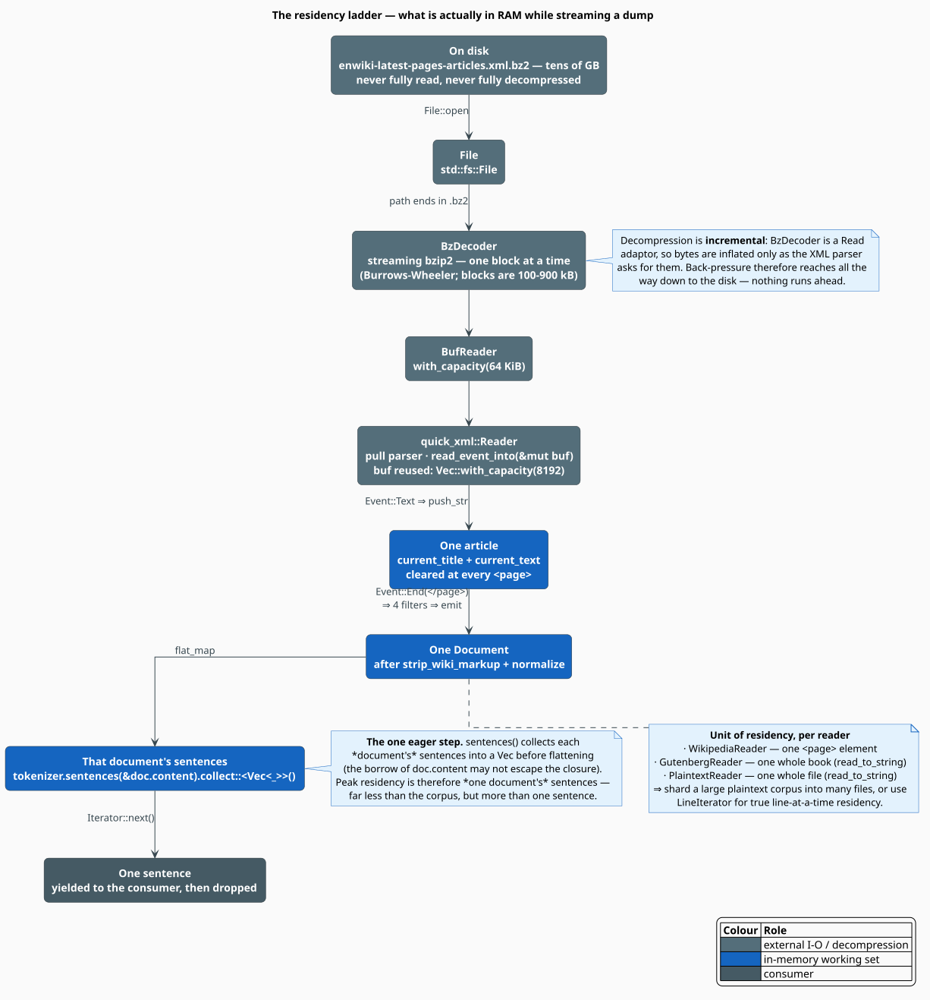
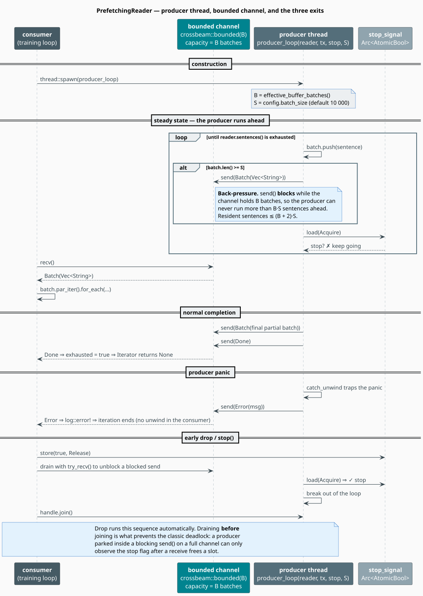

# Streaming

A Wikipedia dump is tens of gigabytes; a laptop is not. libgrammstein trains on such a corpus by
never holding more than a *sliver* of it: every reader is a **lazy pull chain**, and the optional
`PrefetchingReader` puts a **bounded queue** between the thread that reads bytes and the thread that
does arithmetic.

This document quantifies exactly what is resident at each stage, derives the prefetcher's buffer-size
formula from the code, and explains the shutdown protocol that keeps the producer from deadlocking.

> **Scope.** Source of truth: [`src/corpus/prefetch.rs`](../../../src/corpus/prefetch.rs),
> [`src/corpus/plaintext.rs`](../../../src/corpus/plaintext.rs) and
> [`src/corpus/wikipedia.rs`](../../../src/corpus/wikipedia.rs). For the reader trait and the
> filters see [Corpus Overview](overview.md); for the format-specific parsers see
> [Formats](formats.md).

## Notation

| Symbol | Meaning |
|---|---|
| $`B`$ | buffer depth — the channel's capacity, **in batches** (`buffer_batches`) |
| $`S`$ | batch size — sentences per batch (`batch_size`, default $`10\,000`$) |
| $`\rho`$ | fraction of free RAM the buffer may occupy (`ram_fraction`, default $`0.10`$) |
| $`M`$ | free memory in bytes, as reported by `sysinfo` |
| $`\hat{b}`$ | the code's assumed bytes-per-sentence constant, $`\hat{b} = 100`$ |
| $`\lambda_p`$ | producer rate — sentences per second the reader can decode |
| $`\lambda_c`$ | consumer rate — sentences per second the trainer can absorb |
| $`W`$ | mean time a batch waits in the queue |
| $`L`$ | mean number of batches in the queue |

## The residency ladder

Nothing in the read path is eager, so the resident set is decided by the *widest* rung of the ladder,
not by the file size.



Decompression deserves a note: `BzDecoder` is a `Read` adaptor, so bytes are inflated only when the
XML parser asks for them. Back-pressure therefore propagates all the way down to the disk — no stage
can run ahead of its consumer, and the bzip2 block (100–900 kB) is the only decompression buffer that
exists.

### The unit of residency differs per reader

This is the practical consequence, and it is easy to get wrong:

| Reader | What is materialised at once | Why |
|---|---|---|
| `WikipediaReader` | one `<page>` element | the pull parser accumulates `current_text` between `<text>` and `</text>` |
| `GutenbergReader` | one whole book | `fs::read_to_string(path)` |
| `PlaintextReader` | one whole *file* | `fs::read_to_string(path)`, one `Document` per file |

So a single 8 GB `corpus.txt` is **not** streamed line-by-line — it is read into one `String` and
becomes one `Document`. Two remedies, both cheap:

1. **Shard the corpus** into many files and use `PlaintextReader::from_directory` (or `from_paths`);
   residency then falls to the largest single file.
2. Use **`LineIterator`**, which is a genuine `BufReader::read_line` loop and therefore has
   one-line residency. It normalises each line and skips the empties:

```rust
use libgrammstein::corpus::{LineIterator, Normalizer};

// True line-at-a-time residency, independent of file size.
for line in LineIterator::new("corpus.txt", Normalizer::new())? {
    train_on(&line);
}
# fn train_on(_: &str) {}
# Ok::<(), std::io::Error>(())
```

### The one eager step

`sentences()` is *almost* fully lazy. Its inner closure is

```rust
documents.flat_map(move |doc| tokenizer.sentences(&doc.content).collect::<Vec<_>>())
```

The `collect::<Vec<_>>()` is not laziness lost by accident: `tokenizer.sentences(&doc.content)`
borrows the document, and that borrow cannot escape the closure, so the sentences of *one* document
are materialised before being flattened. Peak residency is therefore

```math
\text{resident} \;\approx\; \underbrace{\lvert d \rvert}_{\text{one document}} \;+\; \underbrace{\sum_{s \in d} \lvert s \rvert}_{\text{its sentences}} \;\approx\; 2\,\lvert d \rvert
\tag{S1}
```

for the largest document $`d`$ — a bounded, predictable cost, but not "one sentence at a time".

## Prefetching: decoupling I-O from work

A single-threaded `for sentence in reader.sentences()` loop alternates between *decoding* and
*counting*, so the two never overlap and total time is $`T_{\text{io}} + T_{\text{cpu}}`$.
`PrefetchingReader` moves the decode onto its own thread and connects the two with a bounded
`crossbeam` channel, so total time falls to $`\max(T_{\text{io}}, T_{\text{cpu}})`$ plus one batch of
latency.



### Sizing the buffer

`PrefetchConfig` exposes four knobs:

| Field | Default | Meaning |
|---|---|---|
| `batch_size` | `10_000` | $`S`$, sentences per batch |
| `buffer_batches` | `8` | $`B`$, used **only** when `auto_tune` is off |
| `auto_tune` | `true` | derive $`B`$ from free RAM |
| `ram_fraction` | `0.10` | $`\rho`$; `with_ram_fraction` clamps it to $`[0.01, 0.50]`$ |

With auto-tuning on, `compute_buffer_batches` evaluates

```math
B \;=\; \operatorname{clamp}\!\left(
  \left\lfloor \frac{\rho \, M}{S \cdot \hat{b}} \right\rfloor,\; 2,\; 32
\right),
\qquad \hat{b} = 100 \text{ bytes}
\tag{S2}
```

and with auto-tuning off it simply takes $`B = \operatorname{clamp}(\texttt{buffer\_batches}, 2, 64)`$.
The two clamps differ on purpose: an explicit setting is trusted further (up to 64) than a derived
one (up to 32).

**Worked example.** A 64 GiB machine with 32 GiB free, at the defaults: the target is
$`\rho M = 3.2`$ GiB; a batch is assumed to cost $`S \hat{b} = 10\,000 \times 100 = 1`$ MB; so the
raw quotient is $`3200`$, which clamps to $`B = 32`$. The channel therefore holds at most 32 batches.

> **$`\hat{b} = 100`$ bytes is a hard-coded guess, not a measurement.** If your sentences average 300
> bytes, $`(\mathrm{S2})`$ under-counts the buffer's true footprint by 3×. The clamp keeps the error
> bounded (32 batches × 10 000 sentences × 300 B $`\approx`$ 96 MB, which is still small), but on a
> memory-tight box you should set `auto_tune(false)` and pick $`B`$ yourself.

### The residency bound

The channel holds at most $`B`$ batches. In the worst instant the producer is also holding a batch it
has filled but not yet sent, and the consumer is holding the batch it is working on, so

```math
\text{sentences resident} \;\leq\; (B + 2)\, S
\tag{S3}
```

At the defaults that is $`34 \times 10\,000 = 340\,000`$ sentences — about 34 MB under the $`\hat{b}`$
model. Memory usage is *constant in corpus size*, which is the entire point.

### Why a bounded channel, and how deep

The queue exists to absorb *variance*, not to store the corpus. Steady-state throughput is
$`\min(\lambda_p, \lambda_c)`$ no matter how deep the queue is; depth only buys tolerance for bursts.
Little's law [[1]](#references) makes the relation precise: for a stable queue,

```math
L \;=\; \lambda\, W
\tag{S4}
```

so at the throughput $`\lambda = \min(\lambda_p, \lambda_c)`$, a queue that averages $`L`$ batches
hides $`W = L/\lambda`$ seconds of producer stall. A bounded buffer of $`B`$ batches can therefore
mask any I-O hiccup shorter than $`B S / \lambda_c`$ — with the defaults and a consumer running at
100 k sentences/s, roughly 3.2 seconds of disk latency. Beyond that the consumer starves; below it,
it never notices. Making $`B`$ larger cannot raise throughput above $`\lambda_p`$; it can only waste
RAM.

Back-pressure is the mirror image: `send()` **blocks** while the channel is full, so a fast producer
is throttled to $`\lambda_c`$ automatically, and a slow consumer can never be buried.

## The algorithm, literately

`producer_loop`, and the three ways it can end. `⟨…⟩` names a refinement expanded below.

```
function producer_loop(reader, tx, stop_signal, S):
    catch_unwind:                                  ▸ a panic here must not poison the consumer
        batch <- Vec::with_capacity(S)             ▸ preallocated once per batch
        for sentence in reader.sentences():
            if stop_signal.load(Acquire):  break   ▸ ⟨Early stop⟩
            batch.push(sentence)
            if batch.len() >= S:
                if tx.send(Batch(batch)).is_err(): return   ▸ receiver dropped: nothing to do
                batch <- Vec::with_capacity(S)     ▸ blocks while the channel holds B batches
        if batch is non-empty and not stopped:
            tx.send(Batch(batch))                  ▸ the final, partial batch
        tx.send(Done)                              ▸ ⟨Normal completion⟩
    on panic(p):
        tx.send(Error(message_of(p)))              ▸ ⟨Panic containment⟩

⟨Normal completion⟩ ≡
    the consumer receives Done, sets exhausted = true, and Iterator::next returns None.

⟨Panic containment⟩ ≡
    catch_unwind traps the unwind on the producer thread; the message is logged with log::error!
    and delivered as Error(msg). The consumer ends iteration cleanly — it does not re-panic.

⟨Early stop⟩ ≡                                     ▸ stop(), or Drop
    consumer: stop_signal.store(true, Release)
    consumer: while rx.try_recv().is_ok() {}       ▸ DRAIN FIRST - see below
    consumer: handle.join()
```

### The drain-before-join invariant

`⟨Early stop⟩` looks over-engineered until you consider a producer parked *inside* a blocking
`send()` on a full channel. Such a thread is not at the top of its loop, so it cannot observe the
stop flag; joining it would block forever. Draining the channel frees a slot, the `send()` returns,
the loop head re-checks the flag, and the thread exits. Hence the fixed order:

```math
\texttt{store(stop)} \;\prec\; \texttt{drain} \;\prec\; \texttt{join}
\tag{S5}
```

`Drop` performs this sequence automatically for both `PrefetchingReader` and
`PrefetchBatchIterator`, which is why dropping a prefetcher mid-corpus — `prefetch.take(50)`, say —
returns promptly instead of hanging. The crate's `test_prefetch_drop_no_hang` pins this behaviour.

## Engineering

### Two consumption modes

`PrefetchingReader` is itself an `Iterator<Item = String>`: it holds the current batch and yields
sentences one at a time. Calling `.batches()` instead *converts* it into a
`PrefetchBatchIterator` yielding whole `Vec<String>`s, which is what you want when the per-sentence
work is small enough that Rayon's per-item overhead would dominate:

```rust
use libgrammstein::corpus::{PlaintextReader, PrefetchConfig, PrefetchingReader};
use rayon::prelude::*;

let reader = PlaintextReader::from_file("corpus.txt")?;
let config = PrefetchConfig::new().with_batch_size(20_000);

for batch in PrefetchingReader::with_config(reader, config).batches() {
    // Decode of batch i+1 overlaps with the parallel scan of batch i.
    batch.par_iter().for_each(|sentence| train_on(sentence));
}
# fn train_on(_: &str) {}
# Ok::<(), std::io::Error>(())
```

`batches()` consumes the reader by value and **panics** with *"PrefetchingReader already consumed"*
if the receiver has already been taken, so call it at most once.

### Memory probing

Free memory comes from `sysinfo`, behind a process-wide `OnceLock<Mutex<System>>` — constructing a
`System` is expensive, so one instance is created and refreshed. The probe is
`total_memory() - used_memory()`, and it falls back to a conservative **8 GiB** if the platform
reports nothing. Note that $`(\mathrm{S2})`$ is evaluated **once**, at construction: the buffer does
not shrink if another process later eats the RAM.

### Observability

`batches_received()` and `sentences_yielded()` are running counters on the reader; `is_stopped()`
reports the flag. There is no progress *estimate*, because `estimated_tokens()` is `None` for every
shipped reader (see [Corpus Overview](overview.md)) — drive progress bars from bytes or documents.

## Usage

Sentence-at-a-time, with prefetching, at the defaults:

```rust
use libgrammstein::corpus::{PlaintextReader, PrefetchingReader};

let reader = PlaintextReader::from_directory("corpus/")?;

// Producer thread starts immediately; B is derived from free RAM by (S2).
for sentence in PrefetchingReader::new(reader) {
    train_on(&sentence);
}
# fn train_on(_: &str) {}
# Ok::<(), std::io::Error>(())
```

Pinning the buffer on a memory-tight machine:

```rust
use libgrammstein::corpus::{PlaintextReader, PrefetchConfig, PrefetchingReader};

let config = PrefetchConfig::new()
    .with_batch_size(2_000)      // S
    .with_auto_tune(false)       // ignore free RAM ...
    .with_buffer_batches(4);     // ... and pin B = 4  ⇒  (S3): at most 12 000 sentences resident

let reader = PlaintextReader::from_file("corpus.txt")?;
let prefetch = PrefetchingReader::with_config(reader, config);

for (i, sentence) in prefetch.enumerate() {
    if i >= 1_000_000 { break; }   // Drop runs (S5): stop, drain, join — no hang
    train_on(&sentence);
}
# fn train_on(_: &str) {}
# Ok::<(), std::io::Error>(())
```

Wrapping a boxed reader chosen at run time — the blanket impl makes this work:

```rust
use libgrammstein::corpus::{CorpusReader, GutenbergReader, PlaintextReader, PrefetchingReader};

let reader: Box<dyn CorpusReader> = if use_gutenberg {
    Box::new(GutenbergReader::from_directory("gutenberg/")?)
} else {
    Box::new(PlaintextReader::from_directory("corpus/")?)
};

for batch in PrefetchingReader::new(reader).batches() {
    process(&batch);
}
# let use_gutenberg = true;
# fn process(_: &[String]) {}
# Ok::<(), std::io::Error>(())
```

## References

1. J. D. C. Little (1961). *A Proof for the Queuing Formula: $`L = \lambda W`$.* Operations Research
   9(3), 383–387. [doi:10.1287/opre.9.3.383](https://doi.org/10.1287/opre.9.3.383)
2. J. Seward. *bzip2 and libbzip2* — the block-sorting compressor whose 100–900 kB blocks bound the
   decompression buffer. <https://sourceware.org/bzip2/>
3. M. Burrows & D. J. Wheeler (1994). *A Block-sorting Lossless Data Compression Algorithm.* Digital
   SRC Research Report 124.
   <https://www.hpl.hp.com/techreports/Compaq-DEC/SRC-RR-124.pdf>
4. `crossbeam-channel` — the bounded MPMC channel providing the back-pressure.
   <https://docs.rs/crossbeam-channel>

## See also

- [Corpus Overview](overview.md) — the reader contract, normalisation, quality and dedup
- [Formats](formats.md) — what each reader materialises, and why
- [Threading Model](../../architecture/threading.md) — how the consumer side parallelises
- [Memory Optimization](../../architecture/memory-optimization.md) — allocator and residency tuning
- [Large Corpora](../../training/large-corpora.md) — end-to-end guidance for multi-GB training
