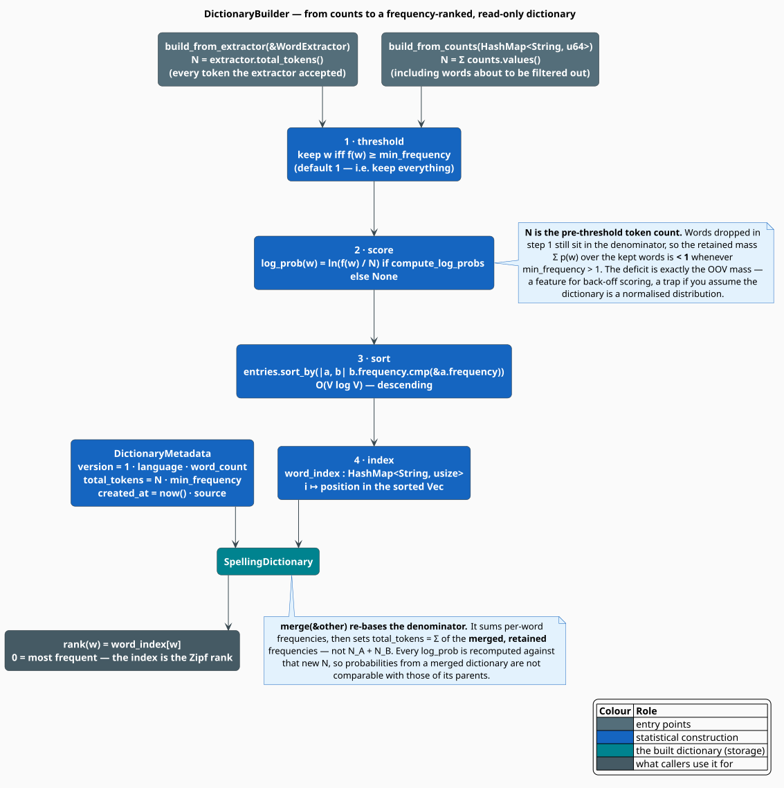
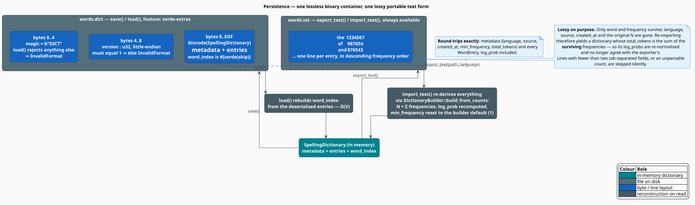

# Dictionary Building

`DictionaryBuilder` freezes a mutable frequency table into an immutable, frequency-ranked
`SpellingDictionary`. The build is four steps and about forty lines of code; the interesting content
is in what the four steps *imply* — why `rank()` is free, why the probabilities deliberately do not
sum to one, and why merging two dictionaries changes the meaning of every probability in both.

> **Scope.** Source of truth: [`src/dictionary/builder.rs`](../../../src/dictionary/builder.rs) and
> [`src/dictionary/types.rs`](../../../src/dictionary/types.rs). Where the counts come from is
> [Extraction](extraction.md); the module map is the [Dictionary Overview](overview.md).

## Notation

| Symbol | Meaning |
|---|---|
| $`V`$ | the vocabulary retained by the build |
| $`\lvert V \rvert`$ | its size, `SpellingDictionary::len()` |
| $`f(w)`$ | frequency of the word $`w`$ |
| $`N`$ | the token total stored in the metadata (`total_tokens`) |
| $`\theta`$ | `min_frequency` — the retention threshold |
| $`p(w)`$ | the maximum-likelihood unigram probability of $`w`$ |
| $`C(\theta)`$ | token coverage of the retained vocabulary |
| $`r(w)`$ | frequency rank of $`w`$; $`r = 0`$ is the most frequent |

## The build, step by step

Two entry points, one shared construction.



| Entry point | Input | $`N`$ becomes |
|---|---|---|
| `build_from_extractor(&WordExtractor)` | a live extractor | `extractor.total_tokens()` — every token normalisation *accepted* |
| `build_from_counts(HashMap<String, u64>)` | raw counts | $`\sum_w f(w)`$ over the **whole map**, including words about to be filtered out |

Then, identically:

1. **Threshold.** Keep $`w`$ iff $`f(w) \geq \theta`$. The default $`\theta = 1`$ keeps everything.
2. **Score.** If `compute_log_probs` (default `true`), attach $`\ln\bigl(f(w)/N\bigr)`$ to each entry.
3. **Sort.** `entries.sort_by(|a, b| b.frequency.cmp(&a.frequency))` — descending,
   $`O(\lvert V \rvert \log \lvert V \rvert)`$.
4. **Index.** Build `word_index: HashMap<String, usize>` mapping each word to its position in the
   sorted vector.

The builder's other knobs are metadata-only: `language` (BCP 47, default `"en"`) and `source` (a free
text provenance note).

### Step 3 is the load-bearing one

Because the vector is sorted by descending frequency, a word's **index is its rank**. `rank()` is
therefore a single hash probe with no comparison, sorting or scanning:

```math
\begin{array}{lr}
\displaystyle r(w) \;=\; \texttt{word\_index}[w],
\qquad
r(w) = 0 \iff w \text{ is the most frequent word} & \text{(B1)}
\end{array}
```

and `top_n(k)` is a slice — `&entries[..k]` — not a computation. Rank is exactly the $`r`$ of Zipf's
law (see [Overview](overview.md#why-frequency-and-why-a-threshold)), so a frequency-ranked dictionary
*is* an empirical Zipf table, ready for candidate ranking:

```rust
// The most frequent candidate wins — the classic noisy-channel prior.
let best = candidates.iter().filter(|w| dict.contains(w)).min_by_key(|w| dict.rank(w).unwrap_or(usize::MAX));
```

## What the numbers mean

`log_prob` is the maximum-likelihood unigram estimate:

```math
\begin{array}{lr}
\displaystyle \log p(w) \;=\; \ln \frac{f(w)}{N} & \text{(B2)}
\end{array}
```

### The distribution is deliberately sub-stochastic

$`N`$ is the **pre-threshold** token count in both entry points — the words that step 1 deletes are
still in the denominator. Therefore

```math
\begin{array}{lr}
\displaystyle \sum_{w \in V} p(w) \;=\; \frac{\sum_{f(w) \geq \theta} f(w)}{N} \;=\; C(\theta) \;\leq\; 1 & \text{(B3)}
\end{array}
```

with equality exactly when $`\theta \leq 1`$. The deficit $`1 - C(\theta)`$ is the **OOV mass**: the
share of corpus tokens the dictionary has chosen not to represent.

This is a feature. A back-off or noisy-channel scorer *wants* to know how much probability to reserve
for words outside the lexicon, and $`(\mathrm{B3})`$ hands it over for free. It is also a trap for
anyone who assumes a dictionary is a normalised distribution — $`\sum_w \exp(\texttt{log\_prob}(w))`$
will not be $`1`$, and it is not supposed to be.

If you *do* want a proper distribution over the retained vocabulary, renormalise explicitly:

```rust
use libgrammstein::dictionary::SpellingDictionary;

/// Renormalise (B2) so that the retained vocabulary sums to 1 — i.e. divide by C(theta).
fn renormalized_log_prob(dict: &SpellingDictionary, word: &str) -> Option<f64> {
    let kept: u64 = dict.entries().iter().map(|e| e.frequency).sum();   // C(theta) * N
    let f = dict.frequency(word)?;
    Some((f as f64 / kept as f64).ln())
}
```

### `merge` re-bases the denominator

`merge(&other)` sums frequencies word-by-word:

```math
\begin{array}{lr}
\displaystyle f'(w) \;=\; f_A(w) + f_B(w)
\qquad\text{for all } w \in V_A \cup V_B & \text{(B4)}
\end{array}
```

and then sets `total_tokens` to the sum of the **merged, retained** frequencies:

```math
\begin{array}{lr}
\displaystyle N' \;=\; \sum_{w \in V_A \cup V_B} f'(w)
\;\;\neq\;\; N_A + N_B
\quad\text{whenever either parent was thresholded} & \text{(B5)}
\end{array}
```

Every `log_prob` is recomputed against $`N'`$. Two consequences follow, and both bite in practice:

1. **The merged dictionary is stochastic again** ($`\sum_w p(w) = 1`$ over the merged vocabulary),
   because the words dropped by the parents' thresholds are no longer in anybody's denominator. The
   OOV mass of $`(\mathrm{B3})`$ has been silently *lost*, not preserved.
2. **Probabilities are not comparable across a merge.** A word's `log_prob` in the merged dictionary
   is measured against a different $`N`$ than in either parent.

Merging also leaves `language`, `source`, `min_frequency` and `version` at *self*'s values — only
`word_count`, `total_tokens` and `created_at` are updated. Merge dictionaries built from the same
threshold and language, or fix the metadata afterwards.

## Persistence

Two representations, with very different contracts.



### The binary container (`save` / `load`, feature `serde-extras`)

| Offset | Bytes | Content |
|---|---|---|
| `0..4` | 4 | magic `DICT`; anything else is `InvalidFormat` |
| `4..8` | 4 | `version: u32`, little-endian; must be exactly `1` |
| `8..EOF` | rest | `bincode` of the `SpellingDictionary` — metadata plus every `WordEntry` |

`word_index` is `#[serde(skip)]`, so it is never written; `load` rebuilds it from the deserialised
entries in $`O(\lvert V \rvert)`$. The round-trip is **lossless**: language, source, `created_at`,
`min_frequency`, `total_tokens` and every `log_prob` survive.

### The text form (`export_text` / `import_text`, always available)

A tab-separated `word\tfrequency` per line, in descending frequency order:

```text
the	1234567
of	987654
and	876543
```

It is **lossy on purpose**, and the losses are worth stating plainly:

- Only `word` and `frequency` survive. `language`, `source`, `created_at`, `min_frequency` and the
  original $`N`$ are gone.
- `import_text` therefore reconstructs the dictionary through `build_from_counts`, which sets
  $`N = \sum_w f(w)`$ over the **surviving** words and recomputes every `log_prob` against it. By
  $`(\mathrm{B3})`$ the imported dictionary is stochastic even if the exported one was not — its
  probabilities will not match the exporter's.
- `min_frequency` is reset to the builder default (`1`), and `language` is whatever you pass in.
- Malformed lines — fewer than two tab-separated fields, or an unparsable count — are skipped
  silently.

Use the binary form for round-tripping within the ecosystem; use the text form for interchange with
tools that have never heard of libgrammstein.

## Cost

| Operation | Time | Notes |
|---|---|---|
| `build_from_*` | $`O(\lvert V \rvert \log \lvert V \rvert)`$ | dominated by the sort |
| `contains`, `frequency`, `log_prob`, `rank`, `get` | $`O(1)`$ expected | one `HashMap` probe |
| `top_n(k)` | $`O(1)`$ | a slice of the sorted vector |
| `words_in_frequency_range(lo, hi)` | $`O(\lvert V \rvert)`$ | a linear scan, *not* a binary search |
| `merge` | $`O(\lvert V_A \rvert + \lvert V_B \rvert)`$ plus a re-sort | rebuilds entries and the index |
| `save` / `load` | $`O(\lvert V \rvert)`$ | plus an index rebuild on load |

Memory is roughly **two copies of the vocabulary text**: each word is stored once in the `WordEntry`
and once as a `word_index` key, plus 24 bytes of `String` header each and the `u64`/`Option<f64>`
payload. A 200 000-word English dictionary lands in the low tens of megabytes.

> **`words_in_frequency_range` is a linear scan even though the vector is sorted.** If you need
> repeated range queries over a large lexicon, take `entries()` (already sorted, descending) and
> binary-search it yourself.

## The algorithm, literately

```
function build_from_extractor(builder, extractor):
    N <- extractor.total_tokens()                  ▸ tokens ACCEPTED by normalisation
    return ⟨Freeze⟩( extractor.entries_filtered(builder.min_frequency), N )

function build_from_counts(builder, counts):
    N <- sum of counts.values()                    ▸ INCLUDING words about to be filtered out
    kept <- [ (w, f) in counts  where f >= builder.min_frequency ]
    return ⟨Freeze⟩( kept, N )

⟨Freeze⟩(kept, N) ≡
    entries <- [ WordEntry { word: w, frequency: f, log_prob: ⟨Score⟩ }  for (w, f) in kept ]
    sort entries by frequency, DESCENDING          ▸ O(|V| log |V|); this is what makes rank() free
    index <- { entries[i].word -> i  for i in 0..len(entries) }
    meta  <- DictionaryMetadata {
                 version: 1, language, source,
                 word_count: len(entries),
                 total_tokens: N,                  ▸ the PRE-threshold total: hence (B3)
                 min_frequency: theta,
                 created_at: now()
             }
    return SpellingDictionary { meta, entries, index }

⟨Score⟩ ≡
    if compute_log_probs and N > 0:  Some(ln(f / N))    ▸ (B2)
    else:                            None

⟨Merge⟩ ≡                                          ▸ SpellingDictionary::merge
    freq <- { w -> f  for entries of self }
    for e in other.entries:  freq[e.word] += e.frequency        ▸ (B4)
    N' <- sum of freq.values()                                  ▸ (B5): NOT N_A + N_B
    rebuild entries (log_prob against N'), re-sort, re-index
    update metadata.word_count, .total_tokens, .created_at      ▸ language/source/min_frequency: kept
```

## Usage

Building, thresholding, and persisting:

```rust
use libgrammstein::corpus::{CorpusReader, PlaintextReader};
use libgrammstein::dictionary::{DictionaryBuilder, WordExtractor};

fn main() -> Result<(), Box<dyn std::error::Error>> {
    let reader = PlaintextReader::from_file("corpus.txt")?;

    let extractor = WordExtractor::new();
    for sentence in reader.sentences() {
        extractor.add_sentence(&sentence);
    }

    let dictionary = DictionaryBuilder::new()
        .min_frequency(5)                      // theta: cut the Zipf tail
        .language("en")                        // BCP 47, into the metadata
        .source("Gutenberg 2026-07 snapshot")  // provenance, into the metadata
        .compute_log_probs(true)               // (B2)
        .build_from_extractor(&extractor)?;

    // (B3): how much corpus mass did the threshold throw away?
    let kept: u64 = dictionary.entries().iter().map(|e| e.frequency).sum();
    let coverage = kept as f64 / dictionary.total_tokens() as f64;
    println!("{} types cover {:.2}% of tokens", dictionary.len(), 100.0 * coverage);

    dictionary.save("words.dict")?;    // feature: serde-extras
    dictionary.export_text("words.txt")?;
    Ok(())
}
```

Building straight from counts you already have — no extractor, no corpus:

```rust
use libgrammstein::dictionary::DictionaryBuilder;
use std::collections::HashMap;

fn main() -> Result<(), Box<dyn std::error::Error>> {
    let mut counts = HashMap::new();
    counts.insert("the".to_string(), 100);
    counts.insert("quick".to_string(), 50);
    counts.insert("rare".to_string(), 1);

    let dict = DictionaryBuilder::new()
        .min_frequency(5)
        .build_from_counts(counts)?;   // N = 151 — "rare" is dropped but still in the denominator

    assert_eq!(dict.len(), 2);
    assert!(!dict.contains("rare"));
    assert_eq!(dict.rank("the"), Some(0));      // (B1): the index IS the rank
    assert_eq!(dict.rank("quick"), Some(1));
    Ok(())
}
```

Loading, querying and merging:

```rust
use libgrammstein::dictionary::SpellingDictionary;

fn main() -> Result<(), Box<dyn std::error::Error>> {
    let mut base = SpellingDictionary::load("words.dict")?;      // feature: serde-extras
    let domain = SpellingDictionary::import_text("medical.txt", "en")?;

    // (B4)/(B5): frequencies add; every log_prob is recomputed against the new N.
    base.merge(&domain);

    println!("{} words, {} tokens", base.len(), base.total_tokens());
    for entry in base.top_n(5) {
        println!("{:>12}  {:>10}  {:?}", entry.word, entry.frequency, entry.log_prob);
    }

    // Mid-frequency band: neither stopwords nor noise.
    let mid = base.words_in_frequency_range(100, 10_000);
    println!("{} mid-frequency words", mid.len());
    Ok(())
}
```

## References

1. M. E. J. Newman (2005). *Power laws, Pareto distributions and Zipf's law.* Contemporary Physics
   46(5), 323–351. [doi:10.1080/00107510500052444](https://doi.org/10.1080/00107510500052444)
2. S. F. Chen & J. Goodman (1999). *An empirical study of smoothing techniques for language
   modeling.* Computer Speech & Language 13(4), 359–393.
   [doi:10.1006/csla.1999.0128](https://doi.org/10.1006/csla.1999.0128) — count cutoffs, and the
   reserved mass that $`(\mathrm{B3})`$ exposes.
3. C. D. Manning, P. Raghavan & H. Schütze (2008). *Introduction to Information Retrieval.*
   Cambridge University Press.
   [doi:10.1017/CBO9780511809071](https://doi.org/10.1017/CBO9780511809071)
4. `bincode` — the binary codec behind the `.dict` payload. <https://docs.rs/bincode>

## See also

- [Extraction](extraction.md) — where the counts (and $`N`$) come from
- [Dictionary Overview](overview.md) — Zipf, Heaps, coverage, and the two dictionary surfaces
- [Modified Kneser-Ney](../ngram/modified-kneser-ney.md) — how the statistical core reserves mass for
  the unseen, and why $`(\mathrm{B3})`$ is the right shape
- [Backend Selection](../../integration/liblevenshtein/backend-selection.md) — feeding a word list to
  a Levenshtein automaton
- [Spell Correction](../../examples/spell-correction.md) — the dictionary in an end-to-end corrector
