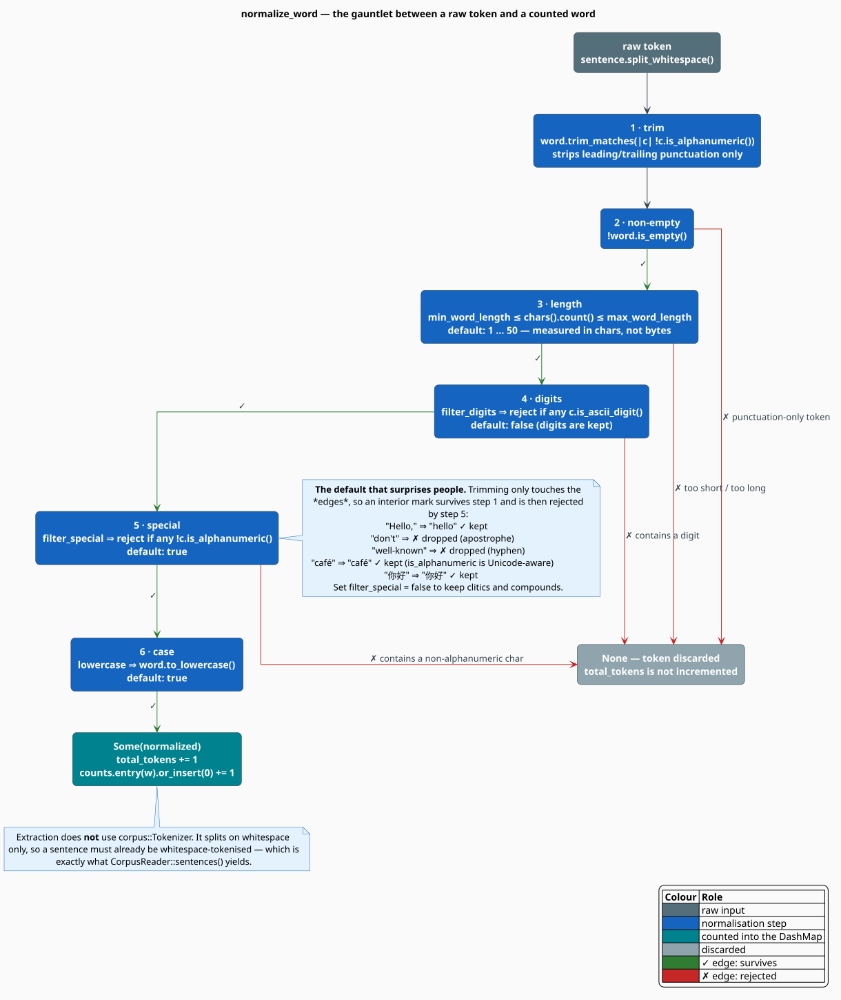
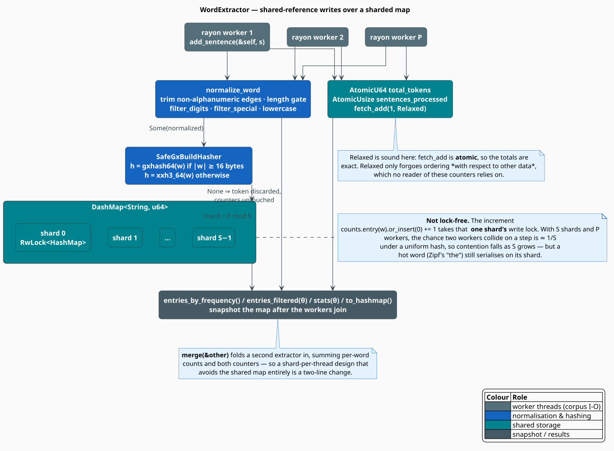

# Word Extraction

`WordExtractor` is the counting half of the dictionary module: it consumes sentences and produces a
frequency table. It is deliberately unglamorous — a sharded concurrent hash map, two atomic counters,
and a five-step normalisation gauntlet — but every one of those choices has a consequence you can
observe, and the default gauntlet in particular will silently drop words you probably wanted.

> **Scope.** Source of truth: [`src/dictionary/extractor.rs`](../../../src/dictionary/extractor.rs),
> with [`src/util/hash.rs`](../../../src/util/hash.rs) for the hasher and
> [`src/dictionary/types.rs`](../../../src/dictionary/types.rs) for `WordEntry` and
> `DictionaryStats`. What happens to the counts afterwards is [Building](building.md); the module
> map is the [Dictionary Overview](overview.md).

## Notation

| Symbol | Meaning |
|---|---|
| $`w`$ | a normalized word — a key of the frequency table |
| $`f(w)`$ | its frequency (number of accepted tokens of $`w`$) |
| $`N`$ | `total_tokens` — the number of tokens **accepted** by normalisation |
| $`\lvert V \rvert`$ | `unique_word_count()` — the number of distinct keys |
| $`\theta`$ | a frequency threshold supplied to `stats` or `entries_filtered` |
| $`P`$ | number of worker threads counting in parallel |
| $`S`$ | number of shards inside the `DashMap` |

## What counts as a word

Every token runs a six-step gauntlet before it is counted. The steps are cheap and ordered so that
the cheapest rejections come first.



```rust
pub struct ExtractionConfig {
    pub min_word_length: usize,  // default 1     — in CHARACTERS
    pub max_word_length: usize,  // default 50    — in CHARACTERS
    pub lowercase: bool,         // default true
    pub filter_digits: bool,     // default false — digits are KEPT by default
    pub filter_special: bool,    // default true  — non-alphanumerics are REJECTED by default
}
```

Extraction splits sentences with `str::split_whitespace` and **does not use** `corpus::Tokenizer`.
That is not an oversight: the sentences it is fed already come from `CorpusReader::sentences()`,
which has done the tokenising. Punctuation is dealt with by step 1 instead.

### The default that surprises everyone

Step 1 trims non-alphanumeric characters from the **edges** of the token. Step 5 then rejects the
token if *any* character that survived is non-alphanumeric. With `filter_special = true` — the
default — an *interior* apostrophe or hyphen is therefore fatal:

| Raw token | After step 1 | Verdict (default config) |
|---|---|---|
| `Hello,` | `Hello` | kept, counted as `hello` |
| `"world."` | `world` | kept |
| `don't` | `don't` | **rejected** — interior apostrophe |
| `well-known` | `well-known` | **rejected** — interior hyphen |
| `co-op's` | `co-op's` | **rejected** — both |
| `123` | `123` | kept (digits pass unless `filter_digits`) |
| `test1` | `test1` | kept |
| `café` | `café` | kept — `char::is_alphanumeric` is Unicode-aware |
| `你好` | `你好` | kept |
| `!@#$%` | *empty* | rejected at step 2 |

For English prose this quietly deletes every clitic and every compound. If your dictionary is meant
to spell-check real text, set `filter_special(false)`:

```rust
use libgrammstein::dictionary::{ExtractionConfig, WordExtractor};

let extractor = WordExtractor::with_config(ExtractionConfig {
    filter_special: false,   // keep "don't" and "well-known"
    filter_digits: true,     // but drop "123" and "test1"
    min_word_length: 2,
    ..Default::default()
});
```

Note also that the length bounds are **character** counts (`chars().count()`), unlike
`corpus::Tokenizer`, which measures bytes. A 3-character CJK word is 3 here and 9 there.

A rejected token is discarded *completely*: `total_tokens` is not incremented, so $`N`$ counts only
**accepted** tokens. This matters downstream, because $`N`$ is the denominator of every probability
the builder computes — see [Building](building.md#what-the-numbers-mean).

## Concurrency

`add_sentence` takes `&self`, not `&mut self`. All mutation goes through interior mutability, which
is what lets a `WordExtractor` be shared across a Rayon pool without a lock around the whole thing.



```rust
pub struct WordExtractor {
    counts: DashMap<String, u64, SafeGxBuildHasher>,
    config: ExtractionConfig,
    total_tokens: AtomicU64,
    sentences_processed: AtomicUsize,
}
```

Three separate mechanisms, each chosen for what it is good at:

**1. The counters are atomics, updated `Relaxed`.** `fetch_add` is atomic, so the totals are *exact*
regardless of thread count; `Relaxed` merely declines to order these updates against *other* memory,
and nothing in the crate reads a counter to infer anything about the map. That is the textbook
situation in which `Relaxed` is both sound and free.

**2. The map is sharded, not locked.** `DashMap` partitions the key space into $`S`$ independent
shards, each behind its own lock, with the shard chosen by the key's hash. The increment

```rust
*self.counts.entry(normalized).or_insert(0) += 1;
```

therefore takes **one shard's** write lock, not a global one. This is *not* lock-free — it is
lock-*sharded*. Under a uniform hash, the probability that two given workers touch the same shard at
the same step is

```math
\Pr[\text{collision}] \;=\; \frac{1}{S}
\qquad\text{and, for } P \text{ workers,}\qquad
\mathbb{E}[\text{contending pairs}] \;=\; \binom{P}{2}\frac{1}{S}
\tag{X1}
```

so contention falls linearly in $`S`$. But $`(\mathrm{X1})`$ assumes a uniform key distribution, and
word frequencies are anything but — Zipf's law (see [Overview](overview.md#why-frequency-and-why-a-threshold))
guarantees that a handful of function words (*the*, *of*, *and*) claim a large share of all
increments, and every one of those lands on the *same* shard. The hot-key shard is the real
serialisation point at high thread counts.

**3. `merge` gives you the escape hatch.** If shard contention dominates, give each worker its own
extractor and fold them together at the end. `merge(&other)` sums per-word counts and both counters,
and costs $`O(\lvert V_{\text{other}} \rvert)`$:

```rust
use libgrammstein::dictionary::WordExtractor;
use rayon::prelude::*;

let chunks: Vec<Vec<String>> = /* sentences, partitioned per worker */ vec![];

// Count into thread-private extractors: zero cross-thread contention.
let partials: Vec<WordExtractor> = chunks
    .par_iter()
    .map(|chunk| {
        let local = WordExtractor::new();
        for sentence in chunk {
            local.add_sentence(sentence);
        }
        local
    })
    .collect();

// Fold once, single-threaded.
let extractor = WordExtractor::new();
for partial in &partials {
    extractor.merge(partial);
}
```

The shared-map form is simpler and is what `add_sentences_parallel` does:

```rust
use libgrammstein::corpus::{CorpusReader, PlaintextReader};
use libgrammstein::dictionary::WordExtractor;
use rayon::prelude::*;

let reader = PlaintextReader::from_file("corpus.txt")?;
let sentences: Vec<String> = reader.sentences().collect();

let extractor = WordExtractor::new();
extractor.add_sentences_parallel(sentences.par_iter().map(String::as_str));
# Ok::<(), std::io::Error>(())
```

> Note the shape of that call: `add_sentences_parallel` takes a
> `ParallelIterator<Item = &str>`, which means the sentences must already be **materialised**. It
> trades the streaming memory profile ([Streaming](../corpus/streaming.md)) for parallel counting.
> On a corpus that does not fit in RAM, count into thread-private extractors from a
> `PrefetchingReader::batches()` loop instead, and `merge` at the end.

### Hashing

The map's hasher is `SafeGxBuildHasher`, which dispatches on key length:

```math
h(w) \;=\;
\begin{cases}
\texttt{gxhash64}(w) & \lvert w \rvert \geq 16 \text{ bytes} \\
\texttt{xxh3\_64}(w) & \text{otherwise}
\end{cases}
\tag{X2}
```

The split is a *safety* requirement, not a micro-optimisation: gxhash's AES/SIMD path reads 16-byte
lanes and would over-read a shorter buffer, so short keys — which, by Zipf, are also the most common
keys — are routed to XXH3. The crate's benchmarks put the hybrid at roughly 32 % faster than XXH3
alone on n-gram-shaped keys.

## Statistics

`stats(θ)` answers "what would a threshold of $`\theta`$ cost me?" *before* you commit to it:

```rust
pub struct DictionaryStats {
    pub total_words: usize,          // |V| — distinct keys
    pub words_kept: usize,           // |{ w : f(w) >= theta }|
    pub words_filtered: usize,       // the difference
    pub total_tokens: u64,           // N — accepted tokens
    pub sentences_processed: usize,
}
```

Its `Display` impl prints the keep rate directly. Because of Zipf's law the numbers are usually
startling: on ordinary English prose, moving $`\theta`$ from 1 to 2 typically halves `total_words`.

| Query | Returns | Cost |
|---|---|---|
| `get_frequency(w)` | $`f(w)`$, or `0` if absent | $`O(1)`$ expected |
| `unique_word_count()` | $`\lvert V \rvert`$ | $`O(1)`$ |
| `total_tokens()` | $`N`$ | $`O(1)`$ (one atomic load) |
| `sentences_processed()` | sentence count | $`O(1)`$ |
| `stats(θ)` | the table above | $`O(\lvert V \rvert)`$ |
| `entries_by_frequency()` | `Vec<WordEntry>`, sorted descending | $`O(\lvert V \rvert \log \lvert V \rvert)`$ |
| `entries_filtered(θ)` | `Vec<WordEntry>` with `log_prob` filled in | $`O(\lvert V \rvert)`$, unsorted |
| `to_hashmap()` | a plain `HashMap<String, u64>` | $`O(\lvert V \rvert)`$ |

`entries_filtered` is the one that computes probabilities, as the maximum-likelihood unigram estimate

```math
\log p(w) \;=\; \ln \frac{f(w)}{N}
\tag{X3}
```

with $`N`$ = `total_tokens()`, i.e. the *accepted* token count. When $`N = 0`$ it yields
$`-\infty`$ rather than a NaN.

## The algorithm, literately

```
function add_sentence(self, s):                     ▸ &self: safe to call from many threads
    sentences_processed.fetch_add(1, Relaxed)
    for raw in s.split_whitespace():                ▸ whitespace only; no Tokenizer
        add_word(self, raw)

function add_word(self, raw):
    w <- ⟨Normalize⟩
    if w is None: return                            ▸ discarded: N is NOT incremented
    total_tokens.fetch_add(1, Relaxed)
    counts.entry(w).or_insert(0) += 1               ▸ takes one shard's write lock

⟨Normalize⟩ ≡                                       ▸ normalize_word; the six steps, in order
    w <- raw.trim_matches(|c| not c.is_alphanumeric())   ▸ 1. edges only - interiors survive
    if w.is_empty():                    return None      ▸ 2. punctuation-only token
    n <- w.chars().count()                               ▸ 3. CHARACTERS, not bytes
    if n < min_word_length or n > max_word_length: return None
    if filter_digits and any c.is_ascii_digit():  return None   ▸ 4. off by default
    if filter_special and any not c.is_alphanumeric(): return None ▸ 5. ON by default: kills "don't"
    return Some(if lowercase { w.to_lowercase() } else { w })    ▸ 6. on by default

function merge(self, other):                        ▸ fold a thread-private extractor in
    for (w, f) in other.counts:  counts[w] += f     ▸ O(|V_other|)
    total_tokens        += other.total_tokens
    sentences_processed += other.sentences_processed
```

## Engineering

**The extractor has no persistence.** There is no `save`, no `load`, no checkpoint. It is a transient
counter; the durable artifact is the `SpellingDictionary` that `DictionaryBuilder` freezes out of it
([Building](building.md)). If you need to checkpoint a long extraction, snapshot `to_hashmap()` and
rebuild later with `DictionaryBuilder::build_from_counts`.

**`clear()` resets everything** — the map and both counters — so one extractor can be reused across
corpora without reallocating its shards.

**Memory.** Each entry costs a `String` (heap, $`\lvert w \rvert`$ bytes plus 24 for the header) and
a `u64`, inside `DashMap`'s per-shard tables. By Heaps' law (see
[Overview](overview.md#why-frequency-and-why-a-threshold)) $`\lvert V \rvert`$ keeps growing as
$`K N^{\beta}`$, so extraction memory grows sublinearly in corpus size but never stops growing — the
threshold is applied at *build* time, not at count time, so the extractor holds every hapax it ever
saw.

## Usage

The complete extraction step, end to end:

```rust
use libgrammstein::corpus::{CorpusReader, PlaintextReader};
use libgrammstein::dictionary::{DictionaryBuilder, ExtractionConfig, WordExtractor};

fn main() -> Result<(), Box<dyn std::error::Error>> {
    let reader = PlaintextReader::from_directory("corpus/")?;

    let extractor = WordExtractor::with_config(ExtractionConfig {
        min_word_length: 2,     // drop single letters
        max_word_length: 30,
        lowercase: true,
        filter_digits: true,    // no "2024", no "test1"
        filter_special: false,  // but DO keep "don't" and "well-known"
    });

    for sentence in reader.sentences() {
        extractor.add_sentence(&sentence);
    }

    // What would each threshold cost? (Zipf says: a lot of types, few tokens.)
    for theta in [1, 2, 5, 10] {
        let s = extractor.stats(theta);
        println!(
            "theta = {theta:>2}: {:>8} types kept of {:>8} ({:.1}%)",
            s.words_kept,
            s.total_words,
            100.0 * s.words_kept as f64 / s.total_words as f64
        );
    }

    let dictionary = DictionaryBuilder::new()
        .min_frequency(5)
        .build_from_extractor(&extractor)?;

    println!("{} words", dictionary.len());
    Ok(())
}
```

Inspecting the tail directly, without building anything:

```rust
use libgrammstein::dictionary::WordExtractor;

let extractor = WordExtractor::new();
extractor.add_sentence("the quick brown fox jumps over the lazy dog");
extractor.add_sentence("the fox is quick and brown");

// Sorted descending by frequency.
for entry in extractor.entries_by_frequency().iter().take(3) {
    println!("{:>8}  {}", entry.word, entry.frequency);   // the 3, quick 2, brown 2 ...
}

// Hapax legomena — the half of the vocabulary a threshold of 2 would delete.
let hapaxes = extractor
    .entries_by_frequency()
    .into_iter()
    .filter(|e| e.frequency == 1)
    .count();
println!("{hapaxes} hapax legomena of {} types", extractor.unique_word_count());
```

## References

1. M. E. J. Newman (2005). *Power laws, Pareto distributions and Zipf's law.* Contemporary Physics
   46(5), 323–351. [doi:10.1080/00107510500052444](https://doi.org/10.1080/00107510500052444)
2. L. Lü, Z.-K. Zhang & T. Zhou (2010). *Zipf's Law Leads to Heaps' Law: Analyzing Their Relation in
   Finite-Size Systems.* PLoS ONE 5(12), e14139.
   [doi:10.1371/journal.pone.0014139](https://doi.org/10.1371/journal.pone.0014139)
3. `dashmap` — the sharded concurrent map behind `WordExtractor::counts`.
   <https://docs.rs/dashmap>
4. `rayon` — the work-stealing pool used by `add_sentences_parallel`. <https://docs.rs/rayon>
5. XXH3 and gxhash — the two hash families behind $`(\mathrm{X2})`$.
   <https://github.com/Cyan4973/xxHash> and <https://github.com/ogxd/gxhash>

## See also

- [Building](building.md) — turning these counts into a `SpellingDictionary`
- [Dictionary Overview](overview.md) — Zipf, Heaps, coverage, and the two dictionary surfaces
- [Corpus Overview](../corpus/overview.md) — where the sentences come from
- [Streaming](../corpus/streaming.md) — counting without materialising the corpus
- [Threading Model](../../architecture/threading.md) — the crate's wider concurrency conventions
