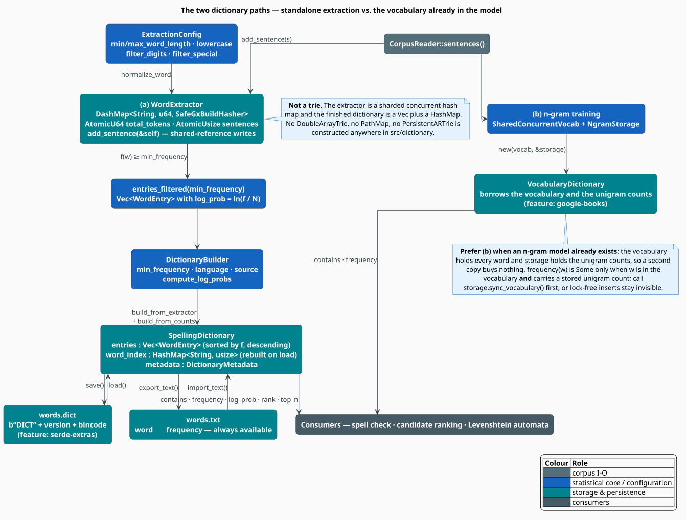
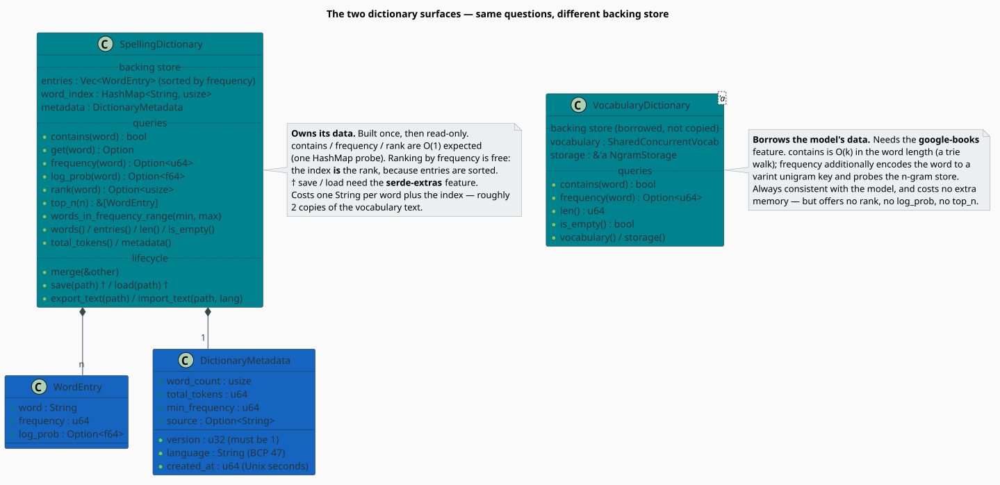

# Dictionary

A **dictionary**, in libgrammstein, answers two questions about a word: *does it exist?* and *how
often was it seen?* That is enough to power a spell checker's membership test, to rank the candidates
a Levenshtein automaton proposes, and to supply the unigram prior that a correction pipeline needs.

The module ships **two** dictionaries, because there are two situations. If you have nothing but a
corpus, `WordExtractor` counts words and `DictionaryBuilder` freezes the counts into a
`SpellingDictionary`. If you have already trained an n-gram model, its vocabulary *already is* a word
list and its unigram counts *already are* the frequencies — so `VocabularyDictionary` simply borrows
them and copies nothing.

> **Scope.** Source of truth: [`src/dictionary/`](../../../src/dictionary/) —
> [`extractor.rs`](../../../src/dictionary/extractor.rs),
> [`builder.rs`](../../../src/dictionary/builder.rs), [`types.rs`](../../../src/dictionary/types.rs)
> and [`vocabulary_backed.rs`](../../../src/dictionary/vocabulary_backed.rs). Counting is detailed in
> [Extraction](extraction.md); freezing and persistence in [Building](building.md).

## Notation

| Symbol | Meaning |
|---|---|
| $`V`$ | the vocabulary — the set of distinct words kept |
| $`\lvert V \rvert`$ | vocabulary size (number of *types*) |
| $`N`$ | total token count (number of word *occurrences*) |
| $`f(w)`$ | frequency of the word $`w`$ — how many tokens of it were seen |
| $`p(w)`$ | maximum-likelihood unigram probability of $`w`$ |
| $`\theta`$ | the frequency threshold, `min_frequency` |
| $`r`$ | frequency **rank** of a word: $`r = 0`$ is the most frequent |
| $`C(\theta)`$ | *token coverage* — the share of all tokens retained at threshold $`\theta`$ |
| $`s`$ | Zipf exponent |
| $`K, \beta`$ | Heaps' law constants |

**Terminology.** A *type* is a distinct word form; a *token* is one occurrence of it. "The cat sat on
the mat" has 6 tokens and 5 types. A **hapax legomenon** is a type with $`f(w) = 1`$.

## Two dictionaries, one job



The standalone path (a) is self-contained and portable: it produces an owned, serialisable artifact
that knows nothing about n-grams. The model-backed path (b) is free — it allocates nothing and can
never drift out of sync with the model it borrows from.



### Choosing between them

| | `SpellingDictionary` | `VocabularyDictionary<'a>` |
|---|---|---|
| Feature gate | none (`save`/`load` need `serde-extras`) | `google-books` |
| Backing store | `Vec<WordEntry>` + `HashMap<String, usize>` | a borrowed vocabulary trie + the n-gram store |
| Extra memory | ≈ two copies of the vocabulary text | **zero** |
| `contains` | $`O(1)`$ expected (one hash probe) | $`O(k)`$ in the word length (a trie walk) |
| `frequency` | $`O(1)`$ expected | $`O(k)`$ + one varint-key store probe |
| `rank`, `log_prob`, `top_n` | yes | **no** |
| Persistence | `.dict` (bincode) and `.txt` (TSV) | inherits the model's own persistence |
| Stays in sync with the model | no — it is a snapshot | **yes**, by construction |

> **Prefer `VocabularyDictionary` whenever an n-gram model already exists.** A second copy of the
> vocabulary buys nothing but drift. Reach for `SpellingDictionary` when you want a *standalone*
> artifact — a shippable word list, a frequency-ranked lexicon, or something to hand to a tool that
> has never heard of libgrammstein.

Two facts about `VocabularyDictionary` that its tests pin down explicitly:

1. **`frequency(w)` requires both memberships.** It is `Some(f)` only if $`w`$ is in the vocabulary
   **and** carries a stored unigram count. A word inserted into the vocabulary but never counted
   yields `contains(w) == true` and `frequency(w) == None`.
2. **Call `storage.sync_vocabulary()` first.** Words added through the lock-free vocabulary path are
   invisible to lookups until they are merged into the persistent layer.

## Why frequency, and why a threshold

A dictionary is not a set — it is a *distribution*, and two empirical laws explain why every knob in
this module is about frequency.

**Zipf's law** [[1]](#references): sort the types by descending frequency and the $`r`$-th most
frequent has

```math
f(r) \;\approx\; \frac{C}{(r+1)^{s}}, \qquad s \approx 1 \ \text{for natural language}
\tag{Z1}
```

Two consequences follow immediately. The head is tiny and carries everything: a few hundred types
account for roughly half of all tokens. And the tail is enormous and carries almost nothing: with
$`s \approx 1`$, about half of all *types* are hapax legomena — words seen exactly once. Those
singletons are overwhelmingly typos, OCR debris, and scanning artefacts, which is precisely what a
*spelling* dictionary must not contain.

**Heaps' law** [[2]](#references) says the vocabulary never stops growing:

```math
\lvert V \rvert \;\approx\; K \, N^{\beta}, \qquad \beta \approx 0.4 \ \text{–} \ 0.6
\tag{Z2}
```

so doubling the corpus does *not* double the vocabulary — but it never converges either. You cannot
wait for the tail to settle; you must cut it. (The two laws are not independent: $`(\mathrm{Z2})`$ is
derivable from $`(\mathrm{Z1})`$ in finite systems [[2]](#references).)

**Coverage** is what you actually trade away when you cut. Define the token coverage of the retained
vocabulary at threshold $`\theta`$:

```math
C(\theta) \;=\; \frac{\displaystyle\sum_{w \,:\, f(w) \geq \theta} f(w)}{N}
\;=\; 1 \;-\; \underbrace{\frac{\displaystyle\sum_{w \,:\, f(w) < \theta} f(w)}{N}}_{\text{the OOV mass}}
\tag{Z3}
```

Under $`(\mathrm{Z1})`$ this is the crate's central bargain: raising $`\theta`$ from 1 to 2 deletes
roughly *half the types* while surrendering only the sliver of $`C`$ that the hapaxes contribute.
That is a spectacular exchange rate, and it is why `min_frequency` exists. Measure it, though — do
not assume it; `WordExtractor::stats(θ)` reports the exact type counts for your corpus, and
$`(\mathrm{Z3})`$ turns them into a coverage number.

## The algorithm, literately

End to end, from corpus to answered query. `⟨…⟩` names a refinement expanded below.

```
function build_dictionary(reader, config, theta):
    extractor <- WordExtractor::with_config(config)      ▸ a sharded concurrent counter
    for s in reader.sentences():
        extractor.add_sentence(&s)                      ▸ ⟨Count one sentence⟩   (&self: no mut)
    return DictionaryBuilder::new()
              .min_frequency(theta)
              .build_from_extractor(&extractor)         ▸ ⟨Freeze⟩

⟨Count one sentence⟩ ≡                                  ▸ WordExtractor::add_sentence
    sentences_processed += 1
    for raw in s.split_whitespace():                    ▸ NOT corpus::Tokenizer - whitespace only
        w <- normalize_word(raw)                        ▸ trim, length, digits, special, case
        if w is None: continue                          ▸ the token is discarded entirely
        total_tokens += 1                               ▸ so N counts only ACCEPTED tokens
        counts[w] += 1                                  ▸ one shard's write lock

⟨Freeze⟩ ≡                                              ▸ DictionaryBuilder::build_from_extractor
    N       <- extractor.total_tokens()
    entries <- [ WordEntry { w, f(w), log_prob: ln(f(w) / N) }  for w with f(w) >= theta ]
    sort entries by f descending                        ▸ O(|V| log |V|); makes rank() free
    index   <- { entries[i].word -> i }                 ▸ HashMap: O(1) expected lookup
    return SpellingDictionary { metadata, entries, index }

⟨Answer a query⟩ ≡
    contains(w)  -> index.contains_key(w)               ▸ O(1) expected
    frequency(w) -> entries[index[w]].frequency
    rank(w)      -> index[w]                            ▸ 0 = most frequent: the Zipf rank, free
    log_prob(w)  -> entries[index[w]].log_prob          ▸ ln p(w); see Building for the caveat
```

## Engineering

### Feature gates

| Item | Gate | Consequence if absent |
|---|---|---|
| `SpellingDictionary::save` / `::load` | `serde-extras` | build in memory, or use `export_text` / `import_text` (always available) |
| `VocabularyDictionary` | `google-books` | not exported at all |

### The error type is internal

`DictionaryBuilder` and `SpellingDictionary` return `Result<T, DictionaryError>` where
`DictionaryError` is `Io`, `Serialization` or `InvalidFormat` — but the enum is **not re-exported**
from `libgrammstein::dictionary`, so downstream code cannot name it. In practice you propagate it
through `Box<dyn std::error::Error>` (it implements `std::error::Error`), which is what the examples
below do.

### There is no CLI for this module

`grammstein` has `corpus`, `train`, `eval`, `query`, `models`, `convert` and `repl` subcommands —
there is **no** `grammstein dictionary`. Extraction and building are a library API; the snippets in
this document are the interface.

## Usage

Building a standalone dictionary from a corpus:

```rust
use libgrammstein::corpus::{CorpusReader, PlaintextReader};
use libgrammstein::dictionary::{DictionaryBuilder, WordExtractor};

fn main() -> Result<(), Box<dyn std::error::Error>> {
    let reader = PlaintextReader::from_directory("corpus/")?;

    // Note: add_sentence takes &self — the extractor is a concurrent counter.
    let extractor = WordExtractor::new();
    for sentence in reader.sentences() {
        extractor.add_sentence(&sentence);
    }

    // (Z3): report what a threshold of 5 would actually cost.
    print!("{}", extractor.stats(5));

    let dictionary = DictionaryBuilder::new()
        .min_frequency(5)
        .language("en")
        .source("my corpus, 2026-07")
        .build_from_extractor(&extractor)?;

    println!("{} types, {} tokens", dictionary.len(), dictionary.total_tokens());
    dictionary.export_text("words.txt")?;   // always available; TSV
    Ok(())
}
```

Using it: membership, ranking, and the head of the distribution.

```rust
use libgrammstein::dictionary::SpellingDictionary;

fn rank_candidates(dict: &SpellingDictionary, candidates: &[String]) -> Vec<String> {
    let mut scored: Vec<_> = candidates
        .iter()
        .filter(|w| dict.contains(w))                       // only real words
        .map(|w| (w.clone(), dict.frequency(w).unwrap_or(0)))
        .collect();

    scored.sort_by(|a, b| b.1.cmp(&a.1));                   // most frequent first
    scored.into_iter().map(|(w, _)| w).collect()
}

fn report(dict: &SpellingDictionary) {
    for entry in dict.top_n(10) {                           // the Zipf head, already sorted
        println!("{:>10}  f = {:>9}  rank = {}", entry.word, entry.frequency,
                 dict.rank(&entry.word).expect("entry is in the index"));
    }
}
```

Borrowing the vocabulary of an existing n-gram model instead (feature `google-books`):

```rust
use libgrammstein::dictionary::VocabularyDictionary;
use libgrammstein::ngram::vocabulary::open_or_create_concurrent_vocabulary_lockfree;
use libgrammstein::sources::google_books::NgramStorage;

fn main() -> Result<(), Box<dyn std::error::Error>> {
    let vocabulary = open_or_create_concurrent_vocabulary_lockfree("vocab.artrie")?;
    let storage = NgramStorage::create_single_trie_with_vocabulary(
        "ngrams.artrie",
        Some(vocabulary.clone()),
    )?;

    // Lock-free vocabulary inserts are invisible to lookups until they are merged.
    storage.sync_vocabulary()?;

    let dict = VocabularyDictionary::new(vocabulary, &storage);

    if dict.contains("hello") {
        // None if the word is known but carries no unigram count.
        println!("hello: {:?}", dict.frequency("hello"));
    }
    println!("{} words in the vocabulary", dict.len());
    Ok(())
}
```

## References

1. M. E. J. Newman (2005). *Power laws, Pareto distributions and Zipf's law.* Contemporary Physics
   46(5), 323–351. [doi:10.1080/00107510500052444](https://doi.org/10.1080/00107510500052444)
2. L. Lü, Z.-K. Zhang & T. Zhou (2010). *Zipf's Law Leads to Heaps' Law: Analyzing Their Relation in
   Finite-Size Systems.* PLoS ONE 5(12), e14139.
   [doi:10.1371/journal.pone.0014139](https://doi.org/10.1371/journal.pone.0014139)
3. C. D. Manning, P. Raghavan & H. Schütze (2008). *Introduction to Information Retrieval.*
   Cambridge University Press.
   [doi:10.1017/CBO9780511809071](https://doi.org/10.1017/CBO9780511809071) — chapter 5 covers
   Zipf, Heaps and vocabulary growth.
4. S. F. Chen & J. Goodman (1999). *An empirical study of smoothing techniques for language
   modeling.* Computer Speech & Language 13(4), 359–393.
   [doi:10.1006/csla.1999.0128](https://doi.org/10.1006/csla.1999.0128) — the count-cutoff analysis
   that motivates `min_frequency`.

## See also

- [Extraction](extraction.md) — how words are counted, and what counts as a word
- [Building](building.md) — thresholding, ranking, merging and persistence
- [Corpus Overview](../corpus/overview.md) — where `sentences()` comes from
- [N-gram Overview](../ngram/overview.md) — the model whose vocabulary path (b) borrows
- [Backend Selection](../../integration/liblevenshtein/backend-selection.md) — choosing a trie for
  fuzzy search over a word list
- [Spell Correction](../../examples/spell-correction.md) — a dictionary in an end-to-end corrector
