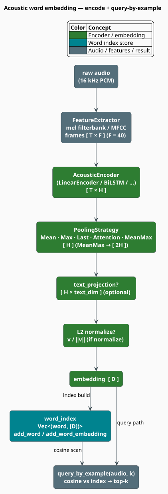

# Acoustic Word Embeddings

A spoken word is a *variable-length* object: the same word, said twice, yields two frame sequences of
different lengths. Comparing two such sequences directly means dynamic time warping — quadratic in
their lengths, and hopeless at scale. An **acoustic word embedding** (AWE) instead projects a whole
audio segment, however long, onto a **single fixed-dimensional vector**, so that two utterances of
the same word land near one another and comparison collapses to one dot product
[[3]](#references)[[4]](#references). This document explains the projection, the MFCC features that
feed it, and the query-by-example index built on top.

> **Scope.** Source of truth: [`src/embedding/acoustic.rs`](../../../src/embedding/acoustic.rs) for
> the embedding, and [`src/acoustic/features.rs`](../../../src/acoustic/features.rs) for the
> feature front-end.
>
> **Feature gating — read this carefully.** The two halves are gated differently:
>
> | Item | Path | Gate |
> |---|---|---|
> | `AcousticWordEmbedding`, `AcousticEncoder`, `PoolingStrategy` | `libgrammstein::embedding` | **none** — always compiled |
> | `FeatureExtractor`, `FeatureConfig`, `MelFilterbank` | `libgrammstein::acoustic` | **`--features acoustic`** (pulls in `rustfft` + `realfft`) |
>
> The embedding consumes frames as a plain `&[Vec<f32>]`; it never touches an FFT. So the embedding
> type is available in a default build, but *producing* MFCC frames with libgrammstein requires the
> `acoustic` feature. You may of course supply frames from any other source.

## Notation

Every symbol is defined before it is used in a formula.

| Symbol | Meaning |
|---|---|
| $`x[t]`$ | the raw audio sample at index $`t`$ |
| $`T`$ | the number of frames in a segment (**variable** — this is the whole problem) |
| $`F`$ | the input feature dimension per frame (`feature_dim`; default $`40`$) |
| $`H`$ | the encoder's hidden dimension (`hidden_dim`) |
| $`D`$ | the final embedding dimension (`embedding_dim`; default $`128`$) |
| $`X`$ | the frame matrix, shape $`T \times F`$ |
| $`Z`$ | the encoded frames, shape $`T \times H`$; $`z_t`$ is its $`t`$-th row |
| $`v`$ | the pooled, fixed-length vector |
| $`W, b`$ | the encoder's weight matrix and bias |
| $`P`$ | the optional text-projection matrix, shape $`H \times D_{\text{text}}`$ |
| $`\cos(a,b)`$ | cosine similarity, $`\in [-1, 1]`$ |
| $`f`$ | a frequency in hertz |
| $`M`$ | the number of mel filterbank channels (`num_mels`; default $`40`$) |
| $`K`$ | the number of MFCC coefficients kept (`num_mfcc`; default $`13`$) |
| $`S[k]`$ | the power spectrum at FFT bin $`k`$ |
| $`N`$ | the number of words in the query index |

**Acronyms.** *AWE* — Acoustic Word Embedding; *MFCC* — Mel-Frequency Cepstral Coefficients;
*DTW* — Dynamic Time Warping; *DCT* — Discrete Cosine Transform; *FFT* — Fast Fourier Transform;
*ASR* — Automatic Speech Recognition; *PCM* — Pulse-Code Modulation.

## The problem AWE solves: escaping DTW

Take two recordings of the same word, of $`T_1`$ and $`T_2`$ frames. The classical way to compare
them is **dynamic time warping** [[5]](#references), which finds the cheapest monotonic alignment
between the two frame sequences by filling a $`T_1 \times T_2`$ cost table:

```math
\mathrm{DTW}(i, j) = \delta(x_i, y_j) + \min\bigl\{\mathrm{DTW}(i-1, j),\ \mathrm{DTW}(i, j-1),\ \mathrm{DTW}(i-1, j-1)\bigr\} \tag{A1}
```

$`(\mathrm{A1})`$ is accurate and it is a dead end. One comparison costs $`O(T_1 T_2)`$, so searching
a spoken query against an index of $`N`$ words costs $`O(N\,T^2)`$ — and DTW yields no vector, so
none of the usual indexing tricks apply. **libgrammstein does not implement DTW.** It is described
here only as the baseline that acoustic word embeddings exist to escape.

An AWE replaces the alignment with a *learned projection*: embed once, compare with a dot product.

```math
\mathbb{R}^{T \times F} \;\xrightarrow{\ \text{encode}\ }\; \mathbb{R}^{D}, \qquad
\text{compare in } O(D) \text{ instead of } O(T_1 T_2) \tag{A2}
```

| | DTW | AWE |
|---|---|---|
| One comparison | $`O(T_1 T_2)`$ | $`O(D)`$ |
| Search over $`N`$ words | $`O(N\,T^2)`$ | $`O(N\,D)`$ after a single $`O(T\,F\,H)`$ encode |
| Produces a vector? | no | **yes** — indexable, clusterable, projectable |
| Cross-modal alignment | impossible | possible (share a space with text — see below) |

The vector is the point. Once a word is a point in $`\mathbb{R}^{D}`$, everything the rest of
libgrammstein does with vectors becomes available to audio.

## Stage 1 — from waveform to frames (MFCC)

The encoder does not consume audio; it consumes **frames of spectral features**. Producing them is
the job of [`FeatureExtractor`](../../../src/acoustic/features.rs) (feature `acoustic`), which
implements the standard MFCC pipeline of Davis & Mermelstein [[1]](#references).

### Pre-emphasis

A first-order high-pass filter that boosts the high frequencies attenuated by the physics of speech
production (roughly $`-6`$ dB/octave from the glottal source and lip radiation):

```math
x'[t] = x[t] - \alpha\,x[t-1], \qquad \alpha = 0.97 \tag{A3}
```

### Framing and windowing

Speech is non-stationary over a sentence but approximately stationary over a few tens of
milliseconds, so the signal is cut into short overlapping frames — $`25`$ ms long, advancing every
$`10`$ ms. At the $`16`$ kHz default that is `frame_size = 400` samples advancing by
`frame_shift = 160`, so the number of frames is

```math
T = \left\lfloor \frac{\lvert x \rvert - \texttt{frame_size}}{\texttt{frame_shift}} \right\rfloor + 1 \tag{A4}
```

Each frame is multiplied by a window (Hann by default) to taper its edges to zero, which suppresses
the spectral leakage that a rectangular cut would introduce.

### Power spectrum and the mel filterbank

Each windowed frame is transformed by a real FFT into a power spectrum $`S[k]`$. Human pitch
perception is roughly logarithmic — we resolve 100 Hz of detail far better at 500 Hz than at 5 kHz —
so the spectrum is warped onto the **mel scale** [[2]](#references):

```math
\mathrm{mel}(f) = 2595 \cdot \log_{10}\!\left(1 + \frac{f}{700}\right),
\qquad
\mathrm{mel}^{-1}(m) = 700\left(10^{\,m/2595} - 1\right) \tag{A5}
```

$`M`$ triangular filters are spaced **equally in mel space** (hence tightly at low frequencies and
widely at high ones) between `low_freq` and `high_freq`, and each filter integrates the power beneath
it. A small $`\varepsilon = 10^{-10}`$ guards the logarithm that follows:

```math
E_m = \sum_{k} H_m[k]\, S[k], \qquad
\tilde{E}_m = \log\bigl(E_m + \varepsilon\bigr), \qquad m = 1 \dots M \tag{A6}
```

$`\tilde{E}`$ — the **log-mel filterbank** — is the $`40`$-dimensional feature vector modern neural
acoustic models prefer, and `extract_filterbank` stops here.

### The cepstrum (MFCC proper)

Adjacent mel channels are strongly correlated. A **DCT-II** decorrelates them and compacts the energy
into the first few coefficients, of which $`K = 13`$ are kept:

```math
c_k = \sqrt{\frac{2}{M}} \sum_{m=1}^{M} \tilde{E}_m \cos\!\left(\frac{\pi k \left(m - \tfrac{1}{2}\right)}{M}\right),
\qquad k = 1 \dots K-1 \tag{A7}
```

with the orthonormal $`k = 0`$ term scaled by $`\sqrt{1/M}`$ instead. This is `extract_mfcc`.

### Deltas

Static coefficients say nothing about *motion*, and speech is motion. Optional delta (velocity) and
delta-delta (acceleration) features are appended by regression over a $`\pm W`$-frame window
(`delta_window`, default $`2`$):

```math
d_t = \frac{\displaystyle\sum_{\eta=1}^{W} \eta\,\bigl(c_{t+\eta} - c_{t-\eta}\bigr)}{2\displaystyle\sum_{\eta=1}^{W} \eta^{2}} \tag{A8}
```

Each enabled tier multiplies the feature dimension: `feature_dim()` returns $`M`$, $`2M`$, or $`3M`$.

### Front-end defaults

| Parameter | Default | Meaning |
|---|---|---|
| `sample_rate` | $`16\,000`$ Hz | wideband speech |
| `frame_size` | $`400`$ ($`25`$ ms) | analysis window |
| `frame_shift` | $`160`$ ($`10`$ ms) | hop |
| `fft_size` | $`512`$ | `frame_size.next_power_of_two()` |
| `num_mels` | $`40`$ | $`M`$ — filterbank channels |
| `num_mfcc` | $`13`$ | $`K`$ — cepstral coefficients |
| `pre_emphasis` | $`0.97`$ | $`\alpha`$ in $`(\mathrm{A3})`$ |
| `low_freq` / `high_freq` | $`20`$ / $`8000`$ Hz | filterbank band (Nyquist at 16 kHz) |
| `window_type` | `Hanning` | taper |
| `normalize_mean` | `true` | per-utterance mean subtraction |

Presets: `FeatureConfig::default()` / `wideband()` (16 kHz), `telephony()` (8 kHz), `music()`
(44.1 kHz, 80 mels).

## Stage 2 — from frames to a vector



### Encode

```math
Z = \mathrm{encode\_frames}(X) \in \mathbb{R}^{T \times H}, \qquad X \in \mathbb{R}^{T \times F} \tag{A9}
```

The encoder is the [`AcousticEncoder`](../../../src/embedding/acoustic.rs) trait — three methods
(`encode_frames`, `hidden_dim`, `feature_dim`), `Send + Sync`, so a BiLSTM or Transformer can be
dropped in behind it. The shipped implementation is [`LinearEncoder`](../../../src/embedding/acoustic.rs),
a single Xavier-initialized affine map applied per frame:

```math
z_t = x_t W + b, \qquad W \in \mathbb{R}^{F \times H},\ b \in \mathbb{R}^{H} \tag{A10}
```

`LinearEncoder` is a **baseline**, not a trained model: it is randomly initialized and there is no
training loop in this module. It preserves distances well enough to exercise the pipeline and to
serve as a control; a real system supplies a trained encoder through the trait.

### Pool

Pooling is the step that actually discharges the variable length — it collapses $`T`$ rows into one:

```math
\text{Mean: } v = \frac{1}{T}\sum_{t=1}^{T} z_t
\qquad
\text{Max: } v_j = \max_{1 \le t \le T} z_{t,j}
\qquad
\text{Last: } v = z_T \tag{A11}
```

| Strategy | Behavior | Notes |
|---|---|---|
| `Mean` | average over frames | **the default**; robust, order-insensitive |
| `Max` | per-dimension maximum | keeps the strongest activation per feature |
| `Last` | final frame only | intended for recurrent encoders that accumulate state |
| `Attention` | *currently uniform weights* | **identical to `Mean` as shipped** — the learned query weighting is absent |
| `MeanMax` | concatenation of mean and max | **doubles the width to $`2H`$** — see the caveat |

> **Two honest caveats about the shipped pooling.**
>
> 1. **`Attention` is `Mean`.** The variant exists and is selectable, but `apply_pooling` computes a
>    uniform average for it. Choosing it today changes nothing: the learned attention query is not
>    yet implemented, so the variant is reserved for that future weighting.
> 2. **`MeanMax` breaks the dimension contract.** It emits $`2H`$ values, but `embedding_dim()`
>    reports $`H`$ (it reads `text_projection_dim` or `encoder.hidden_dim()`, neither of which knows
>    about the concatenation). Two consequences follow: `encode` returns a vector *longer* than
>    `embedding_dim()` claims, and combining `MeanMax` with `text_projection_dim` is **invalid** —
>    $`(\mathrm{A12})`$ would multiply a $`2H`$ vector by an $`H \times D_{\text{text}}`$ matrix and
>    panic on the shape mismatch. Use `MeanMax` only without a text projection, and size your
>    consumers off the returned vector rather than off `embedding_dim()`.

### Project and normalize

Two optional final steps. The projection maps the pooled vector into a **shared space with text
embeddings**, which is what makes cross-modal retrieval possible — spoken *"hello"* and written
*"hello"* become comparable by cosine:

```math
v' = v P, \qquad P \in \mathbb{R}^{H \times D_{\text{text}}} \quad\text{(if \texttt{text_projection_dim} is set)} \tag{A12}
```

```math
\hat{v} = \frac{v'}{\lVert v' \rVert}, \qquad \text{if } \lVert v' \rVert > 10^{-8} \quad\text{(if \texttt{normalize})} \tag{A13}
```

L2 normalization (`normalize`, default `true`) puts every embedding on the unit sphere, where cosine
similarity reduces to a plain dot product. The $`10^{-8}`$ guard leaves a degenerate zero vector
alone rather than dividing by zero. An **empty** frame slice short-circuits to
$`\mathbf{0} \in \mathbb{R}^{D}`$.

## Query by example

Embed the query audio, then scan the index and rank by cosine:

```math
\mathrm{sim}(q, w_i) = \cos\bigl(\hat{v}_q,\ \hat{v}_{w_i}\bigr) = \frac{\hat{v}_q \cdot \hat{v}_{w_i}}{\lVert \hat{v}_q \rVert\, \lVert \hat{v}_{w_i} \rVert} \tag{A14}
```

returning the top $`k`$. The index is a flat `Vec<(String, Array1<f32>)>` plus a `HashMap` cache, so
the scan is **exhaustive** and exact:

| Method | Cost | Notes |
|---|---|---|
| `encode(frames)` | $`O(T\,F\,H)`$ | the encoder dominates |
| `add_word(word, frames)` | $`O(T\,F\,H)`$ | encodes, then appends to index and cache |
| `query_by_example(audio, k)` | $`O(T\,F\,H + N\,D + N \log N)`$ | encode, scan, sort |
| `query_by_embedding(v, k)` | $`O(N\,D + N \log N)`$ | skip the encode when you already have a vector |
| `all_pairwise_similarities()` | $`O(N^{2} D)`$ | full $`N \times N`$ matrix — small indices only |

$`O(N D)`$ is linear, not sublinear: there is no ANN structure here. For large $`N`$, embed with this
module and index elsewhere (see [RAG / HNSW](../rag/backend.md)). `compute_stats()` likewise computes
its average pairwise similarity **only** when $`N \le 1000`$, reporting $`0.0`$ above that rather
than paying $`O(N^2 D)`$.

## The algorithm, literately

The following mirrors [`AcousticWordEmbedding::encode`](../../../src/embedding/acoustic.rs). `⟨…⟩`
names a refinement expanded below; `▸` marks a side-comment. All operators are ASCII.

```
function encode(frames):                             ▸ frames: [T][F]; returns Vec<f32>
    if frames is empty: return zeros(embedding_dim())    ▸ degenerate input
    Z <- encoder.encode_frames(frames)               ▸ (A9); [T][H]
    v <- ⟨pool Z⟩                                    ▸ (A11); [H], or [2H] for MeanMax
    if text_projection is Some(P):
        v <- v . P                                   ▸ (A12); PANICS if pooling was MeanMax
    if config.normalize:
        n <- sqrt(v . v)
        if n > 1e-8: v <- v / n                      ▸ (A13); leave a zero vector alone
    return v

⟨pool Z⟩ ≡                                           ▸ the variable length dies here
    match config.pooling:
        Mean      -> sum(Z, axis=frames) / T
        Max       -> elementwise max over frames
        Last      -> Z[T-1]
        Attention -> sum(Z, axis=frames) / T         ▸ uniform weights — same as Mean, as shipped
        MeanMax   -> concat( mean(Z), max(Z) )       ▸ width 2H — see the caveat above
```

## Usage

```rust
use libgrammstein::embedding::{AcousticEmbeddingConfig, AcousticWordEmbedding, PoolingStrategy};

// The constructor takes a CONFIG, not a bare dimension.
let config = AcousticEmbeddingConfig {
    embedding_dim: 128,
    feature_dim: 40,                 // must match the front-end's num_mels
    pooling: PoolingStrategy::Mean,
    normalize: true,
    text_projection_dim: None,       // Some(d) to share a space with text embeddings
};
let mut awe = AcousticWordEmbedding::new(config);

// Frames are [T][F] — from FeatureExtractor, or from anywhere else.
let frames: Vec<Vec<f32>> = vec![vec![0.1; 40]; 100];   // 100 frames of 40-dim features
let embedding: Vec<f32> = awe.encode(&frames);
assert_eq!(embedding.len(), 128);

// Build a query index, then search it.
awe.add_word("hello", &frames);
awe.add_word("world", &vec![vec![0.7; 40]; 80]);        // a different length — that is the point

let hits: Vec<(String, f64)> = awe.query_by_example(&frames, 5);
println!("index={} best={:?}", awe.index_size(), hits.first());

// Direct pairwise comparison of two segments.
let sim = awe.audio_similarity(&frames, &vec![vec![0.1; 40]; 120]);
println!("similarity = {sim:.3}");
```

Producing the frames with libgrammstein's own front-end requires the `acoustic` feature:

```rust
// Cargo.toml: libgrammstein = { version = "0.2", features = ["acoustic"] }
use libgrammstein::acoustic::{FeatureConfig, FeatureExtractor};

let extractor = FeatureExtractor::new(FeatureConfig::default());  // 16 kHz, 40 mels
let audio: Vec<f32> = load_pcm("speech.wav");                     // mono, f32, 16 kHz

let filterbank: Vec<Vec<f32>> = extractor.extract_filterbank(&audio);  // [T][40] — feed the AWE
let mfcc: Vec<Vec<f32>> = extractor.extract_mfcc(&audio);              // [T][13]

println!("{} frames of {} dims", filterbank.len(), filterbank[0].len());
```

`StreamingFeatureExtractor` offers the same extraction incrementally (`add_samples`,
`extract_filterbank`, `flush_filterbank`) for real-time capture — see
[Acoustic Features](../acoustic/features.md).

## Choosing a configuration

| Goal | Setting |
|---|---|
| General query-by-example | `Mean` pooling, `normalize: true`, $`D = 128`$ |
| Encoder is recurrent and accumulates state | `Last` pooling |
| Emphasize salient frames over the average | `Max` pooling |
| Richer summary, no text projection | `MeanMax` (mind the $`2H`$ width) |
| Cross-modal audio/text retrieval | set `text_projection_dim` to the text $`d`$ |
| Telephony audio | `FeatureConfig::telephony()` and `feature_dim: 40` |

## References

1. S. B. Davis & P. Mermelstein (1980). *Comparison of parametric representations for monosyllabic
   word recognition in continuously spoken sentences.* IEEE Transactions on Acoustics, Speech, and
   Signal Processing 28(4), 357–366.
   [doi:10.1109/TASSP.1980.1163420](https://doi.org/10.1109/TASSP.1980.1163420)
2. S. S. Stevens, J. Volkmann & E. B. Newman (1937). *A scale for the measurement of the
   psychological magnitude pitch.* Journal of the Acoustical Society of America 8(3), 185–190.
   [doi:10.1121/1.1915893](https://doi.org/10.1121/1.1915893)
3. K. Levin, K. Henry, A. Jansen & K. Livescu (2013). *Fixed-dimensional acoustic embeddings of
   variable-length segments in low-resource settings.* ASRU 2013, 410–415.
   [doi:10.1109/ASRU.2013.6707765](https://doi.org/10.1109/ASRU.2013.6707765)
4. H. Kamper, W. Wang & K. Livescu (2016). *Deep convolutional acoustic word embeddings using
   word-pair side information.* ICASSP 2016, 4950–4954.
   [doi:10.1109/ICASSP.2016.7472619](https://doi.org/10.1109/ICASSP.2016.7472619)
5. H. Sakoe & S. Chiba (1978). *Dynamic programming algorithm optimization for spoken word
   recognition.* IEEE Transactions on Acoustics, Speech, and Signal Processing 26(1), 43–49.
   [doi:10.1109/TASSP.1978.1163055](https://doi.org/10.1109/TASSP.1978.1163055)

## See also

- [Acoustic Features](../acoustic/features.md) — the MFCC front-end in full (feature `acoustic`)
- [Acoustic Models](../acoustic/models.md) — neural acoustic models over the same frames
- [Subword Embeddings](overview.md) — the text-side embedding a projection can align with
- [Phonetic Embeddings](phonetic.md) — sound-aware similarity from *spelling*, no audio required
- [RAG Backend](../rag/backend.md) — approximate nearest neighbours when $`O(N\,D)`$ stops scaling
