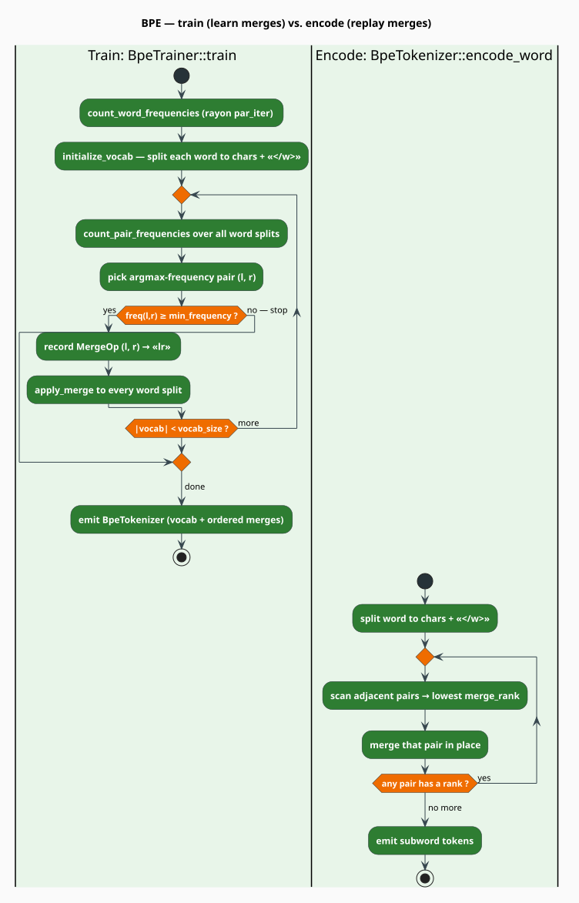

# BPE & Subword Extraction

The [`src/embedding/bpe.rs`](../../../src/embedding/bpe.rs) module carries **two distinct
subword mechanisms**, and it is important not to conflate them:

1. **Byte-Pair Encoding (BPE)** — `BpeTrainer` / `BpeTokenizer` / `MergeOp`. A *learned*
   segmenter that greedily merges the most frequent adjacent symbol pairs into a compact subword
   vocabulary [[3]](#references). It is **optional**, attached to a model via `with_tokenizer`.
2. **Character n-gram subwords** — `extract_subwords` / `hash_subword`. The *fixed*, unlearned
   decomposition that the FastText-style [`SubwordEmbedding`](overview.md) actually uses on every
   `word_vector` call and every training update.

This document specifies both, the mathematics of the BPE merge objective, and the exact hashing
and extraction the embedding model relies on.

> **Scope.** Source of truth: [`src/embedding/bpe.rs`](../../../src/embedding/bpe.rs). The consumer
> of `extract_subwords`/`hash_subword` is [`src/embedding/model.rs`](../../../src/embedding/model.rs)
> (see [Subword Embeddings](overview.md)); the trainer that also updates subword rows is
> [`src/embedding/trainer.rs`](../../../src/embedding/trainer.rs) (see [Skip-gram](skip-gram.md)).

## Notation

| Symbol | Meaning |
|---|---|
| $`\Sigma`$ | the alphabet of base symbols (characters, plus the end-of-word marker) |
| $`c(p)`$ | the corpus frequency of adjacent symbol pair $`p = (\ell, r)`$ |
| $`V_t`$ | the BPE vocabulary after $`t`$ merges |
| $`B`$ | the number of subword hash buckets in the embedding model |
| $`G(w)`$ | the set of boundary-marked character n-grams of word $`w`$ |
| $`h(g)`$ | the FNV-1a bucket index of subword $`g`$ |

**Acronyms.** *BPE* — Byte-Pair Encoding; *OOV* — Out-Of-Vocabulary; *FNV* — Fowler-Noll-Vo hash;
*EOW* — End-Of-Word (the `</w>` marker).

---

## Part A — Byte-Pair Encoding

### What & why

A fixed word vocabulary cannot represent every word, and a pure character vocabulary throws away
morphology. BPE interpolates between the two: it starts from characters and *learns* a vocabulary
of frequent subword units, so common words become single tokens while rare words gracefully
decompose into meaningful pieces such as $`\texttt{unhappiness} \rightarrow \texttt{un} + \texttt{happi} + \texttt{ness}`$.
This yields an **open vocabulary** at a bounded table size.

### Theory: the merge objective

BPE is greedy agglomeration. Given the current segmentation of the corpus, it repeatedly selects
the adjacent pair with the highest frequency and merges it into a new symbol:

```math
p^{\star} = \arg\max_{p = (\ell, r)} c(p),
\qquad
V_{t+1} = V_t \cup \{\, \ell r \,\} \quad\text{if } c(p^{\star}) \geq \texttt{min_frequency} \tag{B1}
```

Training stops when the vocabulary reaches its target size or no pair clears the frequency floor:

```math
\text{halt when } \lvert V_t \rvert \geq \texttt{vocab_size}
\quad\text{or}\quad c(p^{\star}) < \texttt{min_frequency} \tag{B2}
```

Each accepted merge is recorded as an ordered `MergeOp`; the **order is the priority** used at
encode time. Every word carries an EOW marker `</w>` on its last symbol so that word-final subwords
(e.g. $`\texttt{ing</w>}`$) are distinct from word-internal ones — this preserves word boundaries
under a flat token stream and lets `decode` reinsert spaces.

### Training, literately

The following mirrors [`BpeTrainer::train`](../../../src/embedding/bpe.rs) and its helpers. All
operators inside the fence are ASCII.

```
function bpe_train(reader, vocab_size, min_frequency):
    word_freqs <- count_word_frequencies(reader)     ▸ rayon par_iter over sentences
    (vocab, splits) <- initialize_vocab(word_freqs)  ▸ each word -> chars, last += "</w>"
    merges <- [ ]
    target <- vocab_size - |vocab|
    for iteration in 0 .. target:
        pairs <- count_pair_frequencies(splits, word_freqs)   ▸ weight each pair by word freq
        (l, r), freq <- argmax_by_frequency(pairs)
        if freq < min_frequency: break               ▸ (B2): nothing worth merging
        m <- MergeOp(l, r)                            ▸ merged symbol is l ++ r
        vocab <- vocab + { m.merged }
        apply_merge(splits, l, r, m.merged)           ▸ rewrite every occurrence in place
        merges <- merges ++ [ m ]
    return BpeTokenizer(vocab + special_tokens, merges)   ▸ special tokens indexed first

⟨encode a word⟩ ≡                                     ▸ BpeTokenizer::encode_word
    symbols <- chars(word); last(symbols) += "</w>"
    loop:
        best <- the adjacent pair with the LOWEST merge_rank   ▸ earliest-learned wins
        if best is None: break
        replace that pair in symbols with its merged symbol
    return symbols
```

`count_word_frequencies` lower-cases and counts words in parallel with a `DashMap` of atomics;
`apply_merge` scans each split left-to-right, replacing $`(\ell, r)`$ with $`\ell r`$. Encoding is
greedy by **rank**: the pair whose `MergeOp` was learned earliest (lowest index in `merge_ranks`)
is applied first, reproducing the training-time merge order.



### Engineering

```rust
// An ordered merge: (left, right) -> merged = left ++ right.
pub struct MergeOp { pub left: String, pub right: String, pub merged: String }

pub struct BpeTokenizer {
    vocab: HashMap<String, u32>,                 // token -> id
    reverse_vocab: Vec<String>,                  // id -> token
    merges: Vec<MergeOp>,                        // ordered; index == priority
    merge_ranks: HashMap<(String, String), usize>, // (l, r) -> rank, for fast encode
    cache: DashMap<String, Vec<String>>,         // #[serde(skip)]; per-word encodings
    max_cache_size: usize,                       // default 100_000
}
```

- **Special tokens.** `BPE_UNKNOWN = "<unk>"` and `BPE_END_OF_WORD = "</w>"`. Special tokens are
  inserted into the final vocabulary **first** (ids $`0, 1, \dots`$) before the learned tokens.
- **Trainer knobs.** `BpeTrainer::new(vocab_size)` defaults `min_frequency = 2` and
  `special_tokens = ["<unk>"]`; both are overridable via `with_min_frequency` / `with_special_tokens`.
- **Complexity.** The training loop is the costly part: each of up to $`\texttt{vocab_size}`$
  iterations re-counts all adjacent pairs across the corpus splits, giving roughly
  $`O(\texttt{vocab_size} \cdot N)`$ where $`N`$ is the total symbol count. `count_word_frequencies`
  buffers `reader.sentences()` into memory and counts them with Rayon.
- **Encoding cost.** `encode_word` is $`O(L^2)`$ in the worst case for a word of $`L`$ symbols
  (each merge rescans the shrinking symbol list); results are memoized in the `DashMap` cache.

---

## Part B — Character n-gram subwords

This is the mechanism the FastText model uses by default — **independently of whether a BPE
tokenizer is attached.** It is deterministic and requires no training.

### `extract_subwords`

The word is wrapped in boundary markers and *every* character n-gram of length
$`n \in [\texttt{min_n}, \texttt{max_n}]`$ is emitted:

```math
G(w) = \bigl\{\, (\texttt{<}\,w\,\texttt{>})[i \mathbin{:} i+n] \ :\ \texttt{min_n} \leq n \leq \texttt{max_n},\ 0 \leq i \leq \lvert \texttt{<}\,w\,\texttt{>} \rvert - n \,\bigr\} \tag{B3}
```

For $`w = \texttt{hello}`$ (marked $`\texttt{<hello>}`$, $`7`$ characters), with the defaults
$`\texttt{min_n} = 3`$, $`\texttt{max_n} = 6`$:

| $`n`$ | emitted subwords |
|---|---|
| 3 | $`\texttt{<he}`$, $`\texttt{hel}`$, $`\texttt{ell}`$, $`\texttt{llo}`$, $`\texttt{lo>}`$ |
| 4 | $`\texttt{<hel}`$, $`\texttt{hell}`$, $`\texttt{ello}`$, $`\texttt{llo>}`$ |
| 5 | $`\texttt{<hell}`$, $`\texttt{hello}`$, $`\texttt{ello>}`$ |
| 6 | $`\texttt{<hello}`$, $`\texttt{hello>}`$ |

If the word is shorter than $`\texttt{min_n}`$ after marking, $`G(w)`$ is empty and the caller
returns a zero vector. (Unlike canonical FastText, no dedicated whole-word token is appended — the
whole marked word only appears when its length falls inside the n-gram range, as $`\texttt{<hello>}`$
would at $`n = 7`$.)

### `hash_subword`

Each subword is mapped to a bucket with 64-bit **FNV-1a** over its UTF-8 bytes, then reduced modulo
the bucket count. The constants below are the real ones in the source:

```rust
/// FNV-1a (64-bit) hash of a subword, reduced to a bucket index in [0, num_buckets).
pub fn hash_subword(subword: &str, num_buckets: usize) -> usize {
    const FNV_PRIME: u64 = 0x100000001b3;
    const FNV_OFFSET: u64 = 0xcbf29ce484222325;
    let mut hash = FNV_OFFSET;
    for byte in subword.bytes() {
        hash ^= byte as u64;
        hash = hash.wrapping_mul(FNV_PRIME);
    }
    (hash % num_buckets as u64) as usize
}
```

FNV-1a is chosen for speed and good avalanche on short byte strings; the modulo folds an unbounded
subword space into the fixed table $`E_{\mathrm{sub}}`$ of $`B`$ rows. This is exactly
$`h(g)`$ from $`(\mathrm{E1})`$ in [Subword Embeddings](overview.md), and the pair
$`(\texttt{extract_subwords}, \texttt{hash_subword})`$ is what powers both `word_vector` and the
subword-gradient step of [skip-gram training](skip-gram.md).

### How the two mechanisms relate

| | Character n-grams (`extract_subwords`) | BPE (`BpeTokenizer`) |
|---|---|---|
| Learned? | no — fixed rule | yes — merges learned from corpus |
| Used by `word_vector`? | **yes, always** | no (optional, `with_tokenizer`) |
| Output | overlapping n-grams $`G(w)`$ | non-overlapping token sequence |
| Storage | hashed into $`B`$ shared buckets | explicit `vocab` + `merges` |
| Role | OOV-robust embedding composition | compact segmentation / analysis |

## Usage

### Character n-gram subwords (the default embedding path)

```rust
use libgrammstein::embedding::{extract_subwords, hash_subword, DEFAULT_BUCKET_COUNT};

let subwords = extract_subwords("hello", 3, 6);
assert!(subwords.contains(&"<he".to_string()));
assert!(subwords.contains(&"hello>".to_string()));

// Deterministic bucketing into the shared subword table.
let bucket = hash_subword("hel", DEFAULT_BUCKET_COUNT);
assert!(bucket < DEFAULT_BUCKET_COUNT);
```

### Training and applying a BPE tokenizer

```rust
use libgrammstein::embedding::{BpeTrainer, BpeTokenizer};
use libgrammstein::corpus::PlaintextReader;

// Learn a 10k-token BPE vocabulary from a corpus.
let reader = PlaintextReader::from_file("corpus.txt")?;
let tokenizer: BpeTokenizer = BpeTrainer::new(10_000)
    .with_min_frequency(2)
    .train(&reader)?;

let tokens = tokenizer.encode_word("hello");     // e.g. ["hel", "lo</w>"]
let ids    = tokenizer.encode("hello world");    // Vec<u32> of token ids
let text   = tokenizer.decode(&ids);             // "hello world"
# Ok::<(), libgrammstein::Error>(())
```

A trained tokenizer can be attached to a `SubwordEmbedding` with
`SubwordEmbedding::with_tokenizer(tokenizer)` when explicit BPE segmentation is wanted alongside
the character-n-gram enrichment.

## Configuration

| Parameter | Where | Default | Meaning |
|---|---|---|---|
| `vocab_size` | `BpeTrainer::new` | (required) | target BPE vocabulary size |
| `min_frequency` | `with_min_frequency` | $`2`$ | frequency floor for a merge $`(\mathrm{B2})`$ |
| `special_tokens` | `with_special_tokens` | `["<unk>"]` | tokens indexed before learned tokens |
| `min_subword_len` | `EmbeddingConfig` | $`3`$ | shortest character n-gram $`(\mathrm{B3})`$ |
| `max_subword_len` | `EmbeddingConfig` | $`6`$ | longest character n-gram $`(\mathrm{B3})`$ |
| `bucket_count` | `EmbeddingConfig` | $`2\,000\,000`$ | subword hash table size $`B`$ |

## References

1. T. Mikolov, I. Sutskever, K. Chen, G. Corrado & J. Dean (2013). *Distributed representations of
   words and phrases and their compositionality.* NeurIPS 26.
   [arXiv:1310.4546](https://arxiv.org/abs/1310.4546)
2. P. Bojanowski, E. Grave, A. Joulin & T. Mikolov (2017). *Enriching word vectors with subword
   information* (FastText). TACL 5, 135–146.
   [doi:10.1162/tacl_a_00051](https://doi.org/10.1162/tacl_a_00051)
3. R. Sennrich, B. Haddow & A. Birch (2016). *Neural machine translation of rare words with subword
   units* (BPE). ACL 2016, 1715–1725.
   [doi:10.18653/v1/P16-1162](https://doi.org/10.18653/v1/P16-1162)

## See also

- [Subword Embeddings](overview.md) — how $`G(w)`$ and $`h(g)`$ compose a word vector
- [Skip-gram Training](skip-gram.md) — where subword rows receive their gradients
- [Similarity](similarity.md) — using the resulting vectors
- [Embedding API reference](../../api/embedding.md) — the full method surface
