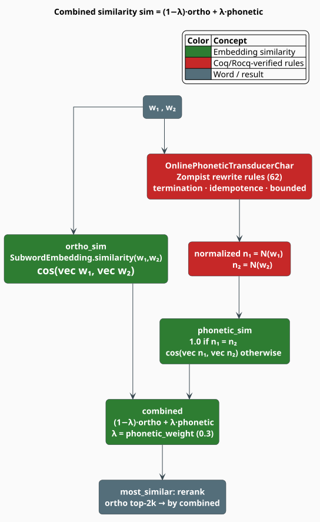

# Phonetic Embeddings

English spelling is a poor guide to English sound. *Phone* and *fone*, *enough* and *enuf*, *knight*
and *night* are pairs a reader hears as identical and a character n-gram model sees as merely
related. [`PhoneticEmbedding`](../../../src/embedding/phonetic.rs) closes that gap: it **normalizes**
words through a formally-verified set of sound-change rewrite rules and blends the similarity of the
normalized forms with ordinary orthographic similarity. The result is an error-tolerant matcher for
homophones, phonetic misspellings, and transcription noise.

> **Scope.** Source of truth: [`src/embedding/phonetic.rs`](../../../src/embedding/phonetic.rs). The
> rewrite rules, the streaming transducer, and their Coq/Rocq proofs come from **liblevenshtein**
> (`liblevenshtein::phonetic`). The orthographic half is the
> [Subword Embedding](overview.md) this type wraps; ranking mechanics are in
> [Similarity](similarity.md).
>
> **No feature gate.** `PhoneticEmbedding` is compiled **unconditionally** — there is no `phonetic`
> Cargo feature. `use libgrammstein::embedding::PhoneticEmbedding;` always works.

## Notation

Every symbol is defined before it is used in a formula.

| Symbol | Meaning |
|---|---|
| $`\Sigma`$ | the character alphabet; $`\Sigma^{*}`$ all finite strings over it |
| $`w, w_1, w_2`$ | words (strings in $`\Sigma^{*}`$) |
| $`\mathcal{N}(w)`$ | the **phonetic normal form** of $`w`$ — the transducer's output |
| $`\mathcal{R}`$ | the rule set; $`\lvert \mathcal{R} \rvert = 62`$ for the shipped Zompist rules |
| $`r = (\pi, \rho, C, \omega)`$ | one rewrite rule: pattern, replacement, context, weight |
| $`\pi \to \rho \,/\, C`$ | "rewrite $`\pi`$ as $`\rho`$ in the environment $`C`$" |
| $`\mathrm{vec}(w)`$ | the subword-composed word vector of $`w`$ (see [Overview](overview.md)) |
| $`\cos(a,b)`$ | cosine similarity, $`\in [-1, 1]`$ |
| $`s_{o}(w_1,w_2)`$ | **orthographic** similarity — $`\cos(\mathrm{vec}(w_1), \mathrm{vec}(w_2))`$ |
| $`s_{p}(w_1,w_2)`$ | **phonetic** similarity — defined by $`(\mathrm{P3})`$ |
| $`\lambda`$ | the phonetic weight (`phonetic_weight`), $`\lambda \in [0,1]`$; default $`0.3`$ |
| $`d`$ | the embedding dimension |
| $`s`$ | the number of subwords in a word |

**Acronyms.** *OOV* — Out-Of-Vocabulary; *FST* — Finite-State Transducer; *SPE* — *The Sound Pattern
of English* (Chomsky & Halle), the source of the rule notation.

## Why sound, and not just spelling

A subword embedding already tolerates *some* misspelling: *runing* and *running* share the character
n-grams $`\texttt{run}`$, $`\texttt{unn}`$, $`\texttt{nin}`$, so their vectors are close. But subword
overlap is an **orthographic** signal, and it fails precisely where English orthography is at its
most treacherous — where two spellings sound the same but *share almost no characters*.

| Pair | Shared subwords | Sounds alike? | Orthographic similarity |
|---|---|---|---|
| *running* / *runing* | many | yes | high — subwords suffice |
| *phone* / *fone* | few ($`\texttt{one}`$, $`\texttt{ne>}`$) | **yes** | mediocre |
| *enough* / *enuf* | almost none | **yes** | low |
| *knight* / *night* | $`\texttt{night}`$ | **yes** | moderate, by luck |
| *though* / *tough* | many ($`\texttt{ough}`$) | **no** | high — *misleadingly* so |

The last row is the sharpest lesson: orthographic similarity is not merely *insufficient*, it is
sometimes *actively wrong*. *Though* and *tough* share four of six letters and sound nothing alike.
Normalizing both to their pronounced forms separates them, and collapses the pairs above them.

## Theory

### Step 1 — the rewrite rules

Normalization is a **context-sensitive rewrite system**, the classical SPE-style phonological rule
[[1]](#references). Each rule is a 4-tuple

```math
r = (\pi,\ \rho,\ C,\ \omega), \qquad\text{written}\qquad \pi \to \rho \;/\; C \tag{P1}
```

where $`\pi \in \Sigma^{*}`$ is the **pattern** to match, $`\rho \in \Sigma^{*}`$ the
**replacement**, $`C`$ the **context** in which the rewrite is licensed, and $`\omega \in \mathbb{R}`$
a **weight** that orders rule application (highest first). The contexts form a small algebra —
`Initial`, `Final`, `BeforeVowel(·)`, `AfterVowel(·)`, `BeforeConsonant(·)`, `AfterConsonant(·)`,
`Anywhere`, and the compounds `And` / `Or` — which is exactly what lets a rule fire in one
environment and stay silent in another:

| Rule | Reading | Effect |
|---|---|---|
| $`\texttt{ph} \to \texttt{f} \;/\; \texttt{Anywhere}`$ | *ph* is always *f* | *phone* $`\to`$ *fone* |
| $`\texttt{kn} \to \texttt{n} \;/\; \texttt{Initial}`$ | *kn* is *n* **only word-initially** | *knight* $`\to`$ *night*; *acknowledge* untouched |
| $`\texttt{gh} \to \texttt{f} \;/\; \texttt{Final}`$ | *gh* is *f* word-finally | *enough* $`\to`$ *enuf* |
| $`\texttt{qu} \to \texttt{kw}`$ | digraph expansion | *queen* $`\to`$ *kween* |

The shipped set, `zompist_rules_char()`, is the concatenation of four families — 45 orthography
rules, 12 vowel-digraph rules, 3 phonetic rules, and 2 test rules, **62** in total.

### Step 2 — normalization as a streaming transduction

Applying $`\mathcal{R}`$ to a word yields the **phonetic normal form**:

```math
\mathcal{N} : \Sigma^{*} \to \Sigma^{*}, \qquad \mathcal{N}(w) = \text{the result of applying } \mathcal{R} \text{ to } w \text{ in descending weight order} \tag{P2}
```

libgrammstein does not implement $`\mathcal{N}`$ by repeated whole-string passes. It drives
liblevenshtein's `OnlinePhoneticTransducerChar`, an **online** (streaming) transducer: characters are
fed one at a time with `feed(c)`, the transducer buffers only as much lookahead as the longest
pattern plus the deepest context requires, and it emits normalized characters as soon as they are
decidable. `finish()` flushes the tail. Because the buffer is bounded by the rule set (not by the
input), memory is $`O(1)`$ in the word length.

> **Formal verification.** The rule system is proved in Coq/Rocq — see liblevenshtein's
> `docs/verification/phonetic/` — for three properties that this module depends on:
> **termination** (rule application always reaches a fixed point), **bounded expansion** (the output
> cannot grow without limit, so the buffer bound is sound), and **idempotence**
> ($`\mathcal{N}(\mathcal{N}(w)) = \mathcal{N}(w)`$, so normalizing twice is normalizing once).
>
> A consequence worth naming: because termination is *proved*, `normalize` needs no runtime fuel.
> The exported constant `DEFAULT_PHONETIC_FUEL = 1000` is available for callers who drive a
> **batch** rewriter themselves; `PhoneticEmbedding::normalize` never consults it.

### Step 3 — phonetic similarity

Two words are phonetically similar to the extent their *normal forms* are. Identical normal forms are
the strongest possible evidence — a genuine homophone — and short-circuit to $`1`$; otherwise the
normalized strings are compared **through the same subword embedding**:

```math
s_{p}(w_1, w_2) =
\begin{cases}
1 & \mathcal{N}(w_1) = \mathcal{N}(w_2) \\[4pt]
\cos\bigl(\mathrm{vec}(\mathcal{N}(w_1)),\ \mathrm{vec}(\mathcal{N}(w_2))\bigr) & \text{otherwise}
\end{cases} \tag{P3}
```

> **There is no second vector table.** This is the design's central economy. The normalized forms are
> embedded by the *orthographic* model — the very same $`E_{\mathrm{word}}`$ and
> $`E_{\mathrm{sub}}`$ matrices. Nothing extra is trained, and nothing extra is stored.
>
> It works because of FastText's OOV property. A normal form such as $`\texttt{enuf}`$ or
> $`\texttt{fon}`$ is almost never a training vocabulary word, so its vector is composed **purely from
> its character n-grams** ([Overview](overview.md#step-3--the-subword-vector-and-the-word-vector)).
> Subword composition is exactly the right tool here: two normal forms that *nearly* agree share most
> of their character n-grams and therefore land close together, giving $`(\mathrm{P3})`$ a graded
> fallback instead of a brittle string equality.

### Step 4 — the blend

The exposed `similarity` is a convex combination of the orthographic and phonetic signals:

```math
\mathrm{sim}(w_1, w_2) = (1 - \lambda)\, s_{o}(w_1, w_2) \;+\; \lambda\, s_{p}(w_1, w_2),
\qquad \lambda \in [0, 1] \tag{P4}
```

with $`\lambda = 0`$ recovering pure orthography, $`\lambda = 1`$ pure phonology, and the shipped
default $`\lambda = 0.3`$ (`DEFAULT_PHONETIC_WEIGHT`) leaning on spelling while letting sound break
ties. Two shortcuts are taken before $`(\mathrm{P4})`$ is ever evaluated: identical words return
$`1`$ immediately, and $`\lambda = 0`$ skips the normalization work entirely.

Since both $`s_o`$ and $`s_p`$ lie in $`[-1, 1]`$ and $`(\mathrm{P4})`$ is convex, the blend does too:

```math
\mathrm{sim}(w_1, w_2) \in [-1, 1] \tag{P5}
```



## The algorithm, literately

The following mirrors [`PhoneticEmbedding::similarity`](../../../src/embedding/phonetic.rs) and
`normalize`. `⟨…⟩` names a refinement expanded below; `▸` marks a side-comment. All operators are
ASCII.

```
function similarity(w1, w2):                      ▸ the public entry point; returns f64
    if w1 == w2: return 1.0                       ▸ fast path — identical strings
    ortho <- orthographic.similarity(w1, w2)      ▸ cos of the two subword vectors
    if phonetic_weight == 0.0: return ortho       ▸ skip ALL normalization work
    phon <- phonetic_similarity(w1, w2)           ▸ (P3)
    return (1 - phonetic_weight) * ortho + phonetic_weight * phon      ▸ (P4)

function phonetic_similarity(w1, w2):             ▸ (P3); also public
    n1 <- normalize(w1)
    n2 <- normalize(w2)
    if n1 == n2: return 1.0                       ▸ homophones — the strongest evidence
    return orthographic.similarity(n1, n2)        ▸ same embedding, applied to normal forms

function normalize(w):                            ▸ (P2), memoized
    if w in cache: return cache[w]                ▸ lock-free DashMap probe
    t <- OnlinePhoneticTransducerChar::new(rules) ▸ fresh transducer per call (see Engineering)
    out <- ""
    for c in chars(w):
        for nc in t.feed(c): out.push(nc)         ▸ emit as soon as context is decidable
    for nc in t.finish(): out.push(nc)            ▸ flush the bounded lookahead buffer
    if size(cache) < max_cache_size: cache[w] <- out
    return out
```

## Ranking

Both nearest-neighbour queries are **rerankers over an orthographic shortlist**, not exhaustive
phonetic searches — a distinction with real consequences for recall.

| Method | Candidate pool | Reranked by |
|---|---|---|
| `most_similar(w, k)` | the $`2k`$ orthographic neighbours of $`w`$ | $`(\mathrm{P4})`$ — the blend |
| `most_similar_phonetically(w, k)` | the $`3k`$ orthographic neighbours of $`\mathcal{N}(w)`$ | $`(\mathrm{P3})`$ — pure phonetics |

Both then sort by descending score and truncate to $`k`$.

> **Recall caveat.** A word can only be *returned* if it first survives the orthographic shortlist.
> A homophone that shares almost no characters with the query — the classic *eye* / *i* — may never
> enter the pool, and no amount of reranking can recover it.
>
> `most_similar_phonetically` mitigates this cleverly: it draws its pool around the **normalized**
> query $`\mathcal{N}(w)`$ rather than around $`w`$ itself, and it draws $`3k`$ candidates rather
> than $`2k`$. Since the normal form is spelled the way the word *sounds*, its orthographic
> neighbourhood is populated by words that sound like it. That is the right query to ask for
> homophones — but it remains a shortlist approximation, not a guarantee.

## Engineering

```rust
pub struct PhoneticEmbedding {
    orthographic: Arc<SubwordEmbedding>,      // shared, immutable
    rules: Vec<RewriteRuleChar>,              // 62 Zompist rules by default
    phonetic_weight: f64,                     // lambda; DEFAULT_PHONETIC_WEIGHT = 0.3
    normalization_cache: DashMap<String, String>, // lock-free; word -> normal form
    max_cache_size: usize,                    // default 100_000
}
```

- **Construction.** `PhoneticEmbedding::new(embedding)` takes the orthographic model by value and
  `Arc`s it; `from_arc(arc)` shares an existing one across several consumers. The builder methods
  `with_rules`, `with_phonetic_weight`, and `with_cache_size` are chainable.
- **`with_phonetic_weight` panics** outside $`[0, 1]`$ — this is a programming error, not a runtime
  condition, so it is asserted rather than returned as an error.
- **Concurrency.** The normalization cache is a `DashMap`: lock-free concurrent get and insert,
  bounded by a simple length gate (not a strict LRU). The weight matrices behind the `Arc` are
  immutable after training. The type carries explicit `unsafe impl Send`/`Sync`, which are sound
  because every field is itself `Send + Sync`.
- **`Clone` gives a fresh, empty cache** — deliberately, matching `SubwordEmbedding`. Clone the
  handle cheaply; expect to re-warm.
- **A transducer is constructed per uncached `normalize` call** (it clones the rule vector). The
  cache is what keeps this off the hot path; a workload that normalizes many *distinct* words and
  exceeds `max_cache_size` will feel it.

### Complexity

Let $`R = \lvert \mathcal{R} \rvert = 62`$ and $`L`$ be the longest rule pattern (a small constant).

| Operation | Cost | Notes |
|---|---|---|
| `normalize` (cache hit) | $`O(1)`$ | `DashMap` probe + clone |
| `normalize` (miss) | $`O(\lvert w \rvert \cdot R \cdot L)`$ | one streaming pass; $`O(1)`$ buffer |
| `phonetic_similarity` | $`O(\text{normalize} + s\,d)`$ | two normalizations, one cosine |
| `similarity` | $`O(\text{normalize} + s\,d)`$ | plus the orthographic cosine |
| `most_similar(w, k)` | $`O(\lvert V \rvert\, d \;+\; k\,(s\,d + \text{normalize}))`$ | **full vocabulary scan** in the shortlist step |

The vocabulary scan dominates the neighbour queries; the phonetic machinery is comparatively free.

## Usage

```rust
use libgrammstein::embedding::{PhoneticEmbedding, SubwordEmbedding};

// Wrap a trained orthographic model. Default: 62 Zompist rules, lambda = 0.3.
let phonetic = PhoneticEmbedding::new(embedding).with_phonetic_weight(0.4);

// Homophones normalize to the same form and score 1.0 phonetically…
let sound_alike = phonetic.phonetic_similarity("phone", "fone");

// …while the blended score still respects spelling (P4).
let blended = phonetic.similarity("phone", "fone");

// Inspect the normal form directly.
println!("enough -> {}", phonetic.normalize("enough"));

// Nearest neighbours, blended and purely phonetic.
let mixed: Vec<(String, f64)> = phonetic.most_similar("knight", 10);
let homophones: Vec<(String, f64)> = phonetic.most_similar_phonetically("knight", 10);

println!("phonetic={sound_alike:.3} blended={blended:.3}");
println!("mixed[0]={:?} homophones[0]={:?}", mixed.first(), homophones.first());
```

Custom rule sets replace the default entirely (and clear the cache):

```rust
use liblevenshtein::phonetic::orthography_rules_char;

// Only the 45 orthography rules — no vowel-digraph or phonetic rules.
let ortho_only = PhoneticEmbedding::new(embedding).with_rules(orthography_rules_char());
```

## Tuning $`\lambda`$

| $`\lambda`$ | Behavior | Use when |
|---|---|---|
| $`0.0`$ | pure orthography (phonetic path skipped) | a baseline, or to A/B the phonetic contribution |
| $`0.2`$–$`0.3`$ | spelling-led, sound breaks ties | **the default**; general text, typo tolerance |
| $`0.5`$ | equal weighting | mixed spelling/transcription noise |
| $`0.7`$–$`1.0`$ | sound-led | ASR output, phonetic search, homophone retrieval |

Raise $`\lambda`$ as the *source* of the error moves from the keyboard toward the ear.

## References

1. N. Chomsky & M. Halle (1968). *The Sound Pattern of English.* Harper & Row. — the origin of the
   $`\pi \to \rho \,/\, C`$ rule notation used in $`(\mathrm{P1})`$.
2. M. Rosenfelder. *The Sound Change Applier (SCA).* zompist.com — the rule formalism the shipped
   rule set is named for. [zompist.com/sca2.html](https://www.zompist.com/sca2.html)
3. L. Philips (1990). *Hanging on the Metaphone.* Computer Language 7(12), 39–43. — the classic
   phonetic-normalization baseline that $`(\mathrm{P2})`$ generalizes.
4. P. Bojanowski, E. Grave, A. Joulin & T. Mikolov (2017). *Enriching word vectors with subword
   information* (FastText). TACL 5, 135–146.
   [doi:10.1162/tacl_a_00051](https://doi.org/10.1162/tacl_a_00051) — why $`\mathcal{N}(w)`$ has a
   vector even though it is OOV.
5. M. Mohri (1997). *Finite-state transducers in language and speech processing.* Computational
   Linguistics 23(2), 269–311. [aclanthology:J97-2003](https://aclanthology.org/J97-2003/) — the
   transducer framework behind the streaming normalizer.

## See also

- [Subword Embeddings](overview.md) — the orthographic model this wraps
- [Similarity](similarity.md) — cosine, `most_similar`, and analogies on the base model
- [BPE & Subword Extraction](bpe.md) — how $`\mathrm{vec}(\mathcal{N}(w))`$ is composed
- [OOV Handling](../hybrid/oov-handling.md) — the other half of error tolerance
- [Embedding API reference](../../api/embedding.md) — the full method surface
