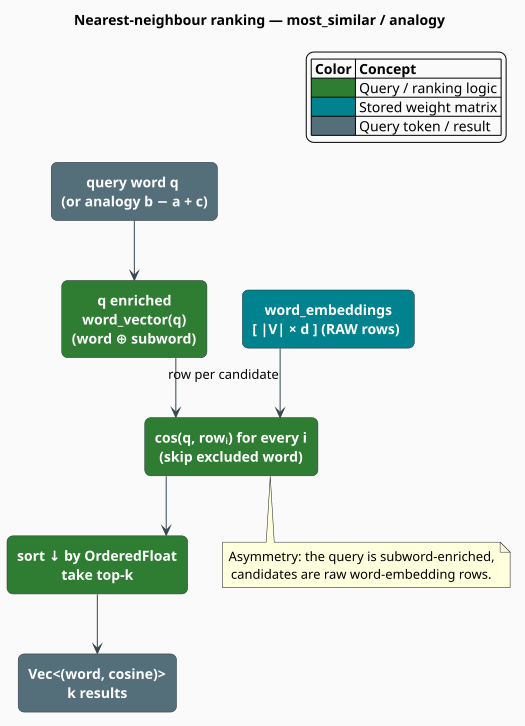

# Similarity, Ranking & Analogies

Once a [`SubwordEmbedding`](overview.md) is trained, its value is realized through **geometry**:
words used in similar contexts sit close together, so nearest-neighbour search surfaces synonyms,
vector arithmetic solves analogies, and cosine scores feed the [hybrid model](../hybrid/interpolation.md).
This document specifies the exact similarity metric, the ranking routines, and one subtle
asymmetry in how queries are scored against the vocabulary — all faithful to the shipped API.

> **Scope.** Source of truth: [`src/embedding/model.rs`](../../../src/embedding/model.rs). Vector
> composition is in [Subword Embeddings](overview.md); phonetic re-ranking on top of these scores is
> in [Phonetic Embeddings](phonetic.md).

## Notation

| Symbol | Meaning |
|---|---|
| $`q`$ | the query word |
| $`v_q`$ | the query's **enriched** vector, `word_vector(q)` |
| $`V`$ | the in-vocabulary word set; $`\lvert V \rvert`$ its size |
| $`E_{\mathrm{word}}[i]`$ | the $`i`$-th **raw** row of the word-embedding matrix |
| $`\cos(a,b)`$ | cosine similarity between vectors $`a`$ and $`b`$ |
| $`v_a, v_b, v_c`$ | enriched vectors of the analogy inputs $`a, b, c`$ |

**Acronyms.** *OOV* — Out-Of-Vocabulary; *k-NN* — k-Nearest-Neighbours; *GPU* — Graphics
Processing Unit.

## The metric: cosine similarity

libgrammstein compares vectors by **cosine similarity** — the cosine of the angle between them,
which measures *direction* and ignores magnitude:

```math
\cos(a, b) = \frac{a \cdot b}{\lVert a \rVert\,\lVert b \rVert}
= \frac{\sum_i a_i b_i}{\sqrt{\sum_i a_i^2}\,\sqrt{\sum_i b_i^2}} \tag{C1}
```

The value lies in $`[-1, 1]`$: $`1`$ means identical direction, $`0`$ orthogonal (unrelated), and
$`-1`$ opposite. The implementation guards the degenerate case — if either operand has zero norm it
returns $`0`$ rather than dividing by zero.

> **Cosine, not Euclidean.** The model scores exclusively with $`(\mathrm{C1})`$. Euclidean
> distance $`\lVert a - b \rVert`$ is a valid alternative metric in general, but it is *not* part of
> the `SubwordEmbedding` surface; because `word_vector` does not L2-normalize
> (see [Subword Embeddings](overview.md)), cosine — which normalizes internally — is the
> length-robust choice the code standardizes on.

## Ranking routines

### `most_similar` — and the query/candidate asymmetry

`most_similar(q, k)` returns the $`k`$ in-vocabulary words most similar to $`q`$. It computes the
**enriched** query vector $`v_q = \mathrm{word\_vector}(q)`$ (word row averaged with subword mean),
then scores it against each **raw** row of $`E_{\mathrm{word}}`$:

```math
\mathrm{most\_similar}(q, k) = \underset{i \,:\, \mathrm{word}(i) \neq q}{\text{top-}k}\ \cos\!\bigl(v_q,\ E_{\mathrm{word}}[i]\bigr) \tag{C2}
```

> **Note the asymmetry.** The query is subword-**enriched**, but the candidates are the **raw**
> word-embedding rows $`E_{\mathrm{word}}[i]`$ — *not* each candidate's own `word_vector`. This
> keeps the scan to a single contiguous matrix (fast, cache-friendly) at the cost of a slight
> inconsistency between the two sides. `similarity(w1, w2)` has no such asymmetry: it enriches both
> operands, i.e. $`\cos(\mathrm{word\_vector}(w_1), \mathrm{word\_vector}(w_2))`$.

`most_similar_to_vector(v, k, exclude)` is the underlying primitive: it ranks all rows against an
arbitrary vector $`v`$, optionally skipping one word (used by `most_similar` to drop the query).

### `analogy` — vector arithmetic

Analogies exploit the near-linear structure of the space ("king is to man as queen is to woman").
`analogy(a, b, c, k)` forms the target vector and returns its nearest neighbours, excluding the
three inputs:

```math
r = v_b - v_a + v_c, \qquad
\mathrm{analogy}(a,b,c,k) = \underset{w \notin \{a,b,c\}}{\text{top-}k}\ \cos(v_w, r) \tag{C3}
```

> **Argument order matters.** The **first** argument $`a`$ is *subtracted*. To solve the canonical
> $`\text{king} - \text{man} + \text{woman} \approx \text{queen}`$, call
> `analogy("man", "king", "woman", k)` — i.e. $`a =`$ man, $`b =`$ king, $`c =`$ woman, giving
> $`r = v_{\text{king}} - v_{\text{man}} + v_{\text{woman}}`$.
> Internally it over-fetches ($`k+3`$) then filters the inputs, so a full $`k`$ results remain.

### `sentence_vector`

`sentence_vector(words)` returns the mean of the words' vectors — the empty slice yields a zero
vector. This is the context vector the [hybrid model](../hybrid/interpolation.md) consumes; see
equation $`(\mathrm{E4})`$ in [Subword Embeddings](overview.md).



## The algorithm, literately

The following mirrors [`SubwordEmbedding::most_similar_to_vector`](../../../src/embedding/model.rs)
and `analogy`. All operators inside the fence are ASCII.

```
function most_similar_to_vector(v, k, exclude):        ▸ the ranking primitive
    scores <- [ ]
    for i, row in enumerate(word_embeddings.rows):      ▸ RAW rows E_word[i]
        if exclude is Some(word) and idx_to_word[i] == word: continue
        scores.push( (i, cosine(v, row)) )              ▸ OrderedFloat wraps NaN-free f32
    sort scores by score descending                     ▸ OrderedFloat total order
    return [ (idx_to_word[i], s) for (i, s) in scores[0 .. k] ]

function most_similar(q, k):
    v_q <- word_vector(q)                               ▸ ENRICHED query, eq (C2)
    return most_similar_to_vector(v_q, k, exclude = q)

function analogy(a, b, c, k):
    r <- word_vector(b) - word_vector(a) + word_vector(c)   ▸ eq (C3)
    results <- most_similar_to_vector(r, k + 3, exclude = None)
    drop from results any word in { a, b, c }
    return results[0 .. k]
```

## Engineering

### The public similarity surface

Every method below exists on `SubwordEmbedding`; there is no `has_word`, `doesnt_match`,
`batch_similarity`, or approximate-index builder — those are **not** part of the API.

| Method | Returns | Notes |
|---|---|---|
| `word_vector(w)` | `Array1<f32>` | enriched, **cached** (see [overview](overview.md)) |
| `word_vector_uncached(w)` | `Array1<f32>` | same value, no cache read/write |
| `similarity(w1, w2)` | `f32` | $`\cos`$ of two enriched vectors |
| `most_similar(w, k)` | `Vec<(String, f32)>` | enriched query vs raw rows, eq $`(\mathrm{C2})`$ |
| `most_similar_to_vector(v, k, exclude)` | `Vec<(String, f32)>` | ranking primitive |
| `analogy(a, b, c, k)` | `Vec<(String, f32)>` | $`v_b - v_a + v_c`$, eq $`(\mathrm{C3})`$ |
| `sentence_vector(&[&str])` | `Array1<f32>` | mean of word vectors |
| `contains(w)` | `bool` | vocabulary membership (there is **no** `has_word`) |
| `word_index(w)` / `index_to_word(i)` | `Option<..>` | id lookups |
| `embedding_by_index(i)` | `Option<ArrayView1<f32>>` | a raw row, no enrichment |
| `vocab()` / `vocab_size()` / `dim()` / `bucket_count()` | — | model geometry |
| `clear_cache()` | `()` | empty the vector cache |

### Ranking mechanics and complexity

Ranking wraps each score in `ordered_float::OrderedFloat<f32>` to obtain a total order for
`sort_by`, then keeps the top $`k`$. A full ranking scans the whole `word_embeddings` matrix:

| Operation | Cost |
|---|---|
| `similarity` | $`O(d)`$ — two enriched vectors + one dot product |
| `most_similar` / `analogy` | $`O(\lvert V \rvert\,d)`$ scan + $`O(\lvert V \rvert \log \lvert V \rvert)`$ sort |
| `sentence_vector` ($`m`$ words) | $`O(m\,d)`$ |

For repeated queries, the `word_vector` cache (a lock-free `DashMap`, default `100_000` entries)
amortizes vector recomputation; `most_similar` still pays the full matrix scan each call.

### Optional GPU acceleration (`gpu` feature)

Building with the `gpu` feature compiles a `wgpu`-backed acceleration surface for the expensive
$`O(\lvert V \rvert\,d)`$ steps. These operate on **raw `f32` slices**, not on `SubwordEmbedding`
directly (there is no `to_gpu()` method):

- `GpuContext` — device/queue acquisition;
- `GpuSimilaritySearch::new(&ctx, dim)` then `.compute(matrix, query)` — batched cosine/dot scores
  of a query against a flattened matrix;
- `GpuAccelerator::new(dim)` — a higher-level façade exposing `similarity_search`,
  `batch_dot_product`, and `sigmoid`.

A typical pattern is to flatten `word_embeddings` once and score queries against it on-device; the
CPU path above remains the default and requires no feature flag.

## Usage

```rust
use libgrammstein::embedding::SubwordEmbedding;

// A model trained or loaded beforehand (load requires the `serde-extras` feature).
# fn demo(model: &SubwordEmbedding) {
// Nearest neighbours of a word.
let similar = model.most_similar("computer", 5);       // Vec<(String, f32)>
for (word, score) in &similar {
    println!("{word}: {score:.4}");
}

// Pairwise similarity (both operands enriched).
let s = model.similarity("dog", "cat");

// Analogy: king - man + woman ~= queen  =>  a is subtracted.
let answers = model.analogy("man", "king", "woman", 3);
println!("king - man + woman = {:?}", answers.first());

// A context (sentence) vector for downstream scoring.
let ctx = model.sentence_vector(&["the", "quick", "brown"]);
let _ = (s, ctx);
# }
```

## References

1. T. Mikolov, I. Sutskever, K. Chen, G. Corrado & J. Dean (2013). *Distributed representations of
   words and phrases and their compositionality* (linear analogies, negative sampling). NeurIPS 26.
   [arXiv:1310.4546](https://arxiv.org/abs/1310.4546)
2. P. Bojanowski, E. Grave, A. Joulin & T. Mikolov (2017). *Enriching word vectors with subword
   information* (FastText). TACL 5, 135–146.
   [doi:10.1162/tacl_a_00051](https://doi.org/10.1162/tacl_a_00051)

## See also

- [Subword Embeddings](overview.md) — how $`v_q`$ is composed and cached
- [Phonetic Embeddings](phonetic.md) — re-ranking these scores by pronunciation
- [Hybrid Interpolation](../hybrid/interpolation.md) — cosine scores feeding language-model fusion
- [Embedding API reference](../../api/embedding.md) — the complete method surface
