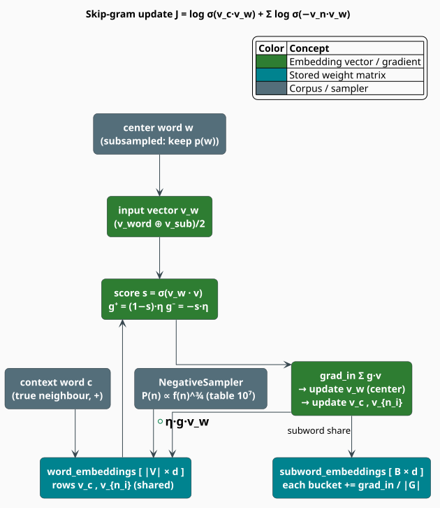

# Skip-gram Training with Negative Sampling

libgrammstein learns its word and subword matrices with the **skip-gram** objective and
**negative sampling** — the word2vec training recipe [[1]](#references), extended FastText-style
[[2]](#references) so that each update also nudges the center word's character-n-gram buckets.
This document derives the objective, states the sampling and scheduling formulae exactly as the
code computes them, and gives literate pseudocode that mirrors the real updater — including the
ways the shipped trainer simplifies the textbook two-matrix model.

> **Scope.** Source of truth: [`src/embedding/trainer.rs`](../../../src/embedding/trainer.rs). The
> matrices being trained live in [`src/embedding/model.rs`](../../../src/embedding/model.rs) (see
> [Subword Embeddings](overview.md)); the subword helpers are in
> [`src/embedding/bpe.rs`](../../../src/embedding/bpe.rs) (see [BPE & Subword Extraction](bpe.md)).

## Notation

| Symbol | Meaning |
|---|---|
| $`w`$ | the **center** (target) word of a training window |
| $`c`$ | a true **context** word within the window of $`w`$ |
| $`n_i`$ | the $`i`$-th sampled **negative** (noise) word |
| $`k`$ | number of negative samples per positive (`neg_samples`; default $`5`$) |
| $`v_w`$ | the center word's **input vector** — word row averaged with its subword mean |
| $`v_c, v_{n_i}`$ | raw rows of the shared `word_embeddings` matrix for $`c`$ and $`n_i`$ |
| $`\sigma(x)`$ | the logistic sigmoid $`1/(1+e^{-x})`$ |
| $`f(w)`$ | corpus count of $`w`$; $`z(w) = f(w)/\text{total}`$ its relative frequency |
| $`P_n(w)`$ | the negative-sampling (noise) distribution |
| $`\eta_e`$ | the learning rate used during epoch $`e`$ of $`E`$ total epochs |
| $`t`$ | the frequent-word subsampling threshold (`subsample_threshold`; default $`10^{-4}`$) |

**Acronyms.** *SGD* — Stochastic Gradient Descent; *NS* — Negative Sampling; *OOV* —
Out-Of-Vocabulary.

## What & why

Skip-gram turns raw text into a supervised task: **given a center word, predict the words around
it.** For the window *"the quick [brown] fox jumps"* with center *brown*, the positive examples are
$`(\text{brown}, \text{the})`$, $`(\text{brown}, \text{quick})`$, $`(\text{brown}, \text{fox})`$,
$`(\text{brown}, \text{jumps})`$. Optimizing this forces words that share contexts to acquire
similar vectors — exactly the geometry [Similarity](similarity.md) later exploits.

The exact skip-gram likelihood uses a softmax over the *entire* vocabulary:

```math
\mathbb{P}(c \mid w) = \frac{\exp(v_c^{\top} v_w)}{\sum_{w' \in V} \exp(v_{w'}^{\top} v_w)} \tag{S1}
```

The denominator of $`(\mathrm{S1})`$ costs $`O(\lvert V \rvert)`$ per example — hopeless for a
million-word vocabulary. **Negative sampling** replaces it with a handful of cheap binary decisions.

## Theory

### The negative-sampling objective

Instead of normalizing over all words, NS trains a logistic classifier to separate the *true*
context word from $`k`$ random *noise* words. Per $`(w, c)`$ pair, the objective maximized is:

```math
J(w, c) = \log \sigma\!\bigl(v_c^{\top} v_w\bigr)
\;+\; \sum_{i=1}^{k} \mathbb{E}_{\,n_i \sim P_n}\!\left[\log \sigma\!\bigl(-\,v_{n_i}^{\top} v_w\bigr)\right] \tag{S2}
```

The first term pushes $`v_c`$ toward $`v_w`$; each noise term pushes $`v_{n_i}`$ away. Because
$`\sigma(-x) = 1 - \sigma(x)`$, $`(\mathrm{S2})`$ is the log-likelihood of a binary label
(1 for the real pair, 0 for noise), and its gradient with respect to any scored vector $`v`$ has
the tidy form $`(\,\text{label} - \sigma(v^{\top} v_w)\,)\,v_w`$.

### The noise distribution

Negatives are drawn not from the raw unigram distribution but from it raised to the $`3/4`$ power —
the empirically superior choice from word2vec, which lifts rare words without over-representing
them:

```math
P_n(w) = \frac{f(w)^{3/4}}{\sum_{w'} f(w')^{3/4}} \tag{S3}
```

The sampler that draws the negatives excludes the current positive context word.

### Subsampling of frequent words

Before a center word is used, it is randomly **kept** with a probability that shrinks for very
frequent words (so *the*, *of*, *and* do not dominate training):

```math
P_{\mathrm{keep}}(w) = \left(\sqrt{\frac{z(w)}{t}} + 1\right)\frac{t}{z(w)},
\qquad z(w) = \frac{f(w)}{\text{total tokens}} \tag{S4}
```

For a rare word $`P_{\mathrm{keep}}`$ exceeds $`1`$ (always kept); for a very common word it falls
well below $`1`$.

### Learning-rate schedule

The rate decays **linearly per epoch** from the initial $`\eta_0`$ (`learning_rate`, default
$`0.05`$) — there is no separate minimum floor:

```math
\eta_e = \eta_0 \left(1 - \frac{e}{E}\right), \qquad e = 0, 1, \dots, E-1 \tag{S5}
```

so $`\eta_0`$ at the first epoch down to $`\eta_0/E`$ at the last. The **window size** is itself
randomized each center word — $`\texttt{window} \sim \mathrm{Uniform}\{1, \dots, \texttt{window_size}\}`$ —
which effectively weights nearer context words more heavily.

### One shared matrix, not two

Canonical word2vec keeps **two** matrices: an input matrix for center words and a separate output
matrix for context/negative words. libgrammstein uses a **single** `word_embeddings` matrix for
both roles, plus the `subword_embeddings` table for the center word's n-grams. Concretely, the
center's **input vector** is the FastText-style average

```math
v_w = \tfrac{1}{2}\bigl(E_{\mathrm{word}}[w] + v_{\mathrm{sub}}(w)\bigr) \tag{S6}
```

while the scored context/negative vectors $`v_c, v_{n_i}`$ are **raw rows** of that same
`word_embeddings` matrix. Gradients then flow to (i) the context/negative rows, (ii) the center's
own row, and (iii) the center's subword buckets. This is a deliberate simplification — cheaper and
adequate for the crate's OOV-coverage goal — and it is why the center row and the rows it is scored
against come from one matrix.



## The algorithm, literately

The following mirrors [`EmbeddingTrainer::train_epoch_on_sentences`](../../../src/embedding/trainer.rs)
and `skipgram_update`. All operators inside the fence are ASCII; `lr` is $`\eta_e`$ for the epoch.

```
function train_epoch(sentences, model, lr):            ▸ sequential; holds &mut model
    for sentence in sentences:
        idx <- [ vocab_index(word) for word in sentence ]   ▸ None if OOV / below min_count
        for pos, center in enumerate(idx):
            if center is None: continue
            if random() > keep_prob(center): continue  ▸ subsampling, eq (S4)
            window <- random_int(1 .. window_size)     ▸ dynamic window
            lo <- max(pos - window, 0); hi <- min(pos + window + 1, len)
            for cpos in lo .. hi:
                if cpos == pos: continue
                ctx <- idx[cpos]
                if ctx is None: continue
                skipgram_update(model, center, ctx, word_at(pos), lr)

function skipgram_update(model, center, ctx, center_word, lr):
    v_w     <- input_vector(model, center, center_word) ▸ (E_word[center] + subword_mean)/2, eq (S6)
    negs    <- sampler.sample(k, exclude = ctx)         ▸ P_n proportional to f^0.75, eq (S3)
    grad_in <- zeros(d)

    ⟨score and update the positive context⟩            ▸ label 1
    for n in negs: ⟨score and update a negative⟩         ▸ label 0

    word_embeddings[center] += grad_in                  ▸ update the center's own row
    ⟨distribute grad_in across subword buckets⟩

⟨score and update the positive context⟩ ≡
    v_c <- word_embeddings[ctx]
    s   <- sigmoid( dot(v_w, v_c) )
    g   <- (1 - s) * lr                                 ▸ (label - s) * lr with label = 1
    word_embeddings[ctx] += g * v_w
    grad_in <- grad_in + g * v_c

⟨score and update a negative⟩ ≡
    v_n <- word_embeddings[n]
    s   <- sigmoid( dot(v_w, v_n) )
    g   <- (0 - s) * lr                                 ▸ = -s * lr,  label = 0
    word_embeddings[n] += g * v_w
    grad_in <- grad_in + g * v_n

⟨distribute grad_in across subword buckets⟩ ≡
    G <- extract_subwords(center_word, min_subword_len, max_subword_len)
    if G is not empty:
        share <- grad_in / |G|
        for g in G:
            subword_embeddings[ hash_subword(g, B) ] += share
```

The update sign is **ascent** on $`(\mathrm{S2})`$: the learning rate and sign are folded into `g`,
and `update_word_embedding` adds `g * v_w` to a row. Subword buckets receive an equal share of the
center's incoming gradient, which is what ties morphologically related words together.

## Engineering

### `EmbeddingConfig`

```rust
pub struct EmbeddingConfig {
    pub dim: usize,                 // 100   — d
    pub window_size: usize,         // 5     — max context radius (window is sampled 1..=this)
    pub min_count: u64,             // 5     — vocabulary frequency floor
    pub neg_samples: usize,         // 5     — k
    pub epochs: usize,              // 5     — E
    pub learning_rate: f32,         // 0.05  — eta_0
    pub bucket_count: usize,        // 2_000_000 — B
    pub min_subword_len: usize,     // 3
    pub max_subword_len: usize,     // 6
    pub subsample_threshold: f32,   // 1e-4  — t
    pub batch_size: usize,          // 10_000 — prefetch batch
}
```

### The negative sampler

`NegativeSampler` precomputes an **alias-free lookup table** of $`10^{7}`$ slots filled
proportionally to $`f(w)^{3/4}`$; sampling is then a single $`O(1)`$ indexed read. `sample_negatives`
rejects any draw equal to the excluded positive context word.

### Weight initialization

`initialize_embeddings` seeds a deterministic RNG (`StdRng::seed_from_u64(42)`) and fills **both**
matrices with $`\mathrm{Uniform}(-0.5, 0.5) \cdot \tfrac{1}{d}`$, so initial vectors are small and
reproducible.

### Training entry points

| Method | Corpus handling | Use when |
|---|---|---|
| `train(reader)` | buffers all sentences in memory, then multi-epoch | corpus fits in RAM |
| `train_streaming(\|\| reader)` | re-streams the corpus once **per epoch** | large corpora (>500 MB) |
| `train_with_progress(reader, tx)` | like `train`, emits `EmbeddingProgress` on a channel | UIs / progress bars |
| `train_continued(model, start_epoch, reader)` | resumes an existing model's remaining epochs | checkpoint resume |

`train_streaming` runs Pass 1 to build the vocabulary (streaming word counts) and then one streamed
pass per epoch; `train_continued` recovers the ephemeral corpus statistics (the noise table and
subsampling counts) with a single pass **aligned to the loaded model's vocabulary order**, so
embedding-row indices stay consistent, and resumes the schedule $`(\mathrm{S5})`$ at `start_epoch`.

### Honest performance notes

- **The updater is currently single-threaded.** `skipgram_update` takes `&mut SubwordEmbedding`, so
  a training epoch runs sequentially; the source imports Rayon behind
  `#[allow(unused_imports)]` and notes that thread-safe model updates are needed before the loop can
  be parallelized. Parallelism today is in the *vocabulary* and *BPE* passes, not the SGD loop.
- **Loss is not computed.** `EmbeddingProgress::loss` is an `Option<f32>` that the trainer leaves
  `None`; monitor progress via `words_processed` / `epoch`, not a loss curve.

### Complexity

Per epoch the cost is $`O(C \cdot \bar{w} \cdot (k+1) \cdot d)`$ where $`C`$ is the number of kept
center tokens, $`\bar{w}`$ the mean sampled window, $`k`$ the negatives, and $`d`$ the dimension;
each `skipgram_update` additionally touches $`\lvert G(\cdot) \rvert`$ subword buckets.

## Usage

```rust
use libgrammstein::embedding::{EmbeddingTrainerBuilder, SubwordEmbedding};
use libgrammstein::corpus::PlaintextReader;

// The fluent builder mirrors EmbeddingConfig; unset fields keep their defaults.
let model: SubwordEmbedding = EmbeddingTrainerBuilder::new()
    .dim(100)
    .window_size(5)
    .min_count(5)
    .neg_samples(5)
    .epochs(5)
    .learning_rate(0.05)
    .train(PlaintextReader::from_file("corpus.txt")?)?;

assert!(model.vocab_size() > 0);
# Ok::<(), libgrammstein::Error>(())
```

For a large corpus, resume-safe streaming avoids buffering the whole thing:

```rust
use libgrammstein::embedding::EmbeddingTrainerBuilder;
use libgrammstein::corpus::PlaintextReader;
use std::path::Path;

let path = Path::new("big-corpus.txt");
let model = EmbeddingTrainerBuilder::new()
    .dim(200)
    .epochs(5)
    .train_streaming(|| PlaintextReader::from_file(path))?;  // one streamed pass per epoch
# Ok::<(), libgrammstein::Error>(())
```

## References

1. T. Mikolov, I. Sutskever, K. Chen, G. Corrado & J. Dean (2013). *Distributed representations of
   words and phrases and their compositionality* (skip-gram with negative sampling). NeurIPS 26.
   [arXiv:1310.4546](https://arxiv.org/abs/1310.4546)
2. P. Bojanowski, E. Grave, A. Joulin & T. Mikolov (2017). *Enriching word vectors with subword
   information* (FastText). TACL 5, 135–146.
   [doi:10.1162/tacl_a_00051](https://doi.org/10.1162/tacl_a_00051)

## See also

- [Subword Embeddings](overview.md) — the matrices this trainer optimizes
- [BPE & Subword Extraction](bpe.md) — `extract_subwords` / `hash_subword` used in the update
- [Similarity](similarity.md) — evaluating the learned geometry
- [Embedding Training guide](../../training/embedding.md) — end-to-end training workflow
- [Hyperparameters](../../training/hyperparameters.md) — tuning $`\eta_0`$, $`k`$, window, epochs
