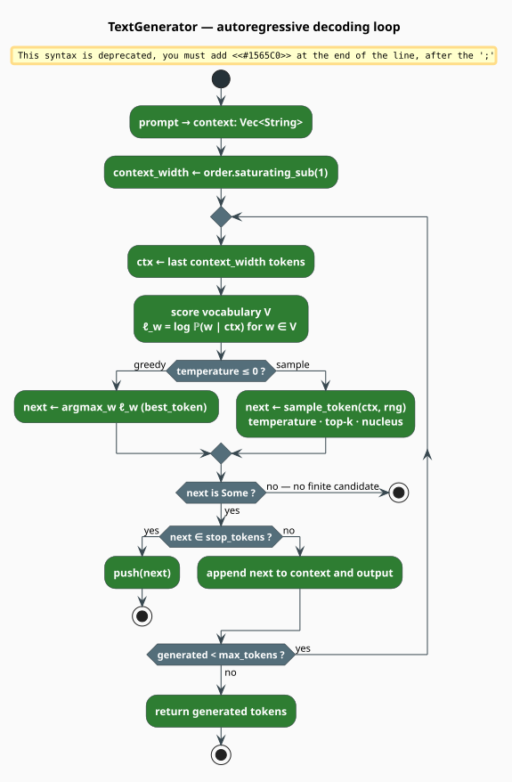
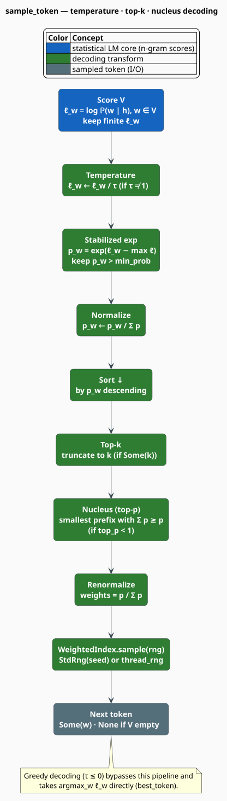

# Text Generation

`TextGenerator` produces text one token at a time from a trained n-gram language model, sampling
each next token from the model's next-word distribution. It implements the four standard decoding
strategies — greedy, temperature scaling, top-k, and nucleus (top-p) sampling — and composes them
into a single configurable pipeline. This document explains *what* autoregressive generation is,
the *mathematics* of each sampling strategy, and *how libgrammstein implements* the decoder.

> **Scope.** Source of truth: [`src/generation/sampler.rs`](../../../src/generation/sampler.rs)
> and [`src/generation/mod.rs`](../../../src/generation/mod.rs). The generator is generic over an
> [`NgramModel<D>`](../ngram/overview.md) whose probabilities come from
> [Modified Kneser-Ney](../ngram/modified-kneser-ney.md); for how `log_prob` is computed see the
> [Query API](../ngram/query-api.md). Nucleus sampling is due to Holtzman et al.
> [[1]](#references) and top-k sampling to Fan et al. [[2]](#references).

## What & why

A language model assigns a probability to the next token given a history:
$`\mathbb{P}(w \mid h)`$. **Autoregressive generation** turns that predictive ability into a
generative one — repeatedly score the vocabulary, choose a token, append it to the history, and
continue:

1. start from a prompt (the initial context);
2. compute $`\log \mathbb{P}(w \mid h)`$ for every vocabulary word $`w`$;
3. select a next token with a decoding strategy;
4. append it to the context;
5. repeat until a stop condition fires.

The choice of *how* to select in step 3 is what distinguishes a repetitive, deterministic decoder
from a fluent, varied one. libgrammstein exposes greedy selection and three sampling knobs that
can be combined freely.

## Notation

Every symbol below is defined before it is used in a formula.

| Symbol | Meaning |
|---|---|
| $`w`$ | a candidate next token |
| $`h`$ | the context (history) tokens |
| $`V`$ | the model vocabulary (its unigrams) |
| $`\lvert V \rvert`$ | vocabulary size |
| $`n`$ | the n-gram order (`model.order()`) |
| $`\ell_w`$ | the log probability $`\log \mathbb{P}(w \mid h)`$ |
| $`\tau`$ | temperature (`temperature`) |
| $`k`$ | top-k cutoff (`top_k`) |
| $`p`$ | nucleus threshold (`top_p`) |
| $`V'`$ | the surviving candidate set after filtering |
| $`w^\star`$ | the greedily selected token |

**Acronyms.** *LM* — Language Model; *top-p* — nucleus sampling; *RNG* — Random Number
Generator; *OOV* — Out-Of-Vocabulary.

## Theory

### Factorization and the n-gram window

The probability of a sequence factorizes by the chain rule into a product of next-token
probabilities:

```math
\begin{array}{lr}
\displaystyle \mathbb{P}(w_1, \dots, w_T) = \prod_{t=1}^{T} \mathbb{P}(w_t \mid w_1, \dots, w_{t-1}) & \text{(G1)}
\end{array}
```

An order-$`n`$ model truncates each history to the previous $`n - 1`$ tokens, so the generator
only ever conditions on a bounded window:

```math
\begin{array}{lr}
\displaystyle \mathbb{P}(w_t \mid w_1, \dots, w_{t-1}) \approx \mathbb{P}(w_t \mid w_{t-n+1}, \dots, w_{t-1}) & \text{(G2)}
\end{array}
```

The window width is $`n - 1`$, computed as `order.saturating_sub(1)` so a degenerate `order == 0`
clamps to $`0`$ rather than underflowing (see [Engineering](#context-window-hardening)).

### The vocabulary

To sample from the next-token distribution the generator must score every candidate, so it needs
the vocabulary. It is extracted once, at construction, by iterating the n-gram trie and keeping
the **unigram** keys — those with no n-gram separator — then cached:

```
function extract_vocabulary(model):                  ▸ cached in TextGenerator::new / from_arc
    vocab <- empty set
    for (key, _) in model.trie().iter_entries():
        if key has no NGRAM_SEPARATOR: vocab.insert(key)   ▸ a unigram
    return vocab as Vec
```

Each generated token costs $`\lvert V \rvert`$ probability queries, and each query is $`O(n)`$
trie look-ups (see [Modified Kneser-Ney](../ngram/modified-kneser-ney.md#complexity)) — not
$`O(\lvert V \rvert)`$ as in a neural softmax — which is what makes n-gram generation cheap.

### Greedy decoding

The simplest strategy always takes the most probable token (`best_token`):

```math
\begin{array}{lr}
\displaystyle w^\star = \arg\max_{w \in V} \log \mathbb{P}(w \mid h) & \text{(G3)}
\end{array}
```

Greedy decoding is deterministic and high-precision but low-diversity; it tends to loop on common
continuations. `generate` selects it whenever $`\tau \le 0`$.

### Temperature scaling

Temperature reshapes the distribution before sampling by dividing the log probabilities by
$`\tau`$ and renormalizing (a softmax over the candidate set):

```math
\begin{array}{lr}
\displaystyle \mathbb{P}_\tau(w \mid h) = \frac{\exp(\ell_w / \tau)}{\sum_{v \in V} \exp(\ell_v / \tau)},
\qquad \ell_w = \log \mathbb{P}(w \mid h) & \text{(G4)}
\end{array}
```

$`\tau < 1`$ sharpens the distribution (more deterministic), $`\tau > 1`$ flattens it (more
random), $`\tau = 1`$ leaves it unchanged, and $`\tau \to 0`$ recovers the greedy $`\arg\max`$.
To evaluate $`(\mathrm{G4})`$ without overflow, the implementation subtracts
$`\max_v (\ell_v/\tau)`$ before exponentiating — the standard log-sum-exp shift — so the largest
exponent is $`0`$.

### Top-k sampling

Top-k keeps only the $`k`$ highest-probability candidates and samples among them, a hard cutoff
that removes the unbounded tail [[2]](#references). Formally it retains

```math
\begin{array}{lr}
\displaystyle V_k = \{\text{the } k \text{ tokens of largest } \mathbb{P}(w \mid h)\} & \text{(G5)}
\end{array}
```

### Nucleus (top-p) sampling

Nucleus sampling adapts the candidate-set size to the model's confidence: it keeps the *smallest*
set of highest-probability tokens whose cumulative mass reaches $`p`$ [[1]](#references):

```math
\begin{array}{lr}
\displaystyle V_p = \arg\min_{V' \subseteq V} \lvert V' \rvert
\quad \text{subject to} \quad \sum_{w \in V'} \mathbb{P}(w \mid h) \ge p & \text{(G6)}
\end{array}
```

When the model is confident (one token dominates) the nucleus is tiny; when it is uncertain the
nucleus widens. The candidates are added in descending-probability order until the running sum
first reaches $`p`$, so the token that crosses the threshold is included.

### Renormalization and the draw

After filtering, the surviving set $`V'`$ is renormalized to a proper distribution and one token
is drawn from it:

```math
\begin{array}{lr}
\displaystyle \tilde{\mathbb{P}}(w) = \frac{\mathbb{P}(w \mid h)}{\sum_{v \in V'} \mathbb{P}(v \mid h)},
\qquad w \sim \mathrm{Categorical}\bigl(\tilde{\mathbb{P}}\bigr) & \text{(G7)}
\end{array}
```

The draw uses a `WeightedIndex` distribution; if the surviving mass is non-positive the generator
falls back to the single highest-probability token.

## The decoder, in pictures

The outer loop windows the context, scores the vocabulary, decodes one token, and tests the stop
conditions before appending and repeating.



Inside the sampling branch, `sample_token` runs the strategies in a fixed order — temperature,
then the stabilized softmax and `min_prob` floor, then sort, then top-k, then nucleus, then a
final renormalization and draw.



## The algorithm, literately

`generate` dispatches on temperature; the greedy and sampling loops share the same context-window
and stop-condition structure. The following mirrors
[`TextGenerator`](../../../src/generation/sampler.rs); `⟨…⟩` names a refinement expanded below.

```
function generate(prompt):                            ▸ public entry point
    if temperature <= 0: return generate_greedy(prompt)
    else:                return generate_sampling(prompt)

function generate_sampling(prompt):
    rng     <- StdRng(seed) if seed is set else thread_rng()
    context <- prompt as Vec<String>
    width   <- order.saturating_sub(1)                ▸ n - 1, clamped (never underflows)
    for _ in 0 .. max_tokens:
        ctx  <- last width tokens of context
        next <- sample_token(ctx, rng)
        ⟨Append or stop⟩
    return generated

⟨Append or stop⟩ ≡
    match next:
        None        -> break                          ▸ no finite candidate remains
        Some(token) ->
            if token in stop_tokens: push token; break
            else:                    append token to context and generated

function sample_token(ctx, rng):
    cand <- [ (w, log_prob(w, ctx)) for w in V ]  keeping finite entries   ▸ score V
    if cand is empty: return None
    if tau != 1: divide every log prob by tau                              ▸ temperature (G4)
    m     <- max log prob in cand                                          ▸ stabilizer
    probs <- [ (w, exp(l - m)) for (w, l) in cand ]  keeping p > min_prob
    if probs is empty: return None
    normalize probs to sum 1
    sort probs by probability, descending
    if top_k = Some(k): truncate probs to k                                ▸ top-k (G5)
    if top_p < 1:       probs <- nucleus_filter(probs)                     ▸ nucleus (G6)
    Z <- sum of probs; if Z <= 0: return first word of probs
    weights <- [ p / Z for (_, p) in probs ]                               ▸ renormalize (G7)
    return probs[ WeightedIndex(weights).sample(rng) ].word

nucleus_filter(probs):                                ▸ probs already sorted descending
    cum <- 0; kept <- []
    for (w, p) in probs:
        cum <- cum + p; kept.push((w, p))
        if cum >= top_p: break
    return kept
```

Greedy decoding replaces `sample_token` with `best_token`, which is the single $`\arg\max`$ of
$`(\mathrm{G3})`$ over the vocabulary and shares the identical windowing and stop logic.

## Engineering

### `GenerationConfig`

```rust
pub struct GenerationConfig {
    pub max_tokens: usize,        // default: 50
    pub temperature: f64,         // default: 1.0   (<= 0 selects greedy)
    pub top_p: f64,               // default: 0.9   (1.0 disables nucleus)
    pub top_k: Option<usize>,     // default: None  (disables top-k)
    pub min_prob: f64,            // default: 1e-10
    pub stop_tokens: Vec<String>, // default: [".", "!", "?"]
    pub seed: Option<u64>,        // default: None
}
```

| Constructor / method | Effect |
|---|---|
| `default()` | nucleus $`p = 0.9`$, $`\tau = 1.0`$, no top-k |
| `greedy()` | $`\tau = 0.0`$ (forces the greedy path), `top_p = 1.0`, `top_k = Some(1)` |
| `nucleus(p)` | nucleus sampling at threshold $`p`$ |
| `with_max_tokens(n)`, `with_temperature(t)`, `with_seed(s)`, `with_stop_tokens(v)` | chainable overrides |

### Context-window hardening

Both loops compute the window width as `self.model.order().saturating_sub(1)`. A degenerate model
reporting `order == 0` would make `order - 1` underflow `usize` and panic in debug builds; the
saturating subtraction clamps the width to $`0`$ so the generator is robust to any reported order.

### Stop conditions

Generation ends when any of three conditions holds: the `max_tokens` budget is exhausted; the
selected token is in `stop_tokens` (it is emitted, then the loop breaks); or no finite candidate
remains (`sample_token` / `best_token` returns `None`).

> **Punctuation in stop tokens.** The defaults `.`, `!`, `?` match *standalone* tokens. If a
> corpus attaches punctuation to words (e.g. it tokenizes `dog.` as one token), a bare `.` is
> never a vocabulary item, so those stops never fire and generation runs to `max_tokens`. Choose
> stop tokens that actually appear in the model's vocabulary.

### Reproducibility

With `seed` set, sampling uses `StdRng::seed_from_u64(seed)`, so the same prompt yields identical
output across runs; otherwise it draws from `thread_rng()`. Greedy decoding is deterministic
regardless of the seed.

### Cost

Per generated token the decoder issues $`\lvert V \rvert`$ `log_prob` queries (each $`O(n)`$ trie
look-ups) and, in the sampling path, an $`O(\lvert V \rvert \log \lvert V \rvert)`$ sort. The
`min_prob` floor (applied to the stabilized $`\exp(\ell_w - m)`$ values) prunes negligible
candidates before sorting.

## Usage

```rust
use std::sync::Arc;
use libgrammstein::corpus::PlaintextReader;
use libgrammstein::generation::{GenerationConfig, TextGenerator};
use libgrammstein::ngram::{NgramEntry, TrainerBuilder};
use libdictenstein::pathmap::PathMapDictionary;

// Train a 3-gram model.
let reader = PlaintextReader::from_file("corpus.txt")?;
let model = TrainerBuilder::new(PathMapDictionary::<NgramEntry>::new())
    .order(3)
    .train(reader)?;

// Share one model across several generators via from_arc (cheap Arc clones).
let model = Arc::new(model);
let greedy   = TextGenerator::from_arc(model.clone(), GenerationConfig::greedy());
let nucleus  = TextGenerator::from_arc(model.clone(), GenerationConfig::nucleus(0.9));
let creative = TextGenerator::from_arc(
    model.clone(),
    GenerationConfig::nucleus(0.95)
        .with_temperature(1.2)
        .with_max_tokens(100)
        .with_seed(42), // reproducible sampling
);

let prompt = ["the", "quick", "brown"];
println!("greedy:   {}", greedy.generate(&prompt).join(" "));   // deterministic
println!("nucleus:  {}", nucleus.generate(&prompt).join(" "));
println!("creative: {}", creative.generate(&prompt).join(" "));
# Ok::<(), libgrammstein::Error>(())
```

A single-owner generator can skip the `Arc` and use `TextGenerator::new(model, config)` directly.

## Choosing a strategy

| Goal | Configuration |
|---|---|
| Deterministic, reproducible output | `GenerationConfig::greedy()` |
| General-purpose generation | `GenerationConfig::nucleus(0.9)` (the default) |
| Creative / varied text | `GenerationConfig::nucleus(0.95).with_temperature(1.2)` |
| Focused / conservative text | `GenerationConfig::nucleus(0.9).with_temperature(0.7)` |
| Hard candidate cap | set `top_k` and `top_p = 1.0` to use top-k alone |

## References

1. A. Holtzman, J. Buys, L. Du, M. Forbes & Y. Choi (2020). *The curious case of neural text
   degeneration* (nucleus / top-p sampling). ICLR.
   [arXiv:1904.09751](https://arxiv.org/abs/1904.09751)
2. A. Fan, M. Lewis & Y. Dauphin (2018). *Hierarchical neural story generation* (top-k sampling).
   ACL, 889–898. [arXiv:1805.04833](https://arxiv.org/abs/1805.04833)

## See also

- [N-gram Overview](../ngram/overview.md) — the model the generator samples from
- [Modified Kneser-Ney](../ngram/modified-kneser-ney.md) — how $`\mathbb{P}(w \mid h)`$ is smoothed
- [Query API](../ngram/query-api.md) — the `log_prob` interface each token scores against
- [Hybrid Interpolation](../hybrid/interpolation.md) — fusing the n-gram with embeddings
